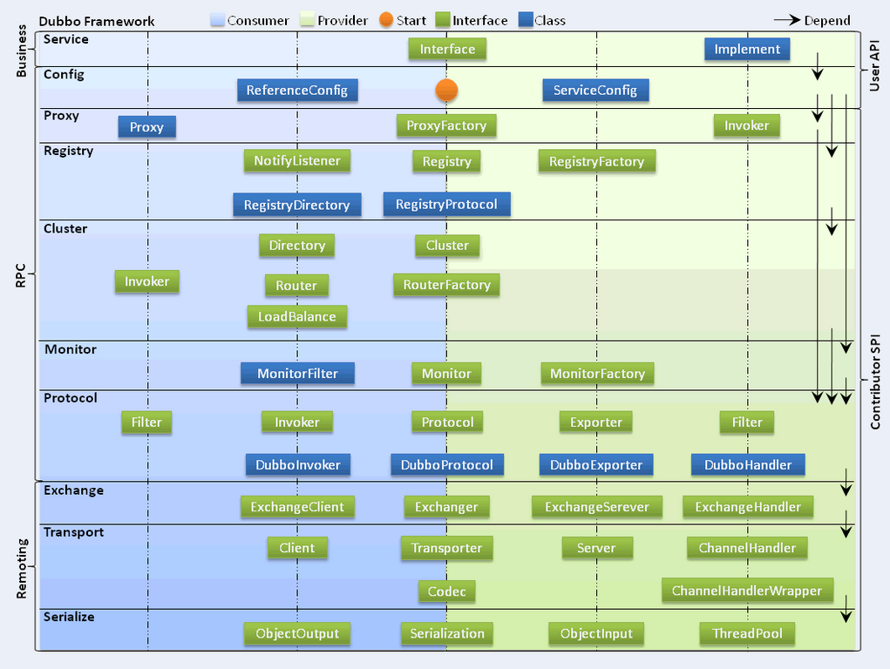

# Dubbo

## dubbo介绍

1. **Dubbo是什么？**

   Dubbo是一个分布式服务框架，致力于提供高性能和透明化的RPC远程服务调用方案，以及SOA服务治理方案。简单的说，dubbo就是个服务框架，如果没有分布式的需求，其实是不需要用的，只有在分布式的时候，才有dubbo这样的分布式服务框架的需求，并且本质上是个服务调用的东东，**说白了就是个远程服务调用的分布式框架（告别Web Service模式中的WSdl，以服务者与消费者的方式在dubbo上注册）**
   其核心部分包含:

   1. 远程通讯: 提供对多种基于长连接的NIO框架抽象封装，包括多种线程模型，序列化，以及“请求-响应”模式的信息交换方式。
   2. 集群容错: 提供基于接口方法的透明远程过程调用，包括多协议支持，以及软负载均衡，失败容错，地址路由，动态配置等集群支持。
   3. 自动发现: 基于注册中心目录服务，使服务消费方能动态的查找服务提供方，使地址透明，使服务提供方可以平滑增加或减少机器。

2. **Dubbo能做什么？**

   1. 透明化的远程方法调用，就像调用本地方法一样调用远程方法，只需简单配置，没有任何API侵入。
   2. 软负载均衡及容错机制，可在内网替代F5等硬件负载均衡器，降低成本，减少单点。
   3. 服务自动注册与发现，不再需要写死服务提供方地址，注册中心基于接口名查询服务提供者的IP地址，并且能够平滑添加或删除服务提供者。

Dubbo采用全Spring配置方式，透明化接入应用，对应用没有任何API侵入，只需用Spring加载Dubbo的配置即可，Dubbo基于Spring的Schema扩展进行加载

## dubbo原理

**dubbo执行流程**

0.start：启动Spring容器时，自动启动dubbo的Provider

1.register：dubbo的Provider在启动后自动会去注册内容。注册的内容包括：

　　　　　　1.1 Provider的IP

　　　　　　1.2 Provider的端口

　　　　　　1.3 Provider对外提供的接口、方法

　　　　　　1.4 dubbo版本号

　　　　　　1.5 访问Provider的协议

2.subscribe：订阅，当Consumer启动时，自动去Registry获取到所有已注册的服务信息

3.notify： 通知， 当Provider的信息发生变化时，自动由Registry向Consumer推送通知

4.invoke： 调用， Consumer调用Provider中的方法

　　　　　　4.1同步请求，消耗一定性能，但是必须是同步请求，因为需要接收调用方法后的结果

5.count： 次数， 每隔2分钟，Provider和Consumer自动向Monitor发送访问次数，Monitor进行统计。

## dubbo协议

Dubbo支持dubbo、rmi、hessian、http、webservice、thrift、redis等多种协议，但是Dubbo官网是推荐我们使用Dubbo协议的。

下面我们就针对Dubbo的每种协议详解讲解，以便我们在实际应用中能够正确取舍。

一、9种协议

### 1、dubbo 协议 (默认)（重要）

1、dubbo 缺省协议 采用单一长连接和NIO异步通讯，适合于小数据量大并发的服务调用，以及服务消费者机器数远大于服务提供者机器数的情况
2、不适合传送大数据量的服务，比如传文件，传视频等，除非请求量很低。

缺省协议，使用基于mina1.1.7+hessian3.2.1的tbremoting交互。

特性

连接个数：单连接
连接方式：长连接
传输协议：TCP
传输方式：NIO异步传输
序列化：Hessian 二进制序列化
适用范围：传入传出参数数据包较小（建议小于100K），消费者比提供者个数多，单一消费者无法压满提供者，尽量不要用dubbo协议传输大文件或超大字符串。
适用场景：常规远程服务方法调用
配置

```xml
<!--配置协议： -->
<dubbo:protocol name="dubbo" port="20880" />

<!--设置默认协议： -->
<dubbo:provider protocol="dubbo" />

<!-- 设置服务协议： -->
<dubbo:service protocol="dubbo" />

<!-- 多端口 -->
<dubbo:protocol id="dubbo1" name="dubbo" port="20880" />
<dubbo:protocol id="dubbo2" name="dubbo" port="20881" />

<!-- 配置协议选项： -->
<dubbo:protocol name=“dubbo” port=“9090” server=“netty” client=“netty” codec=“dubbo” 
				serialization=“hessian2” charset=“UTF-8” threadpool=“fixed” threads=“100”
		 		queues=“0” iothreads=“9” buffer=“8192” accepts=“1000” payload=“8388608” />
```

3、Dubbo协议缺省每服务每提供者每消费者使用单一长连接，如果数据量较大，可以使用多个连接。

<dubbo:protocol name="dubbo" connections="2" />
1
<dubbo:service connections=”0”>或<dubbo:reference connections=”0”>表示该服务使用JVM共享长连接。(缺省)
<dubbo:service connections=”1”>或<dubbo:reference connections=”1”>表示该服务使用独立长连接。
<dubbo:service connections=”2”>或<dubbo:reference connections=”2”>表示该服务使用独立两条长连接。

4、为防止被大量连接撑挂，可在服务提供方限制大接收连接数，以实现服务提供方自我保护

```xml
<dubbo:protocol name="dubbo" accepts="1000" />
```


常见问题

为什么要消费者比提供者个数多？
因dubbo协议采用单一长连接，假设网络为千兆网卡(1024Mbit=128MByte)，根据测试经验数据每条连接最多只能压满7MByte(不同的环境可能不一样，供参考)，理论上1个服务提供者需要20个服务消费者才能压满网卡

为什么不能传大包？
因dubbo协议采用单一长连接，如果每次请求的数据包大小为500KByte，假设网络为千兆网卡(1024Mbit=128MByte)，每条连接最大7MByte(不同的环境可能不一样，供参考)，单个服务提供者的TPS(每秒处理事务数)最大为：128MByte / 500KByte = 262。单个消费者调用单个服务提供者的TPS(每秒处理事务数)最大为：7MByte / 500KByte = 14。如果能接受，可以考虑使用，否则网络将成为瓶颈。

为什么采用异步单一长连接？
因为服务的现状大都是服务提供者少，通常只有几台机器，而服务的消费者多，可能整个网站都在访问该服务，比如Morgan的提供者只有6台提供者，却有上百台消费者，每天有1.5亿次调用，如果采用常规的hessian服务，服务提供者很容易就被压跨，通过单一连接，保证单一消费者不会压死提供者，长连接，减少连接握手验证等，并使用异步IO，复用线程池，防止C10K问题。

接口增加方法，对客户端无影响，如果该方法不是客户端需要的，客户端不需要重新部署；
输入参数和结果集中增加属性，对客户端无影响，如果客户端并不需要新属性，不用重新
部署；

输入参数和结果集属性名变化，对客户端序列化无影响，但是如果客户端不重新部署，不管输入还是输出，属性名变化的属性值是获取不到的。

总结：服务器端 和 客户端 对 领域对象 并不需要完全一致，而是按照最大匹配原则。

如果不是集成Spring，单独配置如下：

```properties
dubbo.service.protocol=dubbo
```


### 2、rmi 协议

1、RMI协议采用JDK标准的java.rmi.*实现，采用阻塞式短连接和JDK标准序列化方式 。

注：
如果正在使用RMI提供服务给外部访问（公司内网环境应该不会有攻击风险），同时应用里依赖了老的common-collections包（dubbo不会依赖这个包，请排查自己的应用有没有使用）的情况下，存在反序列化安全风险。
请检查应用：
将commons-collections3 请升级到3.2.2版本：
https://commons.apache.org/proper/commons-collections/release_3_2_2.html

将commons-collections4 请升级到4.1版本：
https://commons.apache.org/proper/commons-collections/release_4_1.html

新版本的commons-collections解决了该问题 。

特性

连接个数：多连接
连接方式：短连接
传输协议：TCP
传输方式：同步传输
序列化：Java标准二进制序列化
适用范围：传入传出参数数据包大小混合，消费者与提供者个数差不多，可传文件。
适用场景：常规远程服务方法调用，与原生RMI服务互操作
接口
如果服务接口继承了java.rmi.Remote接口，可以和原生RMI互操作，即：
提供者用Dubbo的RMI协议暴露服务，消费者直接用标准RMI接口调用，或者提供方用标准RMI暴露服务，消费方用Dubbo的RMI协议调用。

如果服务接口没有继承java.rmi.Remote接口，缺省Dubbo将自动生成一个com.xxx.XxxService$Remote的接口，并继承java.rmi.Remote接口，并以此接口暴露服务，

但如果设置了<dubbo:protocol name="rmi" codec="spring" />，将不生成$Remote接口，而使用Spring的RmiInvocationHandler接口暴露服务，和Spring兼容。

配置

```xml
<!-- 定义 RMI 协议： -->
<dubbo:protocol name="rmi" port="1099" />

<!--设置默认协议： -->
<dubbo:provider protocol="rmi" />

<!-- 设置服务协议： -->
<dubbo:service protocol="rmi" />

<!--多端口： -->
<dubbo:protocol id="rmi1" name="rmi" port="1099" />
<dubbo:protocol id="rmi2" name="rmi" port="2099" />
<dubbo:service protocol="rmi1" />

<!--Spring 兼容性：-->
<dubbo:protocol name="rmi" codec="spring" />
```


### 3、hessian 协议

Hessian 协议用于集成 Hessian 的服务，Hessian 底层采用 Http 通讯，采用 Servlet 暴露服务，Dubbo 缺省内嵌 Jetty 作为服务器实现。

Dubbo 的 Hessian 协议可以和原生 Hessian 服务互操作，即：

提供者用 Dubbo 的 Hessian 协议暴露服务，消费者直接用标准 Hessian 接口调用
或者提供方用标准 Hessian 暴露服务，消费方用 Dubbo 的 Hessian 协议调用。
Hessian 是 Caucho 开源的一个 RPC 框架，其通讯效率高于 WebService 和 Java 自带的序列化。

特性

连接个数：多连接
连接方式：短连接
传输协议：HTTP
传输方式：同步传输
序列化：Hessian二进制序列化
适用范围：传入传出参数数据包较大，提供者比消费者个数多，提供者压力较大，可传文件。
适用场景：页面传输，文件传输，或与原生hessian服务互操作
依赖:

```xml
<dependency>
    <groupId>com.caucho</groupId>
    <artifactId>hessian</artifactId>
    <version>4.0.7</version>
</dependency>
```


约束
1、参数及返回值需实现Serializable接口
2、参数及返回值不能自定义实现List, Map, Number, Date, Calendar等接口，只能用JDK自带的实现，因为hessian会做特殊处理，自定义实现类中的属性值都会丢失。

配置

```xml
<!-- 定义 hessian 协议： -->
<dubbo:protocol name="hessian" port="8080" server="jetty" />

<!--设置默认协议： -->
<dubbo:provider protocol="hessian" />

<!-- 设置 service 协议： -->
<dubbo:service protocol="hessian" />

<!-- 多端口：-->
<dubbo:protocol id="hessian1" name="hessian" port="8080" />
<dubbo:protocol id="hessian2" name="hessian" port="8081" />

<!--直连：-->
<dubbo:reference id="helloService" interface="HelloWorld" url="hessian://10.20.153.10:8080/helloWorld" />
```


web.xml 配置:

```xml
<servlet>
     <servlet-name>dubbo</servlet-name>
     <servlet-class>com.alibaba.dubbo.remoting.http.servlet.DispatcherServlet</servlet-class>
     <load-on-startup>1</load-on-startup>
</servlet>
<servlet-mapping>
     <servlet-name>dubbo</servlet-name>
     <url-pattern>/*</url-pattern>
</servlet-mapping>
```


注意：如果使用servlet派发请求
协议的端口<dubbo:protocol port="8080" />必须与servlet容器的端口相同，
协议的上下文路径<dubbo:protocol contextpath="foo" />必须与servlet应用的上下文路径相同。

### 4、http 协议

基于http表单的远程调用协议。参见：[HTTP协议使用说明]

特性

连接个数：多连接
连接方式：短连接
传输协议：HTTP
传输方式：同步传输
序列化：表单序列化 ，即 json
适用范围：传入传出参数数据包大小混合，提供者比消费者个数多，可用浏览器查看，可用表单或URL传入参数，暂不支持传文件。
适用场景：需同时给应用程序和浏览器JS使用的服务。
配置

```xml
<!-- 配置协议：-->
<dubbo:protocol   name="http"  port="8080" />

<!-- 配置 Jetty Server (默认)：-->
<dubbo:protocol ...  server="jetty" />

<!-- 配置 Servlet Bridge Server (推荐使用)： -->
<dubbo:protocol ... server="servlet" />
```


配置 DispatcherServlet：

```xml
<servlet>
         <servlet-name>dubbo</servlet-name>
         <servlet-class>org.apache.dubbo.remoting.http.servlet.DispatcherServlet</servlet-class>
         <load-on-startup>1</load-on-startup>
</servlet>
<servlet-mapping>
         <servlet-name>dubbo</servlet-name>
         <url-pattern>/*</url-pattern>
</servlet-mapping>
```


注意:如果使用 servlet 派发请求 ：

协议的端口<dubbo:protocol port="8080" />必须与servlet容器的端口相同，
协议的上下文路径<dubbo:protocol contextpath="foo" />必须与servlet应用的上下文路径相同。

### 5、webservice 协议

基于 WebService 的远程调用协议，基于 Apache CXF的 frontend-simple 和 transports-http 实现。

可以和原生 WebService 服务互操作，即：

提供者用 Dubbo 的 WebService 协议暴露服务，消费者直接用标准 WebService 接口调用，
或者提供方用标准 WebService 暴露服务，消费方用 Dubbo 的 WebService 协议调用。
依赖

```xml
<dependency>
    <groupId>org.apache.cxf</groupId>
    <artifactId>cxf-rt-frontend-simple</artifactId>
    <version>2.6.1</version>
</dependency>
<dependency>
    <groupId>org.apache.cxf</groupId>
    <artifactId>cxf-rt-transports-http</artifactId>
    <version>2.6.1</version>
</dependency>
```


特性

连接个数：多连接
连接方式：短连接
传输协议：HTTP
传输方式：同步传输
序列化：SOAP文本序列化
适用场景：系统集成，跨语言调用
1、基于CXF的 frontend-simple 和 transports-http 实现。
2、CXF是Apache开源的一个RPC框架：http://cxf.apache.org，由Xfire和Celtix合并而来 。

可以和原生WebService服务互操作，即：
提供者用Dubbo的WebService协议暴露服务，消费者直接用标准WebService接口调用，或者提供方用标准WebService暴露服务，消费方用Dubbo的WebService协议调用。

约束
参数及返回值需实现Serializable接口
参数尽量使用基本类型和POJO。

配置

```xml
<!-- 配置协议： -->
<dubbo:protocol name="webservice" port="8080" server="jetty" />

<!-- 配置默认协议：-->
<dubbo:provider protocol="webservice" />

<!-- 配置服务协议：-->
<dubbo:service protocol="webservice" />

<!--多端口： -->
<dubbo:protocol id="webservice1" name="webservice" port="8080" />
<dubbo:protocol id="webservice2" name="webservice" port="8081" />

<!-- 直连： -->
<dubbo:reference id="helloService" interface="HelloWorld" url="webservice://10.20.153.10:8080/com.foo.HelloWorld" />

<!-- WSDL -->
http://10.20.153.10:8080/com.foo.HelloWorld?wsdl

<!-- Jetty Server: (默认) -->
<dubbo:protocol ... server="jetty" />

<!-- Servlet Bridge Server: (推荐) -->
<dubbo:protocol ... server="servlet" />
```

配置 DispatcherServlet：

```xml
<servlet>
     <servlet-name>dubbo</servlet-name>
     <servlet-class>com.alibaba.dubbo.remoting.http.servlet.DispatcherServlet</servlet-class>
     <load-on-startup>1</load-on-startup>
</servlet>
<servlet-mapping>
     <servlet-name>dubbo</servlet-name>
     <url-pattern>/*</url-pattern>
</servlet-mapping>
```


注意:如果使用servlet派发请求：
协议的端口<dubbo:protocol port=“8080” />必须与servlet容器的端口相同，
协议的上下文路径<dubbo:protocol contextpath=“foo” />必须与servlet应用的上下文路径相同。

### 6、thrift 协议

当前 dubbo 支持的 thrift 协议是对 thrift 原生协议 [2] 的扩展，在原生协议的基础上添加了一些额外的头信息，比如 service name，magic number 等。

使用 dubbo thrift 协议同样需要使用 thrift 的 idl compiler 编译生成相应的 java 代码，后续版本中会在这方面做一些增强。

依赖

```xml
<dependency>
    <groupId>org.apache.thrift</groupId>
    <artifactId>libthrift</artifactId>
    <version>0.8.0</version>
</dependency>

```


配置

```xml
<dubbo:protocol name="thrift" port="3030" />
```


常见问题
Thrift不支持null值，不能在协议中传null

### 7、memcached 协议

基于 memcached实现的 RPC 协议。

注册 memcached 服务的地址

```java
RegistryFactory registryFactory = ExtensionLoader.getExtensionLoader(RegistryFactory.class).getAdaptiveExtension();
Registry registry = registryFactory.getRegistry(URL.valueOf("zookeeper://10.20.153.10:2181"));
registry.register(URL.valueOf("memcached://10.20.153.11/com.foo.BarService?category=providers&dynamic=false&application=foo&group=member&loadbalance=consistenthash"));
```


在客户端引用

在客户端使用 ：

```xml
<dubbo:reference id="cache" 
			interface="http://10.20.160.198/wiki/display/dubbo/java.util.Map" group="member" />
```


或者点对点直连：

```xml
<dubbo:reference id="cache" 
			interface="http://10.20.160.198/wiki/display/dubbo/java.util.Map" 
			url="memcached://10.20.153.10:11211" />
```


自定义接口：

自定义接口：

```xml
<dubbo:reference id="cache" 
			interface="com.foo.CacheService" url="memcached://10.20.153.10:11211" />
```


方法名建议和memcached的标准方法名相同，即：get(key), set(key, value), delete(key)。

如果方法名和memcached的标准方法名不相同，则需要配置映射关系：(其中”p:xxx”为spring的标准p标签)

```xml
<dubbo:reference id="cache" interface="com.foo.CacheService" 
				url="memcached://10.20.153.10:11211" p:set="putFoo" 
				p:get="getFoo" p:delete="removeFoo" />
```


### 8、redis 协议

基于 Redis实现的 RPC 协议。

注册 redis 服务的地址

可以通过脚本或监控中心手工填写表单注册redis服务的地址：

```java
RegistryFactory registryFactory = ExtensionLoader.getExtensionLoader(RegistryFactory.class).getAdaptiveExtension();
Registry registry = registryFactory.getRegistry(URL.valueOf("zookeeper://10.20.153.10:2181"));
registry.register(URL.valueOf("redis://10.20.153.11/com.foo.BarService?category=providers&dynamic=false&application=foo&group=member&loadbalance=consistenthash"));
```


在客户端引用

在客户端引用

在客户端使用：

``` xml
<dubbo:reference id="store" 
			interface="http://10.20.160.198/wiki/display/dubbo/java.util.Map" group="member" />
```


或者，点对点直连：

或者，点对点直连：

```xml
<dubbo:reference id="store"  interface="http://10.20.160.198/wiki/display/dubbo/java.util.Map" 
	url="redis://10.20.153.10:6379" />
```


也可以使用自定义接口：

也可以使用自定义接口：

```xml
<dubbo:reference id="store" interface="com.foo.StoreService" url="redis://10.20.153.10:6379" />
```


方法名建议和redis的标准方法名相同，即：get(key), set(key, value), delete(key)。

如果方法名和redis的标准方法名不相同，则需要配置映射关系：(其中”p:xxx”为spring的标准p标签)

```xml
<dubbo:reference id="cache" interface="com.foo.CacheService" 
			url="memcached://10.20.153.10:11211"
			 p:set="putFoo" p:get="getFoo" p:delete="removeFoo" />
```


### 9、rest（就是 RestFull）

基于标准的Java REST API——JAX-RS 2.0（Java API for RESTful Web Services的简写）实现的REST调用支持

参考： http://dubbo.apache.org/zh-cn/docs/user/references/protocol/rest.html

二、多协议配置
Dubbo 允许配置多协议，在不同服务上支持不同协议或者同一服务上同时支持多种协议。

不同服务使用不同协议
不同服务在性能上适用不同协议进行传输，比如大数据用短连接协议，小数据大并发用长连接协议

```xml
<?xml version="1.0" encoding="UTF-8"?>
<beans xmlns="http://www.springframework.org/schema/beans"
    xmlns:xsi="http://www.w3.org/2001/XMLSchema-instance"
    xmlns:dubbo="http://dubbo.apache.org/schema/dubbo"
    xsi:schemaLocation="http://www.springframework.org/schema/beans http://www.springframework.org/schema/beans/spring-beans-4.3.xsd http://dubbo.apache.org/schema/dubbo http://dubbo.apache.org/schema/dubbo/dubbo.xsd"> 
    <dubbo:application name="world"  />
    <dubbo:registry id="registry" address="10.20.141.150:9090" username="admin" password="hello1234" />

    <!-- 多协议配置 -->
    <dubbo:protocol name="dubbo" port="20880" />
    <dubbo:protocol name="rmi" port="1099" />

    <!-- 指定使用 dubbo协议 -->
    <dubbo:service interface="com.alibaba.hello.api.HelloService" version="1.0.0" ref="helloService" protocol="dubbo" />

    <!-- 指定使用 rmi协议 -->
    <dubbo:service interface="com.alibaba.hello.api.DemoService" version="1.0.0" ref="demoService" protocol="rmi" /> 
</beans>
```


同时使用多种协议
需要与 http 客户端互操作

```xml
<?xml version="1.0" encoding="UTF-8"?>
<beans xmlns="http://www.springframework.org/schema/beans"
    xmlns:xsi="http://www.w3.org/2001/XMLSchema-instance"
    xmlns:dubbo="http://dubbo.apache.org/schema/dubbo"
    xsi:schemaLocation="http://www.springframework.org/schema/beans http://www.springframework.org/schema/beans/spring-beans-4.3.xsd http://dubbo.apache.org/schema/dubbo http://dubbo.apache.org/schema/dubbo/dubbo.xsd">
    <dubbo:application name="world"  />
    <dubbo:registry id="registry" address="10.20.141.150:9090" username="admin" password="hello1234" />

    <!-- 多协议配置 -->
    <dubbo:protocol name="dubbo" port="20880" />
    <dubbo:protocol name="hessian" port="8080" />

    <!-- 使用多个协议暴露服务 -->
    <dubbo:service id="helloService" interface="com.alibaba.hello.api.HelloService" version="1.0.0" protocol="dubbo,hessian" />
</beans>
```

三、面试题：
1、dubbo推荐用什么协议？
默认使用 dubbo 协议。

2、dubbo 默认使用什么序列化框架，你知道的还有哪些？
dubbo 有多种协议，不同的协议默认使用不同的序列化框架。比如：

dubbo 协议 默认使用 Hessian2 序列化。（说明：Hessian2 是阿里在 Hessian 基础上进行的二次开发，起名为Hessian2 ）
rmi协议 默认为 java 原生序列化，
http 协议 默认为 为 json 。

此外补充，
hessian 协议，默认是 hessian 序列化；
webservice 协议，默认是 soap 文本序列化 。

上面说的是 协议默认使用的序列化，也可以指定使用第三方的序列化框架，如 Kryo 、 FST等序列化框架，详情参考：
https://blog.csdn.net/xiaojin21cen/article/details/90269659
https://blog.csdn.net/xiaojin21cen/article/details/90269952

知识来源：

上面的回答在dubbo 官方文档中有说明 。 http://dubbo.apache.org/zh-cn/docs/user/references/xml/dubbo-protocol.html

往下滚动：

如上图所示，在 serialization 这一行中，dubbo协议默认是hessian2 序列化框架 ，
rmi协议默认为 java原生序列化 ；http 协议默认为 json 序列化。

## zookeeper

Dubbo目前支持4种注册中心,（multicast zookeeper redis simple） 推荐使用Zookeeper注册中心，本文就讲一下用zookeeper实现服务注册和发现（敲黑板，又一种zookeeper的用处），大致流程如下


现在我们来看Dubbo官网对Dubbo的介绍图，有没有和我们上面画的很相似


**节点角色说明**

| 节点      | 角色说明                               |
| --------- | -------------------------------------- |
| Provider  | 暴露服务的服务提供方                   |
| Consumer  | 调用远程服务的服务消费方               |
| Registry  | 服务注册与发现的注册中心               |
| Monitor   | 统计服务的调用次数和调用时间的监控中心 |
| Container | 服务运行容器                           |

**调用关系说明**

1. 服务容器负责启动（上面例子为Spring容器），加载，运行服务提供者。
2. 服务提供者在启动时，向注册中心注册自己提供的服务。
3. 服务消费者在启动时，向注册中心订阅自己所需的服务。
4. 注册中心返回服务提供者地址列表给消费者，如果有变更，注册中心将基于长连接推送变更数据给消费者。
5. 服务消费者，从提供者地址列表中，基于软负载均衡算法，选一台提供者进行调用，如果调用失败，再选另一台调用。
6. 服务消费者和提供者，在内存中累计调用次数和调用时间，定时每分钟发送一次统计数据到监控中心。

注册信息在zookeeper中如何保存？

启动上面服务后，我们观察zookeeper的根节点多了一个dubbo节点及其他，图示如下


最后一个节点中192.168.1.104是小编的内网地址，你可以任务和上面配置的localhost一个效果，大家可以想一下我为什么把最后一个节点标成绿色的。没错，最后一个节点是临时节点，而其他节点是持久节点，这样，当服务宕机时，这个节点就会自动消失，不再提供服务，服务消费者也不会再请求。如果部署多个DemoService，则providers下面会有好几个节点，一个节点保存一个DemoService的服务地址

其实一个zookeeper集群能被多个应用公用，如小编Storm集群和Dubbo配置的就是一个zookeeper集群，为什么呢？因为不同的框架会在zookeeper上建不同的节点，互不影响。如dubbo会创建一个/dubbo节点，storm会创建一个/storm节点，如图


[Zookeeper](http://zookeeper.apache.org/) 是 Apacahe Hadoop 的子项目，是一个树型的目录服务，支持变更推送，适合作为 Dubbo 服务的注册中心，工业强度较高，可用于生产环境，并推荐使用。

流程说明：

- 服务提供者启动时: 向 `/dubbo/com.foo.BarService/providers` 目录下写入自己的 URL 地址
- 服务消费者启动时: 订阅 `/dubbo/com.foo.BarService/providers` 目录下的提供者 URL 地址。并向 `/dubbo/com.foo.BarService/consumers` 目录下写入自己的 URL 地址
- 监控中心启动时: 订阅 `/dubbo/com.foo.BarService` 目录下的所有提供者和消费者 URL 地址。

支持以下功能：

- 当提供者出现断电等异常停机时，注册中心能自动删除提供者信息
- 当注册中心重启时，能自动恢复注册数据，以及订阅请求
- 当会话过期时，能自动恢复注册数据，以及订阅请求
- 当设置 `<dubbo:registry check="false" />` 时，记录失败注册和订阅请求，后台定时重试
- 可通过 `<dubbo:registry username="admin" password="1234" />` 设置 zookeeper 登录信息
- 可通过 `<dubbo:registry group="dubbo" />` 设置 zookeeper 的根节点，不设置将使用无根树
- 支持 `*` 号通配符 `<dubbo:reference group="*" version="*" />`，可订阅服务的所有分组和所有版本的提供者

## 什么是RPC（重要）

在一个典型的RPC的使用场景中，包含了服务发现、负载、容错、序列化和网络传输等组件，其中RPC协议指明了程序如何进行序列化和网络传输，也就是说一个RPC协议的实现等于一个非透明的RPC调用。

简单来说，分布式框架的核心是RPC框架，RPC框架的核心是RPC协议。

### dubbo 支持的RPC协议列表

dubbo：传输服务: mina, netty(默认), grizzy； 序列化: dubbo, hessian2(默认), java, fastjson。 自定义报文	单个长连接NIO；异步传输	1.常规RPC调用 2.传输数据量小 3.提供者少于消费者
rmi：传输：java rmi 服务； 序列化：java原生二进制序列化	多个短连接； BIO同步传输	1.常规RPC调用 2.与原RMI客户端集成 3.可传少量文件 4.不支持防火墙穿透
hessian：传输服务：servlet容器; 序列化：hessian二进制序列化	基于Http 协议传输，依懒servlet容器配置	1.提供者多于消费者 2.可传大字段和文件 3.跨语言调用
http：传输服务：servlet容器; 序列化：http表单	依懒servlet容器配置	1、数据包大小混合
thrift：与thrift RPC 实现集成，并在其基础上修改了报文头	长连接、NIO异步传输	

*(PS：本文只探讨dubbo协议)*


IP：服务提供者的地址
端口：协议指定开放端口
运行服务
（1）netty
（2）mima
（3）rmi
（4）servlet容器（Jetty、Tomcat、Jboss）
协议报文编码
序列化方式
（1）Hessian2Serialization
（2）DubboSerialization
（3）JavaSerialization
（4）JsonSerialization

### Duboo的RPC协议报文

先看下http协议报文格式


同样，Dubbo也有自己的报文格式


以head+request body或head+response body的形式存在

- head
  1标志位：表明是请求还是响应还是事件
  2status：表明状态是OK还是不OK
- request body
  1Dubbo版本号
  2接口路径
  3接口版本
  4方法名称
  5参数类型
  6参数值
- response body
  1结果标志（无结果、有结果、异常）
  2结果

协议的编解码过程：


### 源码探究

以明晰编码解码和序列化反序列化为目的探究源码。其实就是如上图所示的协议的编解码过程。

com.alibaba.dubbo.rpc.protocol.dubbo.DubboCodec是很重要的一个类，无论是request还是response，还有编码解码都在这里类进行调度。

DubboCodec


其中重点关注三个方法
decodeBody()：解码（请求或响应）以及序列化和反序列化
encodeRequestData()：编码请求（发生在Consumer）
encodeResponseData()：编码响应（发生在Provider）

#### 1.编码序列化request

发生在Consumer发请求之前
`encodeRequestData()`

```java
protected void encodeRequestData(Channel channel, ObjectOutput out, Object data) throws IOException {
    RpcInvocation inv = (RpcInvocation)data;
    out.writeUTF(inv.getAttachment("dubbo", DUBBO_VERSION));
    out.writeUTF(inv.getAttachment("path"));
    out.writeUTF(inv.getAttachment("version"));
    out.writeUTF(inv.getMethodName());
    out.writeUTF(ReflectUtils.getDesc(inv.getParameterTypes()));
    Object[] args = inv.getArguments();
    if (args != null) {
    	for(int i = 0; i < args.length; ++i) {
    		out.writeObject(CallbackServiceCodec.encodeInvocationArgument(channel, inv, i));
    	}
    }
    out.writeObject(inv.getAttachments());
}

```
参数ObjectOutput是序列化接口，具体调用什么实现类有配置决定，如没有则默认是hessian2。能用的子类（序列化方式）如下


RpcInvocation拿到data，data是请求的基本内容，也就是第三部分所说的request body的六个模块：Dubbo版本号、接口路径、接口版本、方法名称、参数类型、参数值。
writeUTF()将版本号、接口路径、接口版本、方法名和参数称写进序列化类。
最后的writeObject() 通过配置的序列化方式调用相应的实现类进行序列化，如在protocol配置了serialization=“fastjson”，将调用FastJsonObjectOutput实现类的writeObject()


**编码序列化request完成**

#### 2.编码序列化response

发生在Provider发出响应之前。
`encodeResponseData`

```java
protected void encodeResponseData(Channel channel, ObjectOutput out, Object data) throws IOException {
    Result result = (Result)data;
    Throwable th = result.getException();
    if (th == null) {
        Object ret = result.getValue();
        if (ret == null) {
            out.writeByte((byte)2);
        } else {
            out.writeByte((byte)1);
            out.writeObject(ret);
        }
    } else {
        out.writeByte((byte)0);
        out.writeObject(th);
    }
}
```

过程与编码序列化request类似且较为简单，不再多说。

#### 3.解码反序列化request和response

解码反序列化request发生在Provider；解码反序列化response发生在Consumer。两个方法在同个方法中，就一起讲了。

```java
protected Object decodeBody(Channel channel, InputStream is, byte[] header) throws IOException {
    byte flag = header[2];
    byte proto = (byte)(flag & 31);
    Serialization s = CodecSupport.getSerialization(channel.getUrl(), proto);
    long id = Bytes.bytes2long(header, 4);
    if ((flag & -128) == 0) {
        Response res = new Response(id);
        if ((flag & 32) != 0) {
            res.setEvent(Response.HEARTBEAT_EVENT);
        }
        byte status = header[3];
        res.setStatus(status);
        if (status == 20) {
            try {
                Object data;
                if (res.isHeartbeat()) {
                    data = this.decodeHeartbeatData(channel, this.deserialize(s, channel.getUrl(), is));
                } else if (res.isEvent()) {
                    data = this.decodeEventData(channel, this.deserialize(s, channel.getUrl(), is));
                } else {
                    DecodeableRpcResult result;
                    if (channel.getUrl().getParameter("decode.in.io", true)) {
                        result = new DecodeableRpcResult(channel, res, is, (Invocation)this.getRequestData(id), proto);
                        result.decode();
                    } else {
                        result = new DecodeableRpcResult(channel, res, new UnsafeByteArrayInputStream(this.readMessageData(is)), (Invocation)this.getRequestData(id), proto);
                    }
                    data = result;
                }
                res.setResult(data);
            } catch (Throwable var13) {
                if (log.isWarnEnabled()) {
                    log.warn("Decode response failed: " + var13.getMessage(), var13);
                }
                res.setStatus((byte)90);
                res.setErrorMessage(StringUtils.toString(var13));
            }
        } else {
            res.setErrorMessage(this.deserialize(s, channel.getUrl(), is).readUTF());
        }
        return res;
    } else {
        Request req = new Request(id);
        req.setVersion("2.0.0");
        req.setTwoWay((flag & 64) != 0);
        if ((flag & 32) != 0) {
            req.setEvent(Request.HEARTBEAT_EVENT);
        }
        try {
            Object data;
            if (req.isHeartbeat()) {
                data = this.decodeHeartbeatData(channel, this.deserialize(s, channel.getUrl(), is));
            } else if (req.isEvent()) {
                data = this.decodeEventData(channel, this.deserialize(s, channel.getUrl(), is));
            } else {
                DecodeableRpcInvocation inv;
                if (channel.getUrl().getParameter("decode.in.io", true)) {
                    inv = new DecodeableRpcInvocation(channel, req, is, proto);
                    inv.decode();
                } else {
                    inv = new DecodeableRpcInvocation(channel, req, new UnsafeByteArrayInputStream(this.readMessageData(is)), proto);
                }
                data = inv;
            }
            req.setData(data);
        } catch (Throwable var14) {
            if (log.isWarnEnabled()) {
                log.warn("Decode request failed: " + var14.getMessage(), var14);
            }
            req.setBroken(true);
            req.setData(var14);
        }
        return req;
    }
}
```

需要注意的是来到这个方法表明请求头已经处理好，现在是处理body。
flag通过header拿到标志位。
第一个if语句(flag & -128) == 0，实际上是在判断是request还是response，若为true为response，也就是Consumer要解码反序列化从Provider发来的响应；若为false为request，也就是Provider要解码反序列化从Consumer发来的请求。

#### (1)解码反序列化request

当(flag & -128) == 0为false时，进入else执行体，在服务端进行操作。
if ((flag & 32) != 0)在判断是否是一个心跳事件，心跳事件时为了检测连接是否断开以备重连。
if (req.isHeartbeat())判断是否是一个心跳事件，else if (req.isEvent())判断是否是一个事件
排除了这两个之后就是真正的request。
inv拿到request相关参数，inv.decode()进行解码和反序列化。
调用DecodeableRpcInvocation的decode()方法如下

```java
public Object decode(Channel channel, InputStream input) throws IOException {
    ObjectInput in = CodecSupport.getSerialization(channel.getUrl(),this.serializationType).deserialize(channel.getUrl(), input);
    this.setAttachment("dubbo", in.readUTF());
    this.setAttachment("path", in.readUTF());
    this.setAttachment("version", in.readUTF());
    this.setMethodName(in.readUTF());

    try {
        String desc = in.readUTF();
        Object[] args;
        Class[] pts;
        if (desc.length() == 0) {
            pts = DubboCodec.EMPTY_CLASS_ARRAY;
            args = DubboCodec.EMPTY_OBJECT_ARRAY;
        } else {
            pts = ReflectUtils.desc2classArray(desc);
            args = new Object[pts.length];

            for(int i = 0; i < args.length; ++i) {
                try {
                    args[i] = in.readObject(pts[i]);
                } catch (Exception var9) {
                    if (log.isWarnEnabled()) {
                        log.warn("Decode argument failed: " + var9.getMessage(), var9);
                    }
                }
            }
        }

        this.setParameterTypes(pts);
        Map<String, String> map = (Map)in.readObject(Map.class);
        if (map != null && map.size() > 0) {
            Map<String, String> attachment = this.getAttachments();
            if (attachment == null) {
                attachment = new HashMap();
            }

            ((Map)attachment).putAll(map);
            this.setAttachments((Map)attachment);
        }

        for(int i = 0; i < args.length; ++i) {
            args[i] = CallbackServiceCodec.decodeInvocationArgument(channel, this, pts, i, args[i]);
        }

        this.setArguments(args);
        return this;
    } catch (ClassNotFoundException var10) {
        throw new IOException(StringUtils.toString("Read invocation data failed.", var10));
    }
}
```

其中ObjectInput选择的序列化方式实现子类依然时根据配置文件来的，只有与客户端序列化的方式一样才能反序列化成功。接下来是逐个readUTF()解码request body的模块。try代码块里的readUTF()解码出参数类型和参数值。最后将dubbo的隐式参数也一同设置进去Map<String, String> map = (Map)in.readObject(Map.class)，到这里DecodeableRpcInvocation拿到所有相关参数，后续可以进行业务操作。
解码反序列化request完成

#### (2)解码反序列化response

当(flag & -128) == 0为true时，进入if执行体，在客户端进行操作。
if ((flag & 32) != 0)在判断是否是一个心跳事件，心跳事件是为了检测连接是否断开以备重连。
status从header拿到状态码，如果不等于20，直接进入else执行错误信息写入到responseres.setErrorMessage()。
if (req.isHeartbeat()判断是否是一个心跳事件，else if (req.isEvent()判断是否是一个事件
排除了这两个之后就是真正的response。
result拿到response相关参数，result .decode()进行解码和反序列化。
调用DecodeableRpcResult的decode()方法如下

```java
public Object decode(Channel channel, InputStream input) throws IOException {
    ObjectInput in = CodecSupport.getSerialization(channel.getUrl(), this.serializationType).deserialize(channel.getUrl(), input);
    byte flag = in.readByte();
    switch(flag) {
        case 0:
            try {
                Object obj = in.readObject();
                if (!(obj instanceof Throwable)) {
                    throw new IOException("Response data error, expect Throwable, but get " + obj);
                }

                this.setException((Throwable)obj);
                break;
            } catch (ClassNotFoundException var6) {
                throw new IOException(StringUtils.toString("Read response data failed.", var6));
            }
        case 1:
            try {
                Type[] returnType = RpcUtils.getReturnTypes(this.invocation);
                this.setValue(returnType != null && returnType.length != 0 ? (returnType.length == 1 ? in.readObject((Class)returnType[0]) : in.readObject((Class)returnType[0], returnType[1])) : in.readObject());
            } catch (ClassNotFoundException var7) {
                throw new IOException(StringUtils.toString("Read response data failed.", var7));
            }
        case 2:
            break;
        default:
            throw new IOException("Unknown result flag, expect '0' '1' '2', get " + flag);
    }

    return this;
}
```

一开始就调用`getSerialization()`进行反序列化，然后赋给ObjectInput。
判断flag，`0`为发生异常，并处理异常信息；`2`为没值，直接退出方法。
当等于`1`时对response进行解码，调用`setValue()`将信息读出来。
**解码反序列化response完成**

#### 业务调用


了解是如何编码序列化等操作之后，最后看下服务端接收到请求整个流程是如何调用的。*（客户端接收到响应类似）*


以dubbo默认的传输服务netty为例，存在一个重要的类：
com\alibaba\dubbo\remoting\transport\netty\NettyServer.class
*（客户端为NettyClient）*


其中的doOpen()方法，表示打开服务

```java
protected void doOpen() throws Throwable {
    NettyHelper.setNettyLoggerFactory();
    this.bootstrap = new ClientBootstrap(channelFactory);
    this.bootstrap.setOption("keepAlive", true);
    this.bootstrap.setOption("tcpNoDelay", true);
    this.bootstrap.setOption("connectTimeoutMillis", this.getTimeout());
    final NettyHandler nettyHandler = new NettyHandler(this.getUrl(), this);
    this.bootstrap.setPipelineFactory(new ChannelPipelineFactory() {
        public ChannelPipeline getPipeline() {
            NettyCodecAdapter adapter = new NettyCodecAdapter(NettyClient.this.getCodec(), NettyClient.this.getUrl(), NettyClient.this);
            ChannelPipeline pipeline = Channels.pipeline();
            pipeline.addLast("decoder", adapter.getDecoder());
            pipeline.addLast("encoder", adapter.getEncoder());
            pipeline.addLast("handler", nettyHandler);
            return pipeline;
        }
    });
}
```

三个`pipeline.addLast()`操作对应解码、编码以及解码后的操作。编解码上面已经说过，这里主要探究解码后的操作。

解码完成后带着参数发起对`AllDispatcher`类的调用

```java
public class AllDispatcher implements Dispatcher {
    public static final String NAME = "all";

    public AllDispatcher() {
    }

    public ChannelHandler dispatch(ChannelHandler handler, URL url) {
        return new AllChannelHandler(handler, url);
    }
}
```

可以看到它又调用了`ChannelHandler`接口来处理，最终是返回调用`AllChannelHandler`实现类。

其中在`received()`方法中进行线程派发

```java
public void received(Channel channel, Object message) throws RemotingException {
    ExecutorService cexecutor = this.getExecutorService();

    try {
        cexecutor.execute(new ChannelEventRunnable(channel, this.handler, ChannelState.RECEIVED, message));
    } catch (Throwable var8) {
        if (message instanceof Request && var8 instanceof RejectedExecutionException) {
            Request request = (Request)message;
            if (request.isTwoWay()) {
                String msg = "Server side(" + this.url.getIp() + "," + this.url.getPort() + ") threadpool is exhausted ,detail msg:" + var8.getMessage();
                Response response = new Response(request.getId(), request.getVersion());
                response.setStatus((byte)100);
                response.setErrorMessage(msg);
                channel.send(response);
                return;
            }
        }

        throw new ExecutionException(message, channel, this.getClass() + " error when process received event .", var8);
    }
}
```

传进来的参数Object message包含request。
ExecutorService cexecutor拿到对应的线程池。
调用cexecutor.execute()执行，执行时调用了ChannelEventRunnable，在ChannelEventRunnable这个类的run()方法就调用了我们自己写的业务方法。

## 总体框架

Dubbo的总体架构，如图所示：



Dubbo框架设计一共划分了10个层，最上面的Service层是留给实际想要使用Dubbo开发分布式服务的开发者实现业务逻辑的接口层。图中左边淡蓝背景的为服务消费方使用的接口，右边淡绿色背景的为服务提供方使用的接口， 位于中轴线上的为双方都用到的接口。
下面，结合Dubbo官方文档，我们分别理解一下框架分层架构中，各个层次的设计要点：

1. 服务接口层（Service）：该层是与实际业务逻辑相关的，根据服务提供方和服务消费方的业务设计对应的接口和实现。
2. 配置层（Config）：对外配置接口，以ServiceConfig和ReferenceConfig为中心，可以直接new配置类，也可以通过spring解析配置生成配置类。
3. 服务代理层（Proxy）：服务接口透明代理，生成服务的客户端Stub和服务器端Skeleton，以ServiceProxy为中心，扩展接口为ProxyFactory。
4. 服务注册层（Registry）：封装服务地址的注册与发现，以服务URL为中心，扩展接口为RegistryFactory、Registry和RegistryService。可能没有服务注册中心，此时服务提供方直接暴露服务。
5. 集群层（Cluster）：封装多个提供者的路由及负载均衡，并桥接注册中心，以Invoker为中心，扩展接口为Cluster、Directory、Router和LoadBalance。将多个服务提供方组合为一个服务提供方，实现对服务消费方来透明，只需要与一个服务提供方进行交互。
6. 监控层（Monitor）：RPC调用次数和调用时间监控，以Statistics为中心，扩展接口为MonitorFactory、Monitor和MonitorService。
7. 远程调用层（Protocol）：封将RPC调用，以Invocation和Result为中心，扩展接口为Protocol、Invoker和Exporter。Protocol是服务域，它是Invoker暴露和引用的主功能入口，它负责Invoker的生命周期管理。Invoker是实体域，它是Dubbo的核心模型，其它模型都向它靠扰，或转换成它，它代表一个可执行体，可向它发起invoke调用，它有可能是一个本地的实现，也可能是一个远程的实现，也可能一个集群实现。
8. 信息交换层（Exchange）：封装请求响应模式，同步转异步，以Request和Response为中心，扩展接口为Exchanger、ExchangeChannel、ExchangeClient和ExchangeServer。
9. 网络传输层（Transport）：抽象mina和netty为统一接口，以Message为中心，扩展接口为Channel、Transporter、Client、Server和Codec。
10. 数据序列化层（Serialize）：可复用的一些工具，扩展接口为Serialization、 ObjectInput、ObjectOutput和ThreadPool。

根据官方提供的，对于上述各层之间关系的描述，如下所示：

- 在RPC中，Protocol是核心层，也就是只要有Protocol + Invoker + Exporter就可以完成非透明的RPC调用，然后在Invoker的主过程上Filter拦截点。
- 图中的Consumer和Provider是抽象概念，只是想让看图者更直观的了解哪些类分属于客户端与服务器端，不用Client和Server的原因是Dubbo在很多场景下都使用Provider、Consumer、Registry、Monitor划分逻辑拓普节点，保持统一概念。
- 而Cluster是外围概念，所以Cluster的目的是将多个Invoker伪装成一个Invoker，这样其它人只要关注Protocol层Invoker即可，加上Cluster或者去掉Cluster对其它层都不会造成影响，因为只有一个提供者时，是不需要Cluster的。
- Proxy层封装了所有接口的透明化代理，而在其它层都以Invoker为中心，只有到了暴露给用户使用时，才用Proxy将Invoker转成接口，或将接口实现转成Invoker，也就是去掉Proxy层RPC是可以Run的，只是不那么透明，不那么看起来像调本地服务一样调远程服务。
- 而Remoting实现是Dubbo协议的实现，如果你选择RMI协议，整个Remoting都不会用上，Remoting内部再划为Transport传输层和Exchange信息交换层，Transport层只负责单向消息传输，是对Mina、Netty、Grizzly的抽象，它也可以扩展UDP传输，而Exchange层是在传输层之上封装了Request-Response语义。
- Registry和Monitor实际上不算一层，而是一个独立的节点，只是为了全局概览，用层的方式画在一起。

上图中，蓝色的表示与业务有交互，绿色的表示只对Dubbo内部交互。上述图所描述的调用流程如下：

- 服务容器负责启动，加载，运行服务提供者。
- 服务提供者在启动时，向注册中心注册自己提供的服务。
- 服务消费者在启动时，向注册中心订阅自己所需的服务。
- 注册中心返回服务提供者地址列表给消费者，如果有变更，注册中心将基于长连接推送变更数据给消费者。
- 服务消费者，从提供者地址列表中，基于软负载均衡算法，选一台提供者进行调用，如果调用失败，再选另一台调用。
- 服务消费者和提供者，在内存中累计调用次数和调用时间，定时每分钟发送一次统计数据到监控中心。

接着，将上面抽象的调用流程图展开，详细如图所示：


**注册/注销服务**
  服务的注册与注销，是对服务提供方角色而言，那么注册服务与注销服务的时序图，如图所示：

