# Jvm基础

## 1. 内存区域

Java虚拟机在执行Java程序的过程中会把他所管理的内存划分为若干个不同的数据区域（运行时数据区）。Java虚拟机规范将JVM所管理的内存分为以下几个运行时数据区：程序计数器、Java虚拟机栈、本地方法栈、Java堆、方法区。下面详细阐述各数据区所存储的数据类型。

### 1.1 程序计数器（Program Counter Register）

一块较小的内存空间，它是当前线程所执行的字节码的行号指示器，字节码解释器工作时通过改变该计数器的值来选择下一条需要执行的字节码指令，分支、跳转、循环等基础功能都要依赖它来实现。每条线程都有一个独立的的程序计数器，各线程间的计数器互不影响，

**因此该区域是线程私有的。**

当线程在执行一个Java方法时，该计数器记录的是正在执行的虚拟机字节码指令的地址，当线程在执行的是Native方法（调用本地操作系统方法）时，该计数器的值为空。另外，该内存区域是唯一一个在Java虚拟机规范中没有规定任何OOM（内存溢出：OutOfMemoryError）情况的区域。

### 1.2 Java虚拟机栈（Java Virtual Machine Stacks）

虚拟机栈是一个线程执行的区域，保存着一个线程中方法的调用状态。换句话说，一个Java线程的运行状态，由一个虚拟机栈来保存，所以虚拟机栈肯定是线程私有的，随着线程的创建而创建。每个方法被执行的时候都会同时创建一个栈帧，栈帧是用于支持虚拟机进行方法调用和方法执行的数据结构，即每个方法对应一个栈帧。调用一个方法，就会向栈中压入一个栈帧；一个方法调用完成，就会把该栈帧从栈中弹出。对于执行引擎来讲，活动线程中，只有栈顶的栈帧是有效的，称为当前栈帧，这个栈帧所关联的方法称为当前方法，执行引擎所运行的所有字节码指令都只针对当前栈帧进行操作。
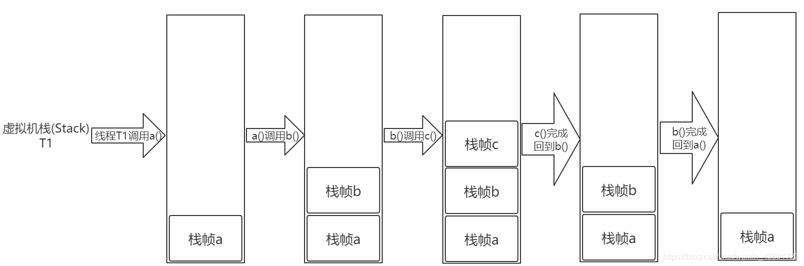

在Java虚拟机规范中，对这个区域规定了两种异常情况：

1. 如果线程请求的栈深度大于虚拟机所允许的深度，将抛出StackOverflowError异常。
2. 如果虚拟机在动态扩展栈时无法申请到足够的内存空间，则抛出OutOfMemoryError异常。

这两种情况存在着一些互相重叠的地方：当栈空间无法继续分配时，到底是内存太小，还是已使用的栈空间太大，其本质上只是对同一件事情的两种描述而已。在单线程的操作中，无论是由于栈帧太大，还是虚拟机栈空间太小，当栈空间无法分配时，虚拟机抛出的都是StackOverflowError异常，而不会得到OutOfMemoryError异常。而在多线程环境下，则会抛出OutOfMemoryError异常。

**栈帧**

每个栈帧对应一个被调用的方法，可以理解为一个方法的运行空间。每个栈帧中包括局部变量表(Local Variables)、操作数栈(Operand Stack)、指向运行时常量池的引用(A reference to the run-time constant pool)、方法返回地址(Return Address)和附加信息。在编译程序代码时，栈帧中需要多大的局部变量表、多深的操作数栈都已经完全确定了，并且写入了方法表的Code属性之中。因此，一个栈帧需要分配多少内存，不会受到程序运行期变量数据的影响，而仅仅取决于具体的虚拟机实现。

- 局部变量表
  方法中定义的局部变量以及方法的参数存放在这张表中。局部变量表中的变量不可直接使用，如需要使用的话，必须通过相关指令将其加载至操作数栈中作为操作数使用。

- 操作数栈
  当一个方法开始执行时，它的操作栈是空的，在方法的执行过程中，会有各种字节码指令（比如：加操作、赋值元算等）向操作栈中写入和提取内容，也就是入栈和出栈操作。

- 动态链接
  每个栈帧都包含一个指向运行时常量池（在方法区中，后面介绍）中该栈帧所属方法的引用，持有这个引用是为了支持方法调用过程中的动态连接。Class文件的常量池中存在有大量的符号引用，字节码中的方法调用指令就以常量池中指向方法的符号引用为参数。这些符号引用，一部分会在类加载阶段或第一次使用的时候转化为直接引用（如final、static域等），称为静态解析，另一部分将在每一次的运行期间转化为直接引用，这部分称为动态连接。

- 方法返回地址
  当一个方法被执行后，有两种方式退出该方法：执行引擎遇到了任意一个方法返回的字节码指令或遇到了异常，并且该异常没有在方法体内得到处理。无论采用何种退出方式，在方法退出之后，都需要返回到方法被调用的位置，程序才能继续执行。方法返回时可能需要在栈帧中保存一些信息，用来帮助恢复它的上层方法的执行状态。一般来说，方法正常退出时，调用者的PC计数器的值就可以作为返回地址，栈帧中很可能保存了这个计数器值，而方法异常退出时，返回地址是要通过异常处理器来确定的，栈帧中一般不会保存这部分信息。

方法退出的过程实际上等同于把当前栈帧出栈，因此退出时可能执行的操作有：恢复上层方法的局部变量表和操作数栈，如果有返回值，则把它压入调用者栈帧的操作数栈中，调整PC计数器的值以指向方法调用指令后面的一条指令。

### 1.3 本地方法栈（Native Method Stacks）

该区域与虚拟机栈所发挥的作用非常相似，只是虚拟机栈为虚拟机执行Java方法服务，而本地方法栈则为使用到的本地操作系统（Native）方法服务。

### 1.4 Java堆（Java Heap）

Java Heap是Java虚拟机所管理的内存中最大的一块，它是所有线程共享的一块内存区域。几乎所有的对象实例和数组都在这类分配内存。Java Heap是垃圾收集器管理的主要区域，因此很多时候也被称为“GC堆”。内部会划分出多个线程私有的分配缓冲区(Thread Local Allocation Buffer, TLAB)。可以位于物理上不连续的空间，但是逻辑上要连续。

根据Java虚拟机规范的规定，Java堆可以处在物理上不连续的内存空间中，只要逻辑上是连续的即可。如果在堆中没有内存可分配时，并且堆也无法扩展时，将会抛出OutOfMemoryError异常。

堆空间分为老年代和年轻代。刚创建的对象存放在年轻代，而老年代中存放生命周期长久的实例对象。年轻代中又被分为Eden区和两个Survivor区(From Space和To Space)。新的对象分配是首先放在Eden区，Survivor区作为Eden区和Old区的缓冲，在Survivor区的对象经历若干次GC仍然存活的，就会被转移到老年代。

`当一个对象大于eden区而小于old区（老年代）的时候会直接扔到old区。 而当对象大于old区时，会直接抛出OutOfMemoryError（OOM）。`

### 1.5 方法区（Method Area）

**`方法区是各个线程共享的内存区域，在虚拟机启动时创建`**，虽然Java虚拟机规范把方法区描述为堆的一个逻辑部分，但是它却又一个别名叫做Non-Heap(非堆)，目的是与Java堆区分开来，方法区域又被称为“永久代”，但这仅仅对于Sun HotSpot来讲，JRockit和IBM J9虚拟机中并不存在永久代的概念。**`用于存储已被虚拟机加载的类信息、常量、静态变量、即时编译器编译后的代码等数据`。**相对而言，垃圾收集行为在这个区域比较少出现。该区域的内存回收目标主要针是对废弃常量的和无用类的回收。运行时常量池是方法区的一部分，Class文件中除了有类的版本、字段、方法、接口等描述信息外，还有一项信息是常量池（Class文件常量池），用于存放编译器生成的各种字面量和符号引用，这部分内容将在类加载后存放到方法区的运行时常量池中。运行时常量池相对于Class文件常量池的另一个重要特征是具备动态性，Java语言并不要求常量一定只能在编译期产生，也就是并非预置入Class文件中的常量池的内容才能进入方法区的运行时常量池，运行期间也可能将新的常量放入池中，这种特性被开发人员利用比较多的是String类的intern（）方法。

根据Java虚拟机规范的规定，当方法区无法满足内存分配需求时，将抛出OutOfMemoryError异常。

### 1.6 直接内存（Direct Memory）

直接内存并不是虚拟机运行时数据区的一部分，也不是Java虚拟机规范中定义的内存区域，它直接从操作系统中分配，因此不受Java堆大小的限制，但是会受到本机总内存的大小及处理器寻址空间的限制，因此它也可能导致OutOfMemoryError异常出现。在JDK1.4中新引入了NIO机制，它是一种基于通道与缓冲区的新I/O方式，可以直接从操作系统中分配直接内存，即在堆外分配内存，这样能在一些场景中提高性能，因为避免了在Java堆和Native堆中来回复制数据。

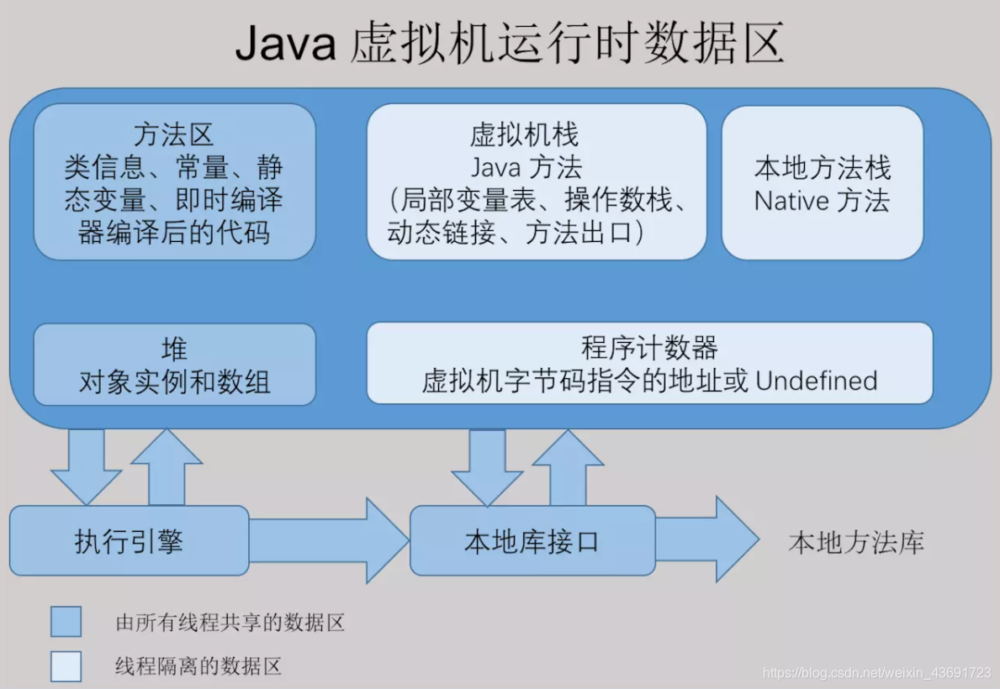

## 2. 内存溢出异常(OOM，Out Of Memeory)

内存溢出就是内存不够用，当JVM因为没有足够的内存来为对象分配空间并且垃圾回收器也已经没有空间可回收时，就会抛出 `java.lang.OutOfMemoryError` （注：非exception，因为这个问题已经严重到不足以被应用处理）

注意，要和内存泄漏区分开，**内存泄露**：申请使用完的内存没有释放，导致虚拟机不能再次使用该内存，此时这段内存就泄露了，因为申请者不用了，而又不能被虚拟机分配给别人用。

除了 `程序计数器`外 ，Java虚拟机的其他运行时区域都有可能发生 `OutOfMemoryError` 的异常，下面分别给出验证：

### 2.1 Java堆溢出

Java堆用来存储对象，因此只要不断创建对象，并保证 GC Roots 到对象之间有可达路径来避免垃圾回收机制清楚这些对象，那么当对象数量达到最大堆容量时就会产生 OOM。

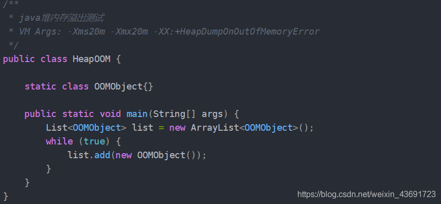

运行结果：

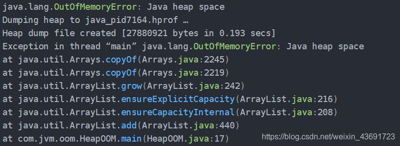

堆内存 OOM 是经常会出现的问题，异常信息会进一步提示 Java heap space

### 2.2 虚拟机栈和本地方法栈溢出

在 `HotSpot`虚拟机中不区分虚拟机栈和本地方法栈，栈容量只由 -Xss 参数设定。关于虚拟机栈和本地方法栈，在 Java 虚拟机规范中描述了两种异常：

- 如果线程请求的栈深度大于虚拟机所允许的最大深度，将抛出 `StackOverflowError` 异常。
- 如果虚拟机在扩展栈时无法申请到足够的内存空间，则抛出 **`OutOfMemoryError`** 异常。

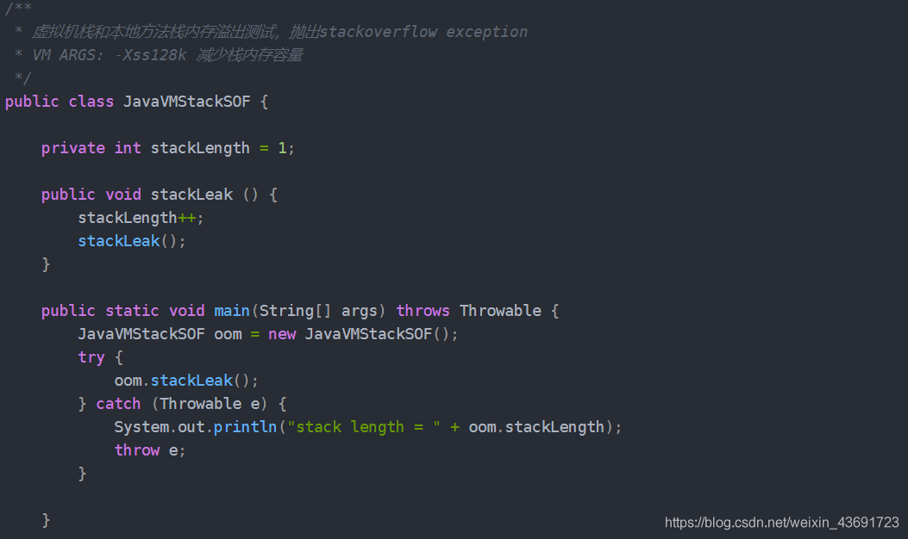

运行结果：

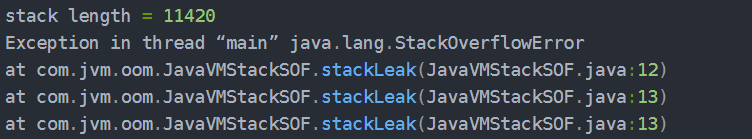

以上代码在单线程环境下，无论是由于栈帧太大还是虚拟机栈容量太小，当内存无法分配时，抛出的都是 `StackOverflowError` 异常。

如果测试环境是多线程环境，通过不断建立线程的方式可以产生内存溢出异常，代码如下所示。但是这样产生的 OOM 与栈空间是否足够大不存在任何联系，在这种情况下，为每个线程的栈分配的内存足够大，反而越容易产生OOM 异常。这点不难理解，每个线程分配到的栈容量越大，可以建立的线程数就变少，建立多线程时就越容易把剩下的内存耗尽。这点在开发多线程的应用时要特别注意。

**如果建立过多线程导致内存溢出，在不能减少线程数或更换64位虚拟机的情况下，只能通过减少最大堆和减少栈容量来换取更多的线程。**

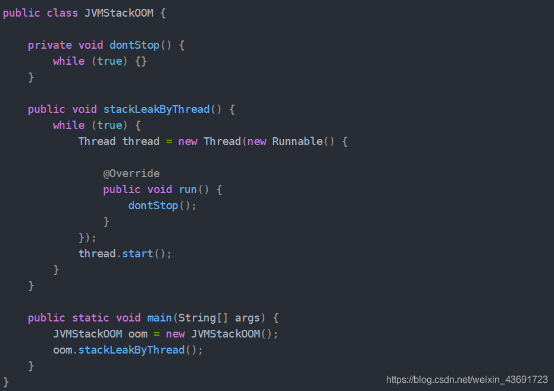

### 2.3 方法区和运行时常量池溢出

方法区用于存放Class的相关信息，对这个区域的测试，基本思路是运行时产生大量的类去填满方法区，直到溢出。使用CGLib实现。

方法区溢出也是一种常见的内存溢出异常，在经常生成大量Class的应用中，需要特别注意类的回收情况，这类场景除了使用了CGLib字节码增强和动态语言外，常见的还有JSP文件的应用(JSP第一次运行时要编译为Java类)、基于OSGI的应用等。

**解决内存溢出**

- 修改JVM启动参数，直接增加内存。
- 检查错误日志
- 对代码进行走查和分析，找出可能发生内存溢出的位置。

一般情况下代码出错的概率会比较大一些，当然了不同的场景不同错误总是复杂多样的。

## 3. HotSpot 虚拟机对象

### 3.1 对象的内存布局

在 HotSpot 虚拟机中，分为 3 块区域：对象头(Header)、实例数据(Instance Data)和对齐填充(Padding)

- 对象头

> 包含两部分，第一部分用于存储对象自身的运行时数据，如哈希码、GC 分代年龄、锁状态标志、线程持有的锁、偏向线程 ID、偏向时间戳等，32 位虚拟机占 32 bit，64 位虚拟机占 64 bit。官方称为 ‘Mark Word’。第二部分是类型指针，即对象指向它的类的元数据指针，虚拟机通过这个指针确定这个对象是哪个类的实例。另外，如果是 Java 数组，对象头中还必须有一块用于记录数组长度的数据，因为普通对象可以通过 Java 对象元数据确定大小，而数组对象不可以。

- 实例数据

> 程序代码中所定义的各种类型的字段内容(包含父类继承下来的和子类中定义的)。

- 对齐填充

> 不是必然需要，主要是占位，保证对象大小是某个字节的整数倍。

### 3.2 对象的创建

遇到 new 指令时，首先检查这个指令的参数是否能在常量池中定位到一个类的符号引用，并且检查这个符号引用代表的类是否已经被加载、解析和初始化过。如果没有，执行相应的[类加载](https://blog.csdn.net/weixin_43691723/article/details/106760305)。
类加载检查通过之后，为新对象分配内存(内存大小在类加载完成后便可确认)。在堆的空闲内存中划分一块区域（‘指针碰撞-内存规整’或‘空闲列表-内存交错’的分配方式)
内存空间分配完成后会初始化为 0(不包括对象头)，接下来就是填充对象头，把对象是哪个类的实例、如何才能找到类的元数据信息、对象的哈希码、对象的 GC 分代年龄等信息存入对象头。
执行 new 指令后执行 init 方法后才算一份真正可用的对象创建完成。

### 3.3 对象的访问定位

由于reference类型在Java虚拟机规范里面只规定了一个指向对象的引用，并没有定义这个引用应该通过哪种方式去定位，以及访问到Java堆中的对象的具体位置，因此不同虚拟机实现的对象访问方式会有所不同，主流的访问方式有两种：使用句柄池和直接使用指针。

- 通过句柄访问
  Java 堆中会分配一块内存作为句柄池。reference 存储的是句柄地址

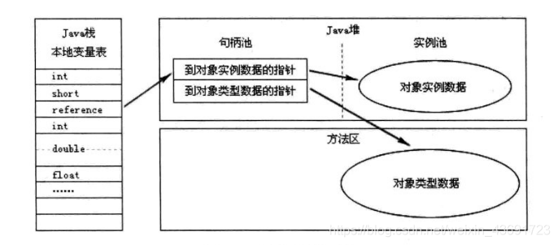

- 使用直接指针访问
  reference 中直接存储对象地址

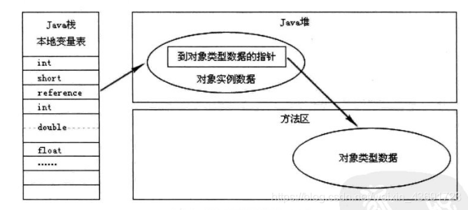

比较：使用句柄的最大好处是 reference 中存储的是稳定的句柄地址，在对象移动(垃圾收集时移动对象是非常普遍的行为)是只改变实例数据指针地址，reference 自身不需要修改。直接指针访问的最大好处是速度快，节省了一次指针定位的时间开销。如果是对象频繁 GC 那么句柄方法好，如果是对象频繁访问则直接指针访问好。

## 4. JVM垃圾回收机制

### 4.1 概述

> 程序计数器、虚拟机栈、本地方法栈 3 个区域随线程生灭(因为是线程私有)，栈中的栈帧随着方法的进入和退出而有条不紊地执行着出栈和入栈操作。而 Java 堆和方法区则不一样，一个接口中的多个实现类需要的内存可能不一样，一个方法中的多个分支需要的内存也可能不一样，我们只有在程序处于运行期才知道那些对象会创建，这部分内存的分配和回收都是动态的，垃圾回收期所关注的就是这部分内存。

### 4.2 判断对象已死

在进行内存回收之前要做的事情就是判断那些对象是‘死’的，哪些是‘活’的。

- 引用计数法
  给对象添加一个引用计数器。但是难以解决循环引用问题。

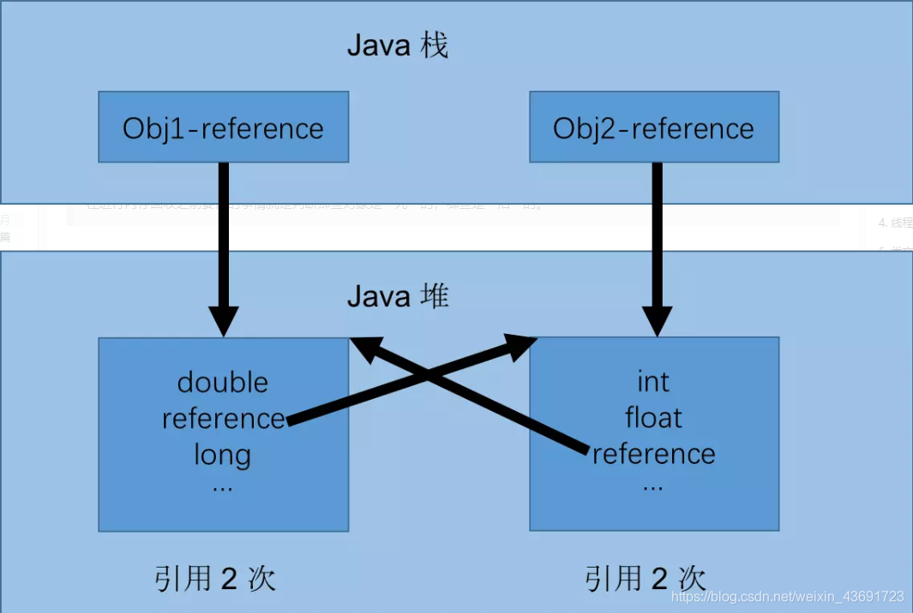

从图中可以看出，如果不下小心直接把 Obj1-reference 和 Obj2-reference 置 null。则在 Java 堆当中的两块内存依然保持着互相引用无法回收。

- 可达性分析算法
  通过一系列的 ‘GC Roots’ 的对象作为起始点，从这些节点出发所走过的路径称为引用链。当一个对象到 GC Roots 没有任何引用链相连的时候说明对象不可用。

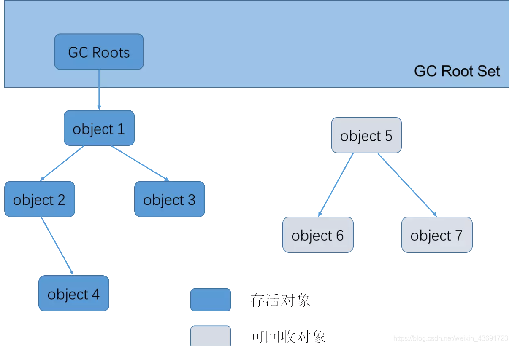

可作为 GC Roots 的对象：

- 虚拟机栈(栈帧中的本地变量表)中引用的对象
- 方法区中类静态属性引用的对象
- 方法区中常量引用的对象
- 本地方法栈中 JNI(即一般说的 Native 方法) 引用的对象

### 4.3 Java 中的引用

不同的对象引用类型， GC会采用不同的方法进行回收，JVM对象的引用分为了四种类型：

- 强引用

> 类似于 Object obj = new Object(); 创建的，只要强引用在就不回收。

- 软引用

> SoftReference 类实现软引用。在系统要发生内存溢出异常之前，将会把这些对象列进回收范围之中进行二次回收。

- 弱引用

> WeakReference 类实现弱引用。对象只能生存到下一次垃圾收集之前。在垃圾收集器工作时，无论内存是否足够都会回收掉只被弱引用关联的对象。

- 虚引用

> PhantomReference 类实现虚引用。无法通过虚引用获取一个对象的实例，为一个对象设置虚引用关联的唯一目的就是能在这个对象被收集器回收时收到一个系统通知。

无论引用计数算法还是可达性分析算法都是基于强引用而言的。

### 4.4 生存还是死亡

即使在可达性分析算法中不可达的对象，也并非是非死不可的，这时候它们暂时出于“缓刑”阶段，一个对象的真正死亡至少要经历两次标记过程：
第一次标记：如果对象在进行可达性分析后发现没有与GC Roots相连接的引用链，那它将会被第一次标记；

第二次标记：第一次标记后接着会进行一次筛选，筛选的条件是此对象是否有必要执行finalize（）方法，当对象没有覆盖 finalize() 方法，或者 finalize() 方法已经被虚拟机调用过，虚拟机将这两种情况都视为“没有必要执行”，如果对象没有必要执行finalize方法，那么第一次标记的对象就没有用了，不会被回收。
如果这个对象被判定为有必要执行 finalize() 方法，那么这个对象会放置在一个叫做 F-Queue 的队列中，并在稍后由一个由虚拟机自动建立的、低优先级的 Finalizer 线程去执行它。这里所谓的“执行”是指虚拟机会出发这个方法，并不承诺或等待他运行结束。在finalize（）方法中没有重新与引用链建立关联关系的，将被进行第二次标记。

第二次标记成功的对象将真的会被回收，如果对象在finalize（）方法中重新与引用链建立了关联关系，那么将会逃离本次回收，继续存活，finalize() 方法是对象逃脱死亡命运的最后一次机会。

finalize() 方法只会被系统自动调用一次。

### 4.5 回收方法区

> 在堆中，尤其是在新生代中，一次垃圾回收一般可以回收 70% ~ 95% 的空间，而永久代的垃圾收集效率远低于此。
> 永久代（方法区）垃圾回收主要两部分内容：废弃的常量和无用的类。

- 判断废弃常量：一般是判断有没有该常量的引用。

- 判断无用的类：要以下三个条件都满足
  - 该类所有的实例都已经回收，也就是 Java 堆中不存在该类的任何实例
  - 加载该类的 ClassLoader 已经被回收
  - 该类对应的 java.lang.Class 对象没有任何地方被引用，无法在任何地方通过反射访问该类的方法
    

### 4.6 垃圾回收算法

- 标记-清除(Mark-Sweep)算法

> 标记—清除算法是最基础的收集算法，它分为“标记”和“清除”两个阶段：首先标记出所需回收的对象，在标记完成后统一回收掉所有被标记的对象，它的标记过程其实就是前面的可达性分析算法中判定垃圾对象的标记过程。标记—清除算法的执行情况如下图所示：
>
> 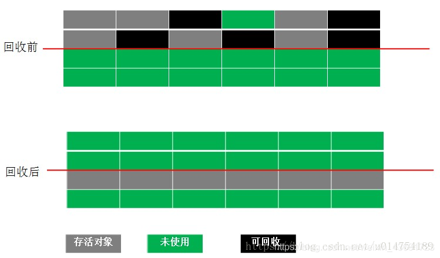
>
> 主要缺点：
>
> - 一个是效率问题，标记和清除过程的效率都不高。
> - 另一个是空间问题，标记清除之后会产生大量不连续的内存碎片，空间碎片太多可能会导致：当程序在以后的运行过程中需要分配较大对象时无法找到足够的连续内存而不得不提前出发另一次垃圾收集动作。

- 复制算法(Copying)

> 为了解决Mark-Sweep算法的缺陷，Copying算法就被提了出来。它将可用内存按容量划分为大小相等的两块，每次只使用其中的一块。当这一块的内存用完了，就将还存活着的对象复制到另外一块上面，然后再把已使用的内存空间一次清理掉，这样一来就不容易出现内存碎片的问题。
>
> 
>
> 这种算法虽然实现简单，运行高效且不容易产生内存碎片，但是却对内存空间的使用做出了高昂的代价，因为能够使用的内存缩减到原来的一半。很显然，Copying算法的效率跟存活对象的数目多少有很大的关系，如果存活对象很多，那么Copying算法的效率将会大大降低。

- 标记-整理(Mark-Compact)算法

> 为了解决Copying算法的缺陷，充分利用内存空间，提出了Mark-Compact算法。该算法标记阶段和Mark-Sweep一样，但是在完成标记之后，它不是直接清理可回收对象，而是将存活对象都向一端移动，然后清理掉端边界以外的内存。
>
> 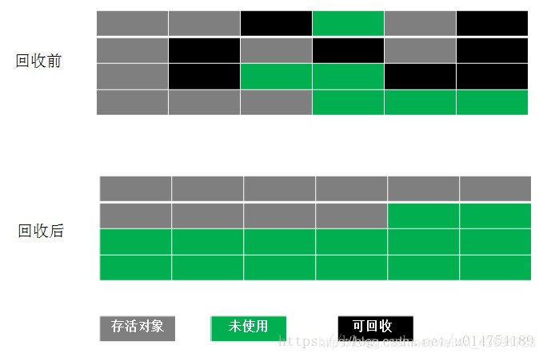

- 分代收集（Generational Collection）算法

> 当前商业虚拟机的垃圾收集 都采用分代收集，它根据对象的存活周期的不同将内存划分为几块，一般是把Java堆分为新生代和老年代。在新生代中，每次垃圾收集时都会发现有大量对象死去，只有少量存活，因此可选用复制算法来完成收集，而老年代中因为对象存活率高、没有额外空间对它进行分配担保，就必须使用标记—清除算法或标记—整理算法来进行回收。

年轻代的垃圾收集算法：

> 在年轻代中jvm使用的是复制算法，年轻代分三个区。一个Eden区，两个 Survivor区(一般而言)。大部分对象在Eden区中生成。当Eden区满时，还存活的对象将被复制到Survivor区（两个中的一个），当这个 Survivor区满时，此区的存活对象将被复制到另外一个Survivor区，当另外一个Survivor区也满了的时候，从第一个Survivor区复制过来的并且此时还存活的对象，将被复制到“年老区(Tenured)”。需要注意，Survivor的两个区是对称的，没先后关系，所以同一个区中可能同时存在从Eden复制过来对象，和从前一个Survivor复制过来的对象，而复制到年老区的只有从第一个Survivor区过来的对象。而且，Survivor区总有一个是空的。当survivor1区不足以存放 eden和survivor0的存活对象时，就将存活对象直接存放到老年代。

老年代（Old Generation）的回收算法：

> 老年代的特点是每次回收都只回收少量对象，一般使用的是Mark-Compact（标记-整理）算法。在年轻代中经历了N次垃圾回收后仍然存活的对象，就会被放到年老代中。因此，可以认为年老代中存放的都是一些生命周期较长的对象。内存比新生代也大很多(大概比例是1:2)，当老年代内存满时触发Major GC或Full GC，Full GC发生频率比较低，老年代对象存活时间比较长，存活率标记高。

### 4.8 垃圾回收的时机

- 当Eden区或者Servior区不够用了
- 老年代空间不够用了
- 方法区空间不够用了
- 手动回收，System.gc()（不建议使用）

### 4.9 垃圾回收分析

内存分配策略：

- 对象优先在Eden分配。
- 大对象直接进入老年代。
- 长期存活的对象将进入老年代。

对垃圾回收策略说明以下两点：

- 新生代GC（Minor GC）：发生在新生代的垃圾收集动作，因为Java对象大多都具有朝生夕灭的特性，因此Minor GC非常频繁，一般回收速度也比较快。
- 老年代GC（Major GC/Full GC）：发生在老年代的GC，出现了Major GC，经常会伴随至少一次Minor GC。由于老年代中的对象生命周期比较长，因此Major GC并不频繁，一般都是等待老年代满了后才进行Full GC，而且其速度一般会比Minor GC慢10倍以上。另外，如果分配了Direct Memory，在老年代中进行Full GC时，会顺便清理掉Direct Memory中的废弃对象。

### 4.10 垃圾回收器

垃圾收集算法是内存回收的理论，而垃圾回收器是内存回收的实践。

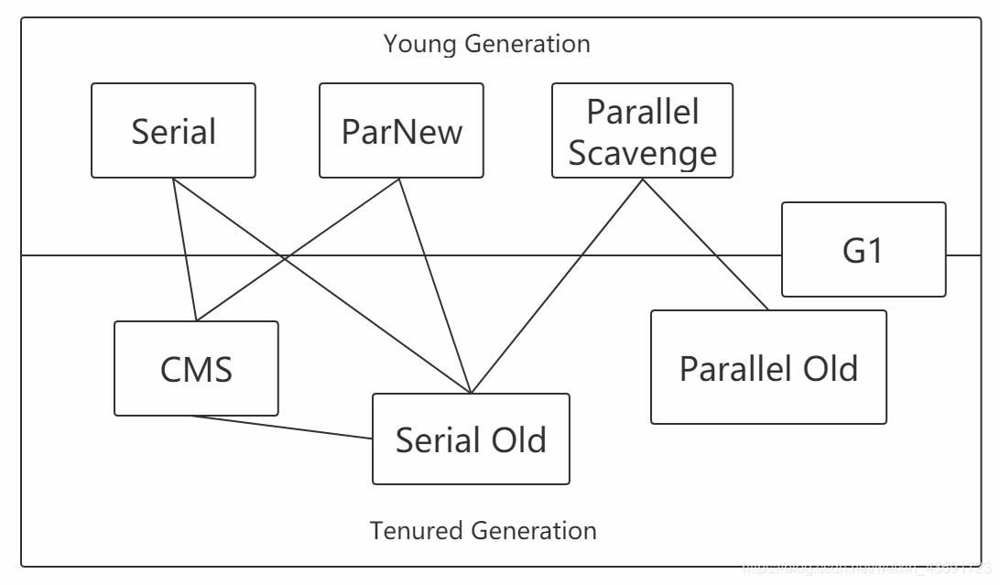

- Serial 收集器

> 这是一个新生代单线程收集器，标记和清理都是单线程。意味着它只会使用一个 CPU 或一条收集线程去完成收集工作，并且在进行垃圾回收时必须暂停其它所有的工作线程直到收集结束。

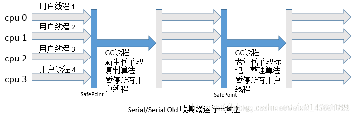

- Serial Old

> 老年代单线程收集器，Serial收集器的老年代版本，采用标记整理算法。

- ParNew 收集器

> 新生代收集器，可以认为是Serial收集器的多线程版本，使用多个线程进行垃圾收集,在多核CPU环境下有着比Serial更好的表现。是Server模式下的虚拟机首选的新生代收集器，其中有一个很重要的和性能无关的原因是，除了Serial收集器外，目前只有它能与CMS收集器配合工作。
> 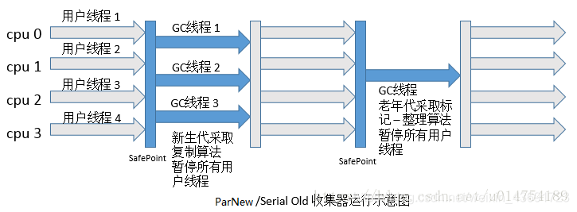

在学习其他的垃圾收集器之前，要先明白两个概念

并行：Parallel

> 指多条垃圾收集线程并行工作，此时用户线程处于等待状态

并发：Concurrent

> 指用户线程和垃圾回收线程同时执行(不一定是并行，有可能是交叉执行)，用户进程在运行，而垃圾回收线程在另一个 CPU 上运行。

- Parallel Scavenge收集器

> Parallel Scavenge收集器是一个新生代收集器，它也是使用复制算法的收集器，又是并行的多线程收集器，看上去和ParNew一样，但是Parallel Scanvenge更关注系统的吞吐量。
> 吞吐量=运行用户代码的时间/(运行用户代码的时间+垃圾收集时间)
> 比如虚拟机总共运行了100分钟，垃圾收集时间用了1分钟，吞吐量=(100-1)/100=99%。
> 若吞吐量越大，意味着垃圾收集的时间越短，则用户代码可以充分利用CPU资源，尽快完成程序的运算任务。

- Parallel Old收集器

> Parallel Scavenge收集器的老年代版本，并行收集器，吞吐量优先。使用多线程和标记-整理（Mark-Compact）算法。

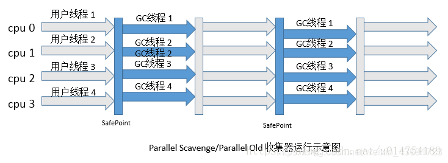

- CMS(Concurrent Mark Sweep)收集器

> CMS(Concurrent Mark Sweep)收集器是一种以获取`最短回收停顿时间`为目标的收集器。它是一种并发收集器，采用的是Mark-Sweep算法

采用的是"标记-清除算法",整个过程分为4步

1. 初始标记，标记GCRoots能直接关联到的对象，时间很短。所以这里用的是单线程，会导致停顿（stw，stop the world）。

2. 并发标记，进行GCRoots Tracing（可达性分析）过程，时间很长。所以用的是多线程。

3. 重新标记，修正并发标记期间的变动部分，时间较长，会导致停顿（stw，stop the world）。

4. 并发清除，回收内存空间，时间很长。

由于整个过程中，并发标记和并发清除，收集器线程可以与用户线程一起工作，所以总体上来说，CMS收集器的内存回收过程是与用户线程一起并发地执行的。

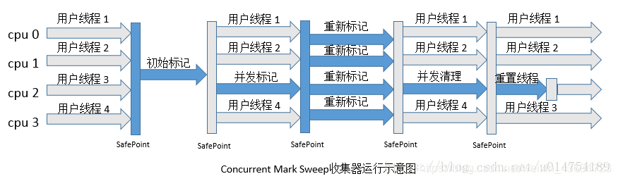

优点：并发收集、低停顿
缺点

> - 对CPU资源非常敏感，可能会导致应用程序变慢，吞吐率下降。
> - 无法处理浮动垃圾，因为在并发清理阶段用户线程还在运行，自然就会产生新的垃圾，而在此次收集中无法收集他们，只能留到下次收
> - 集，这部分垃圾为浮动垃圾，同时，由于用户线程并发执行，所以需要预留一部分老年代空间提供并发收集时程序运行使用。
>   由于采用的标记 - 清除算法，会产生大量的内存碎片

- G1
  G1收集器是当今收集器技术发展最前沿的成果，它是一款面向服务端应用的收集器，它能充分利用多CPU、多核环境。因此它是一款并行与并发收集器，并且它能建立可预测的停顿时间模型。

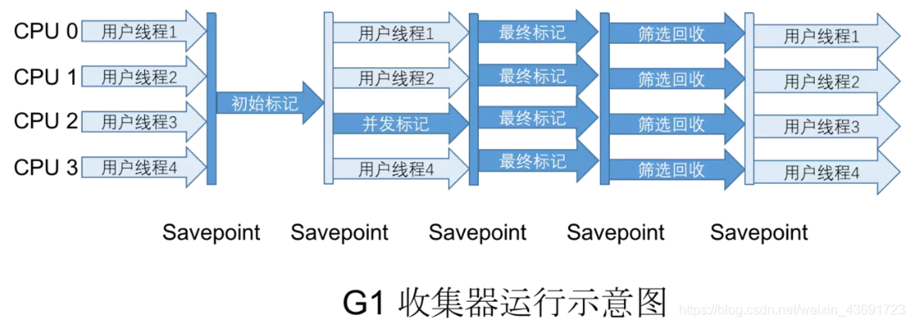

G1收集器有以下特点：

(1). 并行和并发。使用多个CPU来缩短Stop The World停顿时间，与用户线程并发执行。

(2). 分代收集。独立管理整个堆，但是能够采用不同的方式去处理新创建对象和已经存活了一段时间、熬过多次GC的旧对象，以获取更好的收集效果。

(3). 空间整合。基于标记 - 整理算法，无内存碎片产生。

(4). 可预测的停顿。能建立可预测的停顿时间模型，能让使用者明确指定在一个长度为M毫秒的时间片段内，消耗在垃圾收集上的时间不得超过N毫秒，那么就会回收在不超过N毫秒时间内能够回收的，可能还有不能回收的。

使用G1收集器时，Java堆的内存布局与其他收集器有很大差别，它将整个Java堆划分为多个大小相等的独立区域（Region），虽然还保留有新生代和老年代的概念，但新生代和老年代不再是物理隔离的了，它们都是一部分（可以不连续）Region的集合。