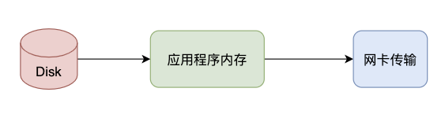
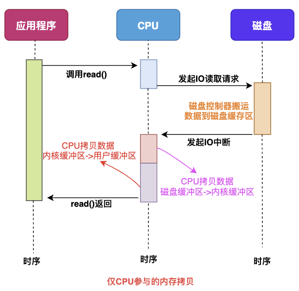
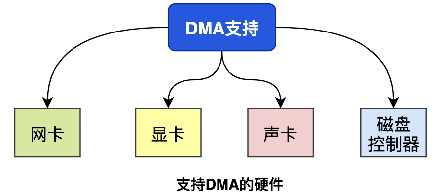
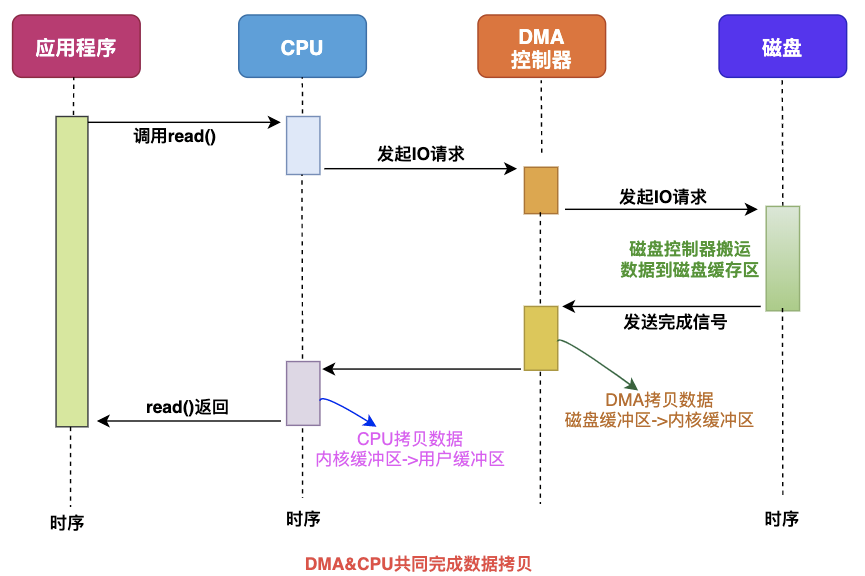
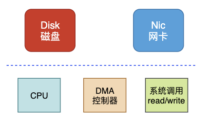
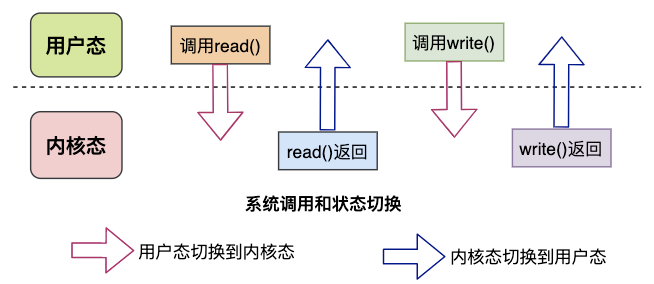
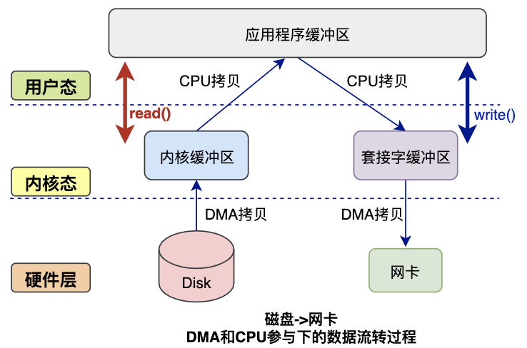

# 用户态和内核态

内核态：cpu可以访问内存的所有数据，包括外围设备，例如硬盘，网卡，cpu也可以将自己从一个程序切换到另一个程序。

用户态：只能受限的访问内存，且不允许访问外围设备，占用cpu的能力被剥夺，cpu资源可以被其他程序获取。

 

## 为什么要有用户态和内核态？

由于需要限制不同的程序之间的访问能力, 防止他们获取别的程序的内存数据, 或者获取外围设备的数据, 并发送到网络, CPU划分出两个权限等级 -- 用户态和内核态。

 

## 用户态与内核态的切换

所有用户程序都是运行在用户态的, 但是有时候程序确实需要做一些内核态的事情, 例如从硬盘读取数据, 或者从键盘获取输入等. 而唯一可以做这些事情的就是操作系统, 所以此时程序就需要先操作系统请求以程序的名义来执行这些操作.

这时需要一个这样的机制: 用户态程序切换到内核态, 但是不能控制在内核态中执行的指令

这种机制叫系统调用, 在CPU中的实现称之为陷阱指令(Trap Instruction)

他们的工作流程如下:

1. 用户态程序将一些数据值放在寄存器中, 或者使用参数创建一个堆栈(stack frame), 以此表明需要操作系统提供的服务.
2. 用户态程序执行陷阱指令
3. CPU切换到内核态, 并跳到位于内存指定位置的指令, 这些指令是操作系统的一部分, 他们具有内存保护, 不可被用户态程序访问
4. 这些指令称之为陷阱(trap)或者系统调用处理器(system call handler). 他们会读取程序放入内存的数据参数, 并执行程序请求的服务
5. 系统调用完成后, 操作系统会重置CPU为用户态并返回系统调用的结果

当一个任务（进程）执行系统调用而陷入内核代码中执行时，我们就称进程处于内核运行态（或简称为内核态）。此时处理器处于特权级最高的（0级）内核代码中执行。当进程处于内核态时，执行的内核代码会使用当前进程的内核栈。每个进程都有自己的内核栈。当进程在执行用户自己的代码时，则称其处于用户运行态（用户态）。即此时处理器在特权级最低的（3级）用户代码中运行。当正在执行用户程序而突然被中断程序中断时，此时用户程序也可以象征性地称为处于进程的内核态。因为中断处理程序将使用当前进程的内核栈。这与处于内核态的进程的状态有些类似。 

内核态与用户态是操作系统的两种运行级别,跟intel cpu没有必然的联系, intel cpu提供Ring0-Ring3三种级别的运行模式，Ring0级别最高，Ring3最低。Linux使用了Ring3级别运行用户态，Ring0作为 内核态，没有使用Ring1和Ring2。Ring3状态不能访问Ring0的地址空间，包括代码和数据。Linux进程的4GB地址空间，3G-4G部 分大家是共享的，是内核态的地址空间，这里存放在整个内核的代码和所有的内核模块，以及内核所维护的数据。用户运行一个程序，该程序所创建的进程开始是运 行在用户态的，如果要执行文件操作，网络数据发送等操作，必须通过write，send等系统调用，这些系统调用会调用内核中的代码来完成操作，这时，必 须切换到Ring0，然后进入3GB-4GB中的内核地址空间去执行这些代码完成操作，完成后，切换回Ring3，回到用户态。这样，用户态的程序就不能 随意操作内核地址空间，具有一定的安全保护作用。
至于说保护模式，是说通过内存页表操作等机制，保证进程间的地址空间不会互相冲突，一个进程的操作不会修改另一个进程的地址空间中的数据。

##  用户态和内核态的概念区别

究竟什么是用户态，什么是内核态，这两个基本概念以前一直理解得不是很清楚，根本原因个人觉得是在于因为大部分时候我们在写程序时关注的重点和着眼的角度放在了实现的功能和代码的逻辑性上，先看一个例子：

1）例子

```java
void testfork(){
	if(0 = = fork()){
		printf(“create new process success!\n”);
	}
	printf(“testfork ok\n”);
}
```

这段代码很简单，从功能的角度来看，就是实际执行了一个fork()，生成一个新的进程，从逻辑的角度看，就是判断了如果fork()返回的是0则打印相关语句，然后函数最后再打印一句表示执行完整个testfork()函数。代码的执行逻辑和功能上看就是如此简单，一共四行代码，从上到下一句一句执行而已，完全看不出来哪里有体现出用户态和进程态的概念。

如果说前面两种是静态观察的角度看的话，我们还可以从动态的角度来看这段代码，即它被转换成CPU执行的指令后加载执行的过程，这时这段程序就是一个动态执行的指令序列。而究竟加载了哪些代码，如何加载就是和操作系统密切相关了。

 

2）特权级

熟悉Unix/Linux系统的人都知道，fork的工作实际上是以系统调用的方式完成相应功能的，具体的工作是由sys_fork负责实施。其实无论是不是Unix或者Linux，对于任何操作系统来说，创建一个新的进程都是属于核心功能，因为它要做很多底层细致地工作，消耗系统的物理资源，比如分配物理内存，从父进程拷贝相关信息，拷贝设置页目录页表等等，这些显然不能随便让哪个程序就能去做，于是就自然引出特权级别的概念，显然，最关键性的权力必须由高特权级的程序来执行，这样才可以做到集中管理，减少有限资源的访问和使用冲突。

特权级显然是非常有效的管理和控制程序执行的手段，因此在硬件上对特权级做了很多支持，就Intel x86架构的CPU来说一共有0~3四个特权级，0级最高，3级最低，硬件上在执行每条指令时都会对指令所具有的特权级做相应的检查，相关的概念有CPL、DPL和RPL，这里不再过多阐述。硬件已经提供了一套特权级使用的相关机制，软件自然就是好好利用的问题，这属于操作系统要做的事情，对于Unix/Linux来说，只使用了0级特权级和3级特权级。也就是说在Unix/Linux系统中，一条工作在0级特权级的指令具有了CPU能提供的最高权力，而一条工作在3级特权级的指令具有CPU提供的最低或者说最基本权力。

 

3）用户态和内核态

现在我们从特权级的调度来理解用户态和内核态就比较好理解了，当程序运行在3级特权级上时，就可以称之为运行在用户态，因为这是最低特权级，是普通的用户进程运行的特权级，大部分用户直接面对的程序都是运行在用户态；反之，当程序运行在0级特权级上时，就可以称之为运行在内核态。

虽然用户态下和内核态下工作的程序有很多差别，但最重要的差别就在于特权级的不同，即权力的不同。运行在用户态下的程序不能直接访问操作系统内核数据结构和程序，比如上面例子中的testfork()就不能直接调用sys_fork()，因为前者是工作在用户态，属于用户态程序，而sys_fork()是工作在内核态，属于内核态程序。

当我们在系统中执行一个程序时，大部分时间是运行在用户态下的，在其需要操作系统帮助完成某些它没有权力和能力完成的工作时就会切换到内核态，比如testfork()最初运行在用户态进程下，当它调用fork()最终触发sys_fork()的执行时，就切换到了内核态。

 

## 用户态和内核态的转换

1）用户态切换到内核态的3种方式

a. 系统调用

这是用户态进程主动要求切换到内核态的一种方式，用户态进程通过系统调用申请使用操作系统提供的服务程序完成工作，比如前例中fork()实际上就是执行了一个创建新进程的系统调用。而系统调用的机制其核心还是使用了操作系统为用户特别开放的一个中断来实现，例如Linux的int 80h中断。

b. 异常

当CPU在执行运行在用户态下的程序时，发生了某些事先不可知的异常，这时会触发由当前运行进程切换到处理此异常的内核相关程序中，也就转到了内核态，比如缺页异常。

c. 外围设备的中断

当外围设备完成用户请求的操作后，会向CPU发出相应的中断信号，这时CPU会暂停执行下一条即将要执行的指令转而去执行与中断信号对应的处理程序，如果先前执行的指令是用户态下的程序，那么这个转换的过程自然也就发生了由用户态到内核态的切换。比如硬盘读写操作完成，系统会切换到硬盘读写的中断处理程序中执行后续操作等。

 

这3种方式是系统在运行时由用户态转到内核态的最主要方式，其中系统调用可以认为是用户进程主动发起的，异常和外围设备中断则是被动的。

 

2）具体的切换操作

从触发方式上看，可以认为存在前述3种不同的类型，但是从最终实际完成由用户态到内核态的切换操作上来说，涉及的关键步骤是完全一致的，没有任何区别，都相当于执行了一个中断响应的过程，因为系统调用实际上最终是中断机制实现的，而异常和中断的处理机制基本上也是一致的，关于它们的具体区别这里不再赘述。关于中断处理机制的细节和步骤这里也不做过多分析，涉及到由用户态切换到内核态的步骤主要包括：

[1] 从当前进程的描述符中提取其内核栈的ss0及esp0信息。

[2] 使用ss0和esp0指向的内核栈将当前进程的cs,eip,eflags,ss,esp信息保存起来，这个

过程也完成了由用户栈到内核栈的切换过程，同时保存了被暂停执行的程序的下一

条指令。

[3] 将先前由中断向量检索得到的中断处理程序的cs,eip信息装入相应的寄存器，开始

执行中断处理程序，这时就转到了内核态的程序执行了。

## 用户态和内核态的数据拷贝

### 数据拷贝基础过程

在Linux系统内部缓存和[内存](https://so.csdn.net/so/search?q=内存&spm=1001.2101.3001.7020)容量都是有限的，更多的数据都是存储在磁盘中。对于Web服务器来说，经常需要从磁盘中读取数据到内存，然后再通过网卡传输给用户：



上述数据流转只是大框，接下来看看几种模式。

#### 仅CPU方式

当应用程序需要读取磁盘数据时，调用read()从用户态陷入内核态，read()这个系统调用最终由CPU来完成；

CPU向磁盘发起I/O请求，磁盘收到之后开始准备数据；

磁盘将数据放到磁盘缓冲区之后，向CPU发起I/O中断，报告CPU数据已经Ready了；

CPU收到磁盘控制器的I/O中断之后，开始拷贝数据，完成之后read()返回，再从内核态切换到用户态；



#### CPU&[DMA](https://so.csdn.net/so/search?q=DMA&spm=1001.2101.3001.7020)方式

CPU的时间宝贵，让它做杂活就是浪费资源。

直接内存访问(Direct Memory Access)，是一种硬件设备绕开CPU独立直接访问内存的机制。所以DMA在一定程度上解放了CPU，把之前CPU的杂活让硬件直接自己做了，提高了CPU效率。

目前支持DMA的硬件包括：网卡、声卡、显卡、磁盘控制器等。



有了DMA的参与之后的流程发生了一些变化：



最主要的变化是，CPU不再和磁盘直接交互，而是DMA和磁盘交互并且将数据从磁盘缓冲区拷贝到内核缓冲区，之后的过程类似。

“

【敲黑板】无论从仅CPU方式和DMA&CPU方式，都存在多次冗余数据拷贝和内核态&用户态的切换。

”

我们继续思考Web服务器读取本地磁盘文件数据再通过网络传输给用户的详细过程。

3.普通模式数据交互

一次完成的数据交互包括几个部分：系统调用syscall、CPU、DMA、网卡、磁盘等。



系统调用syscall是应用程序和内核交互的桥梁，每次进行调用/返回就会产生两次切换：

调用syscall 从用户态切换到内核态

syscall返回 从内核态切换到用户态



来看下完整的数据拷贝过程简图：



读数据过程：

应用程序要读取磁盘数据，调用read()函数从而实现用户态切换内核态，这是第1次状态切换；

DMA控制器将数据从磁盘拷贝到内核缓冲区，这是第1次DMA拷贝；

CPU将数据从内核缓冲区复制到用户缓冲区，这是第1次CPU拷贝；

CPU完成拷贝之后，read()函数返回实现用户态切换用户态，这是第2次状态切换；

写数据过程：

应用程序要向网卡写数据，调用write()函数实现用户态切换内核态，这是第1次切换；

CPU将用户缓冲区数据拷贝到内核缓冲区，这是第1次CPU拷贝；

DMA控制器将数据从内核缓冲区复制到socket缓冲区，这是第1次DMA拷贝；

完成拷贝之后，write()函数返回实现内核态切换用户态，这是第2次切换；

综上所述：

读过程涉及2次空间切换、1次DMA拷贝、1次CPU拷贝；

写过程涉及2次空间切换、1次DMA拷贝、1次CPU拷贝；

可见传统模式下，涉及多次空间切换和数据冗余拷贝，效率并不高，接下来就该零拷贝技术出场了。

### 零拷贝技术

4.1 出现原因

我们可以看到，如果应用程序不对数据做修改，从内核缓冲区到用户缓冲区，再从用户缓冲区到内核缓冲区。两次数据拷贝都需要CPU的参与，并且涉及用户态与内核态的多次切换，加重了CPU负担。

我们需要降低冗余数据拷贝、解放CPU，这也就是零拷贝Zero-Copy技术。

4.2 解决思路

目前来看，零拷贝技术的几个实现手段包括：mmap+write、sendfile、sendfile+DMA收集、splice等。


#### mmap方式

mmap是Linux提供的一种内存映射文件的机制，它实现了将内核中读缓冲区地址与用户空间缓冲区地址进行映射，从而实现内核缓冲区与用户缓冲区的共享。

这样就减少了一次用户态和内核态的CPU拷贝，但是在内核空间内仍然有一次CPU拷贝。


mmap对大文件传输有一定优势，但是小文件可能出现碎片，并且在多个进程同时操作文件时可能产生引发coredump的signal。

#### sendfile方式

mmap+write方式有一定改进，但是由系统调用引起的状态切换并没有减少。

sendfile系统调用是在 Linux 内核2.1版本中被引入，它建立了两个文件之间的传输通道。

sendfile方式只使用一个函数就可以完成之前的read+write 和 mmap+write的功能，这样就少了2次状态切换，由于数据不经过用户缓冲区，因此该数据无法被修改。


从图中可以看到，应用程序只需要调用sendfile函数即可完成，只有2次状态切换、1次CPU拷贝、2次DMA拷贝。

但是sendfile在内核缓冲区和socket缓冲区仍然存在一次CPU拷贝，或许这个还可以优化。

#### sendfile+DMA收集

Linux 2.4 内核对 sendfile 系统调用进行优化，但是需要硬件DMA控制器的配合。

升级后的sendfile将内核空间缓冲区中对应的数据描述信息(文件描述符、地址偏移量等信息)记录到socket缓冲区中。

DMA控制器根据socket缓冲区中的地址和偏移量将数据从内核缓冲区拷贝到网卡中，从而省去了内核空间中仅剩1次CPU拷贝。


这种方式有2次状态切换、0次CPU拷贝、2次DMA拷贝，但是仍然无法对数据进行修改，并且需要硬件层面DMA的支持，并且sendfile只能将文件数据拷贝到socket描述符上，有一定的局限性。

#### splice方式

splice系统调用是Linux 在 2.6 版本引入的，其不需要硬件支持，并且不再限定于socket上，实现两个普通文件之间的数据零拷贝。


splice 系统调用可以在内核缓冲区和socket缓冲区之间建立管道来传输数据，避免了两者之间的 CPU 拷贝操作。


splice也有一些局限，它的两个文件描述符参数中有一个必须是管道设备。