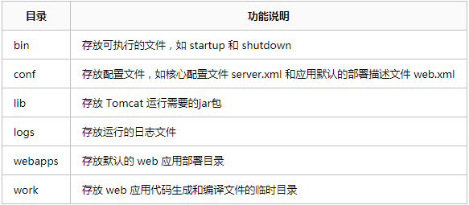
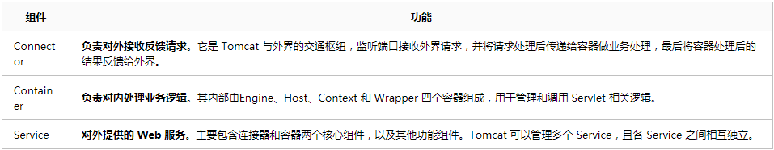
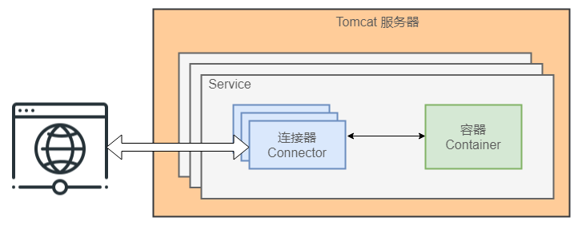
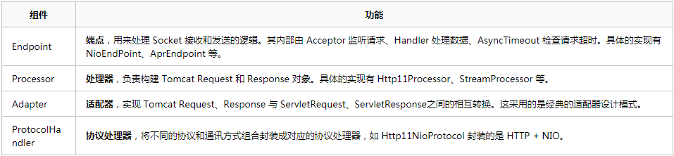
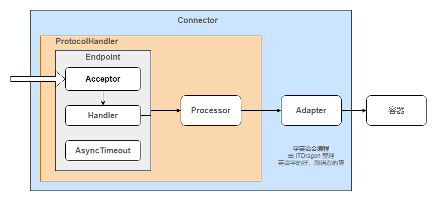
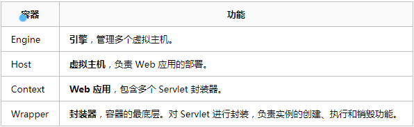
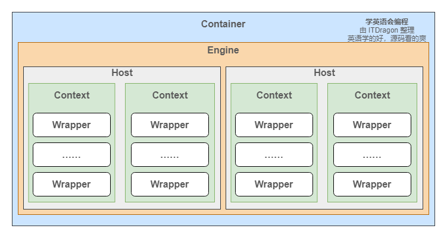
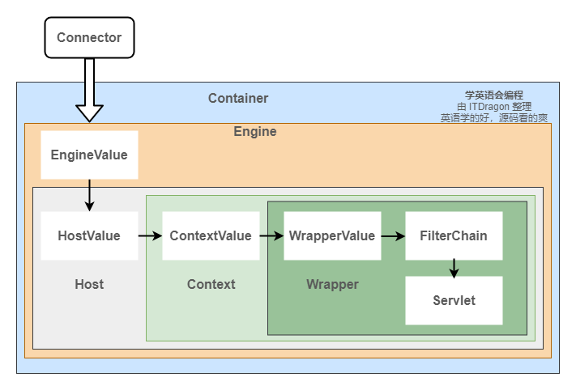
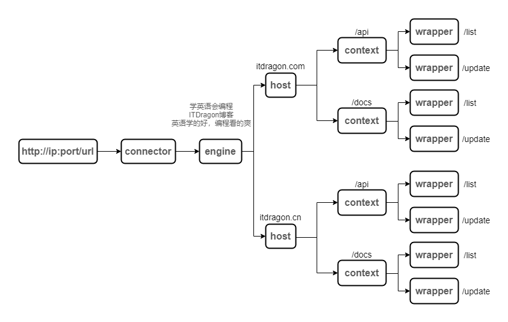
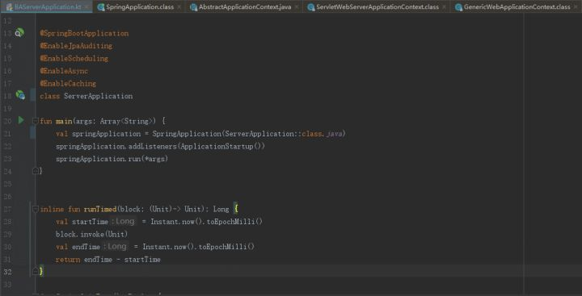

# Tomcat 的工作原理

SpringBoot 就像一条巨蟒，慢慢缠绕着我们，使我们麻痹。不得不承认，使用了 SpringBoot 确实提高了工作效率，但同时也让我们遗忘了很多技能。刚入社会的时候，我还是通过 Tomcat 手动部署 JavaWeb 项目，还经常对 Tomcat 进行性能调优。除此之外，还需要自己理清楚各 Jar 之间的关系，以避免 Jar 丢失和各版本冲突导致服务启动异常的问题。到如今，这些繁琐而又重复的工作已经统统交给 SpringBoot 处理，我们可以把更多的精力放在业务逻辑上。但是，清楚 Tomcat 的工作原理和处理请求流程和分析 Spring 框架源码一样的重要。至少面试官特别喜欢问这些底层原理和设计思路。希望这篇文章能给你一些帮助。

## **Tomcat 整体架构**

Tomcat 是一个免费的、开源的、轻量级的 Web 应用服务器。适合在并发量不是很高的中小企业项目中使用。

### **文件目录结构**

以下是 Tomcat 8 主要目录结构



### **功能组件结构**

Tomcat 的核心功能有两个，分别是负责接收和反馈外部请求的连接器 Connector，和负责处理请求的容器 Container。其中连接器和容器相辅相成，一起构成了基本的 web 服务 Service。每个 Tomcat 服务器可以管理多个 Service。






## **Tomcat 连接器核心原理**

Tomcat 连接器框架——Coyote

### **连接器核心功能**

一、监听网络端口，接收和响应网络请求。

二、网络字节流处理。将收到的网络字节流转换成 Tomcat Request 再转成标准的 ServletRequest 给容器，同时将容器传来的 ServletResponse 转成 Tomcat Response 再转成网络字节流。

### **连接器模块设计**

为满足连接器的两个核心功能，我们需要一个通讯端点来监听端口；需要一个处理器来处理网络字节流；最后还需要一个适配器将处理后的结果转成容器需要的结构。



对应的源码包路径 `org.apache.coyote` 。对应的结构图如：



## **Tomcat 容器核心原理**

Tomcat 容器框架——Catalina

### **容器结构分析**

每个 Service 会包含一个容器。容器由一个引擎可以管理多个虚拟主机。每个虚拟主机可以管理多个 Web 应用。每个 Web 应用会有多个 Servlet 包装器。Engine、Host、Context 和 Wrapper，四个容器之间属于父子关系。



对应的源码包路径 `org.apache.coyote` 。对应的结构图如下：



### **容器请求处理**

容器的请求处理过程就是在 Engine、Host、Context 和 Wrapper 这四个容器之间层层调用，最后在 Servlet 中执行对应的业务逻辑。各容器都会有一个通道 Pipeline，每个通道上都会有一个 Basic Valve（如StandardEngineValve）， 类似一个闸门用来处理 Request 和 Response 。其流程图如下。



## **Tomcat 请求处理流程**

上面的知识点已经零零碎碎地介绍了一个 Tomcat 是如何处理一个请求。简单理解就是连接器的处理流程 + 容器的处理流程 = Tomcat 处理流程。哈！那么问题来了，Tomcat 是如何通过请求路径找到对应的虚拟站点？是如何找到对应的 Servlet 呢？

### **映射器功能介绍**

这里需要引入一个上面没有介绍的组件 Mapper。顾名思义，其作用是提供请求路径的路由映射。根据请求URL地址匹配是由哪个容器来处理。其中每个容器都会它自己对应的Mapper，如 MappedHost。不知道大家有没有回忆起被 Mapper class not found 支配的恐惧。在以前，每写一个完整的功能，都需要在 web.xml 配置映射规则，当文件越来越庞大的时候，各个问题随着也会出现

### **HTTP请求流程**

打开 tomcat/conf 目录下的 server.xml 文件来分析一个http://localhost:8080/docs/api 请求。

第一步：连接器监听的端口是8080。由于请求的端口和监听的端口一致，连接器接受了该请求。

第二步：因为引擎的默认虚拟主机是 localhost，并且虚拟主机的目录是webapps。所以请求找到了 tomcat/webapps 目录。

第三步：解析的 docs 是 web 程序的应用名，也就是 context。此时请求继续从 webapps 目录下找 docs 目录。有的时候我们也会把应用名省略。

第四步：解析的 api 是具体的业务逻辑地址。此时需要从 docs/WEB-INF/web.xml 中找映射关系，最后调用具体的函数。

```xml
<?xml version="1.0" encoding="UTF-8"?>
<Server port="8005" shutdown="SHUTDOWN">

  <Service name="Catalina">

	<!-- 连接器监听端口是 8080，默认通讯协议是 HTTP/1.1 -->
    <Connector port="8080" protocol="HTTP/1.1"
               connectionTimeout="20000"
               redirectPort="8443" />
			   
	<!-- 名字为 Catalina 的引擎，其默认的虚拟主机是 localhost -->
    <Engine name="Catalina" defaultHost="localhost">

	  <!-- 名字为 localhost 的虚拟主机，其目录是 webapps-->
      <Host name="localhost"  appBase="webapps"
            unpackWARs="true" autoDeploy="true">

      </Host>
    </Engine>
  </Service>
</Server>
```



## **SpringBoot 如何启动内嵌的 Tomcat**

SpringBoot 一键启动服务的功能，让有很多刚入社会的朋友都忘记 Tomcat 是啥。随着硬件的性能越来越高，普通中小项目都可以直接用内置 Tomcat 启动。但是有些大一点的项目可能会用到 Tomcat 集群和调优，内置的 Tomcat 就不一定能满足需求了。

我们先从源码中分析 SpringBoot 是如何启动 Tomcat，以下是 SpringBoot 2.x 的代码。

代码从 main 方法开始，执行 run 方法启动项目。

```java
SpringApplication.run
```

从 run 方法点进去，找到刷新应用上下文的方法。

```java
this.prepareContext(context, environment, listeners, applicationArguments, printedBanner);
this.refreshContext(context);
this.afterRefresh(context, applicationArguments);
```

从 refreshContext 方法点进去，找 refresh 方法。并一层层往上找其父类的方法。

```java
this.refresh(context);
```

在 AbstractApplicationContext 类的 refresh 方法中，有一行调用子容器刷新的逻辑。

```java
this.postProcessBeanFactory(beanFactory);
this.invokeBeanFactoryPostProcessors(beanFactory);
this.registerBeanPostProcessors(beanFactory);
this.initMessageSource();
this.initApplicationEventMulticaster();
this.onRefresh();
this.registerListeners();
this.finishBeanFactoryInitialization(beanFactory);
this.finishRefresh();
```

从 onRefresh 方法点进去，找到 ServletWebServerApplicationContext 的实现方法。在这里终于看到了希望。

```java
protected void onRefresh() {
    super.onRefresh();

    try {
        this.createWebServer();
    } catch (Throwable var2) {
        throw new ApplicationContextException("Unable to start web server", var2);
    }
}
```

从 createWebServer 方法点进去，找到从工厂类中获取 WebServer的代码。

```java
if (webServer == null && servletContext == null) {
    ServletWebServerFactory factory = this.getWebServerFactory();
    // 获取 web server 
    this.webServer = factory.getWebServer(new ServletContextInitializer[]{this.getSelfInitializer()});
} else if (servletContext != null) {
    try {
        // 启动 web server
        this.getSelfInitializer().onStartup(servletContext);
    } catch (ServletException var4) {
        throw new ApplicationContextException("Cannot initialize servlet context", var4);
    }
}
```

从 getWebServer 方法点进去，找到 TomcatServletWebServerFactory 的实现方法，与之对应的还有 Jetty 和 Undertow。这里配置了基本的连接器、引擎、虚拟站点等配置。

```java
public WebServer getWebServer(ServletContextInitializer... initializers) {
    Tomcat tomcat = new Tomcat();
    File baseDir = this.baseDirectory != null ? this.baseDirectory : this.createTempDir("tomcat");
    tomcat.setBaseDir(baseDir.getAbsolutePath());
    Connector connector = new Connector(this.protocol);
    tomcat.getService().addConnector(connector);
    this.customizeConnector(connector);
    tomcat.setConnector(connector);
    tomcat.getHost().setAutoDeploy(false);
    this.configureEngine(tomcat.getEngine());
    Iterator var5 = this.additionalTomcatConnectors.iterator();

    while(var5.hasNext()) {
        Connector additionalConnector = (Connector)var5.next();
        tomcat.getService().addConnector(additionalConnector);
    }

    this.prepareContext(tomcat.getHost(), initializers);
    return this.getTomcatWebServer(tomcat);
}
```




服务启动后会打印日志

```log
o.s.b.w.embedded.tomcat.TomcatWebServer  : Tomcat initialized with port(s): 8900 (http)
o.apache.catalina.core.StandardService   : Starting service [Tomcat]
org.apache.catalina.core.StandardEngine  : Starting Servlet Engine: Apache Tomcat/8.5.34
o.a.catalina.core.AprLifecycleListener   : The APR based Apache Tomcat Native library which allows optimal ...
o.a.c.c.C.[Tomcat].[localhost].[/]       : Initializing Spring embedded WebApplicationContext
o.s.web.context.ContextLoader            : Root WebApplicationContext: initialization completed in 16858 ms
```

