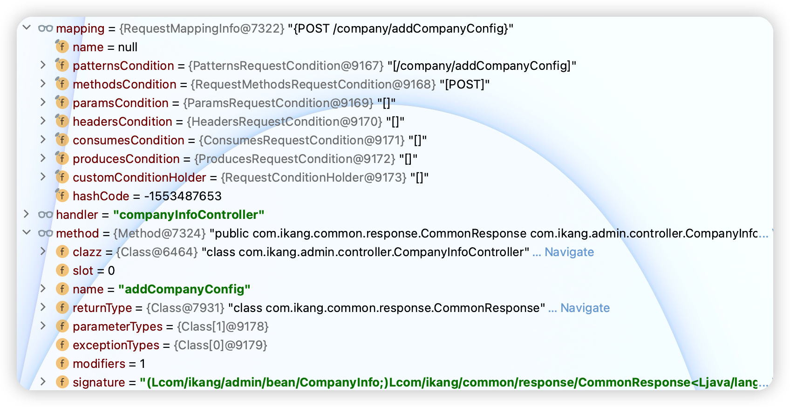
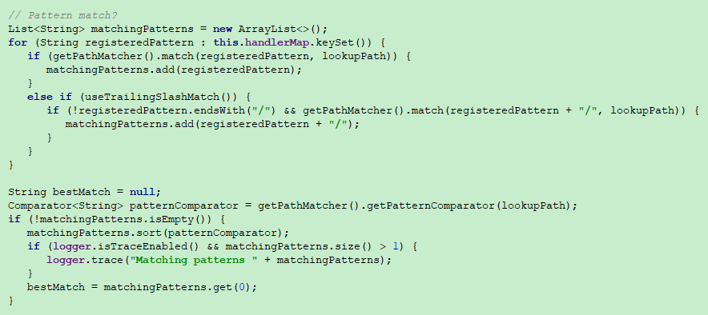

# Springmvc中@RequestMapping的实现原理

## 1、@RequestMapping处理方法的注册与匹配（源码都在这）

（1）重要的类、接口

 RequestMappingHandlerMapping 入口类

 RequestCondition 匹配条件接口，通过其实现类来判断是否匹配处理方法

 RequestMappingInfo 匹配条件信息类，实现RequestCondition，并包含多个RequestCondition实现类

（2）RequestMappingHandlerMapping源码解析

 以下是注册处理方法的相关源码

```java
// 实现了InitializingBean接口
public void afterPropertiesSet() {
	initHandlerMethods();
}
 
protected void initHandlerMethods() {
	if (logger.isDebugEnabled()) {
		logger.debug("Looking for request mappings in application context: " + getApplicationContext());
	}
	// 根据配置的扫描路径获取所有的bean
	String[] beanNames = (this.detectHandlerMethodsInAncestorContexts ?
			BeanFactoryUtils.beanNamesForTypeIncludingAncestors(getApplicationContext(), Object.class) :
			getApplicationContext().getBeanNamesForType(Object.class));
 
	for (String beanName : beanNames) {
		// 检查该bean是否是handler
		if (isHandler(getApplicationContext().getType(beanName))){
			detectHandlerMethods(beanName);
		}
	}
	handlerMethodsInitialized(getHandlerMethods());
}
 
// 通过@Controller或@RequestMapping来判断是否是handler
protected boolean isHandler(Class<?> beanType) {
	return ((AnnotationUtils.findAnnotation(beanType, Controller.class) != null) ||
			(AnnotationUtils.findAnnotation(beanType, RequestMapping.class) != null));
}
 
// 检测handler方法并注册
protected void detectHandlerMethods(final Object handler) {
	Class<?> handlerType = (handler instanceof String) ?
			getApplicationContext().getType((String) handler) : handler.getClass();
 
	final Class<?> userType = ClassUtils.getUserClass(handlerType);
 
	Set<Method> methods = HandlerMethodSelector.selectMethods(userType, new MethodFilter() {
		public boolean matches(Method method) {
			return getMappingForMethod(method, userType) != null;
		}
	});
 
	for (Method method : methods) {
		// 获取匹配该处理方法的条件信息
		T mapping = getMappingForMethod(method, userType);
		registerHandlerMethod(handler, method, mapping);
	}
}
 
// 获取匹配该处理方法的条件信息，RequestMappingInfo是满足该方法的条件信息，包括多个具体条件RequestCondition（可自定义实现）
protected RequestMappingInfo getMappingForMethod(Method method, Class<?> handlerType) {
	RequestMappingInfo info = null;
	RequestMapping methodAnnotation = AnnotationUtils.findAnnotation(method, RequestMapping.class);
	if (methodAnnotation != null) {
		RequestCondition<?> methodCondition = getCustomMethodCondition(method);
		info = createRequestMappingInfo(methodAnnotation, methodCondition);
		RequestMapping typeAnnotation = AnnotationUtils.findAnnotation(handlerType, RequestMapping.class);
		if (typeAnnotation != null) {
			RequestCondition<?> typeCondition = getCustomTypeCondition(handlerType);
			info = createRequestMappingInfo(typeAnnotation, typeCondition).combine(info);
		}
	}
	return info;
}
 
// 注册处理方法
protected void registerHandlerMethod(Object handler, Method method, T mapping) {
	HandlerMethod newHandlerMethod = createHandlerMethod(handler, method);
	HandlerMethod oldHandlerMethod = handlerMethods.get(mapping);
	if (oldHandlerMethod != null && !oldHandlerMethod.equals(newHandlerMethod)) {
		throw new IllegalStateException("Ambiguous mapping found. Cannot map '" + newHandlerMethod.getBean()
				+ "' bean method \n" + newHandlerMethod + "\nto " + mapping + ": There is already '"
				+ oldHandlerMethod.getBean() + "' bean method\n" + oldHandlerMethod + " mapped.");
	}
	// 以满足该处理方法的条件为key
	this.handlerMethods.put(mapping, newHandlerMethod);
	if (logger.isInfoEnabled()) {
		logger.info("Mapped \"" + mapping + "\" onto " + newHandlerMethod);
	}
 
	Set<String> patterns = getMappingPathPatterns(mapping);
	for (String pattern : patterns) {
		if (!getPathMatcher().isPattern(pattern)) {
			this.urlMap.add(pattern, mapping);
		}
	}
}
```

**我们的controller类、方法和@RequestMapping中写好的url是这样存储的，重点在于registerHandlerMethod方法**



以下是根据请求去匹配对应处理方法的相关源码

```java
// 获取处理方法
public final HandlerExecutionChain getHandler(HttpServletRequest request) throws Exception {
	Object handler = getHandlerInternal(request);
	
	......
}
 
// 获取请求路径，根据请求路径去获取处理方法
protected HandlerMethod getHandlerInternal(HttpServletRequest request) throws Exception {
	String lookupPath = getUrlPathHelper().getLookupPathForRequest(request);
	if (logger.isDebugEnabled()) {
		logger.debug("Looking up handler method for path " + lookupPath);
	}
 
	HandlerMethod handlerMethod = lookupHandlerMethod(lookupPath, request);
 
	......
}
 
// 根据请求路径去获取处理方法
protected HandlerMethod lookupHandlerMethod(String lookupPath, HttpServletRequest request) throws Exception {
	// 匹配到的结果集
	List<Match> matches = new ArrayList<Match>();
	// 根据路径直接等值匹配获取
	List<T> directPathMatches = this.urlMap.get(lookupPath);
	if (directPathMatches != null) {
		addMatchingMappings(directPathMatches, matches, request);
	}
 
	if (matches.isEmpty()) {
		// 遍历所有注册的处理方法条件去做匹配
		addMatchingMappings(this.handlerMethods.keySet(), matches, request);
	}
 
	if (!matches.isEmpty()) {
		Comparator<Match> comparator = new MatchComparator(getMappingComparator(request));
		Collections.sort(matches, comparator);
 
		if (logger.isTraceEnabled()) {
			logger.trace("Found " + matches.size() + " matching mapping(s) for [" + lookupPath + "] : " + matches);
		}
 
		Match bestMatch = matches.get(0);
		if (matches.size() > 1) {
			Match secondBestMatch = matches.get(1);
			if (comparator.compare(bestMatch, secondBestMatch) == 0) {
				Method m1 = bestMatch.handlerMethod.getMethod();
				Method m2 = secondBestMatch.handlerMethod.getMethod();
				throw new IllegalStateException(
						"Ambiguous handler methods mapped for HTTP path '" + request.getRequestURL() + "': {" +
						m1 + ", " + m2 + "}");
			}
		}
 
		handleMatch(bestMatch.mapping, lookupPath, request);
		return bestMatch.handlerMethod;
	}
	else {
		return handleNoMatch(handlerMethods.keySet(), lookupPath, request);
	}
}
 
private void addMatchingMappings(Collection<T> mappings, List<Match> matches, HttpServletRequest request) {
	for (T mapping : mappings) {
		// 根据条件信息和请求获得匹配结果，结果不为null则匹配成功
		T match = getMatchingMapping(mapping, request);
		if (match != null) {
			// 添加到匹配结果集中
			matches.add(new Match(match, handlerMethods.get(mapping)));
		}
	}
}
 
protected RequestMappingInfo getMatchingMapping(RequestMappingInfo info, HttpServletRequest request) {
	// 调用该条件的匹配方法去匹配请求，返回匹配结果
	return info.getMatchingCondition(request);
}
```

这里会涉及到一个匹配规则,spring是如何做的呢?

1. addMatchingMappings这个里面会进行一个循环匹配所有URL
2. 遍历的时候会得到这个key的RequestMappingInfo对象.RequestMappingInfo对象持有(PatternsRequestCondition对象)拥有匹配url的规则
3. PatternsRequestCondition对象又会交给AntPathMatcher , 这里的持有对象都是在初始化中如果没有指定Spring给你默认的,相当于实际匹配的规则都是在AntPathMatcher里面去操作的

AntPathMatcher操作思路: 

> 1. 他定义了一个ConcurrentHashMap对象stringMatcherCache,key是url中的每一个/后面的对象
>
> /a/b/{c} 它承装的就是三个对象 a、b、{c}都是它的key,value就是一个AntPathStringMatcher对象,这个对象会处理{c}这种情况,转化成对应的类似*这种正则匹配 
>
> 2. 上层经过解析到达AntPathMatcher 对象时是url中的一段一段path,然后从stringMatcherCache去找有没有对应的AntPathStringMatcher,如果没有则实例化一个,然后根据这个进行match,匹配则返回true

整体的匹配思路: 
前端传递一个: /a/b/c

程序会将这个url解析成3段去匹配 【a、b、c】 
2.先拿a去AntPathMatcher的matchStrings方法去进行匹配,而AntPathMatcher会转交给AntPathStringMatcher,通过则返回true
这里会涉及到一个优先级的问题: 
比如后端定义了3个url : 
1. /a/b/{c} 
2. /a/b/* 
3. /a/b/**

这三个都满足上面的匹配条件,这时候Spring会要优先选取一个最好的handle去处理. 

AntPathMatcher的内部类AntPatternComparator实现了一个compare方法

```java
/**
优先级排序规则
1. 需要注意的是返回 1 的 表示正序 -1 表示倒序

*/
protected static class AntPatternComparator implements Comparator<String> {
        private final String path;

        public AntPatternComparator(String path) {
            this.path = path;
        }

        /**
         * Compare two patterns to determine which should match first, i.e. which
         * is the most specific regarding the current path.
         * @return a negative integer, zero, or a positive integer as pattern1 is
         * more specific, equally specific, or less specific than pattern2.
         */
        @Override
        public int compare(String pattern1, String pattern2) {
            PatternInfo info1 = new PatternInfo(pattern1);
            PatternInfo info2 = new PatternInfo(pattern2);

             // 如果pattern1 > pattern2 则会将 pattern2 放在前面 (优先级较高), 反则不动
             // 再通俗一点讲 1表示Info2的优先级上调  , -1表示 info1的优先级上调

             // 如果是参数(pattern)里面是null 或者 是 /** 
            if (info1.isLeastSpecific() && info2.isLeastSpecific()) {
                return 0;
            }
                        // 优先级降低
            else if (info1.isLeastSpecific()) {
                return 1;
            }
                        // 优先级上升
            else if (info2.isLeastSpecific()) {
                return -1;
            }
                        // 具体匹配
            boolean pattern1EqualsPath = pattern1.equals(path);
            boolean pattern2EqualsPath = pattern2.equals(path);
            if (pattern1EqualsPath && pattern2EqualsPath) {
                return 0;
            }

            else if (pattern1EqualsPath) {
                return -1;
            }
            else if (pattern2EqualsPath) {
                return 1;
            }
                        // 如果第一个前缀不是/**和后缀不是/**结尾
            if (info1.isPrefixPattern() && info2.getDoubleWildcards() == 0) {
                return 1;
            }
            else if (info2.isPrefixPattern() && info1.getDoubleWildcards() == 0) {
                return -1;
            }
                        // TotalCount=(包含"{"的次数) +("*出现的次数") + "("**出现的次数")"
            if (info1.getTotalCount() != info2.getTotalCount()) {
                return info1.getTotalCount() - info2.getTotalCount();
            }
                        //"\\{[^/]+?\\}"替换后的长度
            if (info1.getLength() != info2.getLength()) {
                return info2.getLength() - info1.getLength();
            }
                        //*次数比较
            if (info1.getSingleWildcards() < info2.getSingleWildcards()) {
                return -1;
            }
            else if (info2.getSingleWildcards() < info1.getSingleWildcards()) {
                return 1;
            }
                        // { 出现的次数
            if (info1.getUriVars() < info2.getUriVars()) {
                return -1;
            }
            else if (info2.getUriVars() < info1.getUriVars()) {
                return 1;
            } 
            return 0;
        }
}
```

根据上面定义的优先级进行排序.之后会将优先级也就是list中的下标为0的作为最好的handle进行处理

1. 通过匹配的的controller放在list中（这里说的controller可以理解为@RequestMapping注解里写的标准路径）
2. 获取比较器，将匹配上的多个controller放到比较器中进行排序
3. 去排完序后的list的第0位

上面也有源码，只不过第一次学的时候没有注意看，把很重要的匹配部分源码看漏了，所以这里直接贴图



## 流程总结

初始化逻辑: 
1. 在IOC容器已经初始化容器的时候,会加载Spring的一个内置对象RequestMappingHandlerMapping,而这个对象又实现了InitializingBean方法.这时候就会触发afterPropertiesSet方法的调用 
2. 而这个方法里面则是会对ioc容器中的所有对象进行遍历,找到类中包含@Controller或者@RequestMapping等注解的类 
3. 将上面符合的类的方法进行遍历并且注册到Map中,这个map又分为一个url为key的map和方法对象为key的map 
4. 这时候HandlerMethod已经初始化完成

调用逻辑: 
1. 当前端发送一个url请求的时候,会被springMvc拦截到 
2. 会根据当前的url进行handler匹配,第一个匹配是根据url进行全路径匹配,这个匹配容器封装在了一个叫UrlMap中,如果匹配到直接返回map中的handlerMethod对象 
3. 如果上面没有匹配到,这时候会从一个封装方法的Map中去进行正则匹配,这里匹配是将所有的Controller中的路由方法进行匹配,这里会先将url按照/进行拆分成多个String进行全路径匹配,匹配到直接返回。 
4. 如果匹配不到,则开始进行一系列的正则匹配..具体的匹配规则可以参考上面的AntPatternComparator类,这里会将正则匹配到的url进行一个排序,最前面的优先级最高. 
5. 这里就会将优先级最高的进行反射调用

##  2、相关扩展

 （1）继承RequestMappingHandlerMapping，覆盖下面的两个方法，返回自定义的RequestCondition，可以控制判断请求与处理方法是否匹配

```java
protected RequestCondition<?> getCustomTypeCondition(Class<?> handlerType) {
    return null;
}
protected RequestCondition<?> getCustomMethodCondition(Method method) {
    return null;
}
```


## 3、收到请求查找对应@RequestMapping处理方法

 （1）相关类

 DispatcherServlet 入口类

（2）DispatcherServlet源码解析

以下分析只是关注如何获取到上面分析的RequestMappingHandlerMapping中注册的处理方法

```java
// 初始化相关策略，当然这里初始化了HandlerMapping
protected void initStrategies(ApplicationContext context) {
	initMultipartResolver(context);
	initLocaleResolver(context);
	initThemeResolver(context);
	initHandlerMappings(context);
	initHandlerAdapters(context);
	initHandlerExceptionResolvers(context);
	initRequestToViewNameTranslator(context);
	initViewResolvers(context);
	initFlashMapManager(context);
}
 
// 初始化了HandlerMapping
private void initHandlerMappings(ApplicationContext context) {
	this.handlerMappings = null;
 
	if (this.detectAllHandlerMappings) {
		// Find all HandlerMappings in the ApplicationContext, including ancestor contexts.
		Map<String, HandlerMapping> matchingBeans =
				BeanFactoryUtils.beansOfTypeIncludingAncestors(context, HandlerMapping.class, true, false);
		if (!matchingBeans.isEmpty()) {
			this.handlerMappings = new ArrayList<HandlerMapping>(matchingBeans.values());
			// We keep HandlerMappings in sorted order.
			OrderComparator.sort(this.handlerMappings);
		}
	}
	else {
		try {
			HandlerMapping hm = context.getBean(HANDLER_MAPPING_BEAN_NAME, HandlerMapping.class);
			this.handlerMappings = Collections.singletonList(hm);
		}
		catch (NoSuchBeanDefinitionException ex) {
			// Ignore, we'll add a default HandlerMapping later.
		}
	}
 
	// Ensure we have at least one HandlerMapping, by registering
	// a default HandlerMapping if no other mappings are found.
	if (this.handlerMappings == null) {
		this.handlerMappings = getDefaultStrategies(context, HandlerMapping.class);
		if (logger.isDebugEnabled()) {
			logger.debug("No HandlerMappings found in servlet '" + getServletName() + "': using default");
		}
	}
}
		
protected HandlerExecutionChain getHandler(HttpServletRequest request) throws Exception {
	// HandlerMapping的实现类就是上面提到的RequestMappingHandlerMapping
	for (HandlerMapping hm : this.handlerMappings) {
		if (logger.isTraceEnabled()) {
			logger.trace(
					"Testing handler map [" + hm + "] in DispatcherServlet with name '" + getServletName() + "'");
		}
		// 这里就回到了上面RequestMappingHandlerMapping中根据请求去匹配对应处理方法的分析了，整个流程就连接上了。
		HandlerExecutionChain handler = hm.getHandler(request);
		if (handler != null) {
			return handler;
		}
	}
	return null;
}
```

## 图解


