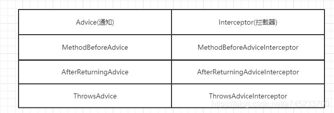

# Spring中所用到的设计模式

Spring是一个非常优秀的开源[框架](<https://so.csdn.net/so/search?q=%E6%A1%86%E6%9E%B6&spm=1001.2101.3001.7020>)，项目源码中所使用的设计模式随处可见，这篇文章主要记录一下Spring中常见的设计模式：

> （1）工厂模式：Spring使用工厂模式，通过BeanFactory和[ApplicationContext](<https://so.csdn.net/so/search?q=ApplicationContext&spm=1001.2101.3001.7020>)来创建对象
>
> （2）[单例模式](<https://so.csdn.net/so/search?q=%E5%8D%95%E4%BE%8B%E6%A8%A1%E5%BC%8F&spm=1001.2101.3001.7020>)：Bean默认为单例模式
>
> （3）策略模式：例如Resource的实现类，针对不同的资源文件，实现了不同方式的资源获取策略
>
> （4）代理模式：Spring的[AOP](<https://so.csdn.net/so/search?q=AOP&spm=1001.2101.3001.7020>)功能用到了JDK的动态代理和CGLIB字节码生成技术
>
> （5）模板方法：可以将相同部分的代码放在父类中，而将不同的代码放入不同的子类中，用来解决代码重复的问题。比如RestTemplate, JmsTemplate, JpaTemplate
>
> （6）适配器模式：Spring AOP的增强或通知（Advice）使用到了适配器模式，Spring MVC中也是用到了适配器模式适配Controller
>
> （7）观察者模式：Spring事件驱动模型就是观察者模式的一个经典应用。
>
> （8）桥接模式：可以根据客户的需求能够动态切换不同的数据源。比如我们的项目需要连接多个数据库，客户在每次访问中根据需要会去访问不同的数据库

## 一、工厂模式：

对于工厂模式不了解地读者可以阅读另外一篇文章：[Java设计模式之创建型模式：工厂模式（简单工厂模式+工厂方法模式）](<https://blog.csdn.net/a745233700/article/details/83591459>)

工厂模式是把创建对象的任务交给工厂，从而来降低类与类之间的耦合。Spring最主要的两个特性就是AOP和IOC，其中IOC就是控制反转，将对象的控制权转移给Spring，并由Spring创建实例和管理各个实例之间的依赖关系，其中，对象的创建就是通过BeanFactory 和 ApplicationContext 完成的。

1、首先看BeanFatory的[源码](<https://so.csdn.net/so/search?q=%E6%BA%90%E7%A0%81&spm=1001.2101.3001.7020>)：

```java
public interface BeanFactory {
    Object getBean(String name) throws BeansException;
    
    <T> T getBean(String name, @Nullable Class<T> requiredType) throws BeansException;
    
    Object getBean(String name, Object... args) throws BeansException;
    
    <T> T getBean(Class<T> requiredType) throws BeansException;
    
    <T> T getBean(Class<T> requiredType, Object... args) throws BeansException;
    //省略...
}
```

BeanFactory是Spring里面最底层的接口，是IoC的核心，定义了IoC的基本功能，包含了各种Bean的定义、加载、实例化，依赖注入和生命周期管理。BeanFactroy采用的是延迟加载形式来注入Bean的，只有在使用到某个Bean时(调用getBean())，才对该Bean进行加载实例化。这样，我们就不能提前发现一些存在的Spring的配置问题。

2、ApplicationContext接口作为BeanFactory的子类，除了提供BeanFactory所具有的功能外，还扩展了其他更完整功能，对于Bean创建，ApplicationContext在容器启动时，一次性创建了所有的Bean。

```java
public interface ApplicationContext extends EnvironmentCapable, ListableBeanFactory, HierarchicalBeanFactory,
MessageSource, ApplicationEventPublisher, ResourcePatternResolver {
    @Nullable
    String getId();
 
    String getApplicationName();
 
    String getDisplayName();
 
    long getStartupDate();
 
    @Nullable
    ApplicationContext getParent();
 
    AutowireCapableBeanFactory getAutowireCapableBeanFactory() throws IllegalStateException;
}
```

3、BeanFactory 和 ApplicationContext 在哪里初始化Bean就不展开细讲，主要看AbstractApplicationContext类的refresh()方法。

```java
@Override
public void refresh() throws BeansException, IllegalStateException {
    synchronized (this.startupShutdownMonitor) {
        //省略...
        try {
            //省略...
            //初始化所有的单实例 Bean(没有配置赖加载的)
            finishBeanFactoryInitialization(beanFactory);
        }catch (BeansException ex) {
            //省略...
        }finally {
            //省略...
        }
    }
}
```

## 二、单例模式：

对于单例模式不了解地读者可以阅读另外一篇文章：[Java设计模式之创建型模式：单例模式](<https://blog.csdn.net/a745233700/article/details/83618800>)

在Spring中的Bean默认的作用域就是**singleton单例**的。单例模式的好处在于**对一些重量级的对象，省略了重复创建对象花费的时间，减少了系统的开销**，第二点是使用单例**可以减少new操作的次数，减少了GC线程回收内存的压力**。

对于单例bean的创建方式，主要看DefaultSingletonBeanRegistry 的 getSingleton() 方法：

```java
public class DefaultSingletonBeanRegistry extends SimpleAliasRegistry implements SingletonBeanRegistry {
    /** 保存单例Objects的缓存集合ConcurrentHashMap，key：beanName --> value：bean实例 */
    private final Map<String, Object> singletonObjects = new ConcurrentHashMap<>(256);
 
    public Object getSingleton(String beanName, ObjectFactory<?> singletonFactory) {
        Assert.notNull(beanName, "Bean name must not be null");
        synchronized (this.singletonObjects) {
            //检查缓存中是否有实例，如果缓存中有实例，直接返回
            Object singletonObject = this.singletonObjects.get(beanName);
            if (singletonObject == null) {
                //省略...
                try {
                    //通过singletonFactory获取单例
                    singletonObject = singletonFactory.getObject();
                    newSingleton = true;
                }
                //省略...
                if (newSingleton) {
                    addSingleton(beanName, singletonObject);
                }
            }
            //返回实例
            return singletonObject;
        }
    }
    
    protected void addSingleton(String beanName, Object singletonObject) {
      synchronized (this.singletonObjects) {
        this.singletonObjects.put(beanName, singletonObject);
        this.singletonFactories.remove(beanName);
        this.earlySingletonObjects.remove(beanName);
        this.registeredSingletons.add(beanName);
      }
    }
}
```

从源码中可以看出，是通过ConcurrentHashMap的方式，如果在Map中存在则直接返回，如果不存在则创建，并且put进Map集合中，并且整段逻辑是使用同步代码块包住的，所以是线程安全的。

### 三种单例模式的写法


## 三、策略模式：

对于策略模式不了解地读者可以阅读另外一篇文章：[Java设计模式之行为型模式：策略模式](<https://blog.csdn.net/a745233700/article/details/83661703>)

策略模式，简单来说就是封装好一组策略算法，外部客户端根据不同的条件选择不同的策略算法解决问题。比如在Spring的Resource类，针对不同的资源，Spring定义了不同的Resource类的实现类，以此实现不同的访问方式。我们看一张类图：


简单介绍一下Resource的实现类：

- **UrlResource**：访问网络资源的实现类。
- **ServletContextResource**：访问相对于 ServletContext 路径里的资源的实现类。
- **ByteArrayResource**：访问字节数组资源的实现类。
- **PathResource**：访问文件路径资源的实现类。
- **ClassPathResource**：访问类加载路径里资源的实现类。

写一段伪代码来示范一下Resource类的使用：

```java
@RequestMapping(value = "/resource", method = RequestMethod.GET)
public String resource(@RequestParam(name = "type") String type,
                       @RequestParam(name = "arg") String arg) throws Exception {
    Resource resource;
    //这里可以优化为通过工厂模式，根据type创建Resource的实现类
    if ("classpath".equals(type)) {
        //classpath下的资源
        resource = new ClassPathResource(arg);
    } else if ("file".equals(type)) {
        //本地文件系统的资源
        resource = new PathResource(arg);
    } else if ("url".equals(type)) {
        //网络资源
        resource = new UrlResource(arg);
    } else {
        return "fail";
    }
    InputStream is = resource.getInputStream();
    ByteArrayOutputStream os = new ByteArrayOutputStream();
    int i;
    while ((i = is.read()) != -1) {
        os.write(i);
    }
    String result = new String(os.toByteArray(), StandardCharsets.UTF_8);
    is.close();
    os.close();
    return "type:" + type + ",arg:" + arg + "\r\n" + result;
}
```

这就是策略模式的思想，通过外部条件使用不同的算法解决问题。其实很简单，因为每个实现类的getInputStream()方法都不一样，我们看ClassPathResource的源码，是通过类加载器加载资源：

```java
public class ClassPathResource extends AbstractFileResolvingResource {
 
	private final String path;
 
	@Nullable
	private ClassLoader classLoader;
 
	@Nullable
	private Class<?> clazz;
    
    @Override
    public InputStream getInputStream() throws IOException {
        InputStream is;
        //通过类加载器加载类路径下的资源
        if (this.clazz != null) {
            is = this.clazz.getResourceAsStream(this.path);
        }
        else if (this.classLoader != null) {
            is = this.classLoader.getResourceAsStream(this.path);
        }
        else {
            is = ClassLoader.getSystemResourceAsStream(this.path);
        }
        //如果输入流is为null，则报错
        if (is == null) {
            throw new FileNotFoundException(getDescription() + " cannot be opened because it does not exist");
        }
        //返回InputStream
        return is;
    }
}
```

再看UrlResource的源码，获取InputStream的实现又是另一种策略。

```java
public class UrlResource extends AbstractFileResolvingResource {
	@Nullable
	private final URI uri;
 
	private final URL url;
 
	private final URL cleanedUrl;
    
	@Override
	public InputStream getInputStream() throws IOException {
		//获取连接
		URLConnection con = this.url.openConnection();
		ResourceUtils.useCachesIfNecessary(con);
		try {
			//获取输入流，并返回
			return con.getInputStream();
		}
		catch (IOException ex) {
			// Close the HTTP connection (if applicable).
			if (con instanceof HttpURLConnection) {
				((HttpURLConnection) con).disconnect();
			}
			throw ex;
		}
	}
}
```

## 四、代理模式：

对于代理模式不了解地读者可以阅读另外一篇文章：[Java设计模式之结构型模式：代理模式](<https://blog.csdn.net/a745233700/article/details/83629577>)

AOP是Spring的一个核心特性(面向切面编程)，作为面向对象的一种补充，用于将那些与业务无关，但却对多个对象产生影响的公共行为和逻辑，抽取并封装为一个可重用的模块，减少系统中的重复代码，降低了模块间的耦合度，提高系统的可维护性。可用于权限认证、日志、事务处理。

Spring AOP实现的关键在于动态代理，主要有两种方式，JDK动态代理和[CGLIB](<https://so.csdn.net/so/search?q=CGLIB&spm=1001.2101.3001.7020>)动态代理：

（1）JDK动态代理只提供接口的代理，不支持类的代理，要求被代理类实现接口。JDK动态代理的核心是InvocationHandler接口和Proxy类，在获取代理对象时，使用Proxy类来动态创建目标类的代理类（即最终真正的代理类，这个类继承自Proxy并实现了我们定义的接口），当代理对象调用真实对象的方法时， InvocationHandler 通过invoke()方法反射来调用目标类中的代码，动态地将横切逻辑和业务编织在一起；

（2）如果被代理类没有实现接口，那么Spring AOP会选择使用CGLIB来动态代理目标类。CGLIB（Code Generation Library），是一个代码生成的类库，可以在运行时动态的生成指定类的一个子类对象，并覆盖其中特定方法并添加增强代码，从而实现AOP。CGLIB是通过继承的方式做的动态代理，因此如果某个类被标记为final，那么它是无法使用CGLIB做动态代理的。

我们看DefaultAopProxyFactory的createAopProxy()方法，Spring通过此方法创建动态代理类：

```java
public class DefaultAopProxyFactory implements AopProxyFactory, Serializable {
	@Override
	public AopProxy createAopProxy(AdvisedSupport config) throws AopConfigException {
		if (config.isOptimize() || config.isProxyTargetClass() || hasNoUserSuppliedProxyInterfaces(config)) {
			Class<?> targetClass = config.getTargetClass();
			if (targetClass == null) {
				throw new AopConfigException("TargetSource cannot determine target class: " + "Either an interface or a target is required for proxy creation.");
			}
			if (targetClass.isInterface() || Proxy.isProxyClass(targetClass)) {
				return new JdkDynamicAopProxy(config);
			}
			return new ObjenesisCglibAopProxy(config);
		}
		else {
			return new JdkDynamicAopProxy(config);
		}
	}
}
```

从源码中可以看出，Spring会先判断是否实现了接口，如果实现了接口就使用JDK动态代理，如果没有实现接口则使用Cglib动态代理，也可以通过配置，强制使用Cglib动态代理，配置如下：

<pre><code class="language-java hljs">&lt;aop:aspectj-autoproxy proxy-target-class=<span class="hljs-string">"true"</span>/&gt;
</code><div class="hljs-button {2}" data-title="复制" onclick="hljs.copyCode(event)"></div></pre>

JDK动态代理和Cglib动态代理的区别：

- JDK动态代理只能对实现了接口的类生成代理，没有实现接口的类不能使用。
- Cglib动态代理即使被代理的类没有实现接口，也可以使用，因为Cglib动态代理是使用继承被代理类的方式进行扩展。
- Cglib动态代理是通过继承的方式，覆盖被代理类的方法来进行代理，所以如果方法是被final修饰的话，就不能进行代理。

## 五、模板模式：

对于模板模式不了解地读者可以阅读另外一篇文章：[Java设计模式之行为型模式：模板方法模式](<https://blog.csdn.net/a745233700/article/details/83662336>)

所谓模板就是一个方法，这个方法定义了算法的骨架，即将算法的实现定义成了一组步骤，并将一些步骤延迟到子类中实现，子类重写抽象类中的模板方法实现算法骨架中特定的步骤。模板模式可以不改变一个算法的结构即可重新定义该算法的某些特定步骤。在模板方法模式中，我们可以将相同部分的代码放在父类中，而将不同的代码放入不同的子类中，从而解决代码重复的问题。

Spring中的事务管理器就运用模板模式的设计，首先看PlatformTransactionManager类。这是最底层的接口，定义提交和回滚的方法。

```java
public interface PlatformTransactionManager {
    TransactionStatus getTransaction(@Nullable TransactionDefinition definition) throws TransactionException;
    
    void commit(TransactionStatus status) throws TransactionException;
    
    void rollback(TransactionStatus status) throws TransactionException;
}
```

毫无意外，使用了抽象类作为骨架，接着看AbstractPlatformTransactionManager类。

```java
@Override
public final void commit(TransactionStatus status) throws TransactionException {
    //省略...
    DefaultTransactionStatus defStatus = (DefaultTransactionStatus) status;
    if (defStatus.isLocalRollbackOnly()) {
        //省略...
        //调用processRollback()
        processRollback(defStatus, false);
        return;
    }
 
    if (!shouldCommitOnGlobalRollbackOnly() && defStatus.isGlobalRollbackOnly()) {
        //省略...
        //调用processRollback()
        processRollback(defStatus, true);
        return;
    }
    //调用processCommit()
    processCommit(defStatus);
}
 
//这个方法定义了骨架，里面会调用一个doRollback()的模板方法
private void processRollback(DefaultTransactionStatus status, boolean unexpected) {
    if (status.hasSavepoint()) {
        //省略...
    }
    else if (status.isNewTransaction()) {
        //调用doRollback()模板方法
        doRollback(status);
    }
    else {
        //省略...
    }
    //省略了很多代码...
}
 
private void processCommit(DefaultTransactionStatus status) throws TransactionException {
    //省略...
    if (status.hasSavepoint()) {
        //省略...
    }
    else if (status.isNewTransaction()) {
        //省略...
        //调用doCommit()模板方法
        doCommit(status);
    }
    else if (isFailEarlyOnGlobalRollbackOnly()) {
        unexpectedRollback = status.isGlobalRollbackOnly();
    }
    //省略了很多代码...
}
 
//模板方法doRollback()，把重要的步骤延迟到子类去实现
protected abstract void doRollback(DefaultTransactionStatus status) throws TransactionException;
 
//模板方法doCommit()，把重要的步骤延迟到子类去实现
protected abstract void doCommit(DefaultTransactionStatus status) throws TransactionException;
```

模板方法则由各种事务管理器的实现类去实现，也就是把骨架中重要的doRollback()延迟到子类。一般来说，Spring默认是使用的事务管理器的实现类是DataSourceTransactionManager。

```java
//通过继承AbstractPlatformTransactionManager抽象类
public class DataSourceTransactionManager extends AbstractPlatformTransactionManager
		implements ResourceTransactionManager, InitializingBean {
    //重写doCommit()方法，实现具体commit的逻辑
    @Override
    protected void doCommit(DefaultTransactionStatus status) {
        DataSourceTransactionObject txObject = (DataSourceTransactionObject) status.getTransaction();
        Connection con = txObject.getConnectionHolder().getConnection();
        if (status.isDebug()) {
            logger.debug("Committing JDBC transaction on Connection [" + con + "]");
        }
        try {
            con.commit();
        }
        catch (SQLException ex) {
            throw new TransactionSystemException("Could not commit JDBC transaction", ex);
        }
    }
    
    //重写doRollback()方法，实现具体的rollback的逻辑
    @Override
    protected void doRollback(DefaultTransactionStatus status) {
    DataSourceTransactionObject txObject = (DataSourceTransactionObject) status.getTransaction();
    Connection con = txObject.getConnectionHolder().getConnection();
    if (status.isDebug()) {
      logger.debug("Rolling back JDBC transaction on Connection [" + con + "]");
    }
    try {
      con.rollback();
    }
    catch (SQLException ex) {
      throw new TransactionSystemException("Could not roll back JDBC transaction", ex);
    }
  }
}
```

如果你是用Hibernate框架，Hibernate也有自身的实现，这就体现了[设计模式](<https://so.csdn.net/so/search?q=%E8%AE%BE%E8%AE%A1%E6%A8%A1%E5%BC%8F&spm=1001.2101.3001.7020>)的开闭原则，通过继承或者组合的方式进行扩展，而不是直接修改类的代码。Hibernate的事务管理器则是HibernateTransactionManager。

```java
public class HibernateTransactionManager extends AbstractPlatformTransactionManager
		implements ResourceTransactionManager, BeanFactoryAware, InitializingBean {
    
  //重写doCommit()方法，实现Hibernate的具体commit的逻辑
  @Override
  protected void doCommit(DefaultTransactionStatus status) {HibernateTransactionObject txObject = (HibernateTransactionObject) status.getTransaction();
      Transaction hibTx = txObject.getSessionHolder().getTransaction();
      Assert.state(hibTx != null, "No Hibernate transaction");
      if (status.isDebug()) {
        logger.debug("Committing Hibernate transaction on Session [" +
            txObject.getSessionHolder().getSession() + "]");
      }
      try {
        hibTx.commit();
      }
      catch (org.hibernate.TransactionException ex) {
        throw new TransactionSystemException("Could not commit Hibernate transaction", ex);
      }
          //省略...
    }
    
  //重写doRollback()方法，实现Hibernate的具体rollback的逻辑
  @Override
  protected void doRollback(DefaultTransactionStatus status) {
    HibernateTransactionObject txObject = (HibernateTransactionObject) status.getTransaction();
    Transaction hibTx = txObject.getSessionHolder().getTransaction();
    Assert.state(hibTx != null, "No Hibernate transaction");
    //省略...
    try {
      hibTx.rollback();
    }
    catch (org.hibernate.TransactionException ex) {
      throw new TransactionSystemException("Could not roll back Hibernate transaction", ex);
    }
        //省略...
    finally {
      if (!txObject.isNewSession() && !this.hibernateManagedSession) {
        txObject.getSessionHolder().getSession().clear();
      }
    }
  }
}
```

其实模板模式在日常开发中也经常用，比如一个方法中，前后代码都一样，只有中间有一部分操作不同，就可以使用模板模式进行优化代码，这可以大大地减少冗余的代码，非常实用。

## 六、适配器模式与责任链模式：

对于适配器模式不了解地读者可以阅读另外一篇文章：[Java设计模式之结构型模式：适配器模式](<https://blog.csdn.net/a745233700/article/details/83628122>)

对于责任链模式不了解地读者可以阅读另外一篇文章：[Java设计模式之行为型模式：责任链模式](<https://blog.csdn.net/a745233700/article/details/83691491>)

适配器模式**能使接口不兼容的对象能够相互合作，将一个类的接口，转换成客户期望的另外一个接口**。

在SpringAOP中有一个很重要的功能就是使用的 Advice（通知） 来增强被代理类的功能，Advice主要有MethodBeforeAdvice、AfterReturningAdvice、ThrowsAdvice这几种。每个Advice都有对应的拦截器，如下所示：



Spring需要将每个 Advice 都封装成对应的拦截器类型返回给容器，所以**需要使用适配器模式对 Advice 进行转换**。对应的就有三个适配器，我们看个类图：


适配器在Spring中是怎么把通知类和拦截类进行转换的呢，我们先看适配器的接口。定义了两个方法，分别是supportsAdvice()和getInterceptor()。

```java
public interface AdvisorAdapter {
    //判断通知类是否匹配
    boolean supportsAdvice(Advice advice);
    //传入通知类，返回对应的拦截类
    MethodInterceptor getInterceptor(Advisor advisor);
}
```

其实很简单，可以看出转换的方法就是getInterceptor()，通过supportsAdvice()进行判断。我们看前置通知的适配器的实现类MethodBeforeAdviceAdapter。

```java
class MethodBeforeAdviceAdapter implements AdvisorAdapter, Serializable {
    //判断是否匹配MethodBeforeAdvice通知类
	@Override
	public boolean supportsAdvice(Advice advice) {
		return (advice instanceof MethodBeforeAdvice);
	}
	//传入MethodBeforeAdvice，转换为MethodBeforeAdviceInterceptor拦截类
	@Override
	public MethodInterceptor getInterceptor(Advisor advisor) {
		MethodBeforeAdvice advice = (MethodBeforeAdvice) advisor.getAdvice();
		return new MethodBeforeAdviceInterceptor(advice);
	}
}
```

getInterceptor()方法中，调用了对应的拦截类的构造器创建对应的拦截器返回，传入通知类advice作为参数。接着我们看拦截器MethodBeforeAdviceInterceptor。

```java
public class MethodBeforeAdviceInterceptor implements MethodInterceptor, Serializable {
  //成员变量，通知类
  private MethodBeforeAdvice advice;
    
  //定义了有参构造器，外部通过有参构造器创建MethodBeforeAdviceInterceptor
  public MethodBeforeAdviceInterceptor(MethodBeforeAdvice advice) {
      Assert.notNull(advice, "Advice must not be null");
      this.advice = advice;
  }
  
  //当调用拦截器的invoke方法时，就调用通知类的before()方法，实现前置通知
  @Override
  public Object invoke(MethodInvocation mi) throws Throwable {
      //调用通知类的before()方法，实现前置通知
      this.advice.before(mi.getMethod(), mi.getArguments(), mi.getThis() );
      return mi.proceed();
  }
}
```

那么在哪里初始化这些适配器呢，我们看DefaultAdvisorAdapterRegistry()

```java
public class DefaultAdvisorAdapterRegistry implements AdvisorAdapterRegistry, Serializable {
 
  private final List<AdvisorAdapter> adapters = new ArrayList<>(3);
 
  public DefaultAdvisorAdapterRegistry() {
    //初始化适配器，添加到adapters集合，也就是注册
    registerAdvisorAdapter(new MethodBeforeAdviceAdapter());
    registerAdvisorAdapter(new AfterReturningAdviceAdapter());
    registerAdvisorAdapter(new ThrowsAdviceAdapter());
  }
    
  @Override
  public void registerAdvisorAdapter(AdvisorAdapter adapter) {
    this.adapters.add(adapter);
  }
    
    //获取所有的拦截器
    @Override
    public MethodInterceptor[] getInterceptors(Advisor advisor) throws UnknownAdviceTypeException {
        List<MethodInterceptor> interceptors = new ArrayList<>(3);
        Advice advice = advisor.getAdvice();
        if (advice instanceof MethodInterceptor) {
            interceptors.add((MethodInterceptor) advice);
        }
        //遍历adapters集合
        for (AdvisorAdapter adapter : this.adapters) {
            //调用supportsAdvice()方法，判断入参的advisor是否有匹配的适配器
            if (adapter.supportsAdvice(advice)) {
                //如果匹配，则调用getInterceptor()转换成对应的拦截器，添加到interceptors集合中
                interceptors.add(adapter.getInterceptor(advisor));
            }
        }
        if (interceptors.isEmpty()) {
            throw new UnknownAdviceTypeException(advisor.getAdvice());
        }
        //返回拦截器集合
        return interceptors.toArray(new MethodInterceptor[0]);
    }   
}
```

适配器模式在这里就是把通知类转为拦截类，转为拦截类之后，就添加到拦截器集合中。添加到拦截器集合之后，就用到了责任链模式，在ReflectiveMethodInvocation类被调用，我们看JDK动态代理JdkDynamicAopProxy的invoke()方法。

```java
@Override
@Nullable
public Object invoke(Object proxy, Method method, Object[] args) throws Throwable {
    MethodInvocation invocation;
    //这里就是获取拦截器集合，最后就会调用到上文说的getInterceptors()
    List<Object> chain = this.advised.getInterceptorsAndDynamicInterceptionAdvice(method, targetClass);
    if (chain.isEmpty()) {
        //省略...
    }else {
        //创建一个MethodInvocation
        invocation = new ReflectiveMethodInvocation(proxy, target, method, args, targetClass, chain);
        //调用proceed()方法，底层会通过指针遍历拦截器集合，然后实现前置通知等功能
        retVal = invocation.proceed();
    }
    //省略...
}
```

最后就在ReflectiveMethodInvocation里调用proceed()方法，proceed()方法是一个递归的方法，通过指针控制递归的结束。这是很典型的责任链模式。

```java
public class ReflectiveMethodInvocation implements ProxyMethodInvocation, Cloneable {
    protected final List<?> interceptorsAndDynamicMethodMatchers;
    //指针
    private int currentInterceptorIndex = -1;
    
    protected ReflectiveMethodInvocation(Object proxy, @Nullable Object target, Method method, @Nullable Object[] arguments, @Nullable Class<?> targetClass, List<Object> interceptorsAndDynamicMethodMatchers) {
        //省略...
        //拦截器的集合
        this.interceptorsAndDynamicMethodMatchers = interceptorsAndDynamicMethodMatchers;
    }
    
    @Override
    @Nullable
    public Object proceed() throws Throwable {
        //	We start with an index of -1 and increment early.
        if (this.currentInterceptorIndex == this.interceptorsAndDynamicMethodMatchers.size() - 1) {
            //递归结束
            return invokeJoinpoint();
        }
        //获取拦截器，并且当前的指针+1
        Object interceptorOrInterceptionAdvice = this.interceptorsAndDynamicMethodMatchers.get(++this.currentInterceptorIndex);
        if (interceptorOrInterceptionAdvice instanceof InterceptorAndDynamicMethodMatcher) {
            InterceptorAndDynamicMethodMatcher dm =
                (InterceptorAndDynamicMethodMatcher) interceptorOrInterceptionAdvice;
            if (dm.methodMatcher.matches(this.method, this.targetClass, this.arguments)) {
                return dm.interceptor.invoke(this);
            }
            else {
                //匹配失败，跳过，递归下一个
                return proceed();
            }
        }
        else {
            //匹配拦截器，强转为拦截器，然后执行invoke()方法，然后就会调用拦截器里的成员变量的before()，afterReturning()等等，实现前置通知，后置通知，异常通知
            return ((MethodInterceptor) interceptorOrInterceptionAdvice).invoke(this);
        }
    }
}
```

这里可能没学过责任链模式的同学会看得有点晕，但是学过责任链模式应该很容易看懂，这其实跟SpringMVC的拦截器的逻辑实现几乎一样的。

## 七 、观察者模式：

对于观察者模式不了解地读者可以阅读另外一篇文章：[Java设计模式之行为型模式：观察者模式](<https://blog.csdn.net/a745233700/article/details/83662714>)

观察者模式是一种对象行为型模式，当一个对象发生变化时，这个对象所依赖的对象也会做出反应。

Spring 事件驱动模型就是观察者模式很经典的一个应用。

**1、事件角色：**

在Spring事件驱动模型中，首先有事件角色ApplicationEvent，这是一个抽象类，抽象类下有四个实现类代表四种事件。

- ContextStartedEvent：ApplicationContext启动后触发的事件。
- ContextStoppedEvent：ApplicationContext停止后触发的事件。
- ContextRefreshedEvent：ApplicationContext初始化或刷新完成后触发的事件。
- ContextClosedEvent：ApplicationContext关闭后触发的事件。


**2、事件发布者：**

有了事件之后，需要有个发布者发布事件，发布者对应的类是ApplicationEventPublisher。

```java
@FunctionalInterface
public interface ApplicationEventPublisher {
    default void publishEvent(ApplicationEvent event) {
        publishEvent((Object) event);
    }
    
    void publishEvent(Object event);
}
```

@FunctionalInterface表示这是一个函数式接口，函数式接口只有一个抽象方法。ApplicationContext类又继承了ApplicationEventPublisher类，所以我们可以使用ApplicationContext发布事件。

**3、事件监听者：**

发布事件后需要有事件的监听者，事件监听者通过实现接口ApplicationListener来定义，这是一个函数式接口，并且带有泛型，要求E参数是ApplicationEvent的子类。

```java
@FunctionalInterface
public interface ApplicationListener<E extends ApplicationEvent> extends EventListener {
 
	void onApplicationEvent(E event);
}
```

4、下面我们演示一下怎么使用，首先继承抽象类ApplicationEvent定义一个事件角色PayApplicationEvent。

```java
public class PayApplicationEvent extends ApplicationEvent {
 
    private String message;
 
    public PayApplicationEvent(Object source, String message) {
        super(source);
        this.message = message;
    }
 
    public String getMessage() {
        return message;
    }
}
```

接着定义一个PayApplicationEvent事件的监听者PayListener。

```java
@Component
public class PayListener implements ApplicationListener<PayApplicationEvent> {
    
    @Override
    public void onApplicationEvent(PayApplicationEvent event) {
        String message = event.getMessage();
        System.out.println("监听到PayApplicationEvent事件，消息为：" + message);
    }
}
```

最后我们使用ApplicationContext发布事件。

```java
@SpringBootApplication
public class SpringmvcApplication {
 
    public static void main(String[] args) throws Exception {
        ApplicationContext applicationContext = SpringApplication.run(SpringmvcApplication.class, args);
        applicationContext.publishEvent(new PayApplicationEvent(applicationContext,"成功支付100元！"));
    }
}
```

启动之后我们可以看到控制台打印：

