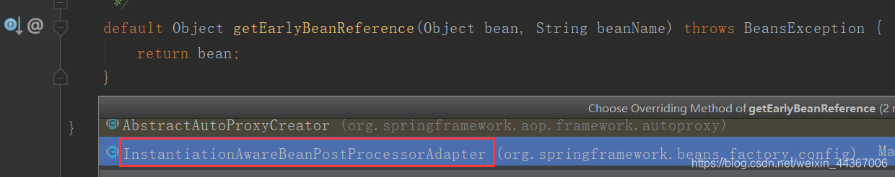

# Spring中的循环依赖问题

## 一、什么是循环依赖？

例如，就是A对象依赖了B对象，B对象依赖了A对象。

```java
// A依赖了B
class A{
  public B b;
} 

// B依赖了A
class B{
  public A a;
}
```

如果不考虑Spring，循环依赖并不是问题，因为对象之间相互依赖是很正常的事情。<br>

 比如：

```java
A a = new A();
B b = new B();

a.b = b;
b.a = a;
```

这样，A,B就依赖上了。

但是，在 Spring 中循环依赖就是一个问题了，因为，在 Spring 中，一个对象并不是简单 new 出来了，而是会经过一系列的 Bean 的[生命周期](<https://so.csdn.net/so/search?q=%E7%94%9F%E5%91%BD%E5%91%A8%E6%9C%9F&spm=1001.2101.3001.7020>)，就是因为 Bean 的生命周期所以才会出现循环依赖问题。当然，在 Spring 中，出现循环依赖的场景很多，有的场景 Spring 自动帮我们解决了，而有的场景则需要程序员来解决。

要明白Spring中的循环依赖，得先明白Spring中Bean的生命周期。

## 二、Bean的生命周期

### 2\.1 Spring Bean 的生命周期

具体看这篇博客–>> [<u>Spring Bean 的生命周期</u>](<https://blog.csdn.net/weixin_44129618/article/details/121989474>)

### 2\.2 Bean 的生成步骤

被 Spring 管理的对象叫做 Bean 。**Bean的生成步骤如下：**

1. Spring 扫描 class 得到 BeanDefinition；
2. 根据得到的 BeanDefinition 去生成 bean；
3. 首先根据 class 推断构造方法；
4. 根据推断出来的构造方法，反射，得到一个对象（**暂时叫做原始对象**）；
5. 填充原始对象中的属性（依赖注入）；
6. 如果原始对象中的某个方法被 AOP 了，那么则需要根据原始对象生成一个代理对象；
7. 把最终生成的代理对象放入单例池（**源码中叫做 singletonObjects**）中，下次 getBean 时就直接从单例池拿即可；


**对于 Spring 中的 Bean 的生成过程，步骤还是很多的，并且不仅仅只有上面的7步**，还有很多很多，这里不详细说了。

我们可以发现，在得到一个原始对象后，**Spring 需要给对象中的属性进行依赖注入，那么这个注入过程是怎样的？**

比如上文说的 A 类，A 类中存在一个 B 类的 b 属性，所以，当 A 类生成了一个原始对象之后，就会去给 b 属性去赋值，此时就会根据 b 属性的类型和属性名去 BeanFactory 中去获取 B 类所对应的单例bean。

1. 如果此时 BeanFactory 中存在 B 对应的 Bean，那么直接拿来赋值给 b 属性；
2. 如果此时 BeanFactory 中不存在 B 对应的 Bean，则需要生成一个 B 对应的 Bean，然后赋值给 b属性。


问题就出现在「第二种」情况，如果此时 B 类在 BeanFactory 中还没有生成对应的 Bean，那么就需要去生成，就会经过 B 的 Bean 的生命周期。

那么在创建 B 类的 Bean 的过程中，如果 B 类中存在一个 A 类的 a 属性，那么在创建 B 的 Bean 的过程中就需要 A 类对应的 Bean，但是，触发 B 类 Bean 的创建的条件是 A 类 Bean 在创建过程中的依赖注入，所以这里就出现了循环依赖：

<mark>A Bean创建–&gt;依赖了 B 属性–&gt;触发 B Bean创建—&gt;B 依赖了 A 属性—&gt;需要 A Bean（但A Bean还在创建过程中）</mark>

<u>从而导致 A Bean 创建不出来，B Bean 也创建不出来。</u>

这是循环依赖的场景，但是上文说了，在 Spring 中，通过某些机制帮开发者解决了部分循环依赖的问题，这个机制就是「**三级缓存**」。

## 三、三级缓存

- **一级缓存为**：singletonObjects；
- **二级缓存为**：earlySingletonObjects；
- **三级缓存为**：singletonFactories；

```java
/** Cache of singleton objects: bean name –> bean instance */
private final Map singletonObjects = new ConcurrentHashMap(256);

/** Cache of singleton factories: bean name –> ObjectFactory */
private final Map> singletonFactories = new HashMap>(16);

/** Cache of early singleton objects: bean name –> bean instance */
private final Map earlySingletonObjects = new HashMap(16);
```


### 3\.1三个缓存分别有什么作用

「**singletonObjects**」**中缓存的是已经经历了完整生命周期的bean对象。**

「**earlySingletonObjects**」**比 singletonObjects 多了一个 early ，表示缓存的是早期的 bean对象。早期指的是 Bean 的生命周期还没走完就把这个 Bean 放入了 earlySingletonObjects。**

「**singletonFactories**」**中缓存的是 ObjectFactory，表示对象工厂，用来创建某个对象的。**

## 四、思路分析

上文分析得到，之所以产生循环依赖的问题

主要是：A创建时—>需要B---->B去创建—>需要A，从而产生了循环。


**那么如何打破这个循环，加个缓存就可以了**

<br>

 A 的 Bean 在创建过程中，**在进行依赖注入之前，先把 A 的原始 Bean 放入缓存**（提早暴露，只要放到缓存了，其他 Bean 需要时就可以从缓存中拿了），**放入缓存后，再进行依赖注入**，此时 A 的Bean 依赖了 B 的 Bean 。

如果 B 的 Bean 不存在，则需要创建 B 的 Bean，而**创建 B 的 Bean 的过程和 A 一样，也是先创建一个 B 的原始对象，然后把 B 的原始对象提早暴露出来放入缓存中**，然后在对 B 的原始对象进行依赖注入 A，此时能从缓存中拿到 A 的原始对象（虽然是 A 的原始对象，还不是最终的 Bean），B 的原始对象依赖注入完了之后，B 的生命周期结束，那么 A 的生命周期也能结束。

因为整个过程中，都只有一个 A 原始对象，所以对于 B 而言，就算在属性注入时，注入的是 A 原始对<br>

 象，也没有关系，因为**A 原始对象在后续的生命周期中在堆中没有发生变化**。

### 4\.1 为什么 Spring 中还需要 singletonFactories 呢？

**从上面这个分析过程中可以得出，只需要一个缓存就能解决循环依赖了，那么为什么 Spring 中还需要 singletonFactories 呢？**

基于上面的场景思考一个问题：

<u>如果 A 的原始对象注入给 B 的属性之后，A 的原始对象进行了 AOP 产生了一个代理对象，此时就会出现，对于 A 而言，它的 Bean 对象其实应该是 AOP 之后的代理对象，而 B 的 a 属性对应的并不是 AOP 之后的代理对象，这就产生了冲突。</u>

**B 依赖的 A 和最终的 A 不是同一个对象。**

那么如何解决这个问题？这个问题可以说没有办法解决。**因为在一个 Bean 的生命周期最后，Spring提供了 BeanPostProcessor 可以去对 Bean 进行加工，这个加工不仅仅只是能修改 Bean 的属性值，也可以替换掉当前 Bean 。**

**在BeanPostProcessor 中可以完全替换掉某个 beanName 对应的 bean 对象**。

**而 BeanPostProcessor 的执行在 Bean 的生命周期中是处于属性注入之后的，循环依赖是发生在属性注入过程中的，所以很有可能导致，注入给 B 对象的 A 对象和经历过完整生命周期之后的 A 对象，不是一个对象。这就是有问题的。**

所以在这种情况下的循环依赖，Spring 是解决不了的，因为在属性注入时，Spring 也不知道 A 对象后续会经过哪些 BeanPostProcessor 以及会对 A 对象做什么处理。

## 五、Spring解决了哪种情况下的循环依赖

虽然上面的情况可能发生，但是肯定发生得很少。某个 beanName 对应的最终对象和原始对象不是一个对象却会经常出现，这就是 AOP 。

**AOP 就是通过一个 BeanPostProcessor 来实现的**，在 Spring 中 AOP 利用的要么是 JDK 动态代理，要么 CGLib 的动态代理，所以如果给一个类中的某个方法设置了切面，那么这个类最终就需要生成一个代理对象。

一般过程就是：**A 类—>生成一个普通对象–>属性注入–>基于切面生成一个代理对象–>把代理对象<br>

 放入 singletonObjects 单例池中。**<br>


**而 AOP 可以说是 Spring 中除开 IOC 的另外一大功能，而循环依赖又是属于 IOC 范畴的，所以这两大功能想要并存，Spring 需要特殊处理。**

如何处理的，就是利用了**第三级缓存 singletonFactories**。

首先，**singletonFactories 中存的是某个 beanName 对应的 ObjectFactory，在 bean 的生命周期中，生成完原始对象之后，就会构造一个 ObjectFactory 存入 singletonFactories 中。**


### 5\.1 ObjectFactory

这个 ObjectFactory 是一个函数式接口，支持Lambda表达式：**() ->getEarlyBeanReference(beanName, mbd, bean)**

上面的Lambda表达式就是一个ObjectFactory，执行该Lambda表达式就会去执行**getEarlyBeanReference方法**，而该方法如下：


 该方法会去执行**SmartInstantiationAwareBeanPostProcessor中的getEarlyBeanReference方法**，而这个接口下的实现类中只有两个类实现了这个方法，**一个是AbstractAutoProxyCreator，一个是InstantiationAwareBeanPostProcessorAdapter**，它的实现如下：

**InstantiationAwareBeanPostProcessorAdapter**


**AbstractAutoProxyCreator**

<br>

 由上图可以得知，在整个Spring中，**默认就只有AbstractAutoProxyCreator真正意义上实现了getEarlyBeanReference方法，而该类就是用来进行AOP的**。

## 六、getEarlyBeanReference方法


**首先得到一个cachekey，cachekey就是beanName**。然后把beanName和bean（这是原始对象）存入 earlyProxyReferences 中。调用 **wrapIfNecessary 进行AOP**，得到一个代理对象。

那么什么时候会调用 getEarlyBeanReference 方法呢？让我们继续看如下这张图。


 图中的 ObjectFactory 就是上文说的 labmda 表达式，中间有 getEarlyBeanReference 方法。

**注意存入 singletonFactories 时并不会执行 lambda 表达式，也就是不会执行getEarlyBeanReference 方法。**

从 singletonFactories 根据 beanName 得到一个 ObjectFactory ，然后执行 ObjectFactory ，也就是执行 getEarlyBeanReference 方法，此时会**得到一个 A 原始对象经过 AOP 之后的代理对象，然后把该代理对象放入 earlySingletonObjects 中。**

**此时并没有把代理对象放入 singletonObjects 中，那什么时候放入到 singletonObjects 中呢？**

此时，我们只得到了 A 原始对象的代理对象，这个对象还不完整，因为 A 原始对象还没有进行属性填充，所以此时不能直接把A的代理对象放入 singletonObjects 中，所以只能把代理对象放入earlySingletonObjects 。

**假设现在有其他对象依赖了 A，那么则可以从 earlySingletonObjects 中得到 A 原始对象的代理对象了，并且是A的同一个代理对象。**

当 B 创建完了之后，A 继续进行生命周期，而 A 在完成属性注入后，会按照它本身的逻辑去进行AOP，而此时我们知道 A 原始对象已经经历过了 AOP ，所以对于 A 本身而言，不会再去进行 AOP了，那么怎么判断一个对象是否经历过了 AOP 呢？

会利用上文提到的 earlyProxyReferences，在 AbstractAutoProxyCreator 的 postProcessAfterInitialization 方法中，会去判断当前 beanName 是否

 在 earlyProxyReferences，如果在则表示已经提前进行过 AOP了，无需再次进行 AOP。

对于 A 而言，进行了 AOP 的判断后，以及 BeanPostProcessor 的执行之后，就需要把 A 对应的对象放入 singletonObjects 中了，但是我们知道，应该是要 A 的代理对象放入 singletonObjects 中，所以此时需要从 earlySingletonObjects 中得到代理对象，然后入 singletonObjects 中。

**至此，整个循环依赖解决完毕。**

#### getEarlyBeanReference源码

这个方法的入参里有一个匿名类的返回值。
我们先看这个方法的代码：
类 DefaultSingletonBeanRegistry

```java
protected void addSingletonFactory(String beanName, ObjectFactory<?> singletonFactory) {
Assert.notNull(singletonFactory, "Singleton factory must not be null");
	synchronized (this.singletonObjects) {
		//如果一级缓存里没有
		if (!this.singletonObjects.containsKey(beanName)) {
			//放入三级缓存
			this.singletonFactories.put(beanName, singletonFactory);
			//从二级缓存移除
			this.earlySingletonObjects.remove(beanName);
			this.registeredSingletons.add(beanName);
		}
	}
}
```

可以看到三级缓存里，key 是 beanName，value 就是这个匿名类的返回值，对象工厂 singletonFactory。

而 singletonFactory.getObject() 的返回值就是是 getEarlyBeanReference 的返回值

跟 getEarlyBeanReference：

```java
protected Object getEarlyBeanReference(String beanName, RootBeanDefinition mbd, Object bean) {
	Object exposedObject = bean;
	if (!mbd.isSynthetic() && hasInstantiationAwareBeanPostProcessors()) {
		for (BeanPostProcessor bp : getBeanPostProcessors()) {
			if (bp instanceof SmartInstantiationAwareBeanPostProcessor) {
				SmartInstantiationAwareBeanPostProcessor ibp = (SmartInstantiationAwareBeanPostProcessor) bp;
								//拿到经过处理的 Bean
				exposedObject = ibp.getEarlyBeanReference(exposedObject, beanName);
			}
		}
	}
	return exposedObject;
}
```

跟 getEarlyBeanReference：


循环到 InstantiationAwareBeanPostProcessorAdapter

返回的就是一个 bean，这个 BeanPostProcessor 在这里并不做处理。

而如果是 AbstractAutoProxyCreator

```java
@Override
public Object getEarlyBeanReference(Object bean, String beanName) {
	Object cacheKey = getCacheKey(bean.getClass(), beanName);
	if (!this.earlyProxyReferences.contains(cacheKey)) {
		this.earlyProxyReferences.add(cacheKey);
	}
			//返回代理对象，假如能生成代理的话，见3
	return wrapIfNecessary(bean, beanName, cacheKey);
}
```

#### wrapIfNecessary

真正创建代理的方法

getEarlyBeanReference和postProcessAfterInitializa这两个最终都是调用wrapIfNecessary创建代理对象。

逻辑大概：

判断这个bean是否被代理过，如果有，则直接返回传进来的，避免创建多个代理对象。

如果没有被代理过，则创建代理对象，记录到缓存中，然后返回代理对象。


## 七、总结

**总结一下三级缓存：**

1. 「**singletonObjects**」：缓存某个 beanName 对应的经过了完整生命周期的bean；
2. 「**earlySingletonObjects**」：缓存提前拿原始对象进行了 AOP 之后得到的代理对象，原始对象还没有进行属性注入和后续的 BeanPostProcesso r等生命周期；
3. 「**singletonFactories**」：缓存的是一个 ObjectFactory ，主要用来去生成原始对象进行了 AOP之后得到的「代理对象」，在每个 Bean 的生成过程中，都会提前暴露一个工厂，这个工厂可能用到，也可能用不到，如果没有出现循环依赖依赖本 bean，那么这个工厂无用，本 bean 按照自己的生命周期执行，执行完后直接把本 bean 放入 singletonObjects 中即可，如果出现了循环依赖依赖了本 bean，则另外那个 bean 执行 ObjectFactory 提交得到一个 AOP 之后的代理对象（如果有 AOP 的话，如果无需 AOP ，则直接得到一个原始对象）。
