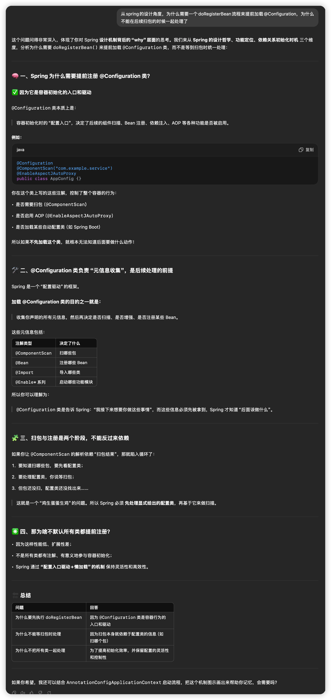

好的，下面我将从**讲解 + 简易源码流程图解**的角度，带你梳理 Spring 容器（以 AnnotationConfigApplicationContext 为代表）的初始化流程。这个过程涵盖了 Spring Bean 是如何被扫描、实例化、依赖注入、以及完成生命周期管理的。

## **🧠 一、概念总览：Spring 容器初始化主要阶段**

以 new AnnotationConfigApplicationContext(AppConfig.class) 为入口，总体流程可划分为：

1. **构造阶段**（创建 context 对象）
2. **refresh() 阶段**：
   - 准备工作：创建 BeanFactory 等
   - **Bean 定义注册阶段**（@ComponentScan、@Bean 等注解处理）
   - **BeanFactory 后处理阶段**（执行 BeanFactoryPostProcessor）
   - **Bean 实例化阶段**（Bean 创建、依赖注入、AOP 等）
   - **Bean 初始化阶段**（执行 InitializingBean、@PostConstruct）
   - 完成 refresh 生命周期

## **🧾 二、简化源码流程（基于** 

## **AnnotationConfigApplicationContext**

```
AnnotationConfigApplicationContext context = new AnnotationConfigApplicationContext(AppConfig.class);
```

### **🔽 简化源码步骤如下：**

```
1. new AnnotationConfigApplicationContext()
   -> 初始化 BeanFactory（DefaultListableBeanFactory）
   -> 创建 AnnotatedBeanDefinitionReader（注册内部注解处理器）
   -> 创建 ClassPathBeanDefinitionScanner（用于扫描 @Component）

2. register(AppConfig.class)
   -> 将配置类 AppConfig 注册为 BeanDefinition（即 bean 的元信息）

3. refresh()
   |-- prepareRefresh()                // 容器启动准备
   |-- obtainFreshBeanFactory()       // 获取 BeanFactory（已准备好）
   |-- invokeBeanFactoryPostProcessors()
   |      |- ConfigurationClassPostProcessor → 处理 @ComponentScan、@Import 等
   |      |- 注册 BeanDefinition（根据扫描到的类、方法、注解）
   |
   |-- registerBeanPostProcessors()   // 注册 BeanPostProcessor，比如 AOP、注解支持
   |-- initMessageSource()            // 国际化
   |-- initApplicationEventMulticaster()
   |-- onRefresh()
   |-- registerListeners()
   |
   |-- finishBeanFactoryInitialization()
   |      |- 实例化非懒加载的单例 Bean
   |      |- 包括依赖注入、@Value、@Autowired、AOP 织入、生命周期回调等
   |
   |-- finishRefresh()                // 容器刷新完成，发布 ContextRefreshedEvent
```

## **📌 三、关键源码类一览（关键逻辑位置）**

| **步骤**      | **类 / 方法**                                   | **简述**                                  |
| ------------- | ----------------------------------------------- | ----------------------------------------- |
| 容器初始化    | AnnotationConfigApplicationContext 构造方法     | 注册注解处理器                            |
| Bean 定义注册 | ConfigurationClassPostProcessor                 | 扫描 @ComponentScan 并生成 BeanDefinition |
| Bean 创建     | AbstractAutowireCapableBeanFactory#createBean() | 真正实例化 Bean 的入口                    |
| 生命周期回调  | BeanPostProcessor 接口                          | AOP、注解处理等都基于它实现               |
| AOP织入       | AbstractAutoProxyCreator                        | 动态生成代理 Bean                         |

## **🧭 四、最精简流程图（简化版）**

```
AnnotationConfigApplicationContext(AppConfig.class)
         ↓
register(AppConfig)
         ↓
refresh()
   ↓       ↓       ↓
  扫描   实例化   初始化
         ↓
      依赖注入 + AOP + 生命周期
         ↓
     Spring 容器就绪
```

## **🎯 总结重点记忆点：**

- refresh() 是容器初始化的核心方法
- Bean 的定义和 Bean 的实例是两个阶段（先扫描、再创建）
- Bean 创建过程包括构造器、依赖注入、生命周期方法、AOP代理等
- Spring 是通过各种后置处理器（BeanFactoryPostProcessor / BeanPostProcessor）实现复杂逻辑解耦

