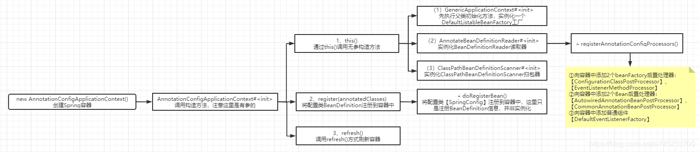
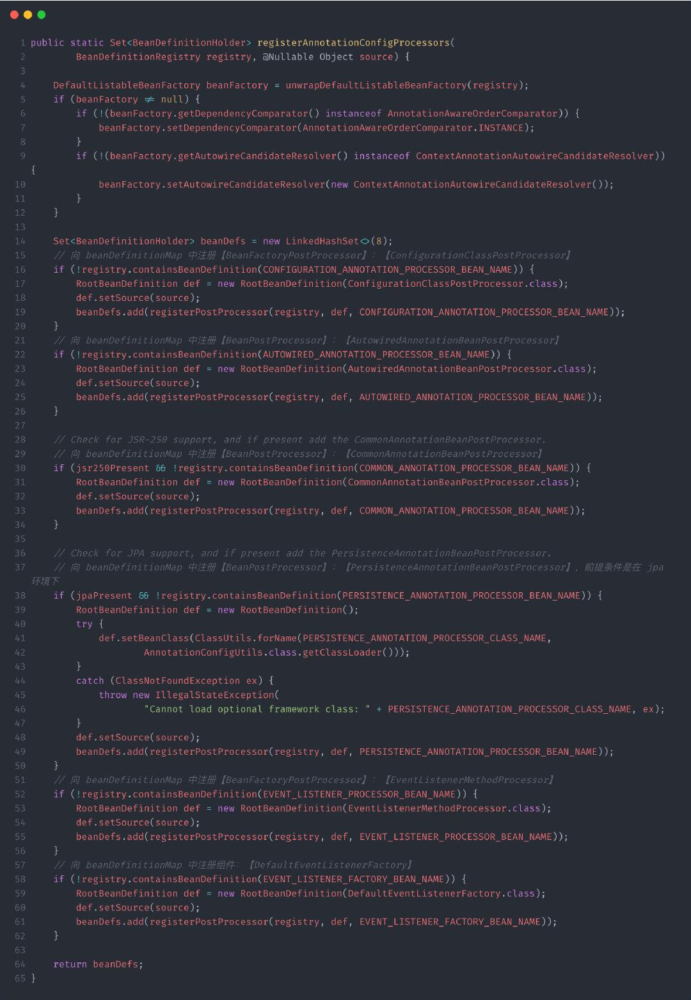

# Spring容器的启动流程

**（本文基于 Spring 的 5.1.6.RELEASE 版本）**

Spring的启动流程可以归纳为三个步骤：

- 1、初始化Spring容器，注册内置的BeanPostProcessor的BeanDefinition到容器中
- 2、将配置类的BeanDefinition注册到容器中
- 3、调用refresh()方法刷新容器


因为是基于 java-config 技术分析源码，所以这里的入口是 AnnotationConfigApplicationContext ，如果是使用 xml 分析，那么入口即为 ClassPathXmlApplicationContext ，它们俩的共同特征便是都继承了 AbstractApplicationContext 类，而大名鼎鼎的 refresh()便是在这个类中定义的。我们接着分析 AnnotationConfigApplicationContext 类，源码如下：

```java
//BeanDefinition：bean定义
// 初始化容器
public AnnotationConfigApplicationContext(Class<?>... annotatedClasses) {
    // 注册 Spring 内置的后置处理器的 BeanDefinition 到容器
    this();
    // 注册各种配置类 BeanDefinition 到容器
    register(annotatedClasses);
    // 加载或者刷新容器中的Bean
    refresh();
}
```

所以整个Spring容器的启动流程可以绘制成如下流程图：



接着我们主要从这三个入口详细分析一下Spring的启动流程：

### 一、初始化流程：

1、spring容器的初始化时，通过this()调用了无参构造函数，主要做了以下三个事情：

- （1）实例化BeanFactory【DefaultListableBeanFactory】工厂，用于生成Bean对象
- （2）实例化BeanDefinitionReader注解配置读取器，用于对特定注解（如@Service、@Repository）的类进行读取转化成 BeanDefinition 对象，（BeanDefinition 是 Spring 中极其重要的一个概念，它存储了 bean 对象的所有特征信息，如是否单例，是否懒加载，factoryBeanName 等）
- （3）实例化ClassPathBeanDefinitionScanner路径扫描器，用于对指定的包目录进行扫描查找 bean 对象


**2、核心代码剖析：**

**（1）向容器添加内置组件：org.springframework.context.annotation.AnnotationConfigUtils#registerAnnotationConfigProcessors：**

根据上图分析，代码运行到这里时候，Spring 容器已经构造完毕，那么就可以为容器添加一些内置组件了，其中最主要的组件便是 ConfigurationClassPostProcessor 和 AutowiredAnnotationBeanPostProcessor ，前者是一个 beanFactory 后置处理器，用来完成 bean 的扫描与注入工作，后者是一个 bean 后置处理器，用来完成 @AutoWired 自动注入。




### 二、注册SpringConfig配置类到容器中：

**1、将SpringConfig注册到容器中：org.springframework.context.annotation.AnnotatedBeanDefinitionReader#doRegisterBean：**

这个步骤主要是用来解析用户传入的 Spring 配置类，解析成一个 BeanDefinition 然后注册到容器中，主要源码如下：

```java
<T> void doRegisterBean(Class<T> annotatedClass, @Nullable Supplier<T> instanceSupplier, @Nullable String name,
		@Nullable Class<? extends Annotation>[] qualifiers, BeanDefinitionCustomizer... definitionCustomizers) {
	// 解析传入的配置类，实际上这个方法既可以解析配置类，也可以解析 Spring bean 对象
	AnnotatedGenericBeanDefinition abd = new AnnotatedGenericBeanDefinition(annotatedClass);
	// 判断是否需要跳过，判断依据是此类上有没有 @Conditional 注解
	if (this.conditionEvaluator.shouldSkip(abd.getMetadata())) {
		return;
	}
 
	abd.setInstanceSupplier(instanceSupplier);
	ScopeMetadata scopeMetadata = this.scopeMetadataResolver.resolveScopeMetadata(abd);
	abd.setScope(scopeMetadata.getScopeName());
	String beanName = (name != null ? name : this.beanNameGenerator.generateBeanName(abd, this.registry));
	// 处理类上的通用注解
	AnnotationConfigUtils.processCommonDefinitionAnnotations(abd);
	if (qualifiers != null) {
		for (Class<? extends Annotation> qualifier : qualifiers) {
			if (Primary.class == qualifier) {
				abd.setPrimary(true);
			}
			else if (Lazy.class == qualifier) {
				abd.setLazyInit(true);
			}
			else {
				abd.addQualifier(new AutowireCandidateQualifier(qualifier));
			}
		}
	}
	// 封装成一个 BeanDefinitionHolder
	for (BeanDefinitionCustomizer customizer : definitionCustomizers) {
		customizer.customize(abd);
	}
	BeanDefinitionHolder definitionHolder = new BeanDefinitionHolder(abd, beanName);
	// 处理 scopedProxyMode
	definitionHolder = AnnotationConfigUtils.applyScopedProxyMode(scopeMetadata, definitionHolder, this.registry);
 
	// 把 BeanDefinitionHolder 注册到 registry
	BeanDefinitionReaderUtils.registerBeanDefinition(definitionHolder, this.registry);
}
```


### 三、refresh()容器刷新流程：

refresh()主要用于容器的刷新，Spring 中的每一个容器都会调用 refresh() 方法进行刷新，无论是 Spring 的父子容器，还是 Spring Cloud Feign 中的 feign 隔离容器，每一个容器都会调用这个方法完成初始化。refresh()可划分为12个步骤，其中比较重要的步骤下面会有详细说明。

<span style="color:#f33b45;"><strong>1、refresh()方法的源码：org.springframework.context.support.AbstractApplicationContext#refresh：</strong></span>

```java
public void refresh() throws BeansException, IllegalStateException {
	synchronized (this.startupShutdownMonitor) {
		// 1. 刷新前的预处理
		prepareRefresh();
 
		// 2. 获取 beanFactory，即前面创建的【DefaultListableBeanFactory】
		ConfigurableListableBeanFactory beanFactory = obtainFreshBeanFactory();
 
		// 3. 预处理 beanFactory，向容器中添加一些组件
		prepareBeanFactory(beanFactory);
 
		try {
			// 4. 子类通过重写这个方法可以在 BeanFactory 创建并与准备完成以后做进一步的设置
			postProcessBeanFactory(beanFactory);
 
			// 5. 执行 BeanFactoryPostProcessor 方法，beanFactory 后置处理器
			invokeBeanFactoryPostProcessors(beanFactory);
 
			// 6. 注册 BeanPostProcessors，bean 后置处理器
			registerBeanPostProcessors(beanFactory);
 
			// 7. 初始化 MessageSource 组件（做国际化功能；消息绑定，消息解析）
			initMessageSource();
 
			// 8. 初始化事件派发器，在注册监听器时会用到
			initApplicationEventMulticaster();
 
			// 9. 留给子容器（子类），子类重写这个方法，在容器刷新的时候可以自定义逻辑，web 场景下会使用
			onRefresh();
 
			// 10. 注册监听器，派发之前步骤产生的一些事件（可能没有）
			registerListeners();
 
			// 11. 初始化所有的非单实例 bean
			finishBeanFactoryInitialization(beanFactory);
 
			// 12. 发布容器刷新完成事件
			finishRefresh();
		}
		...
	}
}
```

首先我们总结一下<span style="color:#f33b45;">refresh()方法每一步主要的功能：</span>

之后再对每一步的源码做具体的分析

> **1、prepareRefresh()刷新前的预处理：**
>
> - （1）initPropertySources()：初始化一些属性设置，子类自定义个性化的属性设置方法；
> - （2）getEnvironment().validateRequiredProperties()：检验属性的合法性
> - （3）earlyApplicationEvents = new LinkedHashSet<ApplicationEvent>()：保存容器中的一些早期的事件；
>
> 
>
> **2、obtainFreshBeanFactory()：获取在容器初始化时创建的BeanFactory：**
>
> - （1）refreshBeanFactory()：刷新BeanFactory，设置序列化ID；
> - （2）getBeanFactory()：返回初始化中的GenericApplicationContext创建的BeanFactory对象，即【DefaultListableBeanFactory】类型
>
> 
>
> **3、prepareBeanFactory(beanFactory)：BeanFactory的预处理工作，向容器中添加一些组件：**
>
> - （1）设置BeanFactory的类加载器、设置表达式解析器等等
> - （2）添加BeanPostProcessor【ApplicationContextAwareProcessor】
> - （3）设置忽略自动装配的接口：EnvironmentAware、EmbeddedValueResolverAware、ResourceLoaderAware、ApplicationEventPublisherAware、MessageSourceAware、ApplicationContextAware；
> - （4）注册可以解析的自动装配类，即可以在任意组件中通过注解自动注入：BeanFactory、ResourceLoader、ApplicationEventPublisher、ApplicationContext
> - （5）添加BeanPostProcessor【ApplicationListenerDetector】
> - （6）添加编译时的AspectJ；
> - （7）给BeanFactory中注册的3个组件：environment【ConfigurableEnvironment】、systemProperties【Map<String, Object>】、systemEnvironment【Map<String, Object>】
>
> 
>
> **4、postProcessBeanFactory(beanFactory)：子类重写该方法，可以实现在BeanFactory创建并预处理完成以后做进一步的设置**
>
> **5、invokeBeanFactoryPostProcessors(beanFactory)：在BeanFactory标准初始化之后执行BeanFactoryPostProcessor的方法，即BeanFactory的后置处理器：**
>
> （1）先执行BeanDefinitionRegistryPostProcessor： postProcessor.postProcessBeanDefinitionRegistry(registry)
>
> - ① 获取所有的实现了BeanDefinitionRegistryPostProcessor接口类型的集合
> - ② 先执行实现了PriorityOrdered优先级接口的BeanDefinitionRegistryPostProcessor
> - ③ 再执行实现了Ordered顺序接口的BeanDefinitionRegistryPostProcessor
> - ④ 最后执行没有实现任何优先级或者是顺序接口的BeanDefinitionRegistryPostProcessors 
>
> 
>
> （2）再执行BeanFactoryPostProcessor的方法：postProcessor.postProcessBeanFactory(beanFactory)
>
> - ① 获取所有的实现了BeanFactoryPostProcessor接口类型的集合
> - ② 先执行实现了PriorityOrdered优先级接口的BeanFactoryPostProcessor
> - ③ 再执行实现了Ordered顺序接口的BeanFactoryPostProcessor
> - ④ 最后执行没有实现任何优先级或者是顺序接口的BeanFactoryPostProcessor
>
> 
>
> **6、registerBeanPostProcessors(beanFactory)：向容器中注册Bean的后置处理器BeanPostProcessor，它的主要作用是干预Spring初始化bean的流程，从而完成代理、自动注入、循环依赖等功能**
>
> - （1）获取所有实现了BeanPostProcessor接口类型的集合：
> - （2）先注册实现了PriorityOrdered优先级接口的BeanPostProcessor；
> - （3）再注册实现了Ordered优先级接口的BeanPostProcessor；
> - （4）最后注册没有实现任何优先级接口的BeanPostProcessor；
> - （5）最r终注册MergedBeanDefinitionPostProcessor类型的BeanPostProcessor：beanFactory.addBeanPostProcessor(postProcessor);
> - （6）给容器注册一个ApplicationListenerDetector：用于在Bean创建完成后检查是否是ApplicationListener，如果是，就把Bean放到容器中保存起来：applicationContext.addApplicationListener((ApplicationListener<?>) bean);
>
> 
>
> 此时容器中默认有6个默认的BeanProcessor(无任何代理模式下)：【ApplicationContextAwareProcessor】、【ConfigurationClassPostProcessorsAwareBeanPostProcessor】、【PostProcessorRegistrationDelegate】、【CommonAnnotationBeanPostProcessor】、【AutowiredAnnotationBeanPostProcessor】、【ApplicationListenerDetector】
>
> **7、initMessageSource()：初始化MessageSource组件，主要用于做国际化功能，消息绑定与消息解析：**
>
> - （1）看BeanFactory容器中是否有id为messageSource 并且类型是MessageSource的组件：如果有，直接赋值给messageSource；如果没有，则创建一个DelegatingMessageSource；
> - （2）把创建好的MessageSource注册在容器中，以后获取国际化配置文件的值的时候，可以自动注入MessageSource；
>
> 
>
> **8、initApplicationEventMulticaster()：初始化事件派发器，在注册监听器时会用到：**
>
> - （1）看BeanFactory容器中是否存在自定义的ApplicationEventMulticaster：如果有，直接从容器中获取；如果没有，则创建一个SimpleApplicationEventMulticaster
> - （2）将创建的ApplicationEventMulticaster添加到BeanFactory中，以后其他组件就可以直接自动注入
>
> 
>
> **9、onRefresh()：留给子容器、子类重写这个方法，在容器刷新的时候可以自定义逻辑**
>
> **10、registerListeners()：注册监听器：将容器中所有的ApplicationListener注册到事件派发器中，并派发之前步骤产生的事件：**
>
> -  （1）从容器中拿到所有的ApplicationListener
> - （2）将每个监听器添加到事件派发器中：getApplicationEventMulticaster().addApplicationListenerBean(listenerBeanName);
> - （3）派发之前步骤产生的事件applicationEvents：getApplicationEventMulticaster().multicastEvent(earlyEvent);
>
> 
>
> **11、finishBeanFactoryInitialization(beanFactory)：初始化所有剩下的单实例bean，核心方法是preInstantiateSingletons()，会调用getBean()方法创建对象；**
>
> - （1）获取容器中的所有beanDefinitionName，依次进行初始化和创建对象
> - （2）获取Bean的定义信息RootBeanDefinition，它表示自己的BeanDefinition和可能存在父类的BeanDefinition合并后的对象
> - （3）如果Bean满足这三个条件：非抽象的，单实例，非懒加载，则执行单例Bean创建流程： 
> - （4）所有Bean都利用getBean()创建完成以后，检查所有的Bean是否为SmartInitializingSingleton接口的，如果是；就执行afterSingletonsInstantiated()；
>
> 
>
> **12、finishRefresh()：发布BeanFactory容器刷新完成事件：**
>
> - （1）initLifecycleProcessor()：初始化和生命周期有关的后置处理器：默认从容器中找是否有lifecycleProcessor的组件【LifecycleProcessor】，如果没有，则创建一个DefaultLifecycleProcessor()加入到容器；
> - （2）getLifecycleProcessor().onRefresh()：拿到前面定义的生命周期处理器（LifecycleProcessor）回调onRefresh()方法
> - （3）publishEvent(new ContextRefreshedEvent(this))：发布容器刷新完成事件；
> - （4）liveBeansView.registerApplicationContext(this);
>

**2、第三步：BeanFactory的预处理：org.springframework.context.support.AbstractApplicationContext#prepareBeanFactory：**

这一步主要为 beanFactory 工厂添加一些内置组件

```java
protected void prepareBeanFactory(ConfigurableListableBeanFactory beanFactory) {
	// 设置 classLoader
	beanFactory.setBeanClassLoader(getClassLoader());
	//设置 bean 表达式解析器
	beanFactory.setBeanExpressionResolver(new StandardBeanExpressionResolver(beanFactory.getBeanClassLoader()));
	beanFactory.addPropertyEditorRegistrar(new ResourceEditorRegistrar(this, getEnvironment()));
 
	// 添加一个 BeanPostProcessor【ApplicationContextAwareProcessor】
	beanFactory.addBeanPostProcessor(new ApplicationContextAwareProcessor(this));
 
	// 设置忽略自动装配的接口，即不能通过注解自动注入
	beanFactory.ignoreDependencyInterface(EnvironmentAware.class);
	beanFactory.ignoreDependencyInterface(EmbeddedValueResolverAware.class);
	beanFactory.ignoreDependencyInterface(ResourceLoaderAware.class);
	beanFactory.ignoreDependencyInterface(ApplicationEventPublisherAware.class);
	beanFactory.ignoreDependencyInterface(MessageSourceAware.class);
	beanFactory.ignoreDependencyInterface(ApplicationContextAware.class);
 
	// 注册可以解析的自动装配类，即可以在任意组件中通过注解自动注入
	beanFactory.registerResolvableDependency(BeanFactory.class, beanFactory);
	beanFactory.registerResolvableDependency(ResourceLoader.class, this);
	beanFactory.registerResolvableDependency(ApplicationEventPublisher.class, this);
	beanFactory.registerResolvableDependency(ApplicationContext.class, this);
 
	// 添加一个 BeanPostProcessor【ApplicationListenerDetector】
	beanFactory.addBeanPostProcessor(new ApplicationListenerDetector(this));
 
	// 添加编译时的 AspectJ
	if (beanFactory.containsBean(LOAD_TIME_WEAVER_BEAN_NAME)) {
		beanFactory.addBeanPostProcessor(new LoadTimeWeaverAwareProcessor(beanFactory));
		// Set a temporary ClassLoader for type matching.
		beanFactory.setTempClassLoader(new ContextTypeMatchClassLoader(beanFactory.getBeanClassLoader()));
	}
 
	// 注册 environment 组件，类型是【ConfigurableEnvironment】
	if (!beanFactory.containsLocalBean(ENVIRONMENT_BEAN_NAME)) {
		beanFactory.registerSingleton(ENVIRONMENT_BEAN_NAME, getEnvironment());
	}
	// 注册 systemProperties 组件，类型是【Map<String, Object>】
	if (!beanFactory.containsLocalBean(SYSTEM_PROPERTIES_BEAN_NAME)) {
		beanFactory.registerSingleton(SYSTEM_PROPERTIES_BEAN_NAME, getEnvironment().getSystemProperties());
	}
	// 注册 systemEnvironment 组件，类型是【Map<String, Object>】
	if (!beanFactory.containsLocalBean(SYSTEM_ENVIRONMENT_BEAN_NAME)) {
		beanFactory.registerSingleton(SYSTEM_ENVIRONMENT_BEAN_NAME, getEnvironment().getSystemEnvironment());
	}
}
```

> 执行流程小结：
>
> - （1）设置BeanFactory的类加载器、设置表达式解析器等等
> - （2）添加BeanPostProcessor【ApplicationContextAwareProcessor】
> - （3）设置忽略自动装配的接口：EnvironmentAware、EmbeddedValueResolverAware、ResourceLoaderAware、ApplicationEventPublisherAware、MessageSourceAware、ApplicationContextAware；
> - （4）注册可以解析的自动装配类，即可以在任意组件中通过注解自动注入：BeanFactory、ResourceLoader、ApplicationEventPublisher、ApplicationContext
> - （5）添加BeanPostProcessor【ApplicationListenerDetector】
> - （6）添加编译时的AspectJ；
> - （7）给BeanFactory中注册的3个组件：environment【ConfigurableEnvironment】、systemProperties【Map<String, Object>】、systemEnvironment【Map<String, Object>】
>

**3、第五步：执行BeanFactory的后置处理器：org.springframework.context.support.PostProcessorRegistrationDelegate#invokeBeanFactoryPostProcessors：**

Spring 在扫描完所有的 bean 转成 BeanDefinition 时候，允许我们做一些自定义操作，这得益于 Spring 为我们提供的 BeanFactoryPostProcessor 接口。

其中 BeanFactoryPostProcessor 又有一个子接口 BeanDefinitionRegistryPostProcessor ，前者会把 ConfigurableListableBeanFactory 暴露给我们使用，后者会把 BeanDefinitionRegistry 注册器暴露给我们使用，一旦获取到注册器，我们就可以按需注入了。

同时 Spring 是允许我们控制同类型组件的顺序，比如在 AOP 中我们常用的 @Order 注解，这里的 BeanFactoryPostProcessor 接口当然也是提供了顺序，最先被执行的是实现了 PriorityOrdered 接口的实现类，然后再到实现了 Ordered 接口的实现类，最后就是剩下来的常规 BeanFactoryPostProcessor 类。


此时再看上图，是不是发现和喝水一般简单，首先会回调 postProcessBeanDefinitionRegistry() 方法，然后再回调 postProcessBeanFactory() 方法，最后注意顺序即可，下面一起看看具体的代码实现吧。

```java
public static void invokeBeanFactoryPostProcessors(
		ConfigurableListableBeanFactory beanFactory, List<BeanFactoryPostProcessor> beanFactoryPostProcessors) {
	// beanFactoryPostProcessors 这个参数是指用户通过 AnnotationConfigApplicationContext.addBeanFactoryPostProcessor() 方法手动传入的 BeanFactoryPostProcessor，没有交给 spring 管理
	// Invoke BeanDefinitionRegistryPostProcessors first, if any.
	// 代表执行过的 BeanDefinitionRegistryPostProcessor
	Set<String> processedBeans = new HashSet<>();
 
	if (beanFactory instanceof BeanDefinitionRegistry) {
		BeanDefinitionRegistry registry = (BeanDefinitionRegistry) beanFactory;
		// 常规后置处理器集合，即实现了 BeanFactoryPostProcessor 接口
		List<BeanFactoryPostProcessor> regularPostProcessors = new ArrayList<>();
		// 注册后置处理器集合，即实现了 BeanDefinitionRegistryPostProcessor 接口
		List<BeanDefinitionRegistryPostProcessor> registryProcessors = new ArrayList<>();
		// 处理自定义的 beanFactoryPostProcessors（指调用 context.addBeanFactoryPostProcessor() 方法），一般这里都没有
		for (BeanFactoryPostProcessor postProcessor : beanFactoryPostProcessors) {
			if (postProcessor instanceof BeanDefinitionRegistryPostProcessor) {
				BeanDefinitionRegistryPostProcessor registryProcessor =
						(BeanDefinitionRegistryPostProcessor) postProcessor;
				// 调用 postProcessBeanDefinitionRegistry 方法
				registryProcessor.postProcessBeanDefinitionRegistry(registry);
				registryProcessors.add(registryProcessor);
			}
			else {
				regularPostProcessors.add(postProcessor);
			}
		}
 
		// Do not initialize FactoryBeans here: We need to leave all regular beans
		// uninitialized to let the bean factory post-processors apply to them!
		// Separate between BeanDefinitionRegistryPostProcessors that implement
		// PriorityOrdered, Ordered, and the rest.
		// 定义一个变量 currentRegistryProcessors，表示当前要处理的 BeanFactoryPostProcessors
		List<BeanDefinitionRegistryPostProcessor> currentRegistryProcessors = new ArrayList<>();
 
		// First, invoke the BeanDefinitionRegistryPostProcessors that implement PriorityOrdered.
		// 首先，从容器中查找实现了 PriorityOrdered 接口的 BeanDefinitionRegistryPostProcessor 类型，这里只会查找出一个【ConfigurationClassPostProcessor】
		String[] postProcessorNames =
				beanFactory.getBeanNamesForType(BeanDefinitionRegistryPostProcessor.class, true, false);
		for (String ppName : postProcessorNames) {
			// 判断是否实现了 PriorityOrdered 接口
			if (beanFactory.isTypeMatch(ppName, PriorityOrdered.class)) {
				// 添加到 currentRegistryProcessors
				currentRegistryProcessors.add(beanFactory.getBean(ppName, BeanDefinitionRegistryPostProcessor.class));
				// 添加到 processedBeans，表示已经处理过这个类了
				processedBeans.add(ppName);
			}
		}
		// 设置排列顺序
		sortPostProcessors(currentRegistryProcessors, beanFactory);
		// 添加到 registry 中
		registryProcessors.addAll(currentRegistryProcessors);
		// 执行 [postProcessBeanDefinitionRegistry] 回调方法
		invokeBeanDefinitionRegistryPostProcessors(currentRegistryProcessors, registry);
		// 将 currentRegistryProcessors 变量清空，下面会继续用到
		currentRegistryProcessors.clear();
 
		// Next, invoke the BeanDefinitionRegistryPostProcessors that implement Ordered.
		// 接下来，从容器中查找实现了 Ordered 接口的 BeanDefinitionRegistryPostProcessors 类型，这里可能会查找出多个
		// 因为【ConfigurationClassPostProcessor】已经完成了 postProcessBeanDefinitionRegistry() 方法，已经向容器中完成扫描工作，所以容器会有很多个组件
		postProcessorNames = beanFactory.getBeanNamesForType(BeanDefinitionRegistryPostProcessor.class, true, false);
		for (String ppName : postProcessorNames) {
			// 判断 processedBeans 是否处理过这个类，且是否实现 Ordered 接口
			if (!processedBeans.contains(ppName) && beanFactory.isTypeMatch(ppName, Ordered.class)) {
				currentRegistryProcessors.add(beanFactory.getBean(ppName, BeanDefinitionRegistryPostProcessor.class));
				processedBeans.add(ppName);
			}
		}
		// 设置排列顺序
		sortPostProcessors(currentRegistryProcessors, beanFactory);
		// 添加到 registry 中
		registryProcessors.addAll(currentRegistryProcessors);
		// 执行 [postProcessBeanDefinitionRegistry] 回调方法
		invokeBeanDefinitionRegistryPostProcessors(currentRegistryProcessors, registry);
		// 将 currentRegistryProcessors 变量清空，下面会继续用到
		currentRegistryProcessors.clear();
 
		// Finally, invoke all other BeanDefinitionRegistryPostProcessors until no further ones appear.
		// 最后，从容器中查找剩余所有常规的 BeanDefinitionRegistryPostProcessors 类型
		boolean reiterate = true;
		while (reiterate) {
			reiterate = false;
			// 根据类型从容器中查找
			postProcessorNames = beanFactory.getBeanNamesForType(BeanDefinitionRegistryPostProcessor.class, true, false);
			for (String ppName : postProcessorNames) {
				// 判断 processedBeans 是否处理过这个类
				if (!processedBeans.contains(ppName)) {
					// 添加到 currentRegistryProcessors
					currentRegistryProcessors.add(beanFactory.getBean(ppName, BeanDefinitionRegistryPostProcessor.class));
					// 添加到 processedBeans，表示已经处理过这个类了
					processedBeans.add(ppName);
					// 将标识设置为 true，继续循环查找，可能随时因为防止下面调用了 invokeBeanDefinitionRegistryPostProcessors() 方法引入新的后置处理器
					reiterate = true;
				}
			}
			// 设置排列顺序
			sortPostProcessors(currentRegistryProcessors, beanFactory);
			// 添加到 registry 中
			registryProcessors.addAll(currentRegistryProcessors);
			// 执行 [postProcessBeanDefinitionRegistry] 回调方法
			invokeBeanDefinitionRegistryPostProcessors(currentRegistryProcessors, registry);
			// 将 currentRegistryProcessors 变量清空，因为下一次循环可能会用到
			currentRegistryProcessors.clear();
		}
 
		// Now, invoke the postProcessBeanFactory callback of all processors handled so far.
		// 现在执行 registryProcessors 的 [postProcessBeanFactory] 回调方法
		invokeBeanFactoryPostProcessors(registryProcessors, beanFactory);
		// 执行 regularPostProcessors 的 [postProcessBeanFactory] 回调方法，也包含用户手动调用 addBeanFactoryPostProcessor() 方法添加的 BeanFactoryPostProcessor
		invokeBeanFactoryPostProcessors(regularPostProcessors, beanFactory);
	}
 
	else {
		// Invoke factory processors registered with the context instance.
		invokeBeanFactoryPostProcessors(beanFactoryPostProcessors, beanFactory);
	}
 
	// Do not initialize FactoryBeans here: We need to leave all regular beans
	// uninitialized to let the bean factory post-processors apply to them!
	// 从容器中查找实现了 BeanFactoryPostProcessor 接口的类
	String[] postProcessorNames =
			beanFactory.getBeanNamesForType(BeanFactoryPostProcessor.class, true, false);
 
	// Separate between BeanFactoryPostProcessors that implement PriorityOrdered,
	// Ordered, and the rest.
	// 表示实现了 PriorityOrdered 接口的 BeanFactoryPostProcessor
	List<BeanFactoryPostProcessor> priorityOrderedPostProcessors = new ArrayList<>();
	// 表示实现了 Ordered 接口的 BeanFactoryPostProcessor
	List<String> orderedPostProcessorNames = new ArrayList<>();
	// 表示剩下来的常规的 BeanFactoryPostProcessors
	List<String> nonOrderedPostProcessorNames = new ArrayList<>();
	for (String ppName : postProcessorNames) {
		// 判断是否已经处理过，因为 postProcessorNames 其实包含了上面步骤处理过的 BeanDefinitionRegistry 类型
		if (processedBeans.contains(ppName)) {
			// skip - already processed in first phase above
		}
		// 判断是否实现了 PriorityOrdered 接口
		else if (beanFactory.isTypeMatch(ppName, PriorityOrdered.class)) {
			priorityOrderedPostProcessors.add(beanFactory.getBean(ppName, BeanFactoryPostProcessor.class));
		}
		// 判断是否实现了 Ordered 接口
		else if (beanFactory.isTypeMatch(ppName, Ordered.class)) {
			orderedPostProcessorNames.add(ppName);
		}
		// 剩下所有常规的
		else {
			nonOrderedPostProcessorNames.add(ppName);
		}
	}
 
	// First, invoke the BeanFactoryPostProcessors that implement PriorityOrdered.
	// 先将 priorityOrderedPostProcessors 集合排序
	sortPostProcessors(priorityOrderedPostProcessors, beanFactory);
	// 执行 priorityOrderedPostProcessors 的 [postProcessBeanFactory] 回调方法
	invokeBeanFactoryPostProcessors(priorityOrderedPostProcessors, beanFactory);
 
	// Next, invoke the BeanFactoryPostProcessors that implement Ordered.
	// 接下来，把 orderedPostProcessorNames 转成 orderedPostProcessors 集合
	List<BeanFactoryPostProcessor> orderedPostProcessors = new ArrayList<>();
	for (String postProcessorName : orderedPostProcessorNames) {
		orderedPostProcessors.add(beanFactory.getBean(postProcessorName, BeanFactoryPostProcessor.class));
	}
	// 将 orderedPostProcessors 集合排序
	sortPostProcessors(orderedPostProcessors, beanFactory);
	// 执行 orderedPostProcessors 的 [postProcessBeanFactory] 回调方法
	invokeBeanFactoryPostProcessors(orderedPostProcessors, beanFactory);
 
	// Finally, invoke all other BeanFactoryPostProcessors.
	// 最后把 nonOrderedPostProcessorNames 转成 nonOrderedPostProcessors 集合，这里只有一个，myBeanFactoryPostProcessor
	List<BeanFactoryPostProcessor> nonOrderedPostProcessors = new ArrayList<>();
	for (String postProcessorName : nonOrderedPostProcessorNames) {
		nonOrderedPostProcessors.add(beanFactory.getBean(postProcessorName, BeanFactoryPostProcessor.class));
	}
	// 执行 nonOrderedPostProcessors 的 [postProcessBeanFactory] 回调方法
	invokeBeanFactoryPostProcessors(nonOrderedPostProcessors, beanFactory);
 
	// Clear cached merged bean definitions since the post-processors might have
	// modified the original metadata, e.g. replacing placeholders in values...
	// 清除缓存
	beanFactory.clearMetadataCache();
}
```

> 执行流程小结：
>
> （1）先执行BeanDefinitionRegistryPostProcessor： postProcessor.postProcessBeanDefinitionRegistry(registry)
>
> - ① 获取所有的实现了BeanDefinitionRegistryPostProcessor接口类型的集合
> - ② 先执行实现了PriorityOrdered优先级接口的BeanDefinitionRegistryPostProcessor
> - ③ 再执行实现了Ordered顺序接口的BeanDefinitionRegistryPostProcessor
> - ④ 最后执行没有实现任何优先级或者是顺序接口的BeanDefinitionRegistryPostProcessors 
>
> 
>
> （2）再执行BeanFactoryPostProcessor的方法：postProcessor.postProcessBeanFactory(beanFactory)
>
> - ① 获取所有的实现了BeanFactoryPostProcessor接口类型的集合
> - ② 先执行实现了PriorityOrdered优先级接口的BeanFactoryPostProcessor
> - ③ 再执行实现了Ordered顺序接口的BeanFactoryPostProcessor
> - ④ 最后执行没有实现任何优先级或者是顺序接口的BeanFactoryPostProcessor
>

**4、第六步：注册Bean的后置处理器：org.springframework.context.support.PostProcessorRegistrationDelegate#registerBeanPostProcessors：**

这一步是向容器中注入 BeanPostProcessor 后置处理器，注意这里仅仅是向容器中注入而非使用。关于 BeanPostProcessor ，它的作用主要是会干预 Spring 初始化 bean 的流程，从而完成代理、自动注入、循环依赖等各种功能。

```java
public static void registerBeanPostProcessors(
		ConfigurableListableBeanFactory beanFactory, AbstractApplicationContext applicationContext) {
 
	// 从容器中获取 BeanPostProcessor 类型
	String[] postProcessorNames = beanFactory.getBeanNamesForType(BeanPostProcessor.class, true, false);
 
	// Register BeanPostProcessorChecker that logs an info message when
	// a bean is created during BeanPostProcessor instantiation, i.e. when
	// a bean is not eligible for getting processed by all BeanPostProcessors.
	int beanProcessorTargetCount = beanFactory.getBeanPostProcessorCount() + 1 + postProcessorNames.length;
	// 向容器中添加【BeanPostProcessorChecker】，主要是用来检查是不是有 bean 已经初始化完成了，
	// 如果没有执行所有的 beanPostProcessor（用数量来判断），如果有就会打印一行 info 日志
	beanFactory.addBeanPostProcessor(new BeanPostProcessorChecker(beanFactory, beanProcessorTargetCount));
 
	// Separate between BeanPostProcessors that implement PriorityOrdered,
	// Ordered, and the rest.
	// 存放实现了 PriorityOrdered 接口的 BeanPostProcessor
	List<BeanPostProcessor> priorityOrderedPostProcessors = new ArrayList<>();
	// 存放 MergedBeanDefinitionPostProcessor 类型的 BeanPostProcessor
	List<BeanPostProcessor> internalPostProcessors = new ArrayList<>();
	// 存放实现了 Ordered 接口的 BeanPostProcessor 的 name
	List<String> orderedPostProcessorNames = new ArrayList<>();
	// 存放剩下来普通的 BeanPostProcessor 的 name
	List<String> nonOrderedPostProcessorNames = new ArrayList<>();
	// 从 beanFactory 中查找 postProcessorNames 里的 bean，然后放到对应的集合中
	for (String ppName : postProcessorNames) {
		// 判断有无实现 PriorityOrdered 接口
		if (beanFactory.isTypeMatch(ppName, PriorityOrdered.class)) {
			BeanPostProcessor pp = beanFactory.getBean(ppName, BeanPostProcessor.class);
			priorityOrderedPostProcessors.add(pp);
			// 如果实现了 PriorityOrdered 接口，且属于 MergedBeanDefinitionPostProcessor
			if (pp instanceof MergedBeanDefinitionPostProcessor) {
				// 把 MergedBeanDefinitionPostProcessor 类型的添加到 internalPostProcessors 集合中
				internalPostProcessors.add(pp);
			}
		}
		else if (beanFactory.isTypeMatch(ppName, Ordered.class)) {
			orderedPostProcessorNames.add(ppName);
		}
		else {
			nonOrderedPostProcessorNames.add(ppName);
		}
	}
 
	// First, register the BeanPostProcessors that implement PriorityOrdered.
	// 给 priorityOrderedPostProcessors 排序
	sortPostProcessors(priorityOrderedPostProcessors, beanFactory);
	// 先注册实现了 PriorityOrdered 接口的 beanPostProcessor
	registerBeanPostProcessors(beanFactory, priorityOrderedPostProcessors);
 
	// Next, register the BeanPostProcessors that implement Ordered.
	// 从 beanFactory 中查找 orderedPostProcessorNames 里的 bean，然后放到对应的集合中
	List<BeanPostProcessor> orderedPostProcessors = new ArrayList<>();
	for (String ppName : orderedPostProcessorNames) {
		BeanPostProcessor pp = beanFactory.getBean(ppName, BeanPostProcessor.class);
		orderedPostProcessors.add(pp);
		if (pp instanceof MergedBeanDefinitionPostProcessor) {
			internalPostProcessors.add(pp);
		}
	}
	// 给 orderedPostProcessors 排序
	sortPostProcessors(orderedPostProcessors, beanFactory);
	// 再注册实现了 Ordered 接口的 beanPostProcessor
	registerBeanPostProcessors(beanFactory, orderedPostProcessors);
 
	// Now, register all regular BeanPostProcessors.
	List<BeanPostProcessor> nonOrderedPostProcessors = new ArrayList<>();
	for (String ppName : nonOrderedPostProcessorNames) {
		BeanPostProcessor pp = beanFactory.getBean(ppName, BeanPostProcessor.class);
		nonOrderedPostProcessors.add(pp);
		if (pp instanceof MergedBeanDefinitionPostProcessor) {
			internalPostProcessors.add(pp);
		}
	}
	// 再注册常规的 beanPostProcessor
	registerBeanPostProcessors(beanFactory, nonOrderedPostProcessors);
 
	// Finally, re-register all internal BeanPostProcessors.
	// 排序 MergedBeanDefinitionPostProcessor 这种类型的 beanPostProcessor
	sortPostProcessors(internalPostProcessors, beanFactory);
	// 最后注册 MergedBeanDefinitionPostProcessor 类型的 beanPostProcessor
	registerBeanPostProcessors(beanFactory, internalPostProcessors);
 
	// Re-register post-processor for detecting inner beans as ApplicationListeners,
	// moving it to the end of the processor chain (for picking up proxies etc).
	// 给容器中添加【ApplicationListenerDetector】 beanPostProcessor，判断是不是监听器，如果是就把 bean 放到容器中保存起来
	// 此时容器中默认会有 6 个内置的 beanPostProcessor
		// 0 = {ApplicationContextAwareProcessor@1632}
		//	1 = {ConfigurationClassPostProcessor$ImportAwareBeanPostProcessor@1633}
		//	2 = {PostProcessorRegistrationDelegate$BeanPostProcessorChecker@1634}
		//	3 = {CommonAnnotationBeanPostProcessor@1635}
		//	4 = {AutowiredAnnotationBeanPostProcessor@1636}
		//	5 = {ApplicationListenerDetector@1637}
	beanFactory.addBeanPostProcessor(new ApplicationListenerDetector(applicationContext));
}
```

> 执行流程小结：
>
> - （1）获取所有实现了BeanPostProcessor接口类型的集合：
> - （2）先注册实现了PriorityOrdered优先级接口的BeanPostProcessor；
> - （3）再注册实现了Ordered优先级接口的BeanPostProcessor；
> - （4）最后注册没有实现任何优先级接口的BeanPostProcessor；
> - （5）最终注册MergedBeanDefinitionPostProcessor类型的BeanPostProcessor；
> - （6）给容器注册一个ApplicationListenerDetector：用于在Bean创建完成后检查是否是ApplicationListener，如果是，就把Bean放到容器中保存起来：applicationContext.addApplicationListener((ApplicationListener<?>) bean);
>

**5、第八步：初始化事件派发器：org.springframework.context.support.AbstractApplicationContext#initApplicationEventMulticaster：**

前文我们说到，在整个容器创建过程中，Spring 会发布很多容器事件，如容器启动、刷新、关闭等，这个功能的实现得益于这里的 ApplicationEventMulticaster 广播器组件，通过它来派发事件通知。

```java
protected void initApplicationEventMulticaster() {
	// 获取 beanFactory
	ConfigurableListableBeanFactory beanFactory = getBeanFactory();
	// 看看容器中是否有自定义的 applicationEventMulticaster
	if (beanFactory.containsLocalBean(APPLICATION_EVENT_MULTICASTER_BEAN_NAME)) {
		// 有就从容器中获取赋值
		this.applicationEventMulticaster =
				beanFactory.getBean(APPLICATION_EVENT_MULTICASTER_BEAN_NAME, ApplicationEventMulticaster.class);
		if (logger.isTraceEnabled()) {
			logger.trace("Using ApplicationEventMulticaster [" + this.applicationEventMulticaster + "]");
		}
	}
	else {
		// 没有，就创建一个 SimpleApplicationEventMulticaster
		this.applicationEventMulticaster = new SimpleApplicationEventMulticaster(beanFactory);
		// 将创建的 ApplicationEventMulticaster 添加到 BeanFactory 中， 其他组件就可以自动注入了
		beanFactory.registerSingleton(APPLICATION_EVENT_MULTICASTER_BEAN_NAME, this.applicationEventMulticaster);
		if (logger.isTraceEnabled()) {
			logger.trace("No '" + APPLICATION_EVENT_MULTICASTER_BEAN_NAME + "' bean, using " +
					"[" + this.applicationEventMulticaster.getClass().getSimpleName() + "]");
		}
	}
}
```

> 执行流程小结：
>
> - （1）看BeanFactory容器中是否存在自定义的ApplicationEventMulticaster：如果有，直接从容器中获取；如果没有，则创建一个SimpleApplicationEventMulticaster
> - （2）将创建的ApplicationEventMulticaster添加到BeanFactory中，以后其他组件就可以直接自动注入
>

**6、第十步：注册ApplicationListener监听器：org.springframework.context.support.AbstractApplicationContext#registerListeners：**

这一步主要是将容器中所有的ApplicationListener注册到事件派发器中，并派发之前步骤产生的事件。

```java
protected void registerListeners() {
	// Register statically specified listeners first.
	// 获取之前步骤中保存的 ApplicationListener
	for (ApplicationListener<?> listener : getApplicationListeners()) {
		// getApplicationEventMulticaster() 就是获取之前步骤初始化的 applicationEventMulticaster
		getApplicationEventMulticaster().addApplicationListener(listener);
	}
 
	// Do not initialize FactoryBeans here: We need to leave all regular beans
	// uninitialized to let post-processors apply to them!
	// 从容器中获取所有的 ApplicationListener
	String[] listenerBeanNames = getBeanNamesForType(ApplicationListener.class, true, false);
	for (String listenerBeanName : listenerBeanNames) {
		getApplicationEventMulticaster().addApplicationListenerBean(listenerBeanName);
	}
 
	// Publish early application events now that we finally have a multicaster...
	// 派发之前步骤产生的 application events
	Set<ApplicationEvent> earlyEventsToProcess = this.earlyApplicationEvents;
	this.earlyApplicationEvents = null;
	if (earlyEventsToProcess != null) {
		for (ApplicationEvent earlyEvent : earlyEventsToProcess) {
			getApplicationEventMulticaster().multicastEvent(earlyEvent);
		}
	}
}
```

> 执行流程小结：
>
> - （1）从容器中拿到所有的ApplicationListener
> - （2）将每个监听器添加到事件派发器中：getApplicationEventMulticaster().addApplicationListenerBean(listenerBeanName);
> - （3）派发之前步骤产生的事件applicationEvents：getApplicationEventMulticaster().multicastEvent(earlyEvent);
>

**7、第十一步：初始化所有的单例Bean：org.springframework.beans.factory.support.DefaultListableBeanFactory#preInstantiateSingletons：**

在前面的步骤中，Spring 的大多数组件都已经初始化完毕了，剩下来的这个步骤就是初始化所有剩余的单实例 bean，Spring主要是通过preInstantiateSingletons()方法把容器中的 bean 都初始化完毕。这里我们就不细讲Bean的创建流程了，篇幅较长，感兴趣的读者可以移步这篇文章：[Spring的Bean加载流程：https://blog.csdn.net/a745233700/article/details/113840727](<https://blog.csdn.net/a745233700/article/details/113840727> "Spring的Bean加载流程：https://blog.csdn.net/a745233700/article/details/113840727")

```java
public void preInstantiateSingletons() throws BeansException {
	if (logger.isTraceEnabled()) {
		logger.trace("Pre-instantiating singletons in " + this);
	}
 
	// Iterate over a copy to allow for init methods which in turn register new bean definitions.
	// While this may not be part of the regular factory bootstrap, it does otherwise work fine.
	// 获取容器中的所有 beanDefinitionName
	List<String> beanNames = new ArrayList<>(this.beanDefinitionNames);
 
	// Trigger initialization of all non-lazy singleton beans...
	// 循环进行初始化和创建对象
	for (String beanName : beanNames) {
		// 获取 RootBeanDefinition，它表示自己的 BeanDefinition 和可能存在父类的 BeanDefinition 合并后的对象
		RootBeanDefinition bd = getMergedLocalBeanDefinition(beanName);
		// 如果是非抽象的，且单实例，非懒加载
		if (!bd.isAbstract() && bd.isSingleton() && !bd.isLazyInit()) {
			// 如果是 factoryBean，利用下面这种方法创建对象
			if (isFactoryBean(beanName)) {
				// 如果是 factoryBean，则 加上 &，先创建工厂 bean
				Object bean = getBean(FACTORY_BEAN_PREFIX + beanName);
				if (bean instanceof FactoryBean) {
					final FactoryBean<?> factory = (FactoryBean<?>) bean;
					boolean isEagerInit;
					if (System.getSecurityManager() != null && factory instanceof SmartFactoryBean) {
						isEagerInit = AccessController.doPrivileged((PrivilegedAction<Boolean>)
										((SmartFactoryBean<?>) factory)::isEagerInit,
								getAccessControlContext());
					}
					else {
						isEagerInit = (factory instanceof SmartFactoryBean &&
								((SmartFactoryBean<?>) factory).isEagerInit());
					}
					if (isEagerInit) {
						getBean(beanName);
					}
				}
			}
			else {
				// 不是工厂 bean，用这种方法创建对象
				getBean(beanName);
			}
		}
	}
 
	// Trigger post-initialization callback for all applicable beans...
	for (String beanName : beanNames) {
		Object singletonInstance = getSingleton(beanName);
		// 检查所有的 bean 是否是 SmartInitializingSingleton 接口
		if (singletonInstance instanceof SmartInitializingSingleton) {
			final SmartInitializingSingleton smartSingleton = (SmartInitializingSingleton) singletonInstance;
			if (System.getSecurityManager() != null) {
				AccessController.doPrivileged((PrivilegedAction<Object>) () -> {
					smartSingleton.afterSingletonsInstantiated();
					return null;
				}, getAccessControlContext());
			}
			else {
				// 回调 afterSingletonsInstantiated() 方法，可以在回调中做一些事情
				smartSingleton.afterSingletonsInstantiated();
			}
		}
	}
}
```

> 执行流程小结：
>
> - （1）获取容器中的所有beanDefinitionName，依次进行初始化和创建对象
> - （2）获取Bean的定义信息RootBeanDefinition，它表示自己的BeanDefinition和可能存在父类的BeanDefinition合并后的对象
> - （3）如果Bean满足这三个条件：非抽象的，单实例，非懒加载，则执行单例Bean创建流程： 
> - （4）所有Bean都利用getBean()创建完成以后，检查所有的Bean是否为SmartInitializingSingleton接口的，如果是；就执行afterSingletonsInstantiated()；
>

**8、第十二步：发布BeanFactory容器刷新完成事件：org.springframework.context.support.AbstractApplicationContext#finishRefresh：**

整个容器初始化完毕之后，会在这里进行一些扫尾工作，如清理缓存，初始化生命周期处理器，发布容器刷新事件等。

```java
protected void finishRefresh() {
	// Clear context-level resource caches (such as ASM metadata from scanning).
	// 清理缓存
	clearResourceCaches();
 
	// Initialize lifecycle processor for this context.
	// 初始化和生命周期有关的后置处理器
	initLifecycleProcessor();
 
	// Propagate refresh to lifecycle processor first.
	// 拿到前面定义的生命周期处理器【LifecycleProcessor】回调 onRefresh() 方法
	getLifecycleProcessor().onRefresh();
 
	// Publish the final event.
	// 发布容器刷新完成事件
	publishEvent(new ContextRefreshedEvent(this));
 
	// Participate in LiveBeansView MBean, if active.
	LiveBeansView.registerApplicationContext(this);
}
```

> 执行流程小结：
>
> - （1）initLifecycleProcessor()：初始化和生命周期有关的后置处理器：默认从容器中找是否有lifecycleProcessor的组件【LifecycleProcessor】，如果没有，则创建一个DefaultLifecycleProcessor()加入到容器；
> - （2）getLifecycleProcessor().onRefresh()：拿到前面定义的生命周期处理器（LifecycleProcessor）回调onRefresh()方法
> - （3）publishEvent(new ContextRefreshedEvent(this))：发布容器刷新完成事件；
> - （4）liveBeansView.registerApplicationContext(this);