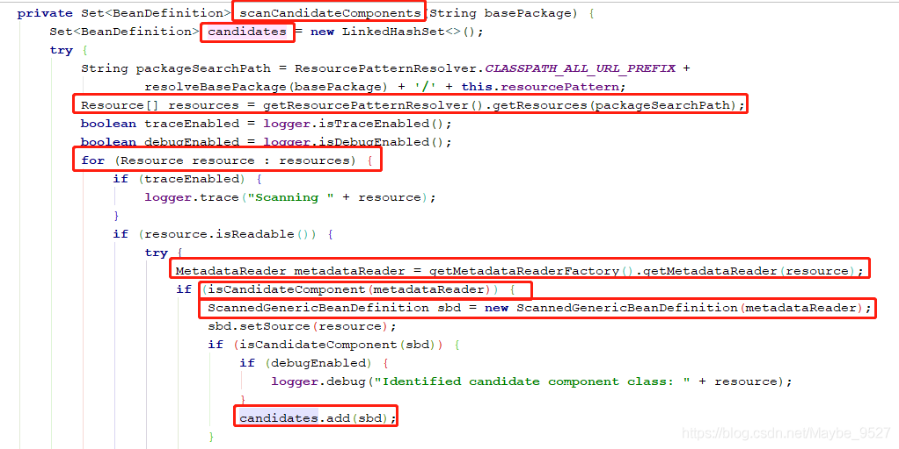

我们以常用的注解配置为主要切入点，xml形式的配置不深入研究（注解方式与xml方式仅在读取的时候存在差异）

 Bean在spring中是以BeanDefinition（接口）的形式存储在BeanFactory的map中的


```java
private final Map<String, BeanDefinition> beanDefinitionMap = new ConcurrentHashMap<String, BeanDefinition>(256);
 
this.beanDefinitionMap.put(beanName, beanDefinition);
```


我们最常用的是DefaultListableBeanFactory

## IOC容器的初始化

**Bean Definition从加载、解析、处理、注册到BeanFactory的过程，也就是IOC容器的初始化过程**

### 加载

```java
//读取xml用这个
//ClassPathXmlApplicationContext的父类AbstractXmlApplicationContext的构造方法里面new了reader
//XmlBeanDefinitionReader
```

```java
//读取注解用这个
//AnnotationConfigApplicationContext的构造方法里面new了reader和scanner
//AnnotatedBeanDefinitionReader
//注解调用这个方法，传扫包路径
public AnnotationConfigApplicationContext(String... basePackages) {
  this();
  scan(basePackages);
  refresh();
}
public AnnotationConfigApplicationContext() {
  this.reader = new AnnotatedBeanDefinitionReader(this);
  this.scanner = new ClassPathBeanDefinitionScanner(this);
}
```

### 解析

xml配置下

**DefaultBeanDefinitionDocumentReader**将`<bean><bean/>`解析为Element对象

### 处理

xml配置下

将Element对象转化成了BeanDefinitionHolder对象

注解配置下

核心代码

```java
//扫描注解-生成RootBeanDefinition-存到set中
//这里仅拿@Configuration注解举例，实际上还会扫描AUTOWIRED、PERSISTENCE、EVENT_LISTENER等
Set<BeanDefinitionHolder> beanDefs = new LinkedHashSet<>(8);
if (!registry.containsBeanDefinition(CONFIGURATION_ANNOTATION_PROCESSOR_BEAN_NAME)) {
  RootBeanDefinition def = new RootBeanDefinition(ConfigurationClassPostProcessor.class);
  def.setSource(source);
  beanDefs.add(registerPostProcessor(registry
                                     , def
                                     , CONFIGURATION_ANNOTATION_PROCESSOR_BEAN_NAME));
}
```

注解配置下

```java
doScan(basePackages);

protected Set<BeanDefinitionHolder> doScan(String... basePackages) {
  Assert.notEmpty(basePackages, "At least one base package must be specified");
  Set<BeanDefinitionHolder> beanDefinitions = new LinkedHashSet<>();
  for (String basePackage : basePackages) {
    Set<BeanDefinition> candidates = findCandidateComponents(basePackage);
    for (BeanDefinition candidate : candidates) {
      ScopeMetadata scopeMetadata = this.scopeMetadataResolver.resolveScopeMetadata(candidate);
      candidate.setScope(scopeMetadata.getScopeName());
      String beanName = this.beanNameGenerator.generateBeanName(candidate, this.registry);
      if (candidate instanceof AbstractBeanDefinition) {
        postProcessBeanDefinition((AbstractBeanDefinition) candidate, beanName);
      }
      if (candidate instanceof AnnotatedBeanDefinition) {
        AnnotationConfigUtils.processCommonDefinitionAnnotations((AnnotatedBeanDefinition) candidate);
      }
      if (checkCandidate(beanName, candidate)) {
        BeanDefinitionHolder definitionHolder = new BeanDefinitionHolder(candidate, beanName);
        definitionHolder =
          AnnotationConfigUtils.applyScopedProxyMode(scopeMetadata, definitionHolder, this.registry);
        beanDefinitions.add(definitionHolder);
        registerBeanDefinition(definitionHolder, this.registry);
      }
    }
  }
  return beanDefinitions;
}
```

关键代码


1.先将basePackages扫描包遍历，

2.再将basePackage单个扫描包通过findCandidateComponents()方法把string路径转换为BeanDefinition的Set集合，

3.遍历candidates这个BeanDefinition集合，

4.调用registerBeanDefinition()方法将beanDefinition注册到bean工厂。

关键是findCandidateComponents方法是怎么把string路径转换为BeanDefinition的set集合的呢？

**findCandidateComponents()方法分析**

```java
ublic Set<BeanDefinition> findCandidateComponents(String basePackage) {
  if (this.componentsIndex != null && indexSupportsIncludeFilters()) {
    return addCandidateComponentsFromIndex(this.componentsIndex, basePackage);
  }
  else {
    return scanCandidateComponents(basePackage);
  }
}
```

上面一种方法是利用索引插件快速扫描，我们看后一种通用的scanCandidateComponents(basePackage)方法
该方法的核心代码

```java
private Set<BeanDefinition> scanCandidateComponents(String basePackage) {
  Set<BeanDefinition> candidates = new LinkedHashSet<>();
  try {
    String packageSearchPath = ResourcePatternResolver.CLASSPATH_ALL_URL_PREFIX +
      resolveBasePackage(basePackage) + '/' + this.resourcePattern;
    Resource[] resources = getResourcePatternResolver().getResources(packageSearchPath);

    for (Resource resource : resources) {
      if (traceEnabled) {
        logger.trace("Scanning " + resource);
      }
      if (resource.isReadable()) {
        try {
          MetadataReader metadataReader = getMetadataReaderFactory().getMetadataReader(resource);
          if (isCandidateComponent(metadataReader)) {
            ScannedGenericBeanDefinition sbd = new ScannedGenericBeanDefinition(metadataReader);
            sbd.setSource(resource);
            if (isCandidateComponent(sbd)) {								
              candidates.add(sbd);
            }
          }
        }					
      }				
    }
  }		
  return candidates;
}
```

方法的关键步骤



**Resource转换为MetadataReader分析**

MetadataReader metadataReader = getMetadataReaderFactory().getMetadataReader(resource);
先看getMetadataReaderFactory()方法

```java
public final MetadataReaderFactory getMetadataReaderFactory() {
  if (this.metadataReaderFactory == null) {
    this.metadataReaderFactory = new CachingMetadataReaderFactory();
  }
  return this.metadataReaderFactory;
}
```

创建的是CachingMetadataReaderFactory()。
再看它的getMetadataReader(resource)方法

```java
@Override
public MetadataReader getMetadataReader(Resource resource) throws IOException {
  if (this.metadataReaderCache instanceof ConcurrentMap) {
    // No synchronization necessary...
    MetadataReader metadataReader = this.metadataReaderCache.get(resource);
    if (metadataReader == null) {
      metadataReader = super.getMetadataReader(resource);
      this.metadataReaderCache.put(resource, metadataReader);
    }
    return metadataReader;
  } else if (this.metadataReaderCache != null) {
    synchronized (this.metadataReaderCache) {
      MetadataReader metadataReader = this.metadataReaderCache.get(resource);
      if (metadataReader == null) {
        metadataReader = super.getMetadataReader(resource);
        this.metadataReaderCache.put(resource, metadataReader);
      }
      return metadataReader;
    }
  } else {
    return super.getMetadataReader(resource);
  }
}
```

this.metadataReaderCache是一个ConcurrentMap 这里不展示具体查找细节，这里用了一个缓存，所以走的是

```java
metadataReader = super.getMetadataReader(resource);
```

跟进去父类SimpleMetadataReaderFactory

```java
@Override
public MetadataReader getMetadataReader(Resource resource) throws IOException {
  return new SimpleMetadataReader(resource, this.resourceLoader.getClassLoader());
}
```

创建了一个SimpleMetadataReader,继续看一下

```java
SimpleMetadataReader(Resource resource, @Nullable ClassLoader classLoader) throws IOException {
  SimpleAnnotationMetadataReadingVisitor visitor = new SimpleAnnotationMetadataReadingVisitor(classLoader);
  getClassReader(resource).accept(visitor, PARSING_OPTIONS);
  this.resource = resource;
  this.annotationMetadata = visitor.getMetadata();
}
```

**用ASM字节码技术读取类注解等元信息**

举例说明

```java
public static void main(String[] args) throws IOException {
        						loadClassInfo(ResourcesUtils.getResourceAsStream(PluginsSupportModule.class.getName().replace(".", "/") + ".class"));
}
private Map<String, ClassInfo> classInfoMap = new WeakHashMap<String, ClassInfo>();
private static void loadClassInfo(InputStream inStream) throws IOException {
  ClassReader classReader = new ClassReader(inStream);
  ClassInfo info = new ClassInfo();
  info.className = classReader.getClassName().replace('/', '.');
  info.superClass = classReader.getSuperName().replace('/', '.');
  info.interFaces = classReader.getInterfaces();
  for (int i = 0; i < info.interFaces.length; i++)
    info.interFaces[i] = info.interFaces[i].replace('/', '.');
  //packageName
  if (info.className.lastIndexOf(".") > 0)
    info.packageName = info.className.substring(0, info.className.lastIndexOf("."));
  //annos
  final ArrayList<String> annoStr = new ArrayList<String>();
  classReader.accept(new ClassVisitor(Opcodes.ASM4) {
    public AnnotationVisitor visitAnnotation(String desc, boolean visible) {
      /**将一个Ljava/lang/Object;形式的字符串转化为java/lang/Object形式。*/
      String annnoType = desc.substring(1, desc.length() - 1);
      annoStr.add(annnoType);
      return super.visitAnnotation(desc, visible);
    }
  }, ClassReader.SKIP_CODE);
  info.annos = annoStr.toArray(new String[annoStr.size()]);
  //
  System.out.println();
}
/**类信息结构*/
private static class ClassInfo {
  /*类名*/
  public String   className   = null;
  /*包名*/
  public String   packageName = null;
  /*父类名*/
  public String   superClass  = null;
  /*实现的接口*/
  public String[] interFaces  = null;
  /*标记的注解*/
  public String[] annos       = null;
}
```

**为什么用ASM字节码技术读取类的元信息，而不用反射的方式？**

最主要的原因是：运用反射就会把类加载到内存，而这个类不一定需要，用ASM字节码技术并不会把这个类加载到内存。

### 注册

将BeanDefinitionHolder对象存到**DefaultListableBeanFactory**内的叫beanDefinitionMap的ConcurrentHashMap对象中


### 总结

到此可以知道，AnnotationConfigApplicationContext(String… basePackages) 是把string类型的basePackage扫描到包下边的class文件，转换为Resource数组

再通过spring.asm包下的SimpleAnnotationMetadataReadingVisitor和ClassReader两个类，用ASM字节码技术读取resource的类的元信息。用MetadataReader的annotationMetadata属性封装这些类的元信息。

判断扫描出来的这些类是否满足TypeFilter。

此外scanner初始化时会把@Component封装为AnnotationTypeFileter加入到includeFilters，所以扫描到的类如果有@Component注解，则会注册到beanFactory。

## Bean类创建具体流程

上一节IOC容器初始化完成后，我们已经获取到了所有bean的定义信息

循环所有bean，如果这个bean不是抽象且是单例且不是懒加载，则立刻生成该bean的实例并存到map中

通过该bean的Class获取构造函数来实例化bean

如果不满足上述条件，则用到该bean的时候再实例化

```java
//通过来的class来获取构造方法并创建一个新的实例
public static void main(String[] args) throws IOException, NoSuchMethodException, InvocationTargetException, InstantiationException, IllegalAccessException {
  Class<Student> studentClass = Student.class;
  Constructor<Student> constructor = studentClass.getConstructor();
  Student student = constructor.newInstance();
}
```

## 总结


1. 创建上下文实例（AnnotationConfigApplicationContext ctx=new AnnotationConfigApplicationContext(MainConfigure.class);）的时候，会调用refresh方法刷新上下文
2. 调用finishBeanFactoryInitialization(beanFactory);方法实例化剩余的bean；（为什么是剩余的一会可以看下代码）
3. 执行beanFactory.preInstantiateSingletons();bean的创建就在这个方法里面
4. 执行getBean(beanName)去获取bean
5. 然后执行doGetBean(name, null, null, false);方法，这一块在源码有个注释是beanfactory接口的实现
6. 执行getSingleton(beanName)方法，尝试从缓存中获取bean，由于是创建所以是不存在bean的
7. 中间处理省略，标记玩bean正在被创建，然后执行 getSingleton(beanName,...)方法，这个在源码中是

```java
sharedInstance = getSingleton(beanName, () -> {
  try {
    //正式开始创建bean实例
    return createBean(beanName, mbd, args);
  }
  catch (BeansException ex) {
    // Explicitly remove instance from singleton cache: It might have been put there
    // eagerly by the creation process, to allow for circular reference resolution.
    // Also remove any beans that received a temporary reference to the bean.
    destroySingleton(beanName);
    throw ex;
  }
});
```

8.在此方法中，是先执行lambel函数的方法，然后继续往下执行，下面详细说

9.执行createBean(beanName, mbd, args);去创建bean

10.判断处理完毕之后 ，执行doCreateBean(beanName, mbdToUse, args);继续创建bean

11.执行createBeanInstance(beanName, mbd, args); 方法，去调用bean的构造器方法，创建一个早期对象，这个对象的属性还未被赋值

12.执行 addSingletonFactory(beanName, () -> getEarlyBeanReference(beanName, mbd, bean));将早期对象加入三级缓存，这是为了解决循环依赖

13.执行populateBean(beanName, mbd, instanceWrapper);方法，用属性值填充bean定义的实例，如果是在这一步存在依赖，就会去创建依赖的bean

14.执行initializeBean(beanName, exposedObject, mbd);方法初始化bean，lambel函数执行结束，继续执行第七步的方法，将二三级缓存的数据清除

15.结束