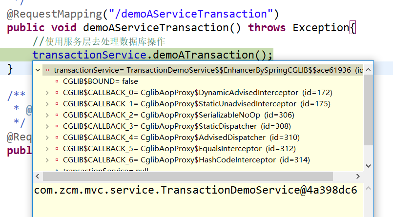

# IOC容器、bean的创建、三级缓存

我们以常用的注解配置为主要切入点，xml形式的配置不深入研究（注解方式与xml方式仅在读取的时候存在差异）

 Bean在spring中是以BeanDefinition（接口）的形式存储在BeanFactory的map中的


```java
private final Map<String, BeanDefinition> beanDefinitionMap = new ConcurrentHashMap<String, BeanDefinition>(256);
 
this.beanDefinitionMap.put(beanName, beanDefinition);
```


我们最常用的是DefaultListableBeanFactory

## IOC容器的初始化（简短总结）

**Bean Definition从加载、解析、处理、注册到BeanFactory的过程，也就是IOC容器的初始化过程**

### 加载

```java
//读取xml用这个
//ClassPathXmlApplicationContext的父类AbstractXmlApplicationContext的构造方法里面new了reader
//XmlBeanDefinitionReader
```

```java
//读取注解用这个
//AnnotationConfigApplicationContext的构造方法里面new了reader和scanner
//AnnotatedBeanDefinitionReader
//注解调用这个方法，传扫包路径
public AnnotationConfigApplicationContext(String... basePackages) {
  this();
  scan(basePackages);
  refresh();
}
public AnnotationConfigApplicationContext() {
  this.reader = new AnnotatedBeanDefinitionReader(this);
  this.scanner = new ClassPathBeanDefinitionScanner(this);
}
```

### 解析

xml配置下

**DefaultBeanDefinitionDocumentReader**将`<bean><bean/>`解析为Element对象

### 处理

xml配置下

将Element对象转化成了BeanDefinitionHolder对象

注解配置下

核心代码

```java
//扫描注解-生成RootBeanDefinition-存到set中
//这里仅拿@Configuration注解举例，实际上还会扫描AUTOWIRED、PERSISTENCE、EVENT_LISTENER等
Set<BeanDefinitionHolder> beanDefs = new LinkedHashSet<>(8);
if (!registry.containsBeanDefinition(CONFIGURATION_ANNOTATION_PROCESSOR_BEAN_NAME)) {
  RootBeanDefinition def = new RootBeanDefinition(ConfigurationClassPostProcessor.class);
  def.setSource(source);
  beanDefs.add(registerPostProcessor(registry
                                     , def
                                     , CONFIGURATION_ANNOTATION_PROCESSOR_BEAN_NAME));
}
```

注解配置下

```java
doScan(basePackages);

protected Set<BeanDefinitionHolder> doScan(String... basePackages) {
  Assert.notEmpty(basePackages, "At least one base package must be specified");
  Set<BeanDefinitionHolder> beanDefinitions = new LinkedHashSet<>();
  for (String basePackage : basePackages) {
    Set<BeanDefinition> candidates = findCandidateComponents(basePackage);
    for (BeanDefinition candidate : candidates) {
      ScopeMetadata scopeMetadata = this.scopeMetadataResolver.resolveScopeMetadata(candidate);
      candidate.setScope(scopeMetadata.getScopeName());
      String beanName = this.beanNameGenerator.generateBeanName(candidate, this.registry);
      if (candidate instanceof AbstractBeanDefinition) {
        postProcessBeanDefinition((AbstractBeanDefinition) candidate, beanName);
      }
      if (candidate instanceof AnnotatedBeanDefinition) {
        AnnotationConfigUtils.processCommonDefinitionAnnotations((AnnotatedBeanDefinition) candidate);
      }
      if (checkCandidate(beanName, candidate)) {
        BeanDefinitionHolder definitionHolder = new BeanDefinitionHolder(candidate, beanName);
        definitionHolder =
          AnnotationConfigUtils.applyScopedProxyMode(scopeMetadata, definitionHolder, this.registry);
        beanDefinitions.add(definitionHolder);
        registerBeanDefinition(definitionHolder, this.registry);
      }
    }
  }
  return beanDefinitions;
}
```

关键代码


1.先将basePackages扫描包遍历，

2.再将basePackage单个扫描包通过findCandidateComponents()方法把string路径转换为BeanDefinition的Set集合，

3.遍历candidates这个BeanDefinition集合，

4.调用registerBeanDefinition()方法将beanDefinition注册到bean工厂。

关键是findCandidateComponents方法是怎么把string路径转换为BeanDefinition的set集合的呢？

**findCandidateComponents()方法分析**

```java
ublic Set<BeanDefinition> findCandidateComponents(String basePackage) {
  if (this.componentsIndex != null && indexSupportsIncludeFilters()) {
    return addCandidateComponentsFromIndex(this.componentsIndex, basePackage);
  }
  else {
    return scanCandidateComponents(basePackage);
  }
}
```

上面一种方法是利用索引插件快速扫描，我们看后一种通用的scanCandidateComponents(basePackage)方法
该方法的核心代码

```java
private Set<BeanDefinition> scanCandidateComponents(String basePackage) {
  Set<BeanDefinition> candidates = new LinkedHashSet<>();
  try {
    String packageSearchPath = ResourcePatternResolver.CLASSPATH_ALL_URL_PREFIX +
      resolveBasePackage(basePackage) + '/' + this.resourcePattern;
    Resource[] resources = getResourcePatternResolver().getResources(packageSearchPath);

    for (Resource resource : resources) {
      if (traceEnabled) {
        logger.trace("Scanning " + resource);
      }
      if (resource.isReadable()) {
        try {
          MetadataReader metadataReader = getMetadataReaderFactory().getMetadataReader(resource);
          if (isCandidateComponent(metadataReader)) {
            ScannedGenericBeanDefinition sbd = new ScannedGenericBeanDefinition(metadataReader);
            sbd.setSource(resource);
            if (isCandidateComponent(sbd)) {								
              candidates.add(sbd);
            }
          }
        }					
      }				
    }
  }		
  return candidates;
}
```

方法的关键步骤


**Resource转换为MetadataReader分析**

MetadataReader metadataReader = getMetadataReaderFactory().getMetadataReader(resource);
先看getMetadataReaderFactory()方法

```java
public final MetadataReaderFactory getMetadataReaderFactory() {
  if (this.metadataReaderFactory == null) {
    this.metadataReaderFactory = new CachingMetadataReaderFactory();
  }
  return this.metadataReaderFactory;
}
```

创建的是CachingMetadataReaderFactory()。
再看它的getMetadataReader(resource)方法

```java
@Override
public MetadataReader getMetadataReader(Resource resource) throws IOException {
  if (this.metadataReaderCache instanceof ConcurrentMap) {
    // No synchronization necessary...
    MetadataReader metadataReader = this.metadataReaderCache.get(resource);
    if (metadataReader == null) {
      metadataReader = super.getMetadataReader(resource);
      this.metadataReaderCache.put(resource, metadataReader);
    }
    return metadataReader;
  } else if (this.metadataReaderCache != null) {
    synchronized (this.metadataReaderCache) {
      MetadataReader metadataReader = this.metadataReaderCache.get(resource);
      if (metadataReader == null) {
        metadataReader = super.getMetadataReader(resource);
        this.metadataReaderCache.put(resource, metadataReader);
      }
      return metadataReader;
    }
  } else {
    return super.getMetadataReader(resource);
  }
}
```

this.metadataReaderCache是一个ConcurrentMap 这里不展示具体查找细节，这里用了一个缓存，所以走的是

```java
metadataReader = super.getMetadataReader(resource);
```

跟进去父类SimpleMetadataReaderFactory

```java
@Override
public MetadataReader getMetadataReader(Resource resource) throws IOException {
  return new SimpleMetadataReader(resource, this.resourceLoader.getClassLoader());
}
```

创建了一个SimpleMetadataReader,继续看一下

```java
SimpleMetadataReader(Resource resource, @Nullable ClassLoader classLoader) throws IOException {
  SimpleAnnotationMetadataReadingVisitor visitor = new SimpleAnnotationMetadataReadingVisitor(classLoader);
  getClassReader(resource).accept(visitor, PARSING_OPTIONS);
  this.resource = resource;
  this.annotationMetadata = visitor.getMetadata();
}
```

**用ASM字节码技术读取类注解等元信息**

举例说明

```java
public static void main(String[] args) throws IOException {
        						loadClassInfo(ResourcesUtils.getResourceAsStream(PluginsSupportModule.class.getName().replace(".", "/") + ".class"));
}
private Map<String, ClassInfo> classInfoMap = new WeakHashMap<String, ClassInfo>();
private static void loadClassInfo(InputStream inStream) throws IOException {
  ClassReader classReader = new ClassReader(inStream);
  ClassInfo info = new ClassInfo();
  info.className = classReader.getClassName().replace('/', '.');
  info.superClass = classReader.getSuperName().replace('/', '.');
  info.interFaces = classReader.getInterfaces();
  for (int i = 0; i < info.interFaces.length; i++)
    info.interFaces[i] = info.interFaces[i].replace('/', '.');
  //packageName
  if (info.className.lastIndexOf(".") > 0)
    info.packageName = info.className.substring(0, info.className.lastIndexOf("."));
  //annos
  final ArrayList<String> annoStr = new ArrayList<String>();
  classReader.accept(new ClassVisitor(Opcodes.ASM4) {
    public AnnotationVisitor visitAnnotation(String desc, boolean visible) {
      /**将一个Ljava/lang/Object;形式的字符串转化为java/lang/Object形式。*/
      String annnoType = desc.substring(1, desc.length() - 1);
      annoStr.add(annnoType);
      return super.visitAnnotation(desc, visible);
    }
  }, ClassReader.SKIP_CODE);
  info.annos = annoStr.toArray(new String[annoStr.size()]);
  //
  System.out.println();
}
/**类信息结构*/
private static class ClassInfo {
  /*类名*/
  public String   className   = null;
  /*包名*/
  public String   packageName = null;
  /*父类名*/
  public String   superClass  = null;
  /*实现的接口*/
  public String[] interFaces  = null;
  /*标记的注解*/
  public String[] annos       = null;
}
```

**为什么用ASM字节码技术读取类的元信息，而不用反射的方式？**

最主要的原因是：运用反射就会把类加载到内存，而这个类不一定需要，用ASM字节码技术并不会把这个类加载到内存。

### 注册

将BeanDefinitionHolder对象存到**DefaultListableBeanFactory**内的叫beanDefinitionMap的ConcurrentHashMap对象中


### 总结

到此可以知道，AnnotationConfigApplicationContext(String… basePackages) 是把string类型的basePackage扫描到包下边的class文件，转换为Resource数组

再通过spring.asm包下的SimpleAnnotationMetadataReadingVisitor和ClassReader两个类，用ASM字节码技术读取resource的类的元信息。用MetadataReader的annotationMetadata属性封装这些类的元信息。

判断扫描出来的这些类是否满足TypeFilter。

此外scanner初始化时会把@Component封装为AnnotationTypeFileter加入到includeFilters，所以扫描到的类如果有@Component注解，则会注册到beanFactory。

## Bean类创建具体流程（详细总结）

上一节IOC容器初始化完成后，我们已经获取到了所有bean的定义信息

循环所有bean，如果这个bean不是抽象且是单例且不是懒加载，则立刻生成该bean的实例并存到map中

通过该bean的Class获取构造函数来实例化bean

如果不满足上述条件，则用到该bean的时候再实例化

```java
//通过来的class来获取构造方法并创建一个新的实例
public static void main(String[] args) throws IOException, NoSuchMethodException, InvocationTargetException, InstantiationException, IllegalAccessException {
  Class<Student> studentClass = Student.class;
  Constructor<Student> constructor = studentClass.getConstructor();
  Student student = constructor.newInstance();
}
```

## 流程总结


### 流程

1. 创建上下文实例（AnnotationConfigApplicationContext ctx=new AnnotationConfigApplicationContext(MainConfigure.class);）的时候，会调用refresh方法刷新上下文
2. 调用finishBeanFactoryInitialization(beanFactory);方法实例化剩余的bean；（为什么是剩余的一会可以看下代码）
3. 执行beanFactory.preInstantiateSingletons();bean的创建就在这个方法里面
4. 执行getBean(beanName)去获取bean
5. 然后执行doGetBean(name, null, null, false);方法，这一块在源码有个注释是beanfactory接口的实现
6. 执行getSingleton(beanName)方法，尝试从缓存中获取bean，由于是创建所以是不存在bean的
7. 中间处理省略，标记玩bean正在被创建，然后执行 getSingleton(beanName,...)方法，这个在源码中是

```java
sharedInstance = getSingleton(beanName, () -> {
  try {
    //正式开始创建bean实例
    return createBean(beanName, mbd, args);
  }
  catch (BeansException ex) {
    // Explicitly remove instance from singleton cache: It might have been put there
    // eagerly by the creation process, to allow for circular reference resolution.
    // Also remove any beans that received a temporary reference to the bean.
    destroySingleton(beanName);
    throw ex;
  }
});
```

8.在此方法中，是先执行lambel函数的方法，然后继续往下执行，下面详细说

9.执行createBean(beanName, mbd, args);去创建bean

10.判断处理完毕之后 ，执行doCreateBean(beanName, mbdToUse, args);继续创建bean

11.执行createBeanInstance(beanName, mbd, args); 方法，去调用bean的构造器方法，创建一个早期对象，这个对象的属性还未被赋值

12.执行 addSingletonFactory(beanName, () -> getEarlyBeanReference(beanName, mbd, bean));将早期对象加入三级缓存，这是为了解决循环依赖

13.执行populateBean(beanName, mbd, instanceWrapper);方法，用属性值填充bean定义的实例，如果是在这一步存在依赖，就会去创建依赖的bean

14.执行initializeBean(beanName, exposedObject, mbd);方法初始化bean，lambel函数执行结束，继续执行第七步的方法，将二三级缓存的数据清除

15.结束

### 1.refresh()方法

```java
@Override
public void refresh() throws BeansException, IllegalStateException {
  synchronized (this.startupShutdownMonitor) {
    // Prepare this context for refreshing.
    //准备刷新此上下文。
    prepareRefresh();

    // Tell the subclass to refresh the internal bean factory.
    //告诉子类刷新内部bean工厂。
    ConfigurableListableBeanFactory beanFactory = obtainFreshBeanFactory();

    // Prepare the bean factory for use in this context.
    //准备bean工厂以供在此上下文中使用。
    prepareBeanFactory(beanFactory);

    try {
      // Allows post-processing of the bean factory in context subclasses.
      //允许在上下文子类中对bean工厂进行后处理。
      postProcessBeanFactory(beanFactory);

      // Invoke factory processors registered as beans in the context.
      //调用上下文中注册为bean的工厂处理器。
      invokeBeanFactoryPostProcessors(beanFactory);

      // Register bean processors that intercept bean creation.
      //注册拦截bean创建的bean处理器。
      registerBeanPostProcessors(beanFactory);

      // Initialize message source for this context.
      //初始化此上下文的消息源。
      initMessageSource();

      // Initialize event multicaster for this context.
      //为此上下文初始化事件
      initApplicationEventMulticaster();

      // Initialize other special beans in specific context subclasses.
      //初始化特定上下文子类中的其他特殊bean。
      onRefresh();

      // Check for listener beans and register them.
      //检查侦听器bean并注册它们。
      registerListeners();

      // Instantiate all remaining (non-lazy-init) singletons.
      //实例化所有剩余的（非延迟初始化）单例 明显创建我们自定义的bean是在这一步
      finishBeanFactoryInitialization(beanFactory);

      // Last step: publish corresponding event.
      //最后一步：发布对应的事件
      finishRefresh();
    }

    catch (BeansException ex) {
      if (logger.isWarnEnabled()) {
        logger.warn("Exception encountered during context initialization - " +
                    "cancelling refresh attempt: " + ex);
      }

      // Destroy already created singletons to avoid dangling resources.
      //销毁已经创建的单例以避免资源悬空。
      destroyBeans();

      // Reset 'active' flag.
      //重置“活动”标志
      cancelRefresh(ex);

      // Propagate exception to caller.
      throw ex;
    }

    finally {
      // Reset common introspection caches in Spring's core, since we
      // might not ever need metadata for singleton beans anymore...
      //在spring的核心中重置常见的内省缓存，因为我们可能不再需要singleton bean的元数据了……
      resetCommonCaches();
    }
  }
}
```

这个方法在注释里面各个部分都说的很清楚，我们只需要看`finishBeanFactoryInitialization(beanFactory);`这个方法就行了

### 2.finishBeanFactoryInitialization(beanFactory)方法

```java
/**
	 * Finish the initialization of this context's bean factory,
	 * initializing all remaining singleton beans.
	 */
protected void finishBeanFactoryInitialization(ConfigurableListableBeanFactory beanFactory) {
  // Initialize conversion service for this context.
  //初始化此上下文的转换服务。
  if (beanFactory.containsBean(CONVERSION_SERVICE_BEAN_NAME) &&
      beanFactory.isTypeMatch(CONVERSION_SERVICE_BEAN_NAME, ConversionService.class)) {
    beanFactory.setConversionService(
      beanFactory.getBean(CONVERSION_SERVICE_BEAN_NAME, ConversionService.class));
  }

  // Register a default embedded value resolver if no bean post-processor
  // (such as a PropertyPlaceholderConfigurer bean) registered any before:
  // at this point, primarily for resolution in annotation attribute values.
  //如果在此之前没有任何bean后处理器（如propertyplaceholderconfigurerbean）注册，
  //则注册默认的嵌入式值解析器：
  //此时，主要是为了在注释属性值中进行解析
  if (!beanFactory.hasEmbeddedValueResolver()) {
    beanFactory.addEmbeddedValueResolver(strVal -> getEnvironment().resolvePlaceholders(strVal));
  }

  // Initialize LoadTimeWeaverAware beans early to allow for registering their transformers early.
  //尽早初始化loadTimeWeaveraware bean，以便尽早注册其转换器。
  String[] weaverAwareNames = beanFactory.getBeanNamesForType(LoadTimeWeaverAware.class, false, false);
  for (String weaverAwareName : weaverAwareNames) {
    getBean(weaverAwareName);
  }

  // Stop using the temporary ClassLoader for type matching.
  //停止使用临时类加载器进行类型匹配。
  beanFactory.setTempClassLoader(null);

  // Allow for caching all bean definition metadata, not expecting further changes.
  //允许缓存所有bean定义元数据，不需要进一步更改。
  beanFactory.freezeConfiguration();

  // Instantiate all remaining (non-lazy-init) singletons.
  //实例化所有剩余的（非延迟初始化）单例 很明显这一步是创建的入口
  beanFactory.preInstantiateSingletons();
}
```

### 3. beanFactory.preInstantiateSingletons()

```java
@Override
public void preInstantiateSingletons() throws BeansException {
  if (logger.isDebugEnabled()) {
    logger.debug("Pre-instantiating singletons in " + this);
  }

  // Iterate over a copy to allow for init methods which in turn register new bean definitions.
  // While this may not be part of the regular factory bootstrap, it does otherwise work fine.
  List<String> beanNames = new ArrayList<>(this.beanDefinitionNames);

  // Trigger initialization of all non-lazy singleton beans...
  //所有非惰性单例bean的触发器初始化…
  for (String beanName : beanNames) {
    RootBeanDefinition bd = getMergedLocalBeanDefinition(beanName);
    if (!bd.isAbstract() && bd.isSingleton() && !bd.isLazyInit()) {
      if (isFactoryBean(beanName)) {
        Object bean = getBean(FACTORY_BEAN_PREFIX + beanName);
        if (bean instanceof FactoryBean) {
          final FactoryBean<?> factory = (FactoryBean<?>) bean;
          boolean isEagerInit;
          if (System.getSecurityManager() != null && factory instanceof SmartFactoryBean) {
            isEagerInit = AccessController.doPrivileged((PrivilegedAction<Boolean>)
                                                        ((SmartFactoryBean<?>) factory)::isEagerInit,
                                                        getAccessControlContext());
          } else {
            isEagerInit = (factory instanceof SmartFactoryBean &&
                           ((SmartFactoryBean<?>) factory).isEagerInit());
          }
          if (isEagerInit) {
            getBean(beanName);
          }
        }
      } else {
        //获取bean
        getBean(beanName);
      }
    }
  }

  // Trigger post-initialization callback for all applicable beans...
  //为所有适用的bean触发初始化后回调…
  for (String beanName : beanNames) {
    Object singletonInstance = getSingleton(beanName);
    if (singletonInstance instanceof SmartInitializingSingleton) {
      final SmartInitializingSingleton smartSingleton = (SmartInitializingSingleton) singletonInstance;
      if (System.getSecurityManager() != null) {
        AccessController.doPrivileged((PrivilegedAction<Object>) () -> {
          smartSingleton.afterSingletonsInstantiated();
          return null;
        }, getAccessControlContext());
      } else {
        smartSingleton.afterSingletonsInstantiated();
      }
    }
  }
}
```

这一部分，我们只需要跟着断点，然后就会走到`getBean(beanName);`这个方法,这个地方就是获取beanNames然后遍历去执行`getBean(beanName);`，这个地方我们需要用到条件断点，条件断点设置方式如下
1.先设置一个断点


2.在这个断点上右键，选择最后一个breakpoint properties,然后开始设置条件


这样条件断点就设置好了，满足条件才会进入这个断点。

### 4.getBean(beanName)

```java
//---------------------------------------------------------------------
// Implementation of BeanFactory interface
//---------------------------------------------------------------------
//beanfactory接口的实现
@Override
public Object getBean(String name) throws BeansException {
  return doGetBean(name, null, null, false);
}
```

这一步就是为了进入doGetBean(name, null, null, false)方法

### 5.doGetBean(name, null, null, false)

```java
/**
	 * Return an instance, which may be shared or independent, of the specified bean.
	 * @param name the name of the bean to retrieve
	 * @param requiredType the required type of the bean to retrieve
	 * @param args arguments to use when creating a bean instance using explicit arguments
	 * (only applied when creating a new instance as opposed to retrieving an existing one)
	 * @param typeCheckOnly whether the instance is obtained for a type check,
	 * not for actual use
	 * @return an instance of the bean
	 * @throws BeansException if the bean could not be created
	 */
@SuppressWarnings("unchecked")
protected <T> T doGetBean(final String name, @Nullable final Class<T> requiredType,
                          @Nullable final Object[] args, boolean typeCheckOnly) throws BeansException {
  //解析bean的别名i
  final String beanName = transformedBeanName(name);
  Object bean;

  // Eagerly check singleton cache for manually registered singletons.
  //首先尝试去缓存池中去获取对象，是第一次创建bean缓存池中没有对象
  Object sharedInstance = getSingleton(beanName);
  if (sharedInstance != null && args == null) {
    if (logger.isDebugEnabled()) {
      if (isSingletonCurrentlyInCreation(beanName)) {
        logger.debug("Returning eagerly cached instance of singleton bean '" + beanName +
                     "' that is not fully initialized yet - a consequence of a circular reference");
      } else {
        logger.debug("Returning cached instance of singleton bean '" + beanName + "'");
      }
    }
    bean = getObjectForBeanInstance(sharedInstance, name, beanName, null);
  } else {
    // Fail if we're already creating this bean instance:
    // We're assumably within a circular reference.
    //若出现循环依赖，判断bean是不是单例，不是就抛出异常
    if (isPrototypeCurrentlyInCreation(beanName)) {
      throw new BeanCurrentlyInCreationException(beanName);
    }

    // Check if bean definition exists in this factory.
    //当前容器是否有父工厂，有的话，就由父工厂加载
    BeanFactory parentBeanFactory = getParentBeanFactory();
    if (parentBeanFactory != null && !containsBeanDefinition(beanName)) {
      // Not found -> check parent.
      String nameToLookup = originalBeanName(name);
      if (parentBeanFactory instanceof AbstractBeanFactory) {
        return ((AbstractBeanFactory) parentBeanFactory).doGetBean(
          nameToLookup, requiredType, args, typeCheckOnly);
      } else if (args != null) {
        // Delegation to parent with explicit args.
        return (T) parentBeanFactory.getBean(nameToLookup, args);
      } else {
        // No args -> delegate to standard getBean method.
        return parentBeanFactory.getBean(nameToLookup, requiredType);
      }
    }
    //标记为该bean正在创建
    if (!typeCheckOnly) {
      markBeanAsCreated(beanName);
    }

    try {
      //合并bean并定义 合并父bean里面的属性
      final RootBeanDefinition mbd = getMergedLocalBeanDefinition(beanName);
      //检查bean定义是不是抽象的
      checkMergedBeanDefinition(mbd, beanName, args);

      // Guarantee initialization of beans that the current bean depends on.
      //bean加载顺序，必须dependsOn中的bean全部实例化之后 做依赖检查
      String[] dependsOn = mbd.getDependsOn();
      if (dependsOn != null) {
        for (String dep : dependsOn) {
          if (isDependent(beanName, dep)) {
            throw new BeanCreationException(mbd.getResourceDescription(), beanName,
                                            "Circular depends-on relationship between '" + beanName + "' and '" + dep + "'");
          }
          registerDependentBean(dep, beanName);
          try {
            getBean(dep);
          } catch (NoSuchBeanDefinitionException ex) {
            throw new BeanCreationException(mbd.getResourceDescription(), beanName,
                                            "'" + beanName + "' depends on missing bean '" + dep + "'", ex);
          }
        }
      }

      // Create bean instance.
      //创建bean实例
      if (mbd.isSingleton()) {
        //再次判断缓存池中是否有bean ，没有就在回调函数里面创建bean
        sharedInstance = getSingleton(beanName, () -> {
          try {
            //正式开始创建bean实例
            return createBean(beanName, mbd, args);
          } catch (BeansException ex) {
            // Explicitly remove instance from singleton cache: It might have been put there
            // eagerly by the creation process, to allow for circular reference resolution.
            // Also remove any beans that received a temporary reference to the bean.
            destroySingleton(beanName);
            throw ex;
          }
        });
        bean = getObjectForBeanInstance(sharedInstance, name, beanName, mbd);
      } else if (mbd.isPrototype()) {
        // It's a prototype -> create a new instance.
        Object prototypeInstance = null;
        try {
          beforePrototypeCreation(beanName);
          prototypeInstance = createBean(beanName, mbd, args);
        } finally {
          afterPrototypeCreation(beanName);
        }
        bean = getObjectForBeanInstance(prototypeInstance, name, beanName, mbd);
      } else {
        String scopeName = mbd.getScope();
        final Scope scope = this.scopes.get(scopeName);
        if (scope == null) {
          throw new IllegalStateException("No Scope registered for scope name '" + scopeName + "'");
        }
        try {
          Object scopedInstance = scope.get(beanName, () -> {
            beforePrototypeCreation(beanName);
            try {
              return createBean(beanName, mbd, args);
            } finally {
              afterPrototypeCreation(beanName);
            }
          });
          bean = getObjectForBeanInstance(scopedInstance, name, beanName, mbd);
        } catch (IllegalStateException ex) {
          throw new BeanCreationException(beanName,"Scope '" + scopeName + "' is not active for the current thread; consider " + "defining a scoped proxy for this bean if you intend to refer to it from a singleton", ex);
        }
      }
    } catch (BeansException ex) {
      cleanupAfterBeanCreationFailure(beanName);
      throw ex;
    }
  }

  // Check if required type matches the type of the actual bean instance.
  //检查所需类型是否与实际bean实例的类型匹配。
  if (requiredType != null && !requiredType.isInstance(bean)) {
    try {
      T convertedBean = getTypeConverter().convertIfNecessary(bean, requiredType);
      if (convertedBean == null) {
        throw new BeanNotOfRequiredTypeException(name, requiredType, bean.getClass());
      }
      return convertedBean;
    } catch (TypeMismatchException ex) {
      if (logger.isDebugEnabled()) {
        logger.debug("Failed to convert bean '" + name + "' to required type '" +
                     ClassUtils.getQualifiedName(requiredType) + "'", ex);
      }
      throw new BeanNotOfRequiredTypeException(name, requiredType, bean.getClass());
    }
  }
  return (T) bean;
}
```

这个里面主要的方法有
1.首先尝试去缓存池中去获取对象`Object sharedInstance = getSingleton(beanName);`
2.`markBeanAsCreated(beanName);`将该bean标记为正在创建

3.`getSingleton(beanName,...);`这个是再次判断缓存中是否存在bean，如果不存在该bean就会去执行创建bean的方法，以及将创建结束的bean从二级缓存移入一级缓存中

4.`createBean(beanName, mbd, args);`创建bean的方法

这里面要介绍一下dependsOn，dependsOn指的是要先进行实例化的bean，也就是有beanA和beanB，如果用注解在beanB上加上@DependsOn(beanA)，那么在创建beanB之前一点更要先创建beanA，和依赖不同，依赖是指在创建beanB的过程中去创建beanA。

### 6.getSingleton(String beanName)

```java
@Override
@Nullable
public Object getSingleton(String beanName) {
  return getSingleton(beanName, true);
}
```

```java
/**
	 * Return the (raw) singleton object registered under the given name.
	 * <p>Checks already instantiated singletons and also allows for an early
	 * reference to a currently created singleton (resolving a circular reference).
	 * @param beanName the name of the bean to look for
	 * @param allowEarlyReference whether early references should be created or not
	 * @return the registered singleton object, or {@code null} if none found
	 */
@Nullable
protected Object getSingleton(String beanName, boolean allowEarlyReference) {
  //从一级缓存获取
  Object singletonObject = this.singletonObjects.get(beanName);
  //如果一级缓存中没有，并且已标记这个bean正在被定义
  if (singletonObject == null && isSingletonCurrentlyInCreation(beanName)) {
    synchronized (this.singletonObjects) {
      //从二级缓存获取bean
      singletonObject = this.earlySingletonObjects.get(beanName);
      //如果二级缓存也拿不到 去三级缓存拿
      if (singletonObject == null && allowEarlyReference) {
        //从三级缓存取值
        ObjectFactory<?> singletonFactory = this.singletonFactories.get(beanName);
        if (singletonFactory != null) {
          singletonObject = singletonFactory.getObject();
          //如果三级缓存存在值，将三级缓存中的缓存移除，加入二级缓存
          this.earlySingletonObjects.put(beanName, singletonObject);
          this.singletonFactories.remove(beanName);
        }
      }
    }
  }
  return singletonObject;
}
```

这一部分的解释都已经加在了注释上面，没有其他需要过多解释的地方

### 7.getSingleton(beanName,…）

使用的地方如下

```java
//创建bean实例
if (mbd.isSingleton()) {
	//再次判断缓存池中是否有bean ，没有就在回调函数里面创建bean
	sharedInstance = getSingleton(beanName, () -> {
		try {
			//正式开始创建bean实例
			return createBean(beanName, mbd, args);
		}
		catch (BeansException ex) {
			// Explicitly remove instance from singleton cache: It might have been put there
			// eagerly by the creation process, to allow for circular reference resolution.
			// Also remove any beans that received a temporary reference to the bean.
			destroySingleton(beanName);
			throw ex;
		}
	});
	bean = getObjectForBeanInstance(sharedInstance, name, beanName, mbd);
}
```

方法源码如下：

```java
public Object getSingleton(String beanName, ObjectFactory<?> singletonFactory) {
  Assert.notNull(beanName, "Bean name must not be null");
  synchronized (this.singletonObjects) {
    Object singletonObject = this.singletonObjects.get(beanName);
    if (singletonObject == null) {
      if (this.singletonsCurrentlyInDestruction) {
        throw new BeanCreationNotAllowedException(beanName, "Singleton bean creation not allowed while singletons of this factory are in destruction " + "(Do not request a bean from a BeanFactory in a destroy method implementation!)");
      }
      if (logger.isDebugEnabled()) {
        logger.debug("Creating shared instance of singleton bean '" + beanName + "'");
      }
      //标识bean要被创建
      beforeSingletonCreation(beanName);
      boolean newSingleton = false;
      boolean recordSuppressedExceptions = (this.suppressedExceptions == null);
      if (recordSuppressedExceptions) {
        this.suppressedExceptions = new LinkedHashSet<>();
      }
      try {
        //执行创建bean
        singletonObject = singletonFactory.getObject();
        newSingleton = true;
      }
      catch (IllegalStateException ex) {
        // Has the singleton object implicitly appeared in the meantime ->
        // if yes, proceed with it since the exception indicates that state.
        singletonObject = this.singletonObjects.get(beanName);
        if (singletonObject == null) {
          throw ex;
        }
      }
      catch (BeanCreationException ex) {
        if (recordSuppressedExceptions) {
          for (Exception suppressedException : this.suppressedExceptions) {
            ex.addRelatedCause(suppressedException);
          }
        }
        throw ex;
      }
      finally {
        if (recordSuppressedExceptions) {
          this.suppressedExceptions = null;
        }
        afterSingletonCreation(beanName);
      }
      if (newSingleton) {
        addSingleton(beanName, singletonObject);
      }
    }
    return singletonObject;
  }
}
```

要关注的地方
1.有`singletonFactory`调用的地方，因为这是lambel函数被调用的地方；
2.`addSingleton(beanName, singletonObject);`这个地方是把二级缓存的内容加入一级缓存之中。

```java
/**
	 * Add the given singleton object to the singleton cache of this factory.
	 * <p>To be called for eager registration of singletons.
	 * @param beanName the name of the bean
	 * @param singletonObject the singleton object
	 */
protected void addSingleton(String beanName, Object singletonObject) {
  synchronized (this.singletonObjects) {
    this.singletonObjects.put(beanName, singletonObject);
    this.singletonFactories.remove(beanName);
    this.earlySingletonObjects.remove(beanName);
    this.registeredSingletons.add(beanName);
  }
}
```

先把流程写完，在下面再写各级缓存如果传值的。

### 8.createBean(beanName, mbd, args)

对于这个方法，我们不需要过多看，只需要关注下面的`doCreateBean(beanName, mbdToUse, args);`方法

```java
try {
  //真正开始创建的地方
  Object beanInstance = doCreateBean(beanName, mbdToUse, args);
  if (logger.isDebugEnabled()) {
    logger.debug("Finished creating instance of bean '" + beanName + "'");
  }
  return beanInstance;
}
```

### 9.doCreateBean(beanName, mbdToUse, args)

源码如下

```java
/**
	 * Actually create the specified bean. Pre-creation processing has already happened
	 * at this point, e.g. checking {@code postProcessBeforeInstantiation} callbacks.
	 * <p>Differentiates between default bean instantiation, use of a
	 * factory method, and autowiring a constructor.
	 * @param beanName the name of the bean
	 * @param mbd the merged bean definition for the bean
	 * @param args explicit arguments to use for constructor or factory method invocation
	 * @return a new instance of the bean
	 * @throws BeanCreationException if the bean could not be created
	 * @see #instantiateBean
	 * @see #instantiateUsingFactoryMethod
	 * @see #autowireConstructor
	 */
protected Object doCreateBean(final String beanName, final RootBeanDefinition mbd, final @Nullable Object[] args)
  throws BeanCreationException {

  // Instantiate the bean.
  //实例化bean
  BeanWrapper instanceWrapper = null;
  if (mbd.isSingleton()) {
    instanceWrapper = this.factoryBeanInstanceCache.remove(beanName);
  }
  if (instanceWrapper == null) {
    //调用bean的构造器方法进行实例化 属性还没有被赋值 早期对象
    instanceWrapper = createBeanInstance(beanName, mbd, args);
  }
  final Object bean = instanceWrapper.getWrappedInstance();
  Class<?> beanType = instanceWrapper.getWrappedClass();
  if (beanType != NullBean.class) {
    mbd.resolvedTargetType = beanType;
  }

  // Allow post-processors to modify the merged bean definition.
  synchronized (mbd.postProcessingLock) {
    if (!mbd.postProcessed) {
      try {
        applyMergedBeanDefinitionPostProcessors(mbd, beanType, beanName);
      }
      catch (Throwable ex) {
        throw new BeanCreationException(mbd.getResourceDescription(), beanName,
                                        "Post-processing of merged bean definition failed", ex);
      }
      mbd.postProcessed = true;
    }
  }

  // Eagerly cache singletons to be able to resolve circular references
  // even when triggered by lifecycle interfaces like BeanFactoryAware.
  //这一块的意思是 将早期对象加入缓存中，以便解决循环依赖问题
  boolean earlySingletonExposure = (mbd.isSingleton() && this.allowCircularReferences &&
                                    isSingletonCurrentlyInCreation(beanName));
  if (earlySingletonExposure) {
    if (logger.isDebugEnabled()) {
      logger.debug("Eagerly caching bean '" + beanName +
                   "' to allow for resolving potential circular references");
    }
    //提前暴露早期对象 加入缓存 加入三级缓存
    addSingletonFactory(beanName, () -> getEarlyBeanReference(beanName, mbd, bean));
  }

  // Initialize the bean instance.
  //初始化bean实例
  Object exposedObject = bean;
  try {
    //用属性值填充bean定义的实例，如果是在这一步存在依赖，就会去创建依赖的bean
    populateBean(beanName, mbd, instanceWrapper);
    //初始化方法
    exposedObject = initializeBean(beanName, exposedObject, mbd);
  }
  catch (Throwable ex) {
    if (ex instanceof BeanCreationException && beanName.equals(((BeanCreationException) ex).getBeanName())) {
      throw (BeanCreationException) ex;
    }
    else {
      throw new BeanCreationException(
        mbd.getResourceDescription(), beanName, "Initialization of bean failed", ex);
    }
  }

  if (earlySingletonExposure) {
    Object earlySingletonReference = getSingleton(beanName, false);
    if (earlySingletonReference != null) {
      if (exposedObject == bean) {
        exposedObject = earlySingletonReference;
      }
      else if (!this.allowRawInjectionDespiteWrapping && hasDependentBean(beanName)) {
        String[] dependentBeans = getDependentBeans(beanName);
        Set<String> actualDependentBeans = new LinkedHashSet<>(dependentBeans.length);
        for (String dependentBean : dependentBeans) {
          if (!removeSingletonIfCreatedForTypeCheckOnly(dependentBean)) {
            actualDependentBeans.add(dependentBean);
          }
        }
        if (!actualDependentBeans.isEmpty()) {
          throw new BeanCurrentlyInCreationException(beanName,
               "Bean with name '" + beanName + "' has been injected into other beans [" +
               StringUtils.collectionToCommaDelimitedString(actualDependentBeans) +
               "] in its raw version as part of a circular reference, but has eventually been " +
               "wrapped. This means that said other beans do not use the final version of the " +
               "bean. This is often the result of over-eager type matching - consider using " +
               "'getBeanNamesOfType' with the 'allowEagerInit' flag turned off, for example.");
        }
      }
    }
  }

  // Register bean as disposable.
  //将bean注册为一次性的。
  try {
    registerDisposableBeanIfNecessary(beanName, bean, mbd);
  }
  catch (BeanDefinitionValidationException ex) {
    throw new BeanCreationException(
      mbd.getResourceDescription(), beanName, "Invalid destruction signature", ex);
  }

  return exposedObject;
}
```

这个方法里面需要重点关注
1.`instanceWrapper = createBeanInstance(beanName, mbd, args);`这是调用bean的构造器方法，创建**早期对象**，此时属性值还没有赋值，可以尝试在bean的构造器里面加上打印语句，执行到这一步之后就会输出

2.`addSingletonFactory(beanName, () -> getEarlyBeanReference(beanName, mbd, bean));`提前暴露早期对象 加入缓存 加入三级缓存，**这一步是解决非构造注入循环依赖的关键，因为如果a和b相互依赖，那么在创建a的时候，要给a的早期对象的属性赋值，他就会去创建bean b，然后创建b的时候，b又需要a，如果不把早期对象加入缓存，那么b就会在缓存中获取不到a，然后就会去创建a，然后就形成了死循环**，所以这一步是把bean暴露出来，让循环依赖的bean可以使用

3.`populateBean(beanName, mbd, instanceWrapper);`这一步就是给早期对象赋属性值，如果这个bean依赖的有其他bean，那么也会在这个方法上赋值给它，如果依赖的bean获取不到，就会直接去创建这个依赖的bean，这个循环依赖的关系，下篇文章介绍

4.`exposedObject = initializeBean(beanName, exposedObject, mbd);`初始化bean
这一部分是创建bean的关键部分,也就是在这一步中把bean加入了三级缓存之中。

### 10.createBeanInstance(beanName, mbd, args)

```java
/**
	 * Create a new instance for the specified bean, using an appropriate instantiation strategy:
	 * factory method, constructor autowiring, or simple instantiation.
	 * @param beanName the name of the bean
	 * @param mbd the bean definition for the bean
	 * @param args explicit arguments to use for constructor or factory method invocation
	 * @return a BeanWrapper for the new instance
	 * @see #obtainFromSupplier
	 * @see #instantiateUsingFactoryMethod
	 * @see #autowireConstructor
	 * @see #instantiateBean
	 */
protected BeanWrapper createBeanInstance(String beanName, RootBeanDefinition mbd, @Nullable Object[] args) {
  // Make sure bean class is actually resolved at this point.
  Class<?> beanClass = resolveBeanClass(mbd, beanName);

  if (beanClass != null && !Modifier.isPublic(beanClass.getModifiers()) && !mbd.isNonPublicAccessAllowed()) {
    throw new BeanCreationException(mbd.getResourceDescription(), beanName,
                                    "Bean class isn't public, and non-public access not allowed: " + beanClass.getName());
  }

  Supplier<?> instanceSupplier = mbd.getInstanceSupplier();
  if (instanceSupplier != null) {
    return obtainFromSupplier(instanceSupplier, beanName);
  }

  if (mbd.getFactoryMethodName() != null) {
    return instantiateUsingFactoryMethod(beanName, mbd, args);
  }

  // Shortcut when re-creating the same bean...
  boolean resolved = false;
  boolean autowireNecessary = false;
  if (args == null) {
    synchronized (mbd.constructorArgumentLock) {
      if (mbd.resolvedConstructorOrFactoryMethod != null) {
        resolved = true;
        autowireNecessary = mbd.constructorArgumentsResolved;
      }
    }
  }
  if (resolved) {
    if (autowireNecessary) {
      return autowireConstructor(beanName, mbd, null, null);
    }
    else {
      return instantiateBean(beanName, mbd);
    }
  }

  // Candidate constructors for autowiring?
  Constructor<?>[] ctors = determineConstructorsFromBeanPostProcessors(beanClass, beanName);
  if (ctors != null || mbd.getResolvedAutowireMode() == AUTOWIRE_CONSTRUCTOR ||
      mbd.hasConstructorArgumentValues() || !ObjectUtils.isEmpty(args)) {
    return autowireConstructor(beanName, mbd, ctors, args);
  }

  // No special handling: simply use no-arg constructor.
  //无特殊处理：只需使用无参数构造函数。
  return instantiateBean(beanName, mbd);
}
```

这一部分是创建早期对象的代码，使用的是bean的构造器的方法，因为这个时候属性值还没赋值给bean所以叫做早期对象

### 11.addSingletonFactory(beanName, () -> getEarlyBeanReference(beanName, mbd, bean))

```java
/**
	 * Add the given singleton factory for building the specified singleton
	 * if necessary.
	 * <p>To be called for eager registration of singletons, e.g. to be able to
	 * resolve circular references.
	 * @param beanName the name of the bean
	 * @param singletonFactory the factory for the singleton object
	 */
protected void addSingletonFactory(String beanName, ObjectFactory<?> singletonFactory) {
  Assert.notNull(singletonFactory, "Singleton factory must not be null");
  synchronized (this.singletonObjects) {
    //判断缓存中没有就往缓存singletonFactories中放 这是三级缓存
    if (!this.singletonObjects.containsKey(beanName)) {
      this.singletonFactories.put(beanName, singletonFactory);
      this.earlySingletonObjects.remove(beanName);
      this.registeredSingletons.add(beanName);
    }
  }
}
```

可以看出，这一段就是往三级缓存`singletonFactories`中放入bean，将bean暴露出来

### 12.populateBean(beanName, mbd, instanceWrapper)

这个的源码，我们需要关注的是下面这部分，这部分是依赖的关键

```java
if (pvs != null) {
  //为属性赋值
  applyPropertyValues(beanName, mbd, bw, pvs);
}
```

applyPropertyValues的源码关注

```java
//给A中的属性B赋值的过程
Object resolvedValue = valueResolver.resolveValueIfNecessary(pv, originalValue);
```

继续往里看
resolveValueIfNecessary的源码片段

```java
// We must check each value to see whether it requires a runtime reference
// to another bean to be resolved.
//我们必须检查每个值，看看它是否需要解析另一个bean的运行时引用。
if (value instanceof RuntimeBeanReference) {
  RuntimeBeanReference ref = (RuntimeBeanReference) value;
  return resolveReference(argName, ref);
}
```

resolveReference的源码

```java
/**
	 * Resolve a reference to another bean in the factory.
	 */
@Nullable
private Object resolveReference(Object argName, RuntimeBeanReference ref) {
  try {
    Object bean;
    String refName = ref.getBeanName();
    refName = String.valueOf(doEvaluate(refName));
    if (ref.isToParent()) {
      if (this.beanFactory.getParentBeanFactory() == null) {
        throw new BeanCreationException(
          this.beanDefinition.getResourceDescription(), this.beanName,
          "Can't resolve reference to bean '" + refName +
          "' in parent factory: no parent factory available");
      }
      bean = this.beanFactory.getParentBeanFactory().getBean(refName);
    }
    else {
      bean = this.beanFactory.getBean(refName);
      this.beanFactory.registerDependentBean(refName, this.beanName);
    }
    if (bean instanceof NullBean) {
      bean = null;
    }
    return bean;
  }
  catch (BeansException ex) {
    throw new BeanCreationException(
      this.beanDefinition.getResourceDescription(), this.beanName,
      "Cannot resolve reference to bean '" + ref.getBeanName() + "' while setting " + argName, ex);
  }
}
```

这个方法的源码之中，调用了getbean方法，我们继续往里面看

```java
//---------------------------------------------------------------------
// Implementation of BeanFactory interface
//---------------------------------------------------------------------
//beanfactory接口的实现
@Override
public Object getBean(String name) throws BeansException {
  return doGetBean(name, null, null, false);
}
```

这个地方是不是和我们之前的一致，也就是说在这个`populateBean`方法里面会去获取依赖的bean。

### 13.继续执行getSingleton(beanName,…)的方法

执行

```java
if (newSingleton) {
  addSingleton(beanName, singletonObject);
}
```

这一部分的源码如下

```java
/**
	 * Add the given singleton object to the singleton cache of this factory.
	 * <p>To be called for eager registration of singletons.
	 * @param beanName the name of the bean
	 * @param singletonObject the singleton object
	 */
protected void addSingleton(String beanName, Object singletonObject) {
  synchronized (this.singletonObjects) {
    //加入一级缓存
    this.singletonObjects.put(beanName, singletonObject);
    //清除三级缓存数据
    this.singletonFactories.remove(beanName);
    //清除二级缓存数据
    this.earlySingletonObjects.remove(beanName);
    this.registeredSingletons.add(beanName);
  }
}
```

这部分把bean加入一级缓存之中，然后清除二三级缓存。

### 创建总结

以上就是创建bean的流程，总结一下就是
1.判断缓存中是否存在bean，不存在就去创建
2.根据bean的构造器方法创建无属性值的早期对象
3.将早期对象暴露出来，存放入三级缓存`singletonFactories`
4.早期对象赋属性值（包括依赖）
5.初始化bean
6.bean存入一级缓存`singletonObjects`，清空二三级缓存

### Bean的使用

看一下源码的流转
1.获取bean

```java
//获取bean  去容器的缓存中直接拿
InstantC instantC=(InstantC) ctx.getBean("ic");
```

2.getBean(“ic”)
源码：

```java
//---------------------------------------------------------------------
// Implementation of BeanFactory interface
//---------------------------------------------------------------------

@Override
public Object getBean(String name) throws BeansException {
  assertBeanFactoryActive();
  return getBeanFactory().getBean(name);
}
```

3.getBeanFactory().getBean(name);
源码如下：

```java
//---------------------------------------------------------------------
// Implementation of BeanFactory interface
//---------------------------------------------------------------------
//beanfactory接口的实现
@Override
public Object getBean(String name) throws BeansException {
  return doGetBean(name, null, null, false);
}
```

看到这一部分就不用再往下看了。因为上面创建bean的时候已经有了这个方法，只不过现在我们在缓存中可以拿到bean，就不会往下继续走了。

### Bean的销毁

调用close

```java
ctx.close();
```

close的源码

```java
@Override
public void close() {
  synchronized (this.startupShutdownMonitor) {
    doClose();
    // If we registered a JVM shutdown hook, we don't need it anymore now:
    // We've already explicitly closed the context.
    if (this.shutdownHook != null) {
      try {
        Runtime.getRuntime().removeShutdownHook(this.shutdownHook);
      }
      catch (IllegalStateException ex) {
        // ignore - VM is already shutting down
      }
    }
  }
}
```

doClose（）方法源码

```java
protected void doClose() {
  // Check whether an actual close attempt is necessary...
  if (this.active.get() && this.closed.compareAndSet(false, true)) {
    if (logger.isInfoEnabled()) {
      logger.info("Closing " + this);
    }

    LiveBeansView.unregisterApplicationContext(this);

    try {
      // Publish shutdown event.
      publishEvent(new ContextClosedEvent(this));
    }
    catch (Throwable ex) {
      logger.warn("Exception thrown from ApplicationListener handling ContextClosedEvent", ex);
    }

    // Stop all Lifecycle beans, to avoid delays during individual destruction.
    if (this.lifecycleProcessor != null) {
      try {
        this.lifecycleProcessor.onClose();
      }
      catch (Throwable ex) {
        logger.warn("Exception thrown from LifecycleProcessor on context close", ex);
      }
    }

    // Destroy all cached singletons in the context's BeanFactory.
    destroyBeans();

    // Close the state of this context itself.
    closeBeanFactory();

    // Let subclasses do some final clean-up if they wish...
    onClose();

    // Reset local application listeners to pre-refresh state.
    if (this.earlyApplicationListeners != null) {
      this.applicationListeners.clear();
      this.applicationListeners.addAll(this.earlyApplicationListeners);
    }

    // Switch to inactive.
    this.active.set(false);
  }
}
```

这个就不做仔细探寻了

### 总结

1. 三级缓存：第三级：`singletonFactories` 第二级：`earlySingletonObjects` 一级：`singletonObjects`

2. bean的创建流程简述：

   ​	1.判断缓存中是否存在bean，不存在就去创建

   ​	2.根据bean的构造器方法创建无属性值的早期对象

   ​	3.将早期对象暴露出来，存放入三级缓存`singletonFactories`

   ​	4.早期对象赋属性值（包括依赖）

   ​	5.初始化bean

   ​	6.bean存入一级缓存`singletonObjects`，清空二三级缓存

3. dependsOn指的是要先进行实例化的bean，也就是有beanA和beanB，如果用注解在beanB上加上@DependsOn(beanA)，那么在创建 beanB之前一点更要先创建beanA，和依赖不同，依赖是指在创建beanB的过程中去创建beanA。

# 循环依赖

## 源码解析

所谓Spring的循环依赖，指的是这样一种场景：

当我们注入一个对象A时，需要注入对象A中标记了某些注解的属性，这些属性也就是对象A的依赖，把对象A中的依赖都初始化完成，对象A才算是创建成功。那么，如果对象A中有个属性是对象B，而且对象B中有个属性是对象A，那么对象A和对象B就算是循环依赖，如果不加处理，就会出现：创建对象A-->处理A的依赖B-->创建对象B-->处理B的对象A-->创建对象A-->处理A的依赖B-->创建对象B......这样无限的循环下去。

这事显然不靠谱。

Spring处理循环依赖的基本思路是这样的：

虽说要初始化一个Bean，必须要注入Bean里的依赖，才算初始化成功，但并不要求此时依赖的依赖也都注入成功，只要依赖对象的构造方法执行完了，这个依赖对象就算存在了，注入就算成功了，至于依赖的依赖，以后再初始化也来得及（参考Java的内存模型）。

因此，我们初始化一个Bean时，先调用Bean的构造方法，这个对象就在内存中存在了（对象里面的依赖还没有被注入），然后把这个对象保存下来，当循环依赖产生时，直接拿到之前保存的对象，于是循环依赖就被终止了，依赖注入也就顺利完成了。

举个例子：

> 假设对象A中有属性是对象B，对象B中也有属性是对象A，即A和B循环依赖。
>
> 创建对象A，调用A的构造，并把A保存下来。
> 然后准备注入对象A中的依赖，发现对象A依赖对象B，那么开始创建对象B。
> 调用B的构造，并把B保存下来。
> 然后准备注入B的构造，发现B依赖对象A，对象A之前已经创建了，直接获取A并把A注入B（注意此时的对象A还没有完全注入成功，对象A中的对象B还没有注入），于是B创建成功。
> 把创建成功的B注入A，于是A也创建成功了。
> 于是循环依赖就被解决了。

下面从Spring源码的角度看一下，具体是个什么逻辑。

在注入一个对象的过程中，调用了这样一个方法：

```java
Object sharedInstance = this.getSingleton(beanName);
```

这段代码在AbstractBeanFactory类的doGetBean()方法中。

这里得到的Object就是试图是要创建的对象，beanName就是要创建的对象的类名，这里getSingleton()方法的代码如下：

```java
@Nullable
protected Object getSingleton(String beanName, boolean allowEarlyReference) {
    Object singletonObject = this.singletonObjects.get(beanName);
    if (singletonObject == null && isSingletonCurrentlyInCreation(beanName)) {
        synchronized (this.singletonObjects) {
            singletonObject = this.earlySingletonObjects.get(beanName);
            if (singletonObject == null && allowEarlyReference) {
                ObjectFactory<?> singletonFactory = this.singletonFactories.get(beanName);
                if (singletonFactory != null) {
                    singletonObject = singletonFactory.getObject();
                    this.earlySingletonObjects.put(beanName, singletonObject);
                    this.singletonFactories.remove(beanName);
                }
            }
        }
    }
    return singletonObject;
}
```

这个方法是Spring解决循环依赖的关键方法，在这个方法中，使用了三层列表来查询的方式，这三层列表分别是：

> 一级缓存：singletonObjects
>
> 二级缓存：earlySingletonObjects
>
> 三级缓存：singletonFactories

这个方法中用到的几个判断逻辑，体现了Spring解决循环依赖的思路，不过实际上对象被放入这三层的顺序是和方法查询的循序相反的，也就是说，在循环依赖出现时，对象往往会先进入singletonFactories，然后earlySingletonObjects，然后singletonObjects。

下面看一下这个方法的代码逻辑：

1.

```java
Object singletonObject = this.singletonObjects.get(beanName);
```

方法首先从singletonObjects中获取对象，当Spring准备新建一个对象时，singletonObjects列表中是没有这个对象的，然后进入下一步。

2.

```java
if (singletonObject == null && isSingletonCurrentlyInCreation(beanName)) {
  ... ...
}
```

除了判断null之外，有一个isSingletonCurrentlyInCreation的判断，实际上当Spring初始化了一个依赖注入的对象，但还没注入对象属性的时候，Spring会把这个bean加入singletonsCurrentlyInCreation这个set中，也就是把这个对象标记为正在创建的状态，这样，如果Spring发现要创建的bean在singletonObjects中没有，但在singletonsCurrentlyInCreation中有，基本上就可以认定为循环依赖了（在创建bean的过程中发现又要创建这个bean，说明bean的某个依赖又依赖了这个bean，即循环依赖）。

举个例子：对象A和对象B循环依赖，那么初始化对象A之后（执行了构造方法），要把A放入singletonsCurrentlyInCreation，对象A依赖了对象B，那么就要再初始化对象B，如果这个对象B又依赖了对象A，也就是形成了循环依赖，那么当我们注入对象B中的属性A时，进入这个代码逻辑，就会发现，我们要注入的对象A已经在singletonsCurrentlyInCreation中了，后面的逻辑就该处理这种循环依赖了。

3.

```java
singletonObject = this.earlySingletonObjects.get(beanName);
```

这里引入了earlySingletonObjects列表，这是个为了循环依赖而存在的列表，从名字就可以看到，是个预创建的对象列表，刚刚创建的对象在这个列表里一般也没有。

4.

```java
if (singletonObject == null && allowEarlyReference) {
  ObjectFactory<?> singletonFactory = this.singletonFactories.get(beanName);
  ... ...
}
```

earlySingletonObjects也没有则从singletonFactories中获取，前面说到singletonFactories是对象保存的第一步，实际上对象初始化后，可能还没有注入对象的依赖，就把对象放入了这个列表。

如果是循环依赖，此时的singletonFactories中一般是会存在目标对象的，举个例子：对象A和对象B循环依赖，那么初始化了对象A（执行了构造方法），还没有注入对象A的依赖时，就会把A放入singletonFactories，然后开始注入A的依赖，发现A依赖B，那么需要构对象B，构造过程也是执行了B的构造后就把B放到singletonFactories，然后开始注入B的依赖，发现B依赖A，在第二步中提到，此时A已经在singletonsCurrentlyInCreation列表里了，所以会进入此段代码逻辑，而且此时时对象A在singletonFactories中确实存在，因为这已经是第二次试图创建对象A了。

5.

```java
if (singletonFactory != null) {
    singletonObject = singletonFactory.getObject();
    this.earlySingletonObjects.put(beanName, singletonObject);
    this.singletonFactories.remove(beanName);
}
```

代码到这里基本已经确定我们要创建的这个对象已经发生循环依赖了，然后Spring进行了这样的操作，把这个对象加入到earlySingletonObjects中，然后把该对象从singletonFactories中删掉。

6.其实上面5步已经执行完了该方法的代码，这里加的第6步是为了解释循环依赖的结果。在这个方法的代码之后，会把bean完整的进行初始化和依赖的注入，在完成了bean的初始化后，后面代码逻辑中会调用一个这样的方法：

```java
getSingleton(String beanName, ObjectFactory<?> singletonFactory)
```

这个方法中有个小小的子方法addSingleton()，他的代码是这样的：

```java
protected void addSingleton(String beanName, Object singletonObject) {
    synchronized (this.singletonObjects) {
        this.singletonObjects.put(beanName, singletonObject);
        this.singletonFactories.remove(beanName);
        this.earlySingletonObjects.remove(beanName);
        this.registeredSingletons.add(beanName);
    }
}
```

这个方法处理的是已经注入完依赖的bean，把bean放入singletonObjects中，并把bean从earlySingletonObjects和singletonFactories中删除，这个方法和上面分析的方法组成了Spring处理循环依赖的逻辑。

综上，Spring处理循环依赖的流程大概就是以下这样，假设对象A和对象B循环依赖：


## 具体示例

BeanA

```java
import org.springframework.beans.factory.annotation.Autowired;
import org.springframework.stereotype.Component;

@Component
public class BeanA {
	private BeanB beanB;
	@Autowired
	public BeanA(BeanB beanB) {
		this.beanB=beanB;
	}
} 
```

BeanB

```java
import org.springframework.beans.factory.annotation.Autowired;
import org.springframework.stereotype.Component;

@Component
public class BeanB {
	private BeanA beanA;
	@Autowired
	public BeanB(BeanA beanA) {
		this.beanA=beanA;
	}
}
```

MainConfigure

```java
import org.springframework.context.annotation.ComponentScan;
import org.springframework.context.annotation.Configuration;

@Configuration
@ComponentScan(basePackages= {"com.demo.ioc"})
public class MainConfigure {
	
}
```

MainTest

```java
import org.springframework.context.annotation.AnnotationConfigApplicationContext;

public class MainTest {

	public static void main(String[] args) {
		// TODO Auto-generated method stub
		AnnotationConfigApplicationContext ctx=new AnnotationConfigApplicationContext(MainConfigure.class);
		BeanA beanA=ctx.getBean(BeanA.class);
		String[] names=ctx.getBeanDefinitionNames();
		for(String str:names) {
			System.out.println(str);
		}
		ctx.close();
	}
}
```

**断点调试**

经过多次断点调试，发现doCreateBean的调用构造器创建对象的时候报错，因此断点进入

```java
//使用合适的实例化策略来创建新的实例：工厂方法、构造函数自动注入、简单初始化
//调用构造器创建对象  属于早期对象（属性还没有被赋值）
instanceWrapper = createBeanInstance(beanName, mbd, args);
```

createBeanInstance方法

```java
protected BeanWrapper createBeanInstance(String beanName, RootBeanDefinition mbd, @Nullable Object[] args) {
		// Make sure bean class is actually resolved at this point.找到class类
		Class<?> beanClass = resolveBeanClass(mbd, beanName);

		if (beanClass != null && !Modifier.isPublic(beanClass.getModifiers()) && !mbd.isNonPublicAccessAllowed()) {
			throw new BeanCreationException(mbd.getResourceDescription(), beanName,
					"Bean class isn't public, and non-public access not allowed: " + beanClass.getName());
		}

		Supplier<?> instanceSupplier = mbd.getInstanceSupplier();
		if (instanceSupplier != null) {
			return obtainFromSupplier(instanceSupplier, beanName);
		}

		if (mbd.getFactoryMethodName() != null) {
			return instantiateUsingFactoryMethod(beanName, mbd, args);
		}

		// Shortcut when re-creating the same bean...
		boolean resolved = false;
		boolean autowireNecessary = false;
		if (args == null) {
			synchronized (mbd.constructorArgumentLock) {
				if (mbd.resolvedConstructorOrFactoryMethod != null) {
					resolved = true;
					autowireNecessary = mbd.constructorArgumentsResolved;
				}
			}
		}
		if (resolved) {
			if (autowireNecessary) {
				return autowireConstructor(beanName, mbd, null, null);
			}
			else {
				return instantiateBean(beanName, mbd);
			}
		}

		// Candidate constructors for autowiring? 获取构造器，如果存在并进行实例化
		Constructor<?>[] ctors = determineConstructorsFromBeanPostProcessors(beanClass, beanName);
		if (ctors != null || mbd.getResolvedAutowireMode() == AUTOWIRE_CONSTRUCTOR ||
				mbd.hasConstructorArgumentValues() || !ObjectUtils.isEmpty(args)) {
			return autowireConstructor(beanName, mbd, ctors, args);
		}

		// No special handling: simply use no-arg constructor.
		return instantiateBean(beanName, mbd);
}
```

直接进入autowireConstructor(beanName, mbd, ctors, args)方法，其中ctors是beanA的构造器

```java
[public com.demo.ioc.BeanA(com.demo.ioc.BeanB)]
```

autowireConstructor方法

```java
protected BeanWrapper autowireConstructor(
  String beanName, RootBeanDefinition mbd, @Nullable Constructor<?>[] ctors, @Nullable Object[] explicitArgs) {
  return new ConstructorResolver(this).autowireConstructor(beanName, mbd, ctors, explicitArgs);
}
```

继续断点进入autowireConstructor方法

```java
public BeanWrapper autowireConstructor(String beanName, RootBeanDefinition mbd,
			@Nullable Constructor<?>[] chosenCtors, @Nullable Object[] explicitArgs) {

  BeanWrapperImpl bw = new BeanWrapperImpl();
  this.beanFactory.initBeanWrapper(bw);

  Constructor<?> constructorToUse = null;
  ArgumentsHolder argsHolderToUse = null;
  Object[] argsToUse = null;

  if (explicitArgs != null) {
    argsToUse = explicitArgs;
  } else {
    Object[] argsToResolve = null;
    synchronized (mbd.constructorArgumentLock) {
      constructorToUse = (Constructor<?>) mbd.resolvedConstructorOrFactoryMethod;
      if (constructorToUse != null && mbd.constructorArgumentsResolved) {
        // Found a cached constructor...
        argsToUse = mbd.resolvedConstructorArguments;
        if (argsToUse == null) {
          argsToResolve = mbd.preparedConstructorArguments;
        }
      }
    }
    if (argsToResolve != null) {
      argsToUse = resolvePreparedArguments(beanName, mbd, bw, constructorToUse, argsToResolve);
    }
  }

  if (constructorToUse == null) {
    // Need to resolve the constructor.
    boolean autowiring = (chosenCtors != null ||
                          mbd.getResolvedAutowireMode() == AutowireCapableBeanFactory.AUTOWIRE_CONSTRUCTOR);
    ConstructorArgumentValues resolvedValues = null;

    int minNrOfArgs;
    if (explicitArgs != null) {
      minNrOfArgs = explicitArgs.length;
    } else {
      ConstructorArgumentValues cargs = mbd.getConstructorArgumentValues();
      resolvedValues = new ConstructorArgumentValues();
      minNrOfArgs = resolveConstructorArguments(beanName, mbd, bw, cargs, resolvedValues);
    }

    // Take specified constructors, if any.
    Constructor<?>[] candidates = chosenCtors;
    if (candidates == null) {
      Class<?> beanClass = mbd.getBeanClass();
      try {
        candidates = (mbd.isNonPublicAccessAllowed() ?
                      beanClass.getDeclaredConstructors() : beanClass.getConstructors());
      } catch (Throwable ex) {
        throw new BeanCreationException(mbd.getResourceDescription(), beanName,
                                        "Resolution of declared constructors on bean Class [" + beanClass.getName() +
                                        "] from ClassLoader [" + beanClass.getClassLoader() + "] failed", ex);
      }
    }
    AutowireUtils.sortConstructors(candidates);
    int minTypeDiffWeight = Integer.MAX_VALUE;
    Set<Constructor<?>> ambiguousConstructors = null;
    LinkedList<UnsatisfiedDependencyException> causes = null;

    for (Constructor<?> candidate : candidates) {
      Class<?>[] paramTypes = candidate.getParameterTypes();

      if (constructorToUse != null && argsToUse.length > paramTypes.length) {
        // Already found greedy constructor that can be satisfied ->
        // do not look any further, there are only less greedy constructors left.
        break;
      }
      if (paramTypes.length < minNrOfArgs) {
        continue;
      }

      ArgumentsHolder argsHolder;
      if (resolvedValues != null) {
        try {
          String[] paramNames = ConstructorPropertiesChecker.evaluate(candidate, paramTypes.length);
          if (paramNames == null) {
            ParameterNameDiscoverer pnd = this.beanFactory.getParameterNameDiscoverer();
            if (pnd != null) {
              paramNames = pnd.getParameterNames(candidate);
            }
          }
          argsHolder = createArgumentArray(beanName, mbd, resolvedValues, bw, paramTypes, paramNames,
                                           getUserDeclaredConstructor(candidate), autowiring);
        } catch (UnsatisfiedDependencyException ex) {
          if (logger.isTraceEnabled()) {
            logger.trace("Ignoring constructor [" + candidate + "] of bean '" + beanName + "': " + ex);
          }
          // Swallow and try next constructor.
          if (causes == null) {
            causes = new LinkedList<>();
          }
          causes.add(ex);
          continue;
        }
      } else {
        // Explicit arguments given -> arguments length must match exactly.
        if (paramTypes.length != explicitArgs.length) {
          continue;
        }
        argsHolder = new ArgumentsHolder(explicitArgs);
      }

      int typeDiffWeight = (mbd.isLenientConstructorResolution() ?
                            argsHolder.getTypeDifferenceWeight(paramTypes) : argsHolder.getAssignabilityWeight(paramTypes));
      // Choose this constructor if it represents the closest match.
      if (typeDiffWeight < minTypeDiffWeight) {
        constructorToUse = candidate;
        argsHolderToUse = argsHolder;
        argsToUse = argsHolder.arguments;
        minTypeDiffWeight = typeDiffWeight;
        ambiguousConstructors = null;
      } else if (constructorToUse != null && typeDiffWeight == minTypeDiffWeight) {
        if (ambiguousConstructors == null) {
          ambiguousConstructors = new LinkedHashSet<>();
          ambiguousConstructors.add(constructorToUse);
        }
        ambiguousConstructors.add(candidate);
      }
    }

    if (constructorToUse == null) {
      if (causes != null) {
        UnsatisfiedDependencyException ex = causes.removeLast();
        for (Exception cause : causes) {
          this.beanFactory.onSuppressedException(cause);
        }
        throw ex;
      }
      throw new BeanCreationException(mbd.getResourceDescription(), beanName,
                                      "Could not resolve matching constructor " +
                                      "(hint: specify index/type/name arguments for simple parameters to avoid type ambiguities)");
    } else if (ambiguousConstructors != null && !mbd.isLenientConstructorResolution()) {
      throw new BeanCreationException(mbd.getResourceDescription(), beanName,
                                      "Ambiguous constructor matches found in bean '" + beanName + "' " +
                                      "(hint: specify index/type/name arguments for simple parameters to avoid type ambiguities): " +
                                      ambiguousConstructors);
    }

    if (explicitArgs == null) {
      argsHolderToUse.storeCache(mbd, constructorToUse);
    }
  }

  try {
    final InstantiationStrategy strategy = beanFactory.getInstantiationStrategy();
    Object beanInstance;

    if (System.getSecurityManager() != null) {
      final Constructor<?> ctorToUse = constructorToUse;
      final Object[] argumentsToUse = argsToUse;
      beanInstance = AccessController.doPrivileged((PrivilegedAction<Object>) () ->
                                                   strategy.instantiate(mbd, beanName, beanFactory, ctorToUse, argumentsToUse),
                                                   beanFactory.getAccessControlContext());
    } else {
      beanInstance = strategy.instantiate(mbd, beanName, this.beanFactory, constructorToUse, argsToUse);
    }

    bw.setBeanInstance(beanInstance);
    return bw;
  } catch (Throwable ex) {
    throw new BeanCreationException(mbd.getResourceDescription(), beanName,
                                    "Bean instantiation via constructor failed", ex);
  }
}
```

可以看到其中以下部分是对构造器的处理

```java
// Take specified constructors, if any.
Constructor<?>[] candidates = chosenCtors;
if (candidates == null) {
  Class<?> beanClass = mbd.getBeanClass();
  try {
    candidates = (mbd.isNonPublicAccessAllowed() ?
        beanClass.getDeclaredConstructors() : beanClass.getConstructors());
  } catch (Throwable ex) {
    throw new BeanCreationException(mbd.getResourceDescription(), beanName,
        "Resolution of declared constructors on bean Class [" + beanClass.getName() +
        "] from ClassLoader [" + beanClass.getClassLoader() + "] failed", ex);
  }
}
AutowireUtils.sortConstructors(candidates);
int minTypeDiffWeight = Integer.MAX_VALUE;
Set<Constructor<?>> ambiguousConstructors = null;
LinkedList<UnsatisfiedDependencyException> causes = null;

for (Constructor<?> candidate : candidates) {
  Class<?>[] paramTypes = candidate.getParameterTypes();

  if (constructorToUse != null && argsToUse.length > paramTypes.length) {
    // Already found greedy constructor that can be satisfied ->
    // do not look any further, there are only less greedy constructors left.
    break;
  }
  if (paramTypes.length < minNrOfArgs) {
    continue;
  }

  ArgumentsHolder argsHolder;
  if (resolvedValues != null) {
    try {
      String[] paramNames = ConstructorPropertiesChecker.evaluate(candidate, paramTypes.length);
      if (paramNames == null) {
        ParameterNameDiscoverer pnd = this.beanFactory.getParameterNameDiscoverer();
        if (pnd != null) {
          paramNames = pnd.getParameterNames(candidate);
        }
      }
      argsHolder = createArgumentArray(beanName, mbd, resolvedValues, bw, paramTypes, paramNames,
          getUserDeclaredConstructor(candidate), autowiring);
    } catch (UnsatisfiedDependencyException ex) {
      if (logger.isTraceEnabled()) {
        logger.trace("Ignoring constructor [" + candidate + "] of bean '" + beanName + "': " + ex);
      }
      // Swallow and try next constructor.
      if (causes == null) {
        causes = new LinkedList<>();
      }
      causes.add(ex);
      continue;
    }
  } else {
    // Explicit arguments given -> arguments length must match exactly.
    if (paramTypes.length != explicitArgs.length) {
      continue;
    }
    argsHolder = new ArgumentsHolder(explicitArgs);
  }

  int typeDiffWeight = (mbd.isLenientConstructorResolution() ?
      argsHolder.getTypeDifferenceWeight(paramTypes) : argsHolder.getAssignabilityWeight(paramTypes));
  // Choose this constructor if it represents the closest match.
  if (typeDiffWeight < minTypeDiffWeight) {
    constructorToUse = candidate;
    argsHolderToUse = argsHolder;
    argsToUse = argsHolder.arguments;
    minTypeDiffWeight = typeDiffWeight;
    ambiguousConstructors = null;
  } else if (constructorToUse != null && typeDiffWeight == minTypeDiffWeight) {
    if (ambiguousConstructors == null) {
      ambiguousConstructors = new LinkedHashSet<>();
      ambiguousConstructors.add(constructorToUse);
    }
    ambiguousConstructors.add(candidate);
  }
}
```

继续断点调试进入里面paramTypes的值为

```java
[class com.demo.ioc.BeanB]  
```

下面应该就是对BeanB的加载，进入以下这个create方法中

```java
argsHolder = createArgumentArray(beanName, mbd, resolvedValues, bw, paramTypes, paramNames,
								getUserDeclaredConstructor(candidate), autowiring);
```

createArgumentArray方法，断点进入方法里面的resolveAutowiredArgument部分

```java
Object autowiredArgument =resolveAutowiredArgument(methodParam, beanName, autowiredBeanNames, converter);
```

```java
protected Object resolveAutowiredArgument(MethodParameter param, String beanName,
			@Nullable Set<String> autowiredBeanNames, TypeConverter typeConverter) {

  if (InjectionPoint.class.isAssignableFrom(param.getParameterType())) {
    InjectionPoint injectionPoint = currentInjectionPoint.get();
    if (injectionPoint == null) {
      throw new IllegalStateException("No current InjectionPoint available for " + param);
    }
    return injectionPoint;
  }
  return this.beanFactory.resolveDependency(
    new DependencyDescriptor(param, true), beanName, autowiredBeanNames, typeConverter);
}
```

调用了beanFactory的方法，然后继续进入

```java
public Object resolveDependency(DependencyDescriptor descriptor, @Nullable String requestingBeanName,
			@Nullable Set<String> autowiredBeanNames, @Nullable TypeConverter typeConverter) throws BeansException {

  descriptor.initParameterNameDiscovery(getParameterNameDiscoverer());
  if (Optional.class == descriptor.getDependencyType()) {
    return createOptionalDependency(descriptor, requestingBeanName);
  }
  else if (ObjectFactory.class == descriptor.getDependencyType() ||
           ObjectProvider.class == descriptor.getDependencyType()) {
    return new DependencyObjectProvider(descriptor, requestingBeanName);
  }
  else if (javaxInjectProviderClass == descriptor.getDependencyType()) {
    return new Jsr330ProviderFactory().createDependencyProvider(descriptor, requestingBeanName);
  }
  else {
    Object result = getAutowireCandidateResolver().getLazyResolutionProxyIfNecessary(
      descriptor, requestingBeanName);
    if (result == null) {
      result = doResolveDependency(descriptor, requestingBeanName, autowiredBeanNames, typeConverter);
    }
    return result;
  }
}
```

断点再进入doResolveDependency方法

```java
result = doResolveDependency(descriptor, requestingBeanName, autowiredBeanNames, typeConverter)
```

然后在进入doResolveDependency方法的resolveCandidate方法中

```java
instanceCandidate = descriptor.resolveCandidate(autowiredBeanName, type, this);
```

可以看到下面这几行代码

```java
public Object resolveCandidate(String beanName, Class<?> requiredType, BeanFactory beanFactory)
			throws BeansException {

  return beanFactory.getBean(beanName);
}
```

然后继续调试，就会进入

```java
public Object getBean(String name) throws BeansException {
  return doGetBean(name, null, null, false);
}
```

就又回到了熟悉的部分

此时beanName的值是beanB，从beanA的构造器创建环节进入了创建beanB的环节

此时一级二级三级缓存中没有存beanA

然后beanB的创建，也进入了doCreateBean的createBeanInstance方法部分

```java
if (instanceWrapper == null) {
  //使用合适的实例化策略来创建新的实例：工厂方法、构造函数自动注入、简单初始化
  //调用构造器创建对象  属于早期对象（属性还没有被赋值）
  instanceWrapper = createBeanInstance(beanName, mbd, args);
}
```

然后就会重复上面的操作，再去创建beanA，这就陷入了死循环中，然后就会报错，报错是在第二次调用创建beanA的时候，在beforeSingletonCreation（String beanName）方法中，

```java
protected void beforeSingletonCreation(String beanName) {
  if (!this.inCreationCheckExclusions.contains(beanName) && !this.singletonsCurrentlyInCreation.add(beanName)) {
    throw new BeanCurrentlyInCreationException(beanName);
  }
}
```

由于beanA和beanB都被创建过，此时this.singletonsCurrentlyInCreation.add(beanName)就会返回false，然后就抛出异常，就在控制台显示出了如下异常

```java
17:29:57.572 [main] WARN  org.springframework.context.annotation.AnnotationConfigApplicationContext - Exception encountered during context initialization - cancelling refresh attempt: org.springframework.beans.factory.UnsatisfiedDependencyException: Error creating bean with name 'beanA' defined in file [F:\项目开发\test\bin\com\demo\ioc\BeanA.class]: Unsatisfied dependency expressed through constructor parameter 0; nested exception is org.springframework.beans.factory.UnsatisfiedDependencyException: Error creating bean with name 'beanB' defined in file [F:\项目开发\test\bin\com\demo\ioc\BeanB.class]: Unsatisfied dependency expressed through constructor parameter 0; nested exception is org.springframework.beans.factory.BeanCurrentlyInCreationException: Error creating bean with name 'beanA': Requested bean is currently in creation: Is there an unresolvable circular reference?

```


以上就是使用构造器注入的时候，循环依赖问题出现的原因

**3.使用@Autowired注解变量是否会出现循环依赖**

使用注解变量的方式引入的时候，在createBeanInstance的时候不会在构造器中加载beanB，beanB会生成一个为null的早期对象


然后放入beanA三级缓存中，


然后在注入属性的时候会去给beanB赋值，也就是getbean(),最后会调用到下面方法


此时再beanB里面也有了一个beanA的早起对象，然后也是进行赋值


赋值的时候，最后也是走到下面的这个方法


在doGetBean的时候会调用getSingleton(beanName)从三级缓存取值，然后就取到了beanA，然后就将beanA赋值给beanB中的beanA对象


这个时候beanB中的beanA就不是早期对象了，已经被赋值了


同时beanA的也被赋值了


然后都获取到了值，循环结束

再创建beanB的时候因为缓存中已经有了，所以就直接可以取了

**当使用构造器的方式循环依赖时会报错，解决办法是使用@Autowired或者setter引入依赖**

# Spring AOP

## 实际使用

```java
import org.springframework.stereotype.Component;

@Component("knight")
public class BraveKnight {
    public void saying(){
        System.out.println("我是骑士..（切点方法）");
    }
}
```

```java
import org.aspectj.lang.ProceedingJoinPoint;
import org.aspectj.lang.annotation.After;
import org.aspectj.lang.annotation.Around;
import org.aspectj.lang.annotation.Aspect;
import org.aspectj.lang.annotation.Before;
import org.aspectj.lang.annotation.Pointcut;
import org.springframework.stereotype.Component;

/**
 * 注解方式声明aop
 * 1.用@Aspect注解将类声明为切面(如果用@Component("")注解注释为一个bean对象，那么就要在spring配置文件中开启注解扫描，<context:component-scan base-package="com.cjh.aop2"/>
 *      否则要在spring配置文件中声明一个bean对象)
 * 2.在切面需要实现相应方法的前面加上相应的注释，也就是通知类型。
 * 3.此处有环绕通知，环绕通知方法一定要有ProceedingJoinPoint类型的参数传入，然后执行对应的proceed()方法，环绕才能实现。
 */
@Component("annotationTest")
@Aspect
public class AnnotationTest {
    //定义切点
  	//切注解
  	//@Pointcut("@within(com.annotation.TargetDataSource) || @annotation(co m.annotation.TargetDataSource)")
    //整体切方法
  	@Pointcut("execution(* *.saying(..))")
    public void sayings(){}
    /**
     * 前置通知(注解中的sayings()方法，其实就是上面定义pointcut切点注解所修饰的方法名，那只是个代理对象,不需要写具体方法，
     * 相当于xml声明切面的id名，如下，相当于id="embark",用于供其他通知类型引用)
     * <aop:config>
        <aop:aspect ref="mistrel">
            <!-- 定义切点 -->
            <aop:pointcut expression="execution(* *.saying(..))" id="embark"/>
            <!-- 声明前置通知 (在切点方法被执行前调用) -->
            <aop:before method="beforSay" pointcut-ref="embark"/>
            <!-- 声明后置通知 (在切点方法被执行后调用) -->
            <aop:after method="afterSay" pointcut-ref="embark"/>
        </aop:aspect>
       </aop:config>
     */
  
  	//前置通知
    @Before("sayings()")
    public void sayHello(){
        System.out.println("注解类型前置通知");
    }
    //后置通知
    @After("sayings()")
    public void sayGoodbey(){
        System.out.println("注解类型后置通知");
    }
    //环绕通知。注意要有ProceedingJoinPoint参数传入。
    @Around("sayings()")
    public void sayAround(ProceedingJoinPoint pjp) throws Throwable{
        System.out.println("注解类型环绕通知..环绕前");
      	//执行方法
        pjp.proceed();
        System.out.println("注解类型环绕通知..环绕后");
    }
}
```

```java
import org.springframework.context.ApplicationContext;
import org.springframework.context.support.ClassPathXmlApplicationContext;

public class Test {
    public static void main(String[] args) {
        ApplicationContext ac = new ClassPathXmlApplicationContext("com/cjh/aop2/beans.xml");
        BraveKnight br = (BraveKnight) ac.getBean("knight");
        br.saying();
    }
}
```

运行结果：

注解类型环绕通知..环绕前
注解类型前置通知
我是骑士..（切点方法）
注解类型环绕通知..环绕后
注解类型后置通知


## 源码解析

以前一直有个疑惑，为什么我创建的controller中注入的service类有时候是代理类，有时候是普通javabean，当时能力不够，现在已经有了点经验就大胆跟了跟源码，看看到底咋回事。

首先看看问题现象：

a1:service是代理类，并且是CGLIB类型代理



a2:service是代理类，并且是jdk 动态代理


b:serivce不是代理类，而是普通类　

### 问题分析

　我对service类进行了以下的测试

　　1）service方法添加@Transactional注解或者加入其它的aop拦截配置，没有实现任何接口。（ 对应问题现状 a1）

　　2）service方法添加@Transactional注解或者加入其它的aop拦截配置，实现了接口。（对应问题现状a2）

　　3）serice方法没有添加@Transactional注解或者其它的aop拦截配置。（对应问题现状b）

看来出现这种问题的原因就是spring的问题，因为这个类是它创建的，这就需要我们来看下spring创建bean的代码，由于spring太庞大了

我们只看最关键的部分，在创建bean是都会调用getBean()方法，

```java
@SuppressWarnings("unchecked")
protected <T> T doGetBean(final String name
                          , @Nullable final Class<T> requiredType
                          , @Nullable final Object[] args
                          , boolean typeCheckOnly) throws BeansException {
  return createBean(beanName, mbd, args);
}
```

经过不断的流转会进入AbstractAutowireCapableBeanFactory的createBean方法

```java
@Override
protected Object createBean(String beanName
                            , RootBeanDefinition mbd
                            , @Nullable Object[] args) throws BeanCreationException {
	try {
    Object beanInstance = doCreateBean(beanName, mbdToUse, args);
    if (logger.isDebugEnabled()) {
      logger.debug("Finished creating instance of bean '" + beanName + "'");
    }
    return beanInstance;
  } catch (BeanCreationException | ImplicitlyAppearedSingletonException ex) {
    // A previously detected exception with proper bean creation context already,
    // or illegal singleton state to be communicated up to DefaultSingletonBeanRegistry.
    throw ex;
  }
}
```

然后调用doCreateBean方法

```java
protected Object doCreateBean(final String beanName
                              , final RootBeanDefinition mbd
                              , final @Nullable Object[] args) throws BeanCreationException {
	if (instanceWrapper == null) {　　　　　　　
    instanceWrapper = createBeanInstance(beanName, mbd, args);
  }
  final Object bean = instanceWrapper.getWrappedInstance();
  Class<?> beanType = instanceWrapper.getWrappedClass();
  if (beanType != NullBean.class) {
    mbd.resolvedTargetType = beanType;
  }// Initialize the bean instance.
  Object exposedObject = bean;
  try {
    populateBean(beanName, mbd, instanceWrapper);
    exposedObject = initializeBean(beanName, exposedObject, mbd);
  } catch (Throwable ex) {
    if (ex instanceof BeanCreationException && beanName.equals(((BeanCreationException) ex).getBeanName())) {
      throw (BeanCreationException) ex;
    }
    else {
      throw new BeanCreationException(
        mbd.getResourceDescription(), beanName, "Initialization of bean failed", ex);
    }
  }
  return exposedObject;
}
```

然后进入核心的createBeanInstance方法,省去了不相关方法

```java
protected BeanWrapper createBeanInstance(String beanName, RootBeanDefinition mbd, @Nullable Object[] args) {
  // No special handling: simply use no-arg constructor.
  return instantiateBean(beanName, mbd);
}
```

然后调用instantiateBean进行bean的实例化

```java
protected BeanWrapper instantiateBean(final String beanName, final RootBeanDefinition mbd) {
  try {
    Object beanInstance;
    final BeanFactory parent = this;
    if (System.getSecurityManager() != null) {
      beanInstance = AccessController.doPrivileged((PrivilegedAction<Object>) () ->
                                                   getInstantiationStrategy().instantiate(mbd
                                                                                          , beanName
                                                                                          , parent)
                                                   , getAccessControlContext());
    } else {
      beanInstance = getInstantiationStrategy().instantiate(mbd, beanName, parent);
    }
    BeanWrapper bw = new BeanWrapperImpl(beanInstance);
    initBeanWrapper(bw);
    return bw;
  } catch (Throwable ex) {
    throw new BeanCreationException(
      mbd.getResourceDescription(), beanName, "Instantiation of bean failed", ex);
  }
}
```

实例化时会调用SimpleInstantiationStrategy的instantiate方法

```java
@Override
public Object instantiate(RootBeanDefinition bd, @Nullable String beanName, BeanFactory owner) {
  // Don't override the class with CGLIB if no overrides.
  if (!bd.hasMethodOverrides()) {
    Constructor<?> constructorToUse;
    synchronized (bd.constructorArgumentLock) {
      constructorToUse = (Constructor<?>) bd.resolvedConstructorOrFactoryMethod;
      if (constructorToUse == null) {
        final Class<?> clazz = bd.getBeanClass();
        if (clazz.isInterface()) {
          throw new BeanInstantiationException(clazz, "Specified class is an interface");
        }
        try {
          if (System.getSecurityManager() != null) {
            constructorToUse = AccessController.doPrivileged(
              (PrivilegedExceptionAction<Constructor<?>>) clazz::getDeclaredConstructor);
          } else {
            constructorToUse = clazz.getDeclaredConstructor();
          }
          bd.resolvedConstructorOrFactoryMethod = constructorToUse;
        } catch (Throwable ex) {
          throw new BeanInstantiationException(clazz, "No default constructor found", ex);
        }
      }
    }
    return BeanUtils.instantiateClass(constructorToUse);
  } else {
    // Must generate CGLIB subclass.
    return instantiateWithMethodInjection(bd, beanName, owner);
  }
}
```

该方法就是真正的实例化bean，根据不同情况通过CGLIB的方式

```
instantiateWithMethodInjection(bd, beanName, owner)
```

或者java的反射方式

```
BeanUtils.instantiateClass(constructorToUse)
```

实例化一个bean，这是时候都是一个纯洁无瑕的javabean，那每个bean的额外加工，例如为某个bean添加事务支持，

添加aop配置，还有就是将springmvc的controller进行url和handler的映射，等等这些都是在spring的扩展点完成的，回到

上面的doCreateBean方法

执行完实例化bean后执行

```
populateBean(beanName, mbd, instanceWrapper);

initializeBean(beanName, exposedObject, mbd);
```

其中的populateBean是为了给生成的bean装配属性，这不是我们这次讨论的重点，关键是initializebean方法

```java
protected Object initializeBean(final String beanName, final Object bean, @Nullable RootBeanDefinition mbd) {
  if (System.getSecurityManager() != null) {
    AccessController.doPrivileged((PrivilegedAction<Object>) () -> {
      invokeAwareMethods(beanName, bean);
      return null;
    }, getAccessControlContext());
  } else {
    invokeAwareMethods(beanName, bean);
  }

  Object wrappedBean = bean;
  if (mbd == null || !mbd.isSynthetic()) {
    wrappedBean = applyBeanPostProcessorsBeforeInitialization(wrappedBean, beanName);
  }

  try {
    invokeInitMethods(beanName, wrappedBean, mbd);
  } catch (Throwable ex) {
    throw new BeanCreationException(
      (mbd != null ? mbd.getResourceDescription() : null),
      beanName, "Invocation of init method failed", ex);
  }
  if (mbd == null || !mbd.isSynthetic()) {
    wrappedBean = applyBeanPostProcessorsAfterInitialization(wrappedBean, beanName);
  }
  return wrappedBean;
}
```

 这个方法就是对生成的bean进行一些扩展处理，主要就是这个方法，会调用我们自定义的扩展点

```
applyBeanPostProcessorsAfterInitialization(wrappedBean, beanName);
```

```java
public Object applyBeanPostProcessorsAfterInitialization(Object existingBean, String beanName)
            throws BeansException {
  Object result = existingBean;
  for (BeanPostProcessor beanProcessor : getBeanPostProcessors()) {
    Object current = beanProcessor.postProcessAfterInitialization(result, beanName);
    if (current == null) {
      return result;
    }
    result = current;
  }
  return result;
}
```

可以看到这里是获取所有的beanProcessor，调用postProcessAfterInitialization方法，我们要关注是的一个叫InfrastructureAdvisorAutoProxyCreator

的扩展类。

```java
/**
 * Auto-proxy creator that considers infrastructure Advisor beans only,
 * ignoring any application-defined Advisors.
 *
 * @author Juergen Hoeller
 * @since 2.0.7
 */
@SuppressWarnings("serial")
public class InfrastructureAdvisorAutoProxyCreator extends AbstractAdvisorAutoProxyCreator {}
```

看下这个类的注释可以发现这个类是为配置了aop配置（包括注解和xml配置两种方式）的类，生成代理类。

核心方法是下面这个方法wrapIfNecessary方法。

```java
protected Object wrapIfNecessary(Object bean, String beanName, Object cacheKey) {
  if (beanName != null && this.targetSourcedBeans.contains(beanName)) {
    return bean;
  }
  if (Boolean.FALSE.equals(this.advisedBeans.get(cacheKey))) {
    return bean;
  }
  if (isInfrastructureClass(bean.getClass()) || shouldSkip(bean.getClass(), beanName)) {
    this.advisedBeans.put(cacheKey, Boolean.FALSE);
    return bean;
  }

  // Create proxy if we have advice.
  Object[] specificInterceptors = getAdvicesAndAdvisorsForBean(bean.getClass(), beanName, null);
  if (specificInterceptors != DO_NOT_PROXY) {
    this.advisedBeans.put(cacheKey, Boolean.TRUE);
    Object proxy = createProxy(bean.getClass()
                               , beanName
                               , specificInterceptors
                               , new SingletonTargetSource(bean));
    this.proxyTypes.put(cacheKey, proxy.getClass());
    return proxy;
  }

  this.advisedBeans.put(cacheKey, Boolean.FALSE);
  return bean;
}
```

下面解析下这个函数

首先看下getAdvicesAndAdvisorsForBean这个方法：名字很明显用来获取当前bean的advisor和adices的，这些都是生成代理类时需要的信息。

```java
protected Object[] getAdvicesAndAdvisorsForBean(Class<?> beanClass
                                                , String beanName
                                                , TargetSource targetSource) {
  List<Advisor> advisors = findEligibleAdvisors(beanClass, beanName);
  if (advisors.isEmpty()) {
    return DO_NOT_PROXY;
  }
  return advisors.toArray();
}
```

然后调用findEligibleAdvisors，获取配置的advisor信息

```java
protected List<Advisor> findEligibleAdvisors(Class<?> beanClass, String beanName) {
  List<Advisor> candidateAdvisors = findCandidateAdvisors();
  List<Advisor> eligibleAdvisors = findAdvisorsThatCanApply(candidateAdvisors, beanClass, beanName);
  extendAdvisors(eligibleAdvisors);
  if (!eligibleAdvisors.isEmpty()) {
    eligibleAdvisors = sortAdvisors(eligibleAdvisors);
  }
  return eligibleAdvisors;
}
```

来看下findCandidateAdvisors方法,最终调用BeanFactoryAdvisorRetrievalHelper.findAdvisorBeans

```java
public List<Advisor> findAdvisorBeans() {
  // Determine list of advisor bean names, if not cached already.
  String[] advisorNames = null;
  synchronized (this) {
    advisorNames = this.cachedAdvisorBeanNames;
    if (advisorNames == null) {
      // Do not initialize FactoryBeans here: We need to leave all regular beans
      // uninitialized to let the auto-proxy creator apply to them!
      advisorNames = BeanFactoryUtils.beanNamesForTypeIncludingAncestors(
        this.beanFactory, Advisor.class, true, false);
      this.cachedAdvisorBeanNames = advisorNames;
    }
  }
  if (advisorNames.length == 0) {
    return new LinkedList<>();
  }

  List<Advisor> advisors = new LinkedList<>();
  for (String name : advisorNames) {
    if (isEligibleBean(name)) {
      if (this.beanFactory.isCurrentlyInCreation(name)) {

      } else {
        try {
          advisors.add(this.beanFactory.getBean(name, Advisor.class));
        } catch (BeanCreationException ex) {
          throw ex;
        }
      }
    }
  }
  return advisors;
}
```

1）首先获取spring管理的Advisor类型的类名称。

2）通过beanFactory获取该bean对应的实体类，并装入advisors。

生成的这个advisor可是相当复杂，这里我们以事务advisor为例说明


可以看到这个advisor包含了advice（aop中的通知），pointcut(aop中的切入点)，


advice是TransactionInterceptor，这个通知是用来管理spring的事务的可以看到包含事务的管理器等管理事务的属性，具体的方法见TransactionAspectSupport.invokeWithinTransaction
pointcut是TransactionAttributeSourcePointcut，

```java
public boolean matches(Method method, @Nullable Class<?> targetClass) {
  if (targetClass != null && TransactionalProxy.class.isAssignableFrom(targetClass)) {
    return false;
  }
  TransactionAttributeSource tas = getTransactionAttributeSource();
  return (tas == null || tas.getTransactionAttribute(method, targetClass) != null);
}
```

这个是pointcut的核心方法，用来匹配某个类是否符合事务管理的aop拦截要求。
ok，回到之前的wrapIfNecessary方法

```java
protected Object wrapIfNecessary(Object bean, String beanName, Object cacheKey) {
  if (beanName != null && this.targetSourcedBeans.contains(beanName)) {
    return bean;
  }
  if (Boolean.FALSE.equals(this.advisedBeans.get(cacheKey))) {
    return bean;
  }
  if (isInfrastructureClass(bean.getClass()) || shouldSkip(bean.getClass(), beanName)) {
    this.advisedBeans.put(cacheKey, Boolean.FALSE);
    return bean;
  }

  // Create proxy if we have advice.
  Object[] specificInterceptors = getAdvicesAndAdvisorsForBean(bean.getClass(), beanName, null);
  if (specificInterceptors != DO_NOT_PROXY) {
    this.advisedBeans.put(cacheKey, Boolean.TRUE);
    Object proxy = createProxy(bean.getClass()
                               , beanName
                               , specificInterceptors
                               , new SingletonTargetSource(bean));
    this.proxyTypes.put(cacheKey, proxy.getClass());
    return proxy;
  }

  this.advisedBeans.put(cacheKey, Boolean.FALSE);
  return bean;
}
```

我们之前分析道getAdvicesAndAdvisorsForBean方法，可以看到如果得到的结果是DO_NOT_PROXY，就会将这个bean直接返回，

如果不是DO_NOT_PROXY,（其实DO_NOT_PROXY就是null，但是使用DO_NOT_PROXY会使得代码逻辑更加清晰），就会执行

createProxy方法，创建一个代理类，然后返回一个代理类，ok，现在我们就清楚了问题分析中的 第3）和第 1） 2） 区别，那就是

service类是否配置了相关的aop拦截配置，无论是注解还是xml形式，目前我们还不清楚第1）和 第2）的区别，就是为什么有时候

生成jdk代理，有时候生成cglib代理，这就需要继续向下看creatProxy方法了，最终会进入一个DefaultAopProxyFactory的createAopProxy

方法：

```java
public AopProxy createAopProxy(AdvisedSupport config) throws AopConfigException {
  if (config.isOptimize() || config.isProxyTargetClass() || hasNoUserSuppliedProxyInterfaces(config)) {
    Class<?> targetClass = config.getTargetClass();
    if (targetClass == null) {
      throw new AopConfigException("TargetSource cannot determine target class: " 
                                   + "Either an interface or a target is required for proxy creation.");
    }
    if (targetClass.isInterface() || Proxy.isProxyClass(targetClass)) {
      return new JdkDynamicAopProxy(config);
    }
    return new ObjenesisCglibAopProxy(config);
  } else {
    return new JdkDynamicAopProxy(config);
  }
}
```

如果目标类是接口就一定会使用jdk代理，如果目标类没有可以代理的接口就一定会使用Cglib代理。