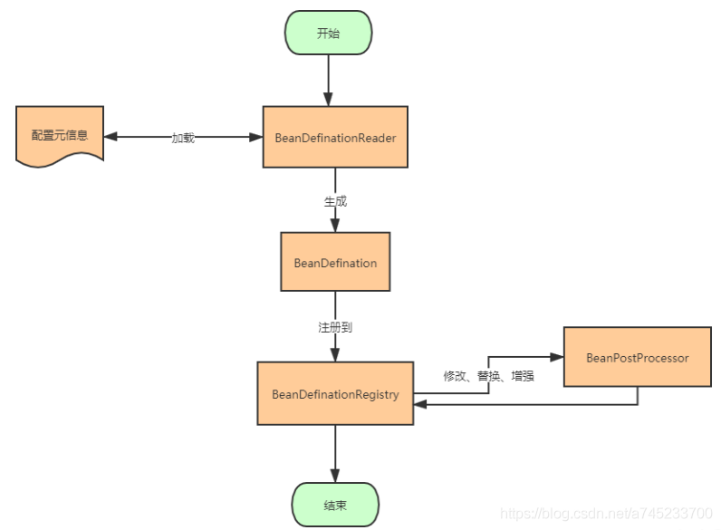
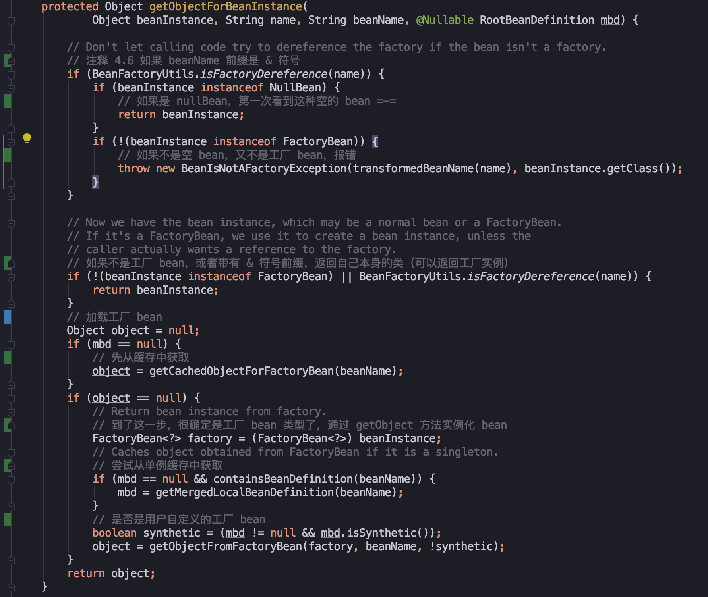
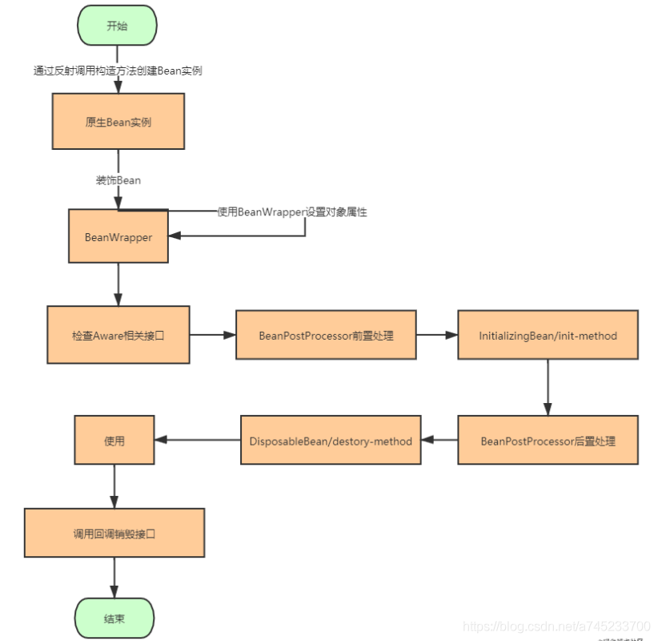

# Spring的Bean加载流程

Spring [IOC](<https://so.csdn.net/so/search?q=IOC&spm=1001.2101.3001.7020>)容器就像是一个生产产品的流水线上的机器，Spring创建出来的Bean就好像是流水线的终点生产出来的一个个精美绝伦的产品。既然是机器，总要先启动，Spring也不例外。因此Bean的加载流程总体上来说可以分为两个阶段：

- 容器启动阶段
- Bean创建阶段


## 一、容器启动阶段：

容器的启动阶段做了很多的预热工作，为后面Bean的实例化做好了充分的准备，我们首先看一下容器的启动阶段都做了哪些预热工作。

**1、配置元信息：**

Spring IOC容器将对象实例的创建与对象实例的使用分离，当业务中需要依赖某个对象，不再依靠我们自己手动创建，只需向Spring要，Spring就会以注入的方式交给我们需要的依赖对象。既然将对象创建的任务交给了Spring，那么Spring就需要知道创建一个对象所需要的一些必要的信息。而这些必要的信息可以是Spring过去支持最完善的xml配置文件，或者是其他形式的例如properties的磁盘文件，也可以是现在主流的注解，甚至是直接的代码硬编码。总之，这些创建对象所需要的必要信息称为配置元信息。

```xml
<bean id="role" class="com.wbg.springxmlbean.entity.Role">
    <!-- property元素是定义类的属性，name属性定义的是属性名称 value是值
    相当于：
    Role role=new Role();
    role.setId(1);
    role.setRoleName("高级工程师");
    role.setNote("重要人员");-->
    <property name="id" value="1"/>
    <property name="roleName" value="高级工程师"/>
    <property name="note" value="重要人员"/>
</bean>
```

**2、BeanDefination：**

在Java世界中，万物皆对象，散落于程序代码各处的注解以及保存在磁盘上的xml或者其他文件等等配置元信息，在内存中总要以一种对象的形式表示，就好比我们活生生的人对应到Java世界中就是一个Person类，而Spring选择在内存中表示这些配置元信息的方式就是BeanDefination，这里我们不会去分析BeanDefination的代码，<span style="color:#3399ea;">这里我们只需要知道配置元信息被加载到内存之后是以BeanDefination的形存在的即可。</span>

**3、BeanDefinationReader：**

Spring是如何看懂这些配置元信息的呢？这个就要靠我们的BeanDefinationReader了。不同的BeanDefinationReader拥有不同的功能，如果我们要读取xml配置元信息，那么可以使用XmlBeanDefinationReader。如果我们要读取properties配置文件，那么可以使用PropertiesBeanDefinitionReader加载。而如果我们要读取注解配置元信息，那么可以使用 AnnotatedBeanDefinitionReader加载。我们也可以很方便的自定义BeanDefinationReader来自己控制配置元信息的加载。总的来说，<span style="color:#f33b45;">BeanDefinationReader的作用就是加载配置元信息，并将其转化为内存形式的BeanDefination</span>

，存在某一个地方，至于这个地方在哪里，不要着急，接着往下看！

**4、BeanDefinationRegistry：**

执行到这里，Spring已经将存在于各处的配置元信息加载到内存，并转化为BeanDefination的形式，这样我们需要创建某一个对象实例的时候，找到相应的BeanDefination然后创建对象即可。那么我们需要某一个对象的时候，去哪里找到对应的BeanDefination呢？这种通过Bean定义的id找到对象的BeanDefination的对应关系或者说映射关系又是如何保存的呢？这就引出了BeanDefinationRegistry了。

<span style="color:#f33b45;">Spring通过BeanDefinationReader将配置元信息加载到内存生成相应的BeanDefination之后，就将其注册到BeanDefinationRegistry中，BeanDefinationRegistry</span>

就是一个存放BeanDefination的大篮子，它也<span style="color:#f33b45;">是一种键值对的形式，通过特定的Bean定义的id，映射到相应的BeanDefination。</span>

**5、BeanFactoryPostProcessor：**

BeanFactoryPostProcessor是容器启动阶段Spring提供的一个扩展点，主要负责对注册到BeanDefinationRegistry中的一个个的BeanDefination进行一定程度上的修改与替换。例如我们的配置元信息中有些可能会修改的配置信息散落到各处，不够灵活，修改相应配置的时候比较麻烦，这时我们可以使用占位符的方式来配置。例如配置Jdbc的DataSource连接的时候可以这样配置：

```xml
<bean id="dataSource"  
    class="org.apache.commons.dbcp.BasicDataSource"  
    destroy-method="close">  
    <property name="maxIdle" value="${jdbc.maxIdle}"></property>  
    <property name="maxActive" value="${jdbc.maxActive}"></property>  
    <property name="maxWait" value="${jdbc.maxWait}"></property>  
    <property name="minIdle" value="${jdbc.minIdle}"></property>  
  
    <property name="driverClassName"  
        value="${jdbc.driverClassName}">  
    </property>  
    <property name="url" value="${jdbc.url}"></property>  
  
    <property name="username" value="${jdbc.username}"></property>  
    <property name="password" value="${jdbc.password}"></property>  
</bean> 
```

BeanFactoryPostProcessor就会对注册到BeanDefinationRegistry中的BeanDefination做最后的修改，替换$占位符为配置文件中的真实的数据。

至此，整个容器启动阶段就算完成了，容器的启动阶段的最终产物就是注册到BeanDefinationRegistry中的一个个BeanDefination了，这就是Spring为Bean实例化所做的预热的工作。让我们再通过一张图的形式回顾一下容器启动阶段都是搞了什么事吧。




## 二、Bean的获取阶段：

在容器启动阶段，已经完成了bean的注册。如果该对象是配置成懒加载的方式，那么直到我们向Spring要依赖对象实例之前，其都是以BeanDefinationRegistry中的一个个的BeanDefination的形式存在，也就是Spring只有在我们第一次依赖对象的时候才开启相应对象的实例化阶段。而如果我们不是选择懒加载的方式，容器启动阶段完成之后，其中有一个步骤finishBeanFactoryInitialization()，在这一步将立即启动Bean实例化阶段，通过隐式的调用所有依赖对象的getBean方法来实例化所有配置的Bean，完成类的加载。

**1、doGetBean()：bean的获取：**

<span style="color:#3399ea;">doGetBean()的总体功能就是在创建bean对象之前，先去缓存或者beanFactory工厂中查看是否存在bean，如果存在，则返回，不存在，则进行对应的创建流程。</span>

我们先找到doGetBean()方法的入口，阅读一下这个方法的源码：

首先调用 ApplicationContext.getBean("beanName")获取Bean对象：

```
applicationContext.getBean("name");
```

然后再调用AbstractApplicationContext.getBean("beanName")：

```java
public Object getBean(String name) throws BeansException {
  assertBeanFactoryActive();　
  // 调用getBean 进入AbstractBeanFactory　　　　
  return getBeanFactory().getBean(name);
}
```

再调用AbstractBeanFactory类下面的doGetBean()方法：

```java
protected <T> T doGetBean(
			final String name, final Class<T> requiredType, final Object[] args, boolean typeCheckOnly)
			throws BeansException {
 
        /*
        1、转换beanName(别名转换)：传入的参数name可能只是别名，也可能是FactoryBean，所以需要进行解析转换：
        （1）消除修饰符，比如工厂引用前缀 String FACTORY_BEAN_PREFIX = "&";
        （2）解决spring中alias标签的别名问题
        */ 
		final String beanName = transformedBeanName(name);
		Object bean;
 
        //2、尝试从缓存中去加载实例，如果获取到了就直接返回
		// Eagerly check singleton cache for manually registered singletons.
		Object sharedInstance = getSingleton(beanName);
		//如果缓存中存在对应的bean
		if (sharedInstance != null && args == null) {
			if (logger.isDebugEnabled()) {
				if (isSingletonCurrentlyInCreation(beanName)) {
					logger.debug("Returning eagerly cached instance of singleton bean '" + beanName +
							"' that is not fully initialized yet - a consequence of a circular reference");
				}
				else {
					logger.debug("Returning cached instance of singleton bean '" + beanName + "'");
				}
			}
			
			//3、缓存渠道的bean的实例化。从缓存中获取的bean是原始状态的bean,需要在这里对bean进行bean实例化。
			// 此时会进行 合并RootBeanDefinition、BeanPostProcessor进行实例前置处理、实例化、实例后置处理。
			bean = getObjectForBeanInstance(sharedInstance, name, beanName, null);
		}
        // 如果缓存中没有对应bean
		else { 
		    //4、循环依赖检查。 (构造器的循环依赖)循环依赖存在，则报错。
			// Fail if we're already creating this bean instance:
			// We're assumably within a circular reference.
			if (isPrototypeCurrentlyInCreation(beanName)) {
				throw new BeanCurrentlyInCreationException(beanName);
			}
 
            // 5、如果缓存中没有数据，就会转到父类工厂去加载
            //获取父工厂
			// Check if bean definition exists in this factory.
			BeanFactory parentBeanFactory = getParentBeanFactory();
			
            //!containsBeanDefinition(beanName)就是检测如果当前加载的xml配置文件中不包含beanName所对应的配置，就只能到parentBeanFacotory去尝试加载bean。
			if (parentBeanFactory != null && !containsBeanDefinition(beanName)) {
				// Not found -> check parent.
				String nameToLookup = originalBeanName(name);
				if (args != null) {
					// Delegation to parent with explicit args.
					return (T) parentBeanFactory.getBean(nameToLookup, args);
				}
				else {
					// No args -> delegate to standard getBean method.
					return parentBeanFactory.getBean(nameToLookup, requiredType);
				}
			}
 
			if (!typeCheckOnly) {
				markBeanAsCreated(beanName);
			}
 
            //6、存储XML配置文件的GernericBeanDefinition转换成RootBeanDefinition，即为合并父类定义。
			try {
                // XML配置文件中读取到的bean信息是存储在GernericBeanDefinition中的，但Bean的后续处理是针对于RootBeanDefinition的，所以需要转换后才能进行后续操作。
				final RootBeanDefinition mbd = getMergedLocalBeanDefinition(beanName);
				checkMergedBeanDefinition(mbd, beanName, args);
 
				// Guarantee initialization of beans that the current bean depends on.
				//7、初始化依赖的bean
				String[] dependsOn = mbd.getDependsOn();
				//bean中可能依赖了其他bean属性，在初始化bean之前会先初始化这个bean所依赖的bean属性。
				if (dependsOn != null) {
					for (String dependsOnBean : dependsOn) {
						if (isDependent(beanName, dependsOnBean)) {
							throw new BeanCreationException(mbd.getResourceDescription(), beanName,
									"Circular depends-on relationship between '" + beanName + "' and '" + dependsOnBean + "'");
						}
						registerDependentBean(dependsOnBean, beanName);
						getBean(dependsOnBean);
					}
				}
 
                //8、创建bean
				// Create bean instance.
				if (mbd.isSingleton()) {
					sharedInstance = getSingleton(beanName, new ObjectFactory<Object>() {
						@Override
						public Object getObject() throws BeansException {
							try {
								return createBean(beanName, mbd, args);
							}
							catch (BeansException ex) {
								// Explicitly remove instance from singleton cache: It might have been put there
								// eagerly by the creation process, to allow for circular reference resolution.
								// Also remove any beans that received a temporary reference to the bean.
								destroySingleton(beanName);
								throw ex;
							}
						}
					});
					bean = getObjectForBeanInstance(sharedInstance, name, beanName, mbd);
				}
 
				else if (mbd.isPrototype()) {
					// It's a prototype -> create a new instance.
					Object prototypeInstance = null;
					try {
						beforePrototypeCreation(beanName);
						prototypeInstance = createBean(beanName, mbd, args);
					}
					finally {
						afterPrototypeCreation(beanName);
					}
					bean = getObjectForBeanInstance(prototypeInstance, name, beanName, mbd);
				}
 
				else {
					String scopeName = mbd.getScope();
					final Scope scope = this.scopes.get(scopeName);
					if (scope == null) {
						throw new IllegalStateException("No Scope registered for scope name '" + scopeName + "'");
					}
					try {
						Object scopedInstance = scope.get(beanName, new ObjectFactory<Object>() {
							@Override
							public Object getObject() throws BeansException {
								beforePrototypeCreation(beanName);
								try {
									return createBean(beanName, mbd, args);
								}
								finally {
									afterPrototypeCreation(beanName);
								}
							}
						});
						bean = getObjectForBeanInstance(scopedInstance, name, beanName, mbd);
					}
					catch (IllegalStateException ex) {
						throw new BeanCreationException(beanName,
								"Scope '" + scopeName + "' is not active for the current thread; consider " +
								"defining a scoped proxy for this bean if you intend to refer to it from a singleton",
								ex);
					}
				}
			}
			catch (BeansException ex) {
				cleanupAfterBeanCreationFailure(beanName);
				throw ex;
			}
		}
 
		// Check if required type matches the type of the actual bean instance.
		if (requiredType != null && bean != null && !requiredType.isAssignableFrom(bean.getClass())) {
			try {
				return getTypeConverter().convertIfNecessary(bean, requiredType);
			}
			catch (TypeMismatchException ex) {
				if (logger.isDebugEnabled()) {
					logger.debug("Failed to convert bean '" + name + "' to required type [" +
							ClassUtils.getQualifiedName(requiredType) + "]", ex);
				}
				throw new BeanNotOfRequiredTypeException(name, requiredType, bean.getClass());
			}
		}
		return (T) bean;
}
```

**2、从缓存中获取单例bean：getSingleton(String beanName, boolean allowEarlyReference)**

```java
protected Object getSingleton(String beanName, boolean allowEarlyReference) {
	// 从缓存池中获取bean：singletonObjects 一级缓
    Object singletonObject = this.singletonObjects.get(beanName);
	
    // 如果一级缓存中为null，再判断是否正在创建
	if (singletonObject == null && isSingletonCurrentlyInCreation(beanName)) {
		// 加锁，防止并发创建
		synchronized (this.singletonObjects) {
			// 从二级缓存中获取bean，如果此 bean 正在加载则不处理
			singletonObject = this.earlySingletonObjects.get(beanName);
            if (singletonObject == null && allowEarlyReference) {
				// 当某些方法需要提前初始化，调用 addSingletonFactory 方法将对应的objectFactory 初始化策略存储在 singletonFactories
				ObjectFactory<?> singletonFactory = this.singletonFactories.get(beanName);
				if (singletonFactory != null) {
					singletonObject = singletonFactory.getObject();
					this.earlySingletonObjects.put(beanName, singletonObject);
					this.singletonFactories.remove(beanName);
				}
			}
		}
	}
	return singletonObject;
}
```

在 Spring 中，bean默认都是单例的，同一个容器的单例只会被创建一次，后续再获取 bean 时，直接从单例缓存 singletonObjects 中进行获取。而且因为单例缓存是公共变量，所以对它进行操作的时候，都进行了加锁操作，避免了多线程并发修改或读取的覆盖操作。

还有这里有个 earlySingletonObjects 变量，它也是单例缓存，也是用来保存 beanName 和 创建 bean 实例之间的关系。与 singletonFactories 不同的是，当一个单例 bean 被放入到这 early 单例缓存后，就要从 singletonFactories 中移除，两者是互斥的，主要用来解决循环依赖的问题。

**3、从Bean的实例中获取对象：getObjectForBeanInstance()**

在 getBean()方法中，getObjectForBeanInstance() 是个高频方法，在单例缓存中获得 bean 还是 根据不同的 scope 策略加载 bean，都有这个这个方法的出现。因为从缓存中获取的bean是原始状态的bean，需要在这里对bean进行bean实例化。



方法流程小结：

> - （1）验证 bean 类型：判断是否是工厂bean
> - （2）对非 FactoryBean 不做处理
> - （3）处理 FactoryBean：如果是FactoryBean类型，先对 bean 进行转换，再委托给 getObjectFromFactoryBean()方法进行处理。
>

在这个方法中，对工厂 bean 有特殊处理，最终获取的是 FactoryBean.getObject() 方法返回的类型。

<span style="color:#f33b45;"><strong>4、获取单例：getSingleton(String beanName, ObjectFactory&lt;?&gt; singletonFactory)</strong></span>

```java
// Create bean instance. 创建 bean 实例
// singleton 单例模式（最常使用）
if (mbd.isSingleton()) {
    // 第二个参数的回调接口，接口是 org.springframework.beans.factory.ObjectFactory#getObject
    // 接口实现的方法是 createBean(beanName, mbd, args)
	sharedInstance = getSingleton(beanName, () -> {
		return createBean(beanName, mbd, args);
		// 省略了 try / catch
	});
	bean = getObjectForBeanInstance(sharedInstance, name, beanName, mbd);
}
```

来看 getSingleton() 方法做了什么：

```java
public Object getSingleton(String beanName, ObjectFactory<?> singletonFactory) {
	Assert.notNull(beanName, "Bean name must not be null");
	// 注释 4.7 全局变量，加锁
	synchronized (this.singletonObjects) {
		//1、再次检查是否已经被加载了，单例模式就是可以复用已经创建的 bean
		Object singletonObject = this.singletonObjects.get(beanName);
		if (singletonObject == null) {
			//2、初始化前操作，校验是否 beanName 是否有别的线程在初始化，并记录beanName的初始化状态
			beforeSingletonCreation(beanName);
			boolean newSingleton = false;
			boolean recordSuppressedExceptions = (this.suppressedExceptions == null);
			if (recordSuppressedExceptions) {
				this.suppressedExceptions = new LinkedHashSet<>();
			}
			//3、调用createBean方法实例化bean
			singletonObject = singletonFactory.getObject();
			newSingleton = true;
			if (recordSuppressedExceptions) {
				this.suppressedExceptions = null;
			}
			//4、初始化后的操作，移除初始化状态
			afterSingletonCreation(beanName);
			if (newSingleton) {
				//5、加入缓存
				addSingleton(beanName, singletonObject);
			}
		}
		return singletonObject;
	}
}
```

这一步的流程就是：

> - （1）再次检查缓存是否已经加载过
> - （2）没有加载，则记录beanName 的加载状态
> - （3）调用createBean()方法实例化 bean
> - （4）bean实例化完成之后，移除初始化状态
> - （5）将实例化结果记录到缓存并删除加载 bean 过程中所记录到的各种辅助状态
>

对于第(2)步和第(4)步，用来记录 bean 的加载状态，是用来对 循环依赖 进行检测的。关键的方法在于第三步，调用了 ObjectFactory 的 getObject() 方法，实际回调接口实现的是 createBean() 方法进行创建对象。


## <span style="color:#f33b45;">三、Bean的实例化阶段：</span>


### （一）创建bean前的准备：

```java
protected Object createBean(String beanName, RootBeanDefinition mbd, @Nullable Object[] args) {
	RootBeanDefinition mbdToUse = mbd;
	// 确保此时bean类已经被解析，并且克隆 bean 定义，以防动态解析的类不能存储在共享合并 bean 定义中。
	//1、锁定 class，根据设置的 class 属性或者根据 className 来解析 Class
	Class<?> resolvedClass = resolveBeanClass(mbd, beanName);
	if (resolvedClass != null && !mbd.hasBeanClass() && mbd.getBeanClassName() != null) {
		mbdToUse = new RootBeanDefinition(mbd);
		mbdToUse.setBeanClass(resolvedClass);
	}
	// Prepare method overrides.
	//2、验证及准备覆盖的方法
    mbdToUse.prepareMethodOverrides();
    //3、解析指定bean，让 beanPostProcessor 有机会返回代理而不是目标bean实例。
    Object bean = resolveBeforeInstantiation(beanName, mbdToUse);
    if (bean != null) {
    	// 短路操作，如果代理成功创建 bean 后，直接返回
    	return bean;
    }
	
	//4、创建 bean
	Object beanInstance = doCreateBean(beanName, mbdToUse, args);
	return beanInstance;
}
```

先来总结这个流程：

> - （1）根据设置的 class 属性或者根据 className 来解析 Class
> - （2）验证及准备覆盖的方法 这个方法是用来处理以下两个配置的：我们在解析默认标签时，会识别 lookup-method 和 replaced-method 属性，然后这两个配置的加载将会统一存放在 beanDefinition 中的 methodOverrides 属性里。
> - （3）应用初始化前的后处理器，解析指定 bean 是否存在初始化前的短路操作
> - （4）创建 bean
>

**1、处理 Override 属性：**

```java
public void prepareMethodOverrides() throws BeanDefinitionValidationException {
	// Check that lookup methods exists.
	if (hasMethodOverrides()) {
		Set<MethodOverride> overrides = getMethodOverrides().getOverrides();
		synchronized (overrides) {
			for (MethodOverride mo : overrides) {
				// 处理 override 属性
				prepareMethodOverride(mo);
			}
		}
	}
}
```

可以看到，获取类的重载方法列表，然后遍历，一个一个进行处理。具体处理的是 lookup-method 和 replaced-method 属性，这个步骤解析的配置将会存入 beanDefinition 中的 methodOverrides 属性里，是为了待会实例化做准备。 如果 bean 在实例化时，监测到 methodOverrides 属性，会动态地位当前 bean 生成代理，使用对应的拦截器为 bean 做增强处理。

**2、实例化前的前置处理：**

```java
// 让 beanPostProcessor 有机会返回代理而不是目标bean实例。
Object bean = resolveBeforeInstantiation(beanName, mbdToUse);
if (bean != null) {
	// 短路操作，如果代理成功创建 bean 后，直接返回
	return bean;
}
 
protected Object resolveBeforeInstantiation(String beanName, RootBeanDefinition mbd) {
	Object bean = null;
	if (!Boolean.FALSE.equals(mbd.beforeInstantiationResolved)) {
		// Make sure bean class is actually resolved at this point.
		if (!mbd.isSynthetic() && hasInstantiationAwareBeanPostProcessors()) {
			Class<?> targetType = determineTargetType(beanName, mbd);
			if (targetType != null) {
			    // 执行前置拦截器的操作
				bean = applyBeanPostProcessorsBeforeInstantiation(targetType, beanName);
				if (bean != null) {
				    // 执行后置拦截器的操作
					bean = applyBeanPostProcessorsAfterInitialization(bean, beanName);
				}
			}
		}
		mbd.beforeInstantiationResolved = (bean != null);
	}
	return bean;
}
```

在 doCreateBean() 方法前，有一个短路操作，如果后处理器成功，将会返回代理的 bean。

在 resolveBeforeInstantiation() 方法中，在确保 bean 信息已经被解析完成，执行了两个关键方法，从注释中看到，一个是前置拦截器的操作，另一个就是后置拦截器的操作。

如果第一个前置拦截器实例化成功，就已经将单例 bean 放入缓存中，它不会再经历普通 bean 的创建过程，没有机会进行后处理器的调用，所以在这里的第二个步骤，就是为了这个 bean 也能应用后处理器的 postProcessAfterInitialization 方法。而如果这个bean没有特定的前置处理，那说明这个bean是一个普通的bean，则按照下面的步骤进行创建

### <span style="color:#f33b45;">（二）bean的创建：doCreateBean()</span>

到了这一步，就开始真正创建bean对象了，对应的源码就在doCreateBean()方法中，在这里，我们先看一下bean的整体创建流程是怎么样的，然后再对其中的各个重要的方法作分析：

```java
protected Object doCreateBean(final String beanName, final RootBeanDefinition mbd, final @Nullable Object[] args) {
	// Instantiate the bean.
	BeanWrapper instanceWrapper = null;
    //1、如果bean是单例，就先清除缓存中的bean信息
	if (mbd.isSingleton()) {
		instanceWrapper = this.factoryBeanInstanceCache.remove(beanName);
	}
	if (instanceWrapper == null) {
		//2、根据指定bean使用对应的策略实例化bean，例如：工厂方法，构造函数自动注入，简单初始化
		instanceWrapper = createBeanInstance(beanName, mbd, args);
	}
	final Object bean = instanceWrapper.getWrappedInstance();
	Class<?> beanType = instanceWrapper.getWrappedClass();
	if (beanType != NullBean.class) {
		mbd.resolvedTargetType = beanType;
	}
	//3、允许后处理处理器修改合并后的bean定义
	synchronized (mbd.postProcessingLock) {
		if (!mbd.postProcessed) {
			applyMergedBeanDefinitionPostProcessors(mbd, beanType, beanName);
			mbd.postProcessed = true;
		}
	}
	//4、是否需要提前曝光，用来解决循环依赖时使用
	boolean earlySingletonExposure = (mbd.isSingleton() && this.allowCircularReferences &&
			isSingletonCurrentlyInCreation(beanName));
	if (earlySingletonExposure) {
		// 第二个参数是回调接口，实现的功能是将切面动态织入 bean
		addSingletonFactory(beanName, () -> getEarlyBeanReference(beanName, mbd, bean));
	}
	Object exposedObject = bean;
    //5、对 bean 进行填充，将各个属性值注入
    // 如果存在对其它 bean 的依赖，将会递归初始化依赖的 bean
    populateBean(beanName, mbd, instanceWrapper);
    //6、调用初始化方法，例如 init-method
    exposedObject = initializeBean(beanName, exposedObject, mbd);
	
    //7、循环依赖检查
	if (earlySingletonExposure) {
		Object earlySingletonReference = getSingleton(beanName, false);
		// earlySingletonReference 只有在检测到有循环依赖的情况下才 不为空
		if (earlySingletonReference != null) {
			if (exposedObject == bean) {
				// 如果 exposedObject 没有在初始化方法中被改变，也就是没有被增强
				exposedObject = earlySingletonReference;
			}
			else if (!this.allowRawInjectionDespiteWrapping && hasDependentBean(beanName)) {
				String[] dependentBeans = getDependentBeans(beanName);
				Set<String> actualDependentBeans = new LinkedHashSet<>(dependentBeans.length);
				for (String dependentBean : dependentBeans) {
					// 检查依赖
					if (!removeSingletonIfCreatedForTypeCheckOnly(dependentBean)) {
						actualDependentBeans.add(dependentBean);
					}
				}
				// bean 创建后，它所依赖的 bean 一定是已经创建了
				// 在上面已经找到它有依赖的 bean，如果 actualDependentBeans 不为空
				// 表示还有依赖的 bean 没有初始化完成，也就是存在循环依赖
				if (!actualDependentBeans.isEmpty()) {
					throw new BeanCurrentlyInCreationException(beanName);
			}
		}
	}
	// Register bean as disposable.
	// 8、根据 scope 注册 bean
	registerDisposableBeanIfNecessary(beanName, bean, mbd);
	return exposedObject;
}
```

这个doCreateBean()方法的主要流程可以总结为：

> - （1）如果要加载的bean是单例，就先清除缓存中的bean信息
> - （2）实例化 bean，将 BeanDifinition 转化成 BeanWrapper
> - （3）后置处理器修改合并后的 bean 定义：bean 合并后的处理，Autowired 注解正式通过此方法实现诸如类型的预解析
> - （4）依赖处理，提前暴露bean的引用，主要用于解决循环依赖的问题
> - （5）属性填充：将所有属性填充到 bean 的实例中，如果存在对其他bean的依赖，将会递归初始化依赖的bean
> - （6）初始化bean：例如afeterPropertiesSet()和init-method属性配置的方法
> - （7）循环依赖检查
> - （8）注册 DisposableBean：这一步是用来处理 destroy-method 属性，在这一步注册，以便在销毁对象时调用。
> - （9）完成创建并返回。
>

**1、createBeanInstance()：实例化bean对象**

在上面第(2)个步骤，做的是实例化bean，然后返回BeanWrapper。

createBeanInstance()这一步的流程主要通过两种方式实例化bean对象，一种是工厂方法，另一种就是构造函数，将传进来的 RootBeanDefinition 中的配置二选一生成 bean 实例，大致介绍功能：

> - 如果存在工厂方法则使用工厂方法进行初始化
> - 如果则使用有参构造行数实例化bean：一个类有多个构造函数，每个构造函数都有不同的参数，所以需要根据参数锁定构造函数进行 bean 的实例化
> - 如果既不存在工厂方法，也不存在带有参数的构造函数，会使用默认的构造函数进行 bean 的实例化
>

```java
protected BeanWrapper createBeanInstance(String beanName, RootBeanDefinition mbd, Object[] args) {
	// Make sure bean class is actually resolved at this point.
	Class<?> beanClass = resolveBeanClass(mbd, beanName);
	Supplier<?> instanceSupplier = mbd.getInstanceSupplier();
	// Shortcut when re-creating the same bean...
	boolean resolved = false;
	boolean autowireNecessary = false;
	if (args == null) {
		synchronized (mbd.constructorArgumentLock) {
			// 如果一个类有多个构造函数，每个构造函数都有不同的参数，调用前需要进行判断对应的构造函数或者工厂方法
			if (mbd.resolvedConstructorOrFactoryMethod != null) {
				resolved = true;
				autowireNecessary = mbd.constructorArgumentsResolved;
			}
		}
	}
	// 如果已经解析过，不需要再次解析
	if (resolved) {
		if (autowireNecessary) {
			// 实际解析的是 org.springframework.beans.factory.support.ConstructorResolver.autowireConstructor
			// 构造函数自动注入
			return autowireConstructor(beanName, mbd, null, null);
		}
		else {
			// 使用默认的构造函数
			return instantiateBean(beanName, mbd);
		}
	}
    // Candidate constructors for autowiring? 需要根据参数解析构造函数
	Constructor<?>[] ctors = determineConstructorsFromBeanPostProcessors(beanClass, beanName);
	if (ctors != null || mbd.getResolvedAutowireMode() == AUTOWIRE_CONSTRUCTOR ||
			mbd.hasConstructorArgumentValues() || !ObjectUtils.isEmpty(args)) {
		return autowireConstructor(beanName, mbd, ctors, args);
	}
	// Preferred constructors for default construction?
	ctors = mbd.getPreferredConstructors();
	if (ctors != null) {
		// 构造函数注入
		return autowireConstructor(beanName, mbd, ctors, null);
	}
	// No special handling: simply use no-arg constructor. 没有特殊的处理，使用默认构造函数构造
	return instantiateBean(beanName, mbd);
}
```

在这里，我们简单介绍下什么是BeanWrapper：

Spring中的Bean并不是以一个个的本来模样存在的，由于Spring IOC容器中要管理多种类型的对象，因此为了统一对不同类型对象的访问，<span style="color:#f33b45;">Spring给所有创建的Bean实例穿上了一层外套，</span>

这个外套就是BeanWrapper，BeanWrapper实际<span style="color:#f33b45;">上是对反射相关API的简单封装，使得上层使用反射完成相关的业务逻辑大大的简化，</span>

我们要获取某个对象的属性，调用某个对象的方法，现在不需要在写繁杂的反射API了以及处理一堆麻烦的异常，直接通过BeanWrapper就可以完成相关操作，简直不要太爽了。

**2、循环依赖：**

这里对应前面的第(4)步的流程，提前暴露bean的引用，主要是用于解决循环依赖的问题

```java
// 是否需要提前曝光，用来解决循环依赖时使用
boolean earlySingletonExposure = (mbd.isSingleton() && this.allowCircularReferences &&
		isSingletonCurrentlyInCreation(beanName));
if (earlySingletonExposure) {
	// 第二个参数是回调接口，实现的功能是将切面动态织入 bean
	addSingletonFactory(beanName, () -> getEarlyBeanReference(beanName, mbd, bean));
}
```

关键方法是 addSingletonFactory，作用是在 bean 开始初始化前将创建实例的 ObjectFactory 加入单例工厂，ObjectFactory 是创建对象时使用的工厂。在对象实例化时，会判断自己依赖的对象是否已经创建好了，判断的依据是查看依赖对象的 ObjectFactory 是否在单例缓存中，如果没有创建将会先创建依赖的对象，然后将 ObjectFactory 放入单例缓存中。

这时如果有循环依赖，需要提前对它进行暴露，让依赖方找到并正常实例化。

有关循环依赖的内容可以阅读这篇文章：[https://blog.csdn.net/a745233700/article/details/110914620](<https://blog.csdn.net/a745233700/article/details/110914620>)

**3、populateBean()：属性注入**

这里对应前面的第(5)步，根据不同的注入类型进行属性填充，然后调用后处理器进行处理，最终将属性应用到 bean 中。主要流程如下：

> （1）调用 InstantiationAwareBeanPostProcessor 处理器的 postProcessAfterInstantiation 方法，判断控制程序是否继续进行属性填充
>
> （2）根据注入类型（byType/byName），提取依赖的，统一存入 PropertyValues 中
>
> （3）判断是否需要进行 BeanPostProcessor 和 依赖检查：
>
> - 如果有后置处理器，将会应用 InstantiationAwareBeanPostProcessor 处理器的 postProcessProperties 方法，对属性获取完毕填充前，对属性进行再次处理。
> - 使用 checkDependencies 方法来进行依赖检查
>
> （4）将所有解析到的 PropertyValues 中的属性填充至 BeanWrapper 中

```java
protected void populateBean(String beanName, RootBeanDefinition mbd, @Nullable BeanWrapper bw) {
	// 给 awareBeanPostProcessor 后处理器最后一次机会，在属性设置之前修改bean的属性
	boolean continueWithPropertyPopulation = true;
	if (!mbd.isSynthetic() && hasInstantiationAwareBeanPostProcessors()) {
		...
        if (!ibp.postProcessAfterInstantiation(bw.getWrappedInstance(), beanName)) {
			continueWithPropertyPopulation = false;
			break;
		}
        ...
	}
	PropertyValues pvs = (mbd.hasPropertyValues() ? mbd.getPropertyValues() : null);
	int resolvedAutowireMode = mbd.getResolvedAutowireMode();
	if (resolvedAutowireMode == AUTOWIRE_BY_NAME || resolvedAutowireMode == AUTOWIRE_BY_TYPE) {
		MutablePropertyValues newPvs = new MutablePropertyValues(pvs);
		// Add property values based on autowire by name if applicable.
		if (resolvedAutowireMode == AUTOWIRE_BY_NAME) {
			// 根据名字自动注入
			autowireByName(beanName, mbd, bw, newPvs);
		}
		// Add property values based on autowire by type if applicable.
		if (resolvedAutowireMode == AUTOWIRE_BY_TYPE) {
			// 根据类型自动注入
			autowireByType(beanName, mbd, bw, newPvs);
		}
		pvs = newPvs;
	}
	// 后处理器已经初始化
	boolean hasInstAwareBpps = hasInstantiationAwareBeanPostProcessors();
	// 需要依赖检查
	boolean needsDepCheck = (mbd.getDependencyCheck() != AbstractBeanDefinition.DEPENDENCY_CHECK_NONE);
	PropertyDescriptor[] filteredPds = null;
    // 从 beanPostProcessors 对象中提取 BeanPostProcessor 结果集，遍历后处理器
    for (BeanPostProcessor bp : getBeanPostProcessors()) {
    	...
    }
	// 在前面也出现过，用来进行依赖检查
    filteredPds = filterPropertyDescriptorsForDependencyCheck(bw, mbd.allowCaching);
    checkDependencies(beanName, mbd, filteredPds, pvs);
	// 将属性应用到 bean 中，使用深拷贝，将子类的属性一并拷贝
	applyPropertyValues(beanName, mbd, bw, pvs);
}
```

<span style="color:#f33b45;"><strong>4、initializeBean()：初始化 bean</strong></span>

这里对应前面的第(6)步，主要是用来进行我们设定的初始化方法的调用，不过在方法内部，还做了其它操作，首先我们先看下源码：

```java
protected Object initializeBean(final String beanName, final Object bean, @Nullable RootBeanDefinition mbd) {
    //1、处理Aware接口
	if (System.getSecurityManager() != null) {
		AccessController.doPrivileged((PrivilegedAction<Object>) () -> {
			invokeAwareMethods(beanName, bean);
			return null;
		}, getAccessControlContext());
	}
	else {
		// 如果没有 securityManage，方法里面校验了 bean 的类型，需要引用 Aware 接口
		// 对特殊的 bean 处理：Aware/ BeanClassLoader / BeanFactoryAware
		invokeAwareMethods(beanName, bean);
	}
 
    //2、执行BeanPostProcessor前置处理：
	Object wrappedBean = bean;
	if (mbd == null || !mbd.isSynthetic()) {
		wrappedBean = applyBeanPostProcessorsBeforeInitialization(wrappedBean, beanName);
	}
	//3、调用用户自定义的 init-method 方法
	invokeInitMethods(beanName, wrappedBean, mbd);
 
    //4、执行BeanPostProcessor后置处理
	if (mbd == null || !mbd.isSynthetic()) {
		wrappedBean = applyBeanPostProcessorsAfterInitialization(wrappedBean, beanName);
	}
 
	return wrappedBean;
}
```

这一步的流程中，主要做的处理操作有：

**（1）处理Aware接口：**

Spring会检测该对象是否实现了xxxAware接口，通过Aware类型的接口，可以让我们拿到Spring容器的一些相应的资源并注入：

> - ①如果这个Bean实现了BeanNameAware接口，会调用它实现的setBeanName(String beanId)方法，传入Bean的名字；
> - ②如果这个Bean实现了BeanClassLoaderAware接口，调用setBeanClassLoader()方法，传入ClassLoader对象的实例。
> - ②如果这个Bean实现了BeanFactoryAware接口，会调用它实现的setBeanFactory()方法，传递的是Spring工厂自身。
> - ③如果这个Bean实现了ApplicationContextAware接口，会调用setApplicationContext(ApplicationContext)方法，传入Spring上下文；
>

**（2）执行BeanPostProcessor前置处理：**

如果想在Bean初始化前进行一些自定义的前置处理，那么可以让Bean实现了BeanPostProcessor接口，那将会调用postProcessBeforeInitialization(Object obj, String s)方法。

**（3）调用自定义的 init 方法：**

这一步就是找到用户自定义的构造函数，然后调用它。

> ① 如果Bean实现了InitializingBean接口，执行afeterPropertiesSet()方法
>
> ②如果Bean在Spring配置文件中配置了 init-method 属性，则会自动调用其配置的初始化方法。

**（4）执行BeanPostProcessor后置处理：**

如果这个Bean实现了BeanPostProcessor接口，将会调用postProcessAfterInitialization(Object obj, String s)方法；由于这个方法是在Bean初始化结束时调用的，所以可以被应用于内存或缓存技术；

> 在容器启动阶段我们讲到BeanFactoryPostProcessor，这里我们讲到BeanPostProcessor，那么BeanFactoryPostProcessor 和 BeanPostProcessor 有什么区别呢？
>
> - <span style="color:#3399ea;">BeanFactoryPostProcessor存在于容器启动阶段，而BeanPostProcessor存在于对象实例化阶段，BeanFactoryPostProcessor关注对象被创建之前那些配置的修改，而BeanPostProcessor阶段关注对象已经被创建之后的功能增强，替换等操作</span>
>
> ，这样就很容易区分了。
> - BeanPostProcessor与BeanFactoryPostProcessor都是Spring在Bean生产过程中强有力的扩展点。Spring中著名的AOP(面向切面编程)，其实就是依赖BeanPostProcessor对Bean对象功能增强的。
>

**5、注册 disposableBean：**

这一步就是根据不同的 scope 进行 disposableBean 的注册。同时也会注册用户自定义的销毁逻辑，跟自定义的初始化逻辑一样有两种方式：（1）DisposableBean接口的destory()；（2）destory-method参数配置的方法。

```java
protected void registerDisposableBeanIfNecessary(String beanName, Object bean, RootBeanDefinition mbd) {
	AccessControlContext acc = (System.getSecurityManager() != null ? getAccessControlContext() : null);
	if (!mbd.isPrototype() && requiresDestruction(bean, mbd)) {
        // 单例模式
		if (mbd.isSingleton()) {
			// 注册 DisposableBean
			registerDisposableBean(beanName,new DisposableBeanAdapter(bean, beanName, mbd, getBeanPostProcessors(), acc));
		}
		else {
			// A bean with a custom scope...
			Scope scope = this.scopes.get(mbd.getScope());
			scope.registerDestructionCallback(beanName,new DisposableBeanAdapter(bean, beanName, mbd, getBeanPostProcessors(), acc));
		}
	}
}
```

**6、使用与销毁：**

经过了以上道道工序，Spring终于将Bean创建完成了，当Spring的Bean在为我们服务完之后，马上就要消亡了（通常是在容器关闭的时候），这时候Spring将以回调的方式调用我们自定义的销毁逻辑，然后Bean就这样走完了光荣的一生！

**7、小结：**

最后，我们再通过一张图来一起看一看Bean实例化阶段的执行顺序是如何的：


