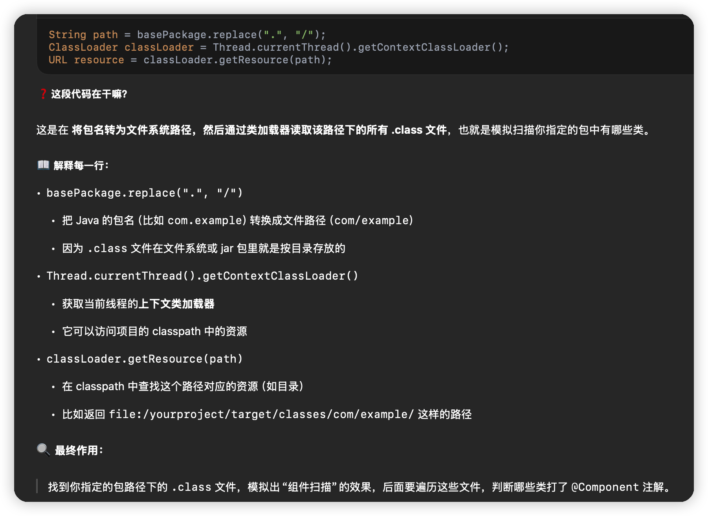
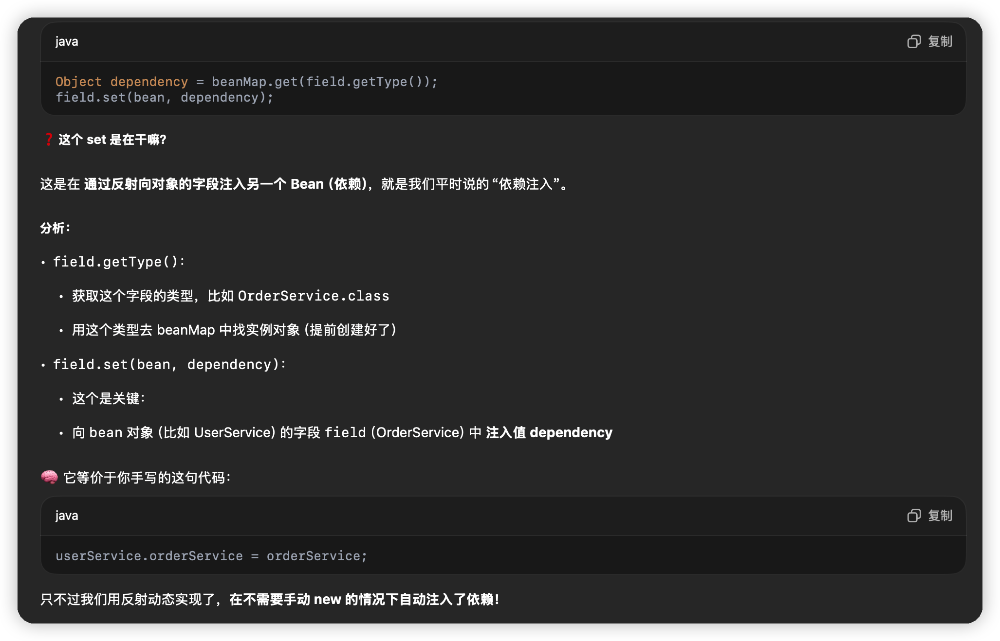

```java
@Component
public class UserService {
    @Autowired
    private OrderService orderService;

    public void hello() {
        orderService.printOrder();
    }
}

@Component
public class OrderService {
    public void printOrder() {
        System.out.println("订单服务启动！");
    }
}
```

```java
@Target(ElementType.TYPE)
@Retention(RetentionPolicy.RUNTIME)
public @interface Component {
}

@Target(ElementType.FIELD)
@Retention(RetentionPolicy.RUNTIME)
public @interface Autowired {
}
```

```java
public class MiniApplicationContext {
    private Map<Class<?>, Object> beanMap = new HashMap<>();

    public MiniApplicationContext(String basePackage) {
        try {
            scan(basePackage);     // 扫描并实例化
            injectDependencies();  // 注入依赖
        } catch (Exception e) {
            throw new RuntimeException(e);
        }
    }

    public <T> T getBean(Class<T> clazz) {
        return clazz.cast(beanMap.get(clazz));
    }

    private void scan(String basePackage) throws Exception {
        String path = basePackage.replace(".", "/");
        ClassLoader classLoader = Thread.currentThread().getContextClassLoader();
        URL resource = classLoader.getResource(path);

        if (resource == null) return;

        File dir = new File(resource.getFile());
        for (File file : dir.listFiles()) {
            if (file.getName().endsWith(".class")) {
                String className = basePackage + "." + file.getName().replace(".class", "");
                Class<?> clazz = Class.forName(className);
                if (clazz.isAnnotationPresent(Component.class)) {
                    Object instance = clazz.getDeclaredConstructor().newInstance();
                    beanMap.put(clazz, instance);
                }
            }
        }
    }

    private void injectDependencies() throws Exception {
        for (Object bean : beanMap.values()) {
            for (Field field : bean.getClass().getDeclaredFields()) {
                if (field.isAnnotationPresent(Autowired.class)) {
                    field.setAccessible(true);
                    Object dependency = beanMap.get(field.getType());
                    field.set(bean, dependency);
                }
            }
        }
    }
}
```

测试代码

```java
public class Main {
    public static void main(String[] args) {
        MiniApplicationContext context = new MiniApplicationContext("com.example");
        UserService userService = context.getBean(UserService.class);
        userService.hello();  // 输出：订单服务启动！
    }
}
```

| 注解识别   | 用 clazz.isAnnotationPresent 找到组件类                      |
| ---------- | ------------------------------------------------------------ |
| 动态实例化 | 用 clazz.getDeclaredConstructor().newInstance() 创建对象     |
| 依赖注入   | 用 Field.setAccessible(true) 和 field.set() 注入对象         |
| 类扫描     | 简化为读取 class 文件目录的方式实现（Spring 是用 classpath + ASM） |


疑问解答



