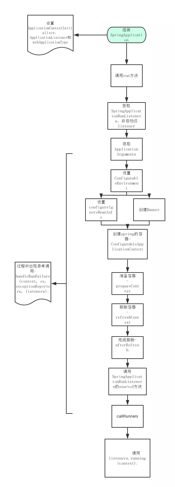
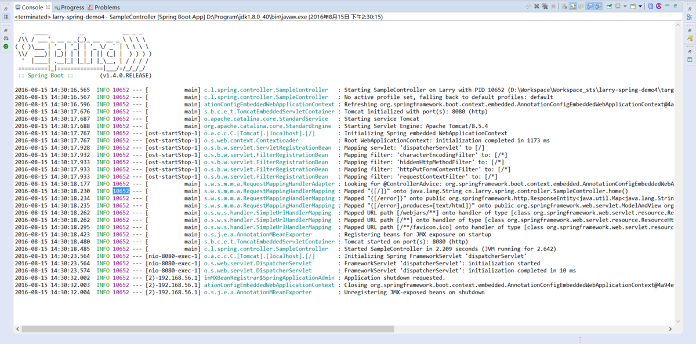
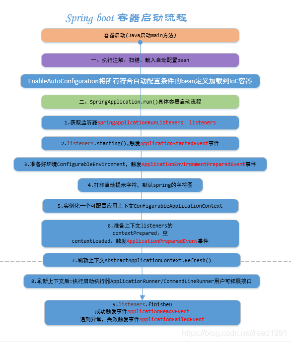

# SpringBoot原理(核心原理、启动流程、执行流程)

SpringBoot是一个快速开发框架，快速的将一些常用的**第三方依赖整合（原理：通过Maven子父工程的方式）**，简化XML配置，全部采用**注解**形式，**内置Http服务器（Jetty和Tomcat）**，最终以java应用程序进行执行，它是为了**简化Spring应用的创建、运行、调试、部署**等而出现的，使用它可以做到专注于Spring应用的开发，而**无需过多关注XML的配置**。

## 核心原理

### 1. SpringBoot核心通过Maven继承依赖关系快速整合第三方框架

```xml
<parent>
    <groupId>org.springframework.boot</groupId>
    <artifactId>spring-boot-starter-parent</artifactId>
    <version>2.0.0.RELEASE</version>    
</parent>
<dependencies>
    <!-- SpringBoot 整合SpringMVC -->
    <!-- 我们依赖spring-boot-starter-web能够帮我整合Spring环境 原理通过Maven子父工程 -->
    <dependency>
        <groupId>org.springframework.boot</groupId>
        <artifactId>spring-boot-starter-web</artifactId>
    </dependency>
</dependencies>
```

springboot 通过引用spring-boot-starter-web依赖，整合SpingMVC框架。当你添加了相应的starter模块，就相当于添加了相应的所有必须的依赖包，包括[spring-boot-starter](https://links.jianshu.com/go?to=http%3A%2F%2Fwww.51gjie.com%2Fjavaweb%2F1048.html)（这是Spring Boot的核心启动器，包含了自动配置、日志和YAML）；spring-boot-starter-test（支持常规的测试依赖，包括JUnit、Hamcrest、Mockito以及spring-test模块）；spring-boot-starter-web （支持全栈式Web开发，包括Tomcat和spring-webmvc）等相关依赖。

### 2. 基于SpringMVC无配置文件（纯Java）完全注解化实现SpringBoot框架，Main函数启动。

```java
@SpringBootApplication 
public class Application {
    //方式一
    public static void main(String[] args) {
        SpringApplication.run(Application.class, args);
    }
    //方式二
    public static void main(String[] args) {
        SpringApplication app = new SpringApplication(MySpringConfiguration.class);
        app.run(args);
    }
    //方式三
    public static void main(String[] args) {
        new SpringApplicationBuilder()
            .sources(Parent.class)
            .child(Application.class)
            .run(args);
    }
}
```

springboot有三种方式启动，都会在没有web.xml配置文件的情况，通过java代码操作整个SpringMVC的初始化过程，java代码最终会生成class文件,内置Tomcat就会加载这些class文件，当所有程序加载完成后，项目就可以访问了。

## 启动流程

springboot中只需要有[@SpringBootApplication]()这个注解，有了它马上就能够让整个应用跑起来。实际上它只是一个**组合注解**，[@Configuration配置类]()，[@ComponentScan类，包扫描]()，[@EnableAutoConfiguration根据需求自动加载相关的bean]()这三个注解。

启动流程如下：

> 1. 初始化监听器，以及添加到SpringApplication的自定义监听器。

> 2. 发布ApplicationStartedEvent事件，如果想监听ApplicationStartedEvent事件，你可以这样定义：public class ApplicationStartedListener implements ApplicationListener，然后通过SpringApplication.addListener(..)添加进去即可。

> 3. 装配参数和环境，确定是web环境还是非web环境。

> 4. 装配完环境后，就触发ApplicationEnvironmentPreparedEvent事件。

> 5. 如果SpringApplication的showBanner属性被设置为true，则打印启动的Banner。

> 6. 创建ApplicationContext，会根据是否是web环境，来决定创建什么类型的ApplicationContext。

> 7. 装配Context的环境变量，注册Initializers、beanNameGenerator等。

> 8. 发布ApplicationPreparedEvent事件。

> 9. 注册springApplicationArguments、springBootBanner，加载资源等

> 10. 遍历调用所有SpringApplicationRunListener的contextLoaded()方法。

> 11. 调用ApplicationContext的refresh()方法,装配context beanfactory等非常重要的核心组件。

> 12. 查找当前ApplicationContext中是否注册有CommandLineRunner，如果有，则遍历执行它们。

> 13. 发布ApplicationReadyEvent事件，启动完毕，表示服务已经可以开始正常提供服务了。通常我们这里会监听这个事件来打印一些监控性质的日志，表示应用正常启动了。

SpringApplication是springboot的入口

SpringApplication是springboot驱动spring应用上下文的引导类，他的run()方法启动Spring应用，实质上是为Spring应用创建并初始化Spring上下文。

## 执行流程



1. 初始化监听器，以及添加到SpringApplication的自定义监听器。

2. 发布ApplicationStartedEvent事件，如果想监听ApplicationStartedEvent事件，你可以这样定义：public class ApplicationStartedListener implements ApplicationListener，然后通过SpringApplication.addListener(..)添加进去即可。

3. 装配参数和环境，确定是web环境还是非web环境。

4. 装配完环境后，就触发ApplicationEnvironmentPreparedEvent事件。

5. 如果SpringApplication的showBanner属性被设置为true，则打印启动的Banner。

6. 创建ApplicationContext，会根据是否是web环境，来决定创建什么类型的ApplicationContext

7. 装配Context的环境变量，注册Initializers、beanNameGenerator等。

8. 发布ApplicationPreparedEvent事件。

9. 注册springApplicationArguments、springBootBanner，加载资源等

10. 遍历调用所有SpringApplicationRunListener的contextLoaded()方法。

11. 调用ApplicationContext的refresh()方法,装配context beanfactory等非常重要的核心组件。

12. 查找当前ApplicationContext中是否注册有CommandLineRunner，如果有，则遍历执行它们。

13. 发布ApplicationReadyEvent事件，启动完毕，表示服务已经可以开始正常提供服务了。通常我们这里会监听这个事件来打印一些监控性质的日志，表示应用正常启动了。

SpringBoot会触发其他的一些事件，这些事件按下列顺序触发：

（1）ApplicationStartingEvent：项目刚启动时触发，此时除了注册监听器和初始器之外，其他所有处理都没有开始；

（2）ApplicationEnvironmentPreparedEvent：上下文得到环境信息之后触发，此时上下文创建还没有创建；

（3）ApplicationPreparedEvent：bean的定义信息加载完成之后触发，此时bean还没有初始化；

（4）ApplicationReadyEvent：在所有bean初始化完毕，所有回调处理完成，系统准备处理服务请求时触发；

（5）ApplicationFailedEvent：启动过程出现异常时候触发。

## SpringApplication.run()

如果我们使用的是SpringApplication的静态run方法，那么，这个方法里面首先要创建一个SpringApplication对象实例，然后调用这个创建好的SpringApplication的实例方法。在SpringApplication实例初始化的时候，它会提前做几件事情：

1. 根据classpath里面是否存在某个特征类（org.springframework.web.context.ConfigurableWebApplicationContext）来决定是否应该创建一个为Web应用使用的ApplicationContext类型。

2. 使用SpringFactoriesLoader在应用的classpath中查找并加载所有可用的ApplicationContextInitializer。

3. 使用SpringFactoriesLoader在应用的classpath中查找并加载所有可用的ApplicationListener。

4. 推断并设置main方法的定义类。

它会执行以下步骤：

1. 创建一个合适的ApplicationContext实例 （取决于classpath）。

2. 注册一个CommandLinePropertySource，以便将命令行参数作为Spring properties。

3. 刷新application context，加载所有单例beans。

4. 激活所有CommandLineRunner beans。

## Run启动方式

```java
@SpringBootApplication 
public class Application {
    //方式一
    public static void main(String[] args) {
        SpringApplication.run(Application.class, args);
    }
    //方式二
    public static void main(String[] args) {
        SpringApplication app = new SpringApplication(MySpringConfiguration.class);
        app.run(args);
    }
    //方式三
    public static void main(String[] args) {
        new SpringApplicationBuilder()
            .sources(Parent.class)
            .child(Application.class)
            .run(args);
    }
}
```

1. SpringApplication.run()的底层其实就是new了一个SpringApplication的对象，并执行run()方法。

2. 有时我们需要创建多层次的ApplicationContext （例如，父子关系的Spring的ApplicationContext 和SpringMVC），这时我们可以使用SpringApplicationBuilder讲多个方法调用串起来，通过parent() 和 child()来创建多层次的ApplicationContext。

## 启动信息



启动信息如下：

第 9 行，启动SampleController。

第10行，查找active profile，无，设为default。

第11行，刷新上下文。

第12行，初始化tomcat，设置端口8080，设置访问方式为http。

第13行，启动tomcat服务。

第14行，启动Servlet引擎。

第15行，Spring内嵌的WebApplicationContext 初始化开始。

第16行，Spring内嵌的WebApplicationContext 初始化完成。

第17行，映射servlet，将 dispatcherServlet 映射到 [/] 。

第18行，映射filter，将 characterEncodingFilter 映射到 [/*] 。

第19行，映射filter，将 hiddenHttpMethodFilter 映射到 [/*] 。

第20行，映射filter，将 httpPutFormContentFilter 映射到 [/*] 。

第21行，映射filter，将 requestContextFilter 映射到 [/*] 。

第22行，查找 @ControllerAdvice。

第23行，映射路径 "{[/]}" 到 cn.larry.spring.controller.SampleController.home()。

第24行，映射路径 "{[/error]}" 到 org.springframework.boot.autoconfigure.web.BasicErrorController.error(javax.servlet.http.HttpServletRequest)。

第25行，映射路径 "{[/error],produces=[text/html]}" 到 org.springframework.web.servlet.ModelAndView org.springframework.boot.autoconfigure.web.BasicErrorController.errorHtml(javax.servlet.http.HttpServletRequest,javax.servlet.http.HttpServletResponse)。

第30行，tomcat启动完毕。

第31行，SampleController启动耗费的时间。

第32行，初始化 dispatcherServlet 。

第33行，dispatcherServlet 的初始化已启动。

第34行，dispatcherServlet 的初始化已完成。

第35行，收到shutdown关闭请求。

第36行，关闭AnnotationConfigEmbeddedWebApplicationContext。

SpringBootApplication的启动过程非常复杂，只需要在main方法里调用SpringApplicatio.run（）方法即可启动Spring Boot应用。

