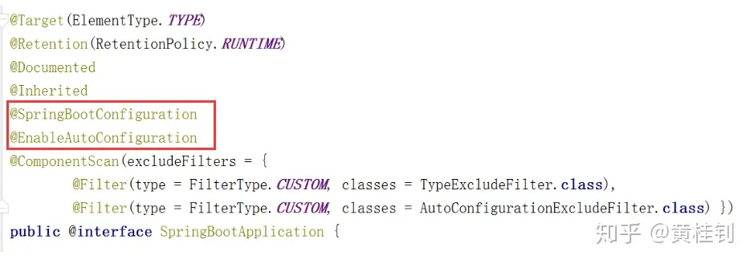

# SpringBoot工作原理简谈

**1，为什么依赖的依赖变少了？SpringBoot是如何管理这些依赖的？**

我们分两个点来看起

**1.1 从pom文件出发**

首先，是有一个父工程的引用

我们继续往里面跟踪，发现父工程又依赖于另一个父工程

继续跟踪，发现这是一个pom工程，统一控制版本

定义了一堆第三方jar包的版本

**结论：**

所有我们使用了SpringBoot之后，由于父工程有对版本的统一控制，所以大部分第三方包，我们无需关注版本，个别没有纳入SpringBoot管理的，才需要设置版本号

**1.2 SpringBoot将所有的常见开发功能，分成了一个个场景启动器（starter），这样我们需要开发什么功能，就导入什么场景启动器依赖即可。**

比如，我们现在要开发web项目，所以我们导入了spring-boot-starter-web

我们来跟踪看看，内部也复用一些starter

还有Springweb和SpringMVC，这也就是为什么，我们就可以开发SpringWeb程序的原因

**结论：**

- 大家会发现，SpringBoot是通过定义各种各样的Starter来管理这些依赖的
- 比如，我们需要开发web的功能，那么引入spring-boot-starter-web
- 比如，我们需要开发模板页的功能，那么引入spring-boot-starter-thymeleaf
- 我们需要整合redis，那么引入spring-boot-starter-data-redis
- 我们需要整合amqp，实现异步消息通信机制，那么引入spring-boot-starter-amqp
- 等等，就是这么方便

**2，为什么我们不需要配置？**

我们来看看SpringBoot的启动类代码，除了一个关键的注解，其他都是普通的类和main方法定义

那么，我们来观察下这个注解背后的东西，发现，这个注解是一个复合注解，包含了很多的信息

其他注解都是一个注解的常规配置，所以关键看圈中的这两个

**我们来分析第一个关键注解：@SpringBootConfiguration**

我们可以看到，内部是包含了@Configuration，这是Spring定义配置类的注解

而@Configuration实际上就是一个@Component，表示一个受Spring管理的组件

**结论：@SpringBootConfiguration这个注解只是更好区分这是SpringBoot的配置注解，本质还是用了Spring提供的@Configuration注解**

**我们再来探讨下一个注解：@EnableAutoConfiguration**

这个注解的作用是告诉SpringBoot开启自动配置功能，这样就减少了我们的配置

那么具体是怎么实现自动配置的？

我们先来观察这个注解背后的内容

所以，又到了分析圈中的两个注解了

**先来分析@AutoConfigurationPackage**

观察其内部实现，内部是采用了@Import，来给容器导入一个Registrar组件

所以，我们继续往下跟踪，来看Registrar内部是什么情况？

我们可以跟踪源码看看这段是什么信息

**结论：**

通过源码跟踪，我们知道，程序运行到这里，会去加载启动类所在包下面的所有类

这就是为什么，默认情况下，我们要求定义的类，比如controller，service必须在启动类的同级目录或子级目录的原因

**再来分析@Import(AutoConfigurationImportSelector.class)**

这个的关键是来看AutoConfigurationImportSelector.class内部的细节

在这个类的内部，有一个关键的方法，我们可以调试来看看结果

发现默认加载了好多的自动配置类，这些自动配置类，会自动给我们加载每个场景所需的所有组件，并配置好这些组件，这样就省去了很多的配置

