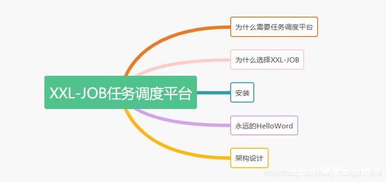
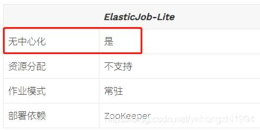
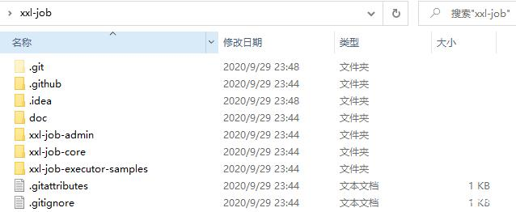
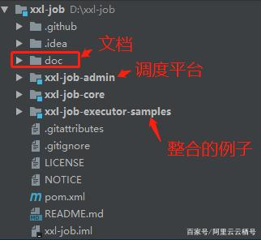
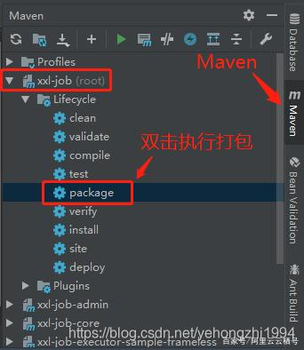
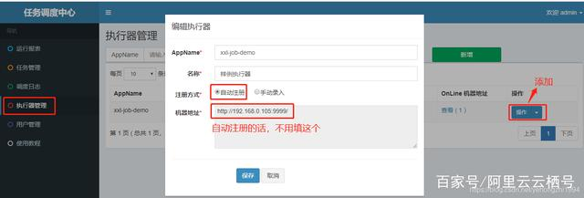
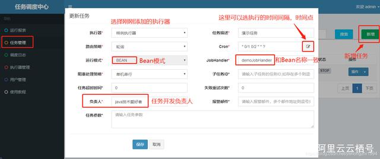
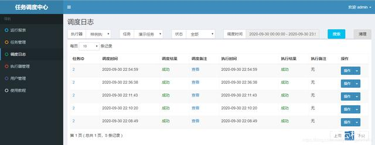
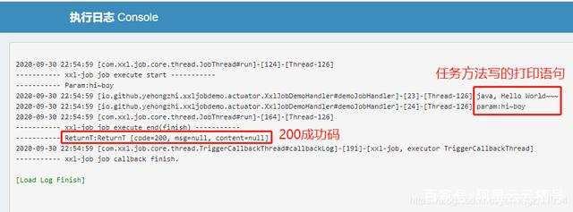

# xxl-job简介

# 思维导图



# 一、概述

在平时的业务场景中，经常有一些场景需要使用定时任务，比如：

- 时间驱动的场景：某个时间点发送优惠券，发送短信等等。
- 批量处理数据：批量统计上个月的账单，统计上个月销售数据等等。
- 固定频率的场景：每隔5分钟需要执行一次。

所以定时任务在平时开发中并不少见，而且对于现在快速消费的时代，每天都需要发送各种推送，消息都需要依赖定时任务去完成，应用非常广泛。

# 二、为什么需要任务调度平台

在Java中，传统的定时任务实现方案，比如Timer，Quartz等都或多或少存在一些问题：

- 不支持集群、不支持统计、没有管理平台、没有失败报警、没有监控等等

而且在现在分布式的架构中，有一些场景需要分布式任务调度：

- 同一个服务多个实例的任务存在互斥时，需要统一的调度。
- 任务调度需要支持高可用、监控、故障告警。
- 需要统一管理和追踪各个服务节点任务调度的结果，需要记录保存任务属性信息等。

显然传统的定时任务已经不满足现在的分布式架构，所以需要一个分布式任务调度平台，目前比较主流的是elasticjob和xxl-job。

elasticjob由当当网开源，目前github有6.5k的Star，使用的公司在官网登记有76家。


跟xxl-job不同的是，**elasticjob是采用zookeeper实现分布式协调**，实现任务高可用以及分片。


# 三、为什么选择XXL-JOB

实际上更多公司选择xxl-job，目前**xxl-job的github上有15.7k个star，登记公司有348个**。毫无疑问elasticjob和xxl-job都是非常优秀的技术框架，接下来我们进一步对比讨论，探索一下为什么更多公司会选择xxl-job。

首先先介绍一下xxl-job，这是出自大众点评许雪里(xxl就是作者名字的拼音首字母)的开源项目，官网上介绍这是一个轻量级分布式任务调度框架，其核心设计目标是开发迅速、学习简单、轻量级、易扩展。跟elasticjob不同，xxl-job环境依赖于mysql，不用ZooKeeper，这也是最大的不同。

elasticjob的初衷是为了面对高并发复杂的业务，即使是在业务量大，服务器多的时候也能做好任务调度，尽可能的利用服务器的资源。使用ZooKeeper使其具有高可用、一致性的，而且还具有良好的扩展性。官网上写**elasticjob是无中心化的，通过ZooKeeper的选举机制选举出主服务器，如果主服务器挂了，会重新选举新的主服务器。因此elasticjob具有良好的扩展性和可用性，但是使用和运维有一定的复杂。**



xxl-job则相反，是通过一个中心式的调度平台，调度多个执行器执行任务，调度中心通过DB锁保证集群分布式调度的一致性，这样扩展执行器会增大DB的压力，但是如果实际上这里数据库只是负责任务的调度执行。但是如果没有大量的执行器的话和任务的情况，是不会造成数据库压力的。实际上大部分公司任务数，执行器并不多(虽然面试经常会问一些高并发的问题)。

相对来说，xxl-job中心式的调度平台**轻量级，开箱即用，操作简易，上手快，与SpringBoot有非常好的集成**，而且监控界面就集成在调度中心，界面又简洁，对于**企业维护起来成本不高，还有失败的邮件告警**等等。这就使很多企业选择xxl-job做调度平台。

# 四、安装

## 4.1 拉取源码

搭建xxl-job很简单，有docker拉取镜像部署和源码编译两种方式，docker部署的方式比较简单，我就讲源码编译的方式。首先到github拉取xxl-job源码到本地。


## 4.2 导入IDEA

拉取源码下来后，可以看到项目结构，如下：



导入到IDEA，配置一下Maven，下载相关的jar包，稍等一下后，就可以看到这样的项目：



## 4.3 初始化数据库

前面讲过xxl-job需要依赖mysql，所以需要初始化数据库，在xxl-job\doc\db路径下找到tables_xxl_job.sql文件。在mysql上运行sql文件。


## 4.4 配置文件

接着就改一下配置文件，在admin项目下找到application.properties文件。

```properties
### 调度中心JDBC链接
spring.datasource.url=jdbc:mysql://127.0.0.1:3306/xxl_job?useUnicode=true&characterEncoding=UTF-8&autoReconnect=true&serverTimezone=Asia/Shanghai
spring.datasource.username=root
spring.datasource.password=
spring.datasource.driver-class-name=com.mysql.jdbc.Driver
### 报警邮箱
spring.mail.host=smtp.qq.com
spring.mail.port=25
spring.mail.username=xxx@qq.com
spring.mail.password=xxx
spring.mail.properties.mail.smtp.auth=true
spring.mail.properties.mail.smtp.starttls.enable=true
spring.mail.properties.mail.smtp.starttls.required=true
spring.mail.properties.mail.smtp.socketFactory.class=javax.net.ssl.SSLSocketFactory
### 调度中心通讯TOKEN [选填]：非空时启用；
xxl.job.accessToken=
### 调度中心国际化配置 [必填]： 默认为 "zh_CN"/中文简体, 可选范围为 "zh_CN"/中文简体, "zh_TC"/中文繁体 and "en"/英文；
xxl.job.i18n=zh_CN
## 调度线程池最大线程配置【必填】
xxl.job.triggerpool.fast.max=200
xxl.job.triggerpool.slow.max=100
### 调度中心日志表数据保存天数 [必填]：过期日志自动清理；限制大于等于7时生效，否则, 如-1，关闭自动清理功能；
xxl.job.logretentiondays=10
```

# 4.5 编译运行

简单一点直接跑admin项目的main方法启动也行。


如果部署在服务器呢，那我们需要打包成jar包，在IDEA利用Maven插件打包。



然后在xxl-job\xxl-job-admin\target路径下，找到jar包。


然后就得到jar包了，使用java -jar命令就可以启动了。


到这里就已经完成了！打开浏览器，输入

http://localhost:8080/xxl-job-admin

进入管理页面。

默认账号/密码：admin/123456。


# 永远的HelloWord

部署了调度中心之后，需要往调度中心注册执行器，添加调度任务。接下来就参考xxl-job写一个简单的例子。

首先创建一个SpringBoot项目，名字叫"xxljob-demo"，添加依赖。

```xml
<dependencies>
    <dependency>
        <groupId>org.springframework.boot</groupId>
        <artifactId>spring-boot-starter-web</artifactId>
    </dependency>
    <dependency>
        <groupId>org.springframework.boot</groupId>
        <artifactId>spring-boot-starter</artifactId>
    </dependency>
    <dependency><!-- 官网的demo是2.2.1，中央maven仓库还没有，所以就用2.2.0 -->
        <groupId>com.xuxueli</groupId>
        <artifactId>xxl-job-core</artifactId>
        <version>2.2.0</version>
    </dependency>
</dependencies>
```

接着修改application.properties。

```properties
# web port
server.port=8081
# log config
logging.config=classpath:logback.xml
spring.application.name=xxljob-demo
### 调度中心部署跟地址 [选填]：如调度中心集群部署存在多个地址则用逗号分隔。执行器将会使用该地址进行"执行器心跳注册"和"任务结果回调"；为空则关闭自动注册；
xxl.job.admin.addresses=http://127.0.0.1:8080/xxl-job-admin
### 执行器通讯TOKEN [选填]：非空时启用；
xxl.job.accessToken=
### 执行器AppName [选填]：执行器心跳注册分组依据；为空则关闭自动注册
xxl.job.executor.appname=xxl-job-demo
### 执行器注册 [选填]：优先使用该配置作为注册地址，为空时使用内嵌服务 ”IP:PORT“ 作为注册地址。从而更灵活的支持容器类型执行器动态IP和动态映射端口问题。
xxl.job.executor.address=
### 执行器IP [选填]：默认为空表示自动获取IP，多网卡时可手动设置指定IP，该IP不会绑定Host仅作为通讯实用；地址信息用于 "执行器注册" 和 "调度中心请求并触发任务"；
xxl.job.executor.ip=
### 执行器端口号 [选填]：小于等于0则自动获取；默认端口为9999，单机部署多个执行器时，注意要配置不同执行器端口；
xxl.job.executor.port=9999
### 执行器运行日志文件存储磁盘路径 [选填] ：需要对该路径拥有读写权限；为空则使用默认路径；
xxl.job.executor.logpath=/data/applogs/xxl-job/jobhandler
### 执行器日志文件保存天数 [选填] ： 过期日志自动清理, 限制值大于等于3时生效; 否则, 如-1, 关闭自动清理功能；
xxl.job.executor.logretentiondays=10
```

接着写一个配置类XxlJobConfig。

```java
@Configuration
public class XxlJobConfig {
    private Logger logger = LoggerFactory.getLogger(XxlJobConfig.class);
    @Value("${xxl.job.admin.addresses}")
    private String adminAddresses;
    @Value("${xxl.job.accessToken}")
    private String accessToken;
    @Value("${xxl.job.executor.appname}")
    private String appname;
    @Value("${xxl.job.executor.address}")
    private String address;
    @Value("${xxl.job.executor.ip}")
    private String ip;
    @Value("${xxl.job.executor.port}")
    private int port;
    @Value("${xxl.job.executor.logpath}")
    private String logPath;
    @Value("${xxl.job.executor.logretentiondays}")
    private int logRetentionDays;

    @Bean
    public XxlJobSpringExecutor xxlJobExecutor() {
        logger.info(">>>>>>>>>>> xxl-job config init.");
        XxlJobSpringExecutor xxlJobSpringExecutor = new XxlJobSpringExecutor();
        xxlJobSpringExecutor.setAdminAddresses(adminAddresses);
        xxlJobSpringExecutor.setAppname(appname);
        xxlJobSpringExecutor.setAddress(address);
        xxlJobSpringExecutor.setIp(ip);
        xxlJobSpringExecutor.setPort(port);
        xxlJobSpringExecutor.setAccessToken(accessToken);
        xxlJobSpringExecutor.setLogPath(logPath);
        xxlJobSpringExecutor.setLogRetentionDays(logRetentionDays);
        return xxlJobSpringExecutor;
    }
}
```

接着编写一个任务类XxlJobDemoHandler，使用Bean模式。

```java
@Component
public class XxlJobDemoHandler {
    /**
     * Bean模式，一个方法为一个任务
     * 1、在Spring Bean实例中，开发Job方法，方式格式要求为 "public ReturnT<String> execute(String param)"
     * 2、为Job方法添加注解 "@XxlJob(value="自定义jobhandler名称", init = "JobHandler初始化方法", destroy = "JobHandler销毁方法")"，注解value值对应的是调度中心新建任务的JobHandler属性的值。
     * 3、执行日志：需要通过 "XxlJobLogger.log" 打印执行日志；
     */
    @XxlJob("demoJobHandler")
    public ReturnT<String> demoJobHandler(String param) throws Exception {
        XxlJobLogger.log("java, Hello World~~~");
        XxlJobLogger.log("param:" + param);
        return ReturnT.SUCCESS;
    }
}
```

在resources目录下，添加logback.xml文件。

```xml
<?xml version="1.0" encoding="UTF-8"?>
<configuration debug="false" scan="true" scanPeriod="1 seconds">
    <contextName>logback</contextName>
    <property name="log.path" value="/data/applogs/xxl-job/xxl-job-executor-sample-springboot.log"/>
    <appender name="console" class="ch.qos.logback.core.ConsoleAppender">
        <encoder>
            <pattern>%d{HH:mm:ss.SSS} %contextName [%thread] %-5level %logger{36} - %msg%n</pattern>
        </encoder>
    </appender>
    <appender name="file" class="ch.qos.logback.core.rolling.RollingFileAppender">
        <file>${log.path}</file>
        <rollingPolicy class="ch.qos.logback.core.rolling.TimeBasedRollingPolicy">
            <fileNamePattern>${log.path}.%d{yyyy-MM-dd}.zip</fileNamePattern>
        </rollingPolicy>
        <encoder>
            <pattern>%date %level [%thread] %logger{36} [%file : %line] %msg%n
            </pattern>
        </encoder>
    </appender>
    <root level="info">
        <appender-ref ref="console"/>
        <appender-ref ref="file"/>
    </root>
</configuration>
```

写完之后启动服务，然后可以打开管理界面，找到执行器管理，添加执行器。



接着到任务管理，添加任务。




最后我们可以到任务管理去测试一下，运行demoJobHandler。


点击保存后，会立即执行。点击查看日志，可以看到任务执行的历史日志记录。



打开刚刚执行的执行日志，我们可以看到，运行成功。



这就是简单的Demo演示，非常简单，上手也快。

# 第二个HelloWord

<span style="color:#fe2c24;">官方文档</span>

[ 分布式任务调度平台XXL-JOB](<https://www.xuxueli.com/xxl-job/> "  分布式任务调度平台XXL-JOB")

-  ### Step1: pom.xml 引入依赖

```xml
<dependency>
  <groupId>com.xuxueli</groupId>
  <artifactId>xxl-job-core</artifactId>
  <version>2.3.1</version>
</dependency>
```


- ### Step2: yaml添加配置 <span style="color:#fe2c24;">application.yml</span>

addresses: http://ip:port/xxl-job-admin           #xxljob调度中心部署 
appname: weather                                        	  #xxljob配置的执行器名称
port: 19900                                                     	  #xxljob配置的端口号，默认为9999

```yml
xxl:
  job:
    admin:
      addresses: http://ip:port/xxl-job-admin  #xxljob调度中心部署 例如：http://127.0.0.1:8080/xxl-job-admin
    executor:
      address:
      appname: weather #xxljob配置的执行器名称，
      ip:             #执行器IP，默认为空表示自动获取IP
      port: 19900 #xxljob配置的端口号，默认为9999
      logpath: /data/xxl-job/jobhandler  #执行器运行日志文件存储磁盘路径
      logretentiondays: -1  #调度中心日志表数据保存天数，过期日志自动清理；限制大于等于7时生效，否则, 如-1，关闭自动清理功能
    accessToken: default_token #调度中心通讯TOKEN [选填]：非空时启用
```


- ### Step3: 引入配置类 <span style="color:#fe2c24;">XxlJobConfig.java</span>

```java
import com.xxl.job.core.executor.impl.XxlJobSpringExecutor;
import org.slf4j.Logger;
import org.slf4j.LoggerFactory;
import org.springframework.beans.factory.annotation.Value;
import org.springframework.context.annotation.Bean;
import org.springframework.context.annotation.Configuration;
 
/**
 * xxl-job config
 *
 * @author xuxueli 2017-04-28
 */
@Configuration
public class XxlJobConfig {
    private Logger logger = LoggerFactory.getLogger(XxlJobConfig.class);
 
    @Value("${xxl.job.admin.addresses}")
    private String adminAddresses;
 
    @Value("${xxl.job.accessToken}")
    private String accessToken;
 
    @Value("${xxl.job.executor.appname}")
    private String appname;
 
    @Value("${xxl.job.executor.address}")
    private String address;
 
    @Value("${xxl.job.executor.ip}")
    private String ip;
 
    @Value("${xxl.job.executor.port}")
    private int port;
 
    @Value("${xxl.job.executor.logpath}")
    private String logPath;
 
    @Value("${xxl.job.executor.logretentiondays}")
    private int logRetentionDays;
 
 
    @Bean
    public XxlJobSpringExecutor xxlJobExecutor() {
        logger.info(">>>>>>>>>>> xxl-job config init.");
        XxlJobSpringExecutor xxlJobSpringExecutor = new XxlJobSpringExecutor();
        xxlJobSpringExecutor.setAdminAddresses(adminAddresses);
        xxlJobSpringExecutor.setAppname(appname);
        xxlJobSpringExecutor.setAddress(address);
        xxlJobSpringExecutor.setIp(ip);
        xxlJobSpringExecutor.setPort(port);
        xxlJobSpringExecutor.setAccessToken(accessToken);
        xxlJobSpringExecutor.setLogPath(logPath);
        xxlJobSpringExecutor.setLogRetentionDays(logRetentionDays);
        return xxlJobSpringExecutor;
    }
 
}
```


- ### Step4:方法上加注解即可 @XxlJob("weatherNow")

编写[定时任务](<https://so.csdn.net/so/search?q=%E5%AE%9A%E6%97%B6%E4%BB%BB%E5%8A%A1&spm=1001.2101.3001.7020>)服务类，如天气服务 WeatherJob.java

注意同项目中<span style="color:#fe2c24;">@XxlJob中的命名不能重复</span>

```java
@Component
@Slf4j
public class WeatherJob {
 
    /**
     * 1、定时更新当前天气(10min)
     */
    @XxlJob("weatherNow")
    public void weatherNow() throws Exception {
        log.info(">>>>>>>>>>>>>>>>>>>>>>>>XxlJob: get weatherNow .");
        List<WeatherChinaCity> cityList = weatherChinaCityService.getUpdateCity();
        for (WeatherChinaCity c : cityList) {
            weatherNowService.updateNow(c.getId());
        }
 
    }
 
}
```


- ### Step5:调度中心添加执行器

[http://ip:port/xxl-job-admin/toLogin](<http://47.104.191.212:18080/xxl-job-admin/toLogin> "http://ip:port/xxl-job-admin/toLogin")

执行器名称（Appname）：见Step2 appname: weather #xxljob配置的执行器名称，


- ### Step6:添加执行器的定时任务


# 谈谈架构设计

下面简单地说一下xxl-job的架构，我们先看官网提供的一张架构图来分析。


从架构图可以看出，分别有调度中心和执行器两大组成部分

- 调度中心。负责**管理调度信息**，按照调度配置发出调度请求，自身不承担业务代码。支持可视化界面，可以在调度中心对任务进行新增，更新，删除，会实时生效。支持监控调度结果，查看执行日志，查看调度任务统计报表，任务失败告警等等。
- 执行器。负责接收调度请求，执行调度任务的业务逻辑。执行器启动后需要注册到调度中心。接收调度中心的发出的执行请求，终止请求，日志请求等等。

接下来我们看一下xxl-job的工作原理。


- 任务执行器根据配置的调度中心的地址，自动注册到调度中心。

- 达到任务触发条件，调度中心下发任务。

- 执行器基于线程池执行任务，并把执行结果放入内存队列中、把执行日志写入日志文件中。

- 执行器的回调线程消费内存队列中的执行结果，主动上报给调度中心。

- 当用户在调度中心查看任务日志，调度中心请求任务执行器，任务执行器读取任务日志文件并返回日志详情。
