# Kafka

## Kafka中的术语解释


**Producer**：Producer即生产者，消息的产生者，是消息的入口。
　　**kafka cluster**：
　　　　**Broker**：Broker是kafka实例，每个服务器上有一个或多个kafka的实例，我们姑且认为每个broker对应一台服务器。每个kafka集群内的broker都有一个**不重复**的编号，如图中的broker-0、broker-1等……
　　　　**Topic**：消息的主题，可以理解为消息的分类，kafka的数据就保存在topic。在每个broker上都可以创建多个topic。
　　　　**Partition**：Topic的分区，每个topic可以有多个分区，分区的作用是做负载，提高kafka的吞吐量。同一个topic在不同的分区的数据是不重复的，partition的表现形式就是一个一个的文件夹！
　　　　**Replication**:每一个分区都有多个副本，副本的作用是做备胎。当主分区（Leader）故障的时候会选择一个备胎（Follower）上位，成为Leader。在kafka中默认副本的最大数量是10个，且副本的数量不能大于Broker的数量，follower和leader绝对是在不同的机器，同一机器对同一个分区也只可能存放一个副本（包括自己）。
　　　　**Message**：每一条发送的消息主体。
　　**Consumer**：消费者，即消息的消费方，是消息的出口。
　　**Consumer Group**：我们可以将多个消费组组成一个消费者组，在kafka的设计中同一个分区的数据只能被消费者组中的某一个消费者消费。同一个消费者组的消费者可以消费同一个topic的不同分区的数据，这也是为了提高kafka的吞吐量！
　　**Zookeeper**：kafka集群依赖zookeeper来保存集群的的元信息，来保证系统的可用性。

### broker

Broker是kafka实例，每个服务器上有一个或多个kafka的实例，我们姑且认为每个broker对应一台服务器。每个kafka集群内的broker都有一个**不重复**的编号，如图中的broker-0、broker-1等。
broker存储topic的数据。如果某topic有N个partition，集群有N个broker，那么每个broker存储该topic的一个partition。
如果某topic有N个partition，集群有(N+M)个broker，那么其中有N个broker存储该topic的一个partition，剩下的M个broker不存储该topic的partition数据。
如果某topic有N个partition，集群中broker数目少于N个，那么一个broker存储该topic的一个或多个partition。在实际生产环境中，尽量避免这种情况的发生，这种情况容易导致Kafka集群数据不均衡。


### Topic
每条发布到Kafka集群的消息都有一个类别，这个类别被称为Topic。（物理上不同Topic的消息分开存储，逻辑上一个Topic的消息虽然保存于一个或多个broker上但用户只需指定消息的Topic即可生产或消费数据而不必关心数据存于何处）
类似于数据库的表名


### Partition
topic中的数据分割为一个或多个partition。每个topic至少有一个partition。每个partition中的数据使用多个segment文件存储。partition中的数据是有序的，不同partition间的数据丢失了数据的顺序。如果topic有多个partition，消费数据时就不能保证数据的顺序。在需要严格保证消息的消费顺序的场景下，需要将partition数目设为1。


### Producer
生产者即数据的发布者，该角色将消息发布到Kafka的topic中。broker接收到生产者发送的消息后，broker将该消息**追加**到当前用于追加数据的segment文件中。生产者发送的消息，存储到一个partition中，生产者也可以指定数据存储的partition。


### Consumer
消费者可以从broker中读取数据。消费者可以消费多个topic中的数据。


### Consumer Group
每个Consumer属于一个特定的Consumer Group（可为每个Consumer指定group name，若不指定group name则属于默认的group）。


### Replica副本机制

副本，为保证集群中的某个节点发生故障时，**该节点上的partition数据不丢失，且kafka仍然能够继续工作**，kafka提供了副本机制，一个topic的每个分区都有若干个副本，一个**leader**和若干个**follower**。

日志的分区partition （分布）在Kafka集群的服务器上。每个服务器在处理数据和请求时，共享这些分区。每一个分区都会在已配置的服务器上进行备份，确保容错性。

每个分区都有一台 server 作为 “leader”，零台或者多台server作为 follwers 。leader server 处理一切对 partition （分区）的读写请求，而follwers只需被动的同步leader上的数据。当leader宕机了，followers 中的一台服务器会自动成为新的 leader。通过这种机制，既可以保证数据有多个副本，也实现了一个高可用的机制！

同一个partition可能会有多个replication（对应 server.properties 配置中的 default.replication.factor=N）。没有replication的情况下，一旦broker 宕机，其上所有 partition 的数据都不可被消费，同时producer也不能再将数据存于其上的patition。引入replication之后，同一个partition可能会有多个replication，而这时需要在这些replication之间选出一个leader，producer和consumer只与这个leader交互，其它replication作为follower从leader 中复制数据。

基于安全考虑，每个分区的Leader和follower一般会错在在不同的broker!

**leader**

每个分区多个副本的“主”，生产者发送数据的对象，以及消费者消费数据的对象都是leader。

**follower**

每个分区多个副本中的“从”，实时从leader中同步数据，保持和leader数据的同步。leader发生故障时，某个follower会成为新的follower。

### Offset

kafka的存储文件都是按照**offset.kafka**来命名，用offset做名字的好处是方便查找。例如你想找位于2049的位置，只要找到2048.kafka的文件即可。当然the first offset就是00000000000.kafka

数据会按照时间顺序被不断第追加到分区的一个结构化的commit log中！每个分区中存储的记录都是有序的，且顺序不可变！

这个顺序是通过一个称之为offset的id来唯一标识！因此也可以认为offset是有序且不可变的！

在**每一个消费者端，会唯一保存的元数据是offset（偏移量）**,即消费在log中的位置，偏移量由消费者所控制。通常在读取记录后，消费者会以线性的方式增加偏移量，但是实际上，由于这个位置由消费者控制，所以消费者可以采用任何顺序来消费记录。例如，一个消费者可以重置到一个旧的偏移量，从而重新处理过去的数据；也可以跳过最近的记录，从"现在"开始消费。

这些细节说明Kafka 消费者是非常廉价的—消费者的增加和减少，对集群或者其他消费者没有多大的影响。比如，你可以使用命令行工具，对一些topic内容执行 tail操作，并不会影响已存在的消费者消费数据。

### zookeeper

元数据信息存在zookeeper中，包括：broker，topic，partition的元数据消息(存储消费偏移量，topic话题信息，partition信息)。kafka0.8之前还可以存储消费者offset

Kafka集群中有一个broker会被选举为Controller，负责**管理集群broker的上下线**，所有topic的**分区副本分配**和**leader选举**等工作。

Controller的管理工作都是依赖于Zookeeper的。

## 工作流程分析

上面介绍了kafka的基础架构及基本概念，不知道大家看完有没有对kafka有个大致印象，如果对还比较懵也没关系！我们接下来再结合上面的结构图分析kafka的工作流程，最后再回来整个梳理一遍我相信你会更有收获！

### 发送数据

​	**选择一个分区**

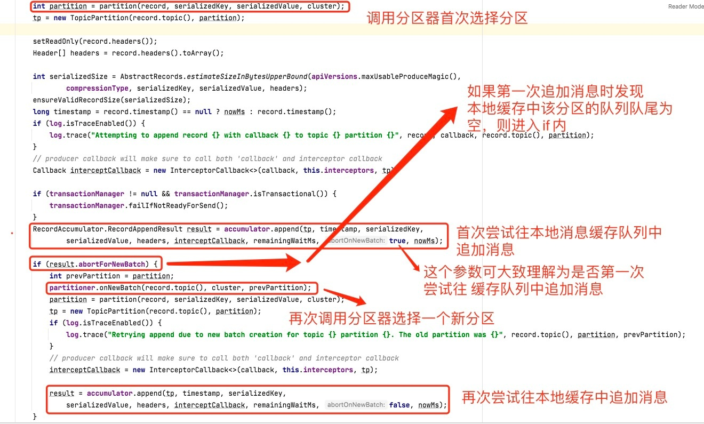

　　**找该分区的leader**，不会直接将数据写入follower！那leader怎么找呢？写入的流程又是什么样的呢？我们看下图：


发送的流程就在图中已经说明了，就不单独在文字列出来了！需要注意的一点是，消息写入leader后，follower是**主动**的去leader进行同步的！producer采用push模式将数据发布到broker，每条消息追加到分区中，顺序写入磁盘，所以保证**同一分区**内的数据是有序的！写入示意图如下：

　

（不要对此图产生误解，一条消息只会进到一个分区里，不会在多个分区中都有该消息的副本）

生产者写入消息到topic, kafka将依据不同的策略将数据分配到不同的分区中

1.轮询分区策略.

2.随机分区策略

3按key分区分配策略

4.自定义分区策略 

上面说到数据会写入到不同的分区，那kafka为什么要做分区呢？相信大家应该也能猜到，分区的主要目的是：
　　**1、 方便扩展**。因为一个topic可以有多个partition，所以我们可以通过扩展机器去轻松的应对日益增长的数据量。
　　**2、 提高并发**。以partition为读写单位，可以多个消费者同时消费数据，提高了消息的处理效率。

　　熟悉负载均衡的朋友应该知道，当我们向某个服务器发送请求的时候，服务端可能会对请求做一个负载，将流量分发到不同的服务器，那在kafka中，如果某个topic有多个partition，producer又怎么知道该将数据发往哪个partition呢？kafka中有几个原则：
　　1、 partition在写入的时候可以指定需要写入的partition，如果有指定，则写入对应的partition。
　　2、 如果没有指定partition，但是设置了数据的key，则会根据key的值hash出一个partition。
　　3、 如果既没指定partition，又没有设置key，则会轮询选出一个partition。

　　保证消息不丢失是一个消息队列中间件的基本保证，那producer在向kafka写入消息的时候，怎么保证消息不丢失呢？其实上面的写入流程图中有描述出来，那就是通过ACK应答机制！在生产者向队列写入数据的时候可以设置参数来确定是否确认kafka接收到数据，这个参数可设置的值为**0**、**1**、**all**。
　　0代表producer往集群发送数据不需要等到集群的返回，不确保消息发送成功。安全性最低但是效率最高。
　　1代表producer往集群发送数据只要leader应答就可以发送下一条，只确保leader发送成功。
　　all代表producer往集群发送数据需要所有的follower都完成从leader的同步才会发送下一条，确保leader发送成功和所有的副本都完成备份。安全性最高，但是效率最低。

　　最后要注意的是，如果往不存在的topic写数据，能不能写入成功呢？kafka会自动创建topic，分区和副本的数量根据默认配置都是1。

### 分区内部保存数据

　　Producer将数据写入kafka后，集群就需要对数据进行保存了！kafka将数据保存在磁盘，可能在我们的一般的认知里，写入磁盘是比较耗时的操作，不适合这种高并发的组件。Kafka初始会单独开辟一块磁盘空间，顺序写入数据（效率比随机写入高）。

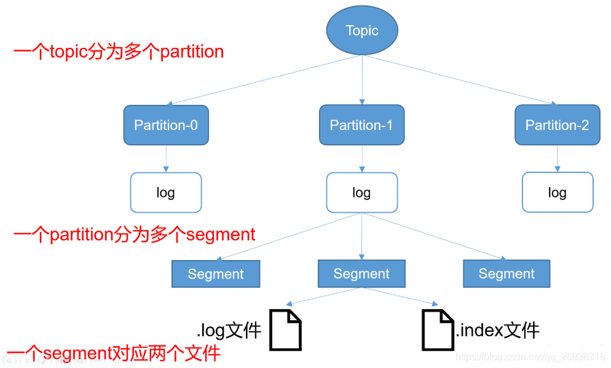

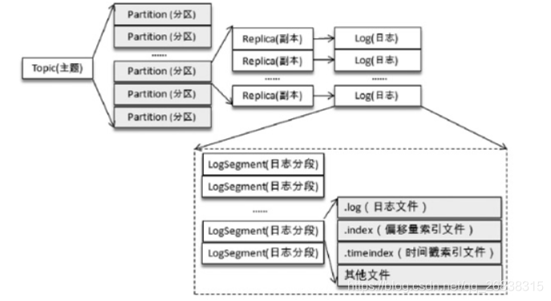

**Partition 结构**
　　前面说过了每个topic都可以分为一个或多个partition，如果你觉得topic比较抽象，那partition就是比较具体的东西了！Partition在服务器上的表现形式就是一个一个的文件夹，每个partition的文件夹下面会有多组segment文件，每组segment文件又包含.index文件、.log文件、.timeindex文件（早期版本中没有）三个文件， log文件就实际是存储message的地方，而index和timeindex文件为索引文件，用于检索消息。

Index负责映射每个offset到消息的在log文件中的具体位置，主要用来查找消息。

　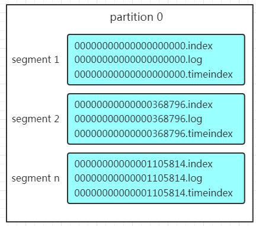

如上图，这个partition有三组segment文件，每个log文件的大小是一样的，但是存储的message数量是不一定相等的（每条的message大小不一致）。文件的命名是以该segment最小offset来命名的，如000.index存储offset为0~368795的消息，kafka就是利用分段+索引的方式来解决查找效率的问题。

**Message结构**
上面说到log文件就实际是存储message的地方，我们在producer往kafka写入的也是一条一条的message，那存储在log中的message是什么样子的呢？消息主要包含消息体、消息大小、offset、压缩类型……等等！

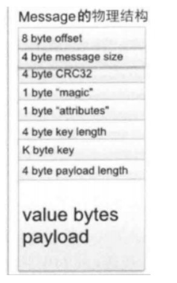

| 关键字              | 解释说明                                                     |
| ------------------- | ------------------------------------------------------------ |
| 8 byte offset       | 在parition(分区)内的每条消息都有一个有序的id号，这个id号被称为偏移(offset),它可以唯一确定每条消息在parition(分区)内的位置。即offset表示partiion的第多少message |
| 4 byte message size | message大小                                                  |
| 4 byte CRC32        | 用crc32校验message                                           |
| 1 byte “magic"      | 表示本次发布Kafka服务程序协议版本号                          |
| 1 byte “attributes" | 表示为独立版本、或标识压缩类型、或编码类型。                 |
| 4 byte key length   | 表示key的长度,当key为-1时，K byte key字段不填                |
| K byte key          | 可选                                                         |
| value bytes payload | 表示实际消息数据。                                           |

**存储策略**
　　无论消息是否被消费，kafka都会保存所有的消息。那对于旧数据有什么删除策略呢？
　　1、 基于时间，默认配置是168小时（7天）。
　　2、 基于大小，默认配置是1073741824。
　　需要注意的是，kafka读取特定消息的时间复杂度是O(1)，所以这里删除过期的文件并不会提高kafka的性能！

### 消费数据

　　消息存储在log文件后，消费者就可以进行消费了。与生产消息相同的是，消费者在拉取消息的时候也是**找leader**去拉取。

　　多个消费者可以组成一个消费者组（consumer group），每个消费者组都有一个组id！同一个消费组者的消费者可以消费同一topic下不同分区的数据，但是不会组内多个消费者消费同一分区的数据！！！是不是有点绕。我们看下图：


图示是消费者组内的消费者小于partition数量的情况，所以会出现某个消费者消费多个partition数据的情况，消费的速度也就不及只处理一个partition的消费者的处理速度！如果是消费者组的消费者多于partition的数量，多出来的消费者不消费任何partition的数据。所以在实际的应用中，建议**消费者组的consumer的数量与partition的数量一致**！

### 	根据offset获取消息

​	在保存数据的小节里面，我们聊到了partition划分为多组segment，每个segment又包含.log、.index、.timeindex文件，存放的每条message包含offset、消息大小、消息体……我们多次提到segment和offset，查找消息的时候是怎么利用segment+offset配合查找的呢？假如现在需要查找一个offset为368801的message是什么样的过程呢？我们先看看下面的图：


　　

1. 先**二分查找**获取对应index索引文件，获取到对应的物理offset
2. 拿着物理offset去log数据文件顺序查找对应消息
3. 返回查找到的消息

例如，读取offset=368776的Message，需要通过如下两个步骤。

- **第一步：查找Segment File.**

  00000000000000000000.index表示最开始的文件，起始偏移量（offset）为0；第二个文件00000000000000368770.index的起始偏移量为368770，依次类推。以起始偏移量命名并排序这些文件，只要根据offset**二分查找**文件列表，就可以快速定位到具体文件。

当offset=368776时，定位到00000000000000368770.index|log。

- **第二步：通过Segment File 查找Message。**

  通过第一步定位到Segment File,当offset=368776时，依次定位到00000000000000368770.index的元数据物理位置和00000000000000368770.log的物理偏移地址，然后再通过00000000000000368770.log顺序查找，直到offset=368776为止。

  Segment Index File采取稀疏索引存储方式，可以减少索引文件大小，通过Linux mmap接口可以直接进行内存操作。稀疏索引为数据文件的每个对应Message设置一个元数据指针，它比稠密索引节省了更多的存储空间，但查找起来需要消耗更多的时间。

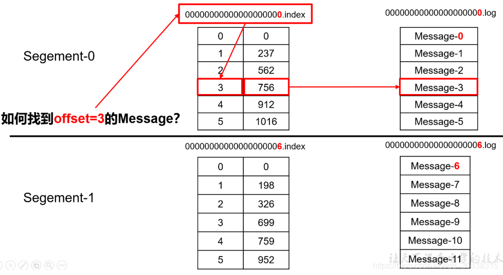

### 多分区下消费者的分区分配

### Kafka数据可靠性保证-ack,ISR,HW

为保证producer发送的数据，能可靠的发送到指定的topic，topic的每个partition收到producer发送的数据后，都需要向producer发送ack（acknowledgement确认收到），如果producer收到ack，就会进行下一轮的发送，否则重新发送数据。

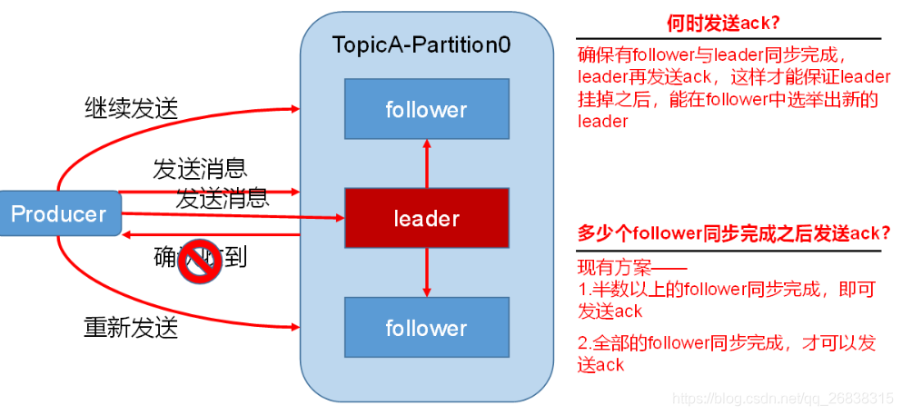

#### 1.副本数据同步策略

| **方案**                                | **优点**                                                     | **缺点**                                                     |
| --------------------------------------- | ------------------------------------------------------------ | ------------------------------------------------------------ |
| **半数以上follower完成同步，就发送ack** | 延迟低(follower同步有快有慢，半数以上同步完成就发送ack能把慢的那些给过滤掉) | 选举新的leader时，容忍n台节点的故障，需要2n+1个副本(半数以上参与投票表示需要n+1台节点存活，总共则需要n+1+n个副本) |
| **全部的follower完成同步，才发送ack**   | 选举新的leader时，容忍n台节点的故障，需要n+1个副本           | 延迟高(同步快的需要等同步慢的，导致延迟高)                   |

Kafka**选择了第二种方案（全部完成同步，才发送ack）**，原因如下：

1. 同样为了容忍n台节点的故障，第一种方案需要2n+1个副本，而第二种方案只需要n+1个副本，而Kafka的每个分区都有大量的数据，第一种方案会造成大量数据的冗余。
2. 虽然第二种方案的网络延迟会比较高，但网络延迟对Kafka的影响较小。

#### 2.ISR,AR

采用第二种方案之后，设想以下情景：leader收到数据，所有follower都开始同步数据，但有一个follower，因为某种故障，迟迟不能与leader进行同步，那leader就要一直等下去，直到它完成同步，才能发送ack。这个问题怎么解决呢？

Leader维护了一个动态的**in-sync replica set** (ISR-同步副本列表)，意为**和leader保持同步的follower集合**。当ISR中的follower完成数据的同步之后，leader就会给follower发送ack。如果follower长时间未向leader同步数据，则该follower将被踢出ISR，该时间阈值由`replica.lag.time.max.ms`参数设定。Leader发生故障之后，就会从ISR中选举新的leader。

- **ISR(In-Sync Replicas )**：与leader保持同步的follower集合
- **AR(Assigned Replicas)**：分区的所有副本

ISR是由leader维护，follower从leader同步数据有一些延迟（包括**延迟时间**replica.lag.time.max.ms和**延迟条数**replica.lag.max.messages两个维度, 当前最新的版本0.10.x中只支持replica.lag.time.max.ms这个维度），任意一个超过阈值都会把follower剔除出ISR, 存入**OSR（Outof-Sync Replicas）**列表，新加入的follower也会先存放在OSR中。AR=ISR+OSR。

#### 3.ack应答机制

对于某些不太重要的数据，对数据的可靠性要求不是很高，能够容忍数据的少量丢失，所以没必要等ISR中的follower全部接收成功。

所以Kafka为用户提供了三种可靠性级别，用户**根据对可靠性和延迟的要求进行权衡**，选择以下的配置。

**acks参数配置：**

- **0**：producer不等待broker的ack，这一操作提供了一个最低的延迟，broker一接收到还没有写入磁盘就已经返回，当broker故障时有可能**丢失数据**；
- **1**：producer等待broker的ack，partition的leader落盘成功后返回ack，如果在follower同步成功之前leader故障，而由于已经返回了ack，系统默认新选举的leader已经有了数据，从而不会进行失败重试，那么将会**丢失数据**

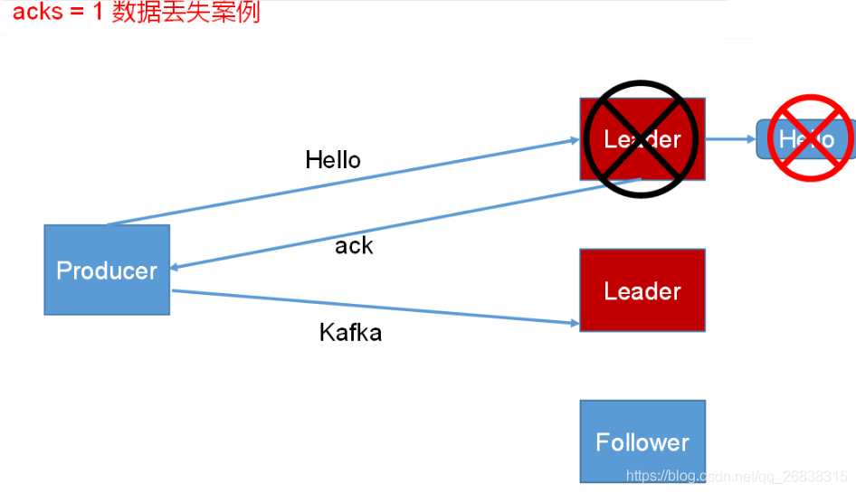

**-1（all）**：producer等待broker的ack，partition的leader和follower全部落盘成功后才返回ack。但是如果在follower同步完成后，broker发送ack之前，leader发生故障，导致没有返回ack给Producer，由于失败重试机制，又会给新选举出来的leader发送数据，造成**数据重复**。

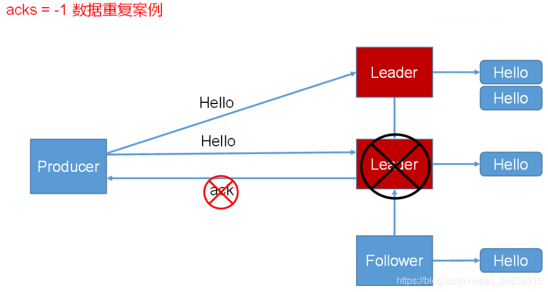

#### 4.HW,LEO,LSO,LW名词解释

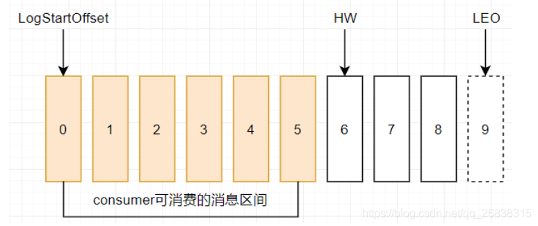

上图表示一个日志文件，这个日志文件中只有9条消息，第一条消息的offset（LogStartOffset）为0，最后一条消息的offset为8，offset为9的消息使用虚线表示的，代表下一条待写入的消息。日志文件的 HW 为6，表示消费者只能拉取offset在 0 到 5 之间的消息，offset为6的消息对消费者而言是不可见的。

- **LEO（log end offset）**:标识**当前日志文件中已写入消息的最后一条的下一条待写入的消息的offset**。上图中offset为9的位置即为当前日志文件的 LEO，LEO 的大小相当于**当前日志分区中最后一条消息的offset值加1**.分区 ISR 集合中的每个副本都会维护自身的 LEO ，而 ISR 集合中最小的 LEO 即为分区的 HW，对消费者而言只能消费 HW 之前的消息。

- **HW（High Watermark）**:所有副本中最小的LEO, 一个分区中所有副本最小的offset,取一个partition对应的ISR中最小的LEO作为HW，consumer**最多只能消费到HW所在的位置上一条信息**。

  **注意:HW/LEO这两个都是指已写入消息的最后一条的下一条的位置而不是指最后一条的位置。**

- **LSO(Last Stable Offset)**: 对未完成的事务而言，LSO 的值等于事务中第一条消息的位置(firstUnstableOffset)，对已完成的事务而言，它的值同 HW 相同

- **LW(Low Watermark)**: 低水位, 代表 AR(分区中的所有副本)集合中最小的 logStartOffset 值

**注意**: LogStartOffset不可以缩写为LSO，因为在Kafka中，LSO特指LogStableOffset

#### 5.故障处理细节

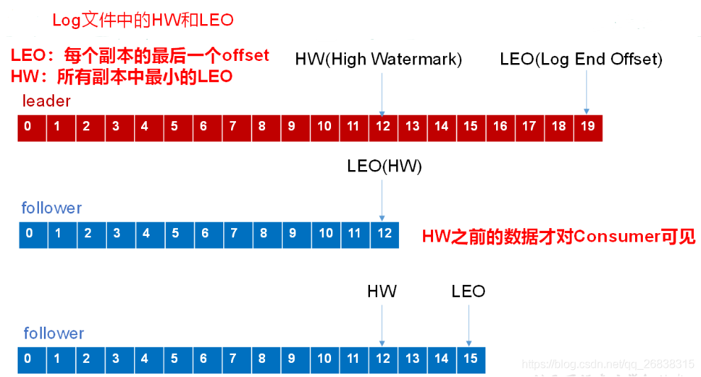

##### 1.follower故障

follower发生故障后会被临时踢出ISR，待该follower恢复后，follower会**读取本地磁盘记录的上次的HW，并将log文件高于HW的部分截取掉**，从HW开始向leader进行同步。等该**follower的LEO大于等于该Partition的HW**，即follower追上leader之后，就可以重新加入ISR了。

##### 2.leader故障

leader发生故障之后，会从ISR中选出一个新的leader，之后，为保证多个副本之间的数据一致性，其余的follower会先将各自的log文件高于HW的部分截掉，然后从新的leader同步数据。

**注意：这只能保证副本之间的数据一致性，并不能保证数据不丢失或者不重复。**

#### 6.ISR 集合和 HW、LEO的关系

下面具体分析一下 ISR 集合和 HW、LEO的关系。

假设某分区的 ISR 集合中有 3 个副本，即一个 leader 副本和 2 个 follower 副本，此时分区的 LEO 和 HW 都分别为 3 。消息3和消息4从生产者出发之后先被存入leader副本。

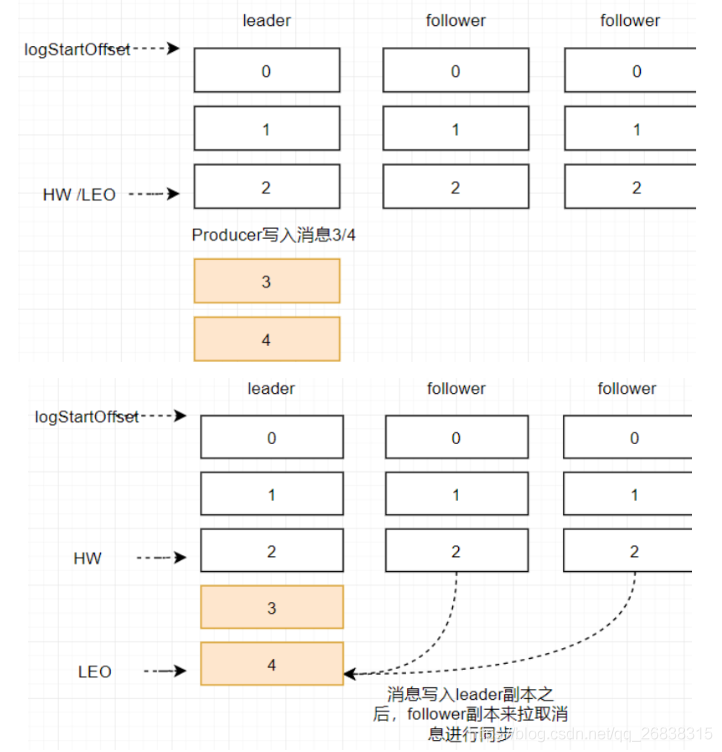

在消息被写入leader副本之后，follower副本会发送拉取请求来拉取消息3和消息4进行消息同步。

在同步过程中不同的副本同步的效率不尽相同，在某一时刻follower1完全跟上了leader副本而follower2只同步了消息3，如此leader副本的LEO为5，follower1的LEO为5，follower2的LEO 为4，那么当前分区的HW取最小值4，此时消费者可以消费到offset0至3之间的消息。

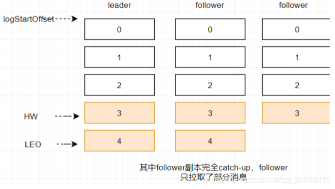

当所有副本都成功写入消息3和消息4之后，整个分区的HW和LEO都变为5，因此消费者可以消费到offset为4的消息了

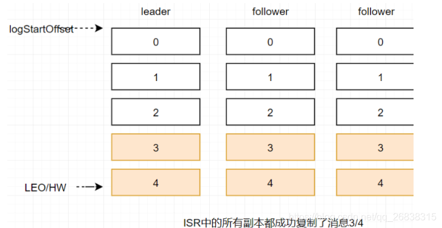

由此可见kafka的复制机制既不是完全的同步复制，也不是单纯的异步复制。事实上，同步复制要求所有能工作的follower副本都复制完，这条消息才会被确认已成功提交，这种复制方式极大的影响了性能。而在异步复制的方式下，follower副本异步的从leader副本中复制数据，数据只要被leader副本写入就会被认为已经成功提交。在这种情况下，如果follower副本都还没有复制完而落后于leader副本，然后leader副本宕机，则会造成数据丢失。kafka使用这种ISR的方式有效的权衡了数据可靠性和性能之间的关系。

## 面试题详解

### 1.突发宕机，Kafka写入的数据如何保证不丢失？

我们暂且不考虑写磁盘的具体过程，先大致看看下面的图，这代表了 Kafka 的核心架构原理。

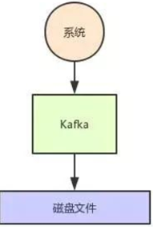

**Kafka 分布式存储架构**

那么现在问题来了，如果每天产生几十 TB 的数据，难道都写一台机器的磁盘上吗?这明显是不靠谱的啊!

所以说，这里就得考虑数据的分布式存储了，我们结合 Kafka 的具体情况来说说。

在 Kafka 里面，有一个核心的概念叫做“Topic”，这个 Topic 你就姑且认为是一个数据集合吧。

举个例子，如果你现在有一份网站的用户行为数据要写入 Kafka，你可以搞一个 Topic 叫做“user_access_log_topic”，这里写入的都是用户行为数据。

然后如果你要把电商网站的订单数据的增删改变更记录写 Kafka，那可以搞一个 Topic 叫做“order_tb_topic”，这里写入的都是订单表的变更记录。

然后假如说咱们举个例子，就说这个用户行为 Topic 吧，里面如果每天写入几十 TB 的数据，你觉得都放一台机器上靠谱吗?

明显不太靠谱，所以 Kafka 有一个概念叫做 Partition，就是把一个 Topic 数据集合拆分为多个数据分区，你可以认为是多个数据分片，每个 Partition 可以在不同的机器上，储存部分数据。

这样，不就可以把一个超大的数据集合分布式存储在多台机器上了吗?大家看下图，一起来体会一下。

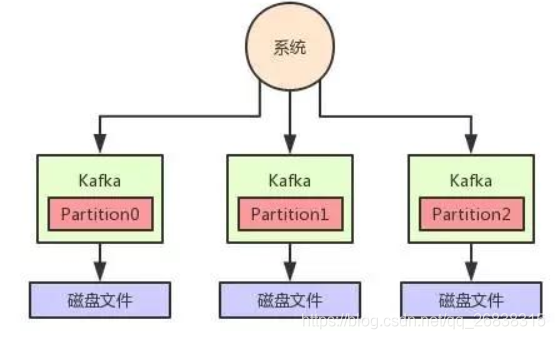

**Kafka 高可用架构**

但是这个时候，我们又会遇到一个问题，就是万一某台机器宕机了，这台机器上的那个 Partition 管理的数据不就丢失了吗?

所以说，我们还得做多副本冗余，每个 Partition 都可以搞一个副本放在别的机器上，这样某台机器宕机，只不过是 Partition 其中一个副本丢失。

如果某个 Partition 有多副本的话，Kafka 会选举其中一个 Parititon 副本作为 Leader，然后其他的 Partition 副本是 Follower。

只有 Leader Partition 是对外提供读写操作的，Follower Partition 就是从 Leader Partition 同步数据。

一旦 Leader Partition 宕机了，就会选举其他的 Follower Partition 作为新的 Leader Partition 对外提供读写服务，这不就实现了高可用架构了?

大家看下面的图，看看这个过程：

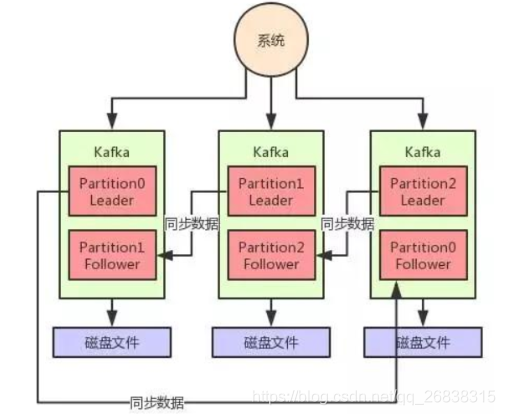

**Kafka 写入数据丢失问题**

现在我们来看看，什么情况下 Kafka 中写入数据会丢失呢?其实也很简单，大家都知道写入数据都是往某个 Partition 的 Leader 写入的，然后那个 Partition 的 Follower 会从 Leader 同步数据。

但是万一 1 条数据刚写入 Leader Partition，还没来得及同步给 Follower，此时 Leader Partiton 所在机器突然就宕机了呢?

大家看下图：

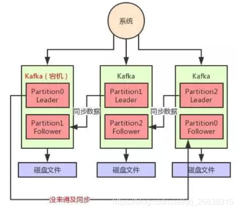

如上图，这个时候有一条数据是没同步到 Partition0 的 Follower 上去的，然后 Partition0 的 Leader 所在机器宕机了。

此时就会选举 Partition0 的 Follower 作为新的 Leader 对外提供服务，然后用户是不是就读不到刚才写入的那条数据了?

因为 Partition0 的 Follower 上是没有同步到的一条数据的。这个时候就会造成数据丢失的问题。

**Kafka 的 ISR 机制是什么?**

现在我们先留着这个问题不说具体怎么解决，先回过头来看一个 Kafka 的核心机制，就是 ISR 机制。

这个机制简单来说，就是会自动给每个 Partition 维护一个 ISR 列表，这个列表里一定会有 Leader，然后还会包含跟 Leader 保持同步的 Follower。

也就是说，只要 Leader 的某个 Follower 一直跟他保持数据同步，那么就会存在于 ISR 列表里。

但是如果 Follower 因为自身发生一些问题，导致不能及时的从 Leader 同步数据过去，那么这个 Follower 就会被认为是“out-of-sync”，被从 ISR 列表里踢出去。

所以大家先得明白这个 ISR 是什么，说白了，就是 Kafka 自动维护和监控哪些 Follower 及时的跟上了 Leader 的数据同步。

**Kafka 写入的数据如何保证不丢失?**

所以如果要让写入 Kafka 的数据不丢失，你需要保证如下几点：

- 每个 Partition 都至少得有 1 个 Follower 在 ISR 列表里，跟上了 Leader 的数据同步。
- 每次写入数据的时候，都要求至少写入 Partition Leader 成功，同时还有至少一个 ISR 里的 Follower 也写入成功，才算这个写入是成功了。
- 如果不满足上述两个条件，那就一直写入失败，让生产系统不停的尝试重试，直到满足上述两个条件，然后才能认为写入成功。
- 按照上述思路去配置相应的参数，才能保证写入 Kafka 的数据不会丢失。

好!现在咱们来分析一下上面几点要求。

第一条，必须要求至少一个 Follower 在 ISR 列表里。

那必须的啊，要是 Leader 没有 Follower 了，或者是 Follower 都没法及时同步 Leader 数据，那么这个事儿肯定就没法弄下去了。

第二条，每次写入数据的时候，要求 Leader 写入成功以外，至少一个 ISR 里的 Follower 也写成功。

大家看下面的图，这个要求就是保证说，每次写数据，必须是 Leader 和 Follower 都写成功了，才能算是写成功，保证一条数据必须有两个以上的副本。

这个时候万一 Leader 宕机，就可以切换到那个 Follower 上去，那么 Follower 上是有刚写入的数据的，此时数据就不会丢失了。

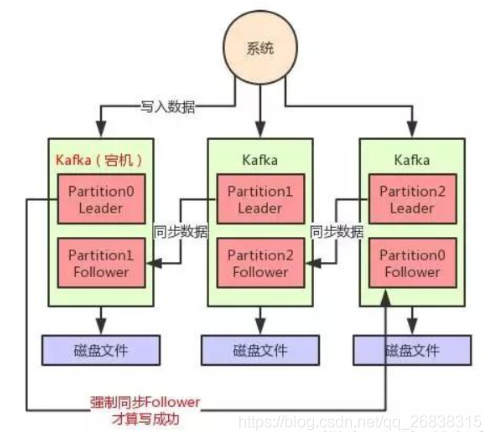

如上图所示，假如现在 Leader 没有 Follower 了，或者是刚写入 Leader，Leader 立马就宕机，还没来得及同步给 Follower。

在这种情况下，写入就会失败，然后你就让生产者不停的重试，直到 Kafka 恢复正常满足上述条件，才能继续写入。这样就可以让写入 Kafka 的数据不丢失。

**总结**

总结一下，其实 Kafka 的数据丢失问题，涉及到方方面面。

譬如生产端的缓存问题，包括消费端的问题，同时 Kafka 自己内部的底层算法和机制也可能导致数据丢失。

但是平时写入数据遇到比较大的一个问题，就是 Leader 切换时可能导致数据丢失。所以本文仅仅是针对这个问题说了一下生产环境解决这个问题的方案。

### 2.Kafka如何实现每秒上百万的超高并发写入？

这篇文章来聊一下 Kafka 的一些架构设计原理，这也是互联网公司面试时非常高频的技术考点。

Kafka 是高吞吐低延迟的高并发、高性能的消息中间件，在大数据领域有极为广泛的运用。配置良好的 Kafka 集群甚至可以做到每秒几十万、上百万的超高并发写入。

那么 Kafka 到底是如何做到这么高的吞吐量和性能的呢?这篇文章我们来详细说一下。

**页缓存技术 + 磁盘顺序写**

首先 Kafka 每次接收到数据都会往磁盘上去写，如下图所示：

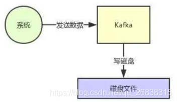

那么在这里我们不禁有一个疑问了，如果把数据基于磁盘来存储，频繁的往磁盘文件里写数据，这个性能会不会很差?大家肯定都觉得磁盘写性能是极差的。

没错，要是真的跟上面那个图那么简单的话，那确实这个性能是比较差的。

但是实际上 Kafka 在这里有极为优秀和出色的设计，就是为了保证数据写入性能，首先 Kafka 是基于操作系统的页缓存来实现文件写入的。

操作系统本身有一层缓存，叫做 Page Cache，是在内存里的缓存，我们也可以称之为 OS Cache，意思就是操作系统自己管理的缓存。

你在写入磁盘文件的时候，可以直接写入这个 OS Cache 里，也就是仅仅写入内存中，接下来由操作系统自己决定什么时候把 OS Cache 里的数据真的刷入磁盘文件中。

仅仅这一个步骤，就可以将磁盘文件写性能提升很多了，因为其实这里相当于是在写内存，不是在写磁盘，大家看下图：

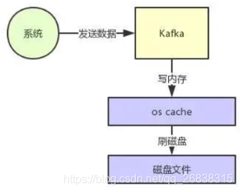

接着另外一个就是 kafka 写数据的时候，非常关键的一点，它是以**磁盘顺序写**的方式来写的。

也就是说，仅仅将数据追加到文件的末尾，不是在文件的随机位置来修改数据。

普通的机械磁盘如果你要是随机写的话，确实性能极差，也就是随便找到文件的某个位置来写数据。

但是如果你是追加文件末尾按照顺序的方式来写数据的话，那么这种磁盘顺序写的性能基本上可以跟写内存的性能本身也是差不多的。

所以大家就知道了，上面那个图里，Kafka 在写数据的时候，一方面基于 OS 层面的 Page Cache 来写数据，所以性能很高，本质就是在写内存罢了。

另外一个，它是采用磁盘顺序写的方式，所以即使数据刷入磁盘的时候，性能也是极高的，也跟写内存是差不多的。

基于上面两点，Kafka 就实现了写入数据的超高性能。那么大家想想，假如说 Kafka 写入一条数据要耗费 1 毫秒的时间，那么是不是每秒就是可以写入 1000 条数据?

但是假如 Kafka 的性能极高，写入一条数据仅仅耗费 0.01 毫秒呢?那么每秒是不是就可以写入 10 万条数据?

所以要保证每秒写入几万甚至几十万条数据的核心点，就是尽可能提升每条数据写入的性能，这样就可以在单位时间内写入更多的数据量，提升吞吐量。

**零拷贝技术**

说完了写入这块，再来谈谈消费这块。

大家应该都知道，从 Kafka 里我们经常要消费数据，那么消费的时候实际上就是要从 Kafka 的磁盘文件里读取某条数据然后发送给下游的消费者，如下图所示：

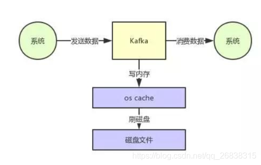

那么这里如果频繁的从磁盘读数据然后发给消费者，性能瓶颈在哪里呢?

假设要是 Kafka 什么优化都不做，就是很简单的从磁盘读数据发送给下游的消费者，那么大概过程如下所示：

- 先看看要读的数据在不在 OS Cache 里，如果不在的话就从磁盘文件里读取数据后放入 OS Cache。
- 接着从操作系统的 OS Cache 里拷贝数据到应用程序进程的缓存里，再从应用程序进程的缓存里拷贝数据到操作系统层面的 Socket 缓存里。
- ***从 Socket 缓存里提取数据后发送到网卡，***发送出去给下游消费。

整个过程，如下图所示：

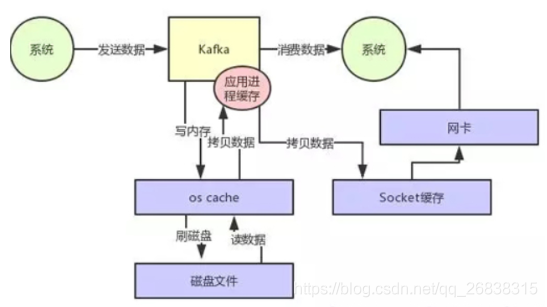

大家看上图，很明显可以看到有两次没必要的拷贝吧!一次是从操作系统的 Cache 里拷贝到应用进程的缓存里，接着又从应用程序缓存里拷贝回操作系统的 Socket 缓存里。

而且为了进行这两次拷贝，中间还发生了好几次上下文切换，一会儿是应用程序在执行，一会儿上下文切换到操作系统来执行。

所以这种方式来读取数据是比较消耗性能的。Kafka 为了解决这个问题，在读数据的时候是引入零拷贝技术。

也就是说，直接让操作系统的 Cache 中的数据发送到网卡后传输给下游的消费者，中间跳过了两次拷贝数据的步骤，Socket 缓存中仅仅会拷贝一个描述符过去，不会拷贝数据到 Socket 缓存。

大家看下图，体会一下这个精妙的过程：

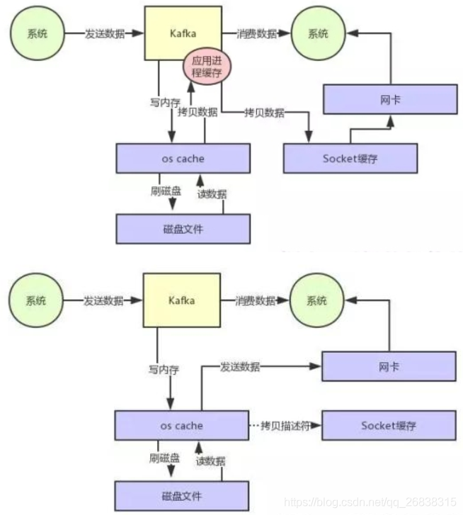

通过零拷贝技术，就不需要把 OS Cache 里的数据拷贝到应用缓存，再从应用缓存拷贝到 Socket 缓存了，两次拷贝都省略了，所以叫做零拷贝。

对 Socket 缓存仅仅就是拷贝数据的描述符过去，然后数据就直接从 OS Cache 中发送到网卡上去了，这个过程大大的提升了数据消费时读取文件数据的性能。

而且大家会注意到，在从磁盘读数据的时候，会先看看 OS Cache 内存中是否有，如果有的话，其实读数据都是直接读内存的。

如果 Kafka 集群经过良好的调优，大家会发现大量的数据都是直接写入 OS Cache 中，然后读数据的时候也是从 OS Cache 中读。

相当于是 Kafka 完全基于内存提供数据的写和读了，所以这个整体性能会极其的高。

**总结**

通过这篇文章对 Kafka 底层的页缓存技术的使用，磁盘顺序写的思路，以及零拷贝技术的运用，大家应该就明白 Kafka 每台机器在底层对数据进行写和读的时候采取的是什么样的思路，为什么它的性能可以那么高，做到每秒几十万的吞吐量。

这种设计思想对我们平时自己设计中间件的架构，或者是出去面试的时候，都有很大的帮助。

### 3.Kafka中的ISR(InSyncRepli)、OSR(OutSyncRepli)、AR(AllRepli)等分别代表什么？

- **ISR(In-Sync Replicas )**：与leader保持同步的follower集合
- **AR(Assigned Replicas)**：分区的所有副本

ISR是由leader维护，follower从leader同步数据有一些延迟（包括延迟时间replica.lag.time.max.ms和延迟条数replica.lag.max.messages两个维度, 当前最新的版本0.10.x中只支持replica.lag.time.max.ms这个维度），任意一个超过阈值都会把follower剔除出ISR，存入OSR（Outof-Sync Replicas）列表，新加入的follower也会先存放在OSR中。AR=ISR+OSR。


### 4. Kafka中的HW、LEO、LSO、LW等分别代表什么？

- **LEO(LogEndOffset)**： 标识当前日志文件下一条待写入的 offset
- **HW(High Watermark)**：一个分区中所有副本最小的offset,取一个partition对应的ISR中最小的LEO作为HW，consumer最多只能消费到HW所在的位置上一条信息。

> HW/LEO这两个都是指**最后一条的下一条的位置而不是指最后一条的位置。**

- **LSO(Last Stable Offset)**: 对未完成的事务而言，LSO 的值等于事务中第一条消息的位置(firstUnstableOffset)，对已完成的事务而言，它的值同 HW 相同
- **LW(Low Watermark)**: 低水位, 代表 AR 集合中最小的 logStartOffset 值


### 5. Kafka的用途有哪些？使用场景如何？

总结下来就几个字:异步处理、日常系统解耦、削峰、提速、广播

如果再说具体一点例如:消息,网站活动追踪,监测指标,日志聚合,流处理,事件采集,提交日志等


### 6.Kafka中是怎么体现消息顺序性的？

每个分区内，每条消息都有一个offset，故只能保证分区内有序。

kafka每个partition中的消息在写入时都是有序的，消费时，每个partition只能被每一个group中的一个消费者消费，保证了消费时也是有序的。

整个topic不保证有序。如果为了保证topic整个有序，那么将partition调整为1。


### 7. Kafka中的分区器、序列化器、拦截器是否了解？它们之间的处理顺序是什么？

> 见Producer API小节

- **分区器**:根据键值确定消息应该处于哪个分区中，默认情况下使用轮询分区，可以自行实现分区器接口自定义分区逻辑
- **序列化器**:键序列化器和值序列化器，将键和值都转为二进制流 还有反序列化器 将二进制流转为指定类型数据
- **拦截器**:两个方法 doSend()方法会在序列化之前完成 onAcknowledgement()方法在消息确认或失败时调用可以添加多个拦截器按顺序执行

调用顺序: 拦截器doSend() -> 序列化器 -> 分区器


### 8.Kafka生产者客户端的整体结构是什么样子的？使用了几个线程来处理？分别是什么？

2个线程，主线程和Sender线程。

- **主线程**：负责创建消息，然后通过分区器、序列化器、拦截器作用之后缓存到累加器`RecordAccumulator`中。
- **Sender线程**：负责将`RecordAccumulator`中消息发送到kafka中.

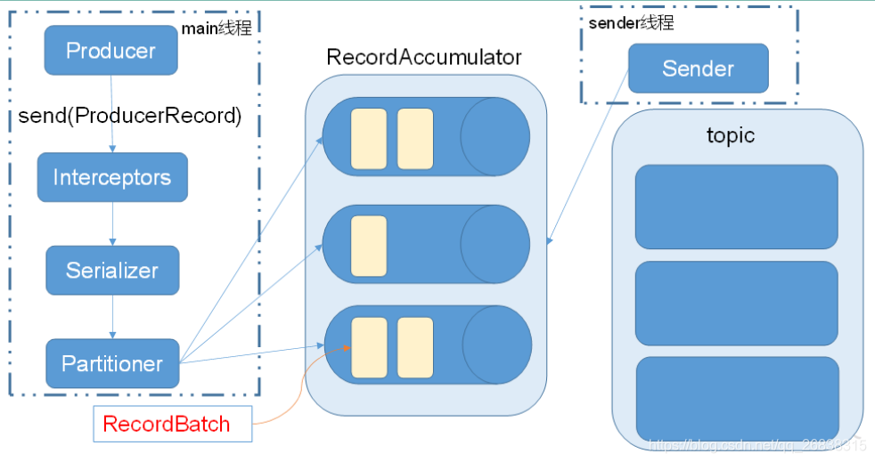

### 9.“消费组中的消费者个数如果超过topic的分区，那么就会有消费者消费不到数据”这句话是否正确？

正确,因为一个分区只能被同一个消费组中的一个消费者消费，如果消费者组中消费者个数超过分区数，那么肯定有一个没有办法消费到数据


### 10.消费者提交消费位移时提交的是当前消费到的最新消息的offset还是offset+1?

offset+1


### 11.有哪些情形会造成重复消费？（重点）

> 见4.2.2和3.3.3小节详解

两种情况可能出现重复消费

1. 当ack=-1时，如果在follower同步完成后，broker发送ack之前，leader发生故障，导致没有返回ack给Producer，由于失败重试机制，又会给新选举出来的leader发送数据，造成**数据重复**。
2. （手动管理offset时，先消费后提交offset）消费者消费后没有commit offset(程序崩溃/强行kill/消费耗时/自动提交偏移情况下unscrible)

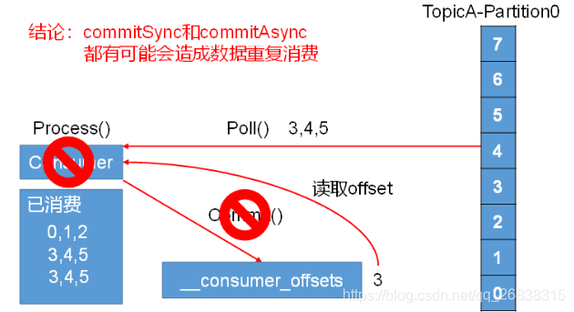

### 12.哪些情景会造成消息漏消费？（重点）

> 见4.2.2和3.3.3小节详解

1. （**手动管理offset时，先提交offset后消费**）先提交offset，后消费，有可能造成数据的重复

   如果先提交offset，后消费，可能会出现数据漏消费问题。比如，要消费0,1,2,我先提交offset ，此时`__consumer_offsets`的值为4，但等我提交完offset之后，还没有消费之前，消费者挂掉了，这时等消费者重新活过来后，读取的`__consumer_offsets`值为4，就会从4开始消费，导致消息0,1,2出现漏消费问题。

2. 当**ack=0**时，producer不等待broker的ack，这一操作提供了一个最低的延迟，broker一接收到还没有写入磁盘就已经返回，当broker故障时有可能**丢失数据**；

3. 当**ack=1**时，producer等待broker的ack，partition的leader落盘成功后返回ack，如果在follower同步成功之前leader故障，而由于已经返回了ack，系统默认新选举的leader已经有了数据，从而不会进行失败重试，那么将会**丢失数据**


### 13.当你使用kafka-topics.sh创建（删除）了一个topic之后，Kafka背后会执行什么逻辑？

1. 会在zookeeper中的/brokers/topics节点下创建一个新的topic节点，如：/brokers/topics/first
2. 触发Kafka Controller的监听程序
3. kafka Controller 负责topic的创建工作，并更新metadata cache


### 14.topic的分区数可不可以增加？如果可以怎么增加？如果不可以，那又是为什么？

可以增加，可以通过以下命令增加，也可以通过Kafka Manager等图形化管理工具进行分区的添加

```shell
bin/kafka-topics.sh --zookeeper localhost:2181/kafka --alter --topic topic-config --partitions 3
```


### 15.topic的分区数可不可以减少？如果可以怎么减少？如果不可以，那又是为什么？

不可以减少，被删除的分区数据难以处理


### 16.Kafka有内部的topic吗？如果有是什么？有什么所用？

__consumer_offsets 以双下划线开头，保存消费组的偏移量


### 17.Kafka分区分配的概念？

> 见3.5.2小节

一个topic多个分区，一个消费者组多个消费者，故需要将分区分配个消费者(roundrobin、range)

在 Kafka内部存在两种默认的分区分配策略：Range和 RoundRobin，最新还有sticky。

**Range**是默认策略。Range是对每个Topic而言的（即一个Topic一个Topic分），首先对同一个Topic里面的分区按照序号进行排序，并对消费者按照字母顺序进行排序。然后用Partitions分区的个数除以消费者线程的总数来决定每个消费者线程消费几个分区。如果除不尽，那么前面几个消费者线程将会多消费一个分区。

例如：我们有10个分区，两个消费者（C1，C2），3个消费者线程，10 / 3 = 3而且除不尽。

C1-0 将消费 0, 1, 2, 3 分区

C2-0 将消费 4, 5, 6 分区

C2-1 将消费 7, 8, 9 分区

**RoundRobin**：前提：同一个Consumer Group里面的所有消费者的num.streams（消费者消费线程数）必须相等；每个消费者订阅的主题必须相同。

第一步：将所有主题分区组成TopicAndPartition列表，然后对TopicAndPartition列表按照hashCode进行排序，最后按照轮询的方式发给每一个消费线程。


### 18.简述Kafka的日志目录结构？

每个分区对应一个文件夹，文件夹的命名为topic-0，topic-1，内部为.log和.index文件

每个partition一个文件夹，包含四类文件

- .index
- .log
- .timeindex
- leader-epoch-checkpoint

.index .log .timeindex 三个文件成对出现 前缀为上一个segment的最后一个消息的偏移 log文件中保存了所有的消息 index文件中保存了稀疏的相对偏移的索引 timeindex保存的则是时间索引

leader-epoch-checkpoint中保存了每一任leader开始写入消息时的offset 会定时更新,follower被选为leader时会根据这个确定哪些消息可用


### 19.如果我指定了一个offset，Kafka Controller怎么查找到对应的消息？

1. 先**二分查找**获取对应index索引文件，获取到对应的物理offset
2. 拿着物理offset去log数据文件**顺序查找**对应消息
3. 返回查找到的消息

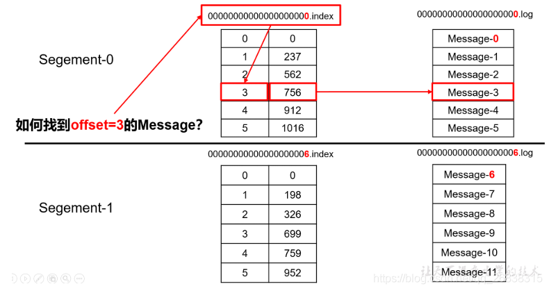

### 20. 聊一聊Kafka Controller的作用？

负责管理集群broker的上下线，所有topic的分区副本分配和leader选举等工作

在Kafka集群中会有一个或者多个broker，其中有一个broker会被选举为控制器（Kafka Controller），它负责管理整个集群中所有分区和副本的状态。当某个分区的leader副本出现故障时，由控制器负责为该分区选举新的leader副本。当检测到某个分区的ISR集合发生变化时，由控制器负责通知所有broker更新其元数据信息。当使用kafka-topics.sh脚本为某个topic增加分区数量时，同样还是由控制器负责分区的重新分配。


### 21. Kafka中有那些地方需要选举？这些地方的选举策略又有哪些？

partition leader（ISR）

kafka controller（先到先得）

当broker启动时，会尝试会去创建/controller节点，创建成功即成为controller。如果该controller死亡，/controller节点会释放，由新的broker创建此节点成为新的controller


### 22. 失效副本是指什么？有那些应对措施？

不能及时与leader同步，暂时踢出ISR，等其追上leader之后再重新加入

ISR是由leader维护，follower从leader同步数据有一些延迟（包括**延迟时间**replica.lag.time.max.ms和**延迟条数**replica.lag.max.messages两个维度, 当前最新的版本0.10.x中只支持replica.lag.time.max.ms这个维度），任意一个超过阈值都会把follower剔除出ISR, 存入**OSR（Outof-Sync Replicas）**列表，新加入的follower也会先存放在OSR中。AR=ISR+OSR。

osr中的副本，如果与leader通信后，会尝试与leader同步，同步的策略是首先将当前记录的hw之后的消息删除，然后与leader同步，当与leader基本同步之后（存储的消息的offset大于当前isr中的hw），就重新回到isr之中


### 23.Kafka的那些设计让它有如此高的性能？

分区，顺序写磁盘，0-copy


### 24.Kafka消息数据积压，Kafka消费能力不足怎么处理？

1. 如果是Kafka消费能力不足，则可以考虑增加Topic的分区数，并且同时提升消费组的消费者数量，消费者数=分区数。（两者缺一不可）
2. 如果是下游的数据处理不及时：提高每批次拉取的数量。批次拉取数据过少（拉取数据/处理时间<生产速度），使处理的数据小于生产的数据，也会造成数据积压。


### 25.Kafka中数据量计算

每天总数据量100g，每天产生1亿条日志， 10000万/24/60/60=1150条/每秒钟

平均每秒钟：1150条

低谷每秒钟：400条

高峰每秒钟：1150条*（2-20倍）=2300条-23000条

每条日志大小：0.5k-2k

每秒多少数据量：2.3M-20MB


### 26. Kafka的ISR副本同步队列

ISR（In-Sync Replicas），副本同步队列。ISR中包括Leader和Follower。如果Leader进程挂掉，会在ISR队列中选择一个服务作为新的Leader。有replica.lag.max.messages（延迟条数）和replica.lag.time.max.ms（延迟时间）两个参数决定一台服务是否可以加入ISR副本队列，在0.10版本移除了replica.lag.max.messages参数，防止服务频繁的进去队列。

任意一个维度超过阈值都会把Follower剔除出ISR，存入OSR（Outof-Sync Replicas）列表，新加入的Follower也会先存放在OSR中。


### 27.Kafka丢不丢数据

Ack=0，相当于异步发送，消息发送完毕即offset增加，继续生产。

Ack=1，leader收到leader replica 对一个消息的接受ack才增加offset，然后继续生产。

Ack=-1，leader收到所有replica 对一个消息的接受ack才增加offset，然后继续生产。


### 28.多少个Topic

通常情况：多少个日志类型就多少个Topic。也有对日志类型进行合并的。


### 29.Kakfa分区数

分区数并不是越多越好，一般分区数不要超过集群机器数量。分区数越多占用内存越大（ISR等），一个节点集中的分区也就越多，当它宕机的时候，对系统的影响也就越大。

分区数一般设置为：3-10


### 30.Kafka监控

公司自己开发的监控器；

开源的监控器：KafkaManager,KafkaMonitor,Kafka Eagle


### 31. Kafka的硬盘大小

每天的数据量*7天


### 32.Kafka的日志保存时间

7天


### 33.Kafka的机器数量

Kafka机器数量=2*（峰值生产速度*副本数/100）+1


### 34.Kafka压测

Kafka官方自带压力测试脚本（kafka-consumer-perf-test.sh、kafka-producer-perf-test.sh）。Kafka压测时，可以查看到哪个地方出现了瓶颈（CPU，内存，网络IO）。一般都是网络IO达到瓶颈。
