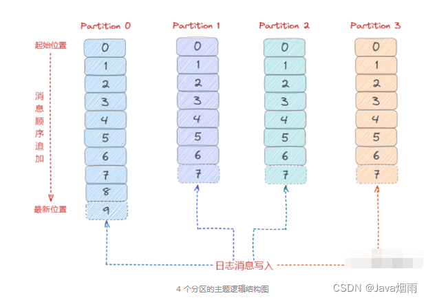
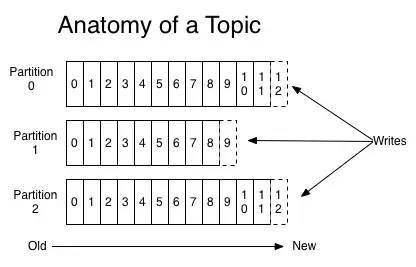

# Kafka存储架构

## 1 Kafka 存储场景剖析

在讲解 Kafka 的存储方案之前，我们先来看看 Kafka 官网给的定义：

Apache Kafka is an open-source distributed event streaming platform used by thousands of companies for high-performance data pipelines, streaming analytics, data integration, and mission-critical applications.

翻译成中文如下：

Apache kafka 是一个开源的分布式事件流处理平台，由成千上万的公司用于高性能的数据管道流分析、数据集成和关键任务的应用程序。

了解 Kafka 的老司机都知道，它是从 Linkedin 内部孵化的项目。从一开始，Kafka 就是为了解决大数据的实时日志流而生的,，每天要处理的日志量级在千亿规模。对于日志流的特点主要包括数据实时产生与海量数据存储与处理。所以，它必然要面临分布式系统遇到的高并发、高可用、高性能等三高挑战。

通过上面的背景可以得出：**一切脱离业务场景谈架构设计都是耍流氓**。

综上我们看对于 Kafka 的存储需求来说，要保证以下几点：

- 存储的主要是消息流，可以是简单的文本格式也可以是其他格式。对于 Broker 存储来说，它并不关心数据本身；

- 要支持海量数据的高效存储、高持久化，保证重启后数据不丢失；

- 要支持海量数据的高效检索，消费的时候可以通过 offset 或者时间戳高效查询并处理；

- 要保证数据的安全性和稳定性、故障转移容错性。

## 2 Kafka 存储选型

有了上面的场景需求分析后， 我们接下来分析看看 Kafka 到底基于什么机制来存储的？能否直接用现有我们了解到的关系型数据库来实现呢？我们接着继续深度分析。

​     

### 2.1 存储基本知识

我们先来了解下存储的基本知识或者常识。在我们的认知中，对于各个存储介质的速度大体同下图中看到的那样，层级越高代表速度越快。很显然，磁盘处于一个比较尴尬的位置。然而，事实上磁盘可以比我们预想的要快，也可能比我们预想的要慢，这完全取决于我们如何使用它。


各存储介质对比分布（图来自网络）

关于磁盘和内存的 IO 速度，我们可以从下图性能测试的结果看出普通机械磁盘的顺序 I/O 性能指标是 53.2M value/s，而内存的随机 I/O 性能指标是 36.7M value/s。由此似乎可以得出结论：磁盘的顺序 I/O 性能要强于内存的随机 I/O 性能。


磁盘和内存的 IO 速度对比（图片来自网络）

​         

另外从整个数据读写性能方面，有不同的实现方式，要么提高读速度，要么提高写速度。

- **提高读速度**：利用索引来提高查询速度。但是有了索引，大量写操作都会维护索引，那么会降低写入效率。常见的如关系型数据库 MySQL 等；
- **提高写速度**：这种一般是采用日志存储，通过顺序追加写的方式来提高写入速度。因为没有索引，无法快速查询，最严重的只能一行行遍历读取。常见的如大数据相关领域的基本都基于此方式来实现。

### 2.2 Kafka 存储方案剖析

上面从存储基础知识，以及存储介质 IO 速度、读写性能方面剖析了存储类系统的实现方式，那么我们来看看 Kafka 的存储到底该采用哪种方式来实现呢？

对于 Kafka 来说， 它主要用来处理海量数据流。这个场景的特点主要包括：

- **写操作**：写并发要求非常高，基本得达到百万级 TPS 顺序追加写日志即可，无需考虑更新操作；
- **读操作**：相对写操作来说比较简单，只要能按照一定规则高效查询即可（offset 或者时间戳）。

根据上面两点分析，对于写操作来说直接采用顺序追加写日志的方式就可以满足 Kafka 对于百万 TPS 写入效率要求。

我们可以设想把消息的 Offset 设计成一个有序的字段。这样消息在日志文件中也就有序存放了，也不需要额外引入哈希表结构。可以直接将消息划分成若干个块。对于每个块，我们只需要索引当前块的第一条消息的 Offset ，这个是不是有点二分查找算法的意思？即先根据 Offset 大小找到对应的块， 然后再从块中顺序查找。


Kafka 稀疏索引查询示意图

这样就可以快速定位到要查找的消息的位置了。在 Kafka 中，我们将这种索引结构叫做 “**稀疏索引**”。

上面从 Kafka 诞生背景、 存储场景分析、存储介质 IO 对比、以及 Kafka 存储方案选型等几个方面进行深度剖析。 得出了 Kafka 最终的存储实现方案， 即**基于顺序追加写日志 + 稀疏哈希索引**。

接下来我们来看看 Kafka 日志[存储结构](https://so.csdn.net/so/search?q=存储结构&spm=1001.2101.3001.7020)：


Kafka日志存储结构 

从上图可以看出来，Kafka 是基于「**主题 + 分区 + 副本 + 分段 + 索引**」的结构：

- Kafka 中消息是以主题 Topic 为基本单位进行归类的。这里的 Topic 是逻辑上的概念。实际上，在磁盘存储是根据分区 Partition 存储的，即每个 Topic 被分成多个 Partition。分区 Partition 的数量可以在主题 Topic 创建的时候进行指定；

- Partition 分区主要是为了解决 Kafka 存储的水平扩展问题而设计的。如果一个 Topic 的所有消息都只存储到一个 Kafka Broker上的话， 对于 Kafka 每秒写入几百万消息的高并发系统来说，这个 Broker 肯定会出现瓶颈， 故障时候不好进行恢复。所以，Kafka 将 Topic 的消息划分成多个 Partition， 然后均衡的分布到整个 Kafka Broker 集群中；

- Partition 分区内每条消息都会被分配一个唯一的消息 id，即我们通常所说的偏移量 Offset。因此，Kafka 只能保证每个分区内部有序性，并不能保证全局有序性；

- 然后，每个 Partition 分区又被划分成了多个 LogSegment，这是为了防止 Log 日志过大。Kafka 又引入了日志分段（LogSegment）的概念，将 Log 切分为多个 LogSegement，相当于一个巨型文件被平均分割为一些相对较小的文件，这样也便于消息的查找、维护和清理。这样在做历史数据清理的时候，直接删除旧的 LogSegement 文件就可以了；

- Log 日志在物理上只是以文件夹的形式存储，而每个 LogSegement 对应磁盘上的一个日志文件和两个索引文件，以及可能的其他文件（比如以“.snapshot”为后缀的快照索引文件等)。

## 3 Kafka 日志系统架构设计

了解了 Kafka 存储选型和存储架构设计后， 我们接下来再深度剖析下 Kafka 日志系统的架构设计。

根据上面的存储架构剖析，我们知道 Kafka 消息是按主题 Topic 为基础单位归类的，各个 Topic 在逻辑上是独立的，每个 Topic 又可以分为一个或者多个 Partition。每条消息在发送的时候会根据分区规则被追加到指定的分区中。



### 3.1 日志目录布局

那么 Kafka 消息写入到磁盘的日志目录布局是怎样的？接触过 Kafka 的老司机一般都知道 Log 对应了一个命名为 **<topic>-<partition>** 的文件夹。

举个例子，假设现在有一个名为“topic-order”的 Topic，该 Topic 中有 4 个 Partition。那么在实际物理存储上表现为“topic-order-0”、“topic-order-1”、“topic-order-2”、“topic-order-3” 这 4 个文件夹。

看上图我们知道首先向 Log 中写入消息是顺序写入的。但是只有最后一个 LogSegement 才能执行写入操作，之前的所有 LogSegement 都不能执行写入操作。为了更好理解这个概念，我们将最后一个 LogSegement 称为"activeSegement"，即表示当前活跃的日志分段。随着消息的不断写入，当 activeSegement 满足一定的条件时，就需要创建新的 activeSegement，之后再追加的消息会写入新的 activeSegement。


activeSegment 示意图

为了更高效的进行消息检索，每个 LogSegment 中的日志文件（以“.log”为文件后缀）都有对应的几个索引文件：

- 偏移量索引文件（以 “.index” 为文件后缀）

- 时间戳索引文件（以 “.timeindex” 为文件后缀）

- 快照索引文件（以 “.snapshot” 为文件后缀）

其中，每个 LogSegment 都有一个 Offset 来作为基准偏移量（baseOffset），用来表示当前 LogSegment 中第一条消息的 Offset。

偏移量是一个 64 位的 Long 长整型数，日志文件和这几个索引文件都是根据基准偏移量（baseOffset）命名的。名称固定为 20 位数字，没有达到的位数前面用 0 填充。比如第一个 LogSegment 的基准偏移量为0，对应的日志文件为00000000000000000000.log。

我们来举例说明，向主题 topic-order 中写入一定量的消息。某一时刻 topic-order-0 目录中的布局如下所示：


Kafka log 目录布局示意图

上面例子中 LogSegment 对应的基准位移是 12768089，也说明了当前 LogSegment 中的第一条消息的偏移量为 12768089，同时可以说明当前 LogSegment 中共有 12768089 条消息（偏移量从 0 至 12768089的消息）。

注意：每个 LogSegment 中不只包含“.log”、“.index”、“.timeindex”这几种文件，还可能包含“.snapshot”、“.txnindex”、“leader-epoch-checkpoint”等文件, 以及 “.deleted”、“.cleaned”、“.swap”等临时文件。

另外消费者消费的时候，会将提交的位移保存在 Kafka 内部的主题 __consumer_offsets 中。

下面我们来看一个整体的日志目录结构图：


Kafka log 整体目录布局示意图

### 3.2 日志格式演变

对于一个成熟的消息中间件来说，日志格式不仅影响功能的扩展，还关乎性能维度的优化。所以随着 Kafka 的迅猛发展，其日志格式也在不断升级改进中，Kafka 的日志格式总共经历了3个大版本：V0，V1和V2版本。    

我们知道在 Kafka Partition 分区内部都是由每一条消息进行组成，如果日志格式设计得不够精巧，那么其功能和性能都会大打折扣。

#### V2 版本

不说那么多，直接看V2版本，V0和V1都老掉牙了，想看自己找。

针对上面我们分析的关于 V0、V1 版本日志格式的缺陷，Kafka 在 0.11.0.0 版本对日志格式进行了大幅度重构。使用可变长度类型解决了空间使用率低的问题，增加了消息总长度字段，使用增量的形式保存时间戳和位移，并且把一些字段统一抽取到 RecordBatch 中。


Kafka V2 版本日志格式示意图

从以上图可以看出，V2 版本的消息批次（RecordBatch），相比 V0、V1 版本主要有以下变动：

- 将 CRC 值从消息中移除，被抽取到消息批次中；

- 增加了 procuder id、producer epoch、序列号等信息主要是为了支持幂等性以及事务消息的；

- 使用增量形式来保存时间戳和位移；

- 消息批次最小为 61 字节，比 V0、V1 版本要大很多，但是在批量消息发送场景下，会提供发送效率，降低使用空间。

综上可以看出，V2 版本日志格式主要是通过可变长度提高了消息格式的空间使用率，并将某些字段抽取到消息批次（RecordBatch）中。同时，消息批次可以存放多条消息。从而在批量发送消息时，可以大幅度地节省了磁盘空间。

### 3.3 日志清理机制

Kafka 将消息存储到磁盘中。随着写入数据不断增加，磁盘占用空间越来越大。为了控制占用空间就需要对消息做一定的清理操作。从上面 Kafka 存储日志结构分析中每一个分区副本（Replica）都对应一个 Log，而 Log 又可以分为多个日志分段（LogSegment），这样就便于 Kafka 对日志的清理操作。


Kafka提供了两种日志清理策略：

- 日志删除（Log Retention）：按照一定的保留策略直接删除不符合条件的日志分段（LogSegment）。

- 日志压缩（Log Compaction）：针对每个消息的key进行整合，对于有相同key的不同value值，只保留最后一个版本。

这里我们可以通过 Kafka Broker 端参数 log.cleanup.policy 来设置日志清理策略，默认值为 “delete”，即采用日志删除的清理策略。如果要采用日志压缩的清理策略，就需要将 log.cleanup.policy 设置为 “compact”，这样还不够，必须还要将log.cleaner.enable（默认值为 true）设为 true。

如果想要同时支持两种清理策略， 可以直接将 log.cleanup.policy 参数设置为“delete，compact”。

### 3.4 日志删除

Kafka 的日志管理器（LogManager）中有一个专门的日志清理任务通过周期性检测和删除不符合条件的日志分段文件（LogSegment），这里我们可以通过 Kafka Broker 端的参数 log.retention.check.interval.ms 来配置。默认值为 300000，即 5 分钟。

在 Kafka 中一共有三种保留策略：

#### 基于时间策略

日志删除任务会周期检查当前日志文件中是否有保留时间超过设定的阈值（retentionMs）来寻找可删除的日志段文件集合（deletableSegments）。

其中，retentionMs 可以通过 Kafka Broker 端的这几个参数的大小判断的 

log.retention.ms > log.retention.minutes > log.retention.hours 优先级来设置。默认情况只会配置 log.retention.hours 参数，值为 168 即为 7 天。

这里需要注意：删除过期的日志段文件，并不是简单的根据该日志段文件的修改时间计算的，而是要根据该日志段中最大的时间戳 largestTimeStamp 来计算的。首先要查询该日志分段所对应的时间戳索引文件，查找该时间戳索引文件的最后一条索引数据。如果时间戳值大于 0 则取值，否则才会使用最近修改时间（lastModifiedTime）。

删除步骤：

- 首先，从 Log 对象所维护的日志段的跳跃表中移除要删除的日志段，用来确保已经没有线程来读取这些日志段；

- 将日志段所对应的所有文件，包括索引文件都添加上“.deleted”后缀；

- 最后交给一个以“delete-file”命名的延迟任务来删除这些以“ .deleted ”为后缀的文件。默认 1 分钟执行一次， 可以通过 file.delete.delay.ms 来配置。


#### 基于日志大小策略

​     

日志删除任务会周期检查当前日志大小是否超过设定的阈值（retentionSize）来寻找可删除的日志段文件集合（deletableSegments）。

其中 retentionSize 这里我们可以通过 Kafka Broker 端的参数 log.retention.bytes 来设置。默认值为 -1，即无穷大。

这里需要注意的是 log.retention.bytes 设置的是Log中所有日志文件的大小，而不是单个日志段的大小。单个日志段可以通过参数 log.segment.bytes 来设置，默认大小为1G。

删除步骤：

- 首先，计算日志文件的总大小 Size 和 retentionSize 的差值，即需要删除的日志总大小；

- 然后从日志文件中的第一个日志段开始进行查找可删除的日志段的文件集合（deletableSegments）；

- 找到后就可以进行删除操作了。


基于日志起始偏移量

该策略判断依据是，日志段的下一个日志段的起始偏移量 baseOffset 是否小于等于 logStartOffset。如果是，则可以删除此日志分段。

删除步骤：

- 首先，从头开始遍历每个日志段。日志段 1 的下一个日志分段的起始偏移量为 20，小于 logStartOffset 的大小，将日志段 1 加入 deletableSegments；

- 日志段 2 的下一个日志偏移量的起始偏移量为 35，也小于 logStartOffset 的大小，将日志分段 2 页加入 deletableSegments；

- 日志段 3 的下一个日志偏移量的起始偏移量为 50，也小于 logStartOffset 的大小，将日志分段 3 页加入 deletableSegments；

- 日志段 4 的下一个日志偏移量通过对比后，在 logStartOffset 的右侧。那么从日志段 4 开始的所有日志段都不会加入 deletableSegments；

- 待收集完所有的可删除的日志集合后就可以直接删除了。


如下图所示：

   

### 3.5 日志压缩

日志压缩 Log Compaction 对于有相同 key 的不同 value 值，只保留最后一个版本。如果应用只关心 key 对应的最新 value 值，则可以开启 Kafka 相应的日志清理功能。Kafka 会定期将相同 key 的消息进行合并，只保留最新的 value 值。     

Log Compaction 可以类比 Redis 中的 RDB 的持久化模式。我们可以想象下，如果每次消息变更都存 Kafka。在某一时刻 Kafka 异常崩溃后，如果想快速恢复，可以直接使用日志压缩策略。这样在恢复的时候只需要恢复最新的数据即可，这样可以加快恢复速度。


4.6 磁盘数据存储

我们知道 Kafka 是依赖文件系统来存储和缓存消息，以及典型的顺序追加写日志操作。另外它使用操作系统的 PageCache 来减少对磁盘 I/O 操作，即将磁盘的数据缓存到内存中，把对磁盘的访问转变为对内存的访问。


在 Kafka 中大量使用了 PageCache， 这也是 Kafka 能实现高吞吐的重要因素之一。 

当一个进程准备读取磁盘上的文件内容时，操作系统会先查看待读取的数据页是否在 PageCache 中，

- 如果命中则直接返回数据，从而避免了对磁盘的 I/O 操作；

- 如果没有命中，操作系统则会向磁盘发起读取请求并将读取的数据页存入 PageCache 中，之后再将数据返回给进程。

同样，如果一个进程需要将数据写入磁盘，那么操作系统也会检查数据页是否在页缓存中。如果不存在，则 PageCache 中添加相应的数据页，最后将数据写入对应的数据页。被修改过后的数据页也就变成了脏页，操作系统会在合适的时间把脏页中的数据写入磁盘，以保持数据的一致性。

除了消息顺序追加写日志、PageCache 以外，Kafka 还使用了零拷贝（Zero-Copy）技术来进一步提升系统性能。

如下图所示：


消息从生产到写入磁盘的整体过程如下图所示：


## 4 Kafka文件存储机制–实际运行效果

实验环境：

- Kafka集群：由2台虚拟机组成
- cpu：4核
- 物理内存：8GB
- 网卡：千兆网卡
- jvm heap: 4GB
- 详细Kafka服务端配置及其优化请参考：[kafka server.properties配置详解](http://blog.csdn.net/lizhitao/article/details/25667831)

                      

从上述图5可以看出，Kafka运行时很少有大量读磁盘的操作，主要是定期批量写磁盘操作，因此操作磁盘很高效。这跟Kafka文件存储中读写message的设计是息息相关的。Kafka中读写message有如下特点:

写message

- 消息从java堆转入page cache(即物理内存)。
- 由异步线程刷盘,消息从page cache刷入磁盘。

读message

- 消息直接从page cache转入socket发送出去。
- 当从page cache没有找到相应数据时，此时会产生磁盘IO,从磁 盘Load消息到page cache,然后直接从socket发出去

Kafka高效文件存储设计特点

- Kafka把topic中一个parition大文件分成多个小文件段，通过多个小文件段，就容易定期清除或删除已经消费完文件，减少磁盘占用。
- 通过索引信息可以快速定位message和确定response的最大大小。
- 通过index元数据全部映射到memory，可以避免segment file的IO磁盘操作。
- 通过索引文件稀疏存储，可以大幅降低index文件元数据占用空间大小。

## 5 Kafka与PageCache

关于Kafka的一个灵魂拷问：它为什么这么快？或者说，为什么它能做到如此大的吞吐量和如此低的延迟？

有很多文章已经对这个问题给出了回答，但本文只重点研究其中的一个方向，即对page cache的使用。先简单地认识一下Linux系统中的page cache（顺便也认识一下buffer cache）。

### **page cache & buffer cache**

执行free命令，注意到会有两列名为buffers和cached，也有一行名为“-/+ buffers/cache”。

```javascript
~ free -m
             total       used       free     shared    buffers     cached
Mem:        128956      96440      32515          0       5368      39900
-/+ buffers/cache:      51172      77784
Swap:        16002          0      16001
```

其中，cached列表示当前的页缓存（page cache）占用量，buffers列表示当前的块缓存（buffer cache）占用量。用一句话来解释：**page cache用于缓存文件的页数据，buffer cache用于缓存块设备（如磁盘）的块数据。**页是逻辑上的概念，因此page cache是与文件系统同级的；块是物理上的概念，因此buffer cache是与块设备驱动程序同级的。

page cache与buffer cache的共同目的都是加速数据I/O：写数据时首先写到缓存，将写入的页标记为dirty，然后向外部存储flush，也就是缓存写机制中的write-back（另一种是write-through，Linux未采用）；读数据时首先读取缓存，如果未命中，再去外部存储读取，并且将读取来的数据也加入缓存。操作系统总是积极地将所有空闲内存都用作page cache和buffer cache，当内存不够用时也会用LRU等算法淘汰缓存页。

在Linux 2.4版本的内核之前，page cache与buffer cache是完全分离的。但是，块设备大多是磁盘，磁盘上的数据又大多通过文件系统来组织，这种设计导致很多数据被缓存了两次，浪费内存。所以在2.4版本内核之后，两块缓存近似融合在了一起：如果一个文件的页加载到了page cache，那么同时buffer cache只需要维护块指向页的指针就可以了。只有那些没有文件表示的块，或者绕过了文件系统直接操作（如dd命令）的块，才会真正放到buffer cache里。因此，我们现在提起page cache，基本上都同时指page cache和buffer cache两者，本文之后也不再区分，直接统称为page cache。

下图近似地示出32-bit Linux系统中可能的一种page cache结构，其中block size大小为1KB，page size大小为4KB。


page cache中的每个文件都是一棵基数树（radix tree，本质上是多叉搜索树），树的每个节点都是一个页。根据文件内的偏移量就可以快速定位到所在的页，如下图所示。关于基数树的原理可以参见英文维基，这里就不细说了。


接下来就可以把Kafka扯进来了。

### **Kafka对page cache的利用**

Kafka为什么不自己管理缓存，而非要用page cache？原因有如下三点：

- JVM中一切皆对象，数据的[对象存储](https://cloud.tencent.com/product/cos?from=10680)会带来所谓object overhead，浪费空间；
- 如果由JVM来管理缓存，会受到GC的影响，并且过大的堆也会拖累GC的效率，降低吞吐量；
- 一旦程序崩溃，自己管理的缓存数据会全部丢失。

Kafka三大件（broker、producer、consumer）与page cache的关系可以用下面的简图来表示。


producer生产消息时，会使用pwrite()系统调用【对应到Java NIO中是FileChannel.write() API】按偏移量写入数据，并且都会先写入page cache里。consumer消费消息时，会使用sendfile()系统调用【对应FileChannel.transferTo() API】，零拷贝地将数据从page cache传输到broker的Socket buffer，再通过网络传输。

图中没有画出来的还有leader与follower之间的同步，这与consumer是同理的：只要follower处在ISR中，就也能够通过零拷贝机制将数据从leader所在的broker page cache传输到follower所在的broker。

同时，page cache中的数据会随着内核中flusher线程的调度以及对sync()/fsync()的调用写回到磁盘，就算进程崩溃，也不用担心数据丢失。另外，如果consumer要消费的消息不在page cache里，才会去磁盘读取，并且会顺便预读出一些相邻的块放入page cache，以方便下一次读取。

由此我们可以得出重要的结论：**如果Kafka producer的生产速率与consumer的消费速率相差不大，那么就能几乎只靠对broker page cache的读写完成整个生产-消费过程**，磁盘访问非常少。这个结论俗称为“读写空中接力”。并且Kafka持久化消息到各个topic的partition文件时，是只追加的顺序写，充分利用了磁盘顺序访问快的特性，效率高。



关于Kafka的磁盘存储机制，可以参见美团技术团队的大作 https://tech.meituan.com/2015/01/13/kafka-fs-design-theory.html。

### **注意事项与相关参数**

对于单纯运行Kafka的集群而言，首先要注意的就是**为Kafka设置合适（不那么大）的JVM堆大小**。从上面的分析可知，Kafka的性能与堆内存关系并不大，而对page cache需求巨大。根据经验值，为Kafka分配6~8GB的堆内存就已经足足够用了，将剩下的系统内存都作为page cache空间，可以最大化I/O效率。

另一个需要特别注意的问题是**lagging consumer**，即那些消费速率慢、明显落后的consumer。它们要读取的数据有较大概率不在broker page cache中，因此会增加很多不必要的读盘操作。比这更坏的是，lagging consumer读取的“冷”数据仍然会进入page cache，污染了多数正常consumer要读取的“热”数据，连带着正常consumer的性能变差。在生产环境中，这个问题尤为重要。

前面已经说过，page cache中的数据会随着内核中flusher线程的调度写回磁盘。与它相关的有以下4个参数，必要时可以调整。

1. /proc/sys/vm/dirty_writeback_centisecs：flush检查的周期。单位为0.01秒，默认值500，即5秒。每次检查都会按照以下三个参数控制的逻辑来处理。
2. /proc/sys/vm/dirty_expire_centisecs：如果page cache中的页被标记为dirty的时间超过了这个值，就会被直接刷到磁盘。单位为0.01秒。默认值3000，即半分钟。
3. /proc/sys/vm/dirty_background_ratio：如果dirty page的总大小占空闲内存量的比例超过了该值，就会在后台调度flusher线程异步写磁盘，不会阻塞当前的write()操作。默认值为10%。
4. /proc/sys/vm/dirty_ratio：如果dirty page的总大小占总内存量的比例超过了该值，就会阻塞所有进程的write()操作，并且强制每个进程将自己的文件写入磁盘。默认值为20%。

由此可见，调整空间比较灵活的是参数2、3，而尽量不要达到参数4的阈值，代价太大了。


## Kafka数据丢失与重复

- **如果acks配置为0，发生网络抖动消息丢了，生产者不校验ACK自然就不知道丢了。**
- **为1时保证leader不丢，但是如果leader挂了，恰好选了一个没有ACK的follower，那也丢了。**
- **all：保证leader和follower不丢，但是如果网络拥塞，没有收到ACK，会有重复发的问题。**
- **如果Kafka的设置是异步的将Page Cache中的数据刷到硬盘中，那么当机器突然宕机或者掉电就会丢数据**
- **消费者先commit再处理消息。如果在处理消息的时候异常了，但是offset 已经提交了，这条消息对于该消费者来说就是丢失了，再也不会消费到了。**
- **消费者先处理消息再commit。如果在commit之前发生异常，下次还会消费到该消息，重复消费的问题可以通过业务保证消息幂等性来解决。**