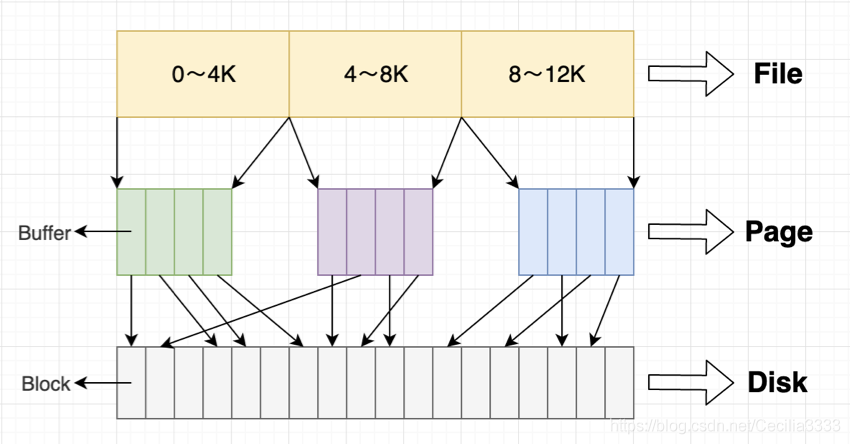
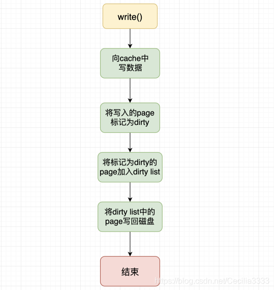
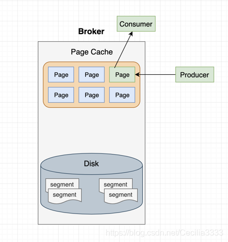
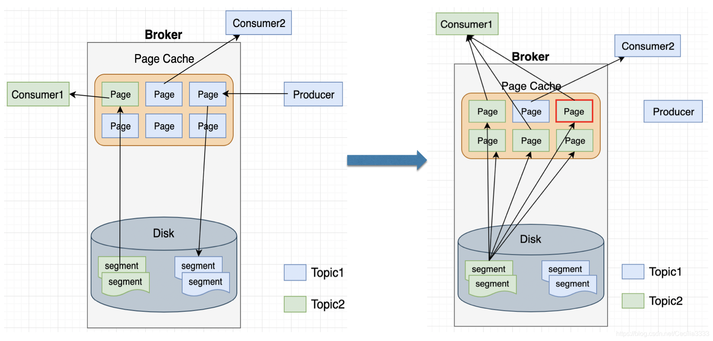

# Page Cache

## 定义

中文名称：页高速缓冲存储器，简称页高缓。

单位：页。

大小：动态变化，因为操作系统会将所有未直接分配给应用程序的物理[内存](https://so.csdn.net/so/search?q=内存&spm=1001.2101.3001.7020)都用于页面缓存。   

文件系统层级的缓存：page cache用于缓存文件的页数据，从磁盘中读取到的内容是存储在page cache里的。

## 结构

在 Linux 的实现中，文件 Cache 分为两个层面，一是 Page Cache，另一个是 Buffer Cache（块缓存）。page cache用于缓存文件的页数据，大小通常为4K；Buffer cache用于缓存块设备（如磁盘）的块数据，大小通常为1K。

在Linux2.4版本的内核之前，page cache和buffer cache是完全分离的。但是块设备大多数是磁盘，磁盘上的数据又大多通过文件系统来组织，这种设计导致很多数据被缓存了两次，浪费内存空间。
所以在2.4版本内核之后，两块内存近似融合在了一起，如果一个文件的页加载到了page cache，那么buffer cache只需要维护块指向页的指针。

在2.6版本内核中，page cache和buffer cache进一步结合。每一个 Page Cache 包含若干 Buffer Cache。

将文件一页一页缓存到page cache中，buffer cache里面的指针指向磁盘block。

2.6内核中的buffer cache和page cache在处理上是保持一致的，但是存在概念上的差别，page cache是针对文件的cache，buffer是针对磁盘块数据的cache，仅此而已。

## 读cache

当内核发起一个读请求时（例如进程发起read()请求），首先会检查请求的数据是否缓存到了page cache中。如果有，那么直接从内存中读取，不需要访问磁盘，这被称为cache命中（cache hit）。如果cache中没有请求的数据，即cache未命中（cache miss），就必须从磁盘中读取数据。然后内核将读取的数据缓存到cache中，这样后续的读请求就可以命中cache了。

## **写cache**

当内核发起一个写请求时（例如进程发起write()请求），直接往cache中写入。内核会将被写入的page标记为dirty，并将其加入dirty list中。内核会周期性地将dirty list中的page写回到磁盘上，从而使磁盘上的数据和内存中缓存的数据一致。 

## **Kafka对page cache的利用**

Kafka处理message速度快的原因之一就是使用了page cache。

当Producer和Consumer速率相差不大的情况下，Kafka几乎可以完全实现不落盘就完成信息的传输。

上图表示的就是一种理想化的场景。如果Kafka producer的生产速率与consumer的消费速率相差不大，他们之间的lag相差很小，访问的是page cache中的同一个page。那么就能几乎只靠对broker page cache的读写来完成整个生产-消费过程，磁盘访问非常少。

## page cache污染

本文介绍的是最经典的一种page cache受污染的情景，即滞后consumer发送的fetch请求。

滞后consumer包含两种，一种是从头开始消费的consumer，另一种是长时间追不上producer进度的consumer。

滞后consumer 要读取的数据大概率不在page cache中，所以必然要先将数据从磁盘加载到page cache中。

如图中所示，Producer生产数据，consumer2消费数据，但他们之间有一定的lag，所以访问的是不同的page。假设consumer1从topic partition最初的offset开始消费（from --beginning），会触发大量读盘操作。数据从磁盘缓存到page cache中，五个topic1的page数据（蓝色）被topic2的数据（绿色）填充了。另一方面，producer刚刚生产的数据也被冲掉了。若consumer2读取到了producer刚刚生产的数据，则要将其再次从磁盘读取到page cache中。

consumer1读取的“冷”数据进入page cache，污染了多数正常consumer要读取的“热”数据（consumer2），连带着正常consumer的性能变差。本来可以服务于写操作的磁盘现在要读取数据了。