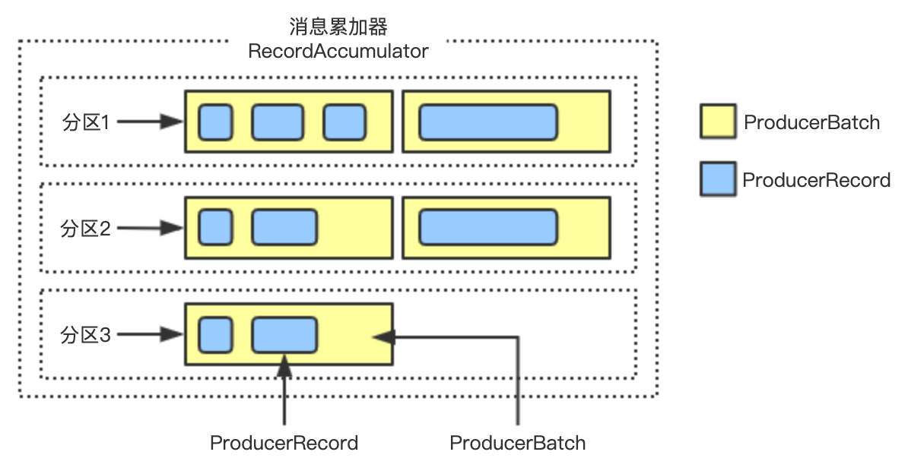

# kafka生产者消息发送过程

生产者客户端代码

```java
public class SzzTestSend {

    public static final String bootStrap = "xxxxxx:9090";
    public static final String topic = "t_3_1";

    public static void main(String[] args) {
        Properties properties = new Properties();
        properties.put(ProducerConfig.BOOTSTRAP_SERVERS_CONFIG,bootStrap);
        // 序列化协议  下面两种写法都可以
        properties.put(ProducerConfig.KEY_SERIALIZER_CLASS_CONFIG, StringSerializer.class.getName());
        properties.put(ProducerConfig.VALUE_SERIALIZER_CLASS_CONFIG,"org.apache.kafka.common.serialization.StringSerializer");
        //过滤器 可配置多个用逗号隔开
        properties.put(ProducerConfig.INTERCEPTOR_CLASSES_CONFIG,"org.apache.kafka.clients.producer.SzzProducerInterceptorsTest");
        //构造 KafkaProducer
        KafkaProducer producer = new KafkaProducer(properties);
        //  发送消息, 并设置 回调(回调函数也可以不要)
        ProducerRecord<String,String> record = new ProducerRecord(topic,"Hello World!");
        try {
            producer.send(record,new SzzTestCallBack(record.topic(), record.key(), record.value()));
        }catch (Exception e){
            e.printStackTrace();
        }
    }

    /**
     * 发送成功回调类
     */
    public static class SzzTestCallBack implements Callback{
        private static final Logger log = LoggerFactory.getLogger(SzzTestCallBack.class);
        private String topic;
        private String key;
        private String value;

        public SzzTestCallBack(String topic, String key, String value) {
            this.topic = topic;
            this.key = key;
            this.value = value;

        }
        public void onCompletion(RecordMetadata metadata, Exception e) {
            if (e != null) {
                log.error("Error when sending message to topic {} with key: {}, value: {} with error:",
                        topic, key,value, e);
            }else {
                log.info("send message to topic {} with key: {} value:{} success, partiton:{} offset:{}",
                        topic, key,value,metadata.partition(),metadata.offset());
            }
        }
    }
}
```

## 构造KafkaProducer

KafkaProducer通过解析 `producer.propeties` 文件里面的属性来构造自己。 例如 ：分区器、Key和Value[序列化](https://so.csdn.net/so/search?q=序列化&spm=1001.2101.3001.7020)器、拦截器、 [RecordAccumulator消息累加器](https://link.juejin.cn/?target=https%3A%2F%2Fwww.szzdzhp.com%2Fkafka%2Ftheory%2Frecord-accumulator.html) 、元信息更新器、启动发送请求的后台线程

```java
//构造 KafkaProducer
KafkaProducer producer = new KafkaProducer(properties);
```

### 生产者元信息更新器

我们之前有讲过. 客户端都会保存集群的元信息,例如生产者的元信息是 ProducerMetadata. 消费组的是ConsumerMetadata 。

元信息都会有自己的自动更新逻辑, 详细请看 Kafka的客户端发起元信息更新请求

相关的Producer配置有:

| 属性                | 描述                                                         | 默认          |
| :------------------ | :----------------------------------------------------------- | :------------ |
| metadata.max.age.ms | 即使我们没有看到任何分区领导层更改以主动发现任何新代理或分区，我们也强制刷新元数据的时间段（以毫秒为单位）。。 | 300000(5分钟) |
| retry.backoff.ms    | 如果上次更新失败,发起重试的间隔时间                          | 100           |

虽然Producer元信息会自动更新, 但是有可能在生产者发送消息的时候,发现某个TopicPartition不存在,这个时候可能就需要立刻发起一个元信息更新了。

### 生产者拦截器

生产者拦截器在消息发送之前可以做一些准备工作, 比如 按照某个规则过滤某条消息, 又或者对 消息体做一些改造, 还可以用来在发送回调逻辑之前做一些定制化的需求,例如统计类的工作! 拦截器的执行时机在最前面,在 **消息序列化** 和 **分区计算** 之前

相关的Producer配置有:

| 属性                | 描述                                                         | 默认 |
| :------------------ | :----------------------------------------------------------- | :--- |
| interceptor.classes | 生产者拦截器配置,填写全路径类名,可用逗号隔开配置多个,执行顺序就是配置的顺序。 | 空   |

### 生产者分区器

用来设置发送的消息具体要发送到哪个分区上

相关的Producer配置有:

| 属性              | 描述               | 默认值                                                       |
| :---------------- | :----------------- | :----------------------------------------------------------- |
| partitioner.class | 消息的分区分配策略 | org.apache.kafka.clients.producer.internals.DefaultPartitioner |

### Sender线程启动

Sender是专门负责将消息发送到Broker的I/O线程。

相关的Producer配置有:


## 发送请求

```java
producer.send(record,new SzzTestCallBack(record.topic(), record.key(), record.value()));
```

### 生产者拦截器

发送消息的第一步就是执行拦截器


一般情况下我们可能不需要拦截器, 但是我们需要用拦截器的时候按照下面操作执行:

```
interceptor.classes=拦截器1,拦截器2,拦截器3
org.apache.kafka.clients.producer.ProducerInterceptor<K, V>
```

这个 `interceptor.classes` 中的属性可以配置多个拦截器, 用逗号隔开,并且执行顺序就是按照配置的顺序执行的。

拦截器的执行时机在最前面,在 **消息序列化** 和 **分区计算** 之前

ProducerInterceptor

`org.apache.kafka.clients.producer.ProducerInterceptor<K, V>` 接口方法讲解：

```java
public ProducerRecord<K, V> onSend(ProducerRecord<K, V> record);

public void onAcknowledgement(RecordMetadata metadata, Exception exception);

public void close();
```

onSend(ProducerRecord record)方法 :

当客户端将记录发送到 KafkaProducer 时，在键和值被序列化之前调用。 该方法调用 ProducerInterceptor.onSend(ProducerRecord) 方法。 从第一个拦截器的 onSend() 返回的 ProducerRecord 传递给第二个拦截器 onSend()，在拦截器链中依此类推。 从 最后一个拦截器返回 的记录就是从这个方法返回的。 此方法 不会抛出异常 。 任何拦截器方法抛出的异常都会被捕获并忽略。 如果链中间的拦截器（通常会修改记录）抛出异常，则链中的下一个拦截器将使用前一个未抛出异常的拦截器返回的记录调用。调用地方


①. 拦截器执行时机在 键值序列化 之前 ②. 拦截器抛出异常会被捕获,并打印日志,那么也意味着这个拦截器所做的修改不会生效 ③.拦截器中修改的消息体会被传递到下一个拦截器

onAcknowledgement(RecordMetadata metadata, Exception exception)方法:

当发送到服务器的记录已被确认时，或者当发送记录在发送到服务器之前失败时，将调用此方法。 此方法通常 在用户设置的Callback之前调用 ，此方法不会抛出异常。 任何拦截器方法抛出的异常都会被捕获并忽略。这个方法运行在Producer的I/O线程中,所以这个方法中的代码逻辑需要越简单越好。 否则，来自其他线程的消息发送可能会延迟。

参数： metadata – 已发送记录的元数据（即分区和偏移量）。 如果发生错误，元数据将只包含有效的主题和分区。 如果 ProducerRecord 中没有给出 partition 并且在分配 partition 之前发生错误，则 partition 将设置为 RecordMetadata.NO_PARTITION。 如果客户端将空记录传递给KafkaProducer.send(ProducerRecord)则元数据可能为空。 exception – 在处理此记录期间抛出的异常。 如果 没有发生错误，则为空 。

close()

主要用于在关闭拦截器时自行一些资源清理工作。

configure(Map<String, ?> configs)

`ProducerInterceptor` 接口中集成了一 `Configurable` 接口,接口有个方法

```java
void configure(Map<String, ?> configs);
```

也就是说在拦截器中,我们可以拿到所有的配置属性了; 这个方法在这几个方法中最早执行

生产者拦截器示例

将发送的消息加上后缀注意这里消息value的类型是 `String` ，如果是byte则需要处理一下

```java
@Override
public ProducerRecord<String, String> onSend(ProducerRecord<String, String> record) {
  System.out.println("生产者拦截器 onSend()  run ."+record);
  return new ProducerRecord<>(
    record.topic(), record.partition(), record.key(), record.value().concat("_后缀"));    }

@Override
public void onAcknowledgement(RecordMetadata metadata, Exception exception) {
  System.out.println("生产者拦截器 onAcknowledgement run ."+metadata.toString() +" exception:"+exception);
}
@Override
public void close() {
  System.out.println("生产者拦截器 close()  run .");
}

@Override
public void configure(Map<String, ?> configs) {
  this.configs = configs;
  System.out.println("生产者拦截器 configure  run ."+configs);
}
```

### 更新元信息waitOnMetadata

在发送消息之前,要先获取一下将要发送的TopicPartition的元信息。这个获取元信息的请求也是通过唤醒 Sender 线程进行发送的。

1 . ProducerMetadata 元信息 Map<String, Long> topics 中保存 Topic 的有效期时间, metadata.max.idle.ms 控制,默认 300000 2. ProducerMetadata 元信息 Set<String> newTopics 中保存所有 Topic 3. 获取 Topic的 元数据集群 以及我们等待的时间（以毫秒为单位）, 这个获取元数据不是这里获取的,这里只是判断当前是否已经获取到了元数据,如果没有获取到,则一直等待,最大等待时间由 max.block.ms 控制,默认60000(1分钟),关于获取元数据在最上面已经分析过了, 是Sender线程获取并更新的。如果等待时间超过了 max.block.ms ,很有可能网络异常,那么会抛出超时异常。 4. 当你发送消息的时候指定了 分区号 , 但是这个分区号是不存在的, 这个时候就会一直发起 Metadata 请求(流程看最上面), 直到超时( max.block.ms )之后 抛出异常

```
org.apache.kafka.common.errors.TimeoutException: Topic t_3_1 not present in metadata after 60000 ms.
```

相关的Producer配置有:


KafkaProducer producer = new KafkaProducer(properties); 在构建 KafkaProducer 对象的时候, 有构建 producer I/O thread , 并且启动了, Runnable 是 sender

最终调用 NetworkClient.poll(long timeout, long now) 里面 maybeUpdate() 方法 这个方法会获取 前Node中负载最少的节点发起网络请求, 如果所有Node都是满负载则请求不会被发起。

如何判断哪个节点负载最少？

通过每个节点的 InFlightRequests(空中请求数量) 里面的最小数量判断,这个表示当前正在发起的请求,但是还没有收到回复的请求数量; 保存形式是一个HashMap, key 是Node的Id, value 是所有当前还在请求中的节点; 当请求完成,请求就会在这个队列里面移除; 如果这个队列一直是满的,说明当前负载很高或者网络连接有问题。如果所有Node都是满负载则请求不会被发起，除非等到队列数量减少。

```java
private final Map<String, Deque<NetworkClient.InFlightRequest>> requests = new HashMap<>();
```

每个Node最大负载数 ？

每个客户端在发起请求还没有收到回复的时候都会被缓存到 InFlightRequests(空中请求数量) 里面,但是这个数量是有限制的,这个可以通过配置 max.in.flight.requests.per.connection 进行设置, 默认是: 5; 也就是每个客户端对每个Node最多也就同时发起 5 个未完成的请求; 如果超时这个数量就会等待有请求完成并释放额度了才可以发起新的请求；

相关的Producer配置有:

| 属性                                  | 描述                                     | 默认 |
| :------------------------------------ | :--------------------------------------- | :--- |
| max.in.flight.requests.per.connection | 每个客户端对每个Node发起请求的最大并发数 | 5    |

### KeyValue序列化

将key和Value先序列化。

自定义序列化器,需要实现 `org.apache.kafka.common.serialization.Serializer` 接口。 我们简单看下 `StringSerializer` 序列化器

```java
public class StringSerializer implements Serializer<String> {
    private String encoding = "UTF8";

    @Override
    public void configure(Map<String, ?> configs, boolean isKey) {
        String propertyName = isKey ? "key.serializer.encoding" : "value.serializer.encoding";
        Object encodingValue = configs.get(propertyName);
        if (encodingValue == null)
            encodingValue = configs.get("serializer.encoding");
        if (encodingValue instanceof String)
            encoding = (String) encodingValue;
    }

    @Override
    public byte[] serialize(String topic, String data) {
        try {
            if (data == null)
                return null;
            else
                return data.getBytes(encoding);
        } catch (UnsupportedEncodingException e) {
            throw new SerializationException("Error when serializing string to byte[] due to unsupported encoding " + encoding);
        }
    }
}
```

configure(Map<String, ?> configs, boolean isKey)这个方法是在构造 KafkaProduce 实例的时候调用的。 isKey 表示是 key还是value来进行序列化 这里 serialize(String topic, String data) 方法直接将字符串转换成byte[]类型。

Kafka客户端提供了很多种序列化器供我们选择,如果这些序列化器你都不满意,你也可以选择其他一些开源的序列化工具,或者自己进行实现。

### 计算分区号

将序列化后的key、 value 调用合适的分区器选择将要发送的分区号。

[分区三种策略](https://link.juejin.cn/?target=https%3A%2F%2Fshirenchuang.blog.csdn.net%2Farticle%2Fdetails%2F122962963)

### 将消息缓存进RecordAccumulator累加器中（看不懂直接看总结）

[图解Kafka Producer中的消息缓存模型](https://link.juejin.cn/?target=https%3A%2F%2Fshirenchuang.blog.csdn.net%2Farticle%2Fdetails%2F123376411)

程序中调用kafka生产者发送消息，并不是每调用一次send方法，就直接将消息通过底层网络发送给broker了，而是会将多个消息形成一个批次，然后再以批次的形式，发送给broker，当然了，消息的发送也不是由生产者线程发送的。那么，kafka的消息如何形成一个批次，以及批次的形式，这个就是消息累加器的作用。

下面从源码的角度来看下消息累加器是如何处理消息的，并且还会和分区器一起搭配使用，下面这个方法是doSend方法的实现逻辑，这里只截取和累加器相关的代码部分

```java
//前面代码省略
RecordAccumulator.RecordAppendResult result = accumulator.append(tp, timestamp, serializedKey,
        serializedValue, headers, interceptCallback, remainingWaitMs, true);

if (result.abortForNewBatch) {
    int prevPartition = partition;
    partitioner.onNewBatch(record.topic(), cluster, prevPartition);
    partition = partition(record, serializedKey, serializedValue, cluster);
    tp = new TopicPartition(record.topic(), partition);
    if (log.isTraceEnabled()) {
        log.trace("Retrying append due to new batch creation for topic {} partition {}. The old partition was {}", record.topic(), partition, prevPartition);
    }
    // producer callback will make sure to call both 'callback' and interceptor callback
    interceptCallback = new InterceptorCallback<>(callback, this.interceptors, tp);

    result = accumulator.append(tp, timestamp, serializedKey,
        serializedValue, headers, interceptCallback, remainingWaitMs, false);
}

if (transactionManager != null && transactionManager.isTransactional())
    transactionManager.maybeAddPartitionToTransaction(tp);

if (result.batchIsFull || result.newBatchCreated) {
    log.trace("Waking up the sender since topic {} partition {} is either full or getting a new batch", record.topic(), partition);
    this.sender.wakeup();
}
return result.future;
```

在对消息的key、value进行序列化后，并且根据分区器选择好分区之后，会调用累加器的append方法，因此，重点关注下append方法的实现逻辑

```java
/**
@param abortOnNewBatch，这个参数的作用是，是否放弃使用新的批次，每个分区都会对应一个双向队列，
每个队列的元素是一个批次，当有新消息时，会取出队列的最后一个元素，并将消息累加到该批次中，假如批次的容量达到上限了，那么新消息默认需要生成一个新的批次，
再重新添加到双向队列中，如果参数为true，表示在这种情况下，放弃使用新的批次
*/
public RecordAppendResult append(TopicPartition tp,
                                 long timestamp,
                                 byte[] key,
                                 byte[] value,
                                 Header[] headers,
                                 Callback callback,
                                 long maxTimeToBlock,
                                 boolean abortOnNewBatch) throws InterruptedException {
    //每调用一次append方法，都会被记录下来
    appendsInProgress.incrementAndGet();
    ByteBuffer buffer = null;
    if (headers == null) headers = Record.EMPTY_HEADERS;
    try {
        // 取出分区对应的双向队列，若没有，则生成一个新的队列，并放入到map中
        Deque<ProducerBatch> dq = getOrCreateDeque(tp);
        synchronized (dq) {
            if (closed)
                throw new KafkaException("Producer closed while send in progress");
           //试图将消息添加到队列的最后一个批次元素中，若添加成功，那么方法直接返回
            RecordAppendResult appendResult = tryAppend(timestamp, key, value, headers, callback, dq);
            if (appendResult != null)
                return appendResult;
        }

        //当添加失败时，若参数指定为true，那么方法会直接返回，不会创建新的批次。
//外层方法第一次调用append方法时传的参数为true，
//主要是因为,kafka的发送者线程（区别于生产者线程）以一个批次为发送基本单位，因此为了让消息尽量多的累加到一个批次，
//当第一次无法往分区队列的最后一个批次累加时，优先选择另一个分区的队列批次。
        if (abortOnNewBatch) {
            // Return a result that will cause another call to append.
            return new RecordAppendResult(null, false, false, true);
        }
        //计算此次消息需要的内存大小
        byte maxUsableMagic = apiVersions.maxUsableProduceMagic();
        int size = Math.max(this.batchSize, AbstractRecords.estimateSizeInBytesUpperBound(maxUsableMagic, compression, key, value, headers));
        log.trace("Allocating a new {} byte message buffer for topic {} partition {}", size, tp.topic(), tp.partition());
        buffer = free.allocate(size, maxTimeToBlock);
        synchronized (dq) {
            // 再次检查生产者线程是否关闭了
            if (closed)
                throw new KafkaException("Producer closed while send in progress");
            //这边为何又要重新尝试append，因此当有多个线程并发的往同一分区累加消息，
//可能另一个线程已经生成好一个新的批次对象，并加入到双向队列中了，
//因而这边需要再次尝试append数据，而不是直接生成新的批次对象
            RecordAppendResult appendResult = tryAppend(timestamp, key, value, headers, callback, dq);
            if (appendResult != null) {
                // Somebody else found us a batch, return the one we waited for! Hopefully this doesn't happen often...
                return appendResult;
            }
            //若尝试append失败之后，这里才开始真正的构建新的批次对象，并加入到双向队列之中
            MemoryRecordsBuilder recordsBuilder = recordsBuilder(buffer, maxUsableMagic);
            ProducerBatch batch = new ProducerBatch(tp, recordsBuilder, time.milliseconds());
            FutureRecordMetadata future = Objects.requireNonNull(batch.tryAppend(timestamp, key, value, headers,
                    callback, time.milliseconds()));

            dq.addLast(batch);
//每个批次还未添加到一个未完成的集合中，因此这些批次还未发送和得到broker的确认
            incomplete.add(batch);

            // Don't deallocate this buffer in the finally block as it's being used in the record batch
            buffer = null;
            return new RecordAppendResult(future, dq.size() > 1 || batch.isFull(), true, false);
        }
    } finally {
        if (buffer != null)
            free.deallocate(buffer);
        appendsInProgress.decrementAndGet();
    }
}
```

append方法的返回对象RecordAppendResult包含以下几个

```java
public final FutureRecordMetadata future;//消息记录的元数据信息
public final boolean batchIsFull;  //批次是否满了或者队列是否不为空
public final boolean newBatchCreated;//是否新创建的批次
public final boolean abortForNewBatch;//放弃使用新的批次，表示消息往分区append失败，需要重新append
```

其中abortForNewBatch决定doSend方法中是否再次调用append方法

```java
if (result.abortForNewBatch) {
    int prevPartition = partition;
    partitioner.onNewBatch(record.topic(), cluster, prevPartition);
    partition = partition(record, serializedKey, serializedValue, cluster);
    tp = new TopicPartition(record.topic(), partition);
    if (log.isTraceEnabled()) {
        log.trace("Retrying append due to new batch creation for topic {} partition {}. The old partition was {}", record.topic(), partition, prevPartition);
    }
    // producer callback will make sure to call both 'callback' and interceptor callback
    interceptCallback = new InterceptorCallback<>(callback, this.interceptors, tp);

    result = accumulator.append(tp, timestamp, serializedKey,
        serializedValue, headers, interceptCallback, remainingWaitMs, false);
}
```

上述方法体中，会调用分区器的onNewBatch方法，设置一个新的分区对应的粘性分区，然后往新的分区append数据，这里为何要使用新的分区，原因在上述append方法实现中解释过了。

当批次是满的或者是新创建时，doSend方法会唤醒发送者线程。这里有个地方需要注意的是，kafka生产者线程和发送者线程是分开的，生产者线程负责往底层的队列中添加消息的批次对象，而发送者线程不断从队列中取出消息批次来发送给broker，实现了消息的构造和发送解耦。

### Sender发送消息

Sender线程在构造KafkaProducer的时候就已经启动了,它的职责就是从

以下忽略部分代码省略

```java
void runOnce() {
  long currentTimeMs = time.milliseconds();
  long pollTimeout = sendProducerData(currentTimeMs);
  client.poll(pollTimeout, currentTimeMs);
}

private long sendProducerData(long now) {

  // 获取哪些数据准备好了发送
  RecordAccumulator.ReadyCheckResult result = this.accumulator.ready(cluster, now);

}
```

寻找准备好发送的消息Batch,获取对应Leader所在的ReadyNode

我们都知道生产者生产的消息是暂时缓存在消息累加器RecordAccumulator中的, Sender负责从RecordAccumulator里面获取准备好的数据进行发送

那么 ，哪些属于准备好的数据呢？

我们先回顾一下 RecordAccumulator的结构。


每个TopicPartition的消息都会被暂存在ProducerBatch Deque 阻塞队列中的其中一个ProducerBatch中,每个ProducerBatch都存放着一条或者多条消息。

具体请看 图解Kafka Producer 消息缓存模型

满足发送的条件的Batch

遍历每个TopicPartition里面的Deque, 获取队列中的第一个 ProducerBatch 如果该TopicPartition不存在Leader,则忽略该Batch ,如果有则进入判断流程
因为消息是要发Leader所在的Broker发送的, 所以必须要有Leader。

在满足条件

不属于重试或者属于重试并且等待的时候大于 retry.backoff.ms 的前提下,满足下面条件的均可发送

（该条件就是要排除那些是属于重试,但是还没有到达重试间隔时间的情况。）

该ProducerBatch还没有被发送过. 该Batch能否发送判断条件如下

如果该Batch满了或者Batch所在的Deque数量>1(数量大于1说明第一个Batch肯定就满了) 则满足发送条件


如果消息累加器中内存用完了，有线程阻塞等待写入消息累加器 则也满足发送条件


RecordAccumulator消息累加器被关闭,满足条件;（一般KafkaProducer被正常关闭的时候会先将累加器标记为已经关闭,方便让累加器里面的消息都发出去）

是否被强制将消息发送出去。消息累加器RecordAccumulator提供强制 flush() 方法供调用,用于 该时刻的消息 都满足发送的条件,一般在消息事务的地方有调用。 这里要注意的是,是调用 flush() 这一时刻的所有未发送的Batch都需满足发送条件,后面新增的Batch不属于这一范畴

该Batch的创建时间> linger.ms 的时间


获取可发送请求的服务端ReadyNodes

上面是讲哪些Batch属于可发送的逻辑判断,但是实际上,真正发送的时候并不是以每个Batch维度来判断发送的,而是以Node维度来发送的,上面我们知道了哪些Batch能够发送,然后我们就可以推断出Batch对应的TopicPartition所属的Broker。有了这些可发送的Broker,然后再来遍历Broker上的每个TopicPartition中的First Batch

**文字不好理解,我们看看下图**


上图是生产者的 RecordAccumulator 消息累加器, 消息累加成上图所示。

每个TopicPartition队列都有很多Batch, 我们知道了TopicPartition 是不是就能够确定它所在的Broker？

例如上图中

Topic1Partition-1、 Topic1Partition-2 、Topic2Partition-0他们三个的Leader都存在于 Broker-0 中 虽然 Topic2Partition-0 队列中不满足发送逻辑, 但是跟他同一个Broker中有其他的队列满足条件了,所以它最终也是满足发送条件的。

Topic2Partition-1Leader在Broker-1中,但是它不满足发送条件,这个Broker中也没有其他的满足条件了,所以客户端不会向Broker-1这个Node发起请求。

Topic1Partition-3Leader在Broker-2中,它满足发送条件,那么Broker-2就满足发送条件

那么最终得到的 ReadyNodes 就是Broker-0、Broker-2

强制更新没有Leader的Topic元信息

上面我们在获取 哪些Batch准备好发送的时候,也会找到哪些TopicPartition没有Leader。

那么这个时候就需要强制的去更新一下这些TopicPartition的元信息了,否则就发送不了。

过滤一些还未准备好连接的ReadyNodes

上面我们已经获取了 ReadyNodes

那么在真正的向对应的 ReadyNodes 发起请求之前, 我们还是需要判断一下 我们的生产者客户端是否准备好了跟 ReadyNodes 发起请求.

那么客户端的准备条件有哪些呢？

生产者客户端在最开始的时候都没有跟任何Node建立连接的, 当我们尝试发送之前会去检验一下连接是否建立成功(就是当前这一步), 如果没有的话,则会去尝试建立连接。并且当前这次是会把这个Node过滤掉的,因为还没有建立成功链接,等到下一次循环的时候,可能已经建立成功了。

当然客户端是否准备好,不仅仅是判断 连接是否建立成功。

还需要判断 当前未完成的请求队列数量是否 < max.in.flight.requests.per.connection

遍历ReadNodes上的所有TopicPartition阻塞队列中的FirstBatch进行打包

到现在为止,我们已经得到了可以发送请求的 ReadyNodes 了。那么接下来就是分别解析这些ReadyNode 他们能够发送的Batch打包发送了。

这一步最重要的作用是将 ProducerBatch 跟Node映射,也就是知道当前批次想哪个Broker发送哪些Batch

```java
public Map<Integer, List<ProducerBatch>> drain(Cluster cluster, Set<Node> nodes, int maxSize, long now) {
  if (nodes.isEmpty())
    return Collections.emptyMap();
  // 遍历ReadyNodes 每个Node下的队列都获取一遍
  Map<Integer, List<ProducerBatch>> batches = new HashMap<>();
  for (Node node : nodes) {
    List<ProducerBatch> ready = drainBatchesForOneNode(cluster, node, maxSize, now);
    batches.put(node.id(), ready);
  }
  return batches;
}
```

那么应该选择哪些Batch来发送呢？

遍历每个ReadyNode节点下面的每个TopicPartition 队列的首个Batch

```
retry.backoff.ms
max.request.size
```

构造Produce请求并发起接着处理Response

上面我们已经得到了

```
Map<Integer, List<ProducerBatch>> batches
```

也就是Node.id 和对应要发往该Node的Request请求携带的ProducerBatch列表。

发送成功之后,会返回Response,根据Response情况处理不同的逻辑

Response处理逻辑 每个Batch都会对应着一个 PartitionResponse , 不同的PartitionResponse对应的不同处理逻辑。

1. 如果Response返回RecordTooLargeException异常,并且Batch里面的消息数量>1.这种情况, 就会尝试的去拆分Batch, 如何拆分呢？ 是以 batch.size 大小来拆分成多个Batch。并且重新放入到消息累加器中。
2. 如果返回是其他异常则先判断一下是否能够重试，如果能够重试,则重新入队到消息累加器中。重新入队的Batch会记录重试次数和时间等等信息。是否能够重试判断逻辑：batch没有超过 delivery.timeout.ms && 重启次数< retiries
3. 如果是DuplicateSequenceException异常的话,那么并不会做其他的处理，而是当做正常完成。
4. 其他异常或者没有异常则会走正常流程, 并且调用 InterceptorCallback ,如果有Exception也会返回。这个InterceptorCallback里面包含在拦截器 interceptors 和 userCallback (用户自己的回调)。调用顺序如下图：


这个usercallback呢就是我们自己设置的，例如： 

```
producer.send(record,new SzzTestCallBack(record.topic(), record.key(), record.value()));
```

注意: 这里的回调并不是指的一个Batch一个回调,这里是一个Batch里面有多少条消息,就有多少个回调。每个ProducerBatch里面都有一个对象专门保存所有消息的回调信息 thunks . 在处理ProducerBatch返回信息的时候会遍历这个trunks, 来执行每个消息的回调。
假如你想确定某个消息是否发送成功, 那么你可以自己定义一个拦截器。 并重写接口 onAcknowledgement(RecordMetadata metadata, Exception exception) 在这里面来判断你的消息是否发送成功。

### 总结

服务端的完整过程与架构


消息累加器

其实，整个生产者客户端是由两个线程协调运行的，一个是主线程Producer线程，一个是Sender线程。由主线程生产消息，然后缓存到消息累加器（RecordAccumulator）；而Sender线程则负责从消息累加器中不断获取消息，然后发送到kakfa broker。这个过程大致如下图：


那为什么需要消息累加器呢？直接发送不是更直接？其实主要是用来缓存消息以便Sender线程可以每次批量发送，从而减少网络传输的资源消耗；而数据到服务端，服务端也可以批量写操作，从而减少磁盘I/O资源消耗，可以提升性能。这个设计，也可以运用于我们平时的业务需求场景开发中。

那么消息累加器中的结构是怎样的呢？消息累加器的内部为每个区分维护一个双端队列Deque，队列的内容是ProducerBatch；而ProducerBatch包含了一个或者多个ProducerRecord消息。

```
ConcurrentMap<TopicPartition, Deque<RecordBatch>> batches;
```

具体结构如下图：



消息Record写入到消息累加器时，会被追加到双端队列的尾部。而尾部的ProducerBatch剩余可用空间也意味着能否再写入本次的这条消息ProducerRecord。ProducerBatch的大小和batch.size参数有着密切的关系。batch.size的参数大小控制着ProducerBatch的大小，默认是16KB大小。


整个过程是这样的：

1. 消息写入到消息累加器时，先寻找其对应分区的双端队列（如果不存在则新建队列）
2. 从双端队列的尾部获取一个ProducerBatch对象（如果不存在则新建Batch对象）
3. 判断ProducerBatch是否还有剩余空间写入本次的消息Record，如果可以则写入（如果不可以则需要创建一个新的ProducerBatch对象）
4. 新建ProducerBatch对象时会评估这条消息的大小是否超过batch.size参数的大小，如果不超过则以batch.size参数大小创建Batch对象（如果超过，就以消息的评估大小创建新Batch对象）。而用batch.size创建的内存空间是会被BufferPool管理的，可以进行空间复用；而超过batch.size创建的内存空间则不会被复用，使用完成则被回收。

而整个消息累加器的缓存空间与buffer.memory参数有关。默认是32MB大小。如果生产者客户端需要向很多区分发送比较多的消息，则可以根据实际情况将此参数适当调大以增加整体的吞吐量。

（当超过该数值之后，生产者客户端便不能再向这个连接发送更多的请求了）我也不知道这句是咋来的，评论区里说的，具体这个数值指什么我也不知道

## 发送流程总结

### Kafka Producer 整体架构图

整个生产者客户端是由 **主线程** 和 **Sender线程** 协调运行的, 主线程创建消息, 然后通过 **拦截器** 、 **元信息更新** 、 **序列化** 、 **分区器** 、 **缓存消息** 等等流程。

然后Sender线程在初始化的时候就已经运行了,并且是一个while循环。

Sender线程里面主要工作是：

寻找ReadyNodes:去消息累加器里面获取有哪些Node是能够发送Request的。只要该Node有一个TopicPartition队列中有符合发送条件的Batch。那么这个Node就应该是ReadyNode。具体的筛选逻辑请看上文有具体分析。

构建Request:过滤之后, 拿到了所有的ReadyNodes。接下来就是遍历该Node下所有的TopicPartition队列里面的 FirstBatch , 组装到Request请求里面。发往一个Node的请求Request,可以包含多个 ProducerBatch ，能够一次发送多少个Batch是由配置 max.request.size 决定的，一个Node对应一个Request。 注意: 这个时候映射关系已经是 Map<Node,Reqeust>

将Request放入inFightRequest中:上面是组装好了Request, 组装好了之后要先把这个Request放到 inFightRequest 对象中, 它保存着每个Node当前已经发送的Request但是还没有收到Response的请求。每个Node最多能够存放多少个未完成的Request,是由 max.in.flight.requests.per.connection 控制的。需要注意的是, 如果队列已经满了, Request是放入不了这个对象里面的,并且会抛出异常:

```
"Attempt to send a request to node " + nodeId + " which is not ready."
```

它决定着生产者针对某个Node的并发度。

Request通过Selector发起通信.

返回Response：服务端处理完成, 返回Response信息。

从inFightRequest中移除完成Request

释放内存回消息累加器：请求结束,清理 消息累加器 ，将发送成功的ProducerBatch占用的内存大小加回到 消息累加器 中。 注意：这里纯粹的是数字的加减,不涉及内存的处理, 因为发送成功之前的Batch占用了 消息累加器 的剩余可用内存。发送成之后要加回来。否则消息累加器满了会导致阻塞。