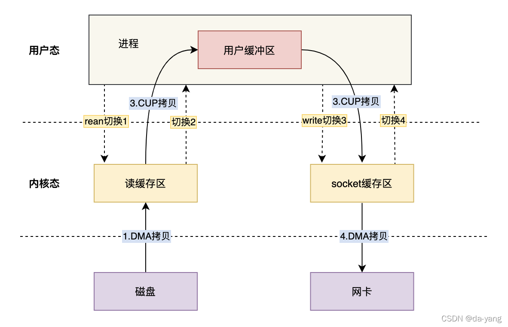
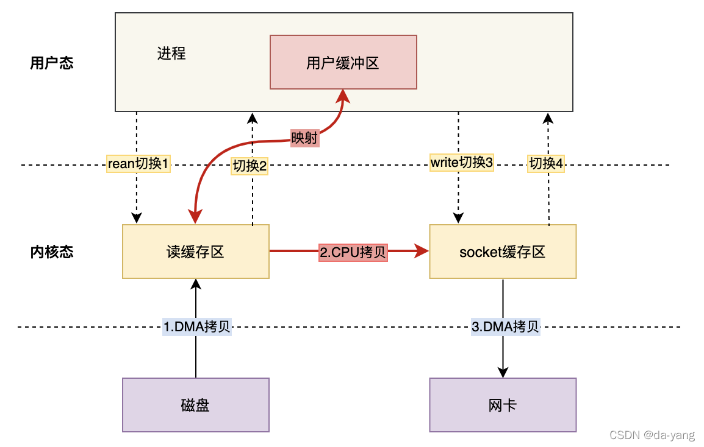

# 零拷贝技术

## **1.前言**

[Linux](http://www.elecfans.com/tags/linux/)系统中一切皆文件，仔细想一下Linux系统的很多活动无外乎**读操作**和**写操作**，零拷贝就是为了提高读写性能而出现的。

## **2. 数据拷贝基础过程**

在Linux系统内部缓存和内存容量都是有限的，更多的数据都是存储在磁盘中。对于Web服务器来说，经常需要从磁盘中读取数据到内存，然后再通过网卡传输给[用户](https://www.elecfans.com/v/user/)：

上述数据流转只是大框，接下来看看几种模式。

### **2.1 仅[CPU](http://www.elecfans.com/tags/cpu/)方式**

- 当应用程序需要读取磁盘数据时，调用re[ad](https://dfm.elecfans.com/uploads/software/hqdfm.zip?neilian)()从用户态陷入内核态，read()这个系统调用最终由CPU来完成；
- 
- 磁盘将数据放到磁盘缓冲区之后，向CPU发起I/O中断，报告CPU数据已经Ready了；
- CPU收到磁盘控制器的I/O中断之后，开始拷贝数据，完成之后read()返回，再从内核态切换到用户态；

### **2.2 CPU&[DMA](http://www.elecfans.com/tags/dma/)方式**

CPU的时间宝贵，让它做杂活就是浪费资源。

**DMA**（Direct Memory Access）**直接内存访问技术**，本质上来说他就是一块主板上独立的芯片，通过它来进行内存和IO设备的数据传输，从而减少CPU的等待时间。

目前支持DMA的硬件包括：网卡、声卡、显卡、磁盘控制器等。

有了DMA的参与之后的流程发生了一些变化：

最主要的变化是，CPU不再和磁盘直接交互，而是DMA和磁盘交互并且将数据从磁盘缓冲区拷贝到内核缓冲区，之后的过程类似。

> “【**敲黑板**】无论从仅CPU方式和DMA&CPU方式，都存在多次冗余数据拷贝和内核态&用户态的切换。
> ”

我们继续思考Web服务器读取本地磁盘文件数据再通过网络传输给用户的详细过程。

## **3.普通模式数据交互**

一次完成的数据交互包括几个部分：系统调用syscall、CPU、DMA、网卡、磁盘等。

系统调用syscall是应用程序和内核交互的桥梁，每次进行调用/返回就会产生两次切换：

- 调用syscall 从用户态切换到内核态
- syscall返回 从内核态切换到用户态

基于传统的IO方式，底层实际上通过调用read()和write()来实现。
通过read()把数据从硬盘读取到内核缓冲区，再复制到用户缓冲区；然后再通过write()写入到socket缓冲区，最后写入网卡设备。
**整个过程发生了4次用户态和内核态的上下文切换和4次拷贝**，具体流程如下：

1. 用户进程通过read()方法向操作系统发起调用，此时上下文从用户态转向内核态

2. DMA控制器把数据从硬盘中拷贝到读缓冲区

3. CPU把读缓冲区数据拷贝到应用缓冲区，上下文从内核态转为用户态，read()返回

4. 用户进程通过write()方法发起调用，上下文从用户态转为内核态

5. CPU将应用缓冲区中数据拷贝到socket缓冲区

6. DMA控制器把数据从socket缓冲区拷贝到网卡，上下文从内核态切换回用户态，write()返回

   

## **4. 零拷贝技术**

### **4.1 出现原因**

我们可以看到，如果应用程序不对数据做修改，从内核缓冲区到用户缓冲区，再从用户缓冲区到内核缓冲区。两次数据拷贝都需要CPU的参与，并且涉及用户态与内核态的多次切换，加重了CPU负担。

我们需要降低冗余数据拷贝、解放CPU，这也就是零拷贝Zero-Copy技术。

**整个过程发生了4次用户态和内核态的上下文切换和3次拷贝**，具体流程如下：

1. 用户进程通过mmap()方法向操作系统发起调用，上下文从用户态转向内核态
2. DMA控制器把数据从硬盘中拷贝到读缓冲区
3. 上下文从内核态转为用户态，mmap调用返回
4. 用户进程通过write()方法发起调用，上下文从用户态转为内核态
5. CPU将读缓冲区中数据拷贝到socket缓冲区
6. DMA控制器把数据从socket缓冲区拷贝到网卡，上下文从内核态切换回用户态，write()返回

### **4.2 解决思路**

目前来看，零拷贝技术的几个实现手段包括：mmap+write、sendfile、sendfile+DMA收集、splice等。

### **4.2.1 mmap方式**

mmap是Linux提供的一种内存映射文件的机制，它实现了将内核中读缓冲区地址与用户空间缓冲区地址进行映射，从而实现内核缓冲区与用户缓冲区的共享。

这样就减少了一次用户态和内核态的CPU拷贝，但是在内核空间内仍然有一次CPU拷贝。

mmap对大文件传输有一定优势，但是小文件可能出现碎片，并且在多个进程同时操作文件时可能产生引发coredump的signal。

整个过程发生了4次用户态和内核态的上下文切换和3次拷贝，具体流程如下：

1. 用户进程通过mmap()方法向操作系统发起调用，上下文从用户态转向内核态
2. DMA控制器把数据从硬盘中拷贝到读缓冲区
3. 上下文从内核态转为用户态，mmap调用返回
4. 用户进程通过write()方法发起调用，上下文从用户态转为内核态
5. CPU将读缓冲区中数据拷贝到socket缓冲区
6. DMA控制器把数据从socket缓冲区拷贝到网卡，上下文从内核态切换回用户态，write()返回

### **4.2.2 sendfile方式**

mmap+write方式有一定改进，但是由系统调用引起的状态切换并没有减少。

sendfile系统调用是在 Linux 内核2.1版本中被引入，它建立了两个文件之间的传输通道。

sendfile方式只使用一个函数就可以完成之前的read+write 和 mmap+write的功能，这样就少了2次状态切换，由于数据不经过用户缓冲区，因此该数据无法被修改。

从图中可以看到，应用程序只需要调用sendfile函数即可完成，只有2次状态切换、1次CPU拷贝、2次DMA拷贝。

但是sendfile在内核缓冲区和socket缓冲区仍然存在一次CPU拷贝，或许这个还可以优化。

### **4.2.3 sendfile+DMA收集**

Linux 2.4 内核对 sendfile 系统调用进行优化，但是需要硬件DMA控制器的配合。

升级后的sendfile将内核空间缓冲区中对应的数据描述信息（文件描述符、地址偏移量等信息）记录到socket缓冲区中。

DMA控制器根据socket缓冲区中的地址和偏移量将数据从内核缓冲区拷贝到网卡中，从而省去了内核空间中仅剩1次CPU拷贝。

这种方式有2次状态切换、0次CPU拷贝、2次DMA拷贝，但是仍然无法对数据进行修改，并且需要硬件层面DMA的支持，并且sendfile只能将文件数据拷贝到socket描述符上，有一定的局限性。

### **4.2.4 splice方式**

splice系统调用是Linux 在 2.6 版本引入的，其不需要硬件支持，并且不再限定于socket上，实现两个普通文件之间的数据零拷贝。

splice 系统调用可以在内核缓冲区和socket缓冲区之间建立管道来传输数据，避免了两者之间的 CPU 拷贝操作。

splice也有一些局限，它的两个文件描述符参数中有一个必须是管道设备。