# RocketMQ

随着使用越来越多的队列和虚拟主题，**ActiveMQ IO模块遇到了瓶颈**。我们尽力通过节流，断路器或降级来解决此问题，但效果不佳。因此，我们那时开始关注流行的消息传递解决方案Kafka。不幸的是，Kafka不能满足我们的要求，特别是在低延迟和高可靠性方面。

RocketMQ是阿里开源的分布式消息中间件，跟其它中间件相比，RocketMQ的特点是**纯JAVA实现**；**集群和HA实现相对简单**；**在发生宕机和其它故障时消息丢失率更低**。

目前主流的MQ主要是Rocketmq、kafka、Rabbitmq，Rocketmq相比于Rabbitmq、kafka具有主要优势特性有：
 •       支持事务型消息（消息发送和DB操作保持两方的最终一致性，rabbitmq和kafka不支持）
 •       支持结合rocketmq的多个系统之间数据最终一致性（多方事务，二方事务是前提）
 •       支持18个级别的延迟消息（rabbitmq和kafka不支持）
 •       支持指定次数和时间间隔的失败消息重发（kafka不支持，rabbitmq需要手动确认）
 •       支持consumer端tag过滤，减少不必要的网络传输（rabbitmq和kafka不支持）
 •       支持重复消费（rabbitmq不支持，kafka支持）

支持发布/订阅（Pub/Sub）和点对点（P2P）消息模型
能够保证严格的消息顺序，在一个队列中可靠的先进先出（FIFO）和严格的顺序传递
提供丰富的消息拉取模式，支持拉（pull）和推（push）两种消息模式
单一队列百万消息的堆积能力，亿级消息堆积能力
支持多种消息协议，如 JMS、MQTT 等
分布式高可用的部署架构,满足至少一次消息传递语义


**RocketMQ的特点和优势（可跳过看三的整合代码）**

- 削峰填谷（主要解决诸如秒杀、抢红包、企业开门红等大型活动时皆会带来较高的流量脉冲，或因没做相应的保护而导致系统超负荷甚至崩溃，或因限制太过导致请求大量失败而影响用户体验，海量消息堆积能力强）

  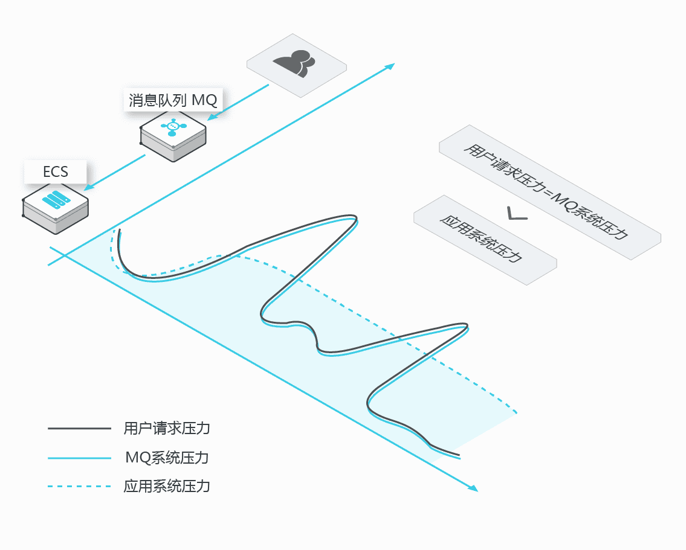

  - 异步解耦（高可用松耦合架构设计，对高依赖的项目之间进行解耦，当下游系统出现宕机，不会影响上游系统的正常运行，或者雪崩）

    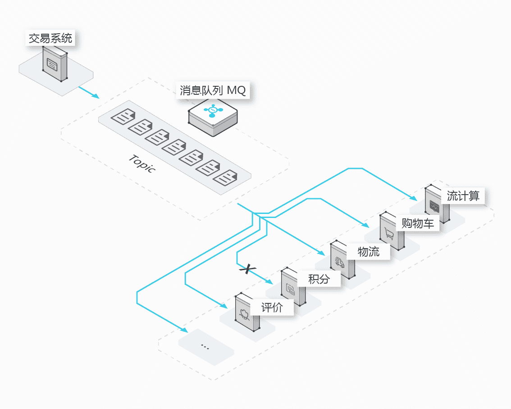

    

    顺序消息（顺序消息即保证消息的先进先出，比如证券交易过程时间优先原则，交易系统中的订单创建、支付、退款等流程，航班中的旅客登机消息处理等）

    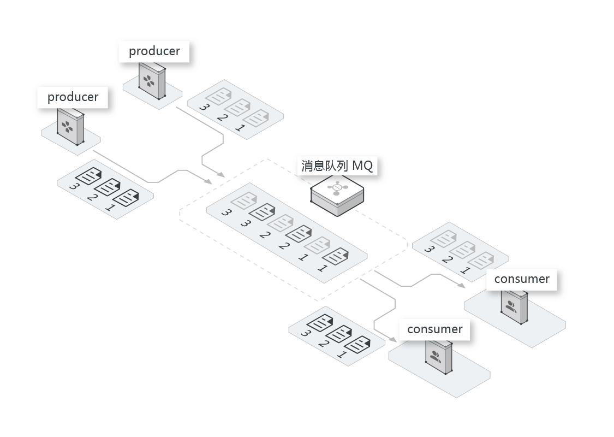

    分布式事务消息（确保数据的最终一致性，大量引入 MQ 的分布式事务，既可以实现系统之间的解耦，又可以保证最终的数据一致性，减少系统间的交互）

    - 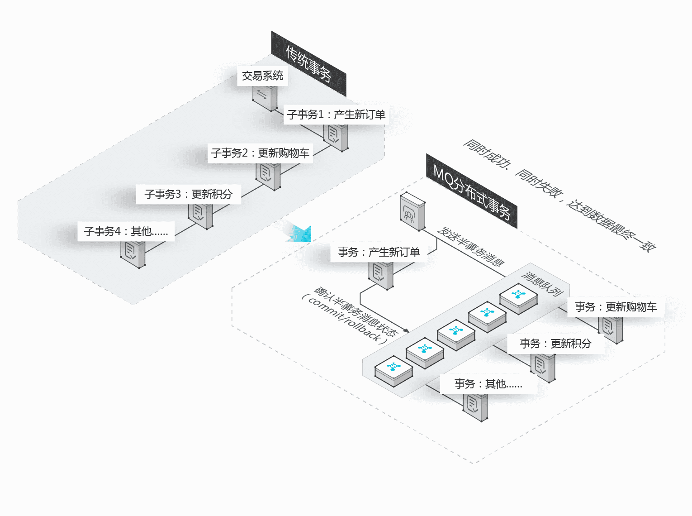

     

# RocketMQ-架构原理

## 一、RocketMQ专业术语

先讲专业术语的含义，后面会画流程图来更好的去理解它们。

#### Producer

消息生产者，位于用户的进程内，`Producer通过NameServer获取所有Broker的路由信息`，根据负载均衡策略选择将消息发到哪个Broker，然后调用Broker接口提交消息。

#### Producer Group

生产者组，简单来说就是多个发送同一类消息的生产者称之为一个生产者组。

#### Consumer

消息消费者，位于用户进程内。Consumer通过NameServer获取所有broker的路由信息后，向Broker发送Pull请求来获取消息数据。Consumer可以以两种模式启动，**广播（Broadcast）和集群（Cluster）**，**广播模式下，一条消息会发送给所有Consumer，集群模式下消息只会发送给一个Consumer**。

#### Consumer Group

消费者组，和生产者类似，消费同一类消息的多个 Consumer 实例组成一个消费者组。

#### Topic

Topic用于将消息按主题做划分，**Producer将消息发往指定的Topic，Consumer订阅该Topic就可以收到这条消息**。Topic跟发送方和消费方都没有强关联关系，发送方可以同时往多个Topic投放消息，消费方也可以订阅多个Topic的消息。在RocketMQ中，**Topic是一个上逻辑概念。消息存储不会按Topic分开**。

#### Message

代表一条消息，使用`MessageId`唯一识别，用户在发送时可以设置messageKey，便于之后查询和跟踪。一个 Message 必须指定 Topic，相当于寄信的地址。Message 还有一个可选的 Tag 设置，以便消费端可以基于 Tag 进行过滤消息。也可以添加额外的键值对，例如你需要一个业务 key 来查找 Broker 上的消息，方便在开发过程中诊断问题。

#### Tag

标签可以被认为是对 Topic 进一步细化。一般在相同业务模块中通过引入标签来标记不同用途的消息。

#### Broker

Broker是RocketMQ的核心模块，`负责接收并存储消息`，同时提供Push/Pull接口来将消息发送给Consumer。Consumer可选择从Master或者Slave读取数据。多个主/从组成Broker集群，集群内的Master节点之间不做数据交互。Broker同时提供消息查询的功能，可以通过MessageID和MessageKey来查询消息。Borker会将自己的Topic配置信息实时同步到NameServer。

#### Queue

**Topic和Queue是1对多的关系**，**一个Topic下可以包含多个Queue**，主要用于负载均衡。发送消息时，用户只指定Topic，Producer会根据Topic的路由信息选择具体发到哪个Queue上。Consumer订阅消息时，会根据负载均衡策略决定订阅哪些Queue的消息。

#### Offset

RocketMQ在存储消息时会为每个Topic下的每个Queue生成一个消息的索引文件，每个Queue都对应一个Offset**记录当前Queue中消息条数**。

#### NameServer

NameServer可以看作是RocketMQ的注册中心，它管理两部分数据：集群的Topic-Queue的路由配置；Broker的实时配置信息。其它模块通过Nameserv提供的接口获取最新的Topic配置和路由信息。

- `Producer/Consumer` ：通过查询接口获取Topic对应的Broker的地址信息
- `Broker` ： 注册配置信息到NameServer， 实时更新Topic信息到NameServer

## 二、流程图

我们由简单到复杂的来理解，它的一些核心概念


这个图很好理解，消息先发到Topic，然后消费者去Topic拿消息。只是Topic在这里只是个概念，那它到底是怎么存储消息数据的呢，这里就要引入Broker概念。

这个图很好理解，消息先发到Topic，然后消费者去Topic拿消息。只是Topic在这里只是个概念，那它到底是怎么存储消息数据的呢，这里就要引入Broker概念。

#### 2、Topic的存储

 Topic是一个逻辑上的概念，实际上Message是在每个Broker上以Queue的形式记录。


从上面的图片可以总结下几条结论。

```
1、消费者发送的Message会在Broker中的Queue队列中记录。
2、一个Topic的数据可能会存在多个Broker中。
3、一个Broker存在多个Queue。
4、单个的Queue也可能存储多个Topic的消息。
```

也就是说每个Topic在Broker上会划分成几个逻辑队列，每个逻辑队列保存一部分消息数据，但是保存的消息数据实际上不是真正的消息数据，而是指向commit log的消息索引。

但是RocketMQ可以保证高可用，是通过每个borker都有自己的主从结构实现的

`Queue不是真正存储Message的地方，真正存储Message的地方是在CommitLog`。

如图

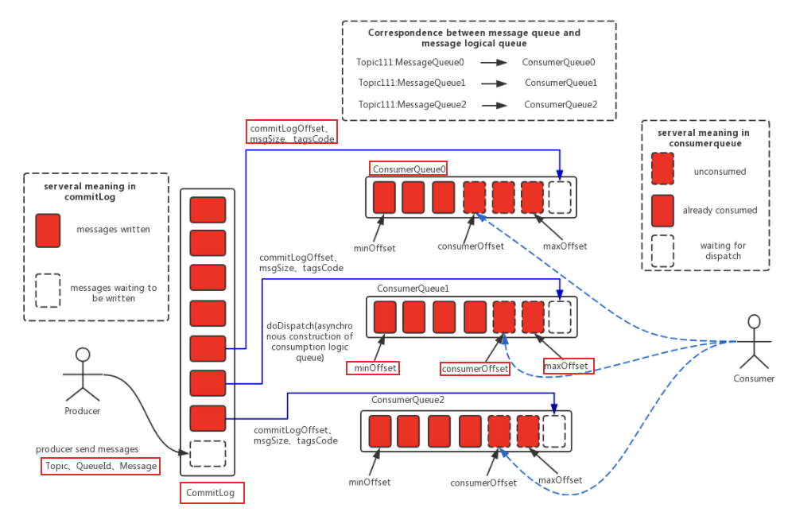

左边的是CommitLog。这个是真正存储消息的地方。RocketMQ所有生产者的消息都是往这一个地方存的。

右边是ConsumeQueue。这是一个逻辑队列。和上文中Topic下的Queue是一一对应的。消费者是直接和ConsumeQueue打交道。ConsumeQueue记录了消费位点，这个消费位点关联了commitlog的位置。所以即使ConsumeQueue出问题，只要commitlog还在，消息就没丢，可以恢复出来。还可以通过修改消费位点来重放或跳过一些消息。

#### 3、部署模型

在部署RocketMQ时，会部署两种角色。NameServer和Broker。如图


针对这张图做个说明

```
1、Product和consumer集群部署，是你开发的项目进行集群部署。
2、Broker 集群部署是为了高可用，因为Broker是真正存储Message的地方，集群部署是为了避免一台挂掉，导致整个项目KO.
```

那Name SerVer是做什么用呢，它和Product、Consumer、Broker之前存在怎样的关系呢？

先简单概括Name Server的特点

```
1、Name Server是一个几乎无状态节点，可集群部署，节点之间无任何信息同步。
2、每个Broker与Name Server集群中的所有节点建立长连接，定时注册Topic信息到所有Name Server。
3、Producer与Name Server集群中的其中一个节点（随机选择）建立长连接，定期从Name Server取Topic路由信息。
4、Consumer与Name Server集群中的其中一个节点（随机选择）建立长连接，定期从Name Server取Topic路由信息。
```

这里面最核心的是`每个Broker与Name Server集群中的所有节点建立长连接`这样做好处多多。

1、这样可以使Name Server之间可以没有任何关联，因为它们绑定的Broker是一致的。

2、作为Producer或者Consumer可以绑定任何一个Name Server 因为它们都是一样的。

## 三、详解Broker

#### 1、Broker与Name Server关系

**1）连接** 单个Broker和所有Name Server保持长连接。

**2）心跳**

**心跳间隔**：每隔**30秒**向所有NameServer发送心跳，心跳包含了自身的Topic配置信息。

**心跳超时**：NameServer每隔**10秒**，扫描所有还存活的Broker连接，若某个连接2分钟内没有发送心跳数据，则断开连接。

**3）断开**：当Broker挂掉；NameServer会根据心跳超时主动关闭连接,一旦连接断开，会更新Topic与队列的对应关系，但不会通知生产者和消费者。

#### 2、 负载均衡

一个Topic分布在多个Broker上，一个Broker可以配置多个Topic，它们是多对多的关系。
如果某个Topic消息量很大，应该给它多配置几个Queue，并且尽量多分布在不同Broker上，减轻某个Broker的压力。

#### 3 、可用性

由于消息分布在各个Broker上，一旦某个Broker宕机，则该Broker上的消息读写都会受到影响。

所以RocketMQ提供了Master/Slave的结构，Salve定时从Master同步数据，如果Master宕机，则Slave提供消费服务，但是不能写入消息，此过程对应用透明，由RocketMQ内部解决。
有两个关键点：
`思考1`一旦某个broker master宕机，生产者和消费者多久才能发现？

受限于Rocketmq的网络连接机制，默认情况下最多需要**30秒**，因为消费者每隔30秒从nameserver获取所有topic的最新队列情况，这意味着某个broker如果宕机，客户端最多要30秒才能感知。

`思考2` master恢复恢复后，消息能否恢复。
消费者得到Master宕机通知后，转向Slave消费，但是Slave不能保证Master的消息100%都同步过来了，因此会有少量的消息丢失。但是消息最终不会丢的，一旦Master恢复，未同步过去的消息会被消费掉。


## 四 Consumer (消费者)

#### 1 、Consumer与Name Server关系

**1）连接** : 单个Consumer和一台NameServer保持长连接，如果该NameServer挂掉，消费者会自动连接下一个NameServer，直到有可用连接为止，并能自动重连。
**2）心跳**: 与NameServer没有心跳
**3）轮询时间** : 默认情况下，消费者每隔**30秒**从NameServer获取所有Topic的最新队列情况，这意味着某个Broker如果宕机，客户端最多要30秒才能感知。

#### 2、 Consumer与Broker关系

**1）连接** :单个消费者和该消费者关联的所有broker保持长连接。

#### 3、 负载均衡

集群消费模式下，一个消费者集群多台机器共同消费一个Topic的多个队列，一个队列只会被一个消费者消费。如果某个消费者挂掉，分组内其它消费者会接替挂掉的消费者继续消费。


## 五、 Producer(生产者)

#### 1、 Producer与Name Server关系

**1）连接** 单个Producer和一台NameServer保持长连接，如果该NameServer挂掉，生产者会自动连接下一个NameServer，直到有可用连接为止，并能自动重连。
**2）轮询时间** 默认情况下，生产者每隔30秒从NameServer获取所有Topic的最新队列情况，这意味着某个Broker如果宕机，生产者最多要30秒才能感知，在此期间，
发往该broker的消息发送失败。
**3）心跳** 与nameserver没有心跳

#### 2、 与broker关系

**连接** 单个生产者和该生产者关联的所有broker保持长连接。

### 参考

[1、十分钟入门RocketMQ](http://jm.taobao.org/2017/01/12/rocketmq-quick-start-in-10-minutes/)

[2、RocketMQ nameserver、broker之间的关系](https://blog.csdn.net/linyaogai/article/details/77876078)

[3、RocketMQ-NameServer](https://www.jianshu.com/p/3d8d594d9161)


https://blog.csdn.net/xinzun/article/details/105473195

https://blog.csdn.net/xinzun/article/details/105474871

https://blog.csdn.net/xinzun/article/details/105525617

https://blog.csdn.net/xinzun/article/details/105525931

# RocketMQ-实际使用


## RocketMQ环境安装

参考我另外一篇文档 windows本地安装部署RocketMQ

## SpringBoot环境中使用RocketMQ

SpringBoot 入门：https://www.cnblogs.com/SimpleWu/p/10027237.html
SpringBoot 常用start:https://www.cnblogs.com/SimpleWu/p/9798146.html

项目基于之前搭建 SpringCloud搭建Nacos项目 增加RocketMQ功能，项目搭建参考 https://blog.csdn.net/zxl646801924/article/details/103984191

当前项目环境版本为:

- SpringBoot 2.2.2.RELEASE
- RocketMQ 4.7.0

```xml
<!-- rocketmq -->
<dependency>
    <groupId>org.apache.rocketmq</groupId>
    <artifactId>rocketmq-client</artifactId>
    <version>4.7.0</version>
</dependency>
```

### MQ生产者配置

mq生产者项目 boot-order-service 端口号 8802

配置文件配置：

```properties
spring.application.name=boot-order-service
server.port=8802
 
# nacos配置地址
nacos.config.server-addr=127.0.0.1:8848
# nacos注册地址
nacos.discovery.server-addr=127.0.0.1:8848
 
spring.jackson.date-format=yyyy-MM-dd HH:mm:ss
spring.jackson.time-zone=GMT+8
 
# 是否开启自动配置
rocketmq.producer.isOnOff=on
# 发送同一类消息设置为同一个group，保证唯一默认不需要设置，rocketmq会使用ip@pid（pid代表jvm名字）作为唯一标识
rocketmq.producer.groupName=${spring.application.name}
# mq的nameserver地址
rocketmq.producer.namesrvAddr=127.0.0.1:9876
# 消息最大长度 默认 1024 * 4 (4M)
rocketmq.producer.maxMessageSize = 4096
# 发送消息超时时间，默认 3000
rocketmq.producer.sendMsgTimeOut=3000
# 发送消息失败重试次数，默认2
rocketmq.producer.retryTimesWhenSendFailed=2
```

新增一个 MQProducerConfigure 配置类，用来初始化MQ生产者

```java
package com.lockie.cloudorder.rocketmq;
 
import lombok.Getter;
import lombok.Setter;
import lombok.ToString;
import org.apache.rocketmq.client.exception.MQClientException;
import org.apache.rocketmq.client.producer.DefaultMQProducer;
import org.slf4j.Logger;
import org.slf4j.LoggerFactory;
import org.springframework.boot.autoconfigure.condition.ConditionalOnProperty;
import org.springframework.boot.context.properties.ConfigurationProperties;
import org.springframework.context.annotation.Bean;
import org.springframework.context.annotation.Configuration;
 
/**
 * @author: lockie
 * @Date: 2020/4/21 10:28
 * @Description: mq生产者配置
 */
@Getter
@Setter
@ToString
@Configuration
@ConfigurationProperties(prefix = "rocketmq.producer")
public class MQProducerConfigure {
    public static final Logger LOGGER = LoggerFactory.getLogger(MQProducerConfigure.class);
 
    private String groupName;
    private String namesrvAddr;
    // 消息最大值
    private Integer maxMessageSize;
    // 消息发送超时时间
    private Integer sendMsgTimeOut;
    // 失败重试次数
    private Integer retryTimesWhenSendFailed;
 
    /**
     * mq 生成者配置
     * @return
     * @throws MQClientException
     */
    @Bean
    @ConditionalOnProperty(prefix = "rocketmq.producer", value = "isOnOff", havingValue = "on")
    public DefaultMQProducer defaultProducer() throws MQClientException {
        LOGGER.info("defaultProducer 正在创建---------------------------------------");
        DefaultMQProducer producer = new DefaultMQProducer(groupName);
        producer.setNamesrvAddr(namesrvAddr);
        producer.setVipChannelEnabled(false);
        producer.setMaxMessageSize(maxMessageSize);
        producer.setSendMsgTimeout(sendMsgTimeOut);
        producer.setRetryTimesWhenSendAsyncFailed(retryTimesWhenSendFailed);
        producer.start();
        LOGGER.info("rocketmq producer server 开启成功----------------------------------");
        return producer;
    }
}
```

### MQ消费者配置

mq消费者项目 boot-user-service 端口号 8801

增加配置参数

```properties
spring.application.name=boot-user-service
server.port=8801
 
# nacos配置地址
nacos.config.server-addr=127.0.0.1:8848
# nacos注册地址
nacos.discovery.server-addr=127.0.0.1:8848
 
spring.jackson.date-format=yyyy-MM-dd HH:mm:ss
spring.jackson.time-zone=GMT+8
 
# 是否开启自动配置
rocketmq.consumer.isOnOff=on
# 发送同一类消息设置为同一个group，保证唯一默认不需要设置，rocketmq会使用ip@pid（pid代表jvm名字）作为唯一标识
rocketmq.consumer.groupName=${spring.application.name}
# mq的nameserver地址
rocketmq.consumer.namesrvAddr=127.0.0.1:9876
# 消费者订阅的主题topic和tags（*标识订阅该主题下所有的tags），格式: topic~tag1||tag2||tags3;
rocketmq.consumer.topics=TestTopic~TestTag;TestTopic~HelloTag;HelloTopic~HelloTag;MyTopic~*
# 消费者线程数据量
rocketmq.consumer.consumeThreadMin=5
rocketmq.consumer.consumeThreadMax=32
# 设置一次消费信心的条数，默认1
rocketmq.consumer.consumeMessageBatchMaxSize=1
```

新建一个MQConsumerConfigure 类用来初始化MQ消费者

```java
package com.lockie.bootuser.rocketmq;
 
import lombok.Getter;
import lombok.Setter;
import lombok.ToString;
import org.apache.rocketmq.client.consumer.DefaultMQPushConsumer;
import org.apache.rocketmq.client.exception.MQClientException;
import org.apache.rocketmq.common.consumer.ConsumeFromWhere;
import org.slf4j.Logger;
import org.slf4j.LoggerFactory;
import org.springframework.beans.factory.annotation.Autowired;
import org.springframework.boot.autoconfigure.condition.ConditionalOnProperty;
import org.springframework.boot.context.properties.ConfigurationProperties;
import org.springframework.context.annotation.Bean;
import org.springframework.context.annotation.Configuration;
 
/**
 * @author: lockie
 * @Date: 2020/4/21 10:28
 * @Description: mq消费者配置
 */
@Getter
@Setter
@ToString
@Configuration
@ConfigurationProperties(prefix = "rocketmq.consumer")
public class MQConsumerConfigure {
    public static final Logger LOGGER = LoggerFactory.getLogger(MQConsumerConfigure.class);
 
    private String groupName;
    private String namesrvAddr;
    private String topics;
    // 消费者线程数据量
    private Integer consumeThreadMin;
    private Integer consumeThreadMax;
    private Integer consumeMessageBatchMaxSize;
 
    @Autowired
    private MQConsumeMsgListenerProcessor consumeMsgListenerProcessor;
    /**
     * mq 消费者配置
     * @return
     * @throws MQClientException
     */
    @Bean
    @ConditionalOnProperty(prefix = "rocketmq.consumer", value = "isOnOff", havingValue = "on")
    public DefaultMQPushConsumer defaultConsumer() throws MQClientException {
        LOGGER.info("defaultConsumer 正在创建---------------------------------------");
        DefaultMQPushConsumer consumer = new DefaultMQPushConsumer(groupName);
        consumer.setNamesrvAddr(namesrvAddr);
        consumer.setConsumeThreadMin(consumeThreadMin);
        consumer.setConsumeThreadMax(consumeThreadMax);
        consumer.setConsumeMessageBatchMaxSize(consumeMessageBatchMaxSize);
        // 设置监听
        consumer.registerMessageListener(consumeMsgListenerProcessor);
 
        /**
         * 设置consumer第一次启动是从队列头部开始还是队列尾部开始
         * 如果不是第一次启动，那么按照上次消费的位置继续消费
         */
        consumer.setConsumeFromWhere(ConsumeFromWhere.CONSUME_FROM_LAST_OFFSET);
        /**
         * 设置消费模型，集群还是广播，默认为集群
         */
//        consumer.setMessageModel(MessageModel.CLUSTERING);
 
        try {
            // 设置该消费者订阅的主题和tag，如果订阅该主题下的所有tag，则使用*,
            String[] topicArr = topics.split(";");
            for (String tag : topicArr) {
                String[] tagArr = tag.split("~");
                consumer.subscribe(tagArr[0], tagArr[1]);
            }
            consumer.start();
            LOGGER.info("consumer 创建成功 groupName={}, topics={}, namesrvAddr={}",groupName,topics,namesrvAddr);
        } catch (MQClientException e) {
            LOGGER.error("consumer 创建失败!");
        }
        return consumer;
    }
}
```

这个只是初始化操作，实际对消费者对消息处理放在 consumer.registerMessageListener(consumeMsgListenerProcessor); 这个监听类里面了，实际接收消息，处理消息都放在监听类里

新建一个监听类处理消息

```java
package com.lockie.bootuser.rocketmq;
 
import org.apache.rocketmq.client.consumer.listener.ConsumeConcurrentlyContext;
import org.apache.rocketmq.client.consumer.listener.ConsumeConcurrentlyStatus;
import org.apache.rocketmq.client.consumer.listener.MessageListenerConcurrently;
import org.apache.rocketmq.common.message.MessageExt;
import org.slf4j.Logger;
import org.slf4j.LoggerFactory;
import org.springframework.stereotype.Component;
import org.springframework.util.CollectionUtils;
 
import java.util.List;
 
/**
 * @author: lockie
 * @Date: 2020/4/21 11:05
 * @Description: 消费者监听
 */
@Component
public class MQConsumeMsgListenerProcessor implements MessageListenerConcurrently {
    public static final Logger LOGGER = LoggerFactory.getLogger(MQConsumeMsgListenerProcessor.class);
 
 
    /**
     * 默认msg里只有一条消息，可以通过设置consumeMessageBatchMaxSize参数来批量接收消息
     * 不要抛异常，如果没有return CONSUME_SUCCESS ，consumer会重新消费该消息，直到return CONSUME_SUCCESS
     * @param msgList
     * @param consumeConcurrentlyContext
     * @return
     */
    @Override
    public ConsumeConcurrentlyStatus consumeMessage(List<MessageExt> msgList, ConsumeConcurrentlyContext consumeConcurrentlyContext) {
        if (CollectionUtils.isEmpty(msgList)) {
            LOGGER.info("MQ接收消息为空，直接返回成功");
            return ConsumeConcurrentlyStatus.CONSUME_SUCCESS;
        }
        MessageExt messageExt = msgList.get(0);
        LOGGER.info("MQ接收到的消息为：" + messageExt.toString());
        try {
            String topic = messageExt.getTopic();
            String tags = messageExt.getTags();
            String body = new String(messageExt.getBody(), "utf-8");
 
            LOGGER.info("MQ消息topic={}, tags={}, 消息内容={}", topic,tags,body);
        } catch (Exception e) {
            LOGGER.error("获取MQ消息内容异常{}",e);
        }
        // TODO 处理业务逻辑
        return ConsumeConcurrentlyStatus.CONSUME_SUCCESS;
    }
}
```

### 测试消息发送接收

生产者 boot-order-service 新建一个controller，再新建一个send方法，发送消息

```java

package com.lockie.cloudorder.rocketmq;
 
import com.lockie.cloudorder.model.Results;
import org.apache.commons.lang3.StringUtils;
import org.apache.rocketmq.client.exception.MQBrokerException;
import org.apache.rocketmq.client.exception.MQClientException;
import org.apache.rocketmq.client.producer.DefaultMQProducer;
import org.apache.rocketmq.client.producer.SendResult;
import org.apache.rocketmq.common.message.Message;
import org.apache.rocketmq.remoting.exception.RemotingException;
import org.slf4j.Logger;
import org.slf4j.LoggerFactory;
import org.springframework.beans.factory.annotation.Autowired;
import org.springframework.web.bind.annotation.GetMapping;
import org.springframework.web.bind.annotation.RequestMapping;
import org.springframework.web.bind.annotation.RestController;
 
/**
 * @author: lockie
 * @Date: 2020/4/21 11:17
 * @Description:
 */
@RestController
@RequestMapping("/mqProducer")
public class MQProducerController {
    public static final Logger LOGGER = LoggerFactory.getLogger(MQProducerController.class);
 
    @Autowired
    DefaultMQProducer defaultMQProducer;
 
    /**
     * 发送简单的MQ消息
     * @param msg
     * @return
     */
    @GetMapping("/send")
    public Results send(String msg) throws InterruptedException, RemotingException, MQClientException, MQBrokerException {
        if (StringUtils.isEmpty(msg)) {
            return new Results().succeed();
        }
        LOGGER.info("发送MQ消息内容：" + msg);
        Message sendMsg = new Message("TestTopic", "TestTag", msg.getBytes());
        // 默认3秒超时
        SendResult sendResult = defaultMQProducer.send(sendMsg);
        LOGGER.info("消息发送响应：" + sendResult.toString());
        return new Results().succeed(sendResult);
    }
 
}
```

浏览器请求发送send接口 http://127.0.0.1:8802/mqProducer/send?msg=hello

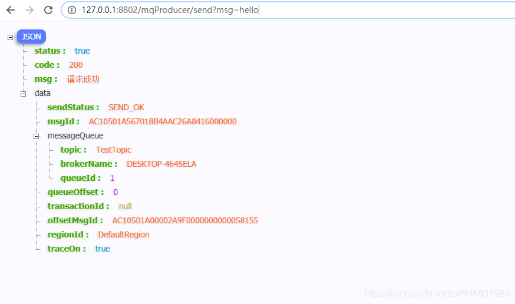

修改topic和tags为MyTopic，MyTags，再发送一次

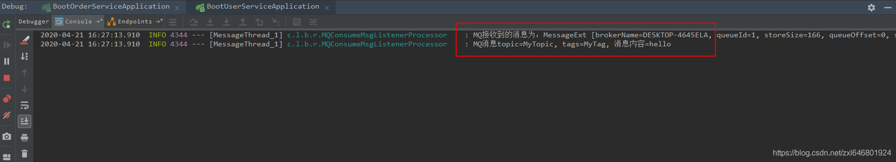

我们进入rocketmq控制台查看

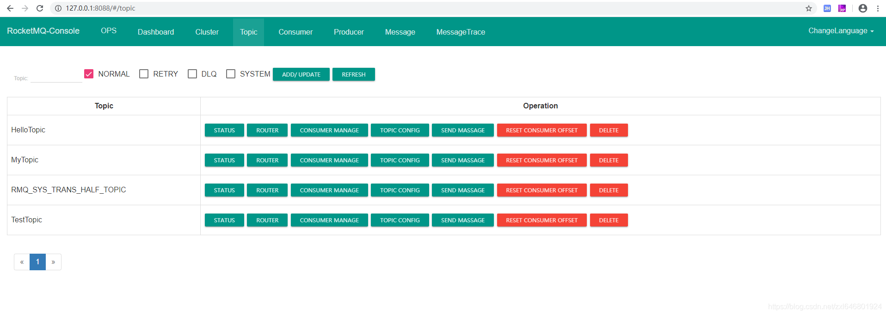

 

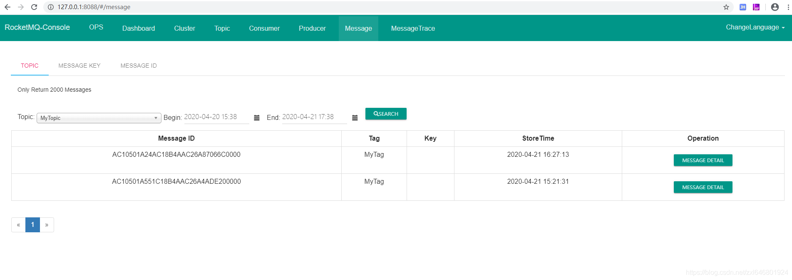

项目代码地址：https://github.com/LockieZou/springcloud-nacos-demo

# RocketMQ知识盘点

## 消息存储

### CommitLog

储存地址为/store/commitlog目录，每个文件默认1G，文件写满则创建新文件，以该文件第一个消息的全局物理偏移量为文件名，偏移量小于20用0补齐。

CommitLog文件存储格式为，每条消息前4个字节存储该消息的总长度，之后存储该消息的其他信息。通过这样的设计，可以根据偏移量和消息长度查找消息。首先根据偏移量找到所在的物理偏移量文件，然后用offset和文件长度取余得到文件中的偏移量，从该位置读取size长度内容即可得到消息。

### ConsumeQueue

基于topic模式实现消息消费，因同一topic消息不连续地保存在CommitLog文件中，因此设计这个ConsumeQueue文件，可理解为索引。单个ConsumeQueue文件默认存储30W个条目。每个条目的长度是固定的，因此也通过物理偏移量来获取多个条目。

文件结构：

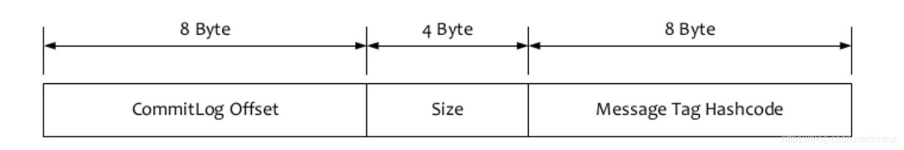

### Index文件

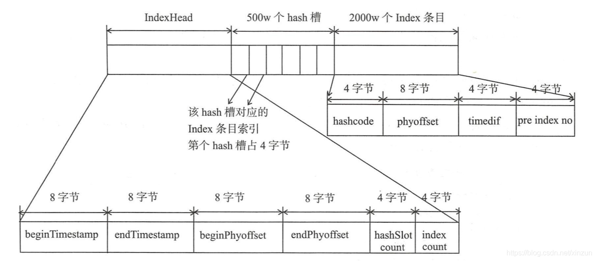

**IndexHead**

- beginTimestamp：落broker开始时间
- endTimestamp：落broker截止时间
- beginPhyoffset：开始偏移量
- endPhyoffset：截止偏移量
- hashSlotcount：槽数量
- indexcount：当前索引总数

**slotTable**数组

槽位置 = key的hashCode % 槽数量，每个槽记录的是当前索引数

**indexLinkedList**链表

- hashCode：key的哈希值
- pyhoffset：物理偏移地址
- timedif：落盘时间
- preIndexNo：hash冲突后上一个索引地址

> 通过messageId查找，可以直接解析出broker和物理偏移地址，直接查commitLog即可；
>
> 通过messageKey查找，则用index文件通过key定位slot，从索引最大值倒序查找，对比hash值和落盘时间返回物理偏移地址，再取commitLog查找。

### 保存策略

简单来说分为同步和异步。

同步是指消息追加到内存映射文件的内存中后，立即刷盘并返回结果，默认超时时间为5s。

异步是会申请一个和commitLog同样大小的堆外内存，消息先追加到堆外内存，然后再提交到内存映射文件的内存，最后刷盘。默认10s强制刷一次，每1000条消息强制刷一次。

再多说一句，ConsumeQueue文件和Index文件都是消息保存到CommitLog文件后，通过ReputMessageService线程池异步保存的。

### 过期文件删除

3种情况触发：

1.磁盘空间不足；

2.凌晨4点(deleteWhen)删除过期文件(默认过期时间为72小时，fileReservedTime配置)；

3.手动触发。executeDeleteFilesManualy
