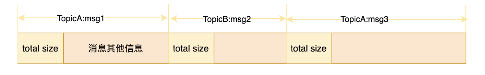

# 消息存储

## 存储文件

[RocketMQ](https://so.csdn.net/so/search?q=RocketMQ&spm=1001.2101.3001.7020)采用文件存储的，在$HOME/store目录下，有如下文件：


- commitLog: 消息存储目录
- config: 运行期间一些配置信息
- consumerqueue: 消息消费队列存储目录
- index: 消息索引文件存储目录
- abort: 如果存在该文件，则Broker非正常关闭
- checkpoint: 文件检查点，存储CommitLog文件最后一次刷盘时间戳、consumerqueue最后一次刷盘时间、index索引文件最后一次刷盘时间戳。

## 消息的存储架构


RocketMQ采用的是混合型的存储结构，即为Broker单个实例下所有的队列共用一个日志数据文件（即为CommitLog）来存储。RocketMQ的混合型存储结构(多个Topic的消息实体内容都存储于一个CommitLog中)针对Producer和Consumer分别采用了数据和索引部分相分离的存储结构，Producer发送消息至Broker端，然后Broker端使用同步或者异步的方式对消息刷盘持久化，保存至CommitLog中。只要消息被刷盘持久化至磁盘文件CommitLog中，那么Producer发送的消息就不会丢失。正因为如此，Consumer也就肯定有机会去消费这条消息。当无法拉取到消息后，可以等下一次消息拉取，同时服务端也支持长轮询模式，如果一个消息拉取请求未拉取到消息，Broker允许等待30s的时间，只要这段时间内有新消息到达，将直接返回给消费端。这里，RocketMQ的具体做法是，使用Broker端的后台服务线程—ReputMessageService不停地分发请求并异步构建ConsumeQueue（逻辑消费队列）和IndexFile（索引文件）数据。

### CommitLog

消息主体以及元数据的存储主体，存储Producer端写入的消息主体内容，消息内容不是定长的。每条消息等待前面4个字节存储这条消息的总长度。



单个文件大小默认1G，起始偏移量为0，第二个文件的起始偏移量为1073741824。消息主要是顺序写入日志文件，当第一个文件满了后，再写入下一个文件；

indexFile 和 ComsumerQueue 中都有消息对应的物理偏移量，通过物理偏移量就可以计算出该消息位于哪个 CommitLog 文件上。

### ConsumeQueue

ConsumeQueue是逻辑队列，CommitLog中的消息包含了所有的Topic的消息，消费的时候需要消费订阅Topic的消息，ConsumeQueue主要是为了快速的索引到特定的Topic在CommitLog中的位置。

消息消费队列，引入的目的主要是提高消息消费的性能，由于RocketMQ是基于主题topic的订阅模式，消息消费是针对主题进行的，如果要遍历commitlog文件中根据topic检索消息是非常低效的。

Consumer可根据ConsumeQueue来查找待消费的消息。其中，ConsumeQueue（逻辑消费队列）作为消费消息的索引，保存了指定Topic下的队列消息在CommitLog中的起始物理偏移量offset，消息大小size和消息Tag的HashCode值。

consumequeue文件可以看成是基于topic的commitlog索引文件，故consumequeue文件夹的组织方式如下：topic/queue/file三层组织结构，具体存储路径为：$HOME/store/consumequeue/{topic}/{queueId}/{fileName}。

同样consumequeue文件采取定长设计，每一个条目共20个字节，分别为8字节的commitlog物理偏移量、4字节的消息长度、8字节tag hashcode，单个文件由30W个条目组成，可以像数组一样随机访问每一个条目，每个ConsumeQueue文件大小约5.72M；


### MappedFile

MappedFile可以理解为对CommitLog进行mmap抽象，看一下Mapped File中的部分属性,以及初始化的过程。

```java
public class MappedFile extends ReferenceResource {
    //写的offset，从0开始， 即在每个文件中的偏移量，绝对偏移量需要加上文件的起始offset
    protected final AtomicInteger wrotePosition = new AtomicInteger(0);
    //提交的offset，这个offset应该是先提交到了pageCache的
    protected final AtomicInteger committedPosition = new AtomicInteger(0);
    //主动flush的offset，刷新到磁盘的offset
    private final AtomicInteger flushedPosition = new AtomicInteger(0);
    //从堆外内存中开辟的空间
    protected ByteBuffer writeBuffer = null;
    //堆外内存一个DirectByteBuffer的队列
    protected TransientStorePool transientStorePool = null;
    //文件名称
    private String fileName;
    //文件的起始offset，就是文件名称
    private long fileFromOffset;
    private File file;
    //commitLog的pageCache
    private MappedByteBuffer mappedByteBuffer;

    //commitLog的fileChannel
    this.fileChannel = new RandomAccessFile(this.file, "rw").getChannel();
    //初始化mmap，这时候已经生成了文件，fileSize 默认是1g
    this.mappedByteBuffer = this.fileChannel.map(MapMode.READ_WRITE, 0, fileSize);
    //从堆外DirectByteBuffer队列中获取一个，默认开启。
    this.writeBuffer = transientStorePool.borrowBuffer();
    this.transientStorePool = transientStorePool;
}
```

MappedFile主要有下面的功能

- 维护了CommitLog文件的mappedByteBuffer和fileChannel，这两个都可以理解为PageCache。

- 维护了transientStorePool堆外内存队列，默认不开启。

- 堆外缓存writeBuffer，如果开启了堆外缓存，writeBuffer会从堆外内存队列transientStorePool中获取一个，不为空。

- 如果不开启transientStorePool，堆外缓存writeBuffer为空，那么读写都从mappedByteBuffer，MappedFile提供了flush方法，异步将PageCache中的数据刷新到磁盘。

- 如果开启了transientStorePool（堆外缓存），那么writeBuffer不为空，这时候采用读写分离的思想。写数据的时候先写入到堆外内存writeBuffer中缓存，这时候还在用户态，读数据从mappedByteBuffer(PageCache)中读取，MappedFile中还提供了commit方法，用来将writeBuffer中的数据异步写入到PageCache，只有commit的数据才能从mappedByteBuffer读取到。这种模式是本文介绍的重点，可以看到通过这种方式，实现了读写分离，并且数据在堆外缓存了一定量之后再提交到PageCache，也能够减少写入PageCache的次数，做到了批量提交。这种架构其实也是对上面"**计算机科学领域的任何问题都可以通过增加一个间接的中间层来解决**"的一种实现，堆外缓存writeBuffer就是中间层。

- MappedFile还维护了几个position

- wrotePosition。当开启了堆外缓存，写入数据首先写入堆外缓存writeBuffer中，wrotePosition就是writeBuffer的position。如果不开启堆外内存缓存的话，wrotePosition就是可读position。

- committedPosition。当开启了堆外缓存，写入到writeBuffer还在用户态，读取的时候是读不到的，需要调用commit方法将数据刷新到PageCache之后才可以读取到，committedPosition就是提交到PageCache的position，同时也可以认为可读position。

- flushedPosition。PageCache中的数据不可靠，flushedPosition记录了刷新到磁盘的position。

  

  

MappedFile#commit0()，使用fileChannel.write()，将堆外内存writeBuffer写入到PageCache中，这时候mappedByteBuffer(PageCache)才可以读取到。

MappedFile#isAbleToCommit()用来判断commit条件，写入堆外内存的position比提交到PageCache的position大于4个内存页就提交，消息在堆外内存中缓存一段时间，批量提交，减少了写入PageCache的次数。

```java
/**
     * 将堆外内存writeBuffer保存到fileChannel，更新committedPosition，没有commit的是读取不到的，在堆外内存中，没有在pageCache中
     *
     * @param commitLeastPages 
     */
    protected void commit0(final int commitLeastPages) {
        //从0开始的写offset
        int writePos = this.wrotePosition.get();
        int lastCommittedPosition = this.committedPosition.get();

        //写入的offset > 提交到commitLog的offset， 从缓存的writeBuffer中写入到fileChannel即commitLog中
        if (writePos - this.committedPosition.get() > 0) {
            try {
                ByteBuffer byteBuffer = writeBuffer.slice();
                byteBuffer.position(lastCommittedPosition);
                byteBuffer.limit(writePos);
                this.fileChannel.position(lastCommittedPosition);
                this.fileChannel.write(byteBuffer);
                this.committedPosition.set(writePos);
            } catch (Throwable e) {
                log.error("Error occurred when commit data to FileChannel.", e);
            }
        }
    }

         /**
     * commit条件，写入堆外内存的position比提交到PageCache的position大于4个内存页就提交，做到了在堆外内存中缓存一段时间，批量提交
     * @param commitLeastPages 默认是4页
     * @return
     */
    protected boolean isAbleToCommit(final int commitLeastPages) {
        //提交position
        int flush = this.committedPosition.get();
        //写入的position
        int write = this.wrotePosition.get();

        if (this.isFull()) {
            return true;
        }
        if (commitLeastPages > 0) {
            return ((write / OS_PAGE_SIZE) - (flush / OS_PAGE_SIZE)) >= commitLeastPages;
        }

        return write > flush;
    }
```

MappedFile#flush()方法，如果开启了堆外内存缓存，那么调用fileChannel.force()方法，将PageCache中缓存的数据刷到磁盘，这部分数据经历了java堆->堆外内存->PageCache->磁盘。如果没有开启堆外内存缓存，调用mappedByteBuffer.force()，作用是将PageCache中的数据刷新到磁盘，这部分数据是没有经过堆外的，java堆->PageCache->磁盘。

MappedFile#isAbleToFlush()判断刷盘的条件，刷盘的position如果大于提交的position4个内存页则可以刷盘。

```java
/**
     * 将pageCache中的数据刷新到磁盘，优先刷新fileChannel到磁盘，写的时候也是优先写DirectByteBuffer
     * @return The current flushed position
     */
    public int flush(final int flushLeastPages) {
        if (this.isAbleToFlush(flushLeastPages)) {
            if (this.hold()) {
                //如果writeBuffer为空那么就是writePosition否则是commitPosition，能读到的最大offset，如果writeBuffer不为空取commitPosition的原因是不commit，不会进入pageCache，没发被读取到
                int value = getReadPosition();

                try {
                    //We only append data to fileChannel or mappedByteBuffer, never both.
                    if (writeBuffer != null || this.fileChannel.position() != 0) {
                        //fileChannel，上面的value在这里应该是commitPosition，刷新到此盘后更新flushedPosition为commitPosition
                        this.fileChannel.force(false);
                    } else {
                        //pageCache刷盘，上面的value在这里应该是writePosition，刷新到此盘后更新flushedPosition为writePosition
                        this.mappedByteBuffer.force();
                    }
                } catch (Throwable e) {
                    log.error("Error occurred when force data to disk.", e);
                }

                this.flushedPosition.set(value);
                this.release();
            } else {
                log.warn("in flush, hold failed, flush offset = " + this.flushedPosition.get());
                this.flushedPosition.set(getReadPosition());
            }
        }
        return this.getFlushedPosition();
    }


/**
     * 刷盘的条件
     * @param flushLeastPages 默认是4页
     * @return
     */
private boolean isAbleToFlush(final int flushLeastPages) {
  //刷新的offset
  int flush = this.flushedPosition.get();
  //命名有些误导，应该是提交到pageCache的offset，即commitOffset
  int write = getReadPosition();

  //如果当前的mappedFile已经满了，就可以刷新
  if (this.isFull()) {
    return true;
  }
  //写入的offset 大于 flush的offset的页数，如果大于最小的flushLeastPages，那么则可以flush
  if (flushLeastPages > 0) {
    return ((write / OS_PAGE_SIZE) - (flush / OS_PAGE_SIZE)) >= flushLeastPages;
  }
  //写入打offset大于flush的offset，按理来说上面一步满足了，这一步的一定是满足的
  return write > flush;
}
```

### MappedFileQueue

MappedFileQueue中包含一个CopyOnWriteList，里面是按照文件名称（即存储消息的起始offset）排好序的MappedFile，其实就是CommitLog的排序队列。

### IndexFile

IndexFile索引文件支持通过按照Message Key查询消息。


从图中可以看到，Producer写入的消息被存储到了CommitLog中，然后被dispatch到了ConsumeQueue和IndexFile中，构建索引文件。Consumer消费的时候先从ConsumeQueue中获取到消费的offset，然后再根据offset去CommitLog中寻找消息。

### 源码分析

下面我们从源码来看一下写入消息的流程，下面的代码我省略了不必要的代码，只保留了主干。

```java
/**
  * org.apache.rocketmq.store.CommitLog#putMessage
  * 
  */
public PutMessageResult putMessage(final MessageExtBrokerInner msg) {
        ...
        MappedFile unlockMappedFile = null;
        MappedFile mappedFile = this.mappedFileQueue.getLastMappedFile();

        //自旋锁或者重入锁，获取锁，
        putMessageLock.lock(); //spin or ReentrantLock ,depending on store config
        try {
            ...
            //调用mappedFile 的 appendMessage方法存储消息
            result = mappedFile.appendMessage(msg, this.appendMessageCallback);
            switch (result.getStatus()) {
                case PUT_OK:
                    break;
                ...
            }
            ...
        } finally {
            putMessageLock.unlock();
        }
        ...
        if (null != unlockMappedFile && this.defaultMessageStore.getMessageStoreConfig().isWarmMapedFileEnable()) {
            //解锁堆外内存，可以交换到磁盘上去，这一操作会在后面解释
            this.defaultMessageStore.unlockMappedFile(unlockMappedFile);
        }
        PutMessageResult putMessageResult = new PutMessageResult(PutMessageStatus.PUT_OK, result);
        ...
        //处理刷新磁盘的机制
        handleDiskFlush(result, putMessageResult, msg);
        ...
        return putMessageResult;
    }
```

可以看到CommitLog中的putMessage方法做了下面几个事情：

1. 从MappedFileQueue队列中获取的最新的MappedFile，前面也提到了队列中的MappedFile是按照offset排序的
2. 加锁（重入锁或者自旋锁）
3. 调用mappedFile的appendMessage方法，顺序写消息
4. 释放锁
5. 释放锁住的内存（后面解释）
6. 调用handleDiskFlush处理刷新消息到磁盘

接下来看一下mappedFile的appendMessage方法：

```java
/**
  *
  * MappedFile的appendMessage的实现，优先将消息写到堆外内存的writeBuffer中
  * 如果writeBuffer不存在才会写到mappedByteBuffer即PageCache中
  */
public AppendMessageResult appendMessagesInner(final MessageExt messageExt, final AppendMessageCallback cb) {
        assert messageExt != null;
        assert cb != null;

        //当前在此mapped file中的偏移量0 至 1024 * 1024 * 1024
        int currentPos = this.wrotePosition.get();

        if (currentPos < this.fileSize) {
            // 如果有writeBuffer就优先写到writeBuffer，writeBuffer在堆外，否则写到pageCache中。
            ByteBuffer byteBuffer = writeBuffer != null ? writeBuffer.slice() : this.mappedByteBuffer.slice();
            byteBuffer.position(currentPos);
            AppendMessageResult result = null;
            if (messageExt instanceof MessageExtBrokerInner) {
                result = cb.doAppend(this.getFileFromOffset(), byteBuffer, this.fileSize - currentPos, (MessageExtBrokerInner) messageExt);
            } else if (messageExt instanceof MessageExtBatch) {
                result = cb.doAppend(this.getFileFromOffset(), byteBuffer, this.fileSize - currentPos, (MessageExtBatch) messageExt);
            } else {
                return new AppendMessageResult(AppendMessageStatus.UNKNOWN_ERROR);
            }
            //写offset需要加上本次写了多少字节
            this.wrotePosition.addAndGet(result.getWroteBytes());
            this.storeTimestamp = result.getStoreTimestamp();
            return result;
        }
        ...
        return new AppendMessageResult(AppendMessageStatus.UNKNOWN_ERROR);
    }
```

appendMessagesInner是appendMessage的实现，可以看到这个主要做了以下几个事情：

1. 选取byteBuffer，如果writeBuffer不为空则使用writeBuffer，否则使用mappedByteBuffer，上面介绍MappedFile的时候也提到了，每个MappedFile都维护了一个堆外内存的writeBuffer，也就是写数据的时候优先写入到堆外内存中的writeBuffer里。
2. 调用AppendMessageCallback#doAppend方法，如果writeBuffer不为空，这里面就是调用writeBuffer.put()将数据写入到堆外ByteBuffer中，注意这里put之后数据还是在堆外内存，在用户态，并没有到PageCache。
3. 更新写入的offset

消息写入到byteBuffer之后调用handleDiskFlush来刷盘，看一下handleDiskFlush方法的实现

```java
/**
     * 处理刷磁盘机制， 三种情况，
     * 1. 异步刷盘 + 没开启堆外缓存FlushRealTimeService
     * 2. 异步刷盘 + 开启堆外缓存使用CommitRealTimeService，commit，提交到pagecache，然后唤醒刷盘线程，刷新到磁盘
     * 3. 同步刷盘使用GroupCommitService，doCommit，最后是flush
     *
     * @param result
     * @param putMessageResult
     * @param messageExt
     */
public void handleDiskFlush(AppendMessageResult result, PutMessageResult putMessageResult, MessageExt messageExt) {
        //同步刷新磁盘的分支，flushCommitLogService是GroupCommitService类型的
        if (FlushDiskType.SYNC_FLUSH == this.defaultMessageStore.getMessageStoreConfig().getFlushDiskType()) {
            final GroupCommitService service = (GroupCommitService) this.flushCommitLogService;
            if (messageExt.isWaitStoreMsgOK()) {
                GroupCommitRequest request = new GroupCommitRequest(result.getWroteOffset() + result.getWroteBytes());
                //将刷盘请求放入到一个list中并处理请求的线程，唤醒GroupCommitService线程，由该线程取出来request，然后处理结束后唤醒此线程
                service.putRequest(request);
                //CountDownLatch阻塞等待刷盘结果，刷盘的线程执行doCommit方法会调用wakeupCustomer唤醒此线程
                boolean flushOK = request.waitForFlush(this.defaultMessageStore.getMessageStoreConfig().getSyncFlushTimeout());
                if (!flushOK) {
                    log.error("do groupcommit, wait for flush failed, topic: " + messageExt.getTopic() + " tags: " + messageExt.getTags()
                        + " client address: " + messageExt.getBornHostString());
                    putMessageResult.setPutMessageStatus(PutMessageStatus.FLUSH_DISK_TIMEOUT);
                }
            } else {
                //不需要等待刷盘结果，直接唤醒刷盘线程doCommit就行
                service.wakeup();
            }
        }
        // 异步刷盘分支
        else {
            //如果没有开启堆外内存池，那么唤醒flushCommitLogService，flush page cache的内容到磁盘
            if (!this.defaultMessageStore.getMessageStoreConfig().isTransientStorePoolEnable()) {
                flushCommitLogService.wakeup();
            } else {
                //如果开启了堆外内存池，唤醒commitLogService，先将堆外内存commit到pageCache，然后再由commitLogService唤醒flushCommitLogService，将pageCache的内容刷到磁盘
                commitLogService.wakeup();
            }
        }
    }
```

rocketmq有三种刷盘机制，包括一种同步刷盘机制和两种异步刷盘机制，同步刷盘和异步刷盘的区别如下图。

同步刷盘：将同步刷盘的请求放到一个list中，唤醒同步刷盘的线程同时阻塞当前线程，等待同步刷盘线程执行结束唤醒当前线程继续执行。

同步刷盘和异步刷盘

异步刷盘：

- 未开启堆外缓存的异步刷盘模式，这时候堆外内存wirteBuffer为空，读写都用的mappedByteBuffer。刷盘的时候唤醒flushCommitLogService线程，调用mappedFile.flush()方法，将PageCache中的数据刷新到磁盘。
- 开启了堆外缓存的异步刷盘模式，采用读写分离的思想，写入堆外内存缓存，读从PageCache中读取。那么这种模式的刷盘策略是由commitLogService线程完成的，可以看到上面的handleDiskFlush方法中commitLogService.wakeup()这个分支就是开启了堆外缓存的异步刷盘模式。这个操作唤醒了原本阻塞着的commitLogService线程。看一下commitLogService线程的run方法。

```java
@Override
public void run() {
  while (!this.isStopped()) {
    ...
      try {
        boolean result = CommitLog.this.mappedFileQueue.commit(commitDataLeastPages);
        ...
          if (!result) {
            //有数据被commit了，commit是提交到pageCache，然后调用唤醒flush，刷新到磁盘
            this.lastCommitTimestamp = end; // result = false means some data committed.
            //now wake up flush thread.
            //提交到pageCache之后可以唤醒磁盘，进行刷盘
            flushCommitLogService.wakeup();
          }
        ...
          //阻塞在这里
          this.waitForRunning(interval);
      } catch (Throwable e) {
        CommitLog.log.error(this.getServiceName() + " service has exception. ", e);
      }
  }
  ...
}
```

可以看到commitLogService线程是无限循环调用mappedFileQueue.commit()方法，里面其实调用的就是mappedFile.commit0()方法，上面已经解释过了，这个方法的作用是将堆外内存中的数据写入到PageCache中，如果成功了，那么commitLogService这个线程会唤醒flushCommitLogService，调用flush进行刷盘，然后commitLogService会阻塞住，等待再一次调用handleDiskFlush中的commitLogService.wakeup()被唤醒。

再来看一下读取消息的代码，其实很简单，就是从mappedByteBuffer(PageCache)的特定位置进行读取。

```java
/**
     * 从mappedByteBuffer中读取
     *
     * @param pos
     * @param size
     * @return
     */
    public SelectMappedBufferResult selectMappedBuffer(int pos, int size) {
        int readPosition = getReadPosition();
        if ((pos + size) <= readPosition) {

            if (this.hold()) {
                ByteBuffer byteBuffer = this.mappedByteBuffer.slice();
                byteBuffer.position(pos);
                ByteBuffer byteBufferNew = byteBuffer.slice();
                byteBufferNew.limit(size);
                return new SelectMappedBufferResult(this.fileFromOffset + pos, byteBufferNew, size, this);
            } else {
                log.warn("matched, but hold failed, request pos: " + pos + ", fileFromOffset: "
                        + this.fileFromOffset);
            }
        } else {
            log.warn("selectMappedBuffer request pos invalid, request pos: " + pos + ", size: " + size
                    + ", fileFromOffset: " + this.fileFromOffset);
        }

        return null;
    }

    /**
     * 根据在mappedFile中的位置获取到byteBuffer，从mappedByteBuffer中读取
     *
     * @param pos
     * @return
     */
    public SelectMappedBufferResult selectMappedBuffer(int pos) {
        //读位置
        int readPosition = getReadPosition();
        if (pos < readPosition && pos >= 0) {
            if (this.hold()) {
                ByteBuffer byteBuffer = this.mappedByteBuffer.slice();
                byteBuffer.position(pos);
                //当前读位置减去pos的，作为size
                int size = readPosition - pos;
                ByteBuffer byteBufferNew = byteBuffer.slice();
                byteBufferNew.limit(size);
                return new SelectMappedBufferResult(this.fileFromOffset + pos, byteBufferNew, size, this);
            }
        }

        return null;
    }
```

## 总结

rocketmq存储读写分离的架构。

最后总结一下本文中介绍的rocketmq对存储的优化：

1. 应用层读写分离，使用堆外内存缓存写入的数据，批量提交。
2. 使用DirectMemory Pool管理堆外内存。
3. 异步提交PageCache，异步刷新磁盘，提高响应速度。
4. 所有topic均顺序写入commitLog，应对巨大数量的topic不会退化成随机写，优势在我。
5. 前面介绍CommitLog#putMessage的时候，留了个悬念，putMessage第5步释放锁住的内存，这里需要介绍两个函数mlock和munlock：

```c
mlock() and munlock()

mlock() locks pages in the address range starting at addr and continuing for len bytes. All pages that contain a part of the specified address range are guaranteed to be resident in RAM when the call returns successfully; the pages are guaranteed to stay in RAM until later unlocked.

munlock() unlocks pages in the address range starting at addr and continuing for len bytes. After this call, all pages that contain a part of the specified memory range can be moved to external swap space again by the kernel.
```

其实很简单，mlock就是锁住一段内存避免这段内存被内核交换到swap space，需要内存的起始地址和需要锁住的内存长度作为参数。而munlock就是解锁，调用之后内存可以被换出到交换空间中，如果被换出到swap space中，读取的时候会有额外的开销。在rocketmq中使用上面提到的[JNA项目](https://link.zhihu.com/?target=https%3A//github.com/java-native-access/jna)项目，封装了mlock库函数。

```java
/**
 * MappedFile#mlock方法
 *
 */
public void mlock() {
  ...
    final long address = ((DirectBuffer) (this.mappedByteBuffer)).address();
  Pointer pointer = new Pointer(address);
  {
    int ret = LibC.INSTANCE.mlock(pointer, new NativeLong(this.fileSize));
    ...
  }

  ...
}

/**
 * MappedFile#munlock方法
 */
public void munlock() {
  ...
  final long address = ((DirectBuffer) (this.mappedByteBuffer)).address();
  Pointer pointer = new Pointer(address);
  int ret = LibC.INSTANCE.munlock(pointer, new NativeLong(this.fileSize));
  ...
}
```

在rocketmq中，有两个地方用到了mlock来锁住内存。

- 锁住堆外内存池，缓存写入的消息，当内存池被destroy的时候，会释放调用munlock解锁内存。

```java
public class TransientStorePool {
/**
     * It's a heavy init method.
     * 这里要初始化5个g的的堆外内存
     */
    public void init() {
        for (int i = 0; i < poolSize; i++) {
            ByteBuffer byteBuffer = ByteBuffer.allocateDirect(fileSize);

            final long address = ((DirectBuffer) byteBuffer).address();
            Pointer pointer = new Pointer(address);
            //锁住内存，避免被交换到swap空间中，
            LibC.INSTANCE.mlock(pointer, new NativeLong(fileSize));

            availableBuffers.offer(byteBuffer);
        }
    }
}
```

- 锁住commitLog的PageCache。前面我们提到了CommitLog大小1g，如果超过1g会自动创建CommitLog文件，其实这里还有一个优化，预热CommitLog文件。

```java
/**
     * 预热文件，mmap之后会立马生成文件，但是没有加载到内存，通过每隔一个页put一个0来将文件加载到内存，但是是一个比较重的操作
     * @param type
     * @param pages
     */
    public void warmMappedFile(FlushDiskType type, int pages) {
        ...
        ByteBuffer byteBuffer = this.mappedByteBuffer.slice();
        int flush = 0;
        ...
        //每隔一个页put一个0，将文件加载到内存
        for (int i = 0, j = 0; i < this.fileSize; i += MappedFile.OS_PAGE_SIZE, j++) {
            byteBuffer.put(i, (byte) 0);
            // force flush when flush disk type is sync
            ...
            }

           ...
        }

       ...
        this.mlock();
    }
```

通过预热文件可以使后面用到这个文件的时候直接使用内存就可以了，这里调用mlock锁住内存是因为当前的文件还没有被使用，有可能被内核换出，所以锁住内存，然后等调用CommitLog#putMessage的时候再释放内存，这时候释放内存是因为调用CommitLog#putMessage表示当前的commitLog这段内存已经正在被使用，操作系统的置换算法一般不会置换正在使用的内存。

当然任何一种架构都不是完美的，都是为了满足自己的业务场景进行的权衡。如rocketmq这种读写分离的架构，是应对核心交易链路打造的低时延的架构，但是有利有弊，比如：

1. 写入的数据写入到堆外内存，由后台线程异步提交到PageCache，再由后台线程异步刷盘，虽然能够提高响应速度，降低时延，但是牺牲了实时性，因为提交到堆外的数据不能被立马读取到，需要提交到PageCache之后才对Consumer可见。另外，堆外内存的数据可能由于进程crash导致丢失。
2. 所有topic均写入到一个commitLog中，虽然能保证严格顺序写，应对topic数量爆炸的情况，但是应对消费的时候，引入了逻辑队列ConsumeQueue记录索引，二次索引提高了消费的开销。
3. 使用堆外内存池并调用mlock锁住内存避免被换出，并且为了尽量避免二次索引都引起磁盘IO，尽量要ConsumeQueue和消息都在PageCache中命中，以及预热commitLog文件预先将其加载到内存，这些都决定了rocketmq的Broker机器的内存需要足够大。