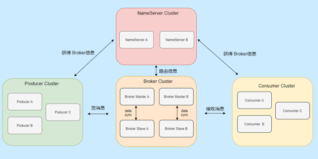
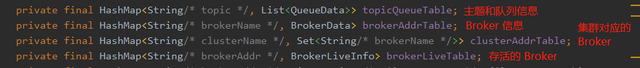
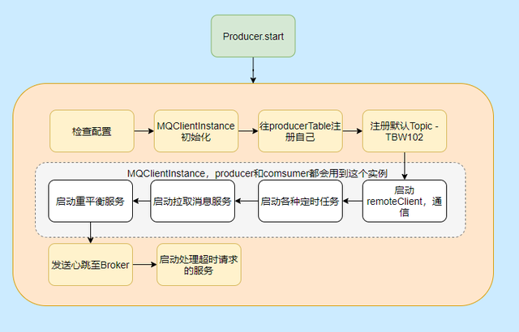
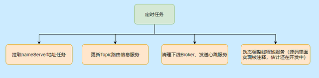
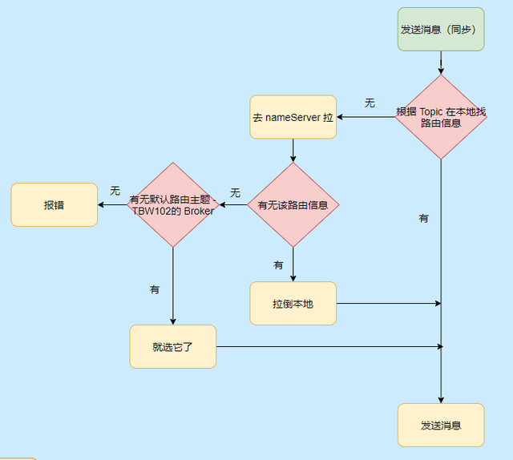
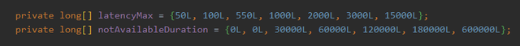
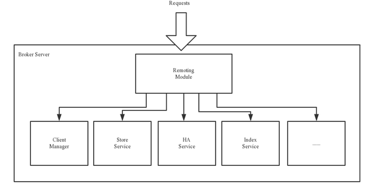
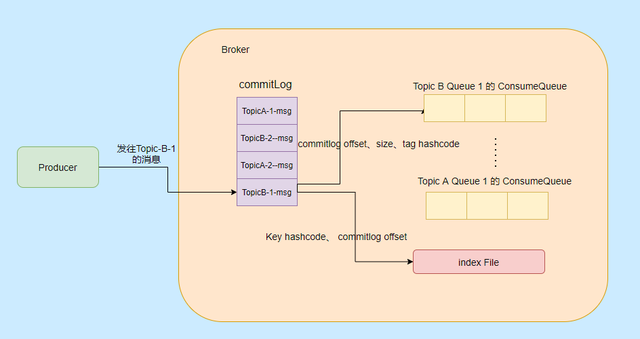
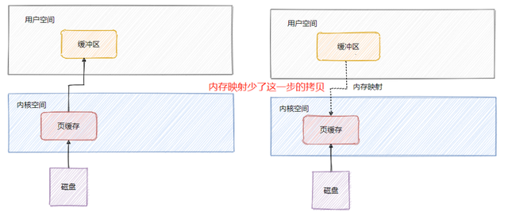

对于消息队列的用处和一些概念不太清楚的同学强烈建议先看消息队列面试连环问，这篇文章介绍了消息队列的使用场景、基本概念和常见面试题。

**RocketMQ 整体架构设计**

整体的架构设计主要分为四大部分，分别是：Producer、Consumer、Broker、NameServer。

为了更贴合实际，我画的都是集群部署，像 Broker 我还画了主从。

Producer：就是消息生产者，可以集群部署。它会先和 NameServer 集群中的随机一台建立长连接，得知当前要发送的 Topic 存在哪台 Broker Master上，然后再与其建立长连接，支持多种负载平衡模式发送消息。Consumer：消息消费者，也可以集群部署。它也会先和 NameServer 集群中的随机一台建立长连接，得知当前要消息的 Topic 存在哪台 Broker Master、Slave上，然后它们建立长连接，支持集群消费和广播消费消息。Broker：主要负责消息的存储、查询消费，支持主从部署，一个 Master 可以对应多个 Slave，Master 支持读写，Slave 只支持读。**Broker 会向集群中的每一台 NameServer 注册自己的路由信息。**NameServer：是一个很简单的 Topic 路由注册中心，支持 Broker 的动态注册和发现，保存 Topic 和 Borker 之间的关系。通常也是集群部署，但是**各 NameServer 之间不会互相通信， 各 NameServer 都有完整的路由信息，**即无状态。我再用一段话来概括它们之间的交互：

先启动 NameServer 集群，各 NameServer 之间无任何数据交互，Broker 启动之后会向所有 NameServer 定期（每 30s）发送心跳包，包括：IP、Port、TopicInfo，NameServer 会定期扫描 Broker 存活列表，如果超过 120s 没有心跳则移除此 Broker 相关信息，代表下线。

这样每个 NameServer 就知道集群所有 Broker 的相关信息，此时 Producer 上线从 NameServer 就可以得知它要发送的某 Topic 消息在哪个 Broker 上，和对应的 Broker （Master 角色的）建立长连接，发送消息。

Consumer 上线也可以从 NameServer 得知它所要接收的 Topic 是哪个 Broker ，和对应的 Master、Slave 建立连接，接收消息。

简单的工作流程如上所述，相信大家对整体数据流转已经有点印象了，我们再来看看每个部分的详细情况。

**NameServer**

它的特点就是轻量级，无状态。角色类似于 Zookeeper 的情况，从上面描述知道其主要的两个功能就是：Broker 管理、路由信息管理。

总体而言比较简单，我再贴一些字段，让大家有更直观的印象知道它存储了些什么。

**Producer**

Producer 无非就是消息生产者，那首先它得知道消息要发往哪个 Broker ，于是每 30s 会从某台 NameServer 获取 Topic 和 Broker 的映射关系存在本地内存中，如果发现新的 Broker 就会和其建立长连接，每 30s 会发送心跳至 Broker 维护连接。

并且会**轮询当前可以发送的 Broker 来发送消息**，达到负载均衡的目的，在**同步发送情况**下如果发送失败会默认重投两次（retryTimesWhenSendFailed = 2），并且不会选择上次失败的 broker，会向其他 broker 投递。

在**异步发送**失败的情况下也会重试，默认也是两次 （retryTimesWhenSendAsyncFailed = 2），但是仅在同一个 Broker 上重试。

***\*Producer 启动流程\****

然后我们再来看看 Producer 的启动流程看看都干了些啥。

大致启动流程图中已经表明的很清晰的，但是有些细节可能还不清楚，比如重平衡啊，TBW102 啥玩意啊，有哪些定时任务啊，别急都会提到的。

有人可能会问这生产者为什么要启拉取服务、重平衡？

因为 Producer 和 Consumer 都需要用 MQClientInstance，而同一个 clientId 是共用一个 MQClientInstance 的， clientId 是通过本机 IP 和 instanceName（默认值 default）拼起来的，所以多个 Producer 、Consumer 实际用的是一个MQClientInstance。

至于有哪些定时任务，请看下图：

***\*Producer 发消息流程\****

我们再来看看发消息的流程，大致也不是很复杂，无非就是找到要发送消息的 Topic 在哪个 Broker 上，然后发送消息。

现在就知道 TBW102 是啥用的，就是接受自动创建主题的 Broker 启动会把这个默认主题登记到 NameServer，这样当 Producer 发送新 Topic 的消息时候就得知哪个 Broker 可以自动创建主题，然后发往那个 Broker。

而 Broker 接受到这个消息的时候发现没找到对应的主题，但是它接受创建新主题，这样就会创建对应的 Topic 路由信息。

**自动创建主题的弊端**

自动创建主题那么有可能该主题的消息都只会发往一台 Broker，起不到负载均衡的作用。

因为创建新 Topic 的请求到达 Broker 之后，Broker 创建对应的路由信息，但是心跳是每 30s 发送一次，所以说 NameServer 最长需要 30s 才能得知这个新 Topic 的路由信息。

**假设此时发送方还在连续快速的发送消息**，那 NameServer 上其实还没有关于这个 Topic 的路由信息，所以**有机会**让别的允许自动创建的 Broker 也创建对应的 Topic 路由信息，这样集群里的 Broker 就能接受这个 Topic 的信息，达到负载均衡的目的，但也有个别 Broker 可能，没收到。

如果发送方这一次发了之后 30s 内一个都不发，之前的那个 Broker 随着心跳把这个路由信息更新到 NameServer 了，那么之后发送该 Topic 消息的 Producer 从 NameServer 只能得知该 Topic 消息只能发往之前的那台 Broker ，这就不均衡了，如果这个新主题消息很多，那台 Broker 负载就很高了。

**所以不建议线上开启允许自动创建主题，即 autoCreateTopicEnable 参数。**

**发送消息故障延迟机制**

有一个参数是 sendLatencyFaultEnable，默认不开启。这个参数的作用是对于之前发送超时的 Broker 进行一段时间的退避。

发送消息会记录此时发送消息的时间，如果超过一定时间，那么此 Broker 就在一段时间内不允许发送。

比如发送时间超过 15000ms 则在 600000 ms 内无法向该 Broker 发送消息。

这个机制其实很关键，发送超时大概率表明此 Broker 负载高，所以先避让一会儿，让它缓一缓，这也是实现消息发送高可用的关键。

**小结一下**

Producer 每 30s 会向 NameSrv 拉取路由信息更新本地路由表，有新的 Broker 就和其建立长连接，每隔 30s 发送心跳给 Broker 。

不要在生产环境开启 autoCreateTopicEnable。

Producer 会通过重试和延迟机制提升消息发送的高可用。

**Broker**

Broker 就比较复杂一些了，但是非常重要。大致分为以下五大模块，我们来看一下官网的图。

Remoting 远程模块，处理客户请求。Client Manager 管理客户端，维护订阅的主题。Store Service 提供消息存储查询服务。HA Serivce，主从同步高可用。Index Serivce，通过指定key 建立索引，便于查询。有几个模块没啥可说的就不分析了，先看看存储的。

**Broker 的存储**

RocketMQ 存储用的是本地文件存储系统，效率高也可靠。

主要涉及到三种类型的文件，分别是 CommitLog、ConsumeQueue、IndexFile。

***\*CommitLog\****

RocketMQ 的所有主题的消息都存在 CommitLog 中，单个 CommitLog 默认 1G，并且文件名以起始偏移量命名，固定 20 位，不足则前面补 0，比如 00000000000000000000 代表了第一个文件，第二个文件名就是 00000000001073741824，表明起始偏移量为 1073741824，以这样的方式命名用偏移量就能找到对应的文件。

所有消息都是顺序写入的，超过文件大小则开启下一个文件。

***\*ConsumeQueue\****

ConsumeQueue 消息消费队列，可以认为是 CommitLog 中消息的索引，因为 CommitLog 是糅合了所有主题的消息，所以通过索引才能更加高效的查找消息。

ConsumeQueue 存储的条目是固定大小，只会存储 8 字节的 commitlog 物理偏移量，4 字节的消息长度和 8 字节 Tag 的哈希值，固定 20 字节。

在实际存储中，ConsumeQueue 对应的是一个Topic 下的某个 Queue，每个文件约 5.72M，由 30w 条数据组成。

消费者是先从 ConsumeQueue 来得到消息真实的物理地址，然后再去 CommitLog 获取消息。

***\*IndexFile\****

IndexFile 就是索引文件，是额外提供查找消息的手段，不影响主流程。

通过 Key 或者时间区间来查询对应的消息，文件名以创建时间戳命名，固定的单个 IndexFile 文件大小约为400M，一个 IndexFile 存储 2000W个索引。

我们再来看看以上三种文件的内容是如何生成的：

消息到了先存储到 Commitlog，然后会有一个 ReputMessageService 线程接近实时地将消息转发给消息消费队列文件与索引文件，也就是说是异步生成的。

**消息刷盘机制**

RocketMQ 提供消息同步刷盘和异步刷盘两个选择，关于刷盘我们都知道效率比较低，单纯存入内存中的话效率是最高的，但是可靠性不高，影响消息可靠性的情况大致有以下几种：

Broker 被暴力关闭，比如 kill -9Broker 挂了操作系统挂了机器断电机器坏了，开不了机磁盘坏了如果都是 1-4 的情况，同步刷盘肯定没问题，异步的话就有可能丢失部分消息，5 和 6就得依靠副本机制了，如果同步双写肯定是稳的，但是性能太差，如果异步则有可能丢失部分消息。

所以需要看场景来使用同步、异步刷盘和副本双写机制。

**页缓存与内存映射**

Commitlog 是混合存储的，所以所有消息的写入就是顺序写入，对文件的顺序写入和内存的写入速度基本上没什么差别。

并且 RocketMQ 的文件都利用了内存映射即 Mmap，将程序虚拟页面直接映射到页缓存上，无需有内核态再往用户态的拷贝，来看一下我之前文章画的图。

页缓存其实就是操作系统对文件的缓存，用来加速文件的读写，也就是说对文件的写入先写到页缓存中，操作系统会不定期刷盘（时间不可控），对文件的读会先加载到页缓存中，并且根据局部性原理还会预读临近块的内容。

其实也是因为使用内存映射机制，所以 RocketMQ 的文件存储都使用定长结构来存储，方便一次将整个文件映射至内存中。

**文件预分配和文件预热**

而内存映射也只是做了映射，只有当真正读取页面的时候产生缺页中断，才会将数据真正加载到内存中，所以 RocketMQ 做了一些优化，防止运行时的性能抖动。

***\*文件预分配\****

CommitLog 的大小默认是1G，当超过大小限制的时候需要准备新的文件，而 RocketMQ 就起了一个后台线程 AllocateMappedFileService，不断的处理 AllocateRequest，AllocateRequest 其实就是预分配的请求，会提前准备好下一个文件的分配，防止在消息写入的过程中分配文件，产生抖动。

***\*文件预热\****

有一个 warmMappedFile 方法，它会把当前映射的文件，每一页遍历多去，写入一个0字节，然后再调用mlock 和 madvise(MADV_WILLNEED)。

mlock：可以将进程使用的部分或者全部的地址空间锁定在物理内存中，防止其被交换到 swap 空间。

madvise：给操作系统建议，说这文件在不久的将来要访问的，因此，提前读几页可能是个好主意。

**小结一下**

CommitLog 采用混合型存储，也就是所有 Topic 都存在一起，顺序追加写入，文件名用起始偏移量命名。

消息先写入 CommitLog 再通过后台线程分发到 ConsumerQueue 和 IndexFile 中。

消费者先读取 ConsumerQueue 得到真正消息的物理地址，然后访问 CommitLog 得到真正的消息。

利用了 mmap 机制减少一次拷贝，利用文件预分配和文件预热提高性能。

提供同步和异步刷盘，根据场景选择合适的机制。

**Broker 的 HA**

从 Broker 会和主 Broker 建立长连接，然后获取主 Broker commitlog 最大偏移量，开始向主 Broker 拉取消息，主 Broker 会返回一定数量的消息，循环进行，达到主从数据同步。

消费者消费消息会先请求主 Broker ，如果主 Broker 觉得现在压力有点大，则会返回从 Broker 拉取消息的建议，然后消费者就去从服务器拉取消息。

**Consumer**

消费有两种模式，分别是广播模式和集群模式。

广播模式：一个分组下的每个消费者都会消费完整的Topic 消息。

集群模式：一个分组下的消费者瓜分消费Topic 消息。

一般我们用的都是集群模式。

而消费者消费消息又分为推和拉模式，详细看我这篇文章消息队列推拉模式，分别从源码级别分析了 RokcetMQ 和 Kafka 的消息推拉，以及推拉模式的优缺点。

**Consumer 端的负载均衡机制**

Consumer 会定期的获取 Topic 下的队列数，然后再去查找订阅了该 Topic 的同一消费组的所有消费者信息，默认的分配策略是类似分页排序分配。

将队列排好序，然后消费者排好序，比如队列有 9 个，消费者有 3 个，那消费者-1 消费队列 0、1、2 的消息，消费者-2 消费队列 3、4、5，以此类推。

所以如果负载太大，那么就加队列，加消费者，通过负载均衡机制就可以感知到重平衡，均匀负载。

**Consumer 消息消费的重试**

难免会遇到消息消费失败的情况，所以需要提供消费失败的重试，而一般的消费失败要么就是消息结构有误，要么就是一些暂时无法处理的状态，所以立即重试不太合适。

RocketMQ 会给**每个消费组**都设置一个重试队列，Topic 是 **%RETRY%+consumerGroup**，并且设定了很多重试级别来延迟重试的时间。

为了利用 RocketMQ 的延时队列功能，重试的消息会先保存在 Topic 名称为“SCHEDULE_TOPIC_XXXX”的延迟队列，在消息的扩展字段里面会存储原来所属的 Topic 信息。

delay 一段时间后再恢复到重试队列中，然后 Consumer 就会消费这个重试队列主题，得到之前的消息。

如果超过一定的重试次数都消费失败，则会移入到死信队列，即 **Topic %DLQ%" + ConsumerGroup** 中，存储死信队列即认为消费成功，因为实在没辙了，暂时放过。

然后我们可以通过人工来处理死信队列的这些消息。

**消息的全局顺序和局部顺序**

全局顺序就是消除一切并发，一个 Topic 一个队列，Producer 和 Consuemr 的并发都为一。

局部顺序其实就是指某个队列顺序，多队列之间还是能并行的。

可以通过 MessageQueueSelector 指定 Producer 某个业务只发这一个队列，然后 Comsuer 通过MessageListenerOrderly 接受消息，其实就是加锁消费。

在 Broker 会有一个 mqLockTable ，顺序消息在创建拉取消息任务的时候需要在 Broker 锁定该消息队列，之后加锁成功的才能消费。

而严格的顺序消息其实很难，假设现在都好好的，如果有个 Broker 宕机了，然后发生了重平衡，队列对应的消费者实例就变了，就会有可能会出现乱序的情况，如果要保持严格顺序，那此时就只能让整个集群不可用了。

**一些注意点**

1、订阅消息是以 ConsumerGroup 为单位存储的，所以ConsumerGroup 中的每个 Consumer 需要有相同的订阅。

因为订阅消息是随着心跳上传的，如果一个 ConsumerGroup 中 Consumer 订阅信息不一样，那么就会出现互相覆盖的情况。

比如消费者 A 订阅 Topic a，消费者 B 订阅 Topic b，此时消费者 A 去 Broker 拿消息，然后 B 的心跳包发出了，Broker 更新了，然后接到 A 的请求，一脸懵逼，没这订阅关系啊。

2、RocketMQ 主从读写分离

从只能读，不能写，并且只有当前客户端读的 offset 和 当前 Broker 已接受的最大 offset 超过限制的物理内存大小时候才会去从读，所以**正常情况下从分担不了流量。**

3、单单加机器提升不了消费速度，队列的数量也需要跟上。

4、之前提到的，不要允许自动创建主题

**RocketMQ 的最佳实践**

这些最佳实践部分参考自官网。

***\*Tags的使用\****

建议一个应用一个 Topic，利用 tages 来标记不同业务，因为 tages 设置比较灵活，且一个应用一个 Topic 很清晰，能直观的辨别。

***\*Keys的使用\****

如果有消息业务上的唯一标识，请填写到 keys 字段中，方便日后的定位查找。

**提高 Consumer 的消费能力**

1、提高消费并行度：增加队列数和消费者数量，提高单个消费者的并行消费线程，参数 consumeThreadMax。

2、批处理消费，设置 consumeMessageBatchMaxSize 参数，这样一次能拿到多条消息，然后比如一个 update语句之前要执行十次，现在一次就执行完。

3、跳过非核心的消息，当负载很重的时候，为了保住那些核心的消息，设置那些非核心的消息，例如此时消息堆积 1W 条了之后，就直接返回消费成功，跳过非核心消息。

**NameServer 的寻址**

请使用 HTTP 静态服务器寻址（默认），这样 NameServer 就能动态发现。

**JVM选项**

以下抄自官网：

如果不关心 RocketMQ Broker的启动时间，通过“预触摸” Java 堆以确保在 JVM 初始化期间每个页面都将被分配。

那些不关心启动时间的人可以启用它：-XX:+AlwaysPreTouch禁用偏置锁定可能会减少JVM暂停， -XX:-UseBiasedLocking至于垃圾回收，建议使用带JDK 1.8的G1收集器。

-XX:+UseG1GC -XX:G1HeapRegionSize=16m-XX:G1ReservePercent=25-XX:InitiatingHeapOccupancyPercent=30

另外不要把-XX:MaxGCPauseMillis的值设置太小，否则JVM将使用一个小的年轻代来实现这个目标，这将导致非常频繁的minor GC，所以建议使用rolling GC日志文件:

-XX:+UseGCLogFileRotation-XX:NumberOfGCLogFiles=5-XX:GCLogFileSize=30m

**Linux内核参数**

以下抄自官网：

**vm.extra_free_kbytes，**告诉VM在后台回收（kswapd）启动的阈值与直接回收（通过分配进程）的阈值之间保留额外的可用内存。RocketMQ使用此参数来避免内存分配中的长延迟。（与具体内核版本相关）**vm.min_free_kbytes，**如果将其设置为低于1024KB，将会巧妙的将系统破坏，并且系统在高负载下容易出现死锁。**vm.max_map_count，**限制一个进程可能具有的最大内存映射区域数。RocketMQ将使用mmap加载CommitLog和ConsumeQueue，因此建议将为此参数设置较大的值。（agressiveness --> aggressiveness）**vm.swappiness****，**定义内核交换内存页面的积极程度。较高的值会增加攻击性，较低的值会减少交换量。建议将值设置为10来避免交换延迟。**File descriptor limits，**RocketMQ需要为文件（CommitLog和ConsumeQueue）和网络连接打开文件描述符。我们建议设置文件描述符的值为655350。Disk scheduler，RocketMQ建议使用I/O截止时间调度器，它试图为请求提供有保证的延迟。