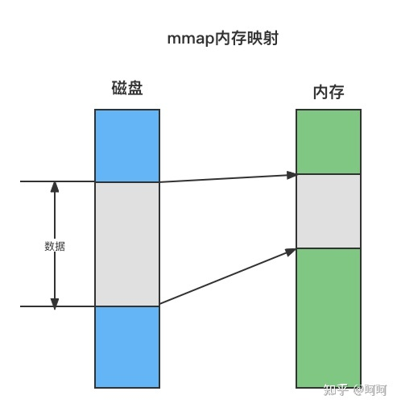

## mmap内存映射

mmap是操作系统实现的一个系统调用，作用是可以将一个文件映射到进程的虚拟地址空间上，mmap会返回一个逻辑地址的指针，使进程可以通过指针来操作文件，进程访问文件就像访问内存一样，而且没有用户态内核态的切换。另外调用mmap进行内存映射时只是简单的内存映射，并没有将文件加载到内存，只有当真正读写这段数据的时候，在MMU地址映射表中找不到逻辑指针对应的物理地址的时候，会发生缺页中断，将文件加载到内存。



在Java中调用mmap的方法

```java
FileChannel fileChannel = new RandomAccessFile(new File("./file.txt"), "rw").getChannel();
MappedByteBuffer mappedByteBuffer = fileChannel.map(FileChannel.MapMode.READ_WRITE, 0, 1024 * 1024 * 1024);
```

刚才提到了调用mmap的时候，并不会将文件加载到内存，只是建立了映射关系，这里我们调用fileChannel.map()方法的时候其实可以看到磁盘上已经创建了一个大小为1g的file.txt文件。FileChannel和MappedByteBuffer都可以理解为是PageCache，用一个写的数据可以从另一个中读出来，rocketmq中这两个都用到了，使用FileChannle+DirectByteBuffer写入，使用MappedByteBuffer读，后面可能会专门写一篇文章来讲FileChannel和MappedByteBuffer，这部分不是本文重点。

mmap也可以在进程之间共享数据，多进程读数据时是安全的，当有一个进程试图写数据，采用Copy On Write（写时复制）来实现，即当进程要修改内存页的时候创建一个页的副本，并修改进程对应的页表项，后续修改都在此副本上进行，其他进程看到的共享数据还是原来的数据，看到不修改的数据。在Java中可以通过调用map方法时使用FileChannel.MapMode.PRIVATE参数来实现。

```java
public static class MapMode {

        /**
         * Mode for a read-only mapping.
         */
        public static final MapMode READ_ONLY
            = new MapMode("READ_ONLY");

        /**
         * Mode for a read/write mapping.
         */
        public static final MapMode READ_WRITE
            = new MapMode("READ_WRITE");

        /**
         * Mode for a private (copy-on-write) mapping.
         * 写时复制
         */
        public static final MapMode PRIVATE
            = new MapMode("PRIVATE");
        ...
}
```

当然mmap也有一定的缺点：

1. 映射的内存必须内存页的整数倍（一般是4k），对于小于4k的会有额外的内存浪费。
2. 额外的映射管理开销。
3. java中限制了mmap的文件大小，最大不能超过2147483647，大约2g。