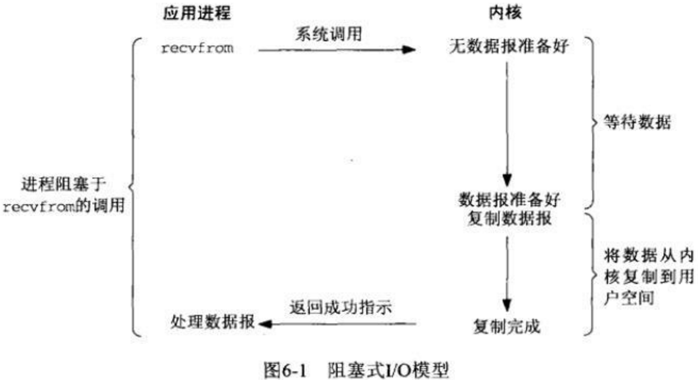
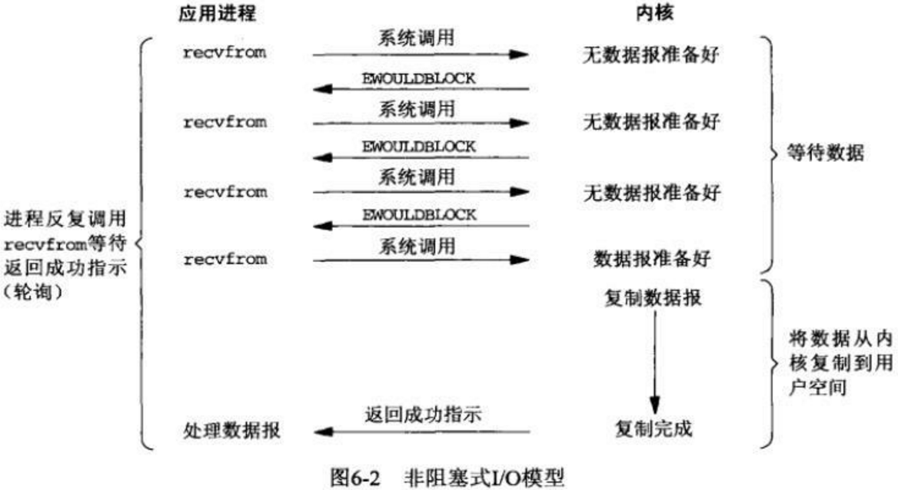
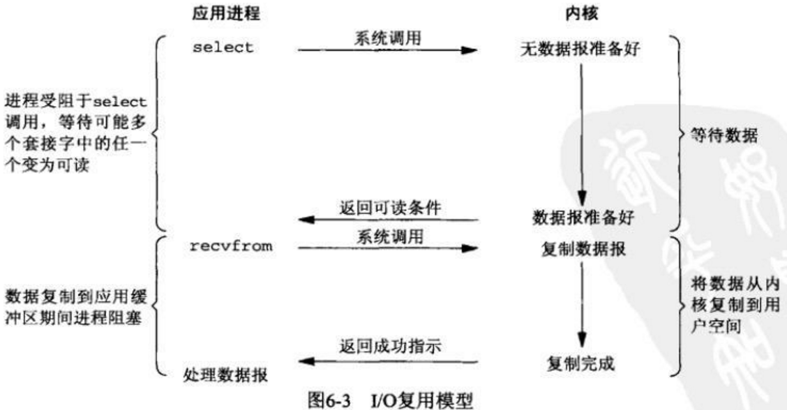
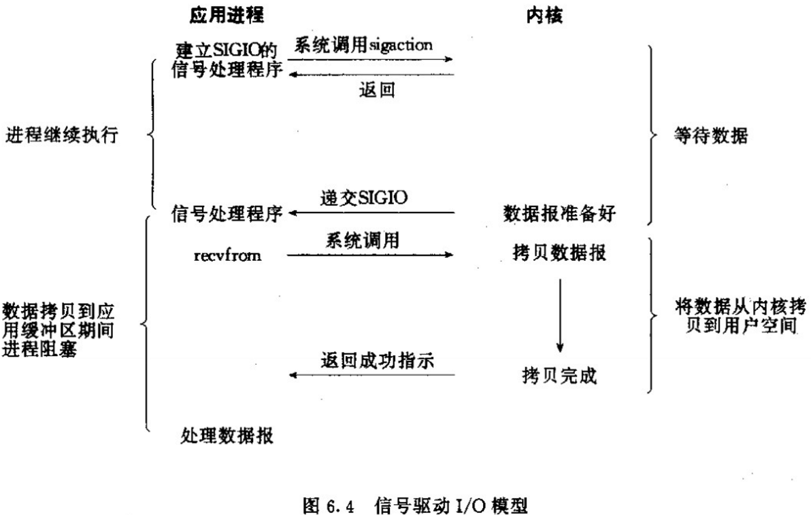
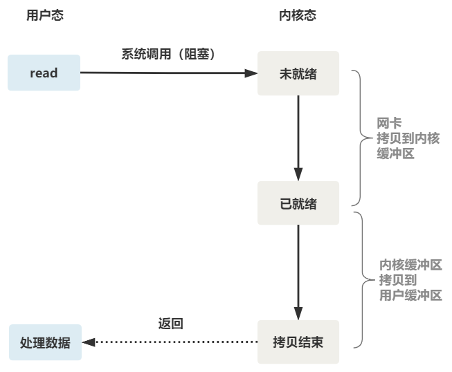
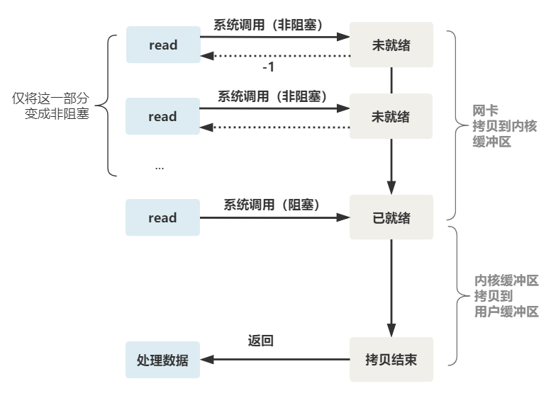
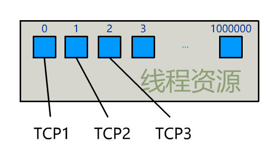
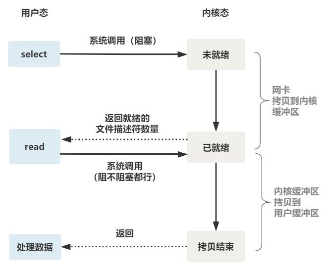

# IO多路复用机制

# 开门见山

**“多路”指的是多个网络连接**
**“复用”指的是复用同一个线程**
采用多路 I/O 复用技术 可以让 单个线程 高效的 处理 多个连接请求（尽量减少网络 IO 的时间消耗）
且 Redis 在内存中操作数据的速度非常快，也就是说 内存内的操作 不会成为 影响Redis性能的瓶颈

Redis的 I/O多路复用程序的所有功能 是通过 包装 select、epoll、evport和kqueue 这些 I/O多路复用函数库 来实现的
每个I/O多路复用函数库 在 Redis源码中 都对应 一个单独的文件

因为Redis 为 每个I/O多路复用函数库 都实现了 相同的API，所以 I/O多路复用程序的底层实现 是可以互换的
Redis在I/O多路复用程序的实现源码中 用#include宏 定义了 相应的规则
程序会在编译时 自动选择 系统中 性能最好的I/O多路复用函数库 来作为 Redis的I/O多路复用程序的底层实现

在正式开始讲Linux IO模型前，比如：同步IO和异步IO，阻塞IO和非阻塞IO分别是什么，到底有什么区别？不同的人在不同的上下文下给出的答案是不同的。所以先限定一下本文的上下文。

# 1 概念说明

在进行解释之前，首先要说明几个概念：

> 用户空间和内核空间
>
> 进程切换
>
> 进程的阻塞
>
> 文件描述符
>
> 缓存 IO

## 1.1 用户空间与内核空间

现在操作系统都是采用虚拟存储器，那么对32位操作系统而言，它的寻址空间（虚拟存储空间）为4G（2的32次方）。`操作系统的核心是内核，独立于普通的应用程序，可以访问受保护的内存空间，也有访问底层硬件设备的所有权限`。为了保证用户进程不能直接操作内核（kernel），保证内核的安全，`操作系统将虚拟空间划分为两部分，一部分为内核空间，一部分为用户空间`。针对linux操作系统而言，将最高的1G字节（从虚拟地址0xC0000000到0xFFFFFFFF），供内核使用，称为内核空间，而将较低的3G字节（从虚拟地址0x00000000到0xBFFFFFFF），供各个进程使用，称为用户空间。

## 1.2 进程切换

为了控制进程的执行，内核必须有能力挂起正在CPU上运行的进程，并恢复以前挂起的某个进程的执行。这种行为被称为进程切换。因此可以说，任何进程都是在操作系统内核的支持下运行的，是与内核紧密相关的。

从一个进程的运行转到另一个进程上运行，这个过程中经过下面这些变化：

> 1. 保存处理机上下文，包括程序计数器和其他寄存器。
> 2. 更新PCB信息。
> 3. 把进程的PCB移入相应的队列，如就绪、在某事件阻塞等队列。
> 4. 选择另一个进程执行，并更新其PCB。
> 5. 更新内存管理的数据结构。
> 6. 恢复处理机上下文。

注：总而言之就是很耗资源，具体的可以参考这篇文章：[进程切换](https://links.jianshu.com/go?to=http%3A%2F%2Fguojing.me%2Flinux-kernel-architecture%2Fposts%2Fprocess-switch%2F)。

## 1.3 进程的阻塞

正在执行的进程，由于期待的某些事件未发生，如请求系统资源失败、等待某种操作的完成、新数据尚未到达或无新工作做等，则由系统自动执行阻塞原语(Block)，使自己由运行状态变为阻塞状态。可见，进程的阻塞是进程自身的一种主动行为，也因此只有处于运行态的进程（获得CPU），才可能将其转为阻塞状态。`当进程进入阻塞状态，是不占用CPU资源的`。

## 1.4 文件描述符fd

文件描述符（File descriptor）是计算机科学中的一个术语，`是一个用于表述指向文件的引用的抽象化概念`。

文件描述符在形式上是一个非负整数。实际上，`它是一个索引值，指向内核为每一个进程所维护的该进程打开文件的记录表`。当程序打开一个现有文件或者创建一个新文件时，内核向进程返回一个文件描述符。在程序设计中，一些涉及底层的程序编写往往会围绕着文件描述符展开。但是文件描述符这一概念往往只适用于UNIX、Linux这样的操作系统。

## 1.5 缓存 IO

`缓存 IO 又被称作标准 IO，大多数文件系统的默认 IO 操作都是缓存 IO`。在 Linux 的缓存 IO 机制中，操作系统会将 IO 的数据缓存在文件系统的页缓存（ page cache ）中，也就是说，`数据会先被拷贝到操作系统内核的缓冲区中，然后才会从操作系统内核的缓冲区拷贝到应用程序的地址空间`。

**缓存 IO 的缺点：**

`数据在传输过程中需要在应用程序地址空间和内核进行多次数据拷贝操作`，这些数据拷贝操作所带来的 CPU 以及内存开销是非常大的。

# 2 Linux IO模型

`网络IO的本质是socket的读取，socket在linux系统被抽象为流，IO可以理解为对流的操作`。刚才说了，对于一次IO访问（以read举例），`数据会先被拷贝到操作系统内核的缓冲区中，然后才会从操作系统内核的缓冲区拷贝到应用程序的地址空间`。所以说，当一个read操作发生时，它会经历两个阶段：

> 1. 第一阶段：等待数据准备 (Waiting for the data to be ready)。
> 2. 第二阶段：将数据从内核拷贝到进程中 (Copying the data from the kernel to the process)。

对于socket流而言，

> 1. 第一步：通常涉及等待网络上的数据分组到达，然后被复制到内核的某个缓冲区。
> 2. 第二步：把数据从内核缓冲区复制到应用进程缓冲区。

网络应用需要处理的无非就是两大类问题，`网络IO，数据计算`。相对于后者，网络IO的延迟，给应用带来的性能瓶颈大于后者。网络IO的模型大致有如下几种：

> - **同步模型（synchronous IO）**
> - 阻塞IO（bloking IO）
> - 非阻塞IO（non-blocking IO）
> - 多路复用IO（multiplexing IO）
> - 信号驱动式IO（signal-driven IO）
> - **异步IO（asynchronous IO）**

**`注：由于signal driven IO在实际中并不常用，所以我这只提及剩下的四种IO Model。`**

在深入介绍Linux IO各种模型之前，让我们先来探索一下基本 Linux IO 模型的简单矩阵。如下图所示：


每个 IO 模型都有自己的使用模式，它们对于特定的应用程序都有自己的优点。本节将简要对其一一进行介绍。`常见的IO模型有阻塞、非阻塞、IO多路复用，异步`。以一个生动形象的例子来说明这四个概念。周末我和女友去逛街，中午饿了，我们准备去吃饭。周末人多，吃饭需要排队，我和女友有以下几种方案。

## 2.1 同步阻塞 IO（blocking IO）

### 2.1.1 场景描述

> 我和女友点完餐后，不知道什么时候能做好，只好坐在餐厅里面等，直到做好，然后吃完才离开。女友本想还和我一起逛街的，但是不知道饭能什么时候做好，只好和我一起在餐厅等，而不能去逛街，直到吃完饭才能去逛街，中间等待做饭的时间浪费掉了。`这就是典型的阻塞`。

### 2.1.2 网络模型

`同步阻塞 IO 模型是最常用的一个模型，也是最简单的模型`。在linux中，`默认情况下所有的socket都是blocking`。它符合人们最常见的思考逻辑。`阻塞就是进程 "被" 休息, CPU处理其它进程去了`。

在这个IO模型中，用户空间的应用程序执行一个系统调用（recvform），这会导致应用程序阻塞，什么也不干，直到数据准备好，并且将数据从内核复制到用户进程，最后进程再处理数据，`在等待数据到处理数据的两个阶段`，整个进程都被阻塞。不能处理别的网络IO。`调用应用程序处于一种不再消费 CPU 而只是简单等待响应的状态`，因此从处理的角度来看，这是非常有效的。在调用recv()/recvfrom()函数时，发生在内核中等待数据和复制数据的过程，大致如下图：



### 2.1.3 流程描述

当用户进程调用了recv()/recvfrom()这个系统调用，`kernel就开始了IO的第一个阶段：准备数据`（对于网络IO来说，很多时候数据在一开始还没有到达。比如，还没有收到一个完整的UDP包。这个时候kernel就要等待足够的数据到来）。这个过程需要等待，也就是说数据被拷贝到操作系统内核的缓冲区中是需要一个过程的。而在用户进程这边，整个进程会被阻塞（当然，是进程自己选择的阻塞）。`第二个阶段：当kernel一直等到数据准备好了，它就会将数据从kernel中拷贝到用户内存`，然后kernel返回结果，用户进程才解除block的状态，重新运行起来。

> 所以，blocking IO的特点就是在IO执行的两个阶段都被block了。

**优点：**

> 1. 能够及时返回数据，无延迟；
> 2. 对内核开发者来说这是省事了；

**缺点：**

> 1. 对用户来说处于等待就要付出性能的代价了；

## 2.2 同步非阻塞 IO（nonblocking IO）

### 2.2.1 场景描述

> 我女友不甘心白白在这等，又想去逛商场，又担心饭好了。所以我们逛一会，回来询问服务员饭好了没有，来来回回好多次，饭都还没吃都快累死了啦。`这就是非阻塞`。需要不断的询问，是否准备好了。

### 2.2.2 网络模型

`同步非阻塞就是 “每隔一会儿瞄一眼进度条” 的轮询（polling）方式`。在这种模型中，`设备是以非阻塞的形式打开的`。这意味着 IO 操作不会立即完成，read 操作可能会返回一个错误代码，说明这个命令不能立即满足（EAGAIN 或 EWOULDBLOCK）。

在网络IO时候，非阻塞IO也会进行recvform系统调用，检查数据是否准备好，与阻塞IO不一样，"非阻塞将大的整片时间的阻塞分成N多的小的阻塞, 所以进程不断地有机会 '被' CPU光顾"。

`也就是说非阻塞的recvform系统调用调用之后，进程并没有被阻塞，内核马上返回给进程，如果数据还没准备好，此时会返回一个error`。进程在返回之后，可以干点别的事情，然后再发起recvform系统调用。重复上面的过程，循环往复的进行recvform系统调用。`这个过程通常被称之为轮询`。轮询检查内核数据，直到数据准备好，再拷贝数据到进程，进行数据处理。**`需要注意，拷贝数据整个过程，进程仍然是属于阻塞的状态`**。

在linux下，可以通过设置socket使其变为non-blocking。`当对一个non-blocking socket执行读操作时`，流程如图所示：



### 2.2.3 流程描述

当用户进程发出read操作时，如果kernel中的数据还没有准备好，那么它并不会block用户进程，而是立刻返回一个error。从用户进程角度讲，它发起一个read操作后，并不需要等待，而是马上就得到了一个结果。用户进程判断结果是一个error时，它就知道数据还没有准备好，于是它可以再次发送read操作。一旦kernel中的数据准备好了，并且又再次收到了用户进程的system call，那么它马上就将数据拷贝到了用户内存，然后返回。

> 所以，nonblocking IO的特点是用户进程需要不断的主动询问kernel数据好了没有。

**同步非阻塞方式相比同步阻塞方式：**

> 优点：能够在等待任务完成的时间里干其他活了（包括提交其他任务，也就是 “后台” 可以有多个任务在同时执行）。
>
> 缺点：任务完成的响应延迟增大了，因为每过一段时间才去轮询一次read操作，而任务可能在两次轮询之间的任意时间完成。这会导致整体数据吞吐量的降低。

## 2.3 IO 多路复用（ IO multiplexing）

### 2.3.1 场景描述

> 与第二个方案差不多，餐厅安装了电子屏幕用来显示点餐的状态，这样我和女友逛街一会，回来就不用去询问服务员了，直接看电子屏幕就可以了。这样每个人的餐是否好了，都直接看电子屏幕就可以了，`这就是典型的IO多路复用`。

### 2.3.2 网络模型

由于同步非阻塞方式需要不断主动轮询，轮询占据了很大一部分过程，轮询会消耗大量的CPU时间，而 “后台” 可能有多个任务在同时进行，人们就想到了循环查询多个任务的完成状态，只要有任何一个任务完成，就去处理它。如果轮询不是进程的用户态，而是有人帮忙就好了。`那么这就是所谓的 “IO 多路复用”`。UNIX/Linux 下的 select、poll、epoll 就是干这个的（epoll 比 poll、select 效率高，做的事情是一样的）。

`IO多路复用有两个特别的系统调用select、poll、epoll函数`。select调用是内核级别的，select轮询相对非阻塞的轮询的区别在于---`前者可以等待多个socket，能实现同时对多个IO端口进行监听`，当其中任何一个socket的数据准好了，`就能返回进行可读`，`然后进程再进行recvform系统调用，将数据由内核拷贝到用户进程，当然这个过程是阻塞的`。select或poll调用之后，会阻塞进程，与blocking IO阻塞不同在于，`此时的select不是等到socket数据全部到达再处理, 而是有了一部分数据就会调用用户进程来处理`。如何知道有一部分数据到达了呢？`监视的事情交给了内核，内核负责数据到达的处理。也可以理解为"非阻塞"吧`。

`I/O复用模型会用到select、poll、epoll函数，这几个函数也会使进程阻塞，但是和阻塞I/O所不同的的，这两个函数可以同时阻塞多个I/O操作`。而且可以同时对多个读操作，多个写操作的I/O函数进行检测，直到有数据可读或可写时（注意不是全部数据可读或可写），才真正调用I/O操作函数。

对于多路复用，也就是轮询多个socket。`多路复用既然可以处理多个IO，也就带来了新的问题，多个IO之间的顺序变得不确定了`，当然也可以针对不同的编号。具体流程，如下图所示：



### 2.3.3 流程描述

IO multiplexing就是我们说的select，poll，epoll，有些地方也称这种IO方式为event driven IO。`select/epoll的好处就在于单个process就可以同时处理多个网络连接的IO`。它的基本原理就是select，poll，epoll这个function会不断的轮询所负责的所有socket，当某个socket有数据到达了，就通知用户进程。

`当用户进程调用了select，那么整个进程会被block`，而同时，kernel会“监视”所有select负责的socket，`当任何一个socket中的数据准备好了，select就会返回`。这个时候用户进程再调用read操作，将数据从kernel拷贝到用户进程。

> 多路复用的特点是`通过一种机制一个进程能同时等待IO文件描述符`，内核监视这些文件描述符（套接字描述符），其中的任意一个进入读就绪状态，select， poll，epoll函数就可以返回。对于监视的方式，又可以分为 select， poll， epoll三种方式。

上面的图和blocking IO的图其实并没有太大的不同，事实上，还更差一些。`因为这里需要使用两个system call (select 和 recvfrom)，而blocking IO只调用了一个system call (recvfrom)`。但是，`用select的优势在于它可以同时处理多个connection`。

所以，如果处理的连接数不是很高的话，使用select/epoll的web server不一定比使用multi-threading + blocking IO的web server性能更好，可能延迟还更大。（select/epoll的优势并不是对于单个连接能处理得更快，而是在于能处理更多的连接。）

在IO multiplexing Model中，`实际中，对于每一个socket，一般都设置成为non-blocking`，但是，如上图所示，整个用户的process其实是一直被block的。`只不过process是被select这个函数block，而不是被socket IO给block`。所以**`IO多路复用是阻塞在select，epoll这样的系统调用之上，而没有阻塞在真正的I/O系统调用如recvfrom之上。`**

在I/O编程过程中，`当需要同时处理多个客户端接入请求时，可以利用多线程或者I/O多路复用技术进行处理`。I/O多路复用技术`通过把多个I/O的阻塞复用到同一个select的阻塞上，从而使得系统在单线程的情况下可以同时处理多个客户端请求`。与传统的多线程/多进程模型比，`I/O多路复用的最大优势是系统开销小`，系统不需要创建新的额外进程或者线程，也不需要维护这些进程和线程的运行，降底了系统的维护工作量，节省了系统资源，I/O多路复用的主要应用场景如下：

> 服务器需要同时处理多个处于监听状态或者多个连接状态的套接字。
>
> 服务器需要同时处理多种网络协议的套接字。

了解了前面三种IO模式，在用户进程进行系统调用的时候，**`他们在等待数据到来的时候，处理的方式不一样，直接等待，轮询，select或poll轮询`**，两个阶段过程：

> 第一个阶段有的阻塞，有的不阻塞，有的可以阻塞又可以不阻塞。
>
> 第二个阶段都是阻塞的。

**`从整个IO过程来看，他们都是顺序执行的，因此可以归为同步模型(synchronous)。都是进程主动等待且向内核检查状态。【此句很重要！！！】`**

`高并发的程序一般使用同步非阻塞方式而非多线程 + 同步阻塞方式`。要理解这一点，首先要扯到并发和并行的区别。比如去某部门办事需要依次去几个窗口，`办事大厅里的人数就是并发数，而窗口个数就是并行度`。也就是说`并发数是指同时进行的任务数（如同时服务的 HTTP 请求）`，而`并行数是可以同时工作的物理资源数量（如 CPU 核数）`。通过合理调度任务的不同阶段，并发数可以远远大于并行度，这就是区区几个 CPU 可以支持上万个用户并发请求的奥秘。在这种高并发的情况下，为每个任务（用户请求）创建一个进程或线程的开销非常大。`而同步非阻塞方式可以把多个 IO 请求丢到后台去，这就可以在一个进程里服务大量的并发 IO 请求`。

**注意：IO多路复用是同步阻塞模型还是异步阻塞模型，在此给大家分析下：**

> 此处仍然不太清楚的，强烈建议大家在细究[《聊聊同步、异步、阻塞与非阻塞》](https://links.jianshu.com/go?to=http%3A%2F%2Fmy.oschina.net%2Fxianggao%2Fblog%2F661085)中讲同步与异步的根本性区别，`同步是需要主动等待消息通知，而异步则是被动接收消息通知，通过回调、通知、状态等方式来被动获取消息`。`IO多路复用在阻塞到select阶段时，用户进程是主动等待并调用select函数获取数据就绪状态消息，并且其进程状态为阻塞`。所以，`把IO多路复用归为同步阻塞模式`。

## 2.4 信号驱动式IO（signal-driven IO）

信号驱动式I/O：首先我们允许Socket进行信号驱动IO,并安装一个信号处理函数，进程继续运行并不阻塞。当数据准备好时，进程会收到一个SIGIO信号，可以在信号处理函数中调用I/O操作函数处理数据。过程如下图所示：



## 2.5 异步非阻塞 IO（asynchronous IO）

### 2.5.1 场景描述

> 女友不想逛街，又餐厅太吵了，回家好好休息一下。于是我们叫外卖，打个电话点餐，然后我和女友可以在家好好休息一下，饭好了送货员送到家里来。这就是典型的异步，只需要打个电话说一下，然后可以做自己的事情，饭好了就送来了。

### 2.5.2 网络模型

相对于同步IO，异步IO不是顺序执行。`用户进程进行aio_read系统调用之后，无论内核数据是否准备好，都会直接返回给用户进程，然后用户态进程可以去做别的事情`。等到socket数据准备好了，内核直接复制数据给进程，`然后从内核向进程发送通知`。`IO两个阶段，进程都是非阻塞的`。

Linux提供了AIO库函数实现异步，但是用的很少。目前有很多开源的异步IO库，例如libevent、libev、libuv。异步过程如下图所示：


### 2.5.3 流程描述

用户进程发起aio_read操作之后，立刻就可以开始去做其它的事。而另一方面，从kernel的角度，当它受到一个asynchronous read之后，`首先它会立刻返回，所以不会对用户进程产生任何block`。然后，kernel会等待数据准备完成，然后将数据拷贝到用户内存，`当这一切都完成之后，kernel会给用户进程发送一个signal或执行一个基于线程的回调函数来完成这次 IO 处理过程`，告诉它read操作完成了。

**在 Linux 中，通知的方式是 “信号”：**

> `如果这个进程正在用户态忙着做别的事（例如在计算两个矩阵的乘积），那就强行打断之，调用事先注册的信号处理函数`，这个函数可以决定何时以及如何处理这个异步任务。由于信号处理函数是突然闯进来的，因此跟中断处理程序一样，有很多事情是不能做的，因此保险起见，`一般是把事件 “登记” 一下放进队列，然后返回该进程原来在做的事`。
>
> `如果这个进程正在内核态忙着做别的事`，例如以同步阻塞方式读写磁盘，`那就只好把这个通知挂起来了，等到内核态的事情忙完了，快要回到用户态的时候，再触发信号通知`。
>
> `如果这个进程现在被挂起了，例如无事可做 sleep 了，那就把这个进程唤醒`，下次有 CPU 空闲的时候，就会调度到这个进程，触发信号通知。

异步 API 说来轻巧，做来难，这主要是对 API 的实现者而言的。Linux 的异步 IO（AIO）支持是 2.6.22 才引入的，还有很多系统调用不支持异步 IO。Linux 的异步 IO 最初是为数据库设计的，`因此通过异步 IO 的读写操作不会被缓存或缓冲，这就无法利用操作系统的缓存与缓冲机制`。

**`很多人把 Linux 的 O_NONBLOCK 认为是异步方式，但事实上这是前面讲的同步非阻塞方式。`**需要指出的是，虽然 Linux 上的 IO API 略显粗糙，但每种编程框架都有封装好的异步 IO 实现。操作系统少做事，把更多的自由留给用户，正是 UNIX 的设计哲学，也是 Linux 上编程框架百花齐放的一个原因。

从前面 IO 模型的分类中，我们可以看出 AIO 的动机：

> 同步阻塞模型需要在 IO 操作开始时阻塞应用程序。这意味着不可能同时重叠进行处理和 IO 操作。
>
> 同步非阻塞模型允许处理和 IO 操作重叠进行，但是这需要应用程序根据重现的规则来检查 IO 操作的状态。
>
> 这样就剩下异步非阻塞 IO 了，它允许处理和 IO 操作重叠进行，包括 IO 操作完成的通知。

IO多路复用除了需要阻塞之外，`select 函数所提供的功能（异步阻塞 IO）与 AIO 类似`。不过，`它是对通知事件进行阻塞，而不是对 IO 调用进行阻塞`。

# 3 五种IO模型总结

## 3.1 blocking和non-blocking区别

调用blocking IO会一直block住对应的进程直到操作完成，而non-blocking IO在kernel还准备数据的情况下会立刻返回。

## 3.2 synchronous IO和asynchronous IO区别

在说明synchronous IO和asynchronous IO的区别之前，需要先给出两者的定义。POSIX的定义是这样子的：

> A synchronous I/O operation causes the requesting process to be blocked until that I/O operation completes;
>
> An asynchronous I/O operation does not cause the requesting process to be blocked;

`两者的区别就在于synchronous IO做”IO operation”的时候会将process阻塞`。按照这个定义，之前所述的blocking IO，non-blocking IO，IO multiplexing都属于synchronous IO。

有人会说，non-blocking IO并没有被block啊。这里有个非常“狡猾”的地方，`定义中所指的”IO operation”是指真实的IO操作`，就是例子中的recvfrom这个system call。non-blocking IO在执行recvfrom这个system call的时候，如果kernel的数据没有准备好，这时候不会block进程。但是，`当kernel中数据准备好的时候，recvfrom会将数据从kernel拷贝到用户内存中，这个时候进程是被block了`，在这段时间内，进程是被block的。

而asynchronous IO则不一样，`当进程发起IO 操作之后，就直接返回再也不理睬了，直到kernel发送一个信号，告诉进程说IO完成`。在这整个过程中，进程完全没有被block。

**各个IO Model的比较如图所示：**


通过上面的图片，可以发现non-blocking IO和asynchronous IO的区别还是很明显的。`在non-blocking IO中，虽然进程大部分时间都不会被block，但是它仍然要求进程去主动的check`，并且当数据准备完成以后，也需要进程主动的再次调用recvfrom来将数据拷贝到用户内存。而asynchronous IO则完全不同。`它就像是用户进程将整个IO操作交给了他人（kernel）完成，然后他人做完后发信号通知`。在此期间，`用户进程不需要去检查IO操作的状态，也不需要主动的去拷贝数据`。

# 总结

redis使用之所以IO多路复用是因为，举个例子

两台服务器，两个用户的请求分别进入两台服务器，两台服务器请求redis想要修改某个key的数据

假设服务器1是15点23分1.001秒发出的请求，服务器2是15点23分1.002秒发出的请求

从时间上来看服务器1比服务器2先请求，按理说最终redis中该key的值应该是服务器2请求修改的值，但真实情况不一定是这样。

虽然服务器1比服务器2先请求，但服务器1的请求不是一定比服务器2的请求先到达redis，所以redis先处理谁的请求并没有明确的顺序要求。而IO多路服务也是这样，客户端只管请求，我先响应谁的无所谓，所以IO多路复用带来的无序性无需担心。

# 别的地方的文章（作为补充）

## **阻塞 IO**

服务端为了处理客户端的连接和请求的数据，写了如下代码。

```
listenfd = socket();   // 打开一个网络通信端口
bind(listenfd);        // 绑定
listen(listenfd);      // 监听
while(1) {
  connfd = accept(listenfd);  // 阻塞建立连接
  int n = read(connfd, buf);  // 阻塞读数据
  doSomeThing(buf);  // 利用读到的数据做些什么
  close(connfd);     // 关闭连接，循环等待下一个连接
}
```

这段代码会执行得磕磕绊绊，就像这样。


可以看到，服务端的线程阻塞在了两个地方，一个是 accept 函数，一个是 read 函数。

如果再把 read 函数的细节展开，我们会发现其阻塞在了两个阶段。


这就是传统的阻塞 IO。

整体流程如下图。



所以，如果这个连接的客户端一直不发数据，那么服务端线程将会一直阻塞在 read 函数上不返回，也无法接受其他客户端连接。

这肯定是不行的。

## **非阻塞 IO**

为了解决上面的问题，其关键在于改造这个 read 函数。

有一种聪明的办法是，每次都创建一个新的进程或线程，去调用 read 函数，并做业务处理。

```
while(1) {
  connfd = accept(listenfd);  // 阻塞建立连接
  pthread_create（doWork);  // 创建一个新的线程
}
void doWork() {
  int n = read(connfd, buf);  // 阻塞读数据
  doSomeThing(buf);  // 利用读到的数据做些什么
  close(connfd);     // 关闭连接，循环等待下一个连接
}
```

这样，当给一个客户端建立好连接后，就可以立刻等待新的客户端连接，而不用阻塞在原客户端的 read 请求上。


不过，这不叫非阻塞 IO，只不过用了多线程的手段使得主线程没有卡在 read 函数上不往下走罢了。操作系统为我们提供的 read 函数仍然是阻塞的。

所以真正的非阻塞 IO，不能是通过我们用户层的小把戏，**而是要恳请操作系统为我们提供一个非阻塞的 read 函数**。

这个 read 函数的效果是，如果没有数据到达时（到达网卡并拷贝到了内核缓冲区），立刻返回一个错误值（-1），而不是阻塞地等待。

操作系统提供了这样的功能，只需要在调用 read 前，将文件描述符设置为非阻塞即可。

```
fcntl(connfd, F_SETFL, O_NONBLOCK);
int n = read(connfd, buffer) != SUCCESS);
```

这样，就需要用户线程循环调用 read，直到返回值不为 -1，再开始处理业务。


这里我们注意到一个细节。

非阻塞的 read，指的是在数据到达前，即数据还未到达网卡，或者到达网卡但还没有拷贝到内核缓冲区之前，这个阶段是非阻塞的。

当数据已到达内核缓冲区，此时调用 read 函数仍然是阻塞的，需要等待数据从内核缓冲区拷贝到用户缓冲区，才能返回。

整体流程如下图



## **IO 多路复用**

为每个客户端创建一个线程，服务器端的线程资源很容易被耗光。



当然还有个聪明的办法，我们可以每 accept 一个客户端连接后，将这个文件描述符（connfd）放到一个数组里。

```
fdlist.add(connfd);
```

然后弄一个新的线程去不断遍历这个数组，调用每一个元素的非阻塞 read 方法。

```c
while(1) {
  for(fd <-- fdlist) {
    if(read(fd) != -1) {
      doSomeThing();
    }
  }
}
```

这样，我们就成功用一个线程处理了多个客户端连接。


你是不是觉得这有些多路复用的意思？

但这和我们用多线程去将阻塞 IO 改造成看起来是非阻塞 IO 一样，这种遍历方式也只是我们用户自己想出的小把戏，每次遍历遇到 read 返回 -1 时仍然是一次浪费资源的系统调用。

在 while 循环里做系统调用，就好比你做分布式项目时在 while 里做 rpc 请求一样，是不划算的。

所以，还是得恳请操作系统老大，提供给我们一个有这样效果的函数，我们将一批文件描述符通过一次系统调用传给内核，由内核层去遍历，才能真正解决这个问题。

## **select**

select 是操作系统提供的系统调用函数，通过它，我们可以把一个文件描述符的数组发给操作系统，让操作系统去遍历，确定哪个文件描述符可以读写，然后告诉我们去处理：


select 系统调用的函数定义如下。

```
int select(
    int nfds,
    fd_set *readfds,
    fd_set *writefds,
    fd_set *exceptfds,
    struct timeval *timeout);
// nfds:监控的文件描述符集里最大文件描述符加1
// readfds：监控有读数据到达文件描述符集合，传入传出参数
// writefds：监控写数据到达文件描述符集合，传入传出参数
// exceptfds：监控异常发生达文件描述符集合, 传入传出参数
// timeout：定时阻塞监控时间，3种情况
//  1.NULL，永远等下去
//  2.设置timeval，等待固定时间
//  3.设置timeval里时间均为0，检查描述字后立即返回，轮询
```

服务端代码，这样来写。

首先一个线程不断接受客户端连接，并把 socket 文件描述符放到一个 list 里。

```
while(1) {
  connfd = accept(listenfd);
  fcntl(connfd, F_SETFL, O_NONBLOCK);
  fdlist.add(connfd);
}
```

然后，另一个线程不再自己遍历，而是调用 select，将这批文件描述符 list 交给操作系统去遍历。

```
while(1) {
  // 把一文件描述符 list 传给 select 函数
  // 有已就绪的文件描述符就返回，nready 表示有多少个就绪的
  nready = select(list);
  
}
```

不过，当 select 函数返回后，用户依然需要遍历刚刚提交给操作系统的 list。

只不过，操作系统会将准备就绪的文件描述符做上标识，用户层将不会再有无意义的系统调用开销。

```
while(1) 
  nready = select(list);
  // 用户层依然要遍历，只不过少了很多无效的系统调用
  for(fd <-- fdlist) 
    if(fd != -1) 
      // 只读已就绪的文件描述符
      read(fd, buf);
      // 总共只有 nready 个已就绪描述符，不用过多遍历
      if(--nready == 0) break;
    }
  }
}
```

正如刚刚的动图中所描述的，其直观效果如下。（同一个动图消耗了你两次流量，气不气？）


可以看出几个细节：

\1. select 调用需要传入 fd 数组，需要拷贝一份到内核，高并发场景下这样的拷贝消耗的资源是惊人的。（可优化为不复制）

\2. select 在内核层仍然是通过遍历的方式检查文件描述符的就绪状态，是个同步过程，只不过无系统调用切换上下文的开销。（内核层可优化为异步事件通知）

\3. select 仅仅返回可读文件描述符的个数，具体哪个可读还是要用户自己遍历。（可优化为只返回给用户就绪的文件描述符，无需用户做无效的遍历）

整个 select 的流程图如下。



可以看到，这种方式，既做到了一个线程处理多个客户端连接（文件描述符），又减少了系统调用的开销（多个文件描述符只有一次 select 的系统调用 + n 次就绪状态的文件描述符的 read 系统调用）。

## **poll**

poll 也是操作系统提供的系统调用函数。

```
int poll(struct pollfd *fds, nfds_tnfds, int timeout);

struct pollfd {
  intfd; /*文件描述符*/
  shortevents; /*监控的事件*/
  shortrevents; /*监控事件中满足条件返回的事件*/
};
```

它和 select 的主要区别就是，去掉了 select 只能监听 1024 个文件描述符的限制。

## **epoll**

epoll 是最终的大 boss，它解决了 select 和 poll 的一些问题。

还记得上面说的 select 的三个细节么？

\1. select 调用需要传入 fd 数组，需要拷贝一份到内核，高并发场景下这样的拷贝消耗的资源是惊人的。（可优化为不复制）

\2. select 在内核层仍然是通过遍历的方式检查文件描述符的就绪状态，是个同步过程，只不过无系统调用切换上下文的开销。（内核层可优化为异步事件通知）

\3. select 仅仅返回可读文件描述符的个数，具体哪个可读还是要用户自己遍历。（可优化为只返回给用户就绪的文件描述符，无需用户做无效的遍历）

所以 epoll 主要就是针对这三点进行了改进。

\1. 内核中保存一份文件描述符集合，无需用户每次都重新传入，只需告诉内核修改的部分即可。

\2. 内核不再通过轮询的方式找到就绪的文件描述符，而是通过异步 IO 事件唤醒。

\3. 内核仅会将有 IO 事件的文件描述符返回给用户，用户也无需遍历整个文件描述符集合。

具体，操作系统提供了这三个函数。

第一步，创建一个 epoll 句柄

```
int epoll_create(int size);
```

第二步，向内核添加、修改或删除要监控的文件描述符。

```
int epoll_ctl(
  int epfd, int op, int fd, struct epoll_event *event);
```

第三步，类似发起了 select () 调用

```
int epoll_wait(
  int epfd, struct epoll_event *events, int max events, int timeout);
```

使用起来，其内部原理就像如下一般丝滑。


如果你想继续深入了解 epoll 的底层原理，推荐阅读飞哥的《图解 | 深入揭秘 epoll 是如何实现 IO 多路复用的！》，从 linux 源码级别，一行一行非常硬核地解读 epoll 的实现原理，且配有大量方便理解的图片，非常适合源码控的小伙伴阅读。

## **后记**

大白话总结一下。

一切的开始，都起源于这个 read 函数是操作系统提供的，而且是阻塞的，我们叫它 **阻塞 IO**。

为了破这个局，程序员在用户态通过多线程来防止主线程卡死。

后来操作系统发现这个需求比较大，于是在操作系统层面提供了非阻塞的 read 函数，这样程序员就可以在一个线程内完成多个文件描述符的读取，这就是 **非阻塞 IO**。

但多个文件描述符的读取就需要遍历，当高并发场景越来越多时，用户态遍历的文件描述符也越来越多，相当于在 while 循环里进行了越来越多的系统调用。

后来操作系统又发现这个场景需求量较大，于是又在操作系统层面提供了这样的遍历文件描述符的机制，这就是 **IO 多路复用**。

多路复用有三个函数，最开始是 select，然后又发明了 poll 解决了 select 文件描述符的限制，然后又发明了 epoll 解决 select 的三个不足。

所以，IO 模型的演进，其实就是时代的变化，倒逼着操作系统将更多的功能加到自己的内核而已。

如果你建立了这样的思维，很容易发现网上的一些错误。

比如好多文章说，多路复用之所以效率高，是因为用一个线程就可以监控多个文件描述符。

这显然是知其然而不知其所以然，多路复用产生的效果，完全可以由用户态去遍历文件描述符并调用其非阻塞的 read 函数实现。而多路复用快的原因在于，操作系统提供了这样的系统调用，使得原来的 while 循环里多次系统调用，变成了一次系统调用 + 内核层遍历这些文件描述符。

就好比我们平时写业务代码，把原来 while 循环里调 http 接口进行批量，改成了让对方提供一个批量添加的 http 接口，然后我们一次 rpc 请求就完成了批量添加。