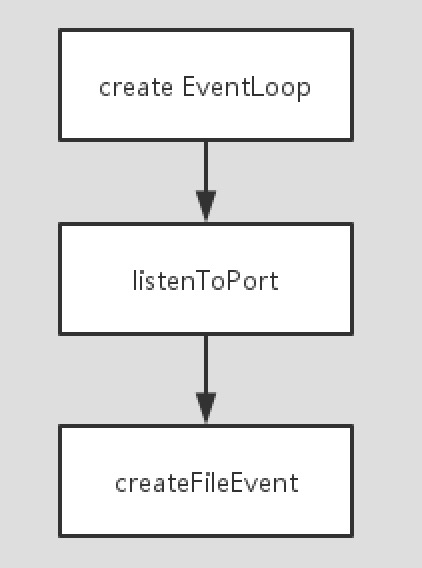
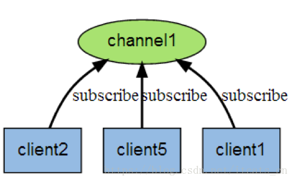
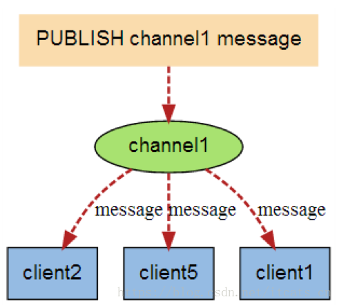
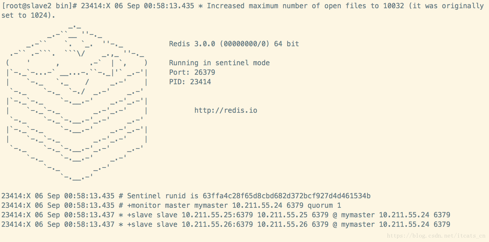
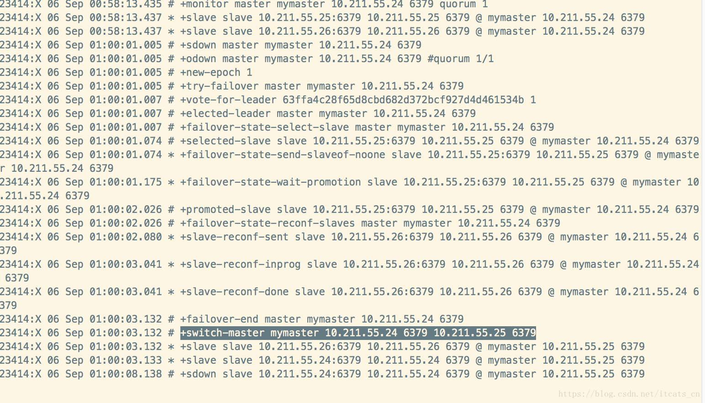
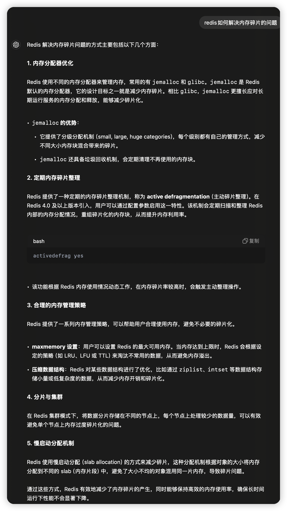
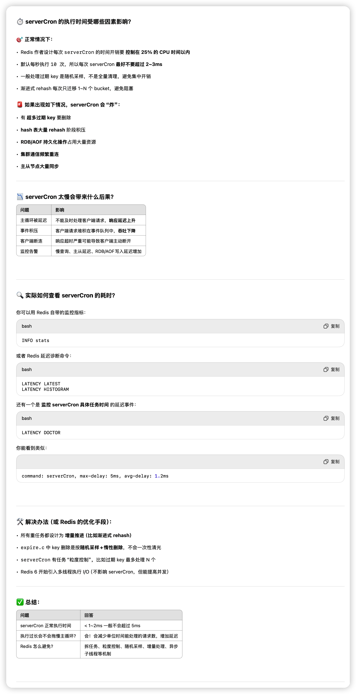

# Redis


## 什么是Redis?

Redis 是开源免费的，遵守BSD协议，是一个高性能的key-value非关系型数据库。

Redis的单个key和value最大大小都是512M

### redis单进程单线程

所谓的单线程指的是网络请求模块使用了一个线程（所以不需考虑并发安全性），即一个线程处理所有网络请求，其他模块仍用了多个线程。

redis采用多路复用机制：即多个网络socket复用一个io线程，实际是单个线程通过记录跟踪每一个Sock(I/O流)的状态来同时管理多个I/O流. 

**一、网络基础架构**


这里解释下上图涉及的组件，Redis网络层基础组件主要包括四个部分：

1）EventLoop事件轮询器，这部分实现在AE里面。

2）提供Socket句柄事件的多路复用器，这部分分别对于不同平台提供了不同的实现，比如epoll和select可以用于Linux平台、kqueue可以用于苹果平台、evpoll可以用于Solaris平台，这里并没有看到iocp，也就是Redis对于Windows支持并不是很好。

3）包括网络事件处理器实现的networking，这部分主要包括两个重要的事件处理器：acceptTcpHandler和acceptCommonHandler。

4）处理网络比较底层的部分，比如网络句柄创建、网络的读写等。

#### Redis主进程调度核心EventLoop源码解析

Redis输入分为两类

1、系统内部产生的，主要是定时器触发的；比如，Redis的key支持超时，那么系统内部肯定会在一定的周期去检查哪些key超时了。这就是定时器触发的一个输入事件。

2、系统外部产生的。这主要是一些IO事件。比如，用户在redis-cli输入一个命令，它最终是会通过socket传给server的，对于server来说，这是一个socket的IO事件。又比如，rdb的持久化过程，就是对磁盘文件的读写IO事件。在linux中，这些IO事件最终都可以转换为对一个FD（文件描述符）的读写事件。

在redis-server的main函数中，最后会调用aeMain，这就是我们的主循环，必须放在main最后。代码走到这里就会一直在这个循环里面执行，除非退出。


aeMain里面就是一个while循环了，它的执行条件eventLoop->stop正常情况下都是false，所以会一直循环。


它里面调用了aeProcessEvents，这个函数就是最核心的循环处理入口了。下面我们重点分析这个函数。

```c
int aeProcessEvents(aeEventLoop *eventLoop, int flags)
{
    int processed = 0, numevents;
 
    /* Nothing to do? return ASAP */
    if (!(flags & AE_TIME_EVENTS) && !(flags & AE_FILE_EVENTS)) return 0;
 
    /* Note that we want call select() even if there are no
     * file events to process as long as we want to process time
     * events, in order to sleep until the next time event is ready
     * to fire. */
	
    // ae的事件有两种类型：fd的IO事件、定时器事件，如果都不存在，则不需要执行下面代码。
    if (eventLoop->maxfd != -1 ||
        ((flags & AE_TIME_EVENTS) && !(flags & AE_DONT_WAIT))) {
        int j;
        aeTimeEvent *shortest = NULL;
        struct timeval tv, *tvp;
 
        // 下面这一大段代码巴拉巴拉，其实都是在干一件事情，就是找到最近一个超时的定时器事件。
        // 并且获取距离当前的这个时间间隔值。拿来做什么用呢？
        // 为了避免“忙等待”，我们在检查FD的IO读写状态时（select或者epoll），都会采用阻塞的方式，如果没有可读可写的FD，就一直阻塞着等待。但是，我还有定时器事件要处理啊，如果一直没有IO事件，那我定时器事件不是一直没法处理么？
        // 所以，我们会给select或者epoll传入一个阻塞的超时时间，超过这个时间，都给我返回。
        // 下面获取的这个值，就是用于设置阻塞超时时间的。
        // 这样做，既可以避免非阻塞式的忙等待，又可以保证定时器事件能够按时得到处理。
        // 其实这种处理方式非常普遍，以C为开发语言的很多服务型软件都是这样玩的。
 
        if (flags & AE_TIME_EVENTS && !(flags & AE_DONT_WAIT))
            // 找到最近超时的定时器事件
            shortest = aeSearchNearestTimer(eventLoop); 
        if (shortest) { 
            long now_sec, now_ms;
 
            aeGetTime(&now_sec, &now_ms);
            tvp = &tv;
 
            /* How many milliseconds we need to wait for the next
             * time event to fire? */
            long long ms =
                (shortest->when_sec - now_sec)*1000 +
                shortest->when_ms - now_ms;
			// 计算超时时间
            if (ms > 0) {
                tvp->tv_sec = ms/1000;
                tvp->tv_usec = (ms % 1000)*1000;
            } else {
                // 已经有定时器超时了。采用非阻塞（tvp设置为0），立即返回。
                tvp->tv_sec = 0;
                tvp->tv_usec = 0;
            }
        } else {
            /* If we have to check for events but need to return
             * ASAP because of AE_DONT_WAIT we need to set the timeout
             * to zero */
            if (flags & AE_DONT_WAIT) {
                tv.tv_sec = tv.tv_usec = 0;
                tvp = &tv;
            } else {
                /* Otherwise we can block */
                // 没有定时器事件？ 那就一直阻塞吧。
                tvp = NULL; /* wait forever */
            }
        }
        
        // AE_DONT_WAIT表示强制不允许阻塞。这在TLS的场景中有用。
        if (eventLoop->flags & AE_DONT_WAIT) {
            tv.tv_sec = tv.tv_usec = 0;
            tvp = &tv;
        }
 
		// select之前提供一个回调
        if (eventLoop->beforesleep != NULL && flags & AE_CALL_BEFORE_SLEEP)
            eventLoop->beforesleep(eventLoop);
 
        /* Call the multiplexing API, will return only on timeout or when
         * some event fires. */
        // 这里面就是调select或者epoll。这就是网上老说的IO多路复用，很多把这个点作为redis高性能的一个重要原因来提。但是，IO多路复用不是很普遍吗？ 现在还有读socket不是这样多路复用的吗？
        numevents = aeApiPoll(eventLoop, tvp);
 
        /* After sleep callback. */
		// select之后提供一个回调
        if (eventLoop->aftersleep != NULL && flags & AE_CALL_AFTER_SLEEP)
            eventLoop->aftersleep(eventLoop);
 
		// 回调各个event的处理函数
        for (j = 0; j < numevents; j++) {
            aeFileEvent *fe = &eventLoop->events[eventLoop->fired[j].fd];
            int mask = eventLoop->fired[j].mask;
            int fd = eventLoop->fired[j].fd;
            int fired = 0; /* Number of events fired for current fd. */
 
            /* Normally we execute the readable event first, and the writable
             * event laster. This is useful as sometimes we may be able
             * to serve the reply of a query immediately after processing the
             * query.
             *
             * However if AE_BARRIER is set in the mask, our application is
             * asking us to do the reverse: never fire the writable event
             * after the readable. In such a case, we invert the calls.
             * This is useful when, for instance, we want to do things
             * in the beforeSleep() hook, like fsynching a file to disk,
             * before replying to a client. */
            int invert = fe->mask & AE_BARRIER;
 
            /* Note the "fe->mask & mask & ..." code: maybe an already
             * processed event removed an element that fired and we still
             * didn't processed, so we check if the event is still valid.
             *
             * Fire the readable event if the call sequence is not
             * inverted. */
            // 可读事件的回调处理
            if (!invert && fe->mask & mask & AE_READABLE) {
                fe->rfileProc(eventLoop,fd,fe->clientData,mask);
                fired++;
                fe = &eventLoop->events[fd]; /* Refresh in case of resize. */
            }
            
            // 可写事件的回调处理
            /* Fire the writable event. */
            if (fe->mask & mask & AE_WRITABLE) {
                if (!fired || fe->wfileProc != fe->rfileProc) {
                    fe->wfileProc(eventLoop,fd,fe->clientData,mask);
                    fired++;
                }
            }
 
            /* If we have to invert the call, fire the readable event now
             * after the writable one. */
            if (invert) {
                fe = &eventLoop->events[fd]; /* Refresh in case of resize. */
                if ((fe->mask & mask & AE_READABLE) &&
                    (!fired || fe->wfileProc != fe->rfileProc))
                {
                    fe->rfileProc(eventLoop,fd,fe->clientData,mask);
                    fired++;
                }
            }
 
            processed++;
        }
    }
    /* Check time events */
	// 处理定时器事件
    if (flags & AE_TIME_EVENTS)
        processed += processTimeEvents(eventLoop);
 
    return processed; /* return the number of processed file/time events */
}
```

eventloop的事件分为FD读写事件和定时器事件

调用aeCreateFileEvent注册fd的AE_READABLE事件，并且给它注册一个回调函数ae_handler

同一个系统中的fd都是内核分配的，全局的，所以fd是唯一的。redis为了查询效率，使用了数组events[]来存这些事件。这个数组在server_init就分配好了。这是空间换时间。

#### 单进程单线程模型

要理解Redis的单线程模型，我们先抛出一些问题，当我们有多个客户端同时去跟Redis Server建立连接，之后又同时对某个key进行操作，这个过程中发生了什么呢？会不会有并发问题？这些问题先丢在这了，我们看看Redis启动初始化的过程中会做什么事情，这里尽量省略了与本文无关的部分：

1）初始化Redis Server参数，这部分代码通过initServerConfig实现。

2）初始化Redis Server，这部分代码在initServer里面。

3）启动事件轮询器。

对，这里我们就把Redis的启动部分简化为三步，跟网络操作有关的主要在第二步和第三步里面，来看看initServer里面发生了什么：

initServer流程


initServer里面首先创建了一个EventLoop，然后监听Server的IP对应的端口号，假设我们监听的是 127.0.0.1:3333 这个IP:端口对，我们得到的一个Server Socket句柄，最后通过createFileEvent将我们得到的Server Socket句柄和我们关心的网络事件mask注册到EventLoop上面。EventLoop是什么呢，我们看看它的定义：

```java
typedef struct aeEventLoop {
    int maxfd;   /* highest file descriptor currently registered */
    int setsize; /* max number of file descriptors tracked */
    long long timeEventNextId;
    time_t lastTime;     /* Used to detect system clock skew */
    aeFileEvent *events; /* Registered events */
    aeFiredEvent *fired; /* Fired events */
    aeTimeEvent *timeEventHead;
    int stop;
    void *apidata; /* This is used for polling API specific data */
    aeBeforeSleepProc *beforesleep;
} aeEventLoop;
```

上面我们关注的主要是两个东西：events和fired。他们分别是两个数组，events用于存放被注册的事件以及相应的句柄，当EventLoop线程从多路复用器轮询到有事件的句柄的时候，EventLoop线程会把它放入fired数组里面，然后处理。


我用上面的示意图描述createFileEvent做的事情，就是将Server Socket句柄和关心的事件mask以及当事件产生的时候的事件处理器accptHandler生成一个aeFileEvent注册到EventLoop的events的数组里面，当然在这之前会首先将事件注册到多路复用器上，也就是epoll、kqueue等这些组件上。事件注册完之后需要对多路复用器进行轮询，来分离我们关心且发生的事件，那就是最后一步，启动事件轮询器。

**接收网络连接**

上面的步骤完成了服务端的网络初始化，而且事件轮询器已经开始工作了，事件轮询器做什么事情呢，就是不断轮询多路复用器，看看之前注册的事件有没有发生，如果有发生，则将会将事件分离出来，放入EventLoop的fired数组中，然后处理这些事件。

很显然，上面注册的事件是客户端建立连接这个事件，因此当有两个客户端同时连接Redis服务器的时候，事件轮询器会从多路复用器上面分离出这个事件，同时调用acceptHandler来处理。acceptHandler做的事情主要是accept客户端的连接，创建socket句柄，然后将socket句柄和读事件注册到EventLoop的events数组里面，不一样的是对于客户端的事件处理器是readQueryClient。


上面示意图表示了acceptHandler处理客户端连接，得到句柄之后再将这个句柄注册到多路复用器以及EventLoop上的示意图。之后再同样再处理下一个客户端的连接，这些都是串行的。

**事件轮询**

上面接收客户端这部分其实都发生在事件轮询的主循环里面：

```java
void aeMain(aeEventLoop *eventLoop) {
    eventLoop->stop = 0;
    while (!eventLoop->stop) {
        if (eventLoop->beforesleep != NULL)
            eventLoop->beforesleep(eventLoop);
        aeProcessEvents(eventLoop, AE_ALL_EVENTS);
    }
}
```

Redis会不断的轮询多路复用器，将网络事件分离出来，如果是accept事件，则新接收客户端连接并将其注册到多路复用器以及EventLoop中，如果是查询事件，则通过读取客户端的命令进行相应的处理，这一切都是单线程，顺序的执行的，因此不会发生并发问题。

#### 高性能单线程模型

根据官方的测试结果《How fast is Redis？》来看，在操作内存的情况下，CPU 并不能起到决定性的作用，反而可能带来一些其他问题。比如锁，CPU 切换带来的性能开销等。这一点我们可以根据官方的测试报告，提供的数据来证明。而且官方提供的数据是可以达到100000+的QPS（每秒内查询次数），这个数据并不比采用单进程多线程 Memcached 差！所以在基于内存的操作，CPU 不是 Redis 瓶颈的情况下，瓶颈在网络 I/O 上面，我们一般提供较好的网络环境就可以提升Redis的吞吐量，比如提高网络带宽，除此之外还可以通过合并命令提交批处理请求来代替单条命令一次次请求从而减少网络开销，提高吞吐量。

好了，说完单线程设计后，我们再来讨论讨论单线程的设计为什么能支持高并发？原因基本有以下几点：

第一，我们请求 Redis 更多的是操作内存。直接操作内存就很快啊，数据存在内存中，类似于 HashMap。HashMap 的优势就是查找和操作的时间复杂度都是 O(1)。

第二，单线程**（Redis速度快的关键，重中之重）**，没有 CPU 上下文切换带来的开销问题。而且上面也说了，内存操作和 CPU 的多核影响不大。直接采用单线程，就不用考虑各种锁，与之相关的加锁，解锁，死锁等问题就不复存在了。

第三，多路 IO 复用。这个后面我会具体的来讲讲它。能谈到这一点说明对 Redis 有一定的理解。这涉及到基于操作系统的网络 IO 模型。Reactor 网络模式，epoll，poll，select，kqueue 等多路复用 IO。


第四，依赖第二点。由于是单线程的，所以就存在一个顺序读写问题**（多线程写，磁盘的磁头要不断重新寻址，所以写入速度反而会慢）**。大家可以比较以下，随机读写和顺序读写的速度。

第五，Redis 的数据结构，是经过专门的研究和设计的。所以操作起来简单且快。

第六，Redis 自己构建了VM 机制 。因为一般的调用系统函数，会浪费一定的时间。

综合以上内容，Redis 才有单线程，高性能的特点。

最后，再说一点，Redis 是单进程和单线程的设计，并不是说它不能多进程多线程。比如备份时会 fork 一个新进程来操作；再比如基于 COW 原理的 RDB 操作就是多线程的。

多路复用IO模型中，会有一个线程（Java中的Selector）不断去轮询多个socket的状态，只有当socket真正有读写事件时，才真正调用实际的IO读写操作。因为在多路复用IO模型中，只需要使用一个线程就可以管理多个socket，系统不需要建立新的进程或者线程，也不必维护这些线程和进程，并且只有在真正有socket读写事件进行时，才会使用IO资源，所以它大大减少了资源占用。

**IO多路复用模型使用了Reactor设计模式实现了这一机制。Reactor模式有三种实现方式：**

**Reactor单线程**


每个客户端发起连接请求都会交给acceptor,acceptor根据事件类型交给线程handler处理，注意acceptor 处理和 handler 处理都在一个线程中处理，所以其中某个 handler 阻塞时, 会导致其他所有的 client 的 handler 都得不到执行, 并且更严重的是, handler 的阻塞也会导致整个服务不能接收新的 client 请求(因为 acceptor 也被阻塞了). 因为有这么多的缺陷, 因此单线程Reactor 模型用的比较少.

Reactor多线程模式


有专门一个线程, 即 Acceptor 线程用于监听客户端的TCP连接请求.

客户端连接的 IO 操作都是由一个特定的 NIO 线程池负责. 每个客户端连接都与一个特定的 NIO 线程绑定, 因此在这个客户端连接中的所有 IO 操作都是在同一个线程中完成的.

客户端连接有很多, 但是 NIO 线程数是比较少的, 因此一个 NIO 线程可以同时绑定到多个客户端连接中.

#### 五种I/O模型介绍

IO 多路复用是5种I/O模型中的第3种，对各种模型讲个故事，描述下区别：

故事情节为：老李去买火车票，三天后买到一张退票。参演人员（老李，黄牛，售票员，快递员），往返车站耗费1小时。

**1.阻塞I/O模型**

老李去火车站买票，排队三天买到一张退票。

耗费：在车站吃喝拉撒睡 3天，其他事一件没干。

**2.非阻塞I/O模型**

老李去火车站买票，隔12小时去火车站问有没有退票，三天后买到一张票。

耗费：往返车站6次，路上6小时，其他时间做了好多事。

**3.I/O复用模型**

1.select/poll

老李去火车站买票，委托黄牛，然后每隔6小时电话黄牛询问，黄牛三天内买到票，然后老李去火车站交钱领票。 

耗费：往返车站2次，路上2小时，黄牛手续费100元，打电话17次

2.epoll

老李去火车站买票，委托黄牛，黄牛买到后即通知老李去领，然后老李去火车站交钱领票。 

耗费：往返车站2次，路上2小时，黄牛手续费100元，无需打电话

**4.信号驱动I/O模型**

老李去火车站买票，给售票员留下电话，有票后，售票员电话通知老李，然后老李去火车站交钱领票。 

耗费：往返车站2次，路上2小时，免黄牛费100元，无需打电话

**5.异步I/O模型**

老李去火车站买票，给售票员留下电话，有票后，售票员电话通知老李并快递送票上门。 

耗费：往返车站1次，路上1小时，免黄牛费100元，无需打电话

1同2的区别是：自己轮询

2同3的区别是：委托黄牛

3同4的区别是：电话代替黄牛

4同5的区别是：电话通知是自取还是送票上门

### Redis特点：

Redis支持数据的持久化，可以将内存中的数据保存在磁盘中，重启的时候可以再次加载进行使用。

Redis不仅仅支持简单的key-value类型的数据，同时还提供String，list，set，zset，hash等数据结构的存储。

Redis支持数据的备份，即master-slave模式的数据备份。

性能极高 – Redis能读的速度是110000次/s,写的速度是81000次/s 。

原子 – Redis的所有操作都是原子性的，同时Redis还支持对几个操作全并后的原子性执行。

丰富的特性 – Redis还支持 publish/subscribe, 通知, 设置key有效期等等特性。

 

### Redis作用:

可以减轻数据库压力，查询内存比查询数据库效率高。

 

### Redis应用：

token生成、session共享、分布式锁、自增id、验证码等。

 

比较重要的3个可执行文件：

```
redis-server：Redis服务器程序

redis-cli：Redis客户端程序，它是一个命令行操作工具。也可以使用telnet根据其纯文本协议操作。

redis-benchmark：Redis性能测试工具，测试Redis在你的系统及配置下的读写性能。
```

 

### Redis数据结构

```
存储String
1.set key value：设定key持有指定的字符串value，如果该key存在则进行覆盖操作,总是返回OK

2.get key: 获取key的value。如果与该key关联的value不是String类型，redis将返回错误信息，因为get命令只能用于获取String value；如果该key不存在，返回null。

3.getset key value：先获取该key的值，然后在设置该key的值。

4.incr key：将指定的key的value原子性的递增1. 如果该key不存在，其初始值为0，在incr之后其值为1。如果value的值不能转成整型，如hello，该操作将执行失败并返回相应的错误信息

5.decr key：将指定的key的value原子性的递减1.如果该key不存在，其初始值为0，在incr之后其值为-1。如果value的值不能转成整型，如hello，该操作将执    行失败并返回相应的错误信息。

6.incrby key increment：将指定的key的value原子性增加increment，如果该key不存在，器初始值为0，在incrby之后，该值为increment。如果该值不能转成    整型，如hello则失败并返回错误信息

7.decrby key decrement：将指定的key的value原子性减少decrement，如果该key不存在，器初始值为0，在decrby之后，该值为decrement。如果该值不能    转成整型，如hello则失败并返回错误信息

8.append key value：如果该key存在，则在原有的value后追加该值；如果该key    不存在，则重新创建一个key/value
```

```
存储List
1.lpush key value1 value2...：在指定的key所关联的list的头部插入所有的values，如果该key不存在，该命令在插入的之前创建一个与该key关联的空链表，之后再向该链表的头部插入数据。插入成功，返回元素的个数。

2.rpush key value1、value2…：在该list的尾部添加元素

3.lrange key start end：获取链表中从start到end的元素的值，start、end可为负数，若为-1则表示链表尾部的元素，-2则表示倒数第二个，依次类推… 

4.lpushx key value：仅当参数中指定的key存在时（如果与key管理的list中没有值时，则该key是不存在的）在指定的key所关联的list的头部插入value。

5.rpushx key value：在该list的尾部添加元素

6.lpop key：返回并弹出指定的key关联的链表中的第一个元素，即头部元素

7.rpop key：从尾部弹出元素

8.rpoplpush resource destination：将链表中的尾部元素弹出并添加到头部

9.llen key：返回指定的key关联的链表中的元素的数量。

10.lset key index value：设置链表中的index的脚标的元素值，0代表链表的头元素，-1代表链表的尾元素。
```


```
存储Set

添加或删除元素
1.sadd key values[value1、value2……]:向set中添加数据，如果该key的值有则不会重复添加
例如:sadd myset  a b c

2.srem key members[member1、menber2…]:删除set中的指定成员
例如:srem myset 1 2 3

获得集合中的元素
1.smembers key :获取set中所有的成员
smembers myset

2.sismember key menber :判断参数中指定的成员是否在该set中，1表示存在，0表示不存在或者该key本身就不存在(无论集合中有多少元素都可以极速的返回结果)

集合的差集运算 A-B
sdiff key1 key2 … : 返回key1与key2中相差的成员，而且与key的顺序有关。即返回差集。

集合的交集运算 
sinter key1 key2 key3… :返回交集

集合的并集运算 
sunion key1 key2 key3… : 返回并集

扩展命令(了解)
scard key : 获取set中的成员数量
例子:scard myset

srandmember key : 随机返回set中的一个成员

sdiffstore destination key1 key2 …: 将key1 key2 相差的成员存储到destination中

sinterstore destination key[key…] : 将返回的交集存储在destination上

suninonstore destination key[key…] : 将返回的并集存储在destination上
```

```
存储hash

1.赋值
hset key  field value : 为指定的key设定field/value对

hmset key field1 value1 field2 value2  field3 value3     为指定的key设定多个field/value对

2.取值
hget key field : 返回指定的key中的field的值

hmget key field1 field2 field3 : 获取key中的多个field值

hkeys key : 获取所有的key

hvals key :获取所有的value

hgetall key : 获取key中的所有field 中的所有field-value

3.删除
hdel key field[field…] : 可以删除一个或多个字段，返回是被删除的字段个数

del key : 删除整个list

4.增加数字
hincrby key field increment ：设置key中field的值增加increment，如: age增加20
hincrby myhash age 5

自学命令:
hexists key field : 判断指定的key中的field是否存在

hlen key : 获取key所包含的field的数量

hkeys key ：获得所有的key 
hkeys myhash

hvals key ：获得所有的value
hvals myhash
```

```
存储sortedset

1.添加元素
zadd key score member score2 member2…:将所有成员以及该成员的分数存放到sorted-set中。如果该元素已经存在则会用新的分数替换原有的分数。返回值是新加入到集合中的元素个数。(根据分数升序排列)

2.获得元素
zscore key member ：返回指定成员的分数
zcard key ：获得集合中的成员数量

3.删除元素
zrem key member[member…] ：移除集合中指定的成员，可以指定多个成员

4.范围查询
zrange key strat end [withscores]：获取集合中角标为start-end的成员，[withscore]参数表明返回的成员包含其分数。

zremrangebyrank key start stop ：按照排名范围删除元素

zremrangescore key  min max ：按照分数范围删除元素

扩展命令(了解)
zrangebyscore key min max [withscore] [limit offset count] ：返回分数在[min,max]的成员并按照分数从低到高排序。[withscore]：显示分数；[limit offset count]；offset，表明从脚标为offset的元素开始并返回count个成员

zincrby key increment member ：设置指定成员的增加分数。返回值是修改后的分数

zcount key min max：获取分数在[min，max]之间的成员个数

zrank key member：返回成员在集合中的排名(从小到大)

zrevrank key member ：返回成员在集合中的排名(从大到小)
```

```
key的通用操作  
keys pattern : 获取所有与pattern匹配的key ，返回所有与该key匹配的keys。 *表示任意一个或者多个字符， ?表示任意一个字符

del key1 key2… ：删除指定的key 
del my1 my2 my3

exists key ：判断该key是否存在，1代表存在，0代表不存在

rename key newkey ：为key重命名

expire key second：设置过期时间，单位秒

ttl key：获取该key所剩的超时时间，如果没有设置超时，返回-1，如果返回-2表示超时不存在。

persist key:持久化key   

192.168.25.153:6379> expire Hello 100
(integer) 1
192.168.25.153:6379> ttl Hello
(integer) 77

type key：获取指定key的类型。该命令将以字符串的格式返回。返回的字符串为string 、list 、set 、hash 和 zset，如果key不存在返回none。
例如:  type newcompany
none
```

### redis的数据类型，以及每种数据类型的使用场景

(一)String
这个其实没啥好说的，最常规的set/get操作，value可以是String也可以是数字。一般做一些复杂的计数功能的缓存。

(二)hash
这里value存放的是结构化的对象，比较方便的就是操作其中的某个字段。博主在做单点登录的时候，就是用这种数据结构存储用户信息，以cookieId作为key，设置30分钟为缓存过期时间，能很好的模拟出类似session的效果。

(三)list
使用List的数据结构，可以做简单的消息队列的功能。另外还有一个就是，可以利用lrange命令，做基于redis的分页功能，性能极佳，用户体验好。

(四)set
因为set堆放的是一堆不重复值的集合。所以可以做全局去重的功能。为什么不用JVM自带的Set进行去重？因为我们的系统一般都是集群部署，使用JVM自带的Set，比较麻烦，难道为了一个做一个全局去重，再起一个公共服务，太麻烦了。
另外，就是利用交集、并集、差集等操作，可以计算共同喜好，全部的喜好，自己独有的喜好等功能。

(五)sorted set

sorted set多了一个权重参数score,集合中的元素能够按score进行排列。可以做排行榜应用，取TOP N操作。另外，参照另一篇《分布式之延时任务方案解析》，该文指出了sorted set可以用来做延时任务。最后一个应用就是可以做范围查找。

## redis的过期策略以及内存淘汰机制

redis中存储的数据大小最好不要超过redis物理大小的60%，也就是说安装在5G的物理机中的Redis存储的数据大小最好不要超过3G

分析:这个问题其实相当重要，到底redis有没用到家，这个问题就可以看出来。比如你redis只能存5G数据，可是你写了10G，那会删5G的数据。怎么删的，这个问题思考过么？还有，你的数据已经设置了过期时间，但是时间到了，内存占用率还是比较高，有思考过原因么?
回答:

**redis采用的是定期删除+惰性删除策略。**

**为什么不用定时删除策略?**
定时删除,用一个定时器来负责监视key,过期则自动删除。虽然内存及时释放，但是十分消耗CPU资源。在大并发请求下，CPU要将时间应用在处理请求，而不是删除key,因此没有采用这一策略.
**定期删除+惰性删除是如何工作的呢?**
定期删除，redis默认每个100ms检查，是否有过期的key,有过期key则删除。需要说明的是，redis不是每个100ms将所有的key检查一次，而是随机抽取进行检查(如果每隔100ms,全部key进行检查，redis岂不是卡死)。因此，如果只采用定期删除策略，会导致很多key到时间没有删除。
于是，惰性删除派上用场。也就是说在你获取某个key的时候，redis会检查一下，这个key如果设置了过期时间那么是否过期了？如果过期了此时就会删除。

**定期删除配置**

在Redis的配置文件redis.conf中有一个属性"hz"，默认为10，表示1s执行10次定期删除，即每隔100ms执行一次，可以修改这个配置值。
值越大说明刷新频率越快，最Redis性能损耗也越大。
hz的取值范围是1~500，通常不建议超过100，只有在请求延时非常低的情况下可以将值提升到100。

**随机抽取一些检测，一些是多少？**

由redis.conf文件中的maxmemory-samples属性决定的，默认为5。开启时，把#去掉。

**采用定期删除+惰性删除就没其他问题了么?**
不是的，如果定期删除没删除key。然后你也没即时去请求key，也就是说惰性删除也没生效。这样，redis的内存会越来越高。那么就应该采用内存淘汰机制。
在redis.conf中有一行配置

```
# maxmemory-policy allkeys-lru
```

该配置就是配内存淘汰策略的(什么，你没配过？好好反省一下自己)
1）noeviction：当内存不足以容纳新写入数据时，**新写入操作会报错。应该没人用吧。**
2）allkeys-lru：当内存不足以容纳新写入数据时，在键空间中，移除最近最少使用的key。**推荐使用。**
3）allkeys-random：当内存不足以容纳新写入数据时，在键空间中，随机移除某个key。**应该也没人用吧，你不删最少使用Key,去随机删。**
4）volatile-lru：当内存不足以容纳新写入数据时，在设置了过期时间的键空间中，移除最近最少使用的key。这种情况一般是把redis既当缓存，又做持久化存储的时候才用。**不推荐**
5）volatile-random：当内存不足以容纳新写入数据时，在设置了过期时间的键空间中，随机移除某个key。**依然不推荐**
6）volatile-ttl：当内存不足以容纳新写入数据时，在设置了过期时间的键空间中，有更早过期时间的key优先移除。**不推荐**
ps：如果没有设置 expire 的key, 不满足先决条件(prerequisites); 那么 volatile-lru, volatile-random 和 volatile-ttl 策略的行为, 和 noeviction(不删除) 基本上一致。

**当client主动访问key会先对key进行超时判断，过时的key会立刻删除。 如果clien永远都不再get那条key呢？ 它会在Master的后台，每秒10次的执行如下操作： 随机选取100个key校验是否过期，如果有25个以上的key过期了，立刻额外随机选取下100个key(不计算在10次之内)。**可见，如果过期的key不多，它最多每秒回收200条左右，如果有超过25%的key过期了，它就会做得更多，但只要key不被主动get，它占用的内存什么时候最终被清理掉只有天知道。

## redis和数据库双写一致性问题

分析:一致性问题是分布式常见问题，还可以再分为最终一致性和强一致性。数据库和缓存双写，就必然会存在不一致的问题。答这个问题，先明白一个前提。就是如果对数据有强一致性要求，不能放缓存。我们所做的一切，只能保证最终一致性。另外，我们所做的方案其实从根本上来说，只能说降低不一致发生的概率，无法完全避免。因此，有强一致性要求的数据，不能放缓存。
回答:首先，采取正确更新策略，先更新数据库，再删缓存。其次，因为可能存在删除缓存失败的问题，提供一个补偿措施即可，例如利用消息队列。

## 如何应对缓存穿透和缓存雪崩问题

分析:这两个问题，说句实在话，一般中小型传统软件企业，很难碰到这个问题。如果有大并发的项目，流量有几百万左右。这两个问题一定要深刻考虑。
回答:如下所示

### 缓存穿透

即黑客故意去请求缓存中不存在的数据，导致所有的请求都怼到数据库上，从而数据库连接异常。

解决方案:
(一)利用互斥锁，缓存失效的时候，先去获得锁，得到锁了，再去请求数据库。没得到锁，则休眠一段时间重试
(二)采用异步更新策略，无论key是否取到值，都直接返回。value值中维护一个缓存失效时间，缓存如果过期，异步起一个线程去读数据库，更新缓存。需要做缓存预热(项目启动前，先加载缓存)操作。
(三)提供一个能迅速判断请求是否有效的拦截机制，比如，利用布隆过滤器，内部维护一系列合法有效的key。迅速判断出，请求所携带的Key是否合法有效。如果不合法，则直接返回。

### 缓存雪崩

即缓存同一时间大面积的失效，这个时候又来了一波请求，结果请求都怼到数据库上，从而导致数据库连接异常。


解决方案:
(一)给缓存的失效时间，加上一个随机值，避免集体失效。
(二)使用互斥锁，但是该方案吞吐量明显下降了。
(三)双缓存。我们有两个缓存，缓存A和缓存B。缓存A的失效时间为20分钟，缓存B不设失效时间。自己做缓存预热操作。然后细分以下几个小点

- I 从缓存A读数据库，有则直接返回
- II A没有数据，直接从B读数据，直接返回，并且异步启动一个更新线程。
- III 更新线程同时更新缓存A和缓存B。

## 如何解决redis的并发竞争key问题

分析:这个问题大致就是，同时有多个子系统去set一个key。这个时候要注意什么呢？大家思考过么。需要说明一下，博主提前百度了一下，发现答案基本都是推荐用redis事务机制。博主不推荐使用redis的事务机制。因为我们的生产环境，基本都是redis集群环境，做了数据分片操作。你一个事务中有涉及到多个key操作的时候，这多个key不一定都存储在同一个redis-server上。因此，redis的事务机制，十分鸡肋。

回答:如下所示
(1)如果对这个key操作，**不要求顺序**
这种情况下，准备一个分布式锁，大家去抢锁，抢到锁就做set操作即可，比较简单。
(2)如果对这个key操作，**要求顺序**
假设有一个key1,系统A需要将key1设置为valueA,系统B需要将key1设置为valueB,系统C需要将key1设置为valueC.
期望按照key1的value值按照 valueA-->valueB-->valueC的顺序变化。这种时候我们在数据写入数据库的时候，需要保存一个时间戳。假设时间戳如下

```
系统A key 1 {valueA  3:00}
系统B key 1 {valueB  3:05}
系统C key 1 {valueC  3:10}
```

那么，假设这会系统B先抢到锁，将key1设置为{valueB 3:05}。接下来系统A抢到锁，发现自己的valueA的时间戳早于缓存中的时间戳，那就不做set操作了。以此类推。

其他方法，比如利用队列，将set方法变成串行访问也可以。总之，灵活变通。

## redis中支持事务吗？【了解即可】

配置类

```java
//springBoot会自动配置redis，具体可参照RedisAutoConfiguration.java,但是默认的配置，没有开启事务，所以需要自定义
@Configuration
@EnableConfigurationProperties({RedisProperties.class})
public class RedisConfig {
    /**
     * 实例化 RedisTemplate 对象
     *
     * @return
     */
    @Bean
    public StringRedisTemplate customStringRedisTemplate(RedisConnectionFactory redisConnectionFactory) {
        StringRedisTemplate template = new StringRedisTemplate();
        template.setConnectionFactory(redisConnectionFactory);
        template.setEnableTransactionSupport(true);
        return template;
    }
}

```

```java
@Transactional//加事务注解

redisTemplate.multi();        

//do something        

//关闭事务        

redisTemplate.exec();
```

**Redis事务的概念：**

　　Redis 事务的本质是一组命令的集合。事务支持一次执行多个命令，一个事务中所有命令都会被序列化。在事务执行过程，会按照顺序串行化执行队列中的命令，其他客户端提交的命令请求不会插入到事务执行命令序列中。

　　总结说：redis事务就是一次性、顺序性、排他性的执行一个队列中的一系列命令。　　

**Redis事务没有隔离级别的概念：**

　　批量操作在发送 EXEC 命令前被放入队列缓存，并不会被实际执行，也就不存在事务内的查询要看到事务里的更新，事务外查询不能看到。

**Redis不保证原子性：**

　　Redis中，单条命令是原子性执行的，但事务不保证原子性，且没有回滚。事务中任意命令执行失败，其余的命令仍会被执行。

所以说Redis的事务根本没什么意义

## redis发布订阅【了解即可】

Redis 发布订阅(pub/sub)是一种消息通信模式：发送者(pub)发送消息，订阅者(sub)接收消息。

Redis 客户端可以订阅任意数量的频道。

下图展示了频道 channel1 ， 以及订阅这个频道的三个客户端 —— client2 、 client5 和 client1 之间的关系：



当有新消息通过 PUBLISH 命令发送给频道 channel1 时， 这个消息就会被发送给订阅它的三个客户端：



```
redis 127.0.0.1:6379> SUBSCRIBE redisChat
 
Reading messages... (press Ctrl-C to quit)
1) "subscribe"
2) "redisChat"
3) (integer) 1
 
 
现在，我们先重新开启个 redis 客户端，然后在同一个频道 redisChat 发布两次消息，订阅者就能接收到消息。
 
redis 127.0.0.1:6379> PUBLISH redisChat "hello"
 
(integer) 1
 
redis 127.0.0.1:6379> PUBLISH redisChat "What 's your name?"
 
(integer) 1
 
# 订阅者的客户端会显示如下消息
1) "message"
2) "redisChat"
3) "hello"
1) "message"
2) "redisChat"
3) "What 's your name?"
```

# redis持久化(rdb和aof)

Redis持久化,就是将内存数据保存到硬盘，Redis 持久化存储分为 AOF 与 RDB 两种模式，默认开启rdb。

## RDB持久化

RDB 是在某个时间点将数据写入一个临时文件dump.rdb，持久化结束后，用这个临时文件替换上次持久化的文件，达到数据恢复，采用二进制文件形式进行存储。

优点：使用单独子进程来进行持久化，主进程不会进行任何 IO 操作，保证了 redis 的高性能
缺点：RDB 是间隔一段时间进行持久化，如果持久化之间 redis 发生故障，会发生数据丢失。所以这种方式更适合数据要求不严谨的时候

这里说的这个执行数据写入到临时文件的时间点是可以通过配置来自己确定的，通过配置redis 在 n 秒内如果超过 m 个 key 被修改这执行一次 RDB 操作。这个操作就类似于在这个时间点来保存一次 Redis 的所有数据，一次快照数据。所有这个持久化方法也通常叫做 snapshots。

RDB 默认开启，redis.conf 中的具体配置参数如下：

```

#dbfilename：持久化数据存储在本地的文件
dbfilename dump.rdb
#dir：持久化数据存储在本地的路径，如果是在/redis/redis-3.0.6/src下启动的redis-cli，则数据会存储在当前src目录下
dir ./
##snapshot触发的时机，save    
##如900秒后，至少有一个变更操作，才会snapshot  
##对于此值的设置，需要谨慎，评估系统的变更操作密集程度  
##可以通过"save """来关闭snapshot功能  
#save时间，以下分别表示更改了1个key时间隔900s进行持久化存储；更改了10个key300s进行存储；更改10000个key60s进行存储。
save 900 1
save 300 10
save 60 10000
##当snapshot时出现错误无法继续时，是否阻塞客户端"变更操作"，"错误"可能因为磁盘已满/磁盘故障/OS级别异常等  
stop-writes-on-bgsave-error yes  
##是否启用rdb文件压缩，默认为"yes"，压缩往往意味着"额外的cpu消耗"，同时也意味这较小的文件尺寸以及较短的网络传输时间  
rdbcompression yes 
```

注意：使用rdb模式，如果直接shutdown redis-cli，那么会在关闭后更新一次dump.rdb，因为内存中还存在redis进程，在关闭时会自动备份，但如果是直接杀死进程或直接关机，则redis不会更新dump.rdb，因为redis已从内存中消失。

如何进行数据备份与恢复呢？

实际上，数据备份与恢复跟redis的持久化息息相关。对于rdb来说，dump.rdb就是redis持久化文件，通过dump.rdb实现数据的备份和恢复，如果把dump.rdb删除，则redis中的数据将会丢失。

 

## AOF持久化

Append-only file，将“操作 + 数据”以格式化指令的方式追加到操作日志文件的尾部，在 append 操作返回后(已经写入到文件或者即将写入)，才进行实际的数据变更，“日志文件”保存了历史所有的操作过程；当 server 需要数据恢复时，可以直接 replay 此日志文件，即可还原所有的操作过程。AOF 相对可靠，它和 mysql 中 bin.log、apache.log、zookeeper 中 txn-log 简直异曲同工。AOF 文件内容是字符串，非常容易阅读和解析。

优点：可以保持更高的数据完整性，如果设置追加 file 的时间是 1s，如果 redis 发生故障，最多会丢失 1s 的数据；且如果日志写入不完整支持 redis-check-aof 来进行日志修复；aof文件没被 rewrite 之前（文件过大时会对命令进行合并重写），可以删除其中的某些命令（比如误操作的 flushall）。
缺点：AOF 文件比 RDB 文件大，且恢复速度慢。

**我们可以简单的认为 AOF 就是日志文件**，此文件只会记录“变更操作”(例如：set/del 等)，如果 server 中持续的大量变更操作，将会导致 AOF 文件非常的庞大，意味着 server 失效后，数据恢复的过程将会很长；事实上，一条数据经过多次变更，将会产生多条 AOF 记录，**其实只要保存当前的状态，历史的操作记录是可以抛弃的**；因为 AOF 持久化模式还伴生了“AOF rewrite”。
AOF 的特性决定了它相对比较安全，如果你期望数据更少的丢失，那么可以采用 AOF 模式。如果 AOF 文件正在被写入时突然 server 失效，有可能导致文件的最后一次记录是不完整，你可以通过手工或者程序的方式去检测并修正不完整的记录，以便通过 aof 文件恢复能够正常；同时需要提醒，如果你的 redis 持久化手段中有 aof，那么在 server 故障失效后再次启动前，需要检测 aof 文件的完整性。

AOF 默认关闭，开启方法，修改配置文件 reds.conf：appendonly yes

```
##此选项为aof功能的开关，默认为"no"，可以通过"yes"来开启aof功能  
##只有在"yes"下，aof重写/文件同步等特性才会生效  
appendonly yes  
 
##指定aof文件名称  
appendfilename appendonly.aof  
 
##指定aof操作中文件同步策略，有三个合法值：always everysec no,默认为everysec  
appendfsync everysec  
##在aof-rewrite期间，appendfsync是否暂缓文件同步，"no"表示"不暂缓"，"yes"表示"暂缓"，默认为"no"  
no-appendfsync-on-rewrite no  
 
##aof文件rewrite触发的最小文件尺寸(mb,gb),只有大于此aof文件大于此尺寸是才会触发rewrite，默认"64mb"，建议"512mb"  
auto-aof-rewrite-min-size 64mb  
 
##相对于"上一次"rewrite，本次rewrite触发时aof文件应该增长的百分比。  
##每一次rewrite之后，redis都会记录下此时"新aof"文件的大小(例如A)，那么当aof文件增长到A*(1 + p)之后  
##触发下一次rewrite，每一次aof记录的添加，都会检测当前aof文件的尺寸。  
auto-aof-rewrite-percentage 100
```

AOF 是文件操作，对于变更操作比较密集的 server，那么必将造成磁盘 IO 的负荷加重；此外 linux 对文件操作采取了“延迟写入”手段，即并非每次 write 操作都会触发实际磁盘操作，而是进入了 buffer 中，当 buffer 数据达到阀值时触发实际写入(也有其他时机)，这是 linux 对文件系统的优化，但是这却有可能带来隐患，如果 buffer 没有刷新到磁盘，此时物理机器失效(比如断电)，那么有可能导致最后一条或者多条 aof 记录的丢失。通过上述配置文件，可以得知 redis 提供了 3 中 aof 记录同步选项：

**always：每一条 aof 记录都立即同步到文件**，这是最安全的方式，也以为更多的磁盘操作和阻塞延迟，是 IO 开支较大。

**everysec：每秒同步一次**，性能和安全都比较中庸的方式，也是 redis 推荐的方式。如果遇到物理服务器故障，有可能导致最近一秒内 aof 记录丢失(可能为部分丢失)。

**no：redis 并不直接调用文件同步**，而是交给操作系统来处理，操作系统可以根据 buffer 填充情况 / 通道空闲时间等择机触发同步；这是一种普通的文件操作方式。性能较好，在物理服务器故障时，数据丢失量会因 OS 配置有关。

其实，我们可以选择的太少，everysec 是最佳的选择。如果你非常在意每个数据都极其可靠，建议你选择一款“关系性数据库”吧。
AOF 文件会不断增大，它的大小直接影响“故障恢复”的时间, 而且 AOF 文件中历史操作是可以丢弃的。AOF rewrite 操作就是“压缩”AOF 文件的过程，当然 redis 并没有采用“基于原 aof 文件”来重写的方式，而是采取了类似 snapshot 的方式：基于 copy-on-write，全量遍历内存中数据，然后逐个序列到 aof 文件中。因此 AOF rewrite 能够正确反应当前内存数据的状态，这正是我们所需要的；*rewrite 过程中，对于新的变更操作将仍然被写入到原 AOF 文件中，同时这些新的变更操作也会被 redis 收集起来(buffer，copy-on-write 方式下，最极端的可能是所有的 key 都在此期间被修改，将会耗费 2 倍内存)，当内存数据被全部写入到新的 aof 文件之后，收集的新的变更操作也将会一并追加到新的 aof 文件中，此后将会重命名新的 aof 文件为 appendonly.aof, 此后所有的操作都将被写入新的 aof 文件。如果在 rewrite 过程中，出现故障，将不会影响原 AOF 文件的正常工作，只有当 rewrite 完成之后才会切换文件，因为 rewrite 过程是比较可靠的。*

触发 rewrite 的时机可以通过配置文件来声明，同时 redis 中可以通过 bgrewriteaof 指令人工干预。

redis-cli -h ip -p port bgrewriteaof

因为 rewrite 操作 /aof 记录同步 /snapshot 都消耗磁盘 IO，redis 采取了“schedule”策略：无论是“人工干预”还是系统触发，snapshot 和 rewrite 需要逐个被执行。

AOF rewrite 过程并不阻塞客户端请求。系统会开启一个子进程来完成。

## **AOF与RDB区别**

1) **AOF 更加安全**，可以将数据更加及时的同步到文件中，**但是 AOF 需要较多的磁盘 IO 开支，AOF 文件尺寸较大，文件内容恢复数度相对较慢。**
2) **rdb安全性较差**，它是“正常时期”数据备份以及 master-slave 数据同步的最佳手段，**文件尺寸较小，恢复数度较快**。

可以通过配置文件来指定它们中的一种，或者同时使用它们(不建议同时使用)，或者全部禁用，**在架构良好的环境中，master 通常使用AOF，slave 使用rdb**，主要原因是 master 需要首先确保数据完整性，它作为数据备份的第一选择；slave 提供只读服务(目前 slave 只能提供读取服务)，它的主要目的就是快速响应客户端 read 请求；但是如果你的 redis 运行在网络稳定性差 / 物理环境糟糕情况下，建议你 master 和 slave 均采取 AOF，这个在 master 和 slave 角色切换时，可以减少“人工数据备份”/“人工引导数据恢复”的时间成本；如果你的环境一切非常良好，且服务需要接收密集性的 write 操作，那么建议 master采取 rdb，而 slave 采用 AOF。

## redis宕机后，redis的值会失效吗？

答：不会，redis默认开启rdb存储。注明：使用rdb持久化，只有在特定时间达到特定的修改数量，redis的值才会被持久化到dump.rdb中，但断开连接后，会自动更新【无则生成】dump.rdb，实现自动备份。需要注意的是，如果直接杀死进程或者直接关机/重启服务器，数据有可能会丢失，这种情况下不会自动备份dump.rdb。

# redis如何实现高可用【主从复制、哨兵机制】

## 实现redis高可用机制的一些方法：

保证redis高可用机制需要redis主从复制、redis持久化机制、哨兵机制、keepalived等的支持。

主从复制的作用：数据备份、读写分离、分布式集群、实现高可用、宕机容错机制等。

## redis主从复制原理

首先主从复制需要分为两个角色：master(主) 和 slave(从) ，注意：redis里面只支持一个主，不像Mysql、Nginx主从复制可以多主多从。

1、redis的复制功能是支持多个数据库之间的数据同步。一类是主数据库（master）一类是从数据库（slave），主数据库可以进行读写操作，当发生写操作的时候自动将数据同步到从数据库，而从数据库一般是只读的，并接收主数据库同步过来的数据，一个主数据库可以有多个从数据库，而一个从数据库只能有一个主数据库。

2、通过redis的复制功能可以很好的实现数据库的读写分离，提高服务器的负载能力。主数据库主要进行写操作，而从数据库负责读操作。

主从复制全量同步的过程：见下图


Redis主从复制可以根据是否是全量分为全量同步和增量同步

Redis全量复制一般发生在Slave初始化阶段，这时Slave需要将Master上的所有数据都复制一份。

### 全量同步过程：

1：当一个从数据库启动时，会向主数据库发送sync命令，

2：主数据库接收到sync命令后会开始在后台保存快照（执行rdb操作），并用缓存区记录后续的所有写操作

3：当主服务器快照保存完成后，redis会将快照文件发送给从数据库。

4：从数据库收到快照文件后，会丢弃所有旧数据，载入收到的快照。

5:   主服务器快照发送完毕后开始向从服务器发送缓冲区中的写命令。

6:   从服务器完成对快照的载入，开始接收命令请求，并执行来自主服务器缓冲区的写命令。

### 增量同步的过程：

Redis增量复制是指slave初始化后开始正常工作时主服务器发生的写操作同步到从服务器的过程。 

增量复制的过程主要是主服务器每执行一个写命令就会向从服务器发送相同的写命令，从服务器接收并执行收到的写命令。

 

Redis主从复制全量与增量同步的选择：

主从服务器刚刚连接的时候，会先进行全量同步；全同步结束后，再进行增量同步。当然，如果有需要，slave 在任何时候都可以发起全量同步。redis 策略是，无论如何，首先会尝试进行增量同步，如不成功，要求从机进行全量同步。

### redis主从复制如何配置呢?

```
修改从服务器redis/conf中的redis.conf文件
 
修改IP地址和端口号为主服务器的IP和端口
slaveof 10.211.55.9 6379 
 
masterauth 123456--- 如果主redis服务器配置了密码,则需要配置
```

只需要配置从服务器的redis.conf即可，主服务器无需配置。验证是否成功可以通过1、先登录主服务器redis-cli客户端，输入info。若role显示master、slave0能正常显示从服务器的ip，则表示主从服务配置成功，主从复制配置成功了，也同时实现了读写分离，不信?你看看试试看你的从服务器还能不能写入操作了？答案是：不能。从服务器只有读操作！

## Redis哨兵机制


哨兵机制需要主从复制的支持。

Redis的哨兵(sentinel) 系统用于管理多个 Redis 服务器,该系统执行以下三个任务:

·        **监控(Monitoring)**: 哨兵(sentinel) 会不断地检查你的Master和Slave是否运作正常。

·        **提醒(Notification)**:当被监控的某个Redis出现问题时, 哨兵(sentinel) 可以通过 API 向管理员或者其他应用程序发送通知。

·        **自动故障迁移(Automatic failover)**:当一个Master不能正常工作时，哨兵(sentinel) 会开始一次自动故障迁移操作,它会将失效Master的其中一个Slave升级为新的Master, 并让失效Master的其他Slave改为复制新的Master; 当客户端试图连接失效的Master时,集群也会向客户端返回新Master的地址,使得集群可以使用Master代替失效Master。

哨兵(sentinel) 是一个分布式系统,你可以在一个架构中运行多个哨兵(sentinel) 进程,这些进程使用**流言协议(gossipprotocols)**来接收关于Master是否下线的信息,并使用**投票协议(agreement protocols)**来决定是否执行自动故障迁移,以及选择哪个Slave作为新的Master.

每个哨兵(sentinel) 会向其它哨兵(sentinel)、master、slave定时发送消息,以确认对方是否”活”着,如果发现对方在指定时间(可配置)内未回应,则暂时认为对方已挂(**所谓的”主观认为宕机” Subjective Down,简称sdown**).

若“哨兵群”中的多数sentinel,都报告某一master没响应,系统才认为该master"彻底死亡"(**即:客观上的真正down机,Objective Down,简称odown**),通过一定的vote算法,从剩下的slave节点中,选一台提升为master,然后自动修改相关配置.

虽然哨兵(sentinel) 释出为一个单独的可执行文件 redis-sentinel ,但实际上它只是一个运行在特殊模式下的 Redis 服务器，你可以在启动一个普通 Redis 服务器时通过给定 --sentinel 选项来启动哨兵(sentinel).

哨兵(sentinel) 的一些设计思路和zookeeper非常类似

单个哨兵(sentinel)


### 哨兵模式如何配置?

注意：哨兵机制是redis自带的功能，不需要接入第三方实现

实现步骤:                                哨兵机制端口号默认为26379

**配置之前注意防火墙是否关闭**

```
1.修改sentinel.conf配置文件(该文件存在于redis安装包根目录下)

注意：初次配置，不需要打开#sentinel monitor mymaster注释，因为后几行有默认当台服务器为主服务器

原配置：sentinel monitor mymaster 127.0.0.1 6379 2 通过这句来修改为：

sentinel monitor mymaster  10.211.55.3  6379  1   #主服务器名称 IP 端口号 选举次数(redis集群服务器不多时可以配置成1)

2.修改下一行：sentinel auth-pass mymaster 123456 # 第一个参数mymaster为主节点名称，123456为主服务器密码。

3. 修改心跳检测 5000毫秒【默认为30秒】

sentinel down-after-milliseconds mymaster 5000

4.sentinel parallel-syncs mymaster 2 --- 指定了在执行故障转移时，最多可以有多少个从Redis实例在同步新的主实例，在从Redis实例较多的情况下这个数字越小，同步的时间越长，完成故障转移所需的时间就越长

5. 启动哨兵模式【cd到redis安装根目录下启动，因为需要运行redis-server】

./redis-server sentinel.conf --sentinel &

启动后如果打印+ monitor master 主节点名 ip     和    +slave slave  ip则表示启动成功
```



6.可以通过模拟——主服务器进入redis-cli，输入shutdown，观察哨兵所在服务器日志打印。原从服务器本不能写操作，后由于哨兵自动故障迁移把某一个slave服务器升级为master服务器，则该升级后的服务器又可以进行写操作。



光靠redis主从复制和哨兵机制不足以实现redis高可用。为什么呢？

因为若某一节点宕机后，不会实现自动重启。最稳健实现高可用的做法 :

**redis主从复制+哨兵机制(监控、提醒、自动故障迁移)+keepalived(自动重启)，若重启多次仍不成功，可以通过邮件短信等方式通知。**


## Redis实现分布式锁

```redis
SETNX()
//setnx接收两个参数key，value。如果key存在，则不做任何操作，返回0，若key不存在，则设置成功，返回1。
EXPIRE()

redis> EXISTS job                # job 不存在
(integer) 0

redis> SETNX job "programmer"    # job 设置成功
(integer) 1

redis> SETNX job "code-farmer"   # 尝试覆盖 job ，失败
(integer) 0

redis> GET job                   # 没有被覆盖
"programmer"
```

### 1.1、为什么要使用分布式锁

   我们在开发应用的时候，如果需要对某一个共享变量进行多线程同步访问的时候，可以使用我们学到的Java多线程的18般武艺进行处理，并且可以完美的运行，毫无Bug！

   注意这是单机应用，也就是所有的请求都会分配到当前服务器的JVM内部，然后映射为操作系统的线程进行处理！而这个共享变量只是在这个JVM内部的一块内存空间！

   后来业务发展，需要做集群，一个应用需要部署到几台机器上然后做负载均衡，大致如下图：

 

   上图可以看到，变量A存在JVM1、JVM2、JVM3三个JVM内存中（这个变量A主要体现是在一个类中的一个成员变量，是一个有状态的对象，例如：UserController控制器中的一个整形类型的成员变量），如果不加任何控制的话，变量A同时都会在JVM分配一块内存，三个请求发过来同时对这个变量操作，显然结果是不对的！即使不是同时发过来，三个请求分别操作三个不同JVM内存区域的数据，变量A之间不存在共享，也不具有可见性，处理的结果也是不对的！

   如果我们业务中确实存在这个场景的话，我们就需要一种方法解决这个问题！

   为了保证一个方法或属性在高并发情况下的同一时间只能被同一个线程执行，在传统单体应用单机部署的情况下，可以使用Java并发处理相关的API(如ReentrantLock或Synchronized)进行互斥控制。在单机环境中，Java中提供了很多并发处理相关的API。但是，随着业务发展的需要，原单体单机部署的系统被演化成分布式集群系统后，由于分布式系统多线程、多进程并且分布在不同机器上，这将使原单机部署情况下的并发控制锁策略失效，单纯的Java API并不能提供分布式锁的能力。为了解决这个问题就需要一种跨JVM的互斥机制来控制共享资源的访问，这就是分布式锁要解决的问题！

**总结：单机环境下我的锁在分布式场景下无法使用，因为相同的代码运行在多个jvm中**

### 1.2、分布式锁应具备哪些条件

   在分析分布式锁的三种实现方式之前，先了解一下分布式锁应该具备哪些条件：

   1、在分布式系统环境下，一个方法在同一时间只能被一个机器的一个线程执行；

   2、高可用的获取锁与释放锁；

   3、高性能的获取锁与释放锁；

   4、具备可重入特性；

   5、具备锁失效机制，防止死锁；

   6、具备非阻塞锁特性，即没有获取到锁将直接返回获取锁失败。

### 1.3、分布式锁的三种实现方式

   目前几乎很多大型网站及应用都是分布式部署的，分布式场景中的数据一致性问题一直是一个比较重要的话题。分布式的CAP理论告诉我们“任何一个分布式系统都无法同时满足一致性（Consistency）、可用性（Availability）和分区容错性（Partition tolerance），最多只能同时满足两项。”所以，很多系统在设计之初就要对这三者做出取舍。在互联网领域的绝大多数的场景中，都需要牺牲强一致性来换取系统的高可用性，系统往往只需要保证“最终一致性”，只要这个最终时间是在用户可以接受的范围内即可。

   在很多场景中，我们为了保证数据的最终一致性，需要很多的技术方案来支持，比如分布式事务、分布式锁等。有的时候，我们需要保证一个方法在同一时间内只能被同一个线程执行。

  1、基于数据库实现分布式锁；

  2、基于缓存（Redis等）实现分布式锁；

  3、基于Zookeeper实现分布式锁；

   尽管有这三种方案，但是不同的业务也要根据自己的情况进行选型，他们之间没有最好只有更适合！

```java
//运行需要加锁的方法前尝试加锁
public Boolean tryLock(String key, String value) {
    //Boolean result = stringRedisTemplate.boundValueOps(key).setIfAbsent(value, 30, TimeUnit.SECONDS);
    //return result == null ? false : result;
    if (stringRedisTemplate.opsForValue().setIfAbsent(key, value)) { //如果没有这个key则插入并返回1，如果已存在则返回0
        return true;
    }
    //下面的部分我也没看懂，感觉可以不要
    //证明该key已存在
    String currentValue = stringRedisTemplate.opsForValue().get(key);
    if (StringUtils.isNotEmpty(currentValue) 
        && Long.valueOf(currentValue) < System.currentTimeMillis()) {
        //获取上一个锁的时间 如果高并发的情况可能会出现已经被修改的问题  所以多一次判断保证线程的安全
        String oldValue = stringRedisTemplate.opsForValue().getAndSet(key, value);
        if (StringUtils.isNotEmpty(oldValue) && oldValue.equals(currentValue)) {
            return true;
        }
    }
    return false;
}
//用时间time作为锁依据，如果加锁成功，则可以在解锁的时候对事件进行判断，如果相同，则代表是自己加的锁，才能进行解锁操作
public void unlock(String key, String value) {
    String currentValue = stringRedisTemplate.opsForValue().get(key);
    try {
        if (StringUtils.isNotEmpty(currentValue) && currentValue.equals(value)) {
            stringRedisTemplate.opsForValue().getOperations().delete(key);
        }
    } catch (Exception e) {

    }
}
```

### 在实际业务使用中

```java
//time是加锁解锁的依据
if (!redisLock.tryLock(key, String.valueOf(time))) {
    //未获取分布式锁，返回运行结果
	return false;
}
try {
    //do something
    //业务代码
} catch (Exception e) {
    e.printStackTrace();
    //返回运行结果
	return false;
} finally {
	//解锁
	redisLock.unlock(key, String.valueOf(time));
}
return true;
```

## 高级分布式锁

### 为什么需要分布式锁？

在开始讲分布式锁之前，有必要简单介绍一下，为什么需要分布式锁？

与分布式锁相对应的是「单机锁」，我们在写多线程程序时，避免同时操作一个共享变量产生数据问题，通常会使用一把锁来「互斥」，以保证共享变量的正确性，其使用范围是在「同一个进程」中。

如果换做是多个进程，需要同时操作一个共享资源，如何互斥呢？

例如，现在的业务应用通常都是微服务架构，这也意味着一个应用会部署多个进程，那这多个进程如果需要修改 MySQL 中的同一行记录时，为了避免操作乱序导致数据错误，此时，我们就需要引入「分布式锁」来解决这个问题了。


因为 Redis 处理每一个请求是「单线程」执行的，在执行一个 Lua 脚本时，其它请求必须等待，直到这个 Lua 脚本处理完成，这样一来，GET + DEL 之间就不会插入其它命令了。


安全释放锁的 Lua 脚本如下：

```lua
// 判断锁是自己的，才释放
if redis.call("GET",KEYS[1]) == ARGV[1]
then
    return redis.call("DEL",KEYS[1])
else
    return 0
end
```

好了，这样一路优化，整个的加锁、解锁的流程就更「严谨」了。

```java
private static final Long lockReleaseOK = 1L;
static String luaScript = "if redis.call('get', KEYS[1]) == ARGV[1] then return redis.call('del',KEYS[1]) else return 0 end";// lua脚本，用来释放分布式锁

public static boolean releaseLock(String key ,String lockValue){
	if(key == null || lockValue == null) {
		return false;
	}
	try {
		Jedis jedis = getJedisPool().getResource();
		Object res =jedis.eval(luaScript,Collections.singletonList(key),Collections.singletonList(lockValue));
		jedis.close();
		return res!=null && res.equals(lockReleaseOK);
	} catch (Exception e) {
		return false;
	}
}
```

这里我们先小结一下，基于 Redis 实现的分布式锁，一个严谨的的流程如下：

1. 加锁：SET lock_key $unique_id EX $expire_time NX
2. 操作共享资源
3. 释放锁：Lua 脚本，先 GET 判断锁是否归属自己，再 DEL 释放锁


好，有了这个完整的锁模型，让我们重新回到前面提到的第一个问题。

锁过期时间不好评估怎么办？

### 锁过期时间不好评估怎么办？

前面我们提到，锁的过期时间如果评估不好，这个锁就会有「提前」过期的风险。

当时给的妥协方案是，尽量「冗余」过期时间，降低锁提前过期的概率。

这个方案其实也不能完美解决问题，那怎么办呢？

是否可以设计这样的方案：**加锁时，先设置一个过期时间，然后我们开启一个「守护线程」，定时去检测这个锁的失效时间，如果锁快要过期了，操作共享资源还未完成，那么就自动对锁进行「续期」，重新设置过期时间。**

这确实一种比较好的方案。

如果你是 Java 技术栈，幸运的是，已经有一个库把这些工作都封装好了：**Redisson**。

Redisson 是一个 Java 语言实现的 Redis SDK 客户端，在使用分布式锁时，它就采用了「自动续期」的方案来避免锁过期，这个守护线程我们一般也把它叫做「看门狗」线程。


除此之外，这个 SDK 还封装了很多易用的功能：

- 可重入锁
- 乐观锁
- 公平锁
- 读写锁
- Redlock（红锁，下面会详细讲）

这个 SDK 提供的 API 非常友好，它可以像操作本地锁的方式，操作分布式锁。如果你是 Java 技术栈，可以直接把它用起来。

> 这里不重点介绍 Redisson 的使用，大家可以看官方 Github 学习如何使用，比较简单。

到这里我们再小结一下，基于 Redis 的实现分布式锁，前面遇到的问题，以及对应的解决方案：

- **死锁**：设置过期时间
- **过期时间评估不好，锁提前过期**：守护线程，自动续期
- **锁被别人释放**：锁写入唯一标识，释放锁先检查标识，再释放

还有哪些问题场景，会危害 Redis 锁的安全性呢？

之前分析的场景都是，锁在「单个」Redis 实例中可能产生的问题，并没有涉及到 Redis 的部署架构细节。

而我们在使用 Redis 时，一般会采用**主从集群 + 哨兵**的模式部署，这样做的好处在于，当主库异常宕机时，哨兵可以实现「故障自动切换」，把从库提升为主库，继续提供服务，以此保证可用性。

**那当「主从发生切换」时，这个分布锁会依旧安全吗？**

试想这样的场景：

1. 客户端 1 在主库上执行 SET 命令，加锁成功
2. 此时，主库异常宕机，SET 命令还未同步到从库上（主从复制是异步的）
3. 从库被哨兵提升为新主库，这个锁在新的主库上，丢失了！


可见，当引入 Redis 副本后，分布锁还是可能会受到影响。

怎么解决这个问题？

为此，Redis 的作者提出一种解决方案，就是我们经常听到的 **Redlock（红锁）**。

**Redlock还处于争论中，暂时了解一下就行**

## Redisson的使用

## Redis内存碎片问题




## Redis数据分片


## 主线程

单次循环中**串行执行**

```java
while (!server.shutdown_asap) {
    // 1. 处理事件前的准备工作（慢日志、统计、延迟等）
    // 2. 处理所有就绪的文件事件（用户请求、连接处理等）
    aeProcessEvents();

    // 3. 每 10ms 左右执行一次的 serverCron（定时任务）
    serverCron();

    // 4. 执行后台任务（AOF rewrite、RDB save、子进程检查等）
    // 5. 继续下一轮事件处理
}
```

**1. 处理用户请求**

​	•	使用 aeProcessEvents() 处理客户端的 **读写事件**

​	•	例如客户端发来 GET、SET 等命令

​	•	这些操作是同步串行执行的，互不抢占

**2. 执行内部维护任务**

​	•	每隔 10ms，Redis 会调用一次 serverCron()

​	•	默认值由配置项 hz 决定（默认是 10）

| **类别**                  | **任务内容**                                    |
| ------------------------- | ----------------------------------------------- |
| 1. 时间调度维护           | 更新时间戳、处理定时任务（定期触发的 cron job） |
| 2. 主从复制检查           | 判断是否需要对主从连接、断连、重新同步等操作    |
| 3. AOF 检查               | 是否达到重写阈值，是否需要触发后台重写          |
| 4. RDB 检查               | 是否需要触发持久化                              |
| 5. 内存回收               | 根据 LRU/LFU 策略淘汰过期 key，释放对象         |
| 6. key 过期处理           | 定期采样并删除部分过期 key（不是一次性清完）    |
| 7. 集群通信处理           | 如果是集群模式，还会检查节点连接、槽状态等      |
| 8. **渐进式 Rehash 推进** | 每次处理一小部分 bucket 迁移                    |
| 9. 慢查询采样、统计更新等 | 比如计算命中率、连接统计等                      |

**serverCron 是”时间驱动的”，不是请求驱动的：**

​	•	Redis 用 hz 配置控制每秒调用几次 serverCron()（默认 10 次，也就是每 100ms 一次）

​	•	如果有用户请求，处理完请求再做后台任务

​	•	如果没有用户请求，主循环就会优先跑后台任务，保持系统健康


