# Redis命令处理过程

## 上

如下图所示，一条命令执行完成并且返回数据一共涉及三部分，第一步是建立连接阶段，响应了socket的建立，并且创建了client对象；第二步是处理阶段，从socket读取数据到输入缓冲区，然后解析并获得命令，执行命令并将返回值存储到输出缓冲区中；第三步是数据返回阶段，将返回值从输出缓冲区写到socket中，返回给客户端，最后关闭client。
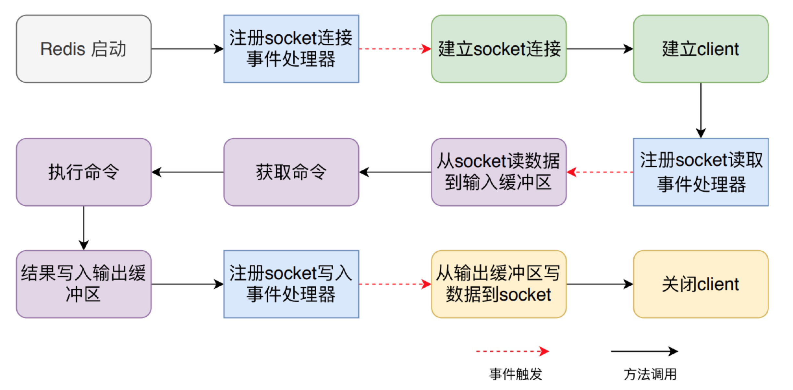

这三个阶段之间是通过事件机制串联了，在 Redis 启动阶段首先要注册socket连接建立事件处理器：

- 当客户端发来建立socket的连接的请求时，对应的处理器方法会被执行，建立连接阶段的相关处理就会进行，然后注册socket读取事件处理器
- 当客户端发来命令时，读取事件处理器方法会被执行，对应处理阶段的相关逻辑都会被执行，然后注册socket写事件处理器
- 当写事件处理器被执行时，就是将返回值写回到socket中。

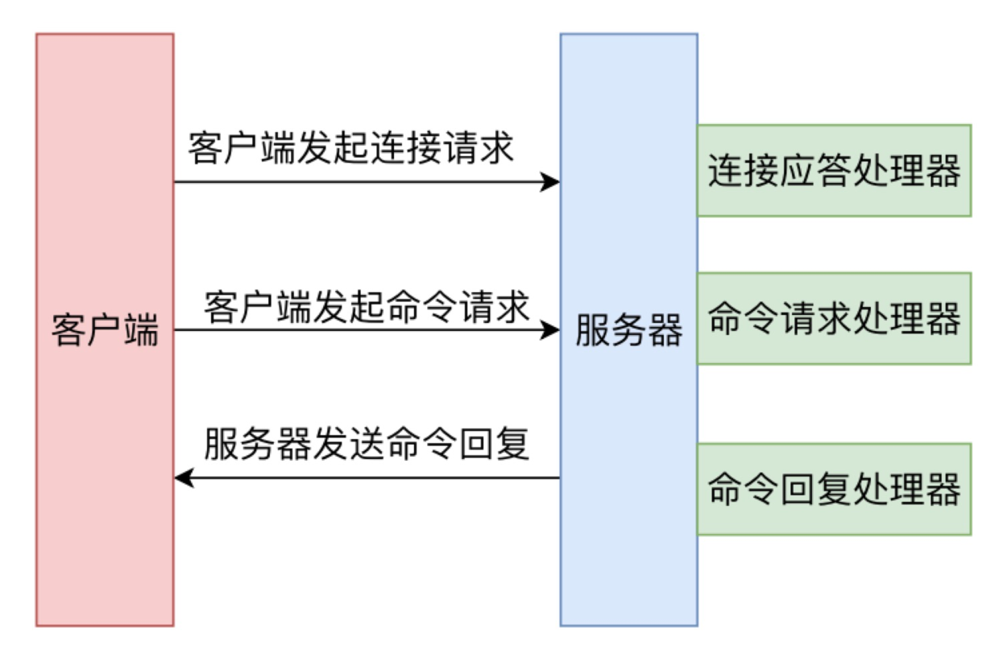

接下来，我们分别来看一下各个步骤的具体原理和代码实现。

### 启动时监听socket

Redis 服务器启动时，会调用 initServer 方法，首先会建立 Redis 自己的事件机制 eventLoop，然后在其上注册周期时间事件处理器，最后在所监听的 socket 上
创建文件事件处理器，监听 socket 建立连接的事件，其处理函数为 acceptTcpHandler。

```c
void initServer(void) { // server.c
    ....
    /**
     * 创建eventLoop
     */
    server.el = aeCreateEventLoop(server.maxclients+CONFIG_FDSET_INCR);
    /* Open the TCP listening socket for the user commands. */

    if (server.port != 0 &&
        listenToPort(server.port,server.ipfd,&server.ipfd_count) == C_ERR)
        exit(1);

    /**
     * 注册周期时间事件，处理后台操作，比如说客户端操作、过期键等
     */
    if (aeCreateTimeEvent(server.el, 1, serverCron, NULL, NULL) == AE_ERR) {
        serverPanic("Can't create event loop timers.");
        exit(1);
    }
    /**
     * 为所有监听的socket创建文件事件，监听可读事件；事件处理函数为acceptTcpHandler
     * 
     */
    for (j = 0; j < server.ipfd_count; j++) {
        if (aeCreateFileEvent(server.el, server.ipfd[j], AE_READABLE,
            acceptTcpHandler,NULL) == AE_ERR)
            {
                serverPanic(
                    "Unrecoverable error creating server.ipfd file event.");
            }
    }
    ....
}
```

在《Redis 事件机制详解》一文中，我们曾详细介绍过 Redis 的事件机制，可以说，Redis 命令执行过程中都是由事件机制协调管理的，也就是 initServer 方法中生成的 aeEventLoop。当socket发生对应的事件时，aeEventLoop 对调用已经注册的对应的事件处理器。

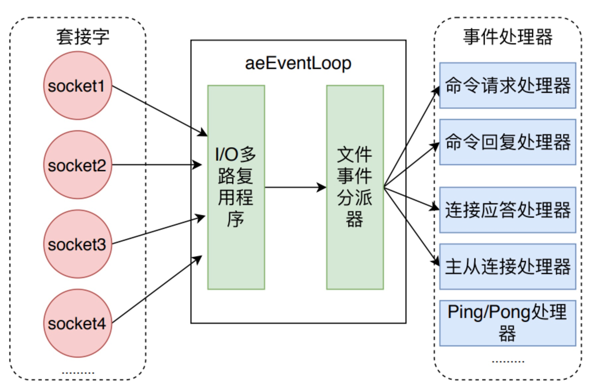

### 建立连接和Client

当客户端向 Redis 建立 socket时，aeEventLoop 会调用 acceptTcpHandler 处理函数，服务器会为每个链接创建一个 Client 对象，并创建相应文件事件来监听socket的可读事件，并指定事件处理函数。

acceptTcpHandler 函数会首先调用 `anetTcpAccept `方法，它底层会调用 socket 的 accept 方法，也就是接受客户端来的建立连接请求，然后调用 `acceptCommonHandler `方法，继续后续的逻辑处理。

```csharp
// 当客户端建立链接时进行的eventloop处理函数  networking.c
void acceptTcpHandler(aeEventLoop *el, int fd, void *privdata, int mask) {
    ....
    // 层层调用，最后在anet.c 中 anetGenericAccept 方法中调用 socket 的 accept 方法
    cfd = anetTcpAccept(server.neterr, fd, cip, sizeof(cip), &cport);
    if (cfd == ANET_ERR) {
        if (errno != EWOULDBLOCK)
            serverLog(LL_WARNING,
                "Accepting client connection: %s", server.neterr);
        return;
    }
    serverLog(LL_VERBOSE,"Accepted %s:%d", cip, cport);
    /**
     * 进行socket 建立连接后的处理
     */
    acceptCommonHandler(cfd,0,cip);
}
```

acceptCommonHandler 则首先调用 createClient 创建 client，接着判断当前 client 的数量是否超出了配置的 maxclients，如果超过，则给客户端发送错误信息，并且释放 client。

```c
static void acceptCommonHandler(int fd, int flags, char *ip) { //networking.c
    client *c;
    // 创建redisClient
    c = createClient(fd)
    // 当 maxClient 属性被设置，并且client数量已经超出时，给client发送error，然后释放连接
    if (listLength(server.clients) > server.maxclients) {
        char *err = "-ERR max number of clients reached\r\n";
        if (write(c->fd,err,strlen(err)) == -1) {
        }
        server.stat_rejected_conn++;
        freeClient(c);
        return;
    }
    .... // 处理为设置密码时默认保护状态的客户端连接
    // 统计连接数
    server.stat_numconnections++;
    c->flags |= flags;
}
```

createClient 方法用于创建 client，它代表着连接到 Redis 客户端，每个客户端都有各自的输入缓冲区和输出缓冲区，输入缓冲区存储客户端通过 socket 发送过来的数据，输出缓冲区则存储着 Redis 对客户端的响应数据。client一共有三种类型，不同类型的对应缓冲区的大小都不同。

- 普通客户端是除了复制和订阅的客户端之外的所有连接
- 从客户端用于主从复制，主节点会为每个从节点单独建立一条连接用于命令复制
- 订阅客户端用于发布订阅功能

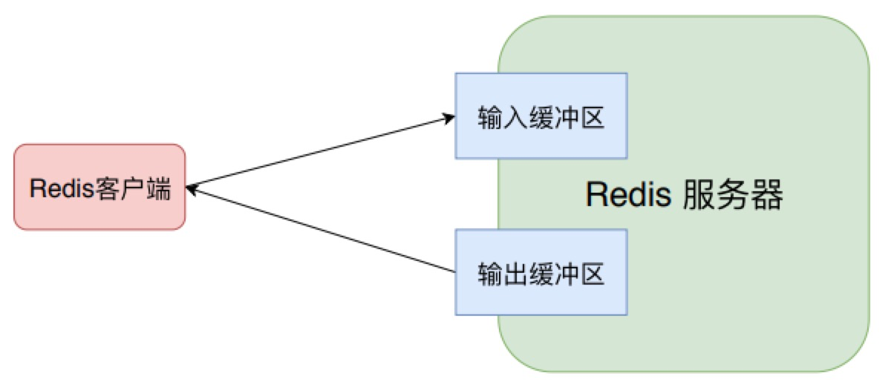

createClient 方法除了创建 client 结构体并设置其属性值外，还会对 socket进行配置并注册读事件处理器

设置 socket 为 非阻塞 socket、设置 NO_DELAY 和 SO_KEEPALIVE标志位来关闭 Nagle 算法并且启动 socket 存活检查机制。

设置读事件处理器，当客户端通过 socket 发送来数据后，Redis 会调用 readQueryFromClient 方法。

```cpp
client *createClient(int fd) {
    client *c = zmalloc(sizeof(client));
    // fd 为 -1，表示其他特殊情况创建的client，redis在进行比如lua脚本执行之类的情况下也会创建client
    if (fd != -1) {
        // 配置socket为非阻塞、NO_DELAY不开启Nagle算法和SO_KEEPALIVE
        anetNonBlock(NULL,fd);
        anetEnableTcpNoDelay(NULL,fd);
        if (server.tcpkeepalive)
            anetKeepAlive(NULL,fd,server.tcpkeepalive);
        /**
         * 向 eventLoop 中注册了 readQueryFromClient。
         * readQueryFromClient 的作用就是从client中读取客户端的查询缓冲区内容。
         * 绑定读事件到事件 loop （开始接收命令请求）
         */
        if (aeCreateFileEvent(server.el,fd,AE_READABLE,
            readQueryFromClient, c) == AE_ERR)
        {
            close(fd);
            zfree(c);
            return NULL;
        }
    }
    // 默认选择数据库
    selectDb(c,0);
    uint64_t client_id;
    atomicGetIncr(server.next_client_id,client_id,1);
    c->id = client_id;
    c->fd = fd;
    .... // 设置client的属性
    return c;
}
```

client 的属性中有很多属性，比如后边会看到的输入缓冲区 querybuf 和输出缓冲区 buf，这里因为代码过长做了省略，感兴趣的同学可以自行阅读源码。

### 读取socket数据到输入缓冲区

readQueryFromClient 方法会调用 read 方法从 socket 中读取数据到输入缓冲区中，然后判断其大小是否大于系统设置的 client_max_querybuf_len，如果大于，则向 Redis返回错误信息，并关闭 client。

将数据读取到输入缓冲区后，readQueryFromClient 方法会根据 client 的类型来做不同的处理，如果是普通类型，则直接调用 processInputBuffer 来处理；如果是主从客户端，还需要将命令同步到自己的从服务器中。也就是说，Redis实例将主实例传来的命令执行后，继续将命令同步给自己的从实例。

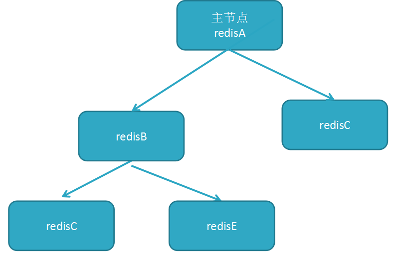

```rust
// 处理从client中读取客户端的输入缓冲区内容。
void readQueryFromClient(aeEventLoop *el, int fd, void *privdata, int mask) {
    client *c = (client*) privdata;
    ....
    if (c->querybuf_peak < qblen) c->querybuf_peak = qblen;
    c->querybuf = sdsMakeRoomFor(c->querybuf, readlen);
    // 从 fd 对应的socket中读取到 client 中的 querybuf 输入缓冲区
    nread = read(fd, c->querybuf+qblen, readlen);
    if (nread == -1) {
        .... // 出错释放 client
    } else if (nread == 0) {
        // 客户端主动关闭 connection
        serverLog(LL_VERBOSE, "Client closed connection");
        freeClient(c);
        return;
    } else if (c->flags & CLIENT_MASTER) { 
        /*
         * 当这个client代表主从的master节点时，将query buffer和 pending_querybuf结合
         * 用于主从复制中的命令传播？？？？
         */
        c->pending_querybuf = sdscatlen(c->pending_querybuf,
                                        c->querybuf+qblen,nread);
    }
    // 增加已经读取的字节数
    sdsIncrLen(c->querybuf,nread);
    c->lastinteraction = server.unixtime;
    if (c->flags & CLIENT_MASTER) c->read_reploff += nread;
    server.stat_net_input_bytes += nread;
    // 如果大于系统配置的最大客户端缓存区大小，也就是配置文件中的client-query-buffer-limit
    if (sdslen(c->querybuf) > server.client_max_querybuf_len) {
        sds ci = catClientInfoString(sdsempty(),c), bytes = sdsempty();
        // 返回错误信息，并且关闭client
        bytes = sdscatrepr(bytes,c->querybuf,64);
        serverLog(LL_WARNING,"Closing client that reached max query buffer length: %s (qbuf initial bytes: %s)", ci, bytes);
        sdsfree(ci);
        sdsfree(bytes);
        freeClient(c);
        return;
    }

    
    if (!(c->flags & CLIENT_MASTER)) {
        // processInputBuffer 处理输入缓冲区
        processInputBuffer(c);
    } else {
        // 如果client是master的连接
        size_t prev_offset = c->reploff;
        processInputBuffer(c);
        // 判断是否同步偏移量发生变化，则通知到后续的slave
        size_t applied = c->reploff - prev_offset;

        if (applied) {
            replicationFeedSlavesFromMasterStream(server.slaves,
                    c->pending_querybuf, applied);
            sdsrange(c->pending_querybuf,applied,-1);
        }
    }
}
```

### 解析获取命令

processInputBuffer 主要是将输入缓冲区中的数据解析成对应的命令，根据命令类型是 PROTO_REQ_MULTIBULK 还是 PROTO_REQ_INLINE，来分别调用 processInlineBuffer 和 processMultibulkBuffer 方法来解析命令。

然后调用 processCommand 方法来执行命令。执行成功后，如果是主从客户端，还需要更新同步偏移量 reploff 属性，然后重置 client，让client可以接收一条命令。

```rust
void processInputBuffer(client *c) { // networking.c
    server.current_client = c;
    /* 当缓冲区中还有数据时就一直处理 */
    while(sdslen(c->querybuf)) {
        .... // 处理 client 的各种状态
        /* 判断命令请求类型 telnet发送的命令和redis-cli发送的命令请求格式不同 */
        if (!c->reqtype) {
            if (c->querybuf[0] == '*') {
                c->reqtype = PROTO_REQ_MULTIBULK;
            } else {
                c->reqtype = PROTO_REQ_INLINE;
            }
        }
        /**
         * 从缓冲区解析命令
         */
        if (c->reqtype == PROTO_REQ_INLINE) {
            if (processInlineBuffer(c) != C_OK) break;
        } else if (c->reqtype == PROTO_REQ_MULTIBULK) {
            if (processMultibulkBuffer(c) != C_OK) break;
        } else {
            serverPanic("Unknown request type");
        }

        /* 参数个数为0时重置client，可以接受下一个命令 */
        if (c->argc == 0) {
            resetClient(c);
        } else {
            // 执行命令
            if (processCommand(c) == C_OK) {
                if (c->flags & CLIENT_MASTER && !(c->flags & CLIENT_MULTI)) {
                    // 如果是master的client发来的命令，则 更新 reploff
                    c->reploff = c->read_reploff - sdslen(c->querybuf);
                }

                // 如果不是阻塞状态，则重置client，可以接受下一个命令
                if (!(c->flags & CLIENT_BLOCKED) || c->btype != BLOCKED_MODULE)
                    resetClient(c);
            }
        }
    }
    server.current_client = NULL;
}
```

解析命令暂时不看，就是将 redis 命令文本信息，记录到client的argv/argc属性中

### 执行命令

processCommand 方法会处理很多逻辑，不过大致可以分为三个部分：首先是调用 lookupCommand 方法获得对应的 redisCommand；接着是检测当前 Redis 是否可以执行该命令；最后是调用 call 方法真正执行命令。

processCommand会做如下逻辑处理：

- 1 如果命令名称为 quit，则直接返回，并且设置客户端标志位。
- 2 根据 argv[0] 查找对应的 redisCommand，所有的命令都存储在命令字典 redisCommandTable 中，根据命令名称可以获取对应的命令。
- 3 进行用户权限校验。
- 4 如果是集群模式，处理集群重定向。当命令发送者是 master 或者 命令没有任何 key 的参数时可以不重定向。
- 5 预防 maxmemory 情况，先尝试回收一下，如果不行，则返回异常。
- 6 当此服务器是 master 时：aof 持久化失败时，或上一次 bgsave 执行错误，且配置 bgsave 参数和 stop_writes_on_bgsave_err；禁止执行写命令。
- 7 当此服务器时master时：如果配置了 repl_min_slaves_to_write，当slave数目小于时，禁止执行写命令。
- 8 当时只读slave时，除了 master 的不接受其他写命令。
- 9 当客户端正在订阅频道时，只会执行部分命令。
- 10 服务器为slave，但是没有连接 master 时，只会执行带有 CMD_STALE 标志的命令，如 info 等
- 11 正在加载数据库时，只会执行带有 CMD_LOADING 标志的命令，其余都会被拒绝。
- 12 当服务器因为执行lua脚本阻塞时，只会执行部分命令，其余都会拒绝
- 13 如果是事务命令，则开启事务，命令进入等待队列；否则直接执行命令。

```c
int processCommand(client *c) {
    // 1 处理 quit 命令
    if (!strcasecmp(c->argv[0]->ptr,"quit")) {
        addReply(c,shared.ok);
        c->flags |= CLIENT_CLOSE_AFTER_REPLY;
        return C_ERR;
    }

    /**
     * 根据 argv[0] 查找对应的 command
     * 2 命令字典查找指定命令；所有的命令都存储在命令字典中 struct redisCommand redisCommandTable[]={}
     */
    c->cmd = c->lastcmd = lookupCommand(c->argv[0]->ptr);
    if (!c->cmd) {
        // 处理未知命令
    } else if ((c->cmd->arity > 0 && c->cmd->arity != c->argc) ||
               (c->argc < -c->cmd->arity)) {
        // 处理参数错误
    }
    // 3 检查用户验证
    if (server.requirepass && !c->authenticated && c->cmd->proc != authCommand)
    {
        flagTransaction(c);
        addReply(c,shared.noautherr);
        return C_OK;
    }

    /**
     * 4 如果是集群模式，处理集群重定向。当命令发送者是master或者 命令没有任何key的参数时可以不重定向
     */
    if (server.cluster_enabled &&
        !(c->flags & CLIENT_MASTER) &&
        !(c->flags & CLIENT_LUA &&
          server.lua_caller->flags & CLIENT_MASTER) &&
        !(c->cmd->getkeys_proc == NULL && c->cmd->firstkey == 0 &&
          c->cmd->proc != execCommand))
    {
        int hashslot;
        int error_code;
        // 查询可以执行的node信息
        clusterNode *n = getNodeByQuery(c,c->cmd,c->argv,c->argc,
                                        &hashslot,&error_code);
        if (n == NULL || n != server.cluster->myself) {
            if (c->cmd->proc == execCommand) {
                discardTransaction(c);
            } else {
                flagTransaction(c);
            }
            clusterRedirectClient(c,n,hashslot,error_code);
            return C_OK;
        }
    }

    // 5 处理maxmemory请求，先尝试回收一下，如果不行，则返回异常
    if (server.maxmemory) {
        int retval = freeMemoryIfNeeded();
        ....
    }

    /**
     * 6 当此服务器是master时：aof持久化失败时，或上一次bgsave执行错误，
     * 且配置bgsave参数和stop_writes_on_bgsave_err；禁止执行写命令
     */
    if (((server.stop_writes_on_bgsave_err &&
          server.saveparamslen > 0 &&
          server.lastbgsave_status == C_ERR) ||
          server.aof_last_write_status == C_ERR) &&
        server.masterhost == NULL &&
        (c->cmd->flags & CMD_WRITE ||
         c->cmd->proc == pingCommand)) { .... }

    /**
     * 7 当此服务器时master时：如果配置了repl_min_slaves_to_write，
     * 当slave数目小于时，禁止执行写命令
     */
    if (server.masterhost == NULL &&
        server.repl_min_slaves_to_write &&
        server.repl_min_slaves_max_lag &&
        c->cmd->flags & CMD_WRITE &&
        server.repl_good_slaves_count < server.repl_min_slaves_to_write) { .... }

    /**
     * 8 当时只读slave时，除了master的不接受其他写命令
     */
    if (server.masterhost && server.repl_slave_ro &&
        !(c->flags & CLIENT_MASTER) &&
        c->cmd->flags & CMD_WRITE) { .... }

    /**
     * 9 当客户端正在订阅频道时，只会执行以下命令
     */
    if (c->flags & CLIENT_PUBSUB &&
        c->cmd->proc != pingCommand &&
        c->cmd->proc != subscribeCommand &&
        c->cmd->proc != unsubscribeCommand &&
        c->cmd->proc != psubscribeCommand &&
        c->cmd->proc != punsubscribeCommand) { .... }
    /**
     * 10 服务器为slave，但没有正确连接master时，只会执行带有CMD_STALE标志的命令，如info等
     */
    if (server.masterhost && server.repl_state != REPL_STATE_CONNECTED &&
        server.repl_serve_stale_data == 0 &&
        !(c->cmd->flags & CMD_STALE)) {...}
    /**
     * 11 正在加载数据库时，只会执行带有CMD_LOADING标志的命令，其余都会被拒绝
     */
    if (server.loading && !(c->cmd->flags & CMD_LOADING)) { .... }
    /**
     * 12 当服务器因为执行lua脚本阻塞时，只会执行以下几个命令，其余都会拒绝
     */
    if (server.lua_timedout &&
          c->cmd->proc != authCommand &&
          c->cmd->proc != replconfCommand &&
        !(c->cmd->proc == shutdownCommand &&
          c->argc == 2 &&
          tolower(((char*)c->argv[1]->ptr)[0]) == 'n') &&
        !(c->cmd->proc == scriptCommand &&
          c->argc == 2 &&
          tolower(((char*)c->argv[1]->ptr)[0]) == 'k')) {....}

    /**
     * 13 开始执行命令
     */
    if (c->flags & CLIENT_MULTI &&
        c->cmd->proc != execCommand && c->cmd->proc != discardCommand &&
        c->cmd->proc != multiCommand && c->cmd->proc != watchCommand)
    {
        /**
         * 开启了事务，命令只会入队列
         */
        queueMultiCommand(c);
        addReply(c,shared.queued);
    } else {
        /**
         * 直接执行命令
         */
        call(c,CMD_CALL_FULL);
        c->woff = server.master_repl_offset;
        if (listLength(server.ready_keys))
            handleClientsBlockedOnLists();
    }
    return C_OK;
}


struct redisCommand redisCommandTable[] = {
    {"get",getCommand,2,"rF",0,NULL,1,1,1,0,0},
    {"set",setCommand,-3,"wm",0,NULL,1,1,1,0,0},
    {"hmset",hsetCommand,-4,"wmF",0,NULL,1,1,1,0,0},
    .... // 所有的 redis 命令都有
}
```

call 方法是 Redis 中执行命令的通用方法，它会处理通用的执行命令的前置和后续操作。

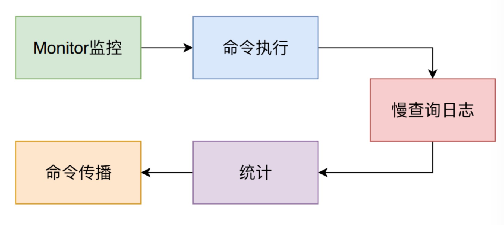

- 如果有监视器 monitor，则需要将命令发送给监视器。
- 调用 redisCommand 的proc 方法，执行对应具体的命令逻辑。
- 如果开启了 CMD_CALL_SLOWLOG，则需要记录慢查询日志
- 如果开启了 CMD_CALL_STATS，则需要记录一些统计信息
- 如果开启了 CMD_CALL_PROPAGATE，则当 dirty大于0时，需要调用 propagate 方法来进行命令传播。

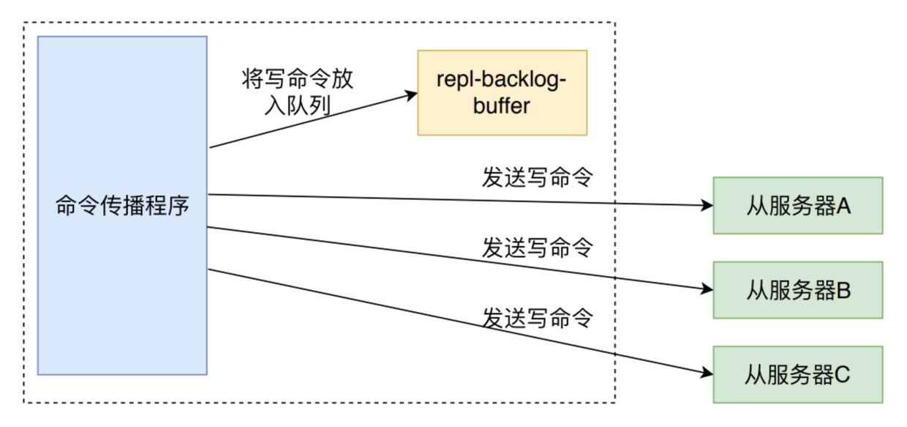

命令传播就是将命令写入 repl-backlog-buffer 缓冲中，并发送给各个从服务器中。

```c
// 执行client中持有的 redisCommand 命令
void call(client *c, int flags) {
    /**
     * dirty记录数据库修改次数；start记录命令开始执行时间us；duration记录命令执行花费时间
     */
    long long dirty, start, duration;
    int client_old_flags = c->flags;

    /**
     * 有监视器的话，需要将不是从AOF获取的命令会发送给监视器。当然，这里会消耗时间
     */
    if (listLength(server.monitors) &&
        !server.loading &&
        !(c->cmd->flags & (CMD_SKIP_MONITOR|CMD_ADMIN)))
    {
        replicationFeedMonitors(c,server.monitors,c->db->id,c->argv,c->argc);
    }
    ....
    /* Call the command. */
    dirty = server.dirty;
    start = ustime();
    // 处理命令，调用命令处理函数
    c->cmd->proc(c);
    duration = ustime()-start;
    dirty = server.dirty-dirty;
    if (dirty < 0) dirty = 0;

    .... // Lua 脚本的一些特殊处理

    /**
     * CMD_CALL_SLOWLOG 表示要记录慢查询日志
     */
    if (flags & CMD_CALL_SLOWLOG && c->cmd->proc != execCommand) {
        char *latency_event = (c->cmd->flags & CMD_FAST) ?
                              "fast-command" : "command";
        latencyAddSampleIfNeeded(latency_event,duration/1000);
        slowlogPushEntryIfNeeded(c,c->argv,c->argc,duration);
    }
    /**
     * CMD_CALL_STATS 表示要统计
     */
    if (flags & CMD_CALL_STATS) {
        c->lastcmd->microseconds += duration;
        c->lastcmd->calls++;
    }
    /**
     * CMD_CALL_PROPAGATE表示要进行广播命令
     */
    if (flags & CMD_CALL_PROPAGATE &&
        (c->flags & CLIENT_PREVENT_PROP) != CLIENT_PREVENT_PROP)
    {
        int propagate_flags = PROPAGATE_NONE;
        /**
         * dirty大于0时，需要广播命令给slave和aof
         */
        if (dirty) propagate_flags |= (PROPAGATE_AOF|PROPAGATE_REPL);
        .... 
        /**
         * 广播命令，写如aof，发送命令到slave
         * 也就是传说中的传播命令
         */
        if (propagate_flags != PROPAGATE_NONE && !(c->cmd->flags & CMD_MODULE))
            propagate(c->cmd,c->db->id,c->argv,c->argc,propagate_flags);
    }
    ....
}
```

## 下

### set 和 get 命令具体实现

前文讲到 processCommand 方法会从输入缓冲区中解析出对应的 redisCommand，然后调用 call 方法执行解析出来的 redisCommand的 proc 方法。不同命令的的 proc 方法是不同的，比如说名为 set 的 redisCommand 的 proc 是 setCommand 方法，而 get 的则是 getCommand 方法。通过这种形式，实际上实现在Java 中特别常见的多态策略。

```c
void call(client *c, int flags) {
    ....
    c->cmd->proc(c);
    ....
}
// redisCommand结构体
struct redisCommand {
    char *name;
    // 对应方法的函数范式
    redisCommandProc *proc;
    .... // 其他定义
};
// 使用 typedef 定义的别名
typedef void redisCommandProc(client *c);
// 不同的命令，调用不同的方法。
struct redisCommand redisCommandTable[] = {
    {"get",getCommand,2,"rF",0,NULL,1,1,1,0,0},
    {"set",setCommand,-3,"wm",0,NULL,1,1,1,0,0},
    {"hmset",hsetCommand,-4,"wmF",0,NULL,1,1,1,0,0},
    .... // 所有的 redis 命令都有
}
```

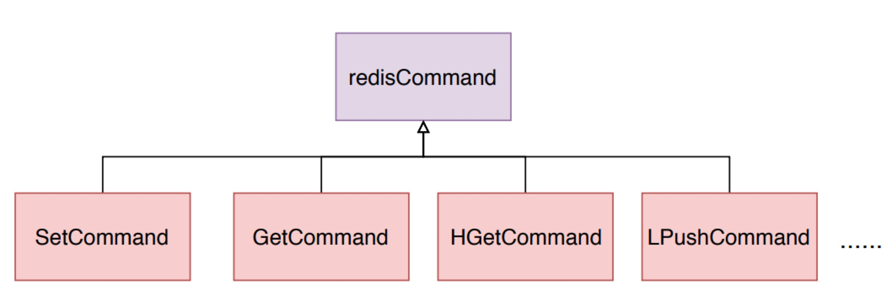

setCommand 会判断set命令是否携带了nx、xx、ex或者px等可选参数，然后调用setGenericCommand命令。我们直接来看 setGenericCommand 方法。

setGenericCommand 方法的处理逻辑如下所示：

- 首先判断 set 的类型是 set_nx 还是 set_xx，如果是 nx 并且 key 已经存在则直接返回；如果是 xx 并且 key 不存在则直接返回。
- 调用 setKey 方法将键值添加到对应的 Redis 数据库中。
- 如果有过期时间，则调用 setExpire 将设置过期时间
- 进行键空间通知
- 返回对应的值给客户端。

```c
// t_string.c 
void setGenericCommand(client *c, int flags, robj *key, robj *val, robj *expire, int unit, robj *ok_reply, robj *abort_reply) {
    long long milliseconds = 0; 
    /**
     * 设置了过期时间；expire是robj类型，获取整数值
     */
    if (expire) {
        if (getLongLongFromObjectOrReply(c, expire, &milliseconds, NULL) != C_OK)
            return;
        if (milliseconds <= 0) {
            addReplyErrorFormat(c,"invalid expire time in %s",c->cmd->name);
            return;
        }
        if (unit == UNIT_SECONDS) milliseconds *= 1000;
    }
    /**
     * NX，key存在时直接返回；XX，key不存在时直接返回
     * lookupKeyWrite 是在对应的数据库中寻找键值是否存在
     */
    if ((flags & OBJ_SET_NX && lookupKeyWrite(c->db,key) != NULL) ||
        (flags & OBJ_SET_XX && lookupKeyWrite(c->db,key) == NULL))
    {
        addReply(c, abort_reply ? abort_reply : shared.nullbulk);
        return;
    }
    /**
     * 添加到数据字典
     */
    setKey(c->db,key,val);
    server.dirty++;
    /**
     * 过期时间添加到过期字典
     */
    if (expire) setExpire(c,c->db,key,mstime()+milliseconds);
    /**
     * 键空间通知
     */
    notifyKeyspaceEvent(NOTIFY_STRING,"set",key,c->db->id);
    if (expire) notifyKeyspaceEvent(NOTIFY_GENERIC,
        "expire",key,c->db->id);
    /**
     * 返回值，addReply 在 get 命令时再具体讲解
     */
    addReply(c, ok_reply ? ok_reply : shared.ok);
}
```

具体 setKey 和 setExpire 的方法实现我们这里就不细讲，其实就是将键值添加到db的 dict 数据哈希表中，将键和过期时间添加到 expires 哈希表中，如下图所示。

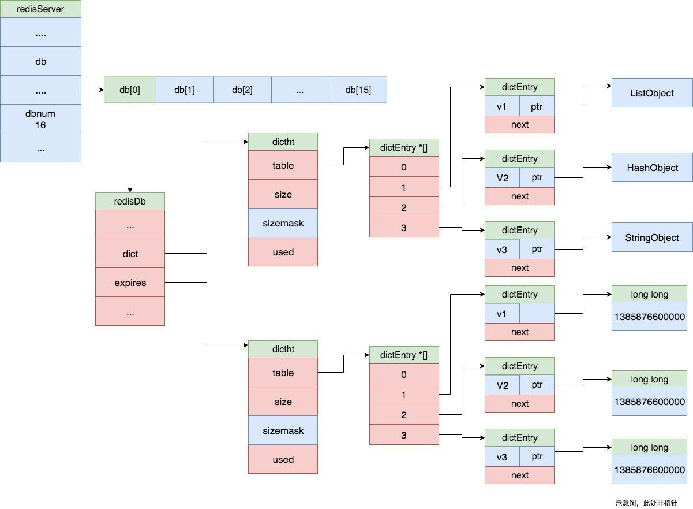

接下来看 getCommand 的具体实现，同样的，它底层会调用 getGenericCommand 方法。

getGenericCommand 方法会调用 lookupKeyReadOrReply 来从 dict 数据哈希表中查找对应的 key值。如果找不到，则直接返回 C_OK；如果找到了，则根据值的类型，调用 addReply 或者 addReplyBulk 方法将值添加到输出缓冲区中。

```r
int getGenericCommand(client *c) {
    robj *o;
    // 调用 lookupKeyReadOrReply 从数据字典中查找对应的键
    if ((o = lookupKeyReadOrReply(c,c->argv[1],shared.nullbulk)) == NULL)
        return C_OK;
    // 如果是string类型，调用 addReply 单行返回。如果是其他对象类型，则调用 addReplyBulk
    if (o->type != OBJ_STRING) {
        addReply(c,shared.wrongtypeerr);
        return C_ERR;
    } else {
        addReplyBulk(c,o);
        return C_OK;
    }
}
```

lookupKeyReadWithFlags 会从 redisDb 中查找对应的键值对，它首先会调用 expireIfNeeded判断键是否过期并且需要删除，如果为过期，则调用 lookupKey 方法从 dict 哈希表中查找并返回。具体解释可以看代码中的详细注释

```c
/*
 * 查找key的读操作，如果key找不到或者已经逻辑上过期返回 NULL，有一些副作用
 *   1 如果key到达过期时间，它会被设备为过期，并且删除
 *   2 更新key的最近访问时间
 *   3 更新全局缓存击中概率
 * flags 有两个值: LOOKUP_NONE 一般都是这个；LOOKUP_NOTOUCH 不修改最近访问时间
 */
robj *lookupKeyReadWithFlags(redisDb *db, robj *key, int flags) { // db.c
    robj *val;
    // 检查键是否过期
    if (expireIfNeeded(db,key) == 1) {
        .... // master和 slave 对这种情况的特殊处理
    }
    // 查找键值字典
    val = lookupKey(db,key,flags);
    // 更新全局缓存命中率
    if (val == NULL)
        server.stat_keyspace_misses++;
    else
        server.stat_keyspace_hits++;
    return val;
}
```

Redis 在调用查找键值系列方法前都会先调用 expireIfNeeded 来判断键是否过期，然后根据 Redis 是否配置了懒删除来进行同步删除或者异步删除。关于键删除的细节可以查看[《详解 Redis 内存管理机制和实现》](http://remcarpediem.net/article/e66f8da0/)一文。

在判断键释放过期的逻辑中有两个特殊情况：

- 如果当前 Redis 是主从结构中的从实例，则只判断键是否过期，不直接对键进行删除，而是要等待主实例发送过来的删除命令后再进行删除。如果当前 Redis 是主实例，则调用 propagateExpire 来传播过期指令。
- 如果当前正在进行 Lua 脚本执行，因为其原子性和事务性，整个执行过期中时间都按照其开始执行的那一刻计算，也就是说lua执行时未过期的键，在它整个执行过程中也都不会过期。

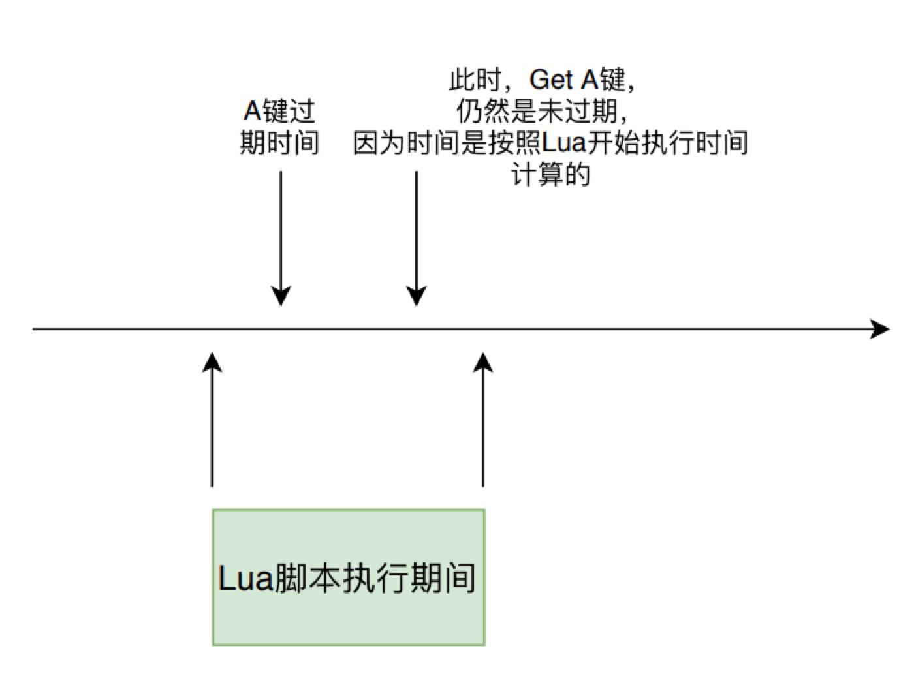

```kotlin
/*
 * 在调用 lookupKey*系列方法前调用该方法。
 * 如果是slave：
 *  slave 并不主动过期删除key，但是返回值仍然会返回键已经被删除。
 *  master 如果key过期了，会主动删除过期键，并且触发 AOF 和同步操作。
 * 返回值为0表示键仍然有效，否则返回1
 */
int expireIfNeeded(redisDb *db, robj *key) { // db.c
    // 获取键的过期时间
    mstime_t when = getExpire(db,key);
    mstime_t now;

    if (when < 0) return 0;

    /*
     * 如果当前是在执行lua脚本，根据其原子性，整个执行过期中时间都按照其开始执行的那一刻计算
     * 也就是说lua执行时未过期的键，在它整个执行过程中也都不会过期。
     */ 
    now = server.lua_caller ? server.lua_time_start : mstime();

    // slave 直接返回键是否过期
    if (server.masterhost != NULL) return now > when;
    // master时，键未过期直接返回
    if (now <= when) return 0;

    // 键过期，删除键
    server.stat_expiredkeys++;
    // 触发命令传播
    propagateExpire(db,key,server.lazyfree_lazy_expire);
    // 和键空间事件
    notifyKeyspaceEvent(NOTIFY_EXPIRED,
        "expired",key,db->id);
    // 根据是否懒删除，调用不同的函数 
    return server.lazyfree_lazy_expire ? dbAsyncDelete(db,key) :
                                         dbSyncDelete(db,key);
}
```

lookupKey 方法则是通过 dictFind 方法从 redisDb 的 dict 哈希表中查找键值，如果能找到，则根据 redis 的 maxmemory_policy 策略来判断是更新 lru 的最近访问时间，还是调用 updateFU 方法更新其他指标，这些指标可以在后续内存不足时对键值进行回收。

```kotlin
robj *lookupKey(redisDb *db, robj *key, int flags) {
    // dictFind 根据 key 获取字典的entry
    dictEntry *de = dictFind(db->dict,key->ptr);
    if (de) {
        // 获取 value
        robj *val = dictGetVal(de);
        // 当处于 rdb aof 子进程复制阶段或者 flags 不是 LOOKUP_NOTOUCH
        if (server.rdb_child_pid == -1 &&
            server.aof_child_pid == -1 &&
            !(flags & LOOKUP_NOTOUCH))
        {
            // 如果是 MAXMEMORY_FLAG_LFU 则进行相应操作
            if (server.maxmemory_policy & MAXMEMORY_FLAG_LFU) {
                updateLFU(val);
            } else {
                // 更新最近访问时间
                val->lru = LRU_CLOCK();
            }
        }
        return val;
    } else {
        return NULL;
    }
}
```

### 将命令结果写入输出缓冲区

在所有的 redisCommand 执行的最后，一般都会调用 addReply 方法进行结果返回，我们的分析也来到了 Redis 命令执行的返回数据阶段。

addReply 方法做了两件事情：

- prepareClientToWrite 判断是否需要返回数据，并且将当前 client 添加到等待写返回数据队列中。
- 调用 _addReplyToBuffer 和 _addReplyObjectToList 方法将返回值写入到输出缓冲区中，等待写入 socekt。

```c
void addReply(client *c, robj *obj) {
    if (prepareClientToWrite(c) != C_OK) return;
    if (sdsEncodedObject(obj)) {
        // 需要将响应内容添加到output buffer中。总体思路是，先尝试向固定buffer添加，添加失败的话，在尝试添加到响应链表
        if (_addReplyToBuffer(c,obj->ptr,sdslen(obj->ptr)) != C_OK)
            _addReplyObjectToList(c,obj);
    } else if (obj->encoding == OBJ_ENCODING_INT) {
        .... // 特殊情况的优化
    } else {
        serverPanic("Wrong obj->encoding in addReply()");
    }
}
```

prepareClientToWrite 首先判断了当前 client是否需要返回数据：

- Lua 脚本执行的 client 则需要返回值；
- 如果客户端发送来 REPLY OFF 或者 SKIP 命令，则不需要返回值；
- 如果是主从复制时的主实例 client，则不需要返回值；
- 当前是在 AOF loading 状态的假 client，则不需要返回值。

接着如果这个 client 还未处于延迟等待写入 (CLIENT_PENDING_WRITE)的状态，则将其设置为该状态，并将其加入到 Redis 的等待写入返回值客户端队列中，也就是 clients_pending_write队列。

```c
int prepareClientToWrite(client *c) {
    // 如果是 lua client 则直接OK
    if (c->flags & (CLIENT_LUA|CLIENT_MODULE)) return C_OK;
    // 客户端发来过 REPLY OFF 或者 SKIP 命令，不需要发送返回值
    if (c->flags & (CLIENT_REPLY_OFF|CLIENT_REPLY_SKIP)) return C_ERR;

    // master 作为client 向 slave 发送命令，不需要接收返回值
    if ((c->flags & CLIENT_MASTER) &&
        !(c->flags & CLIENT_MASTER_FORCE_REPLY)) return C_ERR;
    // AOF loading 时的假client 不需要返回值
    if (c->fd <= 0) return C_ERR; 

    // 将client加入到等待写入返回值队列中，下次事件周期会进行返回值写入。
    if (!clientHasPendingReplies(c) &&
        !(c->flags & CLIENT_PENDING_WRITE) &&
        (c->replstate == REPL_STATE_NONE ||
         (c->replstate == SLAVE_STATE_ONLINE && !c->repl_put_online_on_ack)))
    {
        // 设置标志位并且将client加入到 clients_pending_write 队列中
        c->flags |= CLIENT_PENDING_WRITE;
        listAddNodeHead(server.clients_pending_write,c);
    }
    // 表示已经在排队，进行返回数据
    return C_OK;
}
```

Redis 将存储等待返回的响应数据的空间，也就是输出缓冲区分成两部分，一个固定大小的 buffer 和一个响应内容数据的链表。在链表为空并且 buffer 有足够空间时，则将响应添加到 buffer 中。如果 buffer 满了则创建一个节点追加到链表上。_addReplyToBuffer 和 _addReplyObjectToList 就是分别向这两个空间写数据的方法。

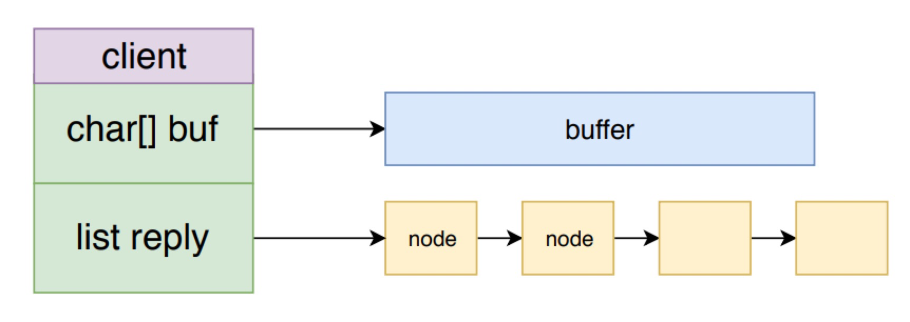

固定buffer和响应链表，整体上构成了一个队列。这么组织的好处是，既可以节省内存，不需一开始预先分配大块内存，并且可以避免频繁分配、回收内存。

上面就是响应内容写入输出缓冲区的过程，下面看一下将数据从输出缓冲区写入 socket 的过程。

prepareClientToWrite 函数，将客户端加入到了Redis 的等待写入返回值客户端队列中，也就是 clients_pending_write 队列。请求处理的事件处理逻辑就结束了，等待 Redis 下一次事件循环处理时，将响应从输出缓冲区写入到 socket 中。

### 将命令返回值从输出缓冲区写入 socket

在 [《Redis 事件机制详解》](http://remcarpediem.net/article/1aa2da89/)
一文中我们知道，Redis 在两次事件循环之间会调用 beforeSleep 方法处理一些事情，而对 clients_pending_write 列表的处理就在其中。

下面的 aeMain 方法就是 Redis 事件循环的主逻辑，可以看到每次循环时都会调用 beforesleep 方法。

```c
void aeMain(aeEventLoop *eventLoop) { // ae.c
    eventLoop->stop = 0;
    while (!eventLoop->stop) {
        /* 如果有需要在事件处理前执行的函数，那么执行它 */
        if (eventLoop->beforesleep != NULL)
            eventLoop->beforesleep(eventLoop);
        /* 开始处理事件*/
        aeProcessEvents(eventLoop, AE_ALL_EVENTS|AE_CALL_AFTER_SLEEP);
    }
}
```

beforeSleep 函数会调用 handleClientsWithPendingWrites 函数来处理 clients_pending_write 列表。

handleClientsWithPendingWrites 方法会遍历 clients_pending_write 列表，对于每个 client 都会先调用 writeToClient 方法来尝试将返回数据从输出缓存区写入到 socekt中，如果还未写完，则只能调用 aeCreateFileEvent 方法来注册一个写数据事件处理器 sendReplyToClient，等待 Redis 事件机制的再次调用。

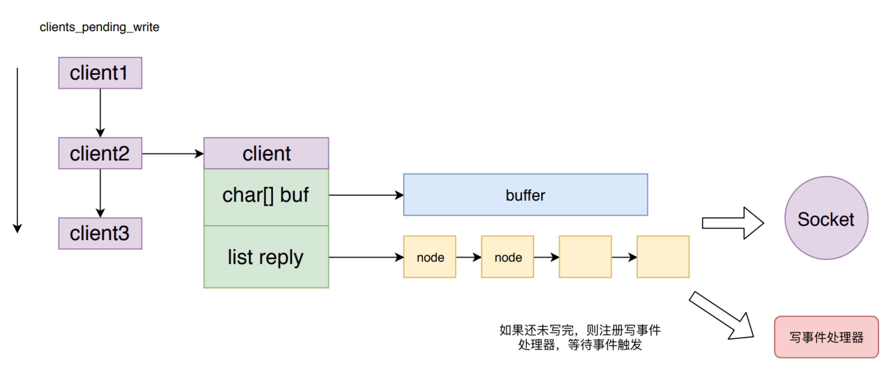

这样的好处是对于返回数据较少的客户端，不需要麻烦的注册写数据事件，等待事件触发再写数据到 socket，而是在下一次事件循环周期就直接将数据写到 socket中，加快了数据返回的响应速度。

但是从这里也会发现，如果 clients_pending_write 队列过长，则处理时间也会很久，阻塞正常的事件响应处理，导致 Redis 后续命令延时增加。

```c
// 直接将返回值写到client的输出缓冲区中，不需要进行系统调用，也不需要注册写事件处理器
int handleClientsWithPendingWrites(void) {
    listIter li;
    listNode *ln;
    // 获取系统延迟写队列的长度
    int processed = listLength(server.clients_pending_write);

    listRewind(server.clients_pending_write,&li);
    // 依次处理
    while((ln = listNext(&li))) {
        client *c = listNodeValue(ln);
        c->flags &= ~CLIENT_PENDING_WRITE;
        listDelNode(server.clients_pending_write,ln);

        // 将缓冲值写入client的socket中，如果写完，则跳过之后的操作。
        if (writeToClient(c->fd,c,0) == C_ERR) continue;

        // 还有数据未写入，只能注册写事件处理器了
        if (clientHasPendingReplies(c)) {
            int ae_flags = AE_WRITABLE;
            if (server.aof_state == AOF_ON &&
                server.aof_fsync == AOF_FSYNC_ALWAYS)
            {
                ae_flags |= AE_BARRIER;
            }
            // 注册写事件处理器 sendReplyToClient，等待执行
            if (aeCreateFileEvent(server.el, c->fd, ae_flags,
                sendReplyToClient, c) == AE_ERR)
            {
                    freeClientAsync(c);
            }
        }
    }
    return processed;
}
```

sendReplyToClient 方法其实也会调用 writeToClient 方法，该方法就是将输出缓冲区中的 buf 和 reply 列表中的数据都尽可能多的写入到对应的 socket中。

```c
// 将输出缓冲区中的数据写入socket，如果还有数据未处理则返回C_OK
int writeToClient(int fd, client *c, int handler_installed) {
    ssize_t nwritten = 0, totwritten = 0;
    size_t objlen;
    sds o;
    // 仍然有数据未写入
    while(clientHasPendingReplies(c)) {
        // 如果缓冲区有数据
        if (c->bufpos > 0) {
            // 写入到 fd 代表的 socket 中
            nwritten = write(fd,c->buf+c->sentlen,c->bufpos-c->sentlen);
            if (nwritten <= 0) break;
            c->sentlen += nwritten;
            // 统计本次一共输出了多少子节
            totwritten += nwritten;

            // buffer中的数据已经发送，则重置标志位，让响应的后续数据写入buffer
            if ((int)c->sentlen == c->bufpos) {
                c->bufpos = 0;
                c->sentlen = 0;
            }
        } else {
            // 缓冲区没有数据，从reply队列中拿
            o = listNodeValue(listFirst(c->reply));
            objlen = sdslen(o);

            if (objlen == 0) {
                listDelNode(c->reply,listFirst(c->reply));
                continue;
            }
            // 将队列中的数据写入 socket
            nwritten = write(fd, o + c->sentlen, objlen - c->sentlen);
            if (nwritten <= 0) break;
            c->sentlen += nwritten;
            totwritten += nwritten;
            // 如果写入成功，则删除队列
            if (c->sentlen == objlen) {
                listDelNode(c->reply,listFirst(c->reply));
                c->sentlen = 0;
                c->reply_bytes -= objlen;
                if (listLength(c->reply) == 0)
                    serverAssert(c->reply_bytes == 0);
            }
        }
        // 如果输出的字节数量已经超过NET_MAX_WRITES_PER_EVENT限制，break
        if (totwritten > NET_MAX_WRITES_PER_EVENT &&
            (server.maxmemory == 0 ||
             zmalloc_used_memory() < server.maxmemory) &&
            !(c->flags & CLIENT_SLAVE)) break;
    }
    server.stat_net_output_bytes += totwritten;
    if (nwritten == -1) {
        if (errno == EAGAIN) {
            nwritten = 0;
        } else {
            serverLog(LL_VERBOSE,
                "Error writing to client: %s", strerror(errno));
            freeClient(c);
            return C_ERR;
        }
    }
    if (!clientHasPendingReplies(c)) {
        c->sentlen = 0;
        //如果内容已经全部输出，删除事件处理器
        if (handler_installed) aeDeleteFileEvent(server.el,c->fd,AE_WRITABLE);
        // 数据全部返回，则关闭client和连接
        if (c->flags & CLIENT_CLOSE_AFTER_REPLY) {
            freeClient(c);
            return C_ERR;
        }
    }
    return C_OK;
}
```