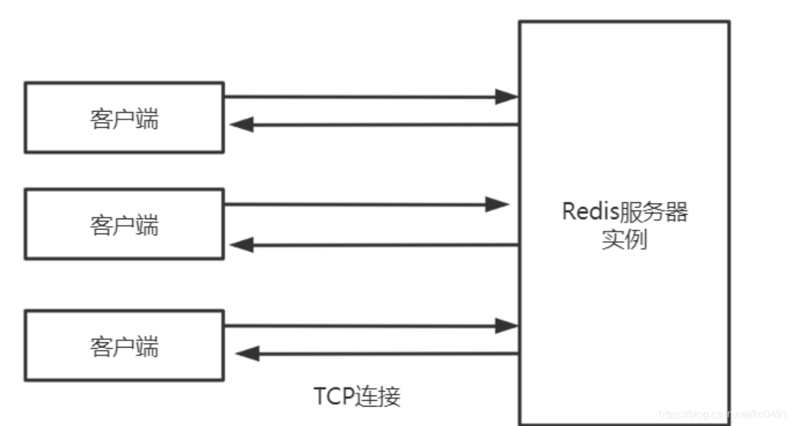
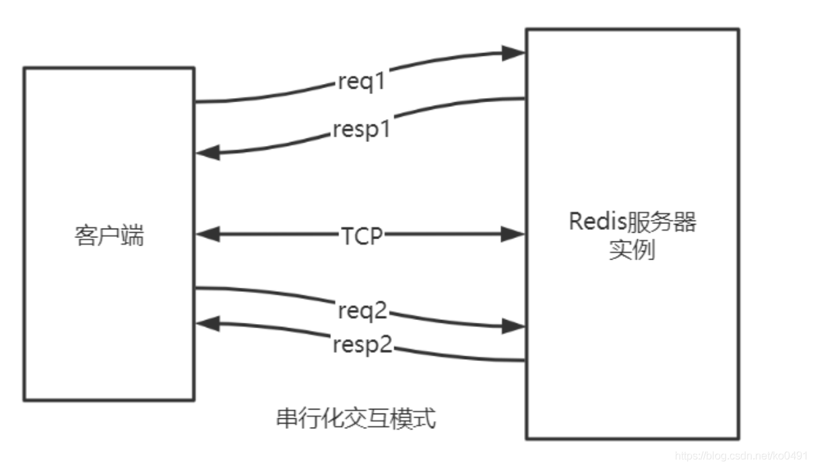
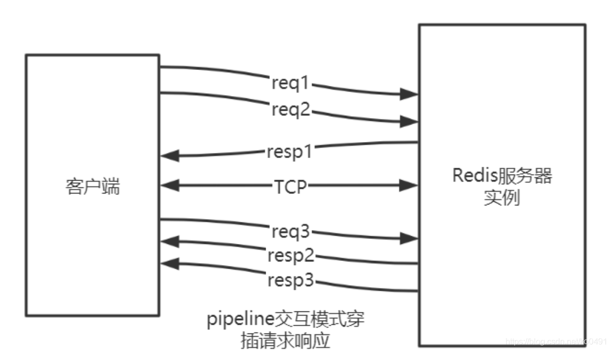
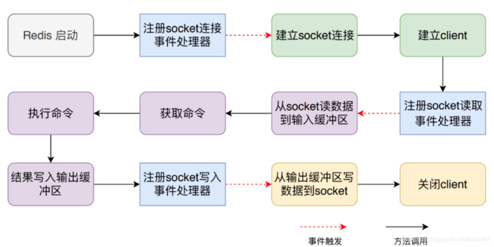
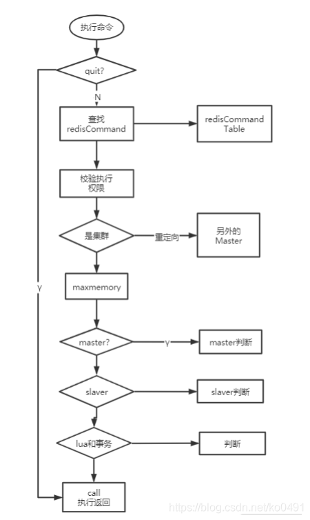
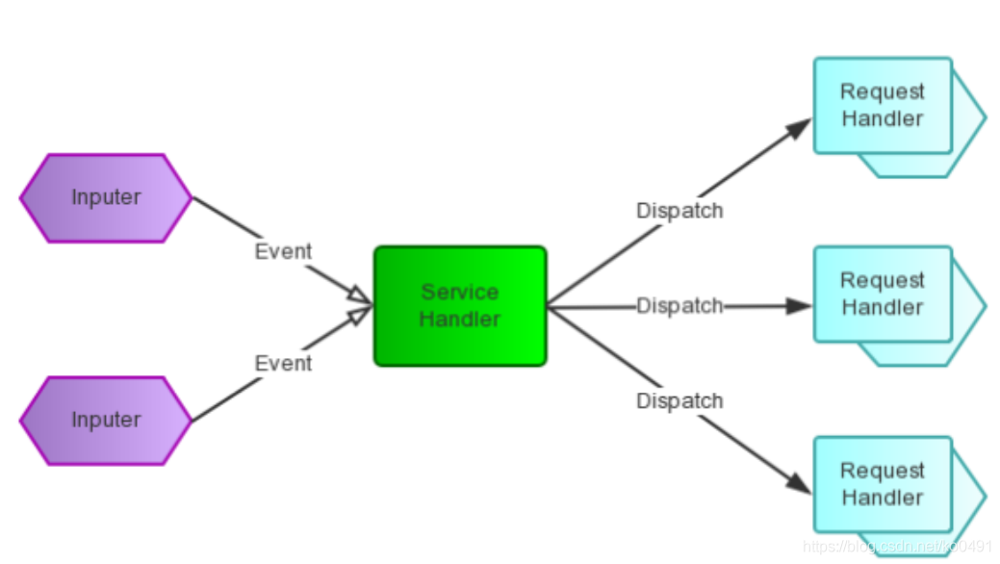
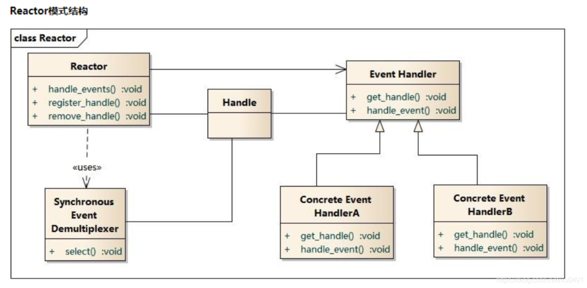
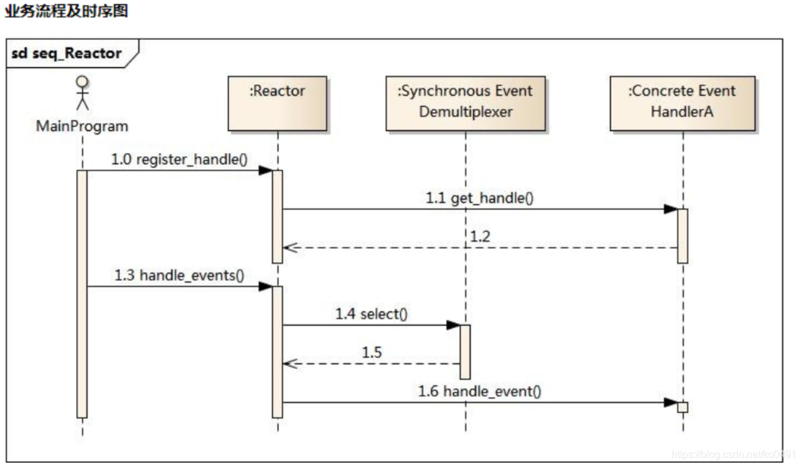
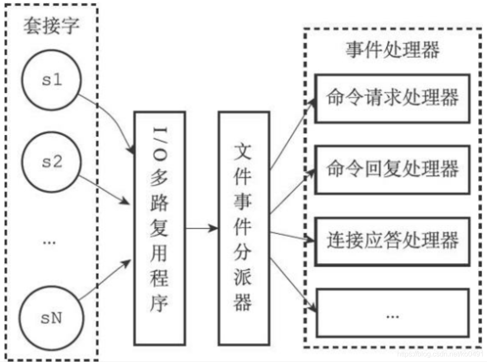
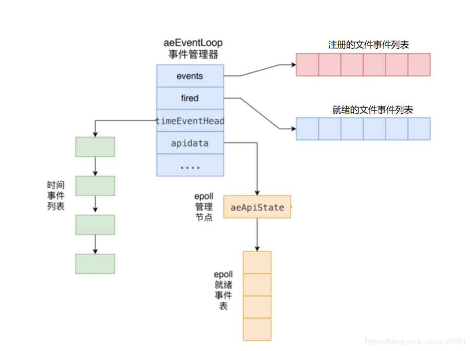

# 通讯协议及事件处理机制

\##通信协议
Redis是单进程单线程的。
应用系统和Redis通过Redis协议（RESP）进行交互。

## 请求响应模式

Redis协议位于TCP层之上，即客户端和Redis实例保持双工的连接


### 串行的请求响应模式（ping-pong）

串行化是最简单模式，客户端与服务器端建立长连接
连接通过心跳机制检测（ping-pong） ack应答
客户端发送请求，服务端响应，客户端收到响应后，再发起第二个请求，服务器端再响应


telnet和redis-cli 发出的命令 都属于该种模式
特点：
有问有答
耗时在网络传输命令
性能较低
双工的请求响应模式(pipeline)
批量请求，批量响应
请求响应交叉进行，不会混淆(TCP双工)


 

- pipeline的作用是将一批命令进行打包，然后发送给服务器，服务器执行完按顺序打包返回
- 通过pipeline，一次pipeline（n条命令）=一次网络时间 + n次命令时间
- jedis

```java
Jedis redis = new Jedis("192.168.1.111", 6379);
redis.auth("12345678");//授权密码 对应redis.conf的requirepass密码
Pipeline pipe = jedis.pipelined();
for (int i = 0; i <50000; i++) {
	pipe.set("key_"+String.valueOf(i),String.valueOf(i));
} 
//将封装后的PIPE一次性发给redis
pipe.sync();
```

原子化的批量请求响应模式（事务）
Redis可以利用事务机制批量执行命令。

发布订阅模式(pub/sub)
发布订阅模式是：一个客户端触发，多个客户端被动接收，通过服务器中转。

脚本化的批量执行（lua）
客户端向服务器端提交一个lua脚本，服务器端执行该脚本。

请求数据格式
Redis客户端与服务器交互采用序列化协议（RESP）。
请求以字符串数组的形式来表示要执行命令的参数
Redis使用命令特有（command-specific）数据类型作为回复。
Redis通信协议的主要特点有：
客户端和服务器通过 TCP 连接来进行数据交互， 服务器默认的端口号为 6379 。
客户端和服务器发送的命令或数据一律以 \r\n （CRLF）结尾。
在这个协议中， 所有发送至 Redis 服务器的参数都是二进制安全（binary safe）的。
简单，高效，易读

内联格式
可以使用telnet给Redis发送命令，首字符为Redis命令名的字符，格式为 str1 str2 str3…

```shell
[root@localhost bin]# telnet 127.0.0.1 6379
Trying 127.0.0.1...
Connected to 127.0.0.1.
Escape character is '^]'.
ping
+PONG
exists name
:1
```

规范格式(redis-cli)

1、间隔符号，在Linux下是\r\n，在Windows下是\n
2、简单字符串 Simple Strings, 以 "+“加号 开头
3、错误 Errors, 以”-"减号 开头
4、整数型 Integer， 以 “:” 冒号开头
5、大字符串类型 Bulk Strings, 以 "$"美元符号开头，长度限制512M
6、数组类型 Arrays，以 "*"星号开头
用SET命令来举例说明RESP协议的格式。
实际发送的请求数据：
实际收到的响应数据：
命令处理流程
整个流程包括：服务器启动监听、接收命令请求并解析、执行命令请求、返回命令回复等。
Server启动时监听socket

```shell
redis> SET mykey Hello
"OK"
```

### 命令处理流程

整个流程包括：服务器启动监听、接收命令请求并解析、执行命令请求、返回命令回复等。


Server启动时监听socket

启动调用 initServer方法：
创建eventLoop（事件机制）
注册时间事件处理器
注册文件事件（socket）处理器
监听 socket 建立连接

建立Client

redis-cli建立socket
redis-server为每个连接（socket）创建一个 Client 对象
创建文件事件监听socket
指定事件处理函数

读取socket数据到输入缓冲区

从client中读取客户端的查询缓冲区内容

解析获取命令

将输入缓冲区中的数据解析成对应的命令
判断是单条命令还是多条命令并调用相应的解析器解析

执行命令

解析成功后调用processCommand 方法执行命令


- 大致分三个部分：
  调用 lookupCommand 方法获得对应的 redisCommand
  检测当前 Redis 是否可以执行该命令
  调用 call 方法真正执行命令

事件处理机制

Redis服务器是典型的事件驱动系统。
MVC : java 上层调下层
事件驱动： js
Redis将事件分为两大类：文件事件和时间事件

文件事件

文件事件即Socket的读写事件，也就是IO事件。
客户端的连接、命令请求、数据回复、连接断开

socket

套接字（socket）是一个抽象层，应用程序可以通过它发送或接收数据。

Reactor

Redis事件处理机制采用单线程的Reactor模式，属于I/O多路复用的一种常见模式。
IO多路复用( I/O multiplexing ）指的通过单个线程管理多个Socket。
Reactor pattern(反应器设计模式)是一种为处理并发服务请求，并将请求提交到 一个或者多个服务处理程序的事件设计模式
Reactor模式是事件驱动的
有一个或多个并发输入源（文件事件）
有一个Service Handler
有多个Request Handlers
这个Service Handler会同步的将输入的请求（Event）多路复用的分发给相应的Request Handler



Handle：I/O操作的基本文件句柄，在linux下就是fd（文件描述符）

Synchronous Event Demultiplexer ：同步事件分离器，阻塞等待Handles中的事件发生(系统）

Reactor: 事件分派器，负责事件的注册，删除以及对所有注册到事件分派器的事件进行监控， 当事件发生时会调用Event Handler接口来处理事件。

Event Handler: 事件处理器接口，这里需要Concrete Event Handler来实现该接口

Concrete Event Handler：真实的事件处理器，通常都是绑定了一个handle，实现对可读事件 进行读取或对可写事件进行写入的操作


主程序向事件分派器（Reactor）注册要监听的事件
Reactor调用OS提供的事件处理分离器，监听事件（wait）
当有事件产生时，Reactor将事件派给相应的处理器来处理 handle_event()

4种IO多路复用模型与选择

select，poll，epoll、kqueue都是IO多路复用的机制。
I/O多路复用就是通过一种机制，一个进程可以监视多个描述符（socket），一旦某个描述符就绪（一般是读就绪或者写就绪），能够通知程序进行相应的读写操作
select

```c
int select (int n, fd_set *readfds, fd_set *writefds, fd_set *exceptfds, struct timeval *timeout);
```

select 函数监视的文件描述符分3类，分别是:
writefds
readfds
exceptfds
调用后select函数会阻塞，直到有描述符就绪（有数据 可读、可写、或者有except），或者超时（timeout指定等待时间，如果立即返回设为null即可），函数返回。当select函数返回后，可以 通过遍历fd列表，来找到就绪的描述符
优点
select目前几乎在所有的平台上支持，其良好跨平台支持也是它的一个优点。
windows linux …
缺点
单个进程打开的文件描述是有一定限制的，它由FD_SETSIZE设置，默认值是1024，采用数组存储另外在检查数组中是否有文件描述需要读写时，采用的是线性扫描的方法，即不管这些socket是不是活跃的，都轮询一遍，所以效率比较低
poll

```
int poll (struct pollfd *fds, unsigned int nfds, int timeout);
struct pollfd {
int fd; //文件描述符
short events; //要监视的事件
short revents; //实际发生的事件
};
```

poll使用一个 pollfd的指针实现，pollfd结构包含了要监视的event和发生的event，不再使用select“参数-值”传递的方式
优点：
采样链表的形式存储，它监听的描述符数量没有限制，可以超过select默认限制的1024大小
缺点：
另外在检查链表中是否有文件描述需要读写时，采用的是线性扫描的方法，即不管这些socket是不是活跃的，都轮询一遍，所以效率比较低。

epoll

epoll是在linux2.6内核中提出的，是之前的select和poll的增强版本。相对于select和poll来说，epoll更加灵活，没有描述符限制。epoll使用一个文件描述符管理多个描述符，将用户关系的文件描述符的事件存放到内核的一个事件表中，这样在用户空间和内核空间的copy只需一次。

```
int epoll_create(int size)
```

创建一个epoll的句柄。自从linux2.6.8之后，size参数是被忽略的。需要注意的是，当创建好epoll句柄后，它就是会占用一个fd值，在linux下如果查看/proc/进程id/fd/，是能够看到这个fd的，所以在使用完epoll后，必须调用close()关闭，否则可能导致fd被耗尽

```
int epoll_ctl(int epfd, int op, int fd, struct epoll_event *event)
```

poll的事件注册函数，它不同于select()是在监听事件时告诉内核要监听什么类型的事件，而是在这里先注册要监听的事件类型。
第一个参数是epoll_create()的返回值。
第二个参数表示动作，用三个宏来表示：
EPOLL_CTL_ADD：注册新的fd到epfd中；
EPOLL_CTL_MOD：修改已经注册的fd的监听事件；
EPOLL_CTL_DEL：从epfd中删除一个fd；
第三个参数是需要监听的fd。
第四个参数是告诉内核需要监听什么事

```
int epoll_wait(int epfd, struct epoll_event * events, int maxevents, int
timeout);
```

等待内核返回的可读写事件，最多返回maxevents个事件。
优点：
epoll 没有最大并发连接的限制，上限是最大可以打开文件的数目，举个例子,在1GB内存的机器上大约是10万左 右
效率提升， epoll 最大的优点就在于它只管你“活跃”的连接 ，而跟连接总数无关，因此在实际的网络环境 中， epoll 的效率就会远远高于 select 和 poll 。
epoll使用了共享内存，不用做内存拷贝

kqueue

kqueue 是 unix 下的一个IO多路复用库。最初是2000年Jonathan Lemon在FreeBSD系统上开发的一个高性能的事件通知接口。注册一批socket描述符到 kqueue 以后，当其中的描述符状态发生变化时，kqueue 将一次性通知应用程序哪些描述符可读、可写或出错了

```c
struct kevent {
  uintptr_t ident; //是事件唯一的 key，在 socket() 使用中，它是 socket 的 fd句柄
  int16_t filter; //是事件的类型(EVFILT_READ socket 可读事件EVFILT_WRITE socket 可 写事件)
  uint16_t flags; //操作方式
  uint32_t fflags; //
  intptr_t data; //数据长度
  void *udata; //数据
};
```

优点：
能处理大量数据，性能较高

### 文件事件分派器

在redis中，对于文件事件的处理采用了Reactor模型。采用的是epoll的实现方式


Redis在主循环中统一处理文件事件和时间事件，信号事件则由专门的handler来处理。
主循环

```C
void aeMain(aeEventLoop *eventLoop) {
  eventLoop->stop = 0;
  while (!eventLoop->stop) { //循环监听事件
    // 阻塞之前的处理
    if (eventLoop->beforesleep != NULL)
    	eventLoop->beforesleep(eventLoop);
    // 事件处理，第二个参数决定处理哪类事件
    aeProcessEvents(eventLoop, AE_ALL_EVENTS|AE_CALL_AFTER_SLEEP);
  }
}
```

事件处理器

连接处理函数 acceptTCPHandler
当客户端向 Redis 建立 socket时，aeEventLoop 会调用 acceptTcpHandler 处理函数，服务器会为每个链接创建一个 Client 对象，并创建相应文件事件来监听socket的可读事件，并指定事件处理函数

```C
// 当客户端建立链接时进行的eventloop处理函数 networking.c
void acceptTcpHandler(aeEventLoop *el, int fd, void *privdata, int mask) {
  ....
  // 层层调用，最后在anet.c 中 anetGenericAccept 方法中调用 socket 的 accept 方法
  cfd = anetTcpAccept(server.neterr, fd, cip, sizeof(cip), &cport);
  if (cfd == ANET_ERR) {
    if (errno != EWOULDBLOCK)
    	serverLog(LL_WARNING,"Accepting client connection: %s", server.neterr);
    return;
  } 
  serverLog(LL_VERBOSE,"Accepted %s:%d", cip, cport);
  /**
  * 进行socket 建立连接后的处理
  */
  acceptCommonHandler(cfd,0,cip);
}
```

请求处理函数 readQueryFromClient

当客户端通过 socket 发送来数据后，Redis 会调用 readQueryFromClient 方法,readQueryFromClient方法会调用 read 方法从 socket 中读取数据到输入缓冲区中，然后判断其大小是否大于系统设置的client_max_querybuf_len，如果大于，则向 Redis返回错误信息，并关闭 client。

```C
// 处理从client中读取客户端的输入缓冲区内容。
void readQueryFromClient(aeEventLoop *el, int fd, void *privdata, int mask) {
  client *c = (client*) privdata;
  ....
  if (c->querybuf_peak < qblen) c->querybuf_peak = qblen;
  c->querybuf = sdsMakeRoomFor(c->querybuf, readlen);
  // 从 fd 对应的socket中读取到 client 中的 querybuf 输入缓冲区
  nread = read(fd, c->querybuf+qblen, readlen);
  ....
  // 如果大于系统配置的最大客户端缓存区大小，也就是配置文件中的client-query-buffer-limit
  if (sdslen(c->querybuf) > server.client_max_querybuf_len) {
    sds ci = catClientInfoString(sdsempty(),c), bytes = sdsempty();
    // 返回错误信息，并且关闭client
    bytes = sdscatrepr(bytes,c->querybuf,64);
    serverLog(LL_WARNING,"Closing client that reached max query buffer
    length: %s (qbuf initial bytes: %s)", ci, bytes);
    sdsfree(ci);
    sdsfree(bytes);
    freeClient(c);
    return;
  } 
  if (!(c->flags & CLIENT_MASTER)) {
  	// processInputBuffer 处理输入缓冲区
  	processInputBuffer(c);
  } else {
  	// 如果client是master的连接
  	size_t prev_offset = c->reploff;
  	processInputBuffer(c);
  	// 判断是否同步偏移量发生变化，则通知到后续的slave
  	size_t applied = c->reploff - prev_offset;
  	if (applied) {
  		replicationFeedSlavesFromMasterStream(server.slaves,
  		c->pending_querybuf, applied);
  		sdsrange(c->pending_querybuf,applied,-1);
  	}
  }
}
```

命令回复处理器 sendReplyToClient

sendReplyToClient函数是Redis的命令回复处理器，这个处理器负责将服务器执行命令后得到的命令回复通过套接字返回给客户端。
1、将outbuf内容写入到套接字描述符并传输到客户端
2、aeDeleteFileEvent 用于删除 文件写事件

时间事件

时间事件分为定时事件与周期事件：
一个时间事件主要由以下三个属性组成：
id(全局唯一id)
when (毫秒时间戳，记录了时间事件的到达时间)
timeProc（时间事件处理器，当时间到达时，Redis就会调用相应的处理器来处理事件）

```C
/* Time event structure
* *
时间事件结构
*/
typedef struct aeTimeEvent {
  // 时间事件的唯一标识符
  long long id; /* time event identifier. */
  // 事件的到达时间，存贮的是UNIX的时间戳
  long when_sec; /* seconds */
  long when_ms; /* milliseconds */
  // 事件处理函数，当到达指定时间后调用该函数处理对应的问题
  aeTimeProc *timeProc;
  // 事件释放函数
  aeEventFinalizerProc *finalizerProc;
  // 多路复用库的私有数据
  void *clientData;
  // 指向下个时间事件结构，形成链表
  struct aeTimeEvent *next;
} aeTimeEvent;
```

serverCron

时间事件的最主要的应用是在redis服务器需要对自身的资源与配置进行定期的调整，从而确保服务器的长久运行，这些操作由redis.c中的serverCron函数实现。该时间事件主要进行以下操作：

1）更新redis服务器各类统计信息，包括时间、内存占用、数据库占用等情况。
2）清理数据库中的过期键值对。
3）关闭和清理连接失败的客户端。
4）尝试进行aof和rdb持久化操作。
5）如果服务器是主服务器，会定期将数据向从服务器做同步操作。
6）如果处于集群模式，对集群定期进行同步与连接测试操作。

redis服务器开启后，就会周期性执行此函数，直到redis服务器关闭为止。默认每秒执行10次，平均100毫秒执行一次，可以在redis配置文件的hz选项，调整该函数每秒执行的次数。

server.hz
serverCron在一秒内执行的次数 ， 在redis/conf中可以配置

```
hz 100
```

## aeEventLoop

aeEventLoop 是整个事件驱动的核心，Redis自己的事件处理机制
它管理着文件事件表和时间事件列表，
不断地循环处理着就绪的文件事件和到期的时间事件。


```C
typedef struct aeEventLoop {
  //最大文件描述符的值
  int maxfd; /* highest file descriptor currently registered */
  //文件描述符的最大监听数
  int setsize; /* max number of file descriptors tracked */
  //用于生成时间事件的唯一标识id
  long long timeEventNextId;
  //用于检测系统时间是否变更（判断标准 now<lastTime）
  time_t lastTime; /* Used to detect system clock skew */
  //注册的文件事件
  aeFileEvent *events; /* Registered events */
  //已就绪的事件
  aeFiredEvent *fired; /* Fired events */
  //注册要使用的时间事件
  aeTimeEvent *timeEventHead;
  //停止标志，1表示停止
  int stop;
  //这个是处理底层特定API的数据，对于epoll来说，该结构体包含了epoll fd和epoll_event
  void *apidata; /* This is used for polling API specific data */
  //在调用processEvent前（即如果没有事件则睡眠），调用该处理函数
  aeBeforeSleepProc *beforesleep;
  //在调用aeApiPoll后，调用该函数
  aeBeforeSleepProc *aftersleep;
} aeEventLoop;
```

初始化

Redis 服务端在其初始化函数 initServer 中，会创建事件管理器 aeEventLoop 对象。
函数 aeCreateEventLoop 将创建一个事件管理器，主要是初始化 aeEventLoop 的各个属性值，比如events 、 fired 、 timeEventHead 和 apidata ：

首先创建 aeEventLoop 对象
初始化注册的文件事件表、就绪文件事件表。 events 指针指向注册的文件事件表、 fired 指针指向就绪文件事件表。表的内容在后面添加具体事件时进行初变更。
初始化时间事件列表，设置 timeEventHead 和 timeEventNextId 属性。
调用 aeApiCreate 函数创建 epoll 实例，并初始化 apidat
stop
停止标志，1表示停止，初始化为0。

文件事件: events, fired, apidata

aeFileEvent 结构体为已经注册并需要监听的事件的结构体

```C
typedef struct aeFileEvent {
  // 监听事件类型掩码，
  // 值可以是 AE_READABLE 或 AE_WRITABLE ，
  // 或者 AE_READABLE | AE_WRITABLE
  int mask; /* one of AE_(READABLE|WRITABLE) */
  // 读事件处理器
  aeFileProc *rfileProc;
  // 写事件处理器
  aeFileProc *wfileProc;
  // 多路复用库的私有数据
  void *clientData;
} aeFileEvent;
```

aeFiredEvent：已就绪的文件事件

```C
ypedef struct aeFiredEvent {
  // 已就绪文件描述符
  int fd;
  // 事件类型掩码，
  // 值可以是 AE_READABLE 或 AE_WRITABLE
  // 或者是两者的或
  int mask;
} aeFiredEvent;
```

void *apidata：
在ae创建的时候，会被赋值为aeApiState结构体，结构体的定义如下：

```c
typedef struct aeApiState {
  // epoll_event 实例描述符
  int epfd;
  // 事件槽
  struct epoll_event *events;
} aeApiState;
```

这个结构体是为了epoll所准备的数据结构。redis可以选择不同的io多路复用方法。因此 apidata 是个void类型，根据不同的io多路复用库来选择不同的实现
ae.c里面使用如下的方式来决定系统使用的机制:

```c
#ifdef HAVE_EVPORT
#include "ae_evport.c"
#else
#ifdef HAVE_EPOLL
#include "ae_epoll.c"
#else
#ifdef HAVE_KQUEUE
#include "ae_kqueue.c"
#else
#include "ae_select.c"
#endif
#endif
#endif
```

