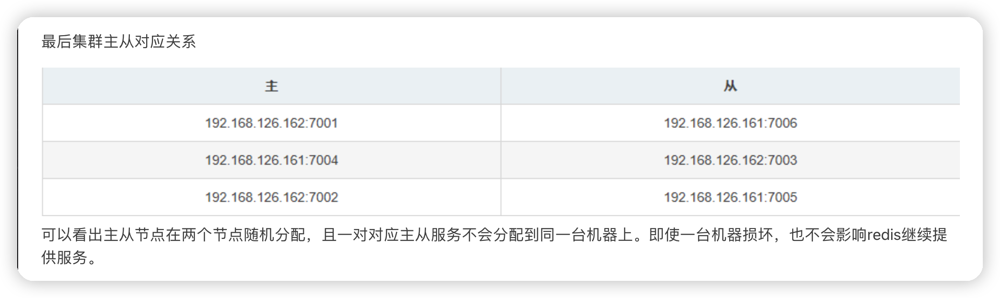

# 哨兵模式


当前redis版本大于5.0，所以不用ruby，可以直接创建。

```redis
redis-cli --cluster create 192.168.126.162:7001 192.168.126.162:7002 192.168.126.162:7003 192.168.126.161:7004 192.168.126.161:7005 192.168.126.161:7006 --cluster-replicas 1
```

`–cluster-replicas 1`：主从比例为1:1

```
[root@redis redis_cluster]# redis-cli --cluster create 192.168.126.162:7001 192.168.126.162:7002 192.168.126.162:7003 192.168.126.161:7004 192.168.126.161:7005 192.168.126.161:7006 --cluster-replicas 1
>>> Performing hash slots allocation on 6 nodes...      #对6个节点进行哈希槽位分配，实际分配三个主节点即可。
Master[0] -> Slots 0 - 5460
Master[1] -> Slots 5461 - 10922
Master[2] -> Slots 10923 - 16383
Adding replica 192.168.126.161:7006 to 192.168.126.162:7001  #三个主节点7001 7004 7002
Adding replica 192.168.126.162:7003 to 192.168.126.161:7004   #三个从节点7006 7005 7003
Adding replica 192.168.126.161:7005 to 192.168.126.162:7002
M: fb89e991f2fca476964195f496428c0de3e57f76 192.168.126.162:7001
   slots:[0-5460] (5461 slots) master
M: 54788eed17c99719f0d9e49b4933f8fc6e900cd9 192.168.126.162:7002
   slots:[10923-16383] (5461 slots) master
S: 0d4d849e80a4f12e546fa3df7fcec42cb65951b2 192.168.126.162:7003
   replicates 4fbffafb9088e65f60526147f4bff5260ea897f0
M: 4fbffafb9088e65f60526147f4bff5260ea897f0 192.168.126.161:7004
   slots:[5461-10922] (5462 slots) master
S: 6f44fa89577fd53ff8d703390e3908b7db5cb88c 192.168.126.161:7005
   replicates 54788eed17c99719f0d9e49b4933f8fc6e900cd9
S: 3f224e631bffba6d3978412df83c11b9d53f5799 192.168.126.161:7006
   replicates fb89e991f2fca476964195f496428c0de3e57f76
Can I set the above configuration? (type 'yes' to accept): yes
>>> Nodes configuration updated
>>> Assign a different config epoch to each node
>>> Sending CLUSTER MEET messages to join the cluster
Waiting for the cluster to join
......
>>> Performing Cluster Check (using node 192.168.126.162:7001)
M: fb89e991f2fca476964195f496428c0de3e57f76 192.168.126.162:7001
   slots:[0-5460] (5461 slots) master
   1 additional replica(s)
S: 0d4d849e80a4f12e546fa3df7fcec42cb65951b2 192.168.126.162:7003
   slots: (0 slots) slave
   replicates 4fbffafb9088e65f60526147f4bff5260ea897f0
M: 54788eed17c99719f0d9e49b4933f8fc6e900cd9 192.168.126.162:7002
   slots:[10923-16383] (5461 slots) master
   1 additional replica(s)
S: 6f44fa89577fd53ff8d703390e3908b7db5cb88c 192.168.126.161:7005
   slots: (0 slots) slave
   replicates 54788eed17c99719f0d9e49b4933f8fc6e900cd9
S: 3f224e631bffba6d3978412df83c11b9d53f5799 192.168.126.161:7006
   slots: (0 slots) slave
   replicates fb89e991f2fca476964195f496428c0de3e57f76
M: 4fbffafb9088e65f60526147f4bff5260ea897f0 192.168.126.161:7004
   slots:[5461-10922] (5462 slots) master
   1 additional replica(s)
[OK] All nodes agree about slots configuration.   #所有节点同意分配hash槽
>>> Check for open slots...
>>> Check slots coverage...
[OK] All 16384 slots covered.        #分配完毕，创建完成
```

