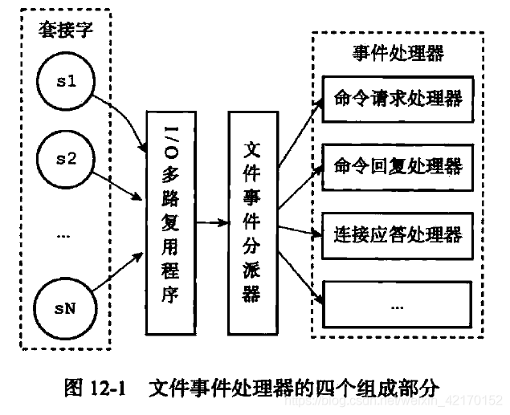
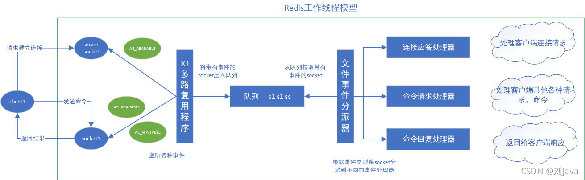

# 文件事件处理器与通信流程（简述）

该篇只是简述文件事件处理器与通信流程的基本知识点，详细讲解请阅读 “Redis通信协议与事件处理机制”章节

## 文件事件处理器特点

1. 文件事件处理器使用I/O多路复用程序来同时监听多个套接字，并根据套接字目前执行的任务来为套接字关联不同的事件处理器

2. 被监听的套接字准备执行连接应答accept、读取read、write、close等操作

## 文件事件处理器的构成

> 四个组成部分：套接字、I/O多路复用程序、文件事件分派器、事件处理器
> 

1. 每一个套接字准备好连接 客户端的请求，会产生一个文件事件。一个服务器会连接多个套接字，多个文件事件并发的出现
2. I/O多路复用程序负责监听多个套接字，并向文件时间分派器传送那些产生的套接字，将产生事件的套接字都放到一个队列里面，有序的，同步的，每次一个套接字的方式向文件事件分派器传送套接字。当上一个套接字处理完毕，接受下一个套接字。
3. 文件事件分派器接受I/O多路复用程序传来的套接字，并根据套接字产生的事件的类型，调用相应的事件处理器。（执行不同任务的套接字关联不同的事件处理器）

> 队列：套接字0.套接字1.套接字2.。。。----传送套接字s1—>

## 通信流程

**下面是客户端和redis通过文件事件处理器进行通信的大概流程：**

**下面是一次完整的客户端与服务器连接和一次通信流程示例：**

1. 当Redis服务器进行启动初始化的时候，程序会将连接应答处理器和服务器连接监听Socket（Server Socket）的AE_READABLE事件关联起来。
2. 当有客户端连接服务器监听Socket的时候，Socket就会产生AE_READABLE 事件，引发连接应答处理器执行， 并执行相应的Socket应答操作：创建客户端对应的Socket，同时将这个客户端Socket的AE_READABLE事件和命令请求处理器关联，使得客户端可以向主服务器发送命令请求，到此客户端到服务器的Socket连接建立完毕。
3. 客户端向Redis服务器发送一个命令请求（无论是读命令还是写命令），那么客户端Socket将产生 AE_READABLE事件，引发命令请求处理器执行，处理器读取客户端的命令内容，然后对命令进行执行。
4. 命令执行将会产生命令回复（结果），为了将这些命令回复传送回客户端，当Redis服务器准备好给客户端的响应数据后，服务器会将客户端Socket的AE_WRITABLE事件与命令回复处理器进行关联：当客户端尝试读取命令回复的时候，客户端Socket将产生AE_WRITABLE事件， 触发命令回复处理器执行，将命令回复（结果）数据写入Socket，这样一来客户端就可以读取结果。
5. 当命令回复处理器将命令回复全部写入到Socket之后，服务器就会解除客户端Socket的AE_WRITABLE事件与命令回复处理器之间的关联。

**文件事件处理器的整个处理过程都是单线程进行的，这个过程也就是Redis处理网络请求、执行客户端命令的过程，我们一般说的Redis是单线程的，就是由于文件事件处理器（file event handler）是单线程方式运行的，我们把该线程称为主线程，实际上，Redis内部还有许多其他辅助线程，但是不会用于处理客户端请求。**

从上面的流程可以看到，虽然文件事件处理器是单线程运行的，但通过**使用 I/O 多路复用程序**，使用一个线程就可以同时监听多个Socket（连接），既实现了高性能的网络通信模型，又可以很好地与 Redis 服务器中其他同样以单线程方式运行的模块进行对接，这保持了 Redis 内部单线程设计的简单性。

另外，可以看到**一条命令的的读取和返回都是异步的**，一个命令的读取和返回之间还能够执行其他的命令，这样的拆分可以防止某一个客户端的IO准备过程过慢而阻塞其他客户端的操作。

Redis中还有一种**时间事件**，主要用于定期更新服务器的各类统计信息，比如时间、内存占用、数据库占用情况等；清理数据库中的过期键值对；对不合理的数据库进行大小调整；关闭和清理连接失效的客户端；尝试进行 AOF 或 RDB 持久化操作；如果服务器是主节点的话，对附属节点进行定期同步；如果处于集群模式的话，对集群进行定期同步和连接测试。