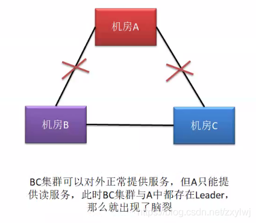

# zookeeper

## Zookeeper的角色

　　» 领导者（leader），负责进行投票的发起和决议，更新系统状态
　　» 学习者（learner），包括跟随者（follower）和观察者（observer），follower用于接受客户端请求并想客户端返回结果，在选主过程中参与投票
　　» Observer可以接受客户端连接，将写请求转发给leader，但observer不参加投票过程，只同步leader的状态，observer的目的是为了扩展系统，提高读取速度
　　» 客户端（client），请求发起方

　　　　

　　　　　

　　• Zookeeper的核心是原子广播，这个机制保证了各个Server之间的同步。实现这个机制的协议叫做Zab协
　　  议。Zab协议有两种模式，它们分别是恢复模式（选主）和广播模式（同步）。当服务启动或者在领导者
　　　崩溃后，Zab就进入了恢复模式，当领导者被选举出来，且大多数Server完成了和leader的状态同步以后
　　  ，恢复模式就结束了。状态同步保证了leader和Server具有相同的系统状态。

　　• 为了保证事务的顺序一致性，zookeeper采用了递增的事务id号（zxid）来标识事务。所有的提议（
　　　proposal）都在被提出的时候加上了zxid。实现中zxid是一个64位的数字，它高32位是epoch用来标识
　　  leader关系是否改变，每次一个leader被选出来，它都会有一个新的epoch，标识当前属于那个leader的
　　　统治时期。低32位用于递增计数。
　　• 每个Server在工作过程中有三种状态：
　　　　LOOKING：当前Server不知道leader是谁，正在搜寻
　　　　LEADING：当前Server即为选举出来的leader
　　　　FOLLOWING：leader已经选举出来，当前Server与之同步

## zookeeper的数据模型

Zookeeper 会维护一个具有层次关系的数据结构，它非常类似于一个标准的文件系统，每个节点都叫数据节点（znode），节点上可以存储数据。

数据结构的特点：

每个子目录项如 NameService 都被称作为 znode，这个 znode 是被它所在的路径唯一标识，如 Server1 这个 znode 的标识为 /NameService/Server1
znode 可以有子节点目录，并且每个 znode 可以存储数据，注意 EPHEMERAL 类型的目录节点不能有子节点目录
znode 是有版本的，每个 znode 中存储的数据可以有多个版本，也就是一个访问路径中可以存储多份数据
znode 可以是临时节点，一旦创建这个 znode 的客户端与服务器失去联系，这个 znode 也将自动删除，Zookeeper 的客户端和服务器通信采用长连接方式，每个客户端和服务器通过心跳来保持连接，这个连接状态称为 session，如果 znode 是临时节点，这个 session 失效，znode 也就删除了
znode 的目录名可以自动编号，如 App1 已经存在，再创建的话，将会自动命名为 App2
znode 可以被监控，包括这个目录节点中存储的数据的修改，子节点目录的变化等，一旦变化可以通知设置监控的客户端，这个是 Zookeeper 的核心特性，Zookeeper 的很多功能都是基于这个特性实现的。
节点的类型：

PERSISTENT-持久化目录节点 客户端与zookeeper断开连接后，该节点依旧存在
PERSISTENT_SEQUENTIAL-持久化顺序编号目录节点 客户端与zookeeper断开连接后，该节点依旧存在，只是Zookeeper给该节点名称进行顺序编号
EPHEMERAL-临时目录节点 客户端与zookeeper断开连接后，该节点被删除
EPHEMERAL_SEQUENTIAL-临时顺序编号目录节点 客户端与zookeeper断开连接后，该节点被删除，只是Zookeeper给该节点名称进行顺序编号

### 3.2 Zookeeper 的读写机制

Zookeeper是一个由多个server组成的集群
一个leader，多个follower
每个server保存一份数据副本
全局数据一致
分布式读写
更新请求转发，由leader实施

### 3.3 Zookeeper 的保证　

更新请求顺序进行，来自同一个client的更新请求按其发送顺序依次执行
数据更新原子性，一次数据更新要么成功，要么失败
全局唯一数据视图，client无论连接到哪个server，数据视图都是一致的
实时性，在一定时间范围内，client能读到最新数据

### 3.4 Zookeeper节点数据操作流程

 

在Client向Follwer发出一个写的请求
Follwer把请求发送给Leader
Leader接收到以后开始发起投票并通知Follwer进行投票
Follwer把投票结果发送给Leader
Leader将结果汇总后如果需要写入，则开始写入同时把写入操作通知给Follwer，然后commit;
Follwer把请求结果返回给Client
Follower主要有四个功能：

向Leader发送请求（PING消息、REQUEST消息、ACK消息、REVALIDATE消息）；
接收Leader消息并进行处理；
接收Client的请求，如果为写请求，发送给Leader进行投票；
返回Client结果。
Follower的消息循环处理如下几种来自Leader的消息：

PING消息： 心跳消息；
PROPOSAL消息：Leader发起的提案，要求Follower投票；
COMMIT消息：服务器端最新一次提案的信息；
UPTODATE消息：表明同步完成；
REVALIDATE消息：根据Leader的REVALIDATE结果，关闭待revalidate的session还是允许其接受消息；
SYNC消息：返回SYNC结果到客户端，这个消息最初由客户端发起，用来强制得到最新的更新。

### 3.5 leader 选举

半数通过
A提案说，我要选自己，B你同意吗？C你同意吗？B说，我同意选A；C说，我同意选A。(注意，这里超过半数了，其实在现实世界选举已经成功了。 但是计算机世界是很严格，另外要理解算法，要继续模拟下去。)
接着B提案说，我要选自己，A你同意吗；A说，我已经超半数同意当选，你的提案无效；C说，A已经超半数同意当选，B提案无效。
接着C提案说，我要选自己，A你同意吗；A说，我已经超半数同意当选，你的提案无效；B说，A已经超半数同意当选，C的提案无效。
选举已经产生了Leader，后面的都是follower，只能服从Leader的命令。而且这里还有个小细节，就是其实谁先启动谁当头。

## 原子广播

 Zookeeper的核心是原子广播，这个机制保证了各个server之间的同步。实现这个机制的协议叫做Zab协议。Zab协议有两种模式，它们分别是恢复模式和广播模式。

　　　当服务启动或者在领导者崩溃后，Zab就进入了恢复模式，当领导者被选举出来，且大多数server的完成了和leader的状态同步以后，恢复模式就结束了。

　　　状态同步保证了leader和server具有相同的系统状态

　　» 一旦leader已经和多数的follower进行了状态同步后，他就可以开始广播消息了，即进入广播状态。这时候当一个server加入zookeeper服务中，它会在恢复模式下启动，

　　　发现leader，并和leader进行状态同步。待到同步结束，它也参与消息广播。Zookeeper服务一直维持在Broadcast状态，直到leader崩溃了或者leader失去了大部分

　　　的followers支持。

　　» 广播模式需要保证proposal被按顺序处理，因此zk采用了递增的事务id号(zxid)来保证。所有的提议(proposal)都在被提出的时候加上了zxid。

　　　实现中zxid是一个64为的数字，它高32位是epoch用来标识leader关系是否改变，每次一个leader被选出来，它都会有一个新的epoch。低32位是个递增计数。

　　» 当leader崩溃或者leader失去大多数的follower，这时候zk进入恢复模式，恢复模式需要重新选举出一个新的leader，让所有的server都恢复到一个正确的状态。　

　　» 每个Server启动以后都询问其它的Server它要投票给谁。
　　» 对于其他server的询问，server每次根据自己的状态都回复自己推荐的leader的id和上一次处理事务的zxid（系统启动时每个server都会推荐自己）
　　» 收到所有Server回复以后，就计算出zxid最大的哪个Server，并将这个Server相关信息设置成下一次要投票的Server。
　　» 计算这过程中获得票数最多的的sever为获胜者，如果获胜者的票数超过半数，则改server被选为leader。否则，继续这个过程，直到leader被选举出来　　

　　» leader就会开始等待server连接
　　» Follower连接leader，将最大的zxid发送给leader
　　» Leader根据follower的zxid确定同步点
　　» 完成同步后通知follower 已经成为uptodate状态
　　» Follower收到uptodate消息后，又可以重新接受client的请求进行服务了

## 脑裂问题

zookeeper可能引发脑裂现象，是指在多机房（网络分区）部署中，若出现网络连接问题，形成多个分区，则可能出现脑裂问题，会导致数据不一致。（严重故障，违反zookeeper实现一致性原则）

多机房部署：即CAP中的P原则，分区容错性；

        如上图，zookeeper经典的三机房部署，每个分区都不超过半数，容灾能力最好的部署方案，现有运行状态中leader在机房A，目前机房A与机房B的通信出现阻断（网络故障），机房B中的follower无法感知leader，机房C与机房A正常通信，C中的follower可以感知A中的leader，那么B中的follower状态会由following改变为looking，停止对外服务开始选举新的leader，并向C发送选举消息，但是C可以感知A的leader所以其中的follower状态为following，C不会接受B发来的选举请求，那么B发起的选举无效，因为没能通过半数以上通过；那么出现了B机房不对外提供服务，A和C依然保持对外提供服务，所以此情况不存在脑裂。

        如上图，情况出现变化，A与B和C的通信都阻断了，只有B和C可以通信，那么B和C就会进入looking状态开始选举新leader，如选出B中的follower为leader，就会出现zookeeper集群中出现双leader；A还会对外提供服务，但是其只能实现读服务，一旦出现写请求，其需要投票然投票数无法过半，所有无法完成写服务；B和C又形成了一个集群，对外提供读写服务；此状况就是脑裂问题，会造成数据不一致，如果有写请求进入BC集群并修改了内容，无法和A同步，那么原始的一致就被改变了；
所以为了解决脑裂问题，Zookeeper3.4.6的选举算法修改为了FastLeaderElection，该算法的规则是投票超过半数的服务器才能当选为Leader。这个算法能够保证leader的唯一性。也就是说如果A机房与BC的通信断了，那A机房中原本的leader就不再是leader了，转为looking状态，同样如果ABC三个机房的通信都断了，那么所有zookeeper服务都会变成looking状态。（LOOKING状态解释：当前Server不知道leader是谁，正在搜寻）
