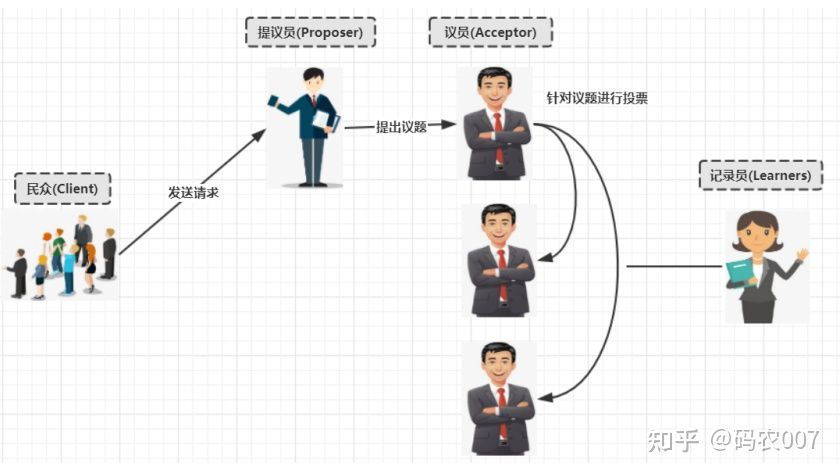

# zookeeper

## Zookeeper的角色

　　» 领导者（leader），负责进行投票的发起和决议，更新系统状态
　　» 学习者（learner），包括跟随者（follower）和观察者（observer），follower用于接受客户端请求并想客户端返回结果，在选主过程中参与投票
　　» Observer可以接受客户端连接，将写请求转发给leader，但observer不参加投票过程，只同步leader的状态，observer的目的是为了扩展系统，提高读取速度
　　» 客户端（client），请求发起方

　　　　

　　　　　

　　• Zookeeper的核心是原子广播，这个机制保证了各个Server之间的同步。实现这个机制的协议叫做Zab协
　　  议。Zab协议有两种模式，它们分别是恢复模式（选主）和广播模式（同步）。当服务启动或者在领导者
　　　崩溃后，Zab就进入了恢复模式，当领导者被选举出来，且大多数Server完成了和leader的状态同步以后
　　  ，恢复模式就结束了。状态同步保证了leader和Server具有相同的系统状态。

　　• 为了保证事务的顺序一致性，zookeeper采用了递增的事务id号（zxid）来标识事务。所有的提议（
　　　proposal）都在被提出的时候加上了zxid。实现中zxid是一个64位的数字，它高32位是epoch用来标识
　　  leader关系是否改变，每次一个leader被选出来，它都会有一个新的epoch，标识当前属于那个leader的
　　　统治时期。低32位用于递增计数。
　　• 每个Server在工作过程中有三种状态：
　　　　LOOKING：当前Server不知道leader是谁，正在搜寻
　　　　LEADING：当前Server即为选举出来的leader
　　　　FOLLOWING：leader已经选举出来，当前Server与之同步

## zookeeper的数据模型


Zookeeper 会维护一个具有层次关系的数据结构，它非常类似于一个标准的文件系统，每个节点都叫数据节点（znode），节点上可以存储数据。

数据结构的特点：

每个子目录项如 NameService 都被称作为 znode，这个 znode 是被它所在的路径唯一标识，如 Server1 这个 znode 的标识为 /NameService/Server1
znode 可以有子节点目录，并且每个 znode 可以存储数据，注意 EPHEMERAL 类型的目录节点不能有子节点目录
znode 是有版本的，每个 znode 中存储的数据可以有多个版本，也就是一个访问路径中可以存储多份数据
znode 可以是临时节点，一旦创建这个 znode 的客户端与服务器失去联系，这个 znode 也将自动删除，Zookeeper 的客户端和服务器通信采用长连接方式，每个客户端和服务器通过心跳来保持连接，这个连接状态称为 session，如果 znode 是临时节点，这个 session 失效，znode 也就删除了
znode 的目录名可以自动编号，如 App1 已经存在，再创建的话，将会自动命名为 App2
znode 可以被监控，包括这个目录节点中存储的数据的修改，子节点目录的变化等，一旦变化可以通知设置监控的客户端，这个是 Zookeeper 的核心特性，Zookeeper 的很多功能都是基于这个特性实现的。
节点的类型：

PERSISTENT-持久化目录节点 客户端与zookeeper断开连接后，该节点依旧存在
PERSISTENT_SEQUENTIAL-持久化顺序编号目录节点 客户端与zookeeper断开连接后，该节点依旧存在，只是Zookeeper给该节点名称进行顺序编号
EPHEMERAL-临时目录节点 客户端与zookeeper断开连接后，该节点被删除
EPHEMERAL_SEQUENTIAL-临时顺序编号目录节点 客户端与zookeeper断开连接后，该节点被删除，只是Zookeeper给该节点名称进行顺序编号

### 3.2 Zookeeper 的读写机制

Zookeeper是一个由多个server组成的集群
一个leader，多个follower
每个server保存一份数据副本
全局数据一致
分布式读写
更新请求转发，由leader实施

### 3.3 Zookeeper 的保证　

更新请求顺序进行，来自同一个client的更新请求按其发送顺序依次执行
数据更新原子性，一次数据更新要么成功，要么失败
全局唯一数据视图，client无论连接到哪个server，数据视图都是一致的
实时性，在一定时间范围内，client能读到最新数据

### 3.4 Zookeeper节点数据操作流程

 

在Client向Follwer发出一个写的请求
Follwer把请求发送给Leader
Leader接收到以后开始发起投票并通知Follwer进行投票
Follwer把投票结果发送给Leader
Leader将结果汇总后如果需要写入，则开始写入同时把写入操作通知给Follwer，然后commit;
Follwer把请求结果返回给Client
Follower主要有四个功能：

向Leader发送请求（PING消息、REQUEST消息、ACK消息、REVALIDATE消息）；
接收Leader消息并进行处理；
接收Client的请求，如果为写请求，发送给Leader进行投票；
返回Client结果。
Follower的消息循环处理如下几种来自Leader的消息：

PING消息： 心跳消息；
PROPOSAL消息：Leader发起的提案，要求Follower投票；
COMMIT消息：服务器端最新一次提案的信息；
UPTODATE消息：表明同步完成；
REVALIDATE消息：根据Leader的REVALIDATE结果，关闭待revalidate的session还是允许其接受消息；
SYNC消息：返回SYNC结果到客户端，这个消息最初由客户端发起，用来强制得到最新的更新。

### 3.5 leader 选举

半数通过
A提案说，我要选自己，B你同意吗？C你同意吗？B说，我同意选A；C说，我同意选A。(注意，这里超过半数了，其实在现实世界选举已经成功了。 但是计算机世界是很严格，另外要理解算法，要继续模拟下去。)
接着B提案说，我要选自己，A你同意吗；A说，我已经超半数同意当选，你的提案无效；C说，A已经超半数同意当选，B提案无效。
接着C提案说，我要选自己，A你同意吗；A说，我已经超半数同意当选，你的提案无效；B说，A已经超半数同意当选，C的提案无效。
选举已经产生了Leader，后面的都是follower，只能服从Leader的命令。而且这里还有个小细节，就是其实谁先启动谁当头。

#### 原子广播

 Zookeeper的核心是原子广播，这个机制保证了各个server之间的同步。实现这个机制的协议叫做Zab协议。Zab协议有两种模式，它们分别是恢复模式和广播模式。

　　　当服务启动或者在领导者崩溃后，Zab就进入了恢复模式，当领导者被选举出来，且大多数server的完成了和leader的状态同步以后，恢复模式就结束了。

#### 选举的流程


## Paxos协议基本原理

### Paxos协议是什么？

Paxos协议其实说的就是Paxos算法, Paxos算法是基于**消息传递**且具有**高度容错特性**的**一致性算法**，是目前公认的解决**分布式一致性**问题**最有效**的算法之一。

### Paxos解决了什么问题？


在常见的分布式系统中，总会发生诸如**机器宕机或网络异常**（包括消息的延迟、丢失、重复、乱 序，还有网络分区）等情况。Paxos算法需要解决的问题就是如何在一个可能发生上述异常的分布式系 统中，快速且正确地在**集群内部对某个数据的值**达成**一致**，并且保证不论发生以上任何异常，都不会破坏整个系统的一致性。 

Paxos的版本有: **Basic Paxos** , **Multi Paxos**, **Fast-Paxo**s, 具体落地有**Raft** 和**zk的ZAB**协议


### Basic Paxos

**1. 角色介绍** 

**Client**:**客户端**

> 客户端向分布式系统发出请求,并等待响应。例如，对分布式文件服务器中文件的写请求。

**Proposer：提案发起者**

> 提案者提倡客户端请求，试图说服Acceptor对此达成一致，并在发生冲突时充当协调者以推 动协议向前发展 

**Acceptor: 决策者，可以批准提案**

> Acceptor可以接受（accept）提案；并进行投票, 投票结果是否通过以多数派为准, 以如果某 个提案被选定，那么该提案里的value就被选定了。

**Learner: 最终决策的学习者** 

> 学习者充当该协议的复制因素(**不参与投票**) 。

**2. 决策模型**



**3. basic paxos流程**

> **1.Prepare** 
> Proposer提出一个提案,编号为N, 此N大于这个Proposer之前提出所有提出的编号, 请求 Accpetor的多数人接受这个提案 。当Proposer小于之前提出所有提出的编号会直接拒绝。
> **2.Promise** 
> 如果编号N大于此Accpetor之前接收的任提案编号则接收, 否则拒绝
> **3.Accept**
> 如果达到多数派, Proposer会发出accept请求, 此请求包含提案编号和对应的内容 
> **4.Accepted**
> 如果此Accpetor在此期间没有接受到任何大于N的提案,则接收此提案内容, 否则忽略 

**Basic Paxos流程图**

**1. 无故障的basic Paxos** 


**2 . Acceptor失败时的basic Paxos**

在下图中，**多数派中的一个Acceptor发生故障，因此多数派大小变为**2。在这种情况下，Basic Paxos协议**仍然成功**。


**3. Proposer失败时的basic Paxos** 

Proposer在提出提案之后但在达成协议之前失败。具体来说，传递到Acceptor的时候失败了,这个时候需要选出**新的Proposer**（提案人）,那么 Basic Paxos协议**仍然成功**。


**4. 当多个提议者发生冲突时的basic Paxos** 

最复杂的情况是**多个Proposer**都进行提案,导致Paxos的**活锁问题。**

**解决方法活锁问题**

针对**活锁问题解决**起来非常简单: 只需要在每个Proposer再去提案的时候**随机加上一个等待时间**即可。


### Multi-Paxos 

针对basic Paxos是存在一定得问题,首先就是**流程复杂,实现及其困难**, 其次**效率低**(达成一致性需要2轮 RPC调用),针对basic Paxos流程进行拆分为**选举**和**复制**的过程。


**Multi-Paxos角色重叠流程图**

Multi-Paxos在实施的时候会将**Proposer，Acceptor和Learner**的角色合并统称为"**服务器"**。因此， 最后只有"**客户端**"和"**服务器**"。


## 脑裂问题

对于一个集群，想要提高这个集群的可用性，通常会采用多机房部署，比如现在有一个由6台zkServer所组成的一个集群，部署在了两个机房：


正常情况下，此集群只会有一个Leader，那么如果机房之间的网络断了之后，两个机房内的zkServer还是可以相互通信的，如果**不考虑过半机制**，那么就会出现每个机房内部都将选出一个Leader。

这就相当于原本一个集群，被分成了两个集群，出现了两个“大脑”，这就是脑裂。

对于这种情况，我们也可以看出来，原本应该是统一的一个集群对外提供服务的，现在变成了两个集群同时对外提供服务，如果过了一会，断了的网络突然联通了，那么此时就会出现问题了，两个集群刚刚都对外提供服务了，数据该怎么合并，数据冲突怎么解决等等问题。

刚刚在说明脑裂场景时，有一个前提条件就是没有考虑过半机制，所以实际上Zookeeper集群中是不会出现脑裂问题的，而不会出现的原因就跟过半机制有关。

在领导者选举的过程中，如果某台zkServer获得了超过半数的选票，则此zkServer就可以成为Leader了。

过半机制的源码实现其实非常简单：

```java
public class QuorumMaj implements QuorumVerifier {
    private static final Logger LOG = LoggerFactory.getLogger(QuorumMaj.class);
    
    int half;
    
    // n表示集群中zkServer的个数（准确的说是参与者的个数，参与者不包括观察者节点）
    public QuorumMaj(int n){
        this.half = n/2;
    }
 
    // 验证是否符合过半机制
    public boolean containsQuorum(Set<Long> set){
        // half是在构造方法里赋值的
        // set.size()表示某台zkServer获得的票数
        return (set.size() > half);
    }
    
}
```

zookeeper可能引发脑裂现象，是指在多机房（网络分区）部署中，若出现网络连接问题，形成多个分区，则可能出现脑裂问题，会导致数据不一致。（严重故障，违反zookeeper实现一致性原则）

大家仔细看一下上面方法中的注释，核心代码就是下面两行：

```java
this.half = n/2;
return (set.size() > half);
```

举个简单的例子：如果现在集群中有5台zkServer，那么half=5/2=2，那么也就是说，领导者选举的过程中至少要有三台zkServer投了同一个zkServer，才会符合过半机制，才能选出来一个Leader。

那么有一个问题我们想一下，**选举的过程中为什么一定要有一个过半机制验证？**因为这样不需要等待所有zkServer都投了同一个zkServer就可以选举出来一个Leader了，这样比较快，所以叫快速领导者选举算法呗。

那么再来想一个问题，**过半机制中为什么是大于，而不是大于等于呢？**

这就是更脑裂问题有关系了，比如回到上文出现脑裂问题的场景：

当机房中间的网络断掉之后，机房1内的三台服务器会进行领导者选举，但是此时过半机制的条件是set.size() > 3，也就是说至少要4台zkServer才能选出来一个Leader，所以对于机房1来说它不能选出一个Leader，同样机房2也不能选出一个Leader，这种情况下整个集群当机房间的网络断掉后，整个集群将没有Leader。

而如果过半机制的条件是set.size() >= 3，那么机房1和机房2都会选出一个Leader，这样就出现了脑裂。所以我们就知道了，为什么过半机制中是**大于**，而不是**大于等于**。就是为了防止脑裂。

如果假设我们现在只有5台机器，也部署在两个机房：

此时过半机制的条件是set.size() > 2，也就是至少要3台服务器才能选出一个Leader，此时机房件的网络断开了，对于机房1来说是没有影响的，Leader依然还是Leader，对于机房2来说是选不出来Leader的，此时整个集群中只有一个Leader。

所以，我们可以总结得出，有了过半机制，对于一个Zookeeper集群，要么没有Leader，要没只有1个Leader，这样就避免了脑裂问题。


多机房部署：即CAP中的P原则，分区容错性；


        如上图，zookeeper经典的三机房部署，每个分区都不超过半数，容灾能力最好的部署方案，现有运行状态中leader在机房A，目前机房A与机房B的通信出现阻断（网络故障），机房B中的follower无法感知leader，机房C与机房A正常通信，C中的follower可以感知A中的leader，那么B中的follower状态会由following改变为looking，停止对外服务开始选举新的leader，并向C发送选举消息，但是C可以感知A的leader所以其中的follower状态为following，C不会接受B发来的选举请求，那么B发起的选举无效，因为没能通过半数以上通过；那么出现了B机房不对外提供服务，A和C依然保持对外提供服务，所以此情况不存在脑裂。


        如上图，情况出现变化，A与B和C的通信都阻断了，只有B和C可以通信，那么B和C就会进入looking状态开始选举新leader，如选出B中的follower为leader，就会出现zookeeper集群中出现双leader；A还会对外提供服务，但是其只能实现读服务，一旦出现写请求，其需要投票然投票数无法过半，所有无法完成写服务；B和C又形成了一个集群，对外提供读写服务；此状况就是脑裂问题，会造成数据不一致，如果有写请求进入BC集群并修改了内容，无法和A同步，那么原始的一致就被改变了；
所以为了解决脑裂问题，Zookeeper3.4.6的选举算法修改为了FastLeaderElection，该算法的规则是投票超过半数的服务器才能当选为Leader。这个算法能够保证leader的唯一性。也就是说如果A机房与BC的通信断了，那A机房中原本的leader就不再是leader了，转为looking状态，同样如果ABC三个机房的通信都断了，那么所有zookeeper服务都会变成looking状态。（LOOKING状态解释：当前Server不知道leader是谁，正在搜寻）

**过半机制就是为脑裂问题设计的，如果A机房与BC的通信断了，那他自然就不再是leader了转为looking了，同样如果ABC的通信都断了，都会变成looking状态。**
