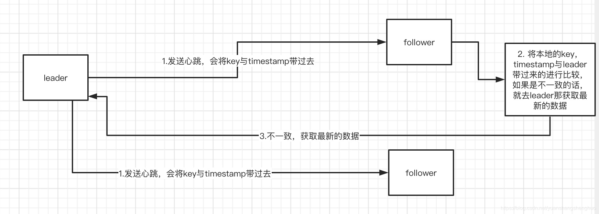

# Nacos注册中心

## 选举与心跳

nacos临时节点的存储是放到内存中的，然后节点之间的数据同步也是那种异步同步的peer to peer方式，属于cap里面的ap模型，但是它的永久节点的存储就不一样了，节点的数据同步是基于raft协议来实现数据一致性的，第一小节我们会简单介绍下nacos中raft协议，然后直接进入源码看看nacos 是怎样实现这个raft协议的。

1. nacos中raft协议简单介绍

《[In search of an Understandable Consensus Algorithm](https://raft.github.io/raft.pdf)》论文

集群中的角色分为 LEADER（leader领导者）， FOLLOWER（follower 跟随者），CANDIDATE（candidate候选人）
正常情况下集群中只能一个leader ， 然后一群follower ，是没有这个candidate ，当leader挂了，这个时候follower 才会变成candidate进行选举。
当leader 挂了或者集群刚启动的时候要进行选举，选出一个节点当leader，其他节点变成follower。
选举是节点自己先投自己一票，然后向其他节点拉票，希望其他节点能够投它，票数过集群节点半数+1，就可以成为leader
leader接收客户端的数据操作请求，如果follower 接收到了客户端操作数据请求，就会将请求转发给leader节点，由leader节点进行数据同步，将数据同步给其他follower 节点，nacos中半数+1的节点同步成功就算是ok了。
leader要向follower 发送心跳，告诉follower 自己还活着，如果follower 长时间没有收到这个leader的心跳信息，就会认为leader挂了，重新进行选举。
（ps：以上仅个人见解，向详细了解raft协议的同学需要去查阅下官方的资料。）

### 1. 选举

选举工作主要是在RaftCore 这个里面实现的，我们来看下这类的初始化动作

首先是将文件中的数据加载到内存中，文件就是那些服务信息，实例列表这些东西。在你nacos.home/data/naming/data/{namespace}/ 下面。接着就是加载 term ，将 nacos_home/data/naming/data/meta.properties文件中的term加载到内存中，需要注意的每个peer都有自己的term，这个term很重要，在nacos中能不能选上leader就是靠的term大小。再就是创建了2个任务放到调度线程池中了，一个是选举任务，一个是心跳任务。

接下来我们看下选举任务（我们心中要有那么几台机器，然后跟个它这个代码运行 ，不然你看着堆代码还是不能理解它是怎样选出来的）

首先是检查下状态，是否准备好等等，接着获取自己的peer，这个peer可以理解成自己的节点信息。拿自己的leaderDueMs 减500，这个leaderDueMs 一开始是0到15000的随机数，只有减到负数才能继续往下，否则就是return 等待下次的调度（也就是等500ms），这个随机数说实话是非常重要的，再往下走就是重置的这个leaderDue 与heartBeatDue。leaderDue 重置到15000到20000之间，heartBeatDue就是5000。接着就是调用sendVote方法 发送选票了。

先是获取自己的peer ，然后就是重置这个peer ，其实就是将voteFor这个变量设置成null了，这个变量就是投票给谁的意思，接着自己的term自己加1，这个也很重要，接着投票给自己，就是voteFor设置成了自己的ip，角色变成candidate 候选人。最后就是给自己拉票了，将自己这个peer作为参数传到集群所有的节点中。
我们看下其他节点收到拉票请求是怎样处理的，这拉票处理是在RaftCore的receivedVote方法中处理的

这个方法就是将自己的peer取出来，然后自己的term 与对端的term进行大小比较，如果是对方term比自己的小，就会将voteFor设置成自己，然后把自己的peer回复给拉票方，其实就是告诉对方你的term太小了，然后我要投票给我自己。
如果是对方的term比自己的大，重置leaderDue ，重置leaderDue 后它的选举任务在15000到20000 毫秒之内就不再往下进行了，因为它一次减500，减不到小于0就return。接着就是自己角色设置成FOLLOWER， 投票给对端的，自己的term重置成对端的term，返回给拉票方。

接下来我们再来看下 拉票方收到对方的投票结果后是怎样处理的。

这个计算自己多少票，看看谁能当leader的方法了，把收到的投票信息放到peers中，遍历找出最大票数与对应的那个peer，如果是最大票数超过了半数+1

就会从peer中将取出那个当选的peer ，将这个peer设置成leader，如果自己本地的leader不是这个新当选的leader ，就会替换下，并发布leader选举完成的事件。
好了，到这leader选举就完成了，关键点就是在这个term上，term越大越能当选，如果是一开始term相等的话，那个leaderDue是非常重要的，15000到20000 这之间的随机数，如果是15000的就比20000的早执行选举，term也就早+1 ，早发起拉票，早当选。

### 2.心跳

接下来看下发送心跳的任务

跟选举差不多，也是先整上个0-5000让你减，减到小于0 就可以往下走了，接着就是重置这个心跳，重置成5000，最后调用sendBeat方法，发送心跳

如果当前不是集群模式或者自己不是leader ， 就不用再往下执行了，也就是只有集群模式的leader才能发送心跳，接着重置一下自己的leaderDue，这个也是告诉自己的那个选举任务，在15000到20000之间不要选举了，如果不是仅仅发送心跳的话，就是还要带着数据的key与timestamp

上面这一大堆就是压缩数据，下面的for循环就是向所有的节点发送心跳（抛去自己），收到回应后更新peer。
我们再来看看follower节点是怎样处理心跳的

这个方法很长，我们只看下前半部分，后半部分都是处理那些leader带过来的key信息。首先是取出来leader传过来的数据，判断对端是不是leader，不是不行，判断对端的term与自己的term ，如果自己的大于的对端的话也不行，如果自己不是follower的话，就设置成follower ，并把自己的票给对端，重置这个leaderDue与heartBeatDue，其实你会发现，只要leader一直不挂，往follower发送心跳，follower 就一直会重置leaderDue，follower的选举任务就一直不会往下走。
接着看下这个makeLeader

这个方法主要就是更新下自己本地维护的leader，如果本地维护的leader不是远端那个的话，就重新设置下本地的leader，并且发布leader改变的事件，
接着就是遍历所有的peer，找出以前那个leader ，发送请求，获取一下它的peer信息，然后更新下维护的它的peer信息，最后更新下本地委会的leader peer 信息。
好了，到这我们心跳这块也是ok了，心跳执行leader向其他的节点发送，让其他节点知道leader 还活着，如果leader长时间不发送，follower就认为leader挂了，继续走选举的逻辑，这里重置leaderDue是非常重要的。

## 基于raft 协议的数据一致性

一文中我们着重介绍了nacos 对于raft协议实现的落地，介绍了它的选举，它的心跳是怎样运转的，其实重要的还是term 与随机时间这块还有获得半数+1票，本文就要看看基于这套raft 协议的数据同步是怎样进行的，主要是写操作。

### 1.回顾一下服务注册流程

当一个服务注册请求打到nacos服务器的时候，它会根据根据你这个实例的namespace， serviceName，group信息获取到对应的service，如果不存在就创建，然后就是进行根据你这个service里面原来的实例列表信息在加上这个新的实例信息，整合出来一个新的实例列表信息，接着就是找到一致性服务（consistencyService）进行put操作，这个consistencyService 会根据实例是临时节点（默认就是这个临时节点）还是永久节点选择对应的consistencyService ，其实对于临时节点对应的就是DistroConsistencyServiceImpl，它节点之间数据同步是peer to peer 的，跟那个eureka 差不多，对于永久节点对应的是PersistentConsistencyServiceDelegateImpl，这个里面有2个实现一个是RaftConsistencyServiceImpl的，一个是PersistentServiceProcessor，RaftConsistencyServiceImpl 是1.4之前版本使用的，也是我们今天要介绍的，后面这个PersistentServiceProcessor 是1.4包括以上的版本使用的（这里我们先不介绍）
大概就是下图这个样子

**本文主要就是介绍下红框中的基于raft 协议数据同步的部分。**

### 2.基于raft的写操作同步

我们可以对照着上图红框部分来看看
RaftConsistencyServiceImpl# put

这里没什么好说的，就是检查下状态，然后找到这个raftCore的signalPublish 来进行存储，同步。接下来看看signalPublish 这个方法

比较重要的点，判断，如果本机不是leader节点的话，就要封装参数将请求发送给leader节点，leader 节点收到请求后，其实还是走到这个put方法中。来看下这个raftProxy.proxyPostLarge 方法

可以看到，leader结果不ok的话，会抛出异常。
接着raftCore的signalPublish 方法往下看

这里有2个重要的点，一个是更新数据里面的timestamp 值，就是自增1，这个timestamp 值很重要，相当于是个版本。接着调用onPublish 方法进行本地存储。我们来看下onPublish方法干了啥

这个onPublish 很重要，因为follower节点收到同步请求之后，也是调用了这个方法，它主要是干了6件事情，1是重置下选举倒计时，毕竟leader还活着，follower节点收到了leader 同步请求也是执行这个方法，也是需要重置倒计时的。
2是，如果是持久节点， 将datum写到文件中。

就是这个样子，里面记录了service详细信息与节点集合信息。
3是将datum存储到内存中，其实就是put到一个map了。
4是更新term值，leader的话+100，然后follower +100的话不超过leader就可以，超过了就使用leader的值。
5是将这个term写到文件中，不然的服务突然挂了，再起来就不知道term是多少了，或者是整个集群挂了，重启的话，不知道以谁的数据为准了，因为选举leader就是看的这个term值大小。
6是发布服务实例改变事件，发布到通知中心中，然后PersistentNotifier 这个类会订阅这个事件，然后进行通知了，其实这里就是异步通知。
好了，onPublish 方法就介绍完了。
接着raftCore的signalPublish 方法往下看

这块也是很重要的，这里用了CountDownLatch 来计数堵塞超时，数量就是节点数/2+1（节点半数+1），接着就是遍历这堆节点了，然后发送数据同步请求，然后每收到一个follower节点的回复，CountDownLatch就减1 一下。
可以看到后面一直等着，5秒超时，如果5s之内follower节点回复数量大于等于 半数+1，就算成功了，如果没有的话，就抛出异常，然后释放锁资源。
这里可以仔细想一下，leader节点是先将数据保存到本地了，不管是内存还是文件，term也进行了+1 ，更新事件也发布了，这个时候，如果因为网络故障同步节点成功达不到这个半数+1 ，就会造成数据不一致的情况，客户端将请求打到不同的nacos 节点上，拿到的数据是不一致的，所以从这里可以看出来nacos这个raft 协议并不是强一致，强一致的就要么都成功，要么都失败的，它这个整的失败的时候数据，leader与follower数据发生了不一致。其实这个nacos 的raft 协议实现的是个最终一致。接下来我们看下它最终一致是怎样实现的。

3. 它这个raft协议最终一致是怎样实现的

它这个raft协议最终一致实现原理其实很简单，就是leader在发送心跳的时候会将这个数据的key与timestamp（可以理解成版本号，我们上面也介绍过） 带给follower节点，然后follower节点收到leader 发过来的心跳，会将本地的key ，timestamp 与leader带过来的key，timestamp 进行比较，如果本地少了这个key ，或者是key对应的timestamp 低于leader的话，就会发送请求去leader那拉取不一致的数据

我们先来看下这个leader发送心跳的时候是怎样将key 与timestamp带过去的。
RaftCore#sendBeat方法

就是将key 与timestamp 封装到了element中。最后发送请求的时候会带过去。
follower 收到心跳信息，比较key与timestamp 的代码和发送拉取数据请求的太长了我们这里就不看了，我们只需要知道有这么个事就可以了，在Raft#receivedBeat 方法中。

## Nacos 实现 AP+CP原理

### 什么是 Raft算法

Raft 适用于一个管理日志一致性的协议，相比于 Paxos 协议 Raft 更易于理解和去实现它。为了提高理解性，Raft 将一致性算法分为了几个部分，包括领导选取（leader selection）、日志复制（log replication）、安全（safety），并且使用了更强的一致性来减少了必须需要考虑的状态。

Raft算法将 Server划分为3种状态，或者也可以称作角色：
【1】Leader：负责 Client交互和 log复制，同一时刻系统中最多存在1个。
【2】Follower：被动响应请求RPC，从不主动发起请求RPC。
【3】Candidate：一种临时的角色，只存在于 Leader的选举阶段，某个节点想要变成 Leader，那么就发起投票请求，同时自己变成 Candidate。如果选举成功，则变为 Candidate，否则退回为 Follower

状态或者说角色的流转如下：

在 Raft中，问题分解为：领导选取、日志复制、安全和成员变化。

> 复制状态机通过复制日志来实现

日志：每台机器保存一份日志，日志来自于客户端的请求，包含一系列的命令
状态机：状态机会按顺序执行这些命令
一致性模型：分布式环境下，保证多机的日志是一致的，这样回放到状态机中的状态是一致的

### Raft算法选主流程

Raft中有 Term的概念，Term类比中国历史上的朝代更替，Raft 算法将时间划分成为任意不同长度的任期（term）。

### Nacos中的 CP一致性

Nacos的 CP实现是通过raft协议实现的，具体详见选举章节

### Nacos AP 实现

AP协议：Distro协议。Distro是阿里巴巴的私有协议，目前流行的 Nacos服务管理框架就采用了 Distro协议。Distro 协议被定位为 临时数据的一致性协议 ：该类型协议， **不需要把数据存储到磁盘或者数据库** ，因为临时数据通常和服务器保持一个session会话， **该会话只要存在，数据就不会丢失** 。

Distro 协议保证写必须永远是成功的，即使可能会发生网络分区。当网络恢复时，把各数据分片的数据进行合并。

Distro 协议具有以下特点：

- 专门为了注册中心而创造出的协议；
- 客户端与服务端有两个重要的交互，服务注册与心跳发送；
- 客户端以服务为维度向服务端注册，注册后每隔一段时间向服务端发送一次心跳，心跳包需要带上注册服务的全部信息，在客户端看来，服务端节点对等，所以请求的节点是随机的；
- 客户端请求失败则换一个节点重新发送请求；
- 服务端节点都存储所有数据，但每个节点只负责其中一部分服务，在接收到客户端的“写”（注册、心跳、下线等）请求后，服务端节点判断请求的服务是否为自己负责，如果是，则处理，否则交由负责的节点处理；
- 每个服务端节点主动发送健康检查到其他节点，响应的节点被该节点视为健康节点；
- 服务端在接收到客户端的服务心跳后，如果该服务不存在，则将该心跳请求当做注册请求来处理；
- 服务端如果长时间未收到客户端心跳，则下线该服务；
- 负责的节点在接收到服务注册、服务心跳等写请求后将数据写入后即返回，后台异步地将数据同步给其他节点；
- 节点在收到读请求后直接从本机获取后返回，无论数据是否为最新。

Distro协议服务端节点发现使用寻址机制来实现服务端节点的管理。在 Nacos中，寻址模式有三种：

单机模式：StandaloneMemberLookup

文件模式：FileConfigMemberLookup -- 利用监控 cluster.conf文件的变动实现节点的管理。核心代码如下：

 

 服务器模式：AddressServerMemberLookup – 使用地址服务器存储节点信息，服务端节点定时拉取信息进行管理

核心代码：

**初始全量同步**

Distro协议节点启动时会从其他节点全量同步数据。在 Nacos中，整体流程如下：

- 启动一个定时任务线程 DistroLoadDataTask加载数据，调用 load()方法加载数据
- 调用 loadAllDataSnapshotFromRemote()方法从远程机器同步所有的数据
- 从 namingProxy代理获取所有的数据data
  - 构造 http请求，调用 httpGet方法从指定的 server获取数据
  - 从获取的结果 result中获取数据 bytes
- 处理数据 processData
  - 从data反序列化出 datumMap
  - 把数据存储到 dataStore，也就是本地缓存 dataMap
  - 监听器不包括 key，就创建一个空的 service，并且绑定监听器
- 监听器 listener执行成功后，就更新 data store

核心代码如下：

 

 

**增量同步**

​    新增数据使用异步广播同步：

- DistroProtocol 使用 sync() 方法接收增量数据
- 向其他节点发布广播任务
  - 调用 distroTaskEngineHolder 发布延迟任务
- 调用 DistroDelayTaskProcessor.process() 方法进行任务投递：将延迟任务转换为异步变更任务
- 执行变更任务 DistroSyncChangeTask.run() 方法：向指定节点发送消息
  - 调用 DistroHttpAgent.syncData() 方法发送数据
  - 调用 NamingProxy.syncData() 方法发送数据
- 异常任务调用 handleFailedTask() 方法进行处理
  - 调用 DistroFailedTaskHandler 处理失败任务
  - 调用 DistroHttpCombinedKeyTaskFailedHandler 将失败任务重新投递成延迟任务。

核心代码如下：

 

 

Distro协议是阿里的私有协议，但是对外开源框架只有Nacos。所有我们只能从Nacos中一窥Distro协议。Distro协议是一个比较简单的最终一致性协议。整体由节点寻址、数据全量同步、异步增量同步、定时上报client所有信息、心跳探活其他节点等组成。

​    本文中的Nacos源码版本为Nacos 1.3.2 ，属于优化过的源码，抽象出一致性协议抽象接口，和JRaft共用节点寻址模式。

 **-   总结  -**

​    Distro协议是阿里的私有协议，但是对外开源框架只有Nacos。所有我们只能从Nacos中一窥Distro协议。Distro协议是一个比较简单的最终一致性协议。整体由节点寻址、数据全量同步、异步增量同步、定时上报client所有信息、心跳探活其他节点等组成。

​    本文中的Nacos源码版本为Nacos 1.3.2 ，属于优化过的源码，抽象出一致性协议抽象接口，和JRaft共用节点寻址模式。