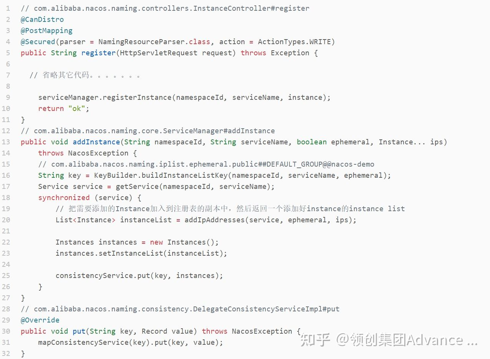
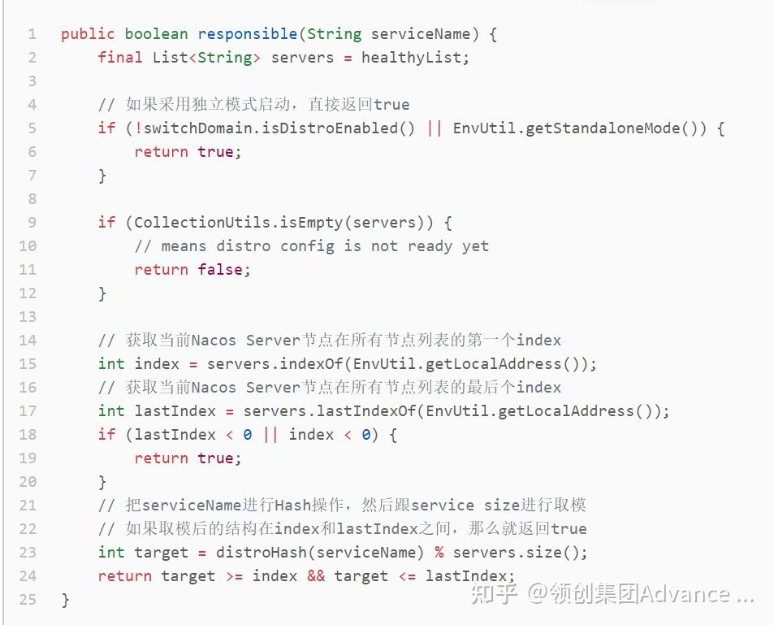

# Nacos注册下线源码解读

## **1. 引言**

由于Spring Cloud Netflix 2018年12月12日进入维护模式（Maintenance Mode），大家把关注点转移到Spring Cloud Alibaba，Alibaba也加大了Spring Cloud生态的投入，所以目前Spring Cloud Alibaba在国内非常火爆，今天分享一下Spring Cloud Alibaba中的非常重要的一个组件Nacos(版本为:1.4.2)注册中心模块的部分核心功能原理。

**本文分享内容如下：**

- Nacos 核心概念
- Nacos Server 注册表结构
- Nacos Client 与 Spring Cloud 集成
- 如何支持高并发注册（异步任务与内存队列设计原理及源码剖析）
- 注册表如何防止多节点读写并发冲突（Copy On Write思想的实现）
- 心跳机制与服务健康检查设计原理及源码剖析
- 心跳检测在集群架构下的设计原理及源码剖析
- 服务变动事件发布机制及源码剖析
- 服务下线机制及源码剖析

注册中心部分核心功能源码图

**点击原文链接，查看原图（或关注领创集团公众号，文章更丰富）**

[04.Nacos注册中心部分核心功能源码图 | ProcessOn免费在线作图,在线流程图,在线思维导图 |](https://link.zhihu.com/?target=https%3A//www.processon.com/view/link/6140b19ae401fd1a0e53e147)

## **2. Nacos 核心概念**

- Namespace：用于进行租户粒度的配置隔离。不同的命名空间下，可以存在相同的 Group 或 Data ID 的配置。Namespace 的常用场景之一是不同环境的配置的区分隔离，例如开发测试环境和生产环境的资源（如配置、服务）隔离等。如果不配置默认为：public
- Group：服务分组，不同的服务可以归类到同一分组。
- Service：服务提供的标识，通过该标识可以唯一确定其指代的服务。默认获取的${spring.application.name}作为服务名。
- Cluster：同一个服务下的所有服务实例组成一个默认集群, 集群可以被进一步按需求划分，划分的单位可以是虚拟集群。
- Instance：提供一个或多个服务的具有可访问网络地址（IP:Port）的进程。

**上述概念图例：**

**用法示例：**

上图为我之前工作的实际场景的用法示例，每个公司都有自己的一套划分规则，所以需要根据自己公司实际业务情况来灵活的运用Nacos的注册表的设计。

## **3. Nacos Server 的注册表结构**

说到服务注册，那么首先需要关注的是注册表结构是怎么设计的，Nacos的注册表结构设计方式是一个双重Map结构，定义如下：

源码中注释其实已经解释这个双重Map数据结构的存储结构，最外层的Map的Key为Namespace，Value为一个Map，内层的Map的Key为group::serviceName，Value为Service对象。Service对象中也有一个Map的数据结构，如下：

Map的Key值为Cluster的名字，Value为Cluster对象，Cluster对象中有两个Set的数据结构，用来存储Instance，这个Instance才是真正的客户端注册过来的实例信息。

这里有两个Set，一个是用来存储临时实例，一个是用来存储持久化实例，有个关键点，什么情况会存储在临时实例，什么情况下会存储持久化实例，这个是由客户端的配置来决定的，默认情况下客户端配置ephemeral=true，如果你想把实例用持久化的方式来存储，可以设置ephemeral=false，这样在客户端发起注册的时候会把这个参数带到Nacos Server，Nacos Server就会按照持久化的方式来存储。

**注意：Nacos目前持久化存储的方式采用的是本地文件存储的方式。**

## **4. Nacos Client 和 Spring Cloud 集成**

### **客户端服务注册**

Nacos在1.x版本的通信方式采用的HTTP协议，2.0版本以后会添加gRPC协议，本文写作采用的版本为1.4.2，所以本文还是基于HTTP协议来分析，服务注册的接口地址为：/nacos/v1/ns/instance，此接口的源码全路径为：**com.alibaba.nacos.naming.controllers.InstanceController#register。**

Nacos提供了多种客户端的集成方式，本文主要剖析 Spring Cloud 的集成方式的源码，如果读者感兴趣其它的集成方式，可以去Nacos官网查看其它的集成方式。
4.1 添加依赖

4.2 配置Nacos server地址

熟悉Spring Boot的同学都知道这个文件，这里是配置AutoConfiguration的地方，在这里只需要关注其中的：NacosServiceRegistryAutoConfiguration，这个类中分别注入了NacosServiceRegistry、NacosRegistration、NacosAutoServiceRegistration三个类，Nacos的客户端主要是靠这几个类来实现服务注册和发现的，首先我们来看一下NacosAutoServiceRegistration的类继承关系，如下：

细心的同学可能已经发现NacosAutoServiceRegistration的继承的AbstractAutoServiceRegistration类实现了ApplicationListener接口，那么必定在AbstractAutoServiceRegistration类中监听的某个Event，果然在AbstractAutoServiceRegistration类中发现了如下代码：

上述源码中发现最终会调用一个register方法，这个方法就是真正向 Nacos Server 注册了当前实例。

从源码中可以看出最终调用了reqApi方法，向 Nacos Server /nacos/v1/ns/instance 接口发送了一个POST请求，把当前实例注册进去，到这里整个客户端的核心注册流程就分析完了。

**客户端服务发现**
服务发现的接口地址为：/nacos/v1/ns/instance/list，此接口的源码全路径为：com.alibaba.nacos.naming.controllers.InstanceController#list

在spring.factories中配置了一个NacosDiscoveryClientConfiguration类，此类向Spring中注入了一个NacosWatch类，这类的类图如下：

从上图可以看出，此类实现了Lifecycle接口，这个接口是Spring设计的生命周期接口，如果实现这个接口，那么就会在Spring加载完所有的Bean并初始化之后就会回调start()方法，在这个方法中完成了服务的拉取并更新到本地缓存，代码如下：

从源码可以看出最后也是调用了serverProxy.queryList方法，这个方法也是发起了一个HTTP的请求，调用了Nacos Server的/nacos/v1/ns/instance/list接口，进行服务拉取。
到这里已经从源码级别分析了Spring Cloud的集成了Nacos客户端关于服务拉取的代码，其实代码还是比较简单的，总结来说就是构造出list接口需要的参数，然后发起HTTP请求，进行服务拉取。
从源码中注意留意一个scheduleUpdateIfAbsent方法的调用，这里提交了一个UpdateTask任务，UpdateTask是一个实现了Runnable接口的类，主要代码如下：

从源码中可以看出，这段代码相当于定时10s（这个时间是从/nacos/v1/ns/instance/list接口里回传回来的）拉取一次服务，这里有个Nacos Server比较巧妙的设计需要提一下，在updateServiceNow方法中可以看到调用服务端/nacos/v1/ns/instance/list接口的时候传入了一个Udp的端口，这个端口的作用是如果Nacos Server感知到Service的变化，就会把变化信息通知给订阅了这个Service信息的客户端。

##  **5. 如何支持高并发注册（异步任务与内存队列设计原理及源码剖析）**

之前主要分析了Spring Cloud集成Nacos client的服务注册和服务拉取的逻辑，现在接着分析一下Nacos Server注册中心的核心功能逻辑及源码，首先来分析Nacos怎么能支持高并发的Intance的注册的。
先直接给答案：采用内存队列的方式进行服务注册
也就是说客户端在把自己的信息注册到Nacos Server的时候，并不是同步把信息写入到注册表中的，而且采取了先写入内存队列中，然后用独立的线程池来消费队列进行注册的。
源码如下：

从源码可看出最终会执行listener.onChange()这个方法，并把Instances传入，然后进行真正的注册逻辑，这里的设计就是为了提高Nacos Server的并发注册量，如果你非常关注Nacos性能相关问题，可以查看官方的压测报告（[https://nacos.io/zh-cn/docs/nacos-naming-benchmark.html](https://link.zhihu.com/?target=https%3A//nacos.io/zh-cn/docs/nacos-naming-benchmark.html)），或者自己去做一下压测。
这里再提一下，在进行队列消费的时候其实最终也是采用的JDK的线程池，追踪到实例化线程线程池的代码为：

## **6. 注册表如何防止多节点读写并发冲突（Copy On Write思想的实现）**

Nacos Server在把Instance写入注册表的是时候怎么去解决读写并发冲突的呢？
答案就是：Copy on write 思想
源码如下：

这里源码有点多，也比较难懂，源码里我也写了相关的注解，其实大体的意思就是在updateIps方法中传入了一个List<Instance> ips，然后用ips跟之前注册表中的Instances进行比较，分别得出需要添加、更新、和删除的实例，然后做一些相关的操作，比如Instance的一些属性设置、启动心跳、删除心跳等等，最后把处理后的List<Instance> ips，直接替换内存注册表，这样如果同时有读的请求，其实读取是之前的老注册表的信息，这样就很好的控制了并发读写冲突问题，这个思想就是Copy On Write思想，在JDK源码中并发包里也有一些相关的实现，比如：CopyOnWriteArrayList

## **7.心跳机制与服务健康检查设计原理及源码剖析**

客户端会调用/nacos/v1/ns/instance/beat接口进行心跳，主要逻辑有：
7.1如果在Nacos Server没有找到相对应的Instance，那么就构造一个Instance，源码如下：

7.2 如果在Nacos Server中有当前实例，那么就更新一下lastBeat、healthy等，源码如下：

服务端也会启动线程去检测客户端心跳信息，来判断客户端是否存活，Nacos是怎么启动心跳检测的，怎么心跳检测的？
请看源码：

默认的心跳超时时间为15s，如果发现Instance中的lastBeat的时间与当前时间对比，小于当前时间15s以上那么就判断Instance为不健康的状态，首先会设置Instance中的healthy为false，然后发布一个服务变更事件，再发布一个心跳超时事件。

##  **8. 心跳检测在集群架构下的设计原理及源码剖析**

刚才分析一下心跳检测的代码，这里不得的不多说一句这里的一个细节设计，如果Nacos是集群的状态，并不是集群中的每节点机器都会检测所有的Instance的心跳，而是用算法来计算每个节点机器需要检测那些Instances，我们来看看源码中是如何计算的：

大致的算法就是通过serviceName计算出一个Hash值然后跟Nacos集群中所有机器数量进行取模，得到的结果如果跟当前Nacos Server节点在集群List的index和lastIndex之间，那么就采用当前的Nacos Server节点进行心跳检测。

##  **9.服务变动事件发布机制及源码剖析**

在上边有讲到一个Nacos Server端的接口/nacos/v1/ns/instance/list，这个接口是用来根据serviceName来拉取Instace的接口，并且客户端会定时的去拉取，如果Service中的Instance发生了变化，那么在调用这个接口的时候就能感知到，但是这个感知会有延迟，默认的拉取频率为10s，Nacos在一些细节的上也做了一些良好的设计，Nacos Client并不是完全依赖这个定时任务来感知Service的变化，为了尽量的去弥补这个延迟问题，采用一个UDP的变更通知设计，这客户端调用/nacos/v1/ns/instance/list接口的时候会传入一个UDP的port，在接口中会把Service订阅的其他Service加入到一个com.alibaba.nacos.naming.push.PushService#clientMap中去，如果Service中的Instance发生了变化，取出订阅了此实例的客户端列表，并通过UDP的方式进行通知。
源码如下：

## **10. 服务下线机制及源码剖析**

服务下线的接口为 /nacos/v1/ns/instance，跟注册是一个接口，但是HTTP的谓词为：DELETE，调用这个接口的逻辑大致为：先从注册表中根据namespaceId和serviceName获取到相应的Instances的副本，然后从副本中把需要下线的instance删除，再把这个处理后的Instances副本去替换注册表中相应的信息，源码中前半段逻辑，就是得出一个删除完实例的Instances副本，后边的逻辑其实跟注册逻辑一致，源码如下：

到这基本的Nacos的注册中心的部分核心逻辑已经分析完毕，本文仅分析了部分核心主线逻辑，并不是全部逻辑，如果读者感兴趣可以自己去仔细阅读源码，本文只起一个抛砖引玉的作用，如果理解了本文，再去阅读源码应该会相对容易。

## Nacos 集群的工作原理

### Nacos 集群中 Leader 节点是如何产生的？

Nacos 集群采用 Raft 算法实现。它是一种比较简单的选举算法，用于选举出 Nacos 集群中最重要的 Leader（领导）节点。

在 Nacos 集群中，每个节点都拥有以下三种角色中的一种。

1. Leader：领导者，集群中最重要的角色，用于向其他节点下达指令。
2. Candidate：参选者，参与竞选 Leader 的节点。
3. Follower：跟随者，用于接收来自 Leader 或者 Candidate 的请求并进行处理。

在集群中选举出 Leader 是最重要的工作，产生选举的时机有三个：

1. 在 Nacos 节点启动后，还没有产生Leader时选举；
2. 集群成员总量变更时重新选举；
3. 当 Leader 停止服务后重新选举；

**在开始介绍选举过程前，先理解任期（Term）的含义:**

Raft 算法将时间划分成为任意不同长度的任期（Term）。任期用连续的数字进行表示。每一个任期的开始都是一次选举（Election），一个或多个候选人会试图成为 Leader。

为了便于理解，我们使用文字+表格的形式说明选举过程。

1. 当最开始的时候，所有 Nacos 节点都没有启动。角色默认为 Follower（跟随者），任期都是 0。
2. 当第一个节点（192.168.163.131）启动后，节点角色会变为 Candidate（参选者），131 节点在每一个任期开始时便会尝试向其他节点发出投票请求，征求自己能否成为 Leader（领导者）节点。只有算上自己获得超过半数的选票，这个 Candidate 才能转正为 Leader。在当前案例，因为 131 发起选举投票，但 132/133 两个节点不在线，尽管 131 会投自己一票，但在总 3 票中未过半数，因此无法成为 Leader。因为第一次选举没有产生 Leader，过段时间在下一个任期开始时，131 任期自增加 1，同时会再次向其他节点发起投票请求争取其他节点同意，直到同意票过半。
3. 在 Raft 算法中，成为 Leader 的必要条件是某个 Candidate 获得过半选票，如果 132 节点上线，遇到 131 再次发起投票。132 投票给 131 节点，131 获得两票超过半数就会成为 Leader，132 节点自动成为 Follower（跟随者）。之后 133 节点上线，因为集群中已有 Leader，因此自动成为 Follower。
4. 当 Leader 节点宕机或停止服务，会在剩余 2 个 Nacos 节点中产生新的 Leader。如下所示133获得两票成为 Leader，132 成为 Follower，131已经下线但角色暂时仍为 Leader。

之后 131 恢复上线，但此时 Nacos 集群已有 Leader 存在，131 自动变为 Follower，且任期归0。

对于 Nacos 集群来说，只要 UP 状态节点不少于"1+N/2"，集群就能正常运行。但少于“1+N/2”，集群仍然可以提供基本服务，但已无法保证 Nacos 各节点数据一致性。

以上就是 Nacos 基于 Raft 算法的 Leader 选举过程，确定 Leader 是维持 Nacos 集群数据一致的最重要前提，下面咱们来讲解在微服务注册时 Nacos 集群节点信息同步的过程。

### Nacos 节点间的数据同步过程

Nacos 节点间的数据同步过程

在 Raft 算法中，只有 Leader 才拥有数据处理与信息分发的权利。因此当微服务启动时，假如注册中心指定为 Follower 节点，则步骤如下：

第一步，Follower 会自动将注册心跳包转给 Leader 节点；

第二步，Leader 节点完成实质的注册登记工作；

第三步，完成注册后向其他 Follower 节点发起“同步注册日志”的指令；

第四步，所有可用的 Follower 在收到指令后进行“ack应答”，通知 Leader 消息已收到；

第五步，当 Leader 接收过半数 Follower 节点的 “ack 应答”后，返回给微服务“注册成功”的响应信息。

此外，对于其他无效的 Follower 节点，Leader 仍会不断重新发送，直到所有 Follower 的状态与 Leader 保持同步。