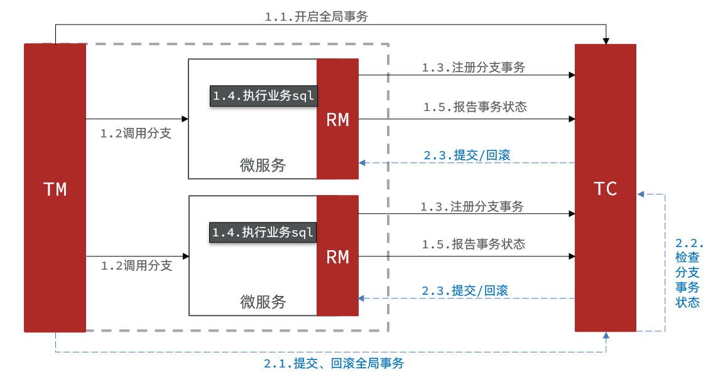
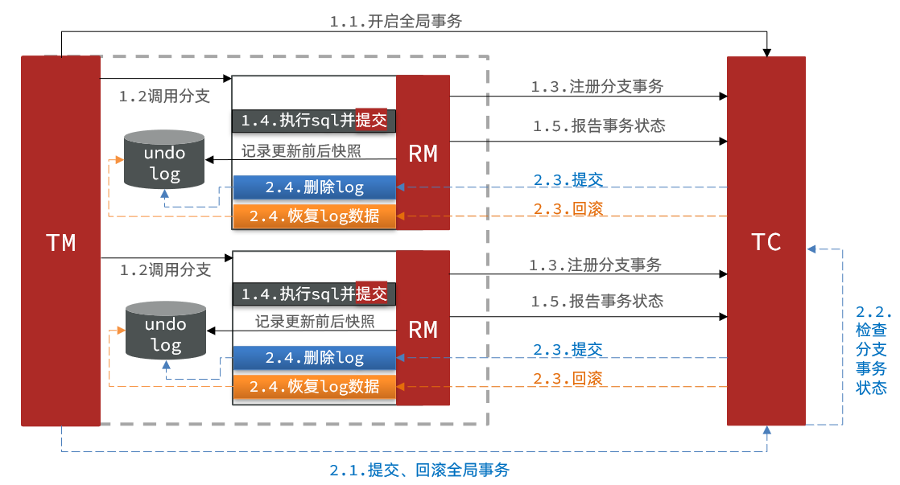
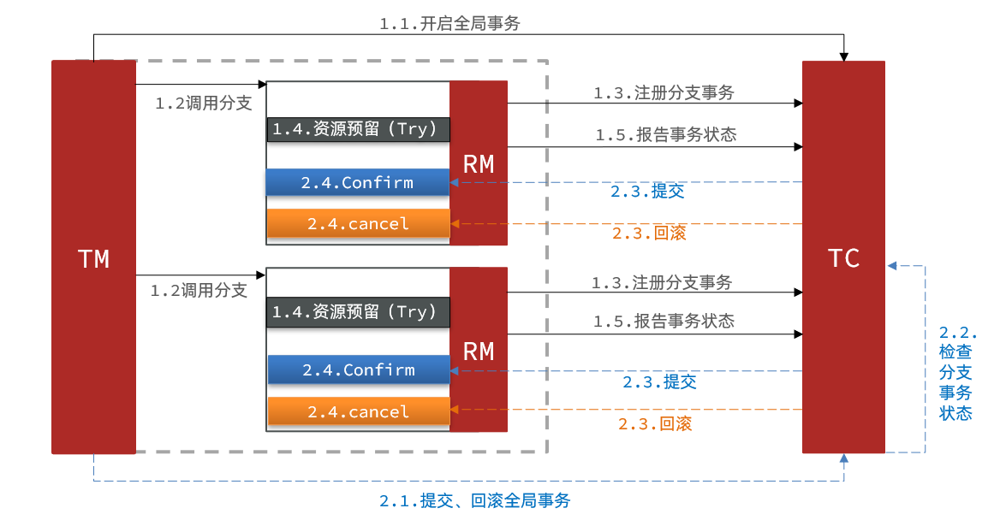
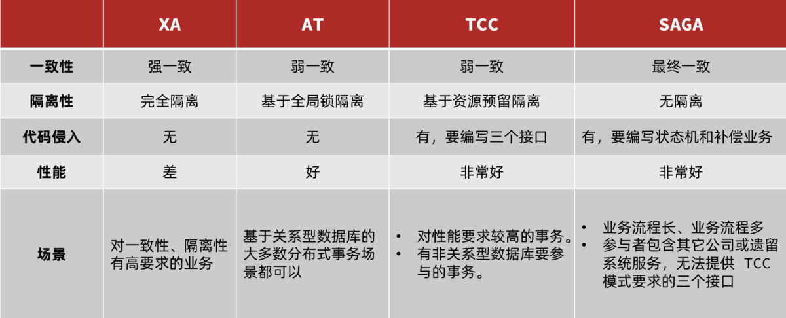

# Seata四种分布式事务解决方案：

1. XA模式：强一致性分阶段事务模式，牺牲了一定的可用性，无业务侵入
2. TCC模式：最终一致的分阶段事务模式，有业务侵入
3. AT模式：最终一致的分阶段事务模式，无业务侵入，也是Seata的默认模式
4. SAGA模式：长事务模式，有业务侵入

### XA模式原理



seata的XA模式做了一些调整，但大体相似：

- RM一阶段的工作：
  1.注册分支事务到TC
  2.执行分支业务sql但不提交
  3.报告执行状态到TC
- TC二阶段的工作：
  - TC检测各分支事务执行状态
    1.如果都成功，通知所有RM提交事务
    2.如果有失败，通知所有RM回滚事务
- RM二阶段的工作：
  - 接收TC指令，提交或回滚事务

**XA模式的优点是什么？**
1.事务的强一致性，满足ACID原则。
2.常用数据库都支持，实现简单，并且没有代码侵入
**XA模式的缺点是什么？**
1.因为一阶段需要锁定数据库资源，等待二阶段结束才释放，性能较差
2.依赖关系型数据库实现事务

### 实现XA模式

1.修改application.yml文件（每个参与事务的微服务），开启XA模式：

```yml
seata:
  data-source-proxy-mode: XA
```

2.给发起全局事务的入口方法添加@GlobalTransactional注解

```java
  @Override
  @GlobalTransactional
  public Long create(Order order) {
    // 创建订单
    orderMapper.insert(order);
    try {
      // 扣用户余额
      accountClient.deduct(order.getUserId(), order.getMoney());
      // 扣库存
      storageClient.deduct(order.getCommodityCode(), order.getCount());

    } catch (FeignException e) {
      log.error("下单失败，原因:{}", e.contentUTF8(), e);
      throw new RuntimeException(e.contentUTF8(), e);
    }
    return order.getId();
  }
```

### AT模式原理

AT模式同样是分阶段提交的事务模型，不过缺弥补了XA模型中资源锁定周期过长的缺陷



- 阶段一RM的工作：
  1.注册分支事务
  2.记录undo-log（数据快照）
  3.执行业务sql并提交
  4.报告事务状态
- 阶段二提交时RM的工作：
  1.删除undo-log即可
- 阶段二回滚时RM的工作：
  1.根据undo-log恢复数据到更新前

**简述AT模式与XA模式最大的区别是什么？**
1.XA模式一阶段不提交事务，锁定资源；AT模式一阶段直接提交，不锁定资源。
2.XA模式依赖数据库机制实现回滚；AT模式利用数据快照实现数据回滚。
3.XA模式强一致；AT模式最终一致

**AT模式的优点：**
1.一阶段完成直接提交事务，释放数据库资源，性能比较好
2.利用全局锁实现读写隔离
3.没有代码侵入，框架自动完成回滚和提交
**AT模式的缺点：**
1.两阶段之间属于软状态，属于最终一致
2.框架的快照功能会影响性能，但比XA模式要好很多

### 实现AT模式

1.创建lock_table(全局锁)表和undo_log(快照)表，lock_table是给TC服务用的创建在TC数据库表中

```sql
DROP TABLE IF EXISTS `lock_table`;
CREATE TABLE `lock_table`  (
  `row_key` varchar(128) CHARACTER SET utf8 COLLATE utf8_general_ci NOT NULL,
  `xid` varchar(96) CHARACTER SET utf8 COLLATE utf8_general_ci NULL DEFAULT NULL,
  `transaction_id` bigint(20) NULL DEFAULT NULL,
  `branch_id` bigint(20) NOT NULL,
  `resource_id` varchar(256) CHARACTER SET utf8 COLLATE utf8_general_ci NULL DEFAULT NULL,
  `table_name` varchar(32) CHARACTER SET utf8 COLLATE utf8_general_ci NULL DEFAULT NULL,
  `pk` varchar(36) CHARACTER SET utf8 COLLATE utf8_general_ci NULL DEFAULT NULL,
  `gmt_create` datetime NULL DEFAULT NULL,
  `gmt_modified` datetime NULL DEFAULT NULL,
  PRIMARY KEY (`row_key`) USING BTREE,
  INDEX `idx_branch_id`(`branch_id`) USING BTREE
) ENGINE = InnoDB CHARACTER SET = utf8 COLLATE = utf8_general_ci ROW_FORMAT = Compact;
```

2.undo_log是给RM微服务数据库表用的，在创建的RM数据库中执行

```sql
DROP TABLE IF EXISTS `undo_log`;
CREATE TABLE `undo_log`  (
  `branch_id` bigint(20) NOT NULL COMMENT 'branch transaction id',
  `xid` varchar(100) CHARACTER SET utf8 COLLATE utf8_general_ci NOT NULL COMMENT 'global transaction id',
  `context` varchar(128) CHARACTER SET utf8 COLLATE utf8_general_ci NOT NULL COMMENT 'undo_log context,such as serialization',
  `rollback_info` longblob NOT NULL COMMENT 'rollback info',
  `log_status` int(11) NOT NULL COMMENT '0:normal status,1:defense status',
  `log_created` datetime(6) NOT NULL COMMENT 'create datetime',
  `log_modified` datetime(6) NOT NULL COMMENT 'modify datetime',
  UNIQUE INDEX `ux_undo_log`(`xid`, `branch_id`) USING BTREE
) ENGINE = InnoDB CHARACTER SET = utf8 COLLATE = utf8_general_ci COMMENT = 'AT transaction mode undo table' ROW_FORMAT = Compact;
```

3.修改application.yml文件，将事务模式修改为AT模式即可：

```yml
seata:
  data-source-proxy-mode: AT
```

4.给发起全局事务的入口方法添加@GlobalTransactional注解

### TCC模式原理

TCC模式与AT模式非常相似，每阶段都是独立事务，不同的是TCC通过人工编码来实现数据恢复。需要实现三个方法：
1.Try：资源的检测和预留；
2.Confirm：完成资源操作业务；要求 Try 成功 Confirm 一定要能成功。
3.Cancel：预留资源释放，可以理解为try的反向操作。



**TCC模式的每个阶段是做什么的？**
1.Try：资源检查和预留
2.Confirm：业务执行和提交
3.Cancel：预留资源的释放
**TCC的优点是什么？**
1.一阶段完成直接提交事务，释放数据库资源，性能好
2.相比AT模型，无需生成快照，无需使用全局锁，性能最强
2.不依赖数据库事务，而是依赖补偿操作，可以用于非事务型数据库
**TCC的缺点是什么？**
1.有代码侵入，需要人为编写try、Confirm和Cancel接口，太麻烦
2.软状态，事务是最终一致
3.需要考虑Confirm和Cancel的失败情况，做好幂等处理

### 实现TCC模式

- 修改account-service，编写try、confirm、cancel逻辑
- try业务：添加冻结金额，扣减可用金额
- confirm业务：删除冻结金额
- cancel业务：删除冻结金额，恢复可用金额
- 保证confirm、cancel接口的幂等性
- 允许空回滚
- 拒绝业务悬挂

为了实现空回滚、防止业务悬挂，以及幂等性要求。我们必须在数据库记录冻结金额的同时，记录当前事务id和执行状态，为此我们设计了一张表：

```sql
DROP TABLE IF EXISTS `account_freeze_tbl`;
CREATE TABLE `account_freeze_tbl`  (
  `xid` varchar(128) CHARACTER SET utf8 COLLATE utf8_general_ci NOT NULL,
  `user_id` varchar(255) CHARACTER SET utf8 COLLATE utf8_general_ci NULL DEFAULT NULL,
  `freeze_money` int(11) UNSIGNED NULL DEFAULT 0,
  `state` int(1) NULL DEFAULT NULL COMMENT '事务状态，0:try，1:confirm，2:cancel',
  PRIMARY KEY (`xid`) USING BTREE
) ENGINE = InnoDB CHARACTER SET = utf8 COLLATE = utf8_general_ci ROW_FORMAT = COMPACT;
```

1.实体类

```java
package cn.itcast.account.entity;

import com.baomidou.mybatisplus.annotation.IdType;
import com.baomidou.mybatisplus.annotation.TableId;
import com.baomidou.mybatisplus.annotation.TableName;
import lombok.Data;

/**
 * @author ylf
 */
@Data
@TableName("account_freeze_tbl")
public class AccountFreeze {
    @TableId(type = IdType.INPUT)
    private String xid;
    private String userId;
    private Integer freezeMoney;
    private Integer state;

    public static abstract class State {
        public final static int TRY = 0;
        public final static int CONFIRM = 1;
        public final static int CANCEL = 2;
    }
}
```

2.Mapper

```java
package cn.itcast.account.mapper;

import cn.itcast.account.entity.AccountFreeze;
import com.baomidou.mybatisplus.core.mapper.BaseMapper;
import org.apache.ibatis.annotations.Mapper;

/**
 * @author ylf
 */
@Mapper
public interface AccountFreezeMapper extends BaseMapper<AccountFreeze> {}
```

3.创建service表，编写try、confirm、cancel逻辑、

```java
package cn.itcast.account.service;

import io.seata.rm.tcc.api.BusinessActionContext;
import io.seata.rm.tcc.api.BusinessActionContextParameter;
import io.seata.rm.tcc.api.LocalTCC;
import io.seata.rm.tcc.api.TwoPhaseBusinessAction;

/**
 * @author ylf
 * @version 1.0
 */
@LocalTCC
public interface AccountTccService {
  @TwoPhaseBusinessAction(name = "deduct", commitMethod = "confirm", rollbackMethod = "cancel")
  void deduct(
      @BusinessActionContextParameter(paramName = "userId") String userId,
      @BusinessActionContextParameter(paramName = "money") int money);

  boolean confirm(BusinessActionContext ctx);

  boolean cancel(BusinessActionContext ctx);
}
```

4.实现

```java
package cn.itcast.account.service.impl;

import cn.itcast.account.entity.AccountFreeze;
import cn.itcast.account.mapper.AccountFreezeMapper;
import cn.itcast.account.mapper.AccountMapper;
import cn.itcast.account.service.AccountTccService;
import io.seata.core.context.RootContext;
import io.seata.rm.tcc.api.BusinessActionContext;
import org.springframework.beans.factory.annotation.Autowired;
import org.springframework.stereotype.Service;
import org.springframework.transaction.annotation.Transactional;

/**
 * @author ylf
 * @version 1.0
 */
@Service
public class AccountTccServiceImpl implements AccountTccService {
  @Autowired AccountMapper accountMapper;
  @Autowired AccountFreezeMapper freezeMapper;

  @Override
  @Transactional
  public void deduct(String userId, int money) {
    // 0.获取事务id
    final String xid = RootContext.getXID();
    // 1.判断freeze中是否有冻结业务，如果有，一定是Cancel，我要拒绝业务
    final AccountFreeze oldFreeze = freezeMapper.selectById(xid);
    if (oldFreeze != null) {
      return;
    }
    // 2.扣减可用金额
    accountMapper.deduct(userId, money);
    // 3.记录冻结金额，事务状态
    AccountFreeze accountFreeze = new AccountFreeze();
    accountFreeze.setUserId(userId);
    accountFreeze.setFreezeMoney(money);
    accountFreeze.setState(AccountFreeze.State.TRY);
    accountFreeze.setXid(xid);
    freezeMapper.insert(accountFreeze);
  }

  @Override
  public boolean confirm(BusinessActionContext ctx) {
    // 1.获取事务id
    final String xid = ctx.getXid();
    // 2.根据事务id删除记录
    final int count = freezeMapper.deleteById(xid);
    return count == 1;
  }

  @Override
  public boolean cancel(BusinessActionContext ctx) {
    // 0.查询冻结记录
    AccountFreeze accountFreeze = freezeMapper.selectById(ctx.getXid());
    final String userId = ctx.getActionContext("userId").toString();
    // 1.空回滚判断，判断accountFreeze是否为null，如果为null，就需要空回滚
    if (accountFreeze == null) {
      accountFreeze = new AccountFreeze();
      accountFreeze.setUserId(userId);
      accountFreeze.setFreezeMoney(0);
      accountFreeze.setState(AccountFreeze.State.CANCEL);
      accountFreeze.setXid(ctx.getXid());
      freezeMapper.insert(accountFreeze);
    }
    // 2.判断幂等
    if (accountFreeze.getState() == AccountFreeze.State.CANCEL) {
      return true;
    }
    // 3.恢复可用金额
    accountMapper.refund(accountFreeze.getUserId(), accountFreeze.getFreezeMoney());
    // 4.将冻结金额清理，改变状态为cancel
    accountFreeze.setFreezeMoney(0);
    accountFreeze.setState(AccountFreeze.State.CANCEL);
    final int count = freezeMapper.updateById(accountFreeze);
    return count == 1;
  }
}
```

5.测试

```kotlin
package cn.itcast.account.web;

import cn.itcast.account.service.AccountTccService;
import org.springframework.beans.factory.annotation.Autowired;
import org.springframework.http.ResponseEntity;
import org.springframework.web.bind.annotation.PathVariable;
import org.springframework.web.bind.annotation.PutMapping;
import org.springframework.web.bind.annotation.RequestMapping;
import org.springframework.web.bind.annotation.RestController;

/**
 * @author ylf
 */
@RestController
@RequestMapping("account")
public class AccountController {

  @Autowired private AccountTccService accountService;

  @PutMapping("/{userId}/{money}")
  public ResponseEntity<Void> deduct(
      @PathVariable("userId") String userId, @PathVariable("money") Integer money) {
    accountService.deduct(userId, money);
    return ResponseEntity.noContent().build();
  }
}
```

### Saga模式

Saga模式是SEATA提供的长事务解决方案。也分为两个阶段：
1.一阶段：直接提交本地事务
2.二阶段：成功则什么都不做；失败则通过编写补偿业务来回滚
Saga模式优点：
1.事务参与者可以基于事件驱动实现异步调用，吞吐高
2.一阶段直接提交事务，无锁，性能好
3.不用编写TCC中的三个阶段，实现简单
缺点：
1.软状态持续时间不确定，时效性差
2.没有锁，没有事务隔离，会有脏写

