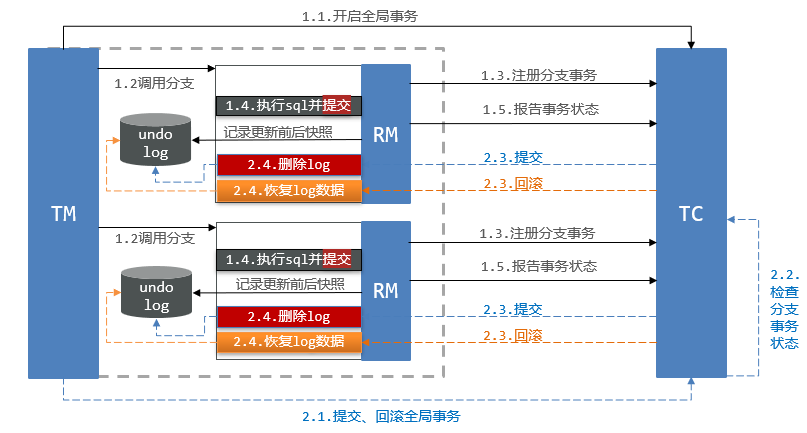
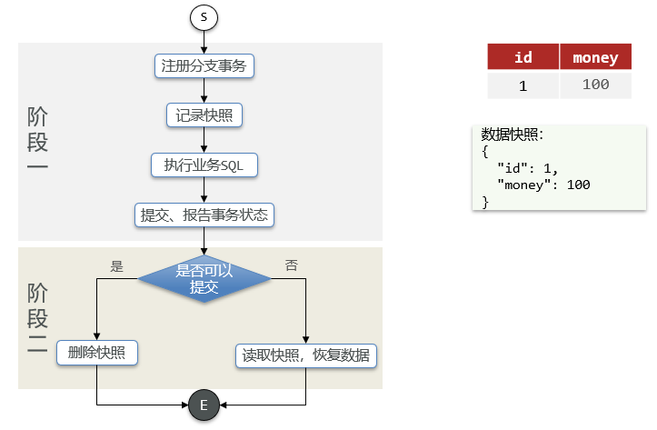
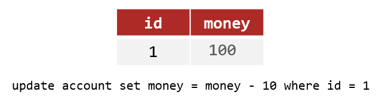
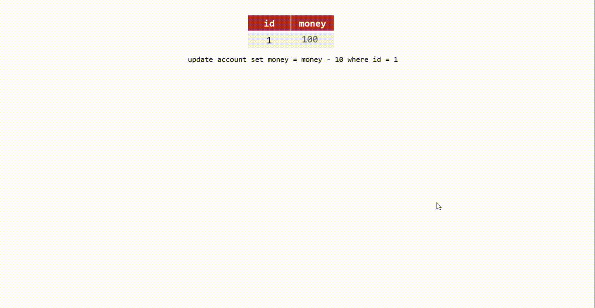
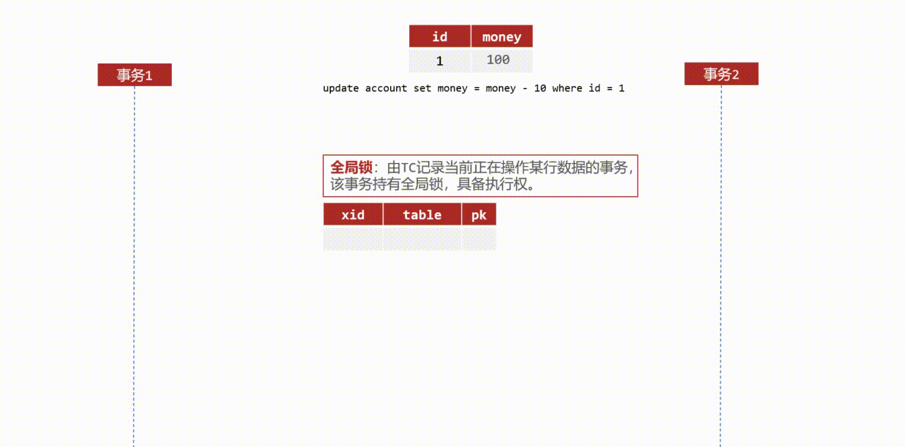
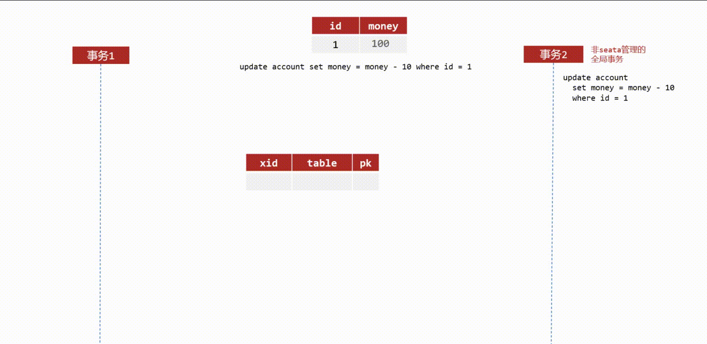

# 分布式事务AT模式的脏写问题

### [#](https://cloud.benym.cn/#分布式事务at模式的脏写问题) [分布式事务](https://cloud.tencent.com/product/dtf?from=10680)AT模式的脏写问题

#### [#](https://cloud.benym.cn/#at模式原理) AT模式原理

首先回顾一下AT模式的原理 AT模式同样是分阶段提交的事务模型，不过缺弥补了XA模型中资源锁定周期过长的缺陷。

AT模式在执行完sql之后会**直接提交事务，而不是进行等待**，在执行的同时RM拦截本次执行，记录更新前后的快照到[数据库](https://cloud.tencent.com/solution/database?from=10680)的`undo_log`中。与XA的不同之处在于 阶段一RM的工作：

- 注册分支事务
- **记录undo-log(数据快照)**
- 执行业务sql并**提交**
- 报告事务状态

阶段二提交时RM的工作：

- 删除undo-log即可

阶段二回滚时RM的工作：

- 根据undo-log回复数据到更新前

具体案例：例如，一个分支业务的SQL是这样的：`update tb_account set money = money - 10 where id = 1`

如果这条sql执行成功，那么`money`字段自然是90，如果执行失败，则根据数据快照恢复数据。

#### [#](https://cloud.benym.cn/#at模式的脏写问题) AT模式的脏写问题

如前文所提，AT模式的性能好是因为执行完SQL之后会直接提交事务，但由于这个原因AT模式在并发情况下可能会出现安全性问题。接下来通过一个例子详细解释 比如当前有一张表，内容为`id=1`，`money=100`，业务是修改当前余额减10

此时有一个线程1开始执行业务，按照左图中事务1的1.1-1.3顺序执行，同一时刻线程2也开始执行业务，但由于事务1中持有DB锁，事务2必须等待，直到事务1释放锁。当事务1执行完毕之后，此时的`money`被修改为90，事务2按照右图1.1-1.3步骤执行。假设此时，事务1发生异常，按照AT模式的要求需要按照数据快照进行回滚，而此时的事务的快照为`money=100`，执行左图的2.1步骤，将会使事务1和事务2的操作什么都没有发生，等于事务2付款成功，但没有真正的扣除余额。这就出现了问题。

发生上面这种问题的根本原因就是因为，事务之间没有做到隔离，如果说能做到隔离性，那么就不会存在这种问题。

#### [#](https://cloud.benym.cn/#at模式的写隔离机制) AT模式的写隔离机制

为了解决这个问题AT模式引入了全局锁 [card title="全局锁" color="info"]全局锁即是由TC记录当前正在操作某行数据的事务，该事务持有全局锁，具备执行权。[/card] 全局锁是由数据表实现，包含事务的`xid`，操作的表名`table`，操作行的主键`pk`

##### [#](https://cloud.benym.cn/#两个事务都被seata管理的情况) 两个事务都被Seata管理的情况

分两种情况讨论： 第一种情况——两个事务都被Seata管理 下图展示了，引入全局锁之后事务的执行过程

还是和之前一样的过程，这次当事务1执行完毕业务sql之后，会获取全局锁，提交完事务之后，将DB锁释放掉。事务2进行业务sql执行，尝试获取全局锁，但此时全局锁由事务1持有。假设此时，事务1发生了异常需要回滚，事务1会尝试获取DB锁，但这时候的DB锁被事务2持有，于是就出现了，事务1等待事务2释放DB锁，事务2等待事务1释放全局锁，形成了死锁关系。在AT模式下，尝试获取全局锁会默认重试30次，每10ms进行一次重试，当死锁发生了，事务2长时间获取不到全局锁，任务就会超时，事务2会进行回滚并释放DB锁。也就是说事务2的操作失败了，此时事务1可以重新拿到DB锁进行快照恢复，money重新回到了100，恢复快照之后，事务1释放全局锁即可。**这一次事务2并没有执行成功，保证了数据的一致性**。 [card title="与XA模式的区别" color="danger"]到这里看起来和XA模式就很像了，在高度竞争的情况下，同样需要锁，但区别点在于，XA模式下执行完毕SQL后并不提交事务，持有的是数据库锁，而在AT模式下，全局锁是由TC实现。数据库锁不释放，那么任何其他操作都会被互斥等待。TC是由Seata管理，假设此时有另外的一个事务，不被Seata管理，仅仅是操作这个表中的其他字段，这时由于AT模式执行完SQL就会提交事务释放数据库锁，此时并不会产生互斥等待，这是XA模式所做不到的。[/card]

##### [#](https://cloud.benym.cn/#仅有一个事务被seata管理-另一个非seata管理) 仅有一个事务被Seata管理，另一个非Seata管理

第二种情况——一个事务被Seata管理，另一个非Seata管理 上面这个假设是非Seata管理的事务(以下称为事务2)操作的字段和事务1不同的情况，但如果当事务2操作的和事务1相同时，那不又出现脏写问题了吗，虽然这个概率很低，但依然是有可能发生的。

如图所示，事务1依旧按照1.1-1.3执行，在释放了DB锁之后，事务2开始执行。事务2执行完SQL之后，由于其并非由Seata管理，所以1.2之后不需要获取全局锁，直接提交事务释放DB锁。我们依旧假设此时事务1发生异常需要回滚，按照数据快照来看，事务1记录的money是100，而当事务2执行完毕之后money已经变为了80，此时如果直接回滚，那么又发生了脏写问题。 为了防止这个问题，Seata在保存快照时实际上会记录2份快照，一份是修改之前的快照，一份是修改之后的快照，在恢复快照数据时，会将更新后的快照值90和当前数据库的实际值80进行比对(类似CAS过程)，如果数值不匹配则说明在此期间有另外的事务修改了数据，此时直接释放全局锁，事务1记录异常，发送告警信息让人工介入。如果一致则恢复数据，释放全局锁即可。