# Sentinel

## Sentinel的流程原理

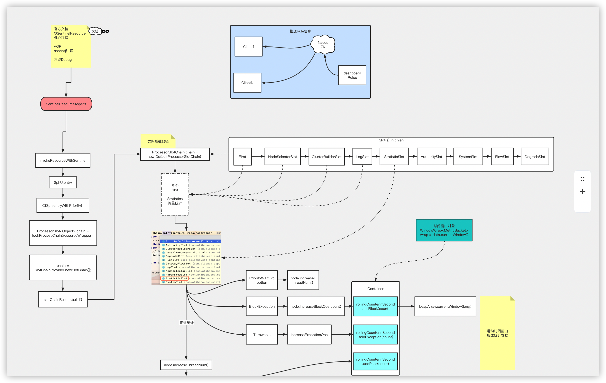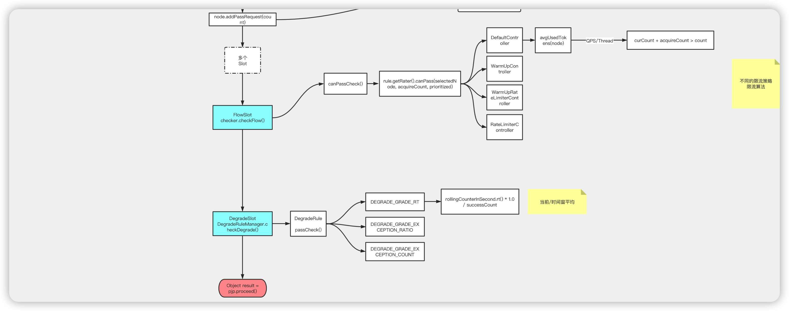

### Sentinel的原理图

这是sentinel官方的介绍：
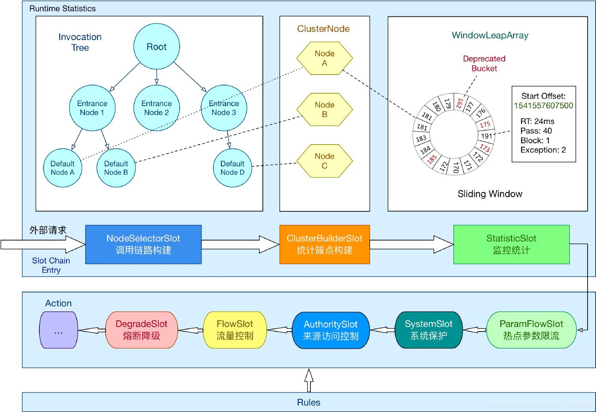

### Sentinel的概念介绍

在 Sentinel 里面，所有的资源都对应一个资源名称（resourceName），每次资源调用都会创建一个 Entry 对象。Entry 可以通过对主流框架的适配自动创建，也可以通过注解的方式或调用 SphU API 显式创建。Entry 创建的时候，同时也会创建一系列功能插槽（slot chain），这些插槽有不同的职责，例如:

- NodeSelectorSlot 负责收集资源的路径，并将这些资源的调用路径，以树状结构存储起来，用于根据调用路径来限流降级；
- ClusterBuilderSlot 则用于存储资源的统计信息以及调用者信息，例如该资源的 RT, QPS, thread count 等等，这些信息将用作为多维度限流，降级的依据；
- StatisticSlot 则用于记录、统计不同纬度的 runtime 指标监控信息；
- FlowSlot 则用于根据预设的限流规则以及前面 slot 统计的状态，来进行流量控制；
- AuthoritySlot 则根据配置的黑白名单和调用来源信息，来做黑白名单控制；
- DegradeSlot 则通过统计信息以及预设的规则，来做熔断降级；
- SystemSlot 则通过系统的状态，例如 load1 等，来控制总的入口流量；

**Context、Entrance Node、DefaultNode和ClusterNode之间的关系：**

- 首先这个NodeSelectorSlot 会去构建图上所示的Invocation Tree，生成Machine Root，Entrance Node和DefaultNode。
- 每一个上下文Context就会对应一个入口节点Entrance Node。
- 每一个资源都会有一个DefaultNode节点用于统计资源在当前节点的流量数据。
- 集群节点ClusterNode用于统计一个资源在所有上下文Context中的信息。

**那么下面就跟着源码看看大致的运行流程**：

Sentinel可以通过注解或者使用代码的方式去声明一个资源，那我们就从注解的方式开始看起吧。在Sentinel中，有一个切面SentinelResourceAspect，是用于截取注解了@SentinelResource的方法的。
在里面有一个环绕通知的方法invokeResourceWithSentinel用于增强原方法。
在该增强方法中所做的事情：

1. 获取注解中的资源名，入口类型等信息
2. 调用SphU.entry去获取一个token，所有的数据统计和规则检查都是在这个方法里面进行的
3. 执行原资源的目标方法
4. 如果一些规则不通过，处理异常，如执行BlockHandler程序。

```java
@Aspect
public class SentinelResourceAspect extends AbstractSentinelAspectSupport {
    //找到被注解了@SentinelResource的方法作为切点
    @Pointcut("@annotation(com.alibaba.csp.sentinel.annotation.SentinelResource)")
    	public void sentinelResourceAnnotationPointcut() {
    }
    //采用环绕通知，对该方法做增强处理
    @Around("sentinelResourceAnnotationPointcut()")
    public Object invokeResourceWithSentinel(ProceedingJoinPoint pjp) throws Throwable {
        Method originMethod = resolveMethod(pjp);

        SentinelResource annotation = originMethod.getAnnotation(SentinelResource.class);
        if (annotation == null) {
            // Should not go through here.
            throw new IllegalStateException("Wrong state for SentinelResource annotation");
        }
        String resourceName = getResourceName(annotation.value(), originMethod);
        EntryType entryType = annotation.entryType();
        int resourceType = annotation.resourceType();
        Entry entry = null;
        try {
            //每一次调用资源都会去创建一个entry
            //所有的数据统计和规则检查都是在这个方法里面进行的
            entry = SphU.entry(resourceName, resourceType, entryType, pjp.getArgs());
            //能顺利的执行完这个方法就说明成功的通过了所有的规则检查。
            //否则是会抛出异常在下面进行捕获的，到不了这里
            Object result = pjp.proceed();//可以执行原目标资源的方法
            return result;
        } catch (BlockException ex) {
            //发生阻塞异常了，就进入到该资源指定的BlockHandler程序。
            //如果找不到BlockHandler程序，就会走降级机制
            return handleBlockException(pjp, annotation, ex);
        } catch (Throwable ex) {
            Class<? extends Throwable>[] exceptionsToIgnore = annotation.exceptionsToIgnore();
            // The ignore list will be checked first.
            if (exceptionsToIgnore.length > 0 && exceptionBelongsTo(ex, exceptionsToIgnore)) {
                throw ex;
            }
            if (exceptionBelongsTo(ex, annotation.exceptionsToTrace())) {
                traceException(ex);
                return handleFallback(pjp, annotation, ex);
            }

            // No fallback function can handle the exception, so throw it out.
            throw ex;
        } finally {
            if (entry != null) {
                entry.exit(1, pjp.getArgs());
            }
        }
    }
}
```

在这里基本所有的业务逻辑都在SphU.entry里，所以下面就看这个方法，它最终会调用entryWithPriority方法，做了下面这些事情：

1. 尝试获取当前线程对应的上下文
2. context数量已经超出阈值就返回不带规则检查的CtEntry
3. 没有获取到上下文就创建一个默认的上下文
4. 查询该资源需要调用的处理槽链
5. slotchain数量超出阈值，也会返回不带规则检查的CtEntry
6. 进入插槽调用链路，做规则检查等操作

```java
private Entry entryWithPriority(ResourceWrapper resourceWrapper, int count, boolean prioritized, Object... args)
            throws BlockException {
    //尝试获取当前线程对应的上下文
    Context context = ContextUtil.getContext();
    if (context instanceof NullContext) {
      // The {@link NullContext} indicates that the amount of context has exceeded the threshold,
      // so here init the entry only. No rule checking will be done.
      //如果是NullContext的话就表示当前context数量已经超出阈值了
      //所以仅仅返回一个不带slotchain的CtEntry，不会进行任何的规则检查
      return new CtEntry(resourceWrapper, null, context);
    }

    if (context == null) {
      // Using default context.
      //默认会创建一个叫sentinel_default_context的context
      context = InternalContextUtil.internalEnter(Constants.CONTEXT_DEFAULT_NAME);
    }

    // Global switch is close, no rule checking will do.
    //这是sentinel的全局开关，如果是关闭状态就不会做任何的规则检查
    if (!Constants.ON) {
      return new CtEntry(resourceWrapper, null, context);
    }
    //在chainMap查询该资源需要调用的处理槽链，如果没有找到就创建一个并放到chainMap里，这里返回的只是第一个调用的插槽
    ProcessorSlot<Object> chain = lookProcessChain(resourceWrapper);

    /*
    * Means amount of resources (slot chain) exceeds {@link Constants.MAX_SLOT_CHAIN_SIZE},
    * so no rule checking will be done.
    */
    if (chain == null) {
      //如果目前的插槽链在map里的数目超出阈值了，这里chain就会是空的，那就直接返回一个不带任何规则检查的CtEntry
    	return new CtEntry(resourceWrapper, null, context);
    }

    Entry e = new CtEntry(resourceWrapper, chain, context);
    try {
      //开始进入调用链路，做规则检查等操作
      chain.entry(context, resourceWrapper, null, count, prioritized, args);
    } catch (BlockException e1) {
      e.exit(count, args);
      throw e1;
    } catch (Throwable e1) {
      // This should not happen, unless there are errors existing in Sentinel internal.
      RecordLog.info("Sentinel unexpected exception", e1);
    }
    return e;
}
```

在entryWithPriority方法中，生成调用链的方法是lookProcessChain，如果没有获取到该资源的调用链，它会调用slotChainBuilder.build()方法，根据SPI机制去加载的。并且会去轮询将这些插槽一个一个添加到末尾形成一条调用链路。

```java
@Override
public ProcessorSlotChain build() {
  ProcessorSlotChain chain = new DefaultProcessorSlotChain();
  //通过spi机制加载所有的排好序的插槽
  List<ProcessorSlot> sortedSlotList = SpiLoader.of(ProcessorSlot.class).loadInstanceListSorted();
  for (ProcessorSlot slot : sortedSlotList) {
    if (!(slot instanceof AbstractLinkedProcessorSlot)) {
      RecordLog.warn("The ProcessorSlot(" 
                     + slot.getClass().getCanonicalName() 
                     + ") is not an instance of AbstractLinkedProcessorSlot, can't be added into ProcessorSlotChain");
      continue;
    }
    //将加载到的这些是AbstractLinkedProcessorSlot类型的插槽添加到这个调用链的末尾去
    chain.addLast((AbstractLinkedProcessorSlot<?>) slot);
  }

  return chain;
}
```

在entryWithPriority方法中，最终会通过调用chain.entry来开启chain的责任链，开始执行chain中的entry方法，并且在entry的末尾又会调用fireEntry去调用注册了这个chain的下一个chain的entry方法。
而每一个slot它包含有first和next指针，以及相关的赋值和调用方法，可以用于这个调用链的连接和调用。

```java
@Override
public void fireEntry(Context context, ResourceWrapper resourceWrapper
                      , Object obj, int count, boolean prioritized, Object... args) throws Throwable {
  //如果他的下一个slot不为空，就执行下一个的entry方法
  if (next != null) {
    next.transformEntry(context, resourceWrapper, obj, count, prioritized, args);
  }
}

void transformEntry(Context context, ResourceWrapper resourceWrapper
                    , Object o, int count, boolean prioritized, Object... args) throws Throwable {
  T t = (T)o;
  entry(context, resourceWrapper, t, count, prioritized, args);
}


```

**而这正就对应了上图中所示的调用插槽链的过程了，就会一个一个的把链中的所有插槽都执行完，到这里我们就能看到了，如上图所示的sentinel的运行流程的大致框架了。**

## Sentinel中的限流算法

### **固定窗口算法**

先介绍一下最简单的限流算法

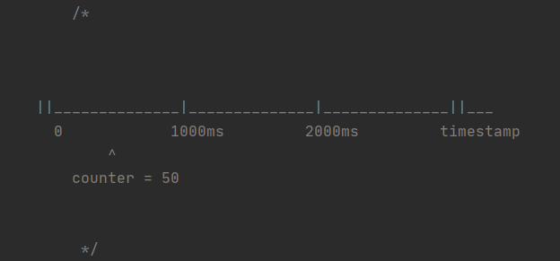

每个窗口都有一个计数器（counter）用于统计流量，如果 `counter + 本次申请的请求数 > 预设的 QPS`，则拒绝请求。

固定窗口很简单，但是也有很大的问题


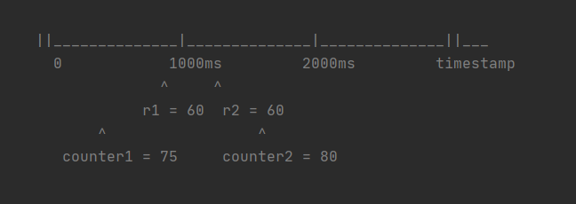

假设我们规定 QPS 不能超过 100，如上图所示 r1 和 r2 两个时间点分别来了 60 个请求， QPS 已经大于 100 了。此时应该触发限流了，但是固定窗口算法傻傻的只关注自己窗口的流量，感知不到 QPS 已经超了

### **滑动窗口算法**

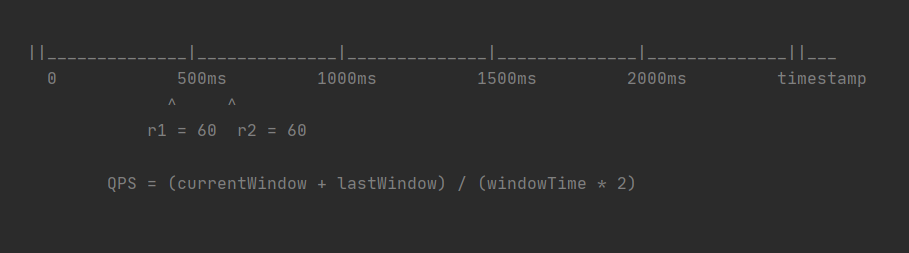

该算法将单位时间切成了多个窗口，每次计算 QPS 时，计算 `当前窗口 + 过去几个窗口` 的流量总和，这样就避免了固定窗口的问题 （具体使用几个窗口，取决于窗口大小和单位时间大小。例如上图，每个窗口大小为 500 ms，以 1 s 为单位时间做限流，每次使用 `current + last` 即可）

**算法实现细节思考**

理解算法思路之后，接下来要思考如何实现这个算法了

1. 首先我们需要有一个上图中的时间轴，来记录时间窗口，可以通过数组来实现这个时间轴。
2. 时间轴有了，我们再来考虑一下时间窗口。
   每个时间窗口肯定要有一个线程安全的计数器以及当前窗口对应的时间

```java
// 时间轴
List<Window> timeline = new ArrayList<>();
// 每个窗口的大小
int windowTime;

// 时间窗口
class Window {
    Timestamp startTime;
    AtomicInteger counter;
}
```

但是如果仔细一想，还是存在一些问题的

- 由于时间是会一直增长的，那我们的数组怎么办？也要跟着时间无限的增大吗？
- 旧的时间窗口（例如几秒之前的）在之后的计算不会再用到了，如何清理这些无用的窗口？

**Sentinel 中滑动窗口算法如何实现的**

带着上述的问题与思考来看下 Sentinel 中是如何实现的

**LeapArray**

Sentinel 中滑动窗口算法的核心类，首先来了解一下他的核心成员变量

```java
public abstract class LeapArray<T> {
 // 要统计的单位时间大小，例如计算QPS时，为1000
    protected int intervalInMs;
 // 样本数量
    protected int sampleCount;
 // 窗口大小 该值 = intervalInMs / sampleCount
    protected int windowLengthInMs;
 
 // 存储时间窗口的数组
    protected final AtomicReferenceArray<WindowWrap<T>> array;
 
    public LeapArray(int sampleCount, int intervalInMs) {
        AssertUtil.isTrue(sampleCount > 0, "bucket count is invalid: " + sampleCount);
        AssertUtil.isTrue(intervalInMs > 0, "total time interval of the sliding window should be positive");
        AssertUtil.isTrue(intervalInMs % sampleCount == 0, "time span needs to be evenly divided");

        this.windowLengthInMs = intervalInMs / sampleCount;
        this.intervalInMs = intervalInMs;
        this.sampleCount = sampleCount;
  
        this.array = new AtomicReferenceArray<>(sampleCount);
    } 
 
}
```

> 单机限流在统计 QPS 时，默认 sampleCount = 2，intervalInMs = 1000，windowLengthInMs = 500

**LeapArray#calculateTimeIdx**

大体思路相同，同样是利用一个数组实现时间轴，每个元素代表一个时间窗口

Sentinel 中 **数组长度是固定的**，通过方法 `LeapArray#calculateTimeIdx` 来 **确定时间戳在数组**中的位置 （找到时间戳对应的窗口位置）

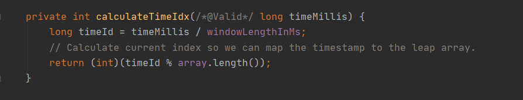

怎么理解这个方法呢？

我们把数据带入进去，假设 windowLengthInMs = 500 ms （每个时间窗口大小是 500 ms）

如果 timestamp 从 0 开始的话，每个时间窗口为 [0,500) [500,1000) [1000,1500) ...

这时候先不考虑 `timeId % array.length()` ，也不考虑数组长度。假设当前 `timeMillis = 601`，将数值代入到 `timeMillis / windowLengthInMs` 其实就可以确定出当前的 timestamp 对应的时间窗口在数组中的位置了

由于数组长度是固定的，所以再加上求余数取模来确定时间窗在数组中的位置

**LeapArray#currentWindow**

先来看一下 Sentinel 中 Window 的结构，基本和我们上面想的一致，计数器使用了泛型，可以更灵活

```java
public class WindowWrap<T> {

    /**
     * Time length of a single window bucket in milliseconds.
     */
    private final long windowLengthInMs;

    /**
     * Start timestamp of the window in milliseconds.
     */
    private long windowStart;

    /**
     * Statistic data.
     */
    private T value;

 // 省略。。。
}
```

继续说 currentWindow，该方法根据传入的 timestamp **找到** 或者 **创建** 这个时间戳对应的 Window

这个方法源码中注释很多，我删除了部分注释

```java
public WindowWrap<T> currentWindow(long timeMillis) {
  if (timeMillis < 0) {
    return null;
  }

  int idx = calculateTimeIdx(timeMillis);
  // Calculate current bucket start time.
  long windowStart = calculateWindowStart(timeMillis);

  /*
         * Get bucket item at given time from the array.
         *
         * (1) Bucket is absent, then just create a new bucket and CAS update to circular array.
         * (2) Bucket is up-to-date, then just return the bucket.
         * (3) Bucket is deprecated, then reset current bucket and clean all deprecated buckets.
         */
  while (true) {
    WindowWrap<T> old = array.get(idx);
    if (old == null) {
      WindowWrap<T> window = new WindowWrap<T>(windowLengthInMs, windowStart, newEmptyBucket(timeMillis));
      if (array.compareAndSet(idx, null, window)) {
        // Successfully updated, return the created bucket.
        return window;
      } else {
        // Contention failed, the thread will yield its time slice to wait for bucket available.
        Thread.yield();
      }
    } else if (windowStart == old.windowStart()) {
      return old;
    } else if (windowStart > old.windowStart()) {
      if (updateLock.tryLock()) {
        try {
          // Successfully get the update lock, now we reset the bucket.
          return resetWindowTo(old, windowStart);
        } finally {
          updateLock.unlock();
        }
      } else {
        // Contention failed, the thread will yield its time slice to wait for bucket available.
        Thread.yield();
      }
    } else if (windowStart < old.windowStart()) {
      // Should not go through here, as the provided time is already behind.
      return new WindowWrap<T>(windowLengthInMs, windowStart, newEmptyBucket(timeMillis));
    }
  }
}
```

方法逻辑分析如下：

首先要做的两件事

- 计算 timestamp 在数组中的位置，就是我们上文说的 `calculateTimeIdx`
- 计算 timestamp 的 `windowStart`（窗口开始时间），通过 `timeMillis - timeMillis % windowLengthInMs`，这个值在后边会用到

------

然后进入一个 `while(true)` 循环， 通过 `WindowWrap<T> old = array.get(idx)` 找出对应的窗口，接下来就是三种情况了

1. old == null
   这个时候代表数组中还没有这个 window，创建这个 window 加入到数组中（由于此时可能会有多个线程同时添加数组元素，所以一定要保证线程安全，所以这里使用的数组为 `AtomicReferenceArray`），添加成功后返回新建的 window

2. windowStart == old.windowStart()
   window 已经存在了，直接返回即可

3. windowStart > old.windowStart()
   代表数组中的元素已经至少是 25s 之前的了，重置当前窗口的 windowStart 和 计数器，这个操作同样也是一个多线程操作，所以使用了 `updateLock.tryLock()`。
   仔细看了代码后，我提出了一个问题。我觉得这个地方并不能一定保证能**锁住**。会不会出现两个线程同时判断需要更新，由于一个线程很快执行成功并释放了锁，第二个线程也成功获取到 Lock，会执行多次 resetWindow。我认为需要再 tryLock 之后再判断一下执行条件，目前已经给 Sentinel 提交了 [Issue](https://link.zhihu.com/?target=https%3A//github.com/alibaba/Sentinel/issues/2230)

   

4. windowStart < old.windowStart()
   通常情况下不会走到这个逻辑分支，上面源码的注释也是这样解释的

**LeapArray#values**

上文中提到过，计算流量时具体使用几个窗口，取决于窗口大小和单位时间大小

该方法的作用通过传入一个时间戳，找出本次计算所需的所有时间窗口

```java
public List<T> values(long timeMillis) {
  if (timeMillis < 0) {
    return new ArrayList<T>();
  }
  int size = array.length();
  List<T> result = new ArrayList<T>(size);

  for (int i = 0; i < size; i++) {
    WindowWrap<T> windowWrap = array.get(i);
    if (windowWrap == null || isWindowDeprecated(timeMillis, windowWrap)) {
      continue;
    }
    result.add(windowWrap.value());
  }
  return result;
}

public boolean isWindowDeprecated(long time, WindowWrap<T> windowWrap) {
  // intervalInMs 在单机限流计算QPS时默认为 1000(ms)
  return time - windowWrap.windowStart() > intervalInMs;
}
```

`values` 的逻辑没什么可说的，遍历数组将时间符合的窗口加入到 List 中

重点看一下 `isWindowDeprecated` 这个方法

还是像上面那样把数值带进去。每个窗口大小为 500 ms，例如 timestamp 为 1601，这个 timestamp 对应的 windowStart 为 1500，此时 `(1601 - 1500 > 1000) = false` 即这个窗口是有效的，再往前推算，上一个窗口 windowStart 为 1000 也是有效的。再往前推算，或者向后推算都是无效的窗口。

> intervalInMs 我是这样理解的，**以多长的时间段作为单位时间来限流**。即可以以 1s 为一个时间段来做限流，也可以以 60s 为一个时间段来限流。

### 快速失败和漏桶算法

今天主要总结了一下Sentinel的快速失败和匀速排队的漏桶算法。因为它的WarmUpController和WarmUpRateLimiterController对应的令牌桶算法的数学计算原理有一点点复杂，所以我准备在后面单独用一篇来总结。所以今天涉及到的主要就是DefaultController和RateLimiterController。

**限流策略入口**

首先进入到FlowRuleUtil类中，方法generateRater就是对应策略的创建，逻辑比较简单，代码如下：

```java
private static TrafficShapingController generateRater(FlowRule rule) {
    if (rule.getGrade() == RuleConstant.FLOW_GRADE_QPS) {
        switch (rule.getControlBehavior()) {
            case RuleConstant.CONTROL_BEHAVIOR_WARM_UP:
                // WarmUp-令牌桶算法
                return new WarmUpController(rule.getCount(), rule.getWarmUpPeriodSec(),
                    ColdFactorProperty.coldFactor);
            case RuleConstant.CONTROL_BEHAVIOR_RATE_LIMITER:
                // 排队等待-漏桶算法
                return new RateLimiterController(rule.getMaxQueueingTimeMs(), rule.getCount());
            case RuleConstant.CONTROL_BEHAVIOR_WARM_UP_RATE_LIMITER:
                // 预热和匀速排队结合
                return new WarmUpRateLimiterController(rule.getCount(), rule.getWarmUpPeriodSec(),
                    rule.getMaxQueueingTimeMs(), ColdFactorProperty.coldFactor);
            case RuleConstant.CONTROL_BEHAVIOR_DEFAULT:
            default:
                // Default mode or unknown mode: default traffic shaping controller (fast-reject).
        }
    }
    // 快速失败
    return new DefaultController(rule.getCount(), rule.getGrade());
}
```

**快速失败DefaultController**

默认流控算法代码如下：

```java
@Override
public boolean canPass(Node node, int acquireCount, boolean prioritized) {
    int curCount = avgUsedTokens(node);
    // 当前阈值 + acquireCount 是否大于规则设定的count，小于等于则表示符合阈值设定直接返回true
    if (curCount + acquireCount > count) {
        // 在大于的情况下，针对QPS的情况会对先进来的请求进行特殊处理
        if (prioritized && grade == RuleConstant.FLOW_GRADE_QPS) {
            long currentTime;
            long waitInMs;
            currentTime = TimeUtil.currentTimeMillis();
            // 如果策略是QPS，那么对于优先请求尝试去占用下一个时间窗口中的令牌
            waitInMs = node.tryOccupyNext(currentTime, acquireCount, count);
            if (waitInMs < OccupyTimeoutProperty.getOccupyTimeout()) {
                node.addWaitingRequest(currentTime + waitInMs, acquireCount);
                node.addOccupiedPass(acquireCount);
                sleep(waitInMs);

                // PriorityWaitException indicates that the request will pass after waiting for {@link @waitInMs}.
                throw new PriorityWaitException(waitInMs);
            }
        }
        return false;
    }
    return true;
}
```

先看一下涉及到的avgUsedTokens方法：

```java
private int avgUsedTokens(Node node) {
    if (node == null) {
        return DEFAULT_AVG_USED_TOKENS;
    }
    // 获取当前qps或者当前线程数
    return grade == RuleConstant.FLOW_GRADE_THREAD ? node.curThreadNum() : (int)(node.passQps());
}
```

主要是获取已使用的令牌数，如果设置的阈值类型为线程数，那么返回当前统计节点中保存的线程数，如果设置的阈值类型为QPS，那么返回已经通过的QPS数。

然后回到上面的canPass方法，其主要逻辑就是在获取到目前节点的统计数据后，将已占用的令牌数与请求的令牌数相加，如果小于设定的阈值，那么直接放行。

如果大于设置的阈值，那么在阈值类型为QPS且允许优先处理先到的请求的情况下进行特殊处理，否则返回false不放行。

上面特殊处理就是：首先尝试去占用后面的时间窗口的令牌，获取到等待时间，如果等待时间小于设置的最长等待时长，那么就进行等待，当等待到指定时间后返回。否则直接返回false不放行。

由代码可以看出，在等待指定时长后，抛出PriorityWaitException进行放行，对应实现的地方在StatisticSlot中，对应entry方法代码如下：

```java
@Override
public void entry(Context context, ResourceWrapper resourceWrapper, DefaultNode node, int count,
                  boolean prioritized, Object... args) throws Throwable {
    try {
        // Do some checking.
        fireEntry(context, resourceWrapper, node, count, prioritized, args);
        // 说明：省略了执行通过的处理逻辑
    } catch (PriorityWaitException ex) {
        node.increaseThreadNum();
        if (context.getCurEntry().getOriginNode() != null) {
            context.getCurEntry().getOriginNode().increaseThreadNum();
        }
        if (resourceWrapper.getEntryType() == EntryType.IN) {
            Constants.ENTRY_NODE.increaseThreadNum();
        }
        for (ProcessorSlotEntryCallback<DefaultNode> handler : StatisticSlotCallbackRegistry.getEntryCallbacks()) {
            handler.onPass(context, resourceWrapper, node, count, args);
        }
    } catch (BlockException e) {
        // 说明：省略了阻塞异常处理逻辑
        throw e;
    } catch (Throwable e) {
        context.getCurEntry().setError(e);
        throw e;
    }
}
```

对这个方法去除了其它多余代码，可以看出在PriorityWaitException异常捕捉的代码中没有继续抛出，所以对该请求进行了放行。

------

**匀速排队-漏桶算法RateLimiterController**

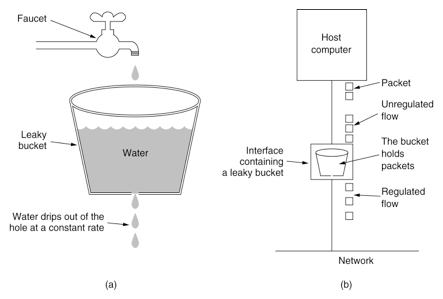

其思路是：水流（请求）先进入到漏桶里，漏桶以一定的速率匀速流出，当流入量过大的时候，多余水流（请求）直接溢出，从而达到对系统容量的保护。

对应Sentinel使用漏桶算法进行流量整形的效果就如下图所示：

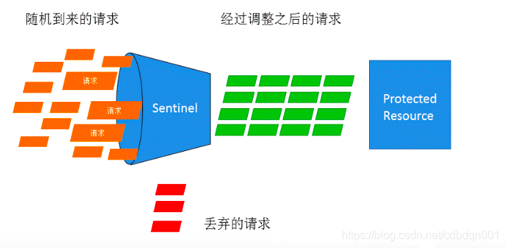

来看RateLimiterController的canPass方法：

```java
@Override
public boolean canPass(Node node, int acquireCount, boolean prioritized) {
    if (acquireCount <= 0) {
        return true;
    }
    if (count <= 0) {
        return false;
    }

    long currentTime = TimeUtil.currentTimeMillis();
    // 计算此次令牌颁发所需要的时间，其中： (1.0 / count * 1000)代表每个令牌生成的耗时，然后乘以acquireCount得到此次所需令牌生成耗时
    long costTime = Math.round(1.0 * (acquireCount) / count * 1000);
    // 在上次通过时间的基础上加上本次的耗时，得到期望通过的时间点
    long expectedTime = costTime + latestPassedTime.get();

    if (expectedTime <= currentTime) {
        // 如果期望时间小于当前时间，那么说明当前令牌充足，可以放行，同时将当前时间设置为上次通过时间
        latestPassedTime.set(currentTime);
        return true;
    } else {
        // 当期望时间大于当前时间，那么说明令牌不够，需要等待
        long waitTime = costTime + latestPassedTime.get() - TimeUtil.currentTimeMillis();
        if (waitTime > maxQueueingTimeMs) {
            // 如果需要等待时间大于设置的最大等待时长，那么直接丢弃，不用等待，下面同理
            return false;
        } else {
            long oldTime = latestPassedTime.addAndGet(costTime);
            try {
                // 再次检查等待时长
                waitTime = oldTime - TimeUtil.currentTimeMillis();
                if (waitTime > maxQueueingTimeMs) {
                    latestPassedTime.addAndGet(-costTime);
                    return false;
                }
                // in race condition waitTime may <= 0
                if (waitTime > 0) {
                    Thread.sleep(waitTime);
                }
                return true;
            } catch (InterruptedException e) {
            }
        }
    }
    return false;
}
```

Sentinel的令牌桶算法和漏桶算法都参考了Guava RateLimiter的设计。

上面的逻辑很清晰，其思路就是根据当前令牌请求数量acquireCount乘以令牌生成速率得到本次所需令牌的生成时间，然后加上上次通过时间得到一个本次请求的期望通过时间，如果期望通过时间小于当前时间那么说明容量足够直接通过，如果期望通过时间大于当前时间那么说明系统容量不够需要等待，然后结合设置的等待时间判断是继续等待还是直接放弃。

需要特别注意的是，匀速模式具有局限性，它只支持1000以内的QPS。我们可以看对应的语句：

```java
long costTime = Math.round(1.0 * (acquireCount) / count * 1000);
long expectedTime = costTime + latestPassedTime.get();
```

很容易得到如下结果，每种阈值对应的令牌生成时间(单位：毫秒)：

| count | costTime |
| ----- | -------- |
| 100   | 10       |
| 1000  | 1        |
| 2000  | 1        |
| 3000  | 0        |

所以当阈值count大于2000后，每个令牌生成的时间间隔计算为0，那么后面的判断就没有意义了。所以Sentinel的匀速器只支持QPS在1000以内的请求。

### **Sentinel 限流思路**

在理解了 `LeapArray#currentWindow` 和 `LeapArray#values` 方法的细节之后，其实我们就可以琢磨出限流的实现思路了

首先根据当前时间戳，找到对应的几个 window，根据 `所有 window 中的流量总和 + 当前申请的流量数` 决定能否通过

- 如果不能通过，抛出异常
- 如果能通过，则对应的窗口加上本次通过的流量数

**Sentinel 限流实现**

Sentinel 基本也是这个思路，只不过逻辑复杂一些，这里贴出几处代码，感兴趣的同学可以自己 debug 一下

**Sentinel 限流检查**

根据 Sentinel 文档中的解释，我们可以知道负责限流的类为 `FlowSlot`，`FlowSlot` 会使用 `FlowRuleChecker` 来检查当前资源是否需要限流

```
FlowSlot#entry
```

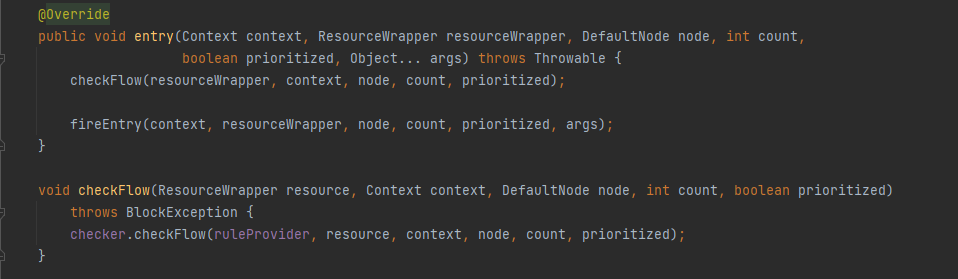

```
FlowRuleChecker#checkFlow
```

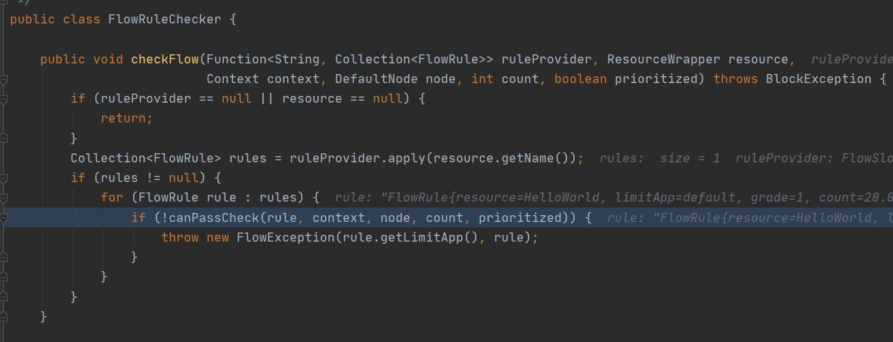

根据 FlowRule 的设定来做限流检查，这中间我省略了几段代码，默认情况没有设置 ControlBehavior 会使用 `DefaultController#canPass` 做限流检查。如下图，通过判断 `当前流量数 + 申请的数量 是否大于预设的数量`，来决定是否限流

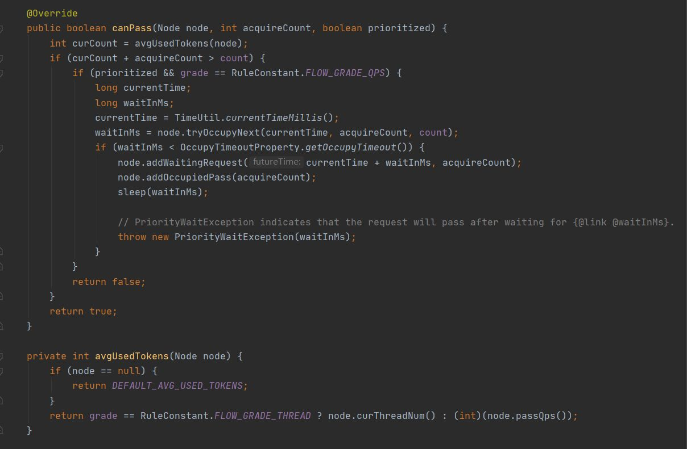

> 注：当使用 `SphU.entry` 时 prioritized = false，使用 `SphU.entryWithPriority` 时 prioritized = true。 `node.tryOccupyNext` 的含义：如果想占用未来的时间窗口令牌，需要等待多久（上图中的waitInMs）。 如果小于规定的超时时间，则记录正在等待的请求数，然后执行 `sleep(waitInMs)`，外层捕获到 `PriorityWaitException` 会自己处理掉，然后执行用户逻辑，用户完全无感知。

通过上图 `avgUsedTokens` 可以看到，当 Rule 的 grade 为 `FLOW_GRADE_QPS` 时，会调用 `node.pass()`。这里调用的具体实现为 `StatisticNode#passQps`，如下图

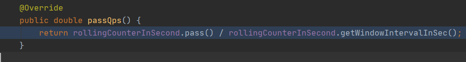

- `rollingCounterInSecond.getWindowIntervalInSec()` 计算 QPS 时为 1 秒
- `rollingCounterInSecond.pass()` 计算 QPS 时，最多返回两个窗口的通过请求数（currentWindow + lastWindow）

```
rollingCounterInSecond#pass
```

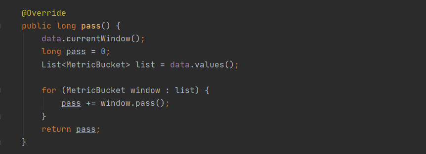

首先先尝试是否需要创建当前的时间窗口，然后找到相关的窗口，计算流量总和。

**Sentinel 请求记录**

代码位置 `StatisticSlot#entry`，`fireEntry` 会根据我们配置的规则进行检查（例如上述的限流）。

如果检查没有抛出异常，则记录线程数和申请的请求数（限流检查依赖的数据就是这里记录的）。

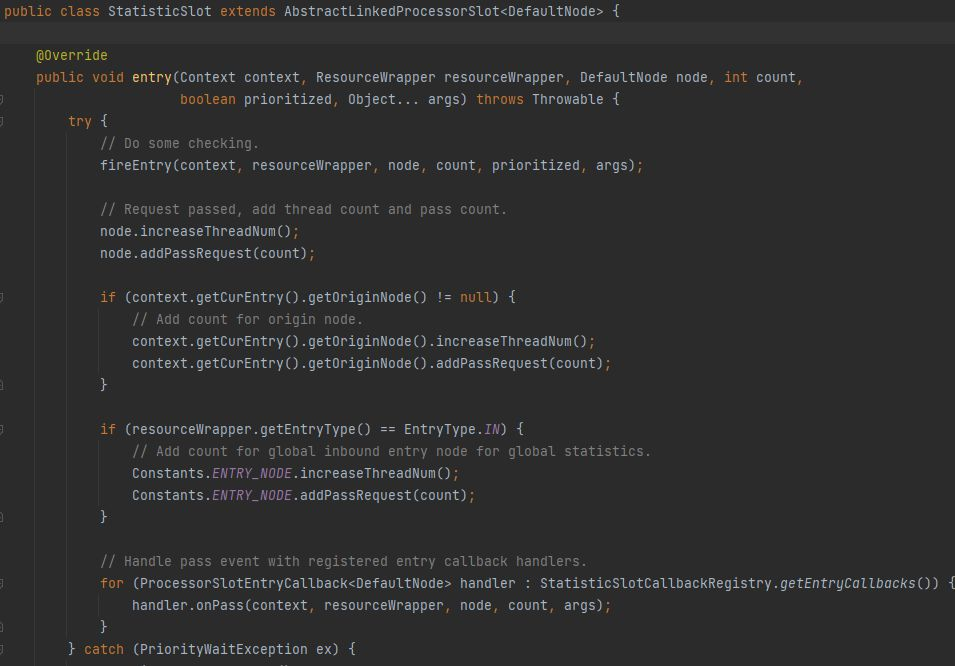

### **集群限流**

**集群限流有什么用**

在没有集群限流之前，如果想把整个服务的 QPS 限制在某个值。举个例子现在某 Server 有十个实例，我们希望总 QPS 不超过 100，这时我们的做法是把每个实例的 QPS 设置为 10。

在理想情况下，这样做可以将 QPS 控制在 100。但是如果每台 Server 分配到的流量不均匀。这可能会导致总量在没达到 100 的时候，某些 Server 就开始限流了。

这种情况就需要 Sentinel 的集群限流出场了。

**集群限流原理**

由于篇幅限制，我们这里不讨论如何搭建集群限流，只是来说说 Sentinel 如何在这一基础上做的集群限流。

思路很简单，选出一个 Token Server。在开启集群限流后，所有的 Client 在需要限流时，询问 Token Server，Server 决定当前请求是否限流。具体的实现细节与单机限流略有不同，但是核心的算法还是使用的 `LeapArray`

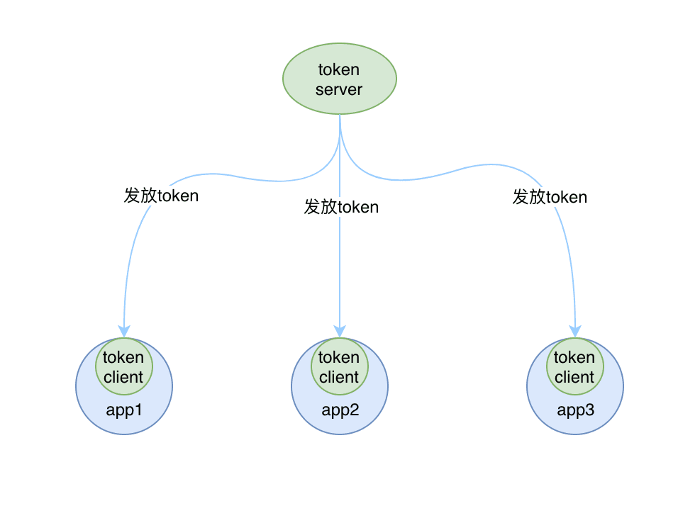

这里也是给出几处源码位置，感兴趣的同学自行阅读一下

Client 端根据 Rule 决定本次使用本地限流还是集群限流，`FlowRuleChecker#canPassCheck`

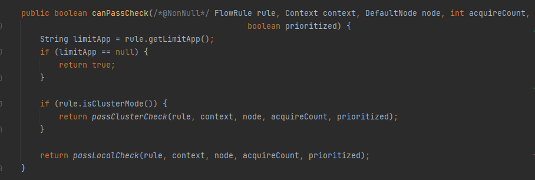

Server 端，`DefaultTokenService#requestToken`

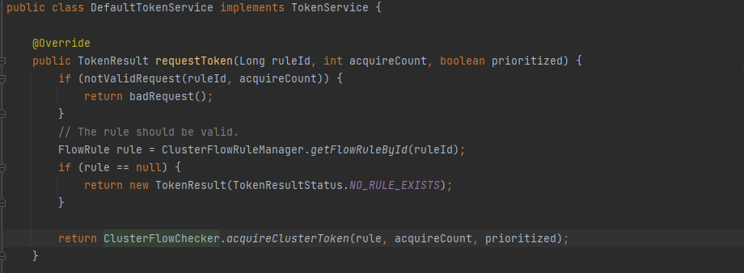

**并发下限流的问题**

在完整的阅读完单机和集群的限流代码之后，发现了一个问题，限流流程可以简化为如下

```java
// 伪代码

// 最大QPS
int maxCount;
// 当前申请的流量数
int aquireCount;

int passQps = getPassQPS();

if (passQps + aquireCount <= maxCount) {
 addPass(aquireCount);
} else {
 // 限流处理
}
```

由于没有并发控制，并发场景下会出现，多个线程同时满足 `passQps + aquireCount <= maxCount`，然后增加流量统计，这样的话，没法保证一定将 QPS 控制在 maxCount，并发的情况下会出现实际流量超出预设 QPS 的情况。

这肯定不是个Bug。这里没有并发控制可能是出于性能考虑，在性能和准确度可以接受的情况下做了一个折中

所以在使用时，如果实际 QPS 高于预设值，可能是并发导致的

## sentinel+nacos熔断降级配置持久化

**看项目**