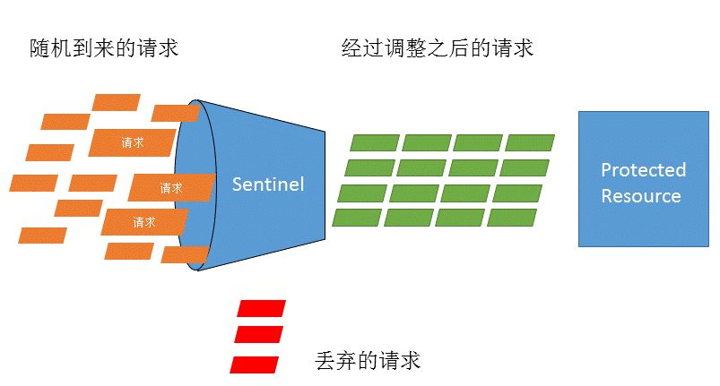
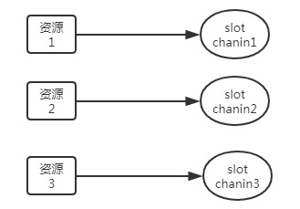
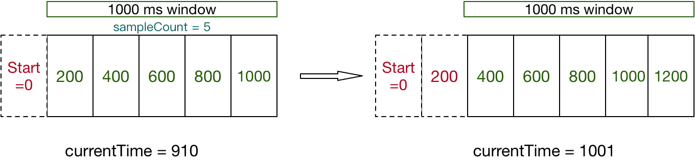
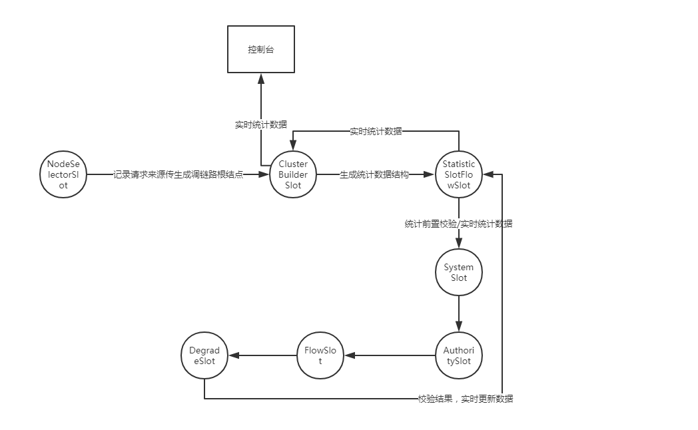

# Sentinel源码解读

## Sentinel基本概念

这里先介绍一下Sentinel的一些基本概念，方便读者理解，引用内容都是主要来自[官方文档](https://link.zhihu.com/?target=https%3A//github.com/alibaba/Sentinel/wiki/%E4%B8%BB%E9%A1%B5)

## 资源

> 资源是 Sentinel 的关键概念。它可以是 Java 应用程序中的任何内容，例如，由应用程序提供的服务，或由应用程序调用的其它应用提供的服务，甚至可以是一段代码。在接下来的文档中，我们都会用资源来描述代码块。
> 只要通过 Sentinel API 定义的代码，就是资源，能够被 Sentinel 保护起来。大部分情况下，可以使用方法签名，URL，甚至服务名称作为资源名来标示资源。

## 规则

> 围绕资源的实时状态设定的规则，可以包括流量控制规则、熔断降级规则以及系统保护规则。所有规则可以动态实时调整。

## Sentinel 功能和设计理念

### 什么是流量控制

> 流量控制在网络传输中是一个常用的概念，它用于调整网络包的发送数据。然而，从系统稳定性角度考虑，在处理请求的速度上，也有非常多的讲究。任意时间到来的请求往往是随机不可控的，而系统的处理能力是有限的。我们需要根据系统的处理能力对流量进行控制。Sentinel 作为一个调配器，可以根据需要把随机的请求调整成合适的形状，如下图所示：



### 流量控制设计理念

> 流量控制有以下几个角度:
> 资源的调用关系，例如资源的调用链路，资源和资源之间的关系；
> 运行指标，例如 QPS、线程池、系统负载等；
> 控制的效果，例如直接限流、冷启动、排队等。
> Sentinel 的设计理念是让您自由选择控制的角度，并进行灵活组合，从而达到想要的效果。

## 熔断降级

### 什么是熔断降级

> 除了流量控制以外，降低调用链路中的不稳定资源也是 Sentinel 的使命之一。由于调用关系的复杂性，如果调用链路中的某个资源出现了不稳定，最终会导致请求发生堆积。这个问题和 [Hystrix](https://link.zhihu.com/?target=https%3A//github.com/Netflix/Hystrix/wiki%23what-problem-does-hystrix-solve) 里面描述的问题是一样的。
> Sentinel 和 Hystrix 的原则是一致的: 当调用链路中某个资源出现不稳定，例如，表现为 timeout，异常比例升高的时候，则对这个资源的调用进行限制，并让请求快速失败，避免影响到其它的资源，最终产生雪崩的效果。

### 熔断降级设计理念

> 在限制的手段上，Sentinel 和 Hystrix 采取了完全不一样的方法。
> Hystrix 通过[线程池](https://link.zhihu.com/?target=https%3A//github.com/Netflix/Hystrix/wiki/How-it-Works%23benefits-of-thread-pools)的方式，来对依赖(在我们的概念中对应资源)进行了隔离。这样做的好处是资源和资源之间做到了最彻底的隔离。缺点是除了增加了线程切换的成本，还需要预先给各个资源做线程池大小的分配。
> Sentinel 对这个问题采取了两种手段:
> **通过并发线程数进行限制**
> 和资源池隔离的方法不同，Sentinel 通过限制资源并发线程的数量，来减少不稳定资源对其它资源的影响。这样不但没有线程切换的损耗，也不需要您预先分配线程池的大小。当某个资源出现不稳定的情况下，例如响应时间变长，对资源的直接影响就是会造成线程数的逐步堆积。当线程数在特定资源上堆积到一定的数量之后，对该资源的新请求就会被拒绝。堆积的线程完成任务后才开始继续接收请求。
> **通过响应时间对资源进行降级**
> 除了对并发线程数进行控制以外，Sentinel 还可以通过响应时间来快速降级不稳定的资源。当依赖的资源出现响应时间过长后，所有对该资源的访问都会被直接拒绝，直到过了指定的时间窗口之后才重新恢复。
> **系统负载保护**
> Sentinel 同时对系统的维度提供保护。防止雪崩，是系统防护中重要的一环。当系统负载较高的时候，如果还持续让请求进入，可能会导致系统崩溃，无法响应。在集群环境下，网络负载均衡会把本应这台机器承载的流量转发到其它的机器上去。如果这个时候其它的机器也处在一个边缘状态的时候，这个增加的流量就会导致这台机器也崩溃，最后导致整个集群不可用。
> 针对这个情况，Sentinel 提供了对应的保护机制，让系统的入口流量和系统的负载达到一个平衡，保证系统在能力范围之内处理最多的请求。

## Sentinel 是如何工作的

> Sentinel 的主要工作机制如下：
> 对主流框架提供适配或者显示的 API，来定义需要保护的资源，并提供设施对资源进行实时统计和调用链路分析。
> 根据预设的规则，结合对资源的实时统计信息，对流量进行控制。同时，Sentinel 提供开放的接口，方便您定义及改变规则。
> Sentinel 提供实时的监控系统，方便您快速了解目前系统的状态。

## Sentinel底层原理解析

下面进入到我们的底层原理部分，在这里我强烈建议如果读者之前没用过Sentinel 或者对Sentinel还不是很熟悉，先去[官方github](https://link.zhihu.com/?target=https%3A//github.com/alibaba/Sentinel)通读一下文档，最好本地跑一下demo。因为原理解析大部分都是解读源码为主，不是介绍入门。

关于原理介绍阿里官方也给出一份文档：[原理介绍](https://link.zhihu.com/?target=https%3A//github.com/alibaba/Sentinel/wiki/Sentinel%E5%B7%A5%E4%BD%9C%E4%B8%BB%E6%B5%81%E7%A8%8B)。文档中给出了大概的设计理念，但在技术细节上并没有详细说明，尤其是在高并发的环境下。本文也是在阿里给出文档的基础上结合代码进行更详细的描述。这里假设读者至少通读了阿里给出的[原理介绍](https://link.zhihu.com/?target=https%3A//github.com/alibaba/Sentinel/wiki/Sentinel%E5%B7%A5%E4%BD%9C%E4%B8%BB%E6%B5%81%E7%A8%8B)文档,并且了解Sentinel 基本概念，并跑过Demo。

## SlotChain和chainMap

以官方给出的代码为例子：

```java
public static void main(String[] args) {
  initFlowRules();
  while (true) {
    Entry entry = null;
    try {
      entry = SphU.entry("HelloWorld");
      /*您的业务逻辑 - 开始*/
      System.out.println("hello world");
      /*您的业务逻辑 - 结束*/
    } catch (BlockException e1) {
      /*流控逻辑处理 - 开始*/
      System.out.println("block!");
      /*流控逻辑处理 - 结束*/
    } finally {
      if (entry != null) {
        entry.exit();
      }
    }
  }
}

private static void initFlowRules(){
    List<FlowRule> rules = new ArrayList<>();
    FlowRule rule = new FlowRule();
    rule.setResource("HelloWorld");
    rule.setGrade(RuleConstant.FLOW_GRADE_QPS);
    // Set limit QPS to 20.
    rule.setCount(20);
    rules.add(rule);
    FlowRuleManager.loadRules(rules);
}
```

引用官方的原理介绍：

> 在 Sentinel 里面，所有的资源都对应一个资源名称以及一个 Entry。Entry 可以通过对主流框架的适配自动创建，也可以通过注解的方式或调用 API 显式创建；每一个 Entry 创建的时候，同时也会创建一系列功能插槽（slot chain）。这些插槽有不同的职责，例如:
> `NodeSelectorSlot` 负责收集资源的路径，并将这些资源的调用路径，以树状结构存储起来，用于根据调用路径来限流降级；
> `ClusterBuilderSlot` 则用于存储资源的统计信息以及调用者信息，例如该资源的 RT, QPS, thread count 等等，这些信息将用作为多维度限流，降级的依据；
> `StatisticSlot` 则用于记录、统计不同纬度的 runtime 指标监控信息；
> `FlowSlot` 则用于根据预设的限流规则以及前面 slot 统计的状态，来进行流量控制；
> `AuthoritySlot` 则根据配置的黑白名单和调用来源信息，来做黑白名单控制；
> `DegradeSlot` 则通过统计信息以及预设的规则，来做熔断降级；
> `SystemSlot` 则通过系统的状态，例如 load1 等，来控制总的入口流量；

ok, 上面提到了一系列的slot都是在

```java
entry = SphU.entry("HelloWorld");
```

中创建的，并且是**每个资源对应唯一一个slot chain**(ProcessorSlotChain)。



所有的slot都包含在ProcessorSlotChain里面

```java
public ProcessorSlotChain build() {
  ProcessorSlotChain chain = new DefaultProcessorSlotChain();
  chain.addLast(new NodeSelectorSlot());
  chain.addLast(new ClusterBuilderSlot());
  chain.addLast(new LogSlot());
  chain.addLast(new StatisticSlot());
  chain.addLast(new SystemSlot());
  chain.addLast(new AuthoritySlot());
  chain.addLast(new FlowSlot());
  chain.addLast(new DegradeSlot());

  return chain;
}
```

**资源与slot chain的对应关系存放在CtSph类全局静态变量chainMap中，CtSph继承于SphU，注意这个变量的修饰关键字。**资源对应的ProcessorSlotChain都是**pre-source**的，**即在第一次访问资源的时候ProcessorSlotChain就创建好，以后再也不用创建，因为创建好之后会存放在chainMap中。**

```java
/**
     * Same resource({@link ResourceWrapper#equals(Object)}) will share the same
     * {@link ProcessorSlotChain}, no matter in which {@link Context}.
     */
private static volatile Map<ResourceWrapper, ProcessorSlotChain> chainMap
  = new HashMap<ResourceWrapper, ProcessorSlotChain>();
```

这也意味着系统所有资源的访问都会经过chainMap,这也意味着chainMap是一个竞态热点访问数据。这就要求**访问chainMap是高性能的同时，chainMap的更新也是线程安全的**。看下源码

```java
ProcessorSlot<Object> lookProcessChain(ResourceWrapper resourceWrapper) { //根据资源获取对应的SlotChain
  ProcessorSlotChain chain = chainMap.get(resourceWrapper);
  if (chain == null) {
    synchronized (LOCK) {
      chain = chainMap.get(resourceWrapper);
      if (chain == null) {
        // Entry size limit.
        if (chainMap.size() >= Constants.MAX_SLOT_CHAIN_SIZE) {
          return null;
        }

        chain = SlotChainProvider.newSlotChain();
        Map<ResourceWrapper, ProcessorSlotChain> newMap = new HashMap<ResourceWrapper, ProcessorSlotChain>(
          chainMap.size() + 1);
        newMap.putAll(chainMap);
        newMap.put(resourceWrapper, chain);
        chainMap = newMap;
      }
    }
  }
  return chain;
}
```

我们看到代码**没有对chainMap加任何锁**，只是在更新chainMap时是通过**额外加锁和复制替换**的形式。这里面用到的技巧包括了volatile特性、copyOnWrite、synchronized。**这样高并发下读写操作是并行的，只有写写操作之间串行。但注意的是写操作是一个纯内存操作，只有第一次访问资源时才会触发，其时间花费只与资源的数量成正比，正常应用资源个数一般在数千以内，并且对象是共享的，这个花费的时间是非常的少。另外阿里也做了资源数量的限制：***MAX_SLOT_CHAIN_SIZE* = 6000。**所以写写操作也是非常的快，比例也很少**。**再加上volatile关键字的特性，chainMap更新后对所有线程都可见，线程安全。**

除了chainMap是这种套路之外，Sentinel 里面资源对应的统计信息的更新存储也是类似的套路。

## StatisticSlot

**因为一个资源与对应唯一一个SlotChain，所以在应用中一个资源就唯一对应一个NodeSelectorSlot、ClusterBuilderSlot、LogSlot、StatisticSlot、SystemSlot、AuthoritySlot、FlowSlot、DegradeSlot。**

这里着重介绍StatisticSlot，因为它是 Sentinel 的核心功能插槽之一，用于统计所有的实时数据，并且是很多Slot的数据基础。

> 引用官方文档：
> `clusterNode`：资源唯一标识的 ClusterNode 的 runtime 统计
> `origin`：根据来自不同调用者的统计信息
> `defaultnode`: 根据上下文条目名称和资源 ID 的 runtime 统计
> 入口的统计
> Sentinel 底层采用高性能的滑动窗口数据结构 `LeapArray` 来统计实时的秒级指标数据，可以很好地支撑写多于读的高并发场景。



文档中提到的LeapArray数据结构，到底是什么呢？正如文档所说内部是一个数组

```java
public LeapArray(int windowLengthInMs, int intervalInSec) {
  this.windowLengthInMs = windowLengthInMs;
  this.intervalInMs = intervalInSec * 1000;
  this.sampleCount = intervalInMs / windowLengthInMs;

  this.array = new AtomicReferenceArray<WindowWrap<T>>(sampleCount);
}
```

数组里面的真正元素是一种叫MetricBucket的数据结构，里面记录了在窗口时间内通过的请求数、block、异常数、RT(响应时间)这些指标，当前线程数则是在另一个地方计算。

```java
public class MetricBucket {

    private final LongAdder pass = new LongAdder();
    private final LongAdder block = new LongAdder();
    private final LongAdder exception = new LongAdder();
    private final LongAdder rt = new LongAdder();
    private final LongAdder success = new LongAdder();

    private volatile long minRt;
}
```

注意关键字**LongAdder，Sentinel参考了java 8里面关于AtomicLong的改进，采用了全新LongAdder进行计数统计。关于**LongAdder的原理这里有一篇文章讲的非常好，大家可以参考。

[从LongAdder看更高效的无锁实现 | | 酷 壳 - CoolShellcoolshell.cn/articles/11454.html](https://link.zhihu.com/?target=https%3A//coolshell.cn/articles/11454.html)

**概括起来使用LongAdder, 高并发下计数统计比之前用AtomicLong高效得多。**

**不过令人感到意外的是Sentinel在线程数统计时却没有用LongAdder而用的是AtomicInteger**

```java
private AtomicInteger curThreadNum = new AtomicInteger(0);
```

**Sentinel每次计数时都是以当前时间的毫秒值除以窗口统计时间，再求余，得出数组中元素的位置，即对应的窗口。**

```java
long timeId = time / windowLengthInMs;
// Calculate current index.
int idx = (int)(timeId % array.length());
```

然后用WindowWrap类封装好MetricBucket，并记录好窗口统计的开始时间，放到统计数组中。

```java
/**
     * @param windowLengthInMs a single window bucket's time length in milliseconds.
     * @param windowStart  the start timestamp of the window
     * @param value        window data
     */
public WindowWrap(long windowLengthInMs, long windowStart, T value) {
  this.windowLengthInMs = windowLengthInMs;
  this.windowStart = windowStart;
  this.value = value;
}
```


**StatisticSlot除了统计每个资源的实时统计之外，还负责更新系统的实时统计。**

```java
if (resourceWrapper.getType() == EntryType.IN) {
  Constants.ENTRY_NODE.increaseThreadNum();
  Constants.ENTRY_NODE.addPassRequest();
}
```

**系统的实时统计数据将会被SystemSlot作为调整的参考。**

## ClusterBuilderSlot

> 引用官方文档
> 此插槽用于构建资源的 `ClusterNode` 以及调用来源节点。`ClusterNode` 保持资源运行统计信息（响应时间、QPS、block 数目、线程数、异常数等）以及原始调用者统计信息列表。来源调用者的名字由 `ContextUtil.enter(contextName，origin)` 中的 `origin` 标记。可通过如下命令查看某个资源不同调用者的访问情况：`curl http://localhost:8719/origin?id=caller`：

```agda
id: nodeA
idx origin  threadNum passedQps blockedQps totalQps aRt   1m-passed 1m-blocked 1m-total 
1   caller1 0         0         0          0        0     0         0          0        
2   caller2 0         0         0          0        0     0         0          0
```

看功能描述ClusterBuilderSlot似乎与StatisticSlot有些重叠，**其实准确来说StatisticSlot的用于统计的数据结构是由ClusterBuilderSlot传递给StatisticSlot的，并且这个数据结构是ClusterBuilderSlot的内部属性，同时ClusterBuilderSlot还记录了调用来源的结点originNode，并把它也传递给StatisticSlot，去实时更新。**

**所以**，**资源的所有实时统计信息通过ClusterBuilderSlot就可以实时获取。另外所有的资源统计信息都保存在一个全局静态的map中**

```java
private static volatile Map<ResourceWrapper, ClusterNode> clusterNodeMap
  = new HashMap<ResourceWrapper, ClusterNode>();
```

Sentinel 控制台上面显示的实时监控数据就是拿的clusterNodeMap的数据。

## NodeSelectorSlot

这个 slot 主要负责收集资源的路径，并将这些资源的调用路径，以树状结构存储起来，用于根据调用路径来限流降级。**ClusterBuilderSlot的originNode就是NodeSelectorSlot生成的。**

## LogSlot

记录统计时抛出的未知异常用的。

## SystemSlot

> 引用官方文档
> 这个 slot 会根据对于当前系统的整体情况，对入口的资源进行调配。其原理是让入口的流量和当前系统的 load 达到一个动态平衡。
> 注意这个功能的两个限制:
> 只对入口流量起作用（调用类型为`EntryType.IN`），对出口流量无效。可通过 `SphU.entry()` 指定调用类型，如果不指定，默认是`EntryType.OUT`。
> Entry entry = SphU.entry("resourceName"，[http://EntryType.IN](https://link.zhihu.com/?target=http%3A//EntryType.IN));
> 只在 Unix-like 的操作系统上生效

看下SystemSlot中的主要代码逻辑。

```java
        SystemRuleManager.checkSystem(resourceWrapper);
        fireEntry(context, resourceWrapper, node, count, args);
```

校验系统的整体的QPS，线程数，RT时间，不通过则进行调整。

```java
public static void checkSystem(ResourceWrapper resourceWrapper) throws BlockException {
  // Ensure the checking switch is on.
  if (!checkSystemStatus.get()) {
    return;
  }

  // for inbound traffic only
  if (resourceWrapper.getType() != EntryType.IN) {
    return;
  }

  // total qps
  double currentQps = Constants.ENTRY_NODE == null ? 0.0 : Constants.ENTRY_NODE.successQps();
  if (currentQps > qps) {
    throw new SystemBlockException(resourceWrapper.getName(), "qps");
  }

  // total thread
  int currentThread = Constants.ENTRY_NODE == null ? 0 : Constants.ENTRY_NODE.curThreadNum();
  if (currentThread > maxThread) {
    throw new SystemBlockException(resourceWrapper.getName(), "thread");
  }

  double rt = Constants.ENTRY_NODE == null ? 0 : Constants.ENTRY_NODE.avgRt();
  if (rt > maxRt) {
    throw new SystemBlockException(resourceWrapper.getName(), "rt");
  }

  // BBR algorithm.
  if (highestSystemLoadIsSet && getCurrentSystemAvgLoad() > highestSystemLoad) {
    if (currentThread > 1 &&
        currentThread > Constants.ENTRY_NODE.maxSuccessQps() * Constants.ENTRY_NODE.minRt() / 1000) {
      throw new SystemBlockException(resourceWrapper.getName(), "load");
    }
  }
}
```

调整策略参考

[alibaba/Sentinelgithub.com/alibaba/Sentinel/wiki/%E7%B3%BB%E7%BB%9F%E8%87%AA%E9%80%82%E5%BA%94%E9%99%90%E6%B5%81](https://link.zhihu.com/?target=https%3A//github.com/alibaba/Sentinel/wiki/%E7%B3%BB%E7%BB%9F%E8%87%AA%E9%80%82%E5%BA%94%E9%99%90%E6%B5%81)


## FlowSlot

> 引用官方文档
> 这个 slot 主要根据预设的资源的统计信息，按照固定的次序，依次生效。如果一个资源对应两条或者多条流控规则，则会根据如下次序依次检验，直到全部通过或者有一个规则生效为止:
> 指定应用生效的规则，即针对调用方限流的；
> 调用方为 other 的规则；
> 调用方为 default 的规则。

回到开头的例子：

```java
private static void initFlowRules(){
    List<FlowRule> rules = new ArrayList<>();
    FlowRule rule = new FlowRule();
    rule.setResource("HelloWorld");
    rule.setGrade(RuleConstant.FLOW_GRADE_QPS);
    // Set limit QPS to 20.
    rule.setCount(20);
    rules.add(rule);
    FlowRuleManager.loadRules(rules);
}
```

再看FlowSlot里面的代码逻辑，简单明了。

```java
   public static void checkFlow(ResourceWrapper resource, Context context, DefaultNode node, int count)
        throws BlockException {
        List<FlowRule> rules = flowRules.get(resource.getName());
        if (rules != null) {
            for (FlowRule rule : rules) {
                if (!rule.passCheck(context, node, count)) {
                    throw new FlowException(rule.getLimitApp());
                }
            }
        }
    }
```

**传参里面的 DefaultNode node就是ClusterBuilderSlot里面的统计数据。**

## DegradeSlot

```java
@SpiOrder(-1000)
public class DegradeSlot extends AbstractLinkedProcessorSlot<DefaultNode> {

    @Override
    public void entry(Context context, ResourceWrapper resourceWrapper, DefaultNode node, int count, boolean prioritized, Object... args)
        throws Throwable {
        //熔断降级判断
        DegradeRuleManager.checkDegrade(resourceWrapper, context, node, count);
        fireEntry(context, resourceWrapper, node, count, prioritized, args);
    }

    @Override
    public void exit(Context context, ResourceWrapper resourceWrapper, int count, Object... args) {
        fireExit(context, resourceWrapper, count, args);
    }
}
```

源码很简单，委托DegradeRuleManager来处理，进入DegradeRuleManager的checkDegrade方法

```java
public static void checkDegrade(ResourceWrapper resource, Context context, DefaultNode node, int count)
  throws BlockException {
  //获取资源熔断规则
  Set<DegradeRule> rules = degradeRules.get(resource.getName());
  if (rules == null) {
    return;
  }
  //遍历每个熔断规则，校验是否满足熔断条件
  for (DegradeRule rule : rules) {
    //如果达到了熔断条件，就会抛出DegradeException的异常
    if (!rule.passCheck(context, node, count)) {
      throw new DegradeException(rule.getLimitApp(), rule);
    }
  }
}
```

熔断的判断就是针对资源设置的规则，逐一判断处理。如果有一个条件不满足的话，就会抛出DegradeException异常。那么熔断判断具体是怎么做的呢？继续深入DegradeRule类中的passCheck方法，在分析passCheck方法之前，先介绍DegradeRule类几个比较重要的字段。

```java
//慢请求或异常请求的计数
private double count;

//熔断窗口
private int timeWindow;

//熔断策略 (0: 慢调用, 1: 异常率, 2: 异常数) 
private int grade = RuleConstant.DEGRADE_GRADE_RT;

/**
* 针对慢调用，如果慢调用数小于其值（默认为5），是不会触发熔断的
*
* @since 1.7.0
*/
private int rtSlowRequestAmount = RuleConstant.DEGRADE_DEFAULT_SLOW_REQUEST_AMOUNT;

/**
* 针对异常率，如果异常数小于其值（默认为5），是不会触发熔断的
*
* @since 1.7.0
*/
private int minRequestAmount = RuleConstant.DEGRADE_DEFAULT_MIN_REQUEST_AMOUNT;
```

熔断的实现原理简单说来就是在一个设定的窗口时间内，根据设置的具体熔断策略，判断相应的计数统计是否超过了门限值，如果超过了则会触发熔断机制。深入passCheck的源码

```java
//慢调用计数
private AtomicLong passCount = new AtomicLong(0);
//熔断降级标记位，如果为true，则表示触发了熔断
private final AtomicBoolean cut = new AtomicBoolean(false);
 
public boolean passCheck(Context context, DefaultNode node, int acquireCount, Object... args) {
  //如果标记位为真，表示已触发熔断
  if (cut.get()) {
    return false;
  }
  //获取资源计数统计node
  ClusterNode clusterNode = ClusterBuilderSlot.getClusterNode(this.getResource());
  if (clusterNode == null) {
    return true;
  }
  //如果熔断降级策略为慢调用
  if (grade == RuleConstant.DEGRADE_GRADE_RT) {
    //获取慢调用平均响应时间
    double rt = clusterNode.avgRt();
    //如果调用平均响应时间小于设定的门限值，则重置慢调用计数统计
    if (rt < this.count) {
      passCount.set(0);
      return true;
    }

    //如果慢调用数小于默认的最小门限数（5），则不进行熔断降级
    if (passCount.incrementAndGet() < rtSlowRequestAmount) {
      return true;
    }
    //如果熔断降级策略是异常率
  } else if (grade == RuleConstant.DEGRADE_GRADE_EXCEPTION_RATIO) {
    //每秒的异常数
    double exception = clusterNode.exceptionQps();
    //每秒成功调用数
    double success = clusterNode.successQps();
    //每秒总调用数
    double total = clusterNode.totalQps();
    //如果总调用数小于默认的门限值（5）,则不会触发熔断降级	
    if (total < minRequestAmount) {
      return true;
    }
    //此句需要好好理解下，它表达的意思是：在异常数小于最小门限的条件是不进行熔断降级的，但前提是所用调用都不能全是异常调用
    double realSuccess = success - exception;
    if (realSuccess <= 0 && exception < minRequestAmount) {
      return true;
    }
    //异常率小于设置的门限，则不熔断降级
    if (exception / success < count) {
      return true;
    }

    //如果熔断降级策略是异常数
  } else if (grade == RuleConstant.DEGRADE_GRADE_EXCEPTION_COUNT) {
    //注意，这个异常数是每分钟统计的
    double exception = clusterNode.totalException();
    //小于设置的门限值，则不熔断
    if (exception < count) {
      return true;
    }
  }
  //如果走到了这里，则表示将要触发熔断降级了
  //重置慢调用统计时间窗口，此处用了CAS的方法来设置标志位，防止并发。
  //时间窗口的重置是依赖于定时任务来完成的，当timeWindow时间后，会重置熔断标志位和计数统计
  if (cut.compareAndSet(false, true)) {
    ResetTask resetTask = new ResetTask(this);
    pool.schedule(resetTask, timeWindow, TimeUnit.SECONDS);
  }
  return false;
}

//重置时间窗口
private static final class ResetTask implements Runnable {

  private DegradeRule rule;

  ResetTask(DegradeRule rule) {
    this.rule = rule;
  }

  @Override
  public void run() {
    //重置慢调用计数
    rule.passCount.set(0);
    //熔断标志位
    rule.cut.set(false);
  }
}
```

上面的代码描述了熔断降级核心流程，针对上面代码需要注意的是：

- 慢调用是通过一个**时间窗口**来计数慢调用的次数来实现的
- 异常率是针对**每秒**的异常数和成功数的比值来判断是否满足触发条件的
- 异常数是针对**每分钟**的异常数统计来实现的

当熔断被触发后，标志位会被设置为true,并会持续timeWindow长的时间，这个时间就是开发者在设置熔断降级规则时设置的。上述就是整个熔断降级的实现过程，从代码来看，熔断窗口通过一个定时任务来更新，设计的还是比较新颖的。

## slot间调用关系（重点）（方便理解源码）



## Context请求上下文

在Sentinel 中所有资源的访问都会生成一个Context(请求上下文)

```java
Context context = ContextUtil.getContext();
```

这个Context是基于ThreadLocal的，所以一个请求是横跨多个资源的同时，都是在同一个Context下面。这样可以实现跨资源的链路访问统计。

Context在entry创建的时候生成和获取，在exit的时候清除掉。所以如果entry不为空，最后一定要调用exit方法，否则会有内存泄露的风险。

```java
entry = SphU.entry("HelloWorld"); 
entry.exit();
```

## entry.exit

前面提到entry不为空，最后一定要调用exit方法，否则会有内存泄露的风险。除了这个原因之外，请求的RT时间统计，完成后当前线程数的更新也是在exit方法中完成。所以entry创建和entry.exit一定是要成对出现。否则就出大问题了。