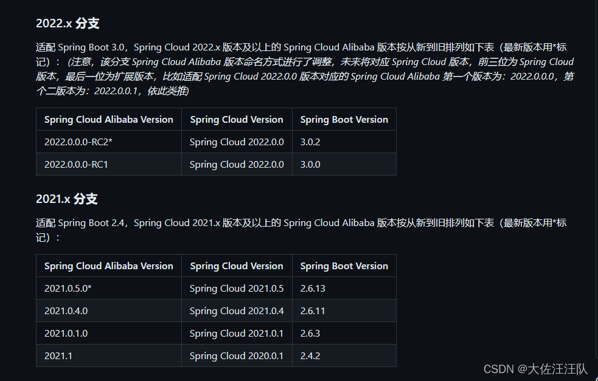
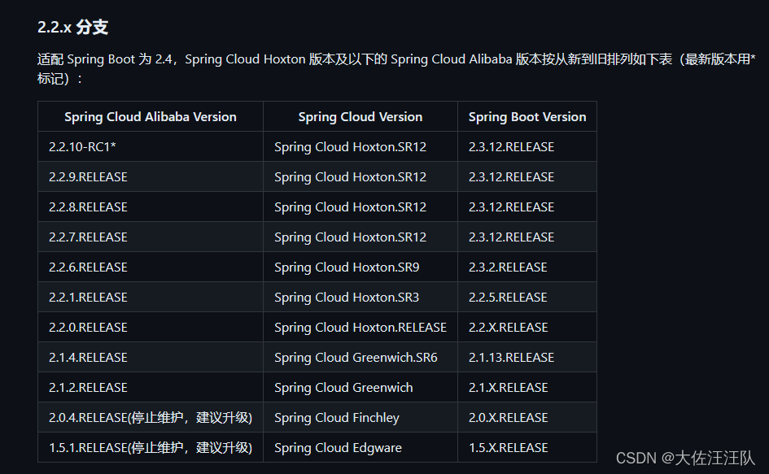
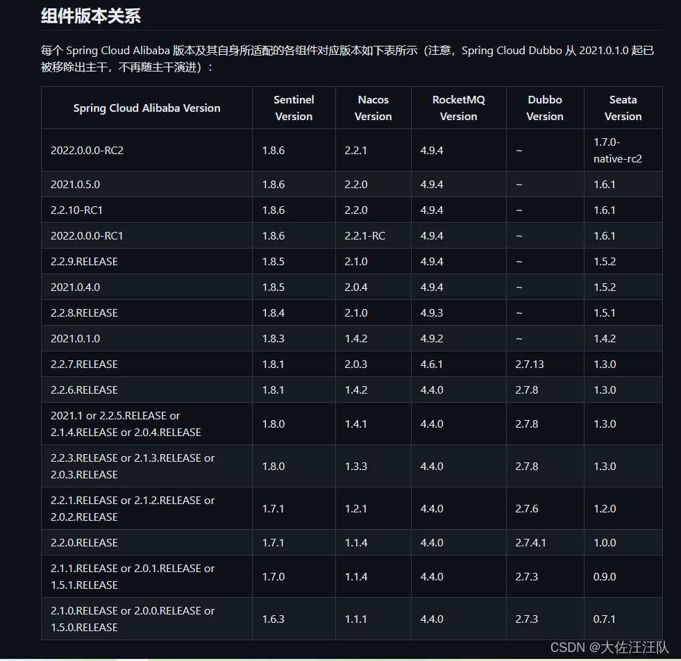

# SpringCloud Alibaba

## 版本依赖对照关系







### 组件版本关系

| Spring Cloud Alibaba Version                              | Sentinel Version | Nacos Version | RocketMQ Version | Dubbo Version | Seata Version |
| --------------------------------------------------------- | ---------------- | ------------- | ---------------- | ------------- | ------------- |
| 2.2.7.RELEASE                                             | 1.8.1            | 2.0.3         | 4.6.1            | 2.7.13        | 1.3.0         |
| 2.2.6.RELEASE                                             | 1.8.1            | 1.4.2         | 4.4.0            | 2.7.8         | 1.3.0         |
| 2021.1 or 2.2.5.RELEASE or 2.1.4.RELEASE or 2.0.4.RELEASE | 1.8.0            | 1.4.1         | 4.4.0            | 2.7.8         | 1.3.0         |
| 2.2.3.RELEASE or 2.1.3.RELEASE or 2.0.3.RELEASE           | 1.8.0            | 1.3.3         | 4.4.0            | 2.7.8         | 1.3.0         |
| 2.2.1.RELEASE or 2.1.2.RELEASE or 2.0.2.RELEASE           | 1.7.1            | 1.2.1         | 4.4.0            | 2.7.6         | 1.2.0         |
| 2.2.0.RELEASE                                             | 1.7.1            | 1.1.4         | 4.4.0            | 2.7.4.1       | 1.0.0         |
| 2.1.1.RELEASE or 2.0.1.RELEASE or 1.5.1.RELEASE           | 1.7.0            | 1.1.4         | 4.4.0            | 2.7.3         | 0.9.0         |
| 2.1.0.RELEASE or 2.0.0.RELEASE or 1.5.0.RELEASE           | 1.6.3            | 1.1.1         | 4.4.0            | 2.7.3         | 0.7.1         |

### 毕业版本依赖关系(推荐使用)

| Spring Cloud Version        | Spring Cloud Alibaba Version      | Spring Boot Version |
| --------------------------- | --------------------------------- | ------------------- |
| Spring Cloud 2020.0.1       | 2021.1                            | 2.4.2               |
| Spring Cloud Hoxton.SR12    | 2.2.7.RELEASE                     | 2.3.12.RELEASE      |
| Spring Cloud Hoxton.SR9     | 2.2.6.RELEASE                     | 2.3.2.RELEASE       |
| Spring Cloud Greenwich.SR6  | 2.1.4.RELEASE                     | 2.1.13.RELEASE      |
| Spring Cloud Hoxton.SR3     | 2.2.1.RELEASE                     | 2.2.5.RELEASE       |
| Spring Cloud Hoxton.RELEASE | 2.2.0.RELEASE                     | 2.2.X.RELEASE       |
| Spring Cloud Greenwich      | 2.1.2.RELEASE                     | 2.1.X.RELEASE       |
| Spring Cloud Finchley       | 2.0.4.RELEASE(停止维护，建议升级) | 2.0.X.RELEASE       |
| Spring Cloud Edgware        | 1.5.1.RELEASE(停止维护，建议升级) | 1.5.X.RELEASE       |

示例pom

总父项目

```xml
<?xml version="1.0" encoding="UTF-8"?>
<project xmlns="http://maven.apache.org/POM/4.0.0" xmlns:xsi="http://www.w3.org/2001/XMLSchema-instance"
         xsi:schemaLocation="http://maven.apache.org/POM/4.0.0 https://maven.apache.org/xsd/maven-4.0.0.xsd">
    <modelVersion>4.0.0</modelVersion>
    <parent>
        <groupId>org.springframework.boot</groupId>
        <artifactId>spring-boot-starter-parent</artifactId>
        <version>2.3.2.RELEASE</version>
    </parent>

    <groupId>com.zhanglubin</groupId>
    <artifactId>SpringCloudAlibabaTest</artifactId>
    <version>1.0.1</version>

    <packaging>pom</packaging>

    <properties>
        <project.build.sourceEncoding>UTF-8</project.build.sourceEncoding>
        <java.version>1.8</java.version>
        <maven.compiler.source>${java.version}</maven.compiler.source>
        <maven.compiler.target>${java.version}</maven.compiler.target>
        <spring.cloud.alibaba.version>2.2.6.RELEASE</spring.cloud.alibaba.version>
        <spring.cloud.version>Hoxton.SR9</spring.cloud.version>
    </properties>

    <dependencyManagement>
        <dependencies>
            <dependency>
                <groupId>com.alibaba.cloud</groupId>
                <artifactId>spring-cloud-alibaba-dependencies</artifactId>
                <version>${spring.cloud.alibaba.version}</version>
                <type>pom</type>
                <scope>import</scope>
            </dependency>

            <dependency>
                <groupId>org.springframework.cloud</groupId>
                <artifactId>spring-cloud-dependencies</artifactId>
                <version>${spring.cloud.version}</version>
                <type>pom</type>
                <scope>import</scope>
            </dependency>
        </dependencies>
    </dependencyManagement>

    <modules>
        <module>provider</module>
    </modules>

</project>
```

provider

```xml
<?xml version="1.0" encoding="UTF-8"?>
<project xmlns="http://maven.apache.org/POM/4.0.0" xmlns:xsi="http://www.w3.org/2001/XMLSchema-instance"
         xsi:schemaLocation="http://maven.apache.org/POM/4.0.0 https://maven.apache.org/xsd/maven-4.0.0.xsd">
    <modelVersion>4.0.0</modelVersion>
    <parent>
        <groupId>com.zhanglubin</groupId>
        <artifactId>SpringCloudAlibabaTest</artifactId>
        <version>1.0.1</version>
    </parent>

    <groupId>com.zhanglubin</groupId>
    <artifactId>provider</artifactId>
    <version>1.0.1</version>

    <properties>
        <java.version>1.8</java.version>
    </properties>

    <dependencies>
        <dependency>
            <groupId>com.alibaba.cloud</groupId>
            <artifactId>spring-cloud-starter-alibaba-nacos-discovery</artifactId>
        </dependency>
        <dependency>
            <groupId>org.springframework.boot</groupId>
            <artifactId>spring-boot-starter-web</artifactId>
        </dependency>
        <dependency>
            <groupId>junit</groupId>
            <artifactId>junit</artifactId>
            <scope>test</scope>
        </dependency>
    </dependencies>

    <build>
        <plugins>
            <plugin>
                <groupId>org.springframework.boot</groupId>
                <artifactId>spring-boot-maven-plugin</artifactId>
            </plugin>
        </plugins>
    </build>

</project>
```

