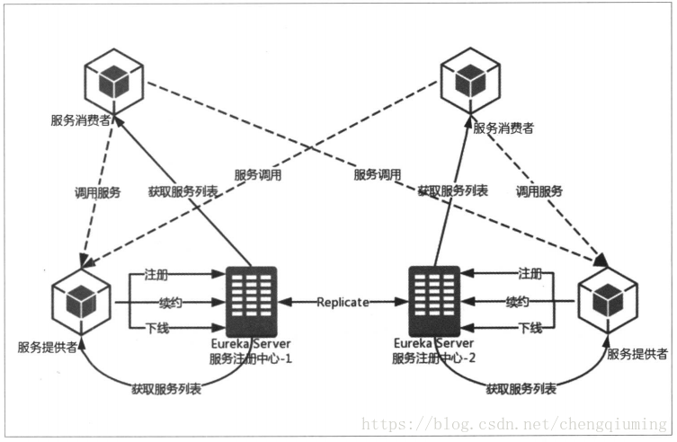
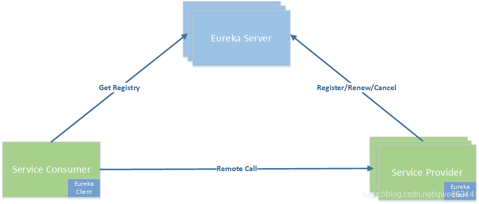
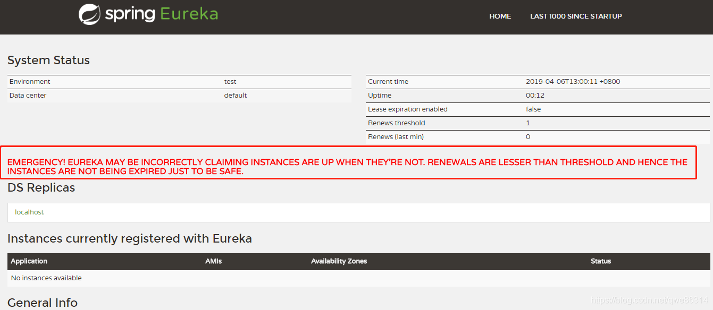
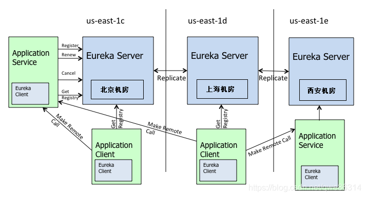

# Eureka注册中心



服务提供者和服务的消费者是 Eureka Client ，注册中心服务是Eureka Server 



## Eureka Server 

注册中心服务端主要对外提供了三个功能：

### 服务注册

服务提供者启动时，会通过 Eureka Client 向 Eureka Server 注册信息，Eureka Server 会存储该服务的信息，Eureka Server 内部有二层缓存机制来维护整个注册表

### 提供注册表

服务消费者在调用服务时，如果 Eureka Client 没有缓存注册表的话，会从 Eureka Server 获取最新的注册表

### 同步状态

Eureka Client 通过注册、心跳机制和 Eureka Server 同步当前客户端的状态。

## Eureka Client

### Register: 服务注册

服务的提供者，将自身注册到注册中心，服务提供者也是一个 Eureka Client。当 Eureka Client 向 Eureka Server 注册时，它提供自身的元数据，比如 IP 地址、端口，运行状况指示符 URL，主页等。

### Renew: 服务续约

Eureka Client 会每隔 30 秒发送一次心跳来续约。 通过续约来告知 Eureka Server 该 Eureka Client 运行正常，没有出现问题。 默认情况下，如果 Eureka Server 在 90 秒内没有收到 Eureka Client 的续约，Server 端会将实例从其注册表中删除，此时间可配置，一般情况不建议更改。

```java
#服务续约任务的调用间隔时间，默认为30秒
eureka.instance.lease-renewal-interval-in-seconds=30

#服务失效的时间，默认为90秒。
eureka.instance.lease-expiration-duration-in-seconds=90
```


### Eviction 服务剔除

当 Eureka Client 和 Eureka Server 不再有心跳时，Eureka Server 会将该服务实例从服务注册列表中删除，即服务剔除。

### Cancel: 服务下线

Eureka Client 在程序关闭时向 Eureka Server 发送取消请求。 发送请求后，该客户端实例信息将从 Eureka Server 的实例注册表中删除。该下线请求不会自动完成，它需要调用以下内容：

```java
DiscoveryManager.getInstance().shutdownComponent();
```


### GetRegisty: 获取注册列表信息

Eureka Client 从服务器获取注册表信息，并将其缓存在本地。客户端会使用该信息查找其他服务，从而进行远程调用。该注册列表信息定期（每30秒钟）更新一次。每次返回注册列表信息可能与 Eureka Client 的缓存信息不同，Eureka Client 自动处理。

如果由于某种原因导致注册列表信息不能及时匹配，Eureka Client 则会重新获取整个注册表信息。 Eureka Server 缓存注册列表信息，整个注册表以及每个应用程序的信息进行了压缩，压缩内容和没有压缩的内容完全相同。Eureka Client 和 Eureka Server 可以使用 JSON/XML 格式进行通讯。在默认情况下 Eureka Client 使用压缩 JSON 格式来获取注册列表的信息。

```java
# 启用服务消费者从注册中心拉取服务列表的功能
eureka.client.fetch-registry=true

# 设置服务消费者从注册中心拉取服务列表的间隔
eureka.client.registry-fetch-interval-seconds=30
```

### Remote Call: 远程调用

当 Eureka Client 从注册中心获取到服务提供者信息后，就可以通过 Http 请求调用对应的服务；服务提供者有多个时，Eureka Client 客户端会通过 Ribbon 自动进行负载均衡。

## 自我保护机制

默认情况下，如果 Eureka Server 在一定的 90s 内没有接收到某个微服务实例的心跳，会注销该实例。但是在微服务架构下服务之间通常都是跨进程调用，网络通信往往会面临着各种问题，比如微服务状态正常，网络分区故障，导致此实例被注销。

固定时间内大量实例被注销，可能会严重威胁整个微服务架构的可用性。为了解决这个问题，Eureka 开发了自我保护机制，那么什么是自我保护机制呢？

Eureka Server 在运行期间会去统计心跳失败比例在 15 分钟之内是否低于 85%，如果低于 85%，Eureka Server 即会进入自我保护机制。

Eureka Server 触发自我保护机制后，页面会出现提示：



Eureka Server 进入自我保护机制，会出现以下几种情况：
(1 Eureka 不再从注册列表中移除因为长时间没收到心跳而应该过期的服务
(2 Eureka 仍然能够接受新服务的注册和查询请求，但是不会被同步到其它节点上(即保证当前节点依然可用)
(3 当网络稳定时，当前实例新的注册信息会被同步到其它节点中

Eureka 自我保护机制是为了防止误杀服务而提供的一个机制。当个别客户端出现心跳失联时，则认为是客户端的问题，剔除掉客户端；当 Eureka 捕获到大量的心跳失败时，则认为可能是网络问题，进入自我保护机制；当客户端心跳恢复时，Eureka 会自动退出自我保护机制。

如果在保护期内刚好这个服务提供者非正常下线了，此时服务消费者就会拿到一个无效的服务实例，即会调用失败。对于这个问题需要服务消费者端要有一些容错机制，如重试，断路器等。

通过在 Eureka Server 配置如下参数，开启或者关闭保护机制，生产环境建议打开：

```java
eureka.server.enable-self-preservation=true
```

## Eureka 集群原理

我们假设有三台 Eureka Server 组成的集群，第一台 Eureka Server 在北京机房，另外两台 Eureka Server 在深圳和西安机房。这样三台 Eureka Server 就组建成了一个跨区域的高可用集群，只要三个地方的任意一个机房不出现问题，都不会影响整个架构的稳定性。



从图中可以看出 Eureka Server 集群相互之间通过 Replicate 来同步数据，相互之间不区分主节点和从节点，所有的节点都是平等的。在这种架构中，节点通过彼此互相注册来提高可用性，每个节点需要添加一个或多个有效的 serviceUrl 指向其他节点。

如果某台 Eureka Server 宕机，Eureka Client 的请求会自动切换到新的 Eureka Server 节点。当宕机的服务器重新恢复后，Eureka 会再次将其纳入到服务器集群管理之中。当节点开始接受客户端请求时，所有的操作都会进行节点间复制，将请求复制到其它 Eureka Server 当前所知的所有节点中。

另外 Eureka Server 的同步遵循着一个非常简单的原则：只要有一条边将节点连接，就可以进行信息传播与同步。所以，如果存在多个节点，只需要将节点之间两两连接起来形成通路，那么其它注册中心都可以共享信息。每个 Eureka Server 同时也是 Eureka Client，多个 Eureka Server 之间通过 P2P 的方式完成服务注册表的同步。

Eureka Server 集群之间的状态是采用异步方式同步的，所以不保证节点间的状态一定是一致的，不过基本能保证最终状态是一致的。

### Eureka的集群同步（极其重要）

Eureka-Client 获取注册信息，分成**全量获取**和**增量获取**。默认配置下，Eureka-Client 启动时，首先执行一次**全量**获取进行**本地缓存**注册信息，而后每 **30** 秒**增量**获取刷新**本地缓存**( 非“**正常**”情况下会是全量获取 )

com.netflix.discovery.DiscoveryClient#getAndStoreFullRegistry

com.netflix.discovery.DiscoveryClient#reconcileAndLogDifference

com.netflix.discovery.DiscoveryClient#fetchRegistryFromBackup

都在往this.localRegionApps（AtomicReference原子类）中设置com.netflix.discovery.shared.Applications apps（这个类中存储了app name map、app host map以及securith app host map）之后本Eureka Server会从自己的localRegionApps中存储的服务信息进行注册

**！！！！Eureka集群边缘注册（待研究）！！！！**

### Eureka缓存机制

Eureka Server 为了提供响应效率，提供了两层的缓存结构，将 Eureka Client 所需要的注册信息，直接存储在缓存结构中。

一级缓存：readOnlyCacheMap，本质上是 ConcurrentHashMap，依赖定时从 readWriteCacheMap 同步数据，默认时间为 30 秒。

readOnlyCacheMap ： 是一个 CurrentHashMap 只读缓存，这个主要是为了供客户端获取注册信息时使用，其缓存更新，依赖于定时器的更新，通过和 readWriteCacheMap 的值做对比，如果数据不一致，则以 readWriteCacheMap 的数据为准。

二级缓存：readWriteCacheMap，本质上是 Guava 缓存。

readWriteCacheMap：readWriteCacheMap 的数据主要同步于存储层。当获取缓存时判断缓存中是否没有数据，如果不存在此数据，则通过 CacheLoader 的 load 方法去加载，加载成功之后将数据放入缓存，同时返回数据。

readWriteCacheMap 缓存过期时间，默认为 180 秒，当服务下线、过期、注册、状态变更，都会来清除此缓存中的数据。

Eureka Client 获取全量或者增量的数据时，会先从Eureka Server的一级缓存中获取；如果一级缓存中不存在，再从二级缓存中获取；如果二级缓存也不存在，这是就相当于Eureka Server停止工作，Eureka Client会从本地缓存中获取服务注册。

通过 Eureka Server 的二层缓存机制，可以非常有效地提升 Eureka Server 的响应时间，通过数据存储层和缓存层的数据切割，根据使用场景来提供不同的数据支持。

1、首先，Eureka Server 维护每 30s 更新的响应缓存

2、Eureka Client 对已经获取到的注册信息也做了 30s 缓存

3、负载均衡组件 Ribbon 也有 30s 缓存

这三个缓存加起来，就有可能导致服务注册最长延迟 90s ，这个需要我们在特殊业务场景中注意其产生的影响。

### Eureka 分区

Eureka 提供了 Region 和 Zone 两个概念来进行分区，这两个概念均来自于亚马逊的 AWS:
region：可以理解为地理上的不同区域，比如亚洲地区，中国区或者深圳等等。没有具体大小的限制。根据项目具体的情况，可以自行合理划分 region。
zone：可以简单理解为 region 内的具体机房，比如说 region 划分为深圳，然后深圳有两个机房，就可以在此 region 之下划分出 zone1、zone2 两个 zone。

上图中的 us-east-1c、us-east-1d、us-east-1e 就代表了不同的 Zone。Zone 内的 Eureka Client 优先和 Zone 内的 Eureka Server 进行心跳同步，同样调用端优先在 Zone 内的 Eureka Server 获取服务列表，当 Zone 内的 Eureka Server 挂掉之后，才会从别的 Zone 中获取信息。

### Eureka的CAP理论

Eureka保证的是Availability可用性和Partition tolerance分区容错，因为Eureka集群中各节点地位平台，并且通过Replicate复制的方式传播服务的注册信息，所以无法保证Consistency一致性

## Eurka 工作流程

了解完 Eureka 核心概念，自我保护机制，以及集群内的工作原理后，我们来整体梳理一下 Eureka 的工作流程：

1、Eureka Server 启动成功，等待服务端注册。在启动过程中如果配置了集群，集群之间定时通过 Replicate 同步注册表，每个 Eureka Server 都存在独立完整的服务注册表信息

2、Eureka Client 启动时根据配置的 Eureka Server 地址去注册中心注册服务

3、Eureka Client 会每 30s 向 Eureka Server 发送一次心跳请求，证明客户端服务正常

4、当 Eureka Server 90s 内没有收到 Eureka Client 的心跳，注册中心则认为该节点失效，会注销该实例

5、单位时间内 Eureka Server 统计到有大量的 Eureka Client 没有上送心跳，则认为可能为网络异常，进入自我保护机制，不再剔除没有上送心跳的客户端

6、当 Eureka Client 心跳请求恢复正常之后，Eureka Server 自动退出自我保护模式

7、Eureka Client 定时全量或者增量从注册中心获取服务注册表，并且将获取到的信息缓存到本地

8、服务调用时，Eureka Client 会先从本地缓存找寻调取的服务。如果获取不到，先从注册中心刷新注册表，再同步到本地缓存

9、Eureka Client 获取到目标服务器信息，发起服务调用

10、Eureka Client 程序关闭时向 Eureka Server 发送取消请求，Eureka Server 将实例从注册表中删除

这就是Eurka基本工作流程

## 常用配置

### Eureka Server常用配置

```java
#服务端开启自我保护模式，前面章节有介绍
eureka.server.enable-self-preservation=true
#扫描失效服务的间隔时间（单位毫秒，默认是60*1000）即60秒
eureka.server.eviction-interval-timer-in-ms= 60000
#间隔多长时间，清除过期的 delta 数据
eureka.server.delta-retention-timer-interval-in-ms=0
#请求频率限制器
eureka.server.rate-limiter-burst-size=10
#是否开启请求频率限制器
eureka.server.rate-limiter-enabled=false
#请求频率的平均值
eureka.server.rate-limiter-full-fetch-average-rate=100
#是否对标准的client进行频率请求限制。如果是false，则只对非标准client进行限制
eureka.server.rate-limiter-throttle-standard-clients=false
#注册服务、拉去服务列表数据的请求频率的平均值
eureka.server.rate-limiter-registry-fetch-average-rate=500
#设置信任的client list
eureka.server.rate-limiter-privileged-clients=
#在设置的时间范围类，期望与client续约的百分比。
eureka.server.renewal-percent-threshold=0.85
#多长时间更新续约的阈值
eureka.server.renewal-threshold-update-interval-ms=0
#对于缓存的注册数据，多长时间过期
eureka.server.response-cache-auto-expiration-in-seconds=180
#多长时间更新一次缓存中的服务注册数据
eureka.server.response-cache-update-interval-ms=0
#缓存增量数据的时间，以便在检索的时候不丢失信息
eureka.server.retention-time-in-m-s-in-delta-queue=0
#当时间戳不一致的时候，是否进行同步
eureka.server.sync-when-timestamp-differs=true
#是否采用只读缓存策略，只读策略对于缓存的数据不会过期。
eureka.server.use-read-only-response-cache=true


################server node 与 node 之间关联的配置#####################33
#发送复制数据是否在request中，总是压缩
eureka.server.enable-replicated-request-compression=false
#指示群集节点之间的复制是否应批处理以提高网络效率。
eureka.server.batch-replication=false
#允许备份到备份池的最大复制事件数量。而这个备份池负责除状态更新的其他事件。可以根据内存大小，超时和复制流量，来设置此值得大小
eureka.server.max-elements-in-peer-replication-pool=10000
#允许备份到状态备份池的最大复制事件数量
eureka.server.max-elements-in-status-replication-pool=10000
#多个服务中心相互同步信息线程的最大空闲时间
eureka.server.max-idle-thread-age-in-minutes-for-peer-replication=15
#状态同步线程的最大空闲时间
eureka.server.max-idle-thread-in-minutes-age-for-status-replication=15
#服务注册中心各个instance相互复制数据的最大线程数量
eureka.server.max-threads-for-peer-replication=20
#服务注册中心各个instance相互复制状态数据的最大线程数量
eureka.server.max-threads-for-status-replication=1
#instance之间复制数据的通信时长
eureka.server.max-time-for-replication=30000
#正常的对等服务instance最小数量。-1表示服务中心为单节点。
eureka.server.min-available-instances-for-peer-replication=-1
#instance之间相互复制开启的最小线程数量
eureka.server.min-threads-for-peer-replication=5
#instance之间用于状态复制，开启的最小线程数量
eureka.server.min-threads-for-status-replication=1
#instance之间复制数据时可以重试的次数
eureka.server.number-of-replication-retries=5
#eureka节点间间隔多长时间更新一次数据。默认10分钟。
eureka.server.peer-eureka-nodes-update-interval-ms=600000
#eureka服务状态的相互更新的时间间隔。
eureka.server.peer-eureka-status-refresh-time-interval-ms=0
#eureka对等节点间连接超时时间
eureka.server.peer-node-connect-timeout-ms=200
#eureka对等节点连接后的空闲时间
eureka.server.peer-node-connection-idle-timeout-seconds=30
#节点间的读数据连接超时时间
eureka.server.peer-node-read-timeout-ms=200
#eureka server 节点间连接的总共最大数量
eureka.server.peer-node-total-connections=1000
#eureka server 节点间连接的单机最大数量
eureka.server.peer-node-total-connections-per-host=10
#在服务节点启动时，eureka尝试获取注册信息的次数
eureka.server.registry-sync-retries=
#在服务节点启动时，eureka多次尝试获取注册信息的间隔时间
eureka.server.registry-sync-retry-wait-ms=
#当eureka server启动的时候，不能从对等节点获取instance注册信息的情况，应等待多长时间。
eureka.server.wait-time-in-ms-when-sync-empty=0
```

### Eureka Client常用配置

```java
#该客户端是否可用
eureka.client.enabled=true
#实例是否在eureka服务器上注册自己的信息以供其他服务发现，默认为true
eureka.client.register-with-eureka=false
#此客户端是否获取eureka服务器注册表上的注册信息，默认为true
eureka.client.fetch-registry=false
#是否过滤掉，非UP的实例。默认为true
eureka.client.filter-only-up-instances=true
#与Eureka注册服务中心的通信zone和url地址
eureka.client.serviceUrl.defaultZone=http://${eureka.instance.hostname}:${server.port}/eureka/

#client连接Eureka服务端后的空闲等待时间，默认为30 秒
eureka.client.eureka-connection-idle-timeout-seconds=30
#client连接eureka服务端的连接超时时间，默认为5秒
eureka.client.eureka-server-connect-timeout-seconds=5
#client对服务端的读超时时长
eureka.client.eureka-server-read-timeout-seconds=8
#client连接all eureka服务端的总连接数，默认200
eureka.client.eureka-server-total-connections=200
#client连接eureka服务端的单机连接数量，默认50
eureka.client.eureka-server-total-connections-per-host=50
#执行程序指数回退刷新的相关属性，是重试延迟的最大倍数值，默认为10
eureka.client.cache-refresh-executor-exponential-back-off-bound=10
#执行程序缓存刷新线程池的大小，默认为5
eureka.client.cache-refresh-executor-thread-pool-size=2
#心跳执行程序回退相关的属性，是重试延迟的最大倍数值，默认为10
eureka.client.heartbeat-executor-exponential-back-off-bound=10
#心跳执行程序线程池的大小,默认为5
eureka.client.heartbeat-executor-thread-pool-size=5
# 询问Eureka服务url信息变化的频率（s），默认为300秒
eureka.client.eureka-service-url-poll-interval-seconds=300
#最初复制实例信息到eureka服务器所需的时间（s），默认为40秒
eureka.client.initial-instance-info-replication-interval-seconds=40
#间隔多长时间再次复制实例信息到eureka服务器，默认为30秒
eureka.client.instance-info-replication-interval-seconds=30
#从eureka服务器注册表中获取注册信息的时间间隔（s），默认为30秒
eureka.client.registry-fetch-interval-seconds=30

# 获取实例所在的地区。默认为us-east-1
eureka.client.region=us-east-1
#实例是否使用同一zone里的eureka服务器，默认为true，理想状态下，eureka客户端与服务端是在同一zone下
eureka.client.prefer-same-zone-eureka=true
# 获取实例所在的地区下可用性的区域列表，用逗号隔开。（AWS）
eureka.client.availability-zones.china=defaultZone,defaultZone1,defaultZone2
#eureka服务注册表信息里的以逗号隔开的地区名单，如果不这样返回这些地区名单，则客户端启动将会出错。默认为null
eureka.client.fetch-remote-regions-registry=
#服务器是否能够重定向客户端请求到备份服务器。 如果设置为false，服务器将直接处理请求，如果设置为true，它可能发送HTTP重定向到客户端。默认为false
eureka.client.allow-redirects=false
#客户端数据接收
eureka.client.client-data-accept=
#增量信息是否可以提供给客户端看，默认为false
eureka.client.disable-delta=false
#eureka服务器序列化/反序列化的信息中获取“_”符号的的替换字符串。默认为“__“
eureka.client.escape-char-replacement=__
#eureka服务器序列化/反序列化的信息中获取“$”符号的替换字符串。默认为“_-”
eureka.client.dollar-replacement="_-"
#当服务端支持压缩的情况下，是否支持从服务端获取的信息进行压缩。默认为true
eureka.client.g-zip-content=true
#是否记录eureka服务器和客户端之间在注册表的信息方面的差异，默认为false
eureka.client.log-delta-diff=false
# 如果设置为true,客户端的状态更新将会点播更新到远程服务器上，默认为true
eureka.client.on-demand-update-status-change=true
#此客户端只对一个单一的VIP注册表的信息感兴趣。默认为null
eureka.client.registry-refresh-single-vip-address=
#client是否在初始化阶段强行注册到服务中心，默认为false
eureka.client.should-enforce-registration-at-init=false
#client在shutdown的时候是否显示的注销服务从服务中心，默认为true
eureka.client.should-unregister-on-shutdown=true
```

### Eureka服务实例常用配置

```java
#服务注册中心实例的主机名
eureka.instance.hostname=localhost
#注册在Eureka服务中的应用组名
eureka.instance.app-group-name=
#注册在的Eureka服务中的应用名称
eureka.instance.appname=
#该实例注册到服务中心的唯一ID
eureka.instance.instance-id=
#该实例的IP地址
eureka.instance.ip-address=
#该实例，相较于hostname是否优先使用IP
eureka.instance.prefer-ip-address=false
```


## 总结

Eureka 为了保障注册中心的高可用性，容忍了数据的非强一致性，服务节点间的数据可能不一致， Client-Server 间的数据可能不一致。比较适合跨越多机房、对注册中心服务可用性要求较高的使用场景。