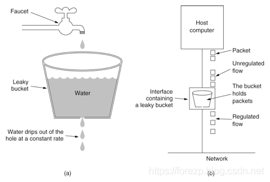
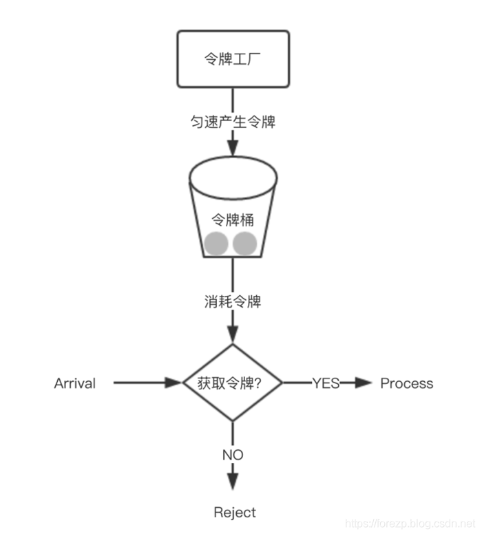
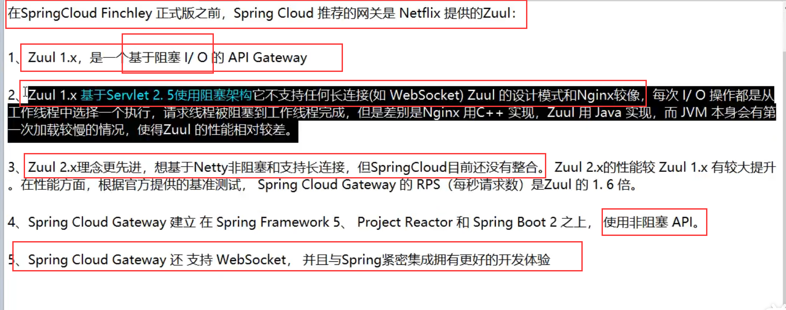
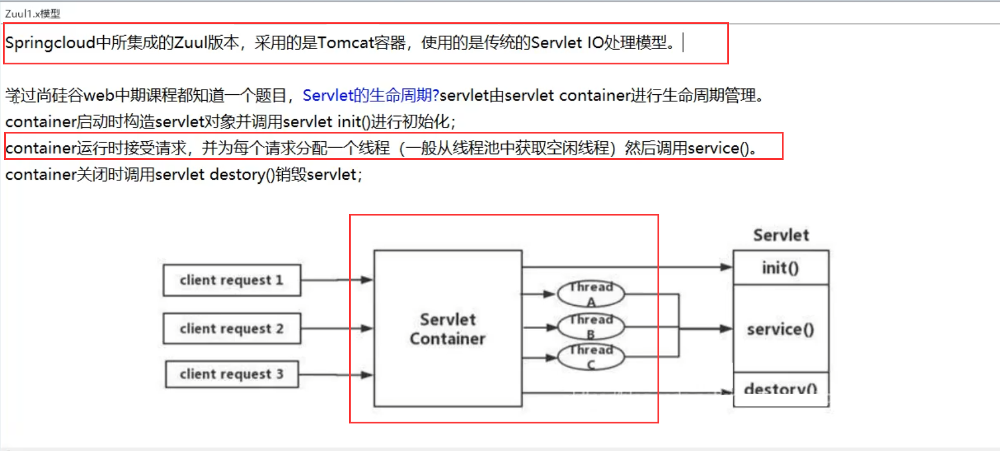
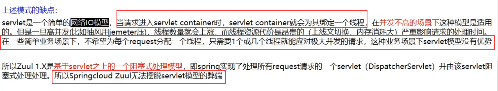
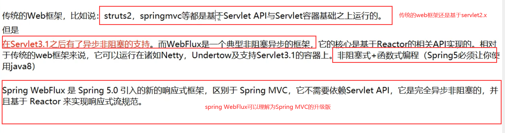

# 网关

## Spring Cloud Gateway

Spring Cloud Gateway 是 Spring Cloud 的一个全新项目，该项目是基于 Spring 5.0，Spring Boot 2.0 和 Project Reactor 等技术开发的网关，它旨在为微服务架构提供一种简单有效的统一的 API 路由管理方式。

Spring Cloud Gateway 作为 Spring Cloud 生态系统中的网关，目标是替代 Netflix Zuul，其不仅提供统一的路由方式，并且基于 Filter 链的方式提供了网关基本的功能，例如：安全，监控/指标，和限流。

- Route（路由）：这是网关的基本构建块。它由一个 ID，一个目标 URI，一组断言和一组过滤器定义。如果断言为真，则路由匹配。
- Predicate（断言）：这是一个 Java 8 的 Predicate。输入类型是一个 ServerWebExchange。我们可以使用它来匹配来自 HTTP 请求的任何内容，例如 headers 或参数。
- Filter（过滤器）：这是`org.springframework.cloud.gateway.filter.GatewayFilter`的实例，我们可以使用它修改请求和响应。

**工作流程：**


客户端向 Spring Cloud Gateway 发出请求。如果 Gateway Handler Mapping 中找到与请求相匹配的路由，将其发送到 Gateway Web Handler。Handler 再通过指定的过滤器链来将请求发送到我们实际的服务执行业务逻辑，然后返回。 过滤器之间用虚线分开是因为过滤器可能会在发送代理请求之前（“pre”）或之后（“post”）执行业务逻辑。

Spring Cloud Gateway 的特征：

- 基于 Spring Framework 5，Project Reactor 和 Spring Boot 2.0
- 动态路由
- Predicates 和 Filters 作用于特定路由
- 集成 Hystrix 断路器
- 集成 Spring Cloud DiscoveryClient
- 易于编写的 Predicates 和 Filters
- 限流
- 路径重写

### 路由规则

Spring Cloud Gateway 的功能很强大，我们仅仅通过 Predicates 的设计就可以看出来，前面我们只是使用了 predicates 进行了简单的条件匹配，其实 Spring Cloud Gataway 帮我们内置了很多 Predicates 功能。

Spring Cloud Gateway 是通过 Spring WebFlux 的 `HandlerMapping` 做为底层支持来匹配到转发路由，Spring Cloud Gateway 内置了很多 Predicates 工厂，这些 Predicates 工厂通过不同的 HTTP 请求参数来匹配，多个 Predicates 工厂可以组合使用。

#### Predicate 介绍

Predicate 来源于 Java 8，是 Java 8 中引入的一个函数，Predicate 接受一个输入参数，返回一个布尔值结果。该接口包含多种默认方法来将 Predicate 组合成其他复杂的逻辑（比如：与，或，非）。可以用于接口请求参数校验、判断新老数据是否有变化需要进行更新操作。

在 Spring Cloud Gateway 中 Spring 利用 Predicate 的特性实现了各种路由匹配规则，有通过 Header、请求参数等不同的条件来进行作为条件匹配到对应的路由。网上有一张图总结了 Spring Cloud 内置的几种 Predicate 的实现。


#### 通过时间匹配

Predicate 支持设置一个时间，在请求进行转发的时候，可以通过判断在这个时间之前或者之后进行转发。比如我们现在设置只有在2019年1月1日才会转发到我的网站，在这之前不进行转发，我就可以这样配置：

```
spring:
  cloud:
    gateway:
      routes:
       - id: time_route
        uri: http://ityouknow.com
        predicates:
         - After=2018-01-20T06:06:06+08:00[Asia/Shanghai]
```

Spring 是通过 ZonedDateTime 来对时间进行的对比，ZonedDateTime 是 Java 8 中日期时间功能里，用于表示带时区的日期与时间信息的类，ZonedDateTime 支持通过时区来设置时间，中国的时区是：`Asia/Shanghai`。

After Route Predicate 是指在这个时间之后的请求都转发到目标地址。上面的示例是指，请求时间在 2018年1月20日6点6分6秒之后的所有请求都转发到地址`http://ityouknow.com`。`+08:00`是指时间和UTC时间相差八个小时，时间地区为`Asia/Shanghai`。

添加完路由规则之后，访问地址`http://localhost:8080`会自动转发到`http://ityouknow.com`。

Before Route Predicate 刚好相反，在某个时间之前的请求的请求都进行转发。我们把上面路由规则中的 After 改为 Before，如下：

```
spring:
  cloud:
    gateway:
      routes:
       - id: after_route
        uri: http://ityouknow.com
        predicates:
         - Before=2018-01-20T06:06:06+08:00[Asia/Shanghai]
```

就表示在这个时间之前可以进行路由，在这时间之后停止路由，修改完之后重启项目再次访问地址`http://localhost:8080`，页面会报 404 没有找到地址。

除过在时间之前或者之后外，Gateway 还支持限制路由请求在某一个时间段范围内，可以使用 Between Route Predicate 来实现。

```
spring:
  cloud:
    gateway:
      routes:
       - id: after_route
        uri: http://ityouknow.com
        predicates:
         - Between=2018-01-20T06:06:06+08:00[Asia/Shanghai], 2019-01-20T06:06:06+08:00[Asia/Shanghai]
```

这样设置就意味着在这个时间段内可以匹配到此路由，超过这个时间段范围则不会进行匹配。通过时间匹配路由的功能很酷，可以用在限时抢购的一些场景中。

#### 通过 Cookie 匹配

Cookie Route Predicate 可以接收两个参数，一个是 Cookie name ,一个是正则表达式，路由规则会通过获取对应的 Cookie name 值和正则表达式去匹配，如果匹配上就会执行路由，如果没有匹配上则不执行。

```
spring:
  cloud:
    gateway:
      routes:
       - id: cookie_route
         uri: http://ityouknow.com
         predicates:
         - Cookie=ityouknow, kee.e
```

使用 curl 测试，命令行输入:

```
curl http://localhost:8080 --cookie "ityouknow=kee.e"
```

则会返回页面代码，如果去掉`--cookie "ityouknow=kee.e"`，后台汇报 404 错误。

#### 通过 Header 属性匹配

Header Route Predicate 和 Cookie Route Predicate 一样，也是接收 2 个参数，一个 header 中属性名称和一个正则表达式，这个属性值和正则表达式匹配则执行。

```
spring:
  cloud:
    gateway:
      routes:
      - id: header_route
        uri: http://ityouknow.com
        predicates:
        - Header=X-Request-Id, \d+
```

使用 curl 测试，命令行输入:

```
curl http://localhost:8080  -H "X-Request-Id:666666" 
```

则返回页面代码证明匹配成功。将参数`-H "X-Request-Id:666666"`改为`-H "X-Request-Id:neo"`再次执行时返回404证明没有匹配。

#### 通过 Host 匹配

Host Route Predicate 接收一组参数，一组匹配的域名列表，这个模板是一个 ant 分隔的模板，用`.`号作为分隔符。它通过参数中的主机地址作为匹配规则。

```
spring:
  cloud:
    gateway:
      routes:
      - id: host_route
        uri: http://ityouknow.com
        predicates:
        - Host=**.ityouknow.com
```

使用 curl 测试，命令行输入:

```
curl http://localhost:8080  -H "Host: www.ityouknow.com" 
curl http://localhost:8080  -H "Host: md.ityouknow.com" 
```

经测试以上两种 host 均可匹配到 host_route 路由，去掉 host 参数则会报 404 错误。

#### 通过请求方式匹配

可以通过是 POST、GET、PUT、DELETE 等不同的请求方式来进行路由。

```
spring:
  cloud:
    gateway:
      routes:
      - id: method_route
        uri: http://ityouknow.com
        predicates:
        - Method=GET
```

使用 curl 测试，命令行输入:

```
# curl 默认是以 GET 的方式去请求
curl http://localhost:8080
```

测试返回页面代码，证明匹配到路由，我们再以 POST 的方式请求测试。

```
# curl 默认是以 GET 的方式去请求
curl -X POST http://localhost:8080
```

返回 404 没有找到，证明没有匹配上路由

#### 通过请求路径匹配

Path Route Predicate 接收一个匹配路径的参数来判断是否走路由。

```
spring:
  cloud:
    gateway:
      routes:
      - id: host_route
        uri: http://ityouknow.com
        predicates:
        - Path=/foo/{segment}
```

如果请求路径符合要求，则此路由将匹配，例如：/foo/1 或者 /foo/bar。

使用 curl 测试，命令行输入:

```
curl http://localhost:8080/foo/1
curl http://localhost:8080/foo/xx
curl http://localhost:8080/boo/xx
```

经过测试第一和第二条命令可以正常获取到页面返回值，最后一个命令报404，证明路由是通过指定路由来匹配。

#### 通过请求参数匹配

Query Route Predicate 支持传入两个参数，一个是属性名一个为属性值，属性值可以是正则表达式。

```
spring:
  cloud:
    gateway:
      routes:
      - id: query_route
        uri: http://ityouknow.com
        predicates:
        - Query=smile
```

这样配置，只要请求中包含 smile 属性的参数即可匹配路由。

使用 curl 测试，命令行输入:

```
curl localhost:8080?smile=x&id=2
```

经过测试发现只要请求汇总带有 smile 参数即会匹配路由，不带 smile 参数则不会匹配。

还可以将 Query 的值以键值对的方式进行配置，这样在请求过来时会对属性值和正则进行匹配，匹配上才会走路由。

```
spring:
  cloud:
    gateway:
      routes:
      - id: query_route
        uri: http://ityouknow.com
        predicates:
        - Query=keep, pu.
```

这样只要当请求中包含 keep 属性并且参数值是以 pu 开头的长度为三位的字符串才会进行匹配和路由。

使用 curl 测试，命令行输入:

```
curl localhost:8080?keep=pub
```

测试可以返回页面代码，将 keep 的属性值改为 pubx 再次访问就会报 404,证明路由需要匹配正则表达式才会进行路由。

#### 通过请求 ip 地址进行匹配

Predicate 也支持通过设置某个 ip 区间号段的请求才会路由，RemoteAddr Route Predicate 接受 cidr 符号(IPv4 或 IPv6 )字符串的列表(最小大小为1)，例如 192.168.0.1/16 (其中 192.168.0.1 是 IP 地址，16 是子网掩码)。

```
spring:
  cloud:
    gateway:
      routes:
      - id: remoteaddr_route
        uri: http://ityouknow.com
        predicates:
        - RemoteAddr=192.168.1.1/24
```

可以将此地址设置为本机的 ip 地址进行测试。

```
curl localhost:8080
```

果请求的远程地址是 192.168.1.10，则此路由将匹配。

#### 组合使用

上面为了演示各个 Predicate 的使用，我们是单个单个进行配置测试，其实可以将各种 Predicate 组合起来一起使用。

例如：

```
spring:
  cloud:
    gateway:
      routes:
       - id: host_foo_path_headers_to_httpbin
        uri: http://ityouknow.com
        predicates:
        - Host=**.foo.org
        - Path=/headers
        - Method=GET
        - Header=X-Request-Id, \d+
        - Query=foo, ba.
        - Query=baz
        - Cookie=chocolate, ch.p
        - After=2018-01-20T06:06:06+08:00[Asia/Shanghai]
```

各种 Predicates 同时存在于同一个路由时，请求必须同时满足所有的条件才被这个路由匹配。

> 一个请求满足多个路由的谓词条件时，请求只会被首个成功匹配的路由转发

## 限流

### 突刺现象

常用的计数器算法采用计数器实现限流有点简单粗暴，一般我们会限制一秒钟的能够通过的请求数，比如限流qps为100，算法的实现思路就是从第一个请求进来开始计时，在接下去的1s内，每来一个请求，就把计数加1，如果累加的数字达到了100，那么后续的请求就会被全部拒绝。等到1s结束后，把计数恢复成0，重新开始计数。具体的实现可以是这样的：对于每次服务调用，可以通过AtomicLong#incrementAndGet()方法来给计数器加1并返回最新值，通过这个最新值和阈值进行比较。这种实现方式，相信大家都知道有一个弊端：如果我在单位时间1s内的前10ms，已经通过了100个请求，那后面的990ms，只能眼巴巴的把请求拒绝，我们把这种现象称为“突刺现象”

### 漏桶算法

漏桶算法为了消除"突刺现象"，可以采用漏桶算法实现限流，漏桶算法这个名字就很形象，算法内部有一个容器，类似生活用到的漏斗，当请求进来时，相当于水倒入漏斗，然后从下端小口慢慢匀速的流出。不管上面流量多大，下面流出的速度始终保持不变。不管服务调用方多么不稳定，通过漏桶算法进行限流，每10毫秒处理一次请求。因为处理的速度是固定的，请求进来的速度是未知的，可能突然进来很多请求，没来得及处理的请求就先放在桶里，既然是个桶，肯定是有容量上限，如果桶满了，那么新进来的请求就丢弃。



在算法实现方面，可以准备一个队列，用来保存请求，另外通过一个线程池（ScheduledExecutorService）来定期从队列中获取请求并执行，可以一次性获取多个并发执行。

这种算法，在使用过后也存在弊端：无法应对短时间的突发流量。

### 令牌桶算法

从某种意义上讲，令牌桶算法是对漏桶算法的一种改进，桶算法能够限制请求调用的速率，而令牌桶算法能够在限制调用的平均速率的同时还允许一定程度的突发调用。在令牌桶算法中，存在一个桶，用来存放固定数量的令牌。算法中存在一种机制，以一定的速率往桶中放令牌。每次请求调用需要先获取令牌，只有拿到令牌，才有机会继续执行，否则选择等待可用的令牌、或者直接拒绝。

**令牌桶分为2个动作，动作1(固定速率往桶中存入令牌)、动作2(客户端如果想访问请求，先从桶中获取token)**

**流入：以固定速率从桶中流入水滴
流出：按照任意速率从桶中流出水滴**

技术上使用Google开源工具包Guava提供了限流工具类RateLimiter，该类基于令牌桶算法来完成限流，非常易于使用
**优点：支持大的并发，有效利用网络带宽**

### 限流配置

在Spring Cloud Gateway中，有Filter过滤器，因此可以在“pre”类型的Filter中自行实现上述三种过滤器。但是限流作为网关最基本的功能，Spring Cloud Gateway官方就提供了RequestRateLimiterGatewayFilterFactory这个类，适用Redis和lua脚本实现了令牌桶的方式。具体实现逻辑在RequestRateLimiterGatewayFilterFactory类中

首先在工程的pom文件中引入gateway的起步依赖和redis的reactive依赖，代码如下：

```xml
<dependency>
    <groupId>org.springframework.cloud</groupId>
    <artifactId>spring-cloud-starter-gateway</artifactId>
</dependency>

<dependency>
    <groupId>org.springframework.boot</groupId>
    <artifatId>spring-boot-starter-data-redis-reactive</artifactId>
</dependency>
```

在配置文件中做以下的配置：

```yml
spring:
  application:
    name: cloud-gateway-eureka
  redis:
    host: localhost
    password:
    port: 6379
  cloud:
    gateway:
     discovery:
        locator:
         enabled: true
     routes:
     - id: requestratelimiter_route
       uri: http://example.org
       filters:
       - name: RequestRateLimiter
         args:
           redis-rate-limiter.replenishRate: 10
           redis-rate-limiter.burstCapacity: 20
           key-resolver: "#{@userKeyResolver}"
       predicates:
         - Method=GET
```

- filter 名称必须是 RequestRateLimiter
- redis-rate-limiter.replenishRate：允许用户每秒处理多少个请求
- redis-rate-limiter.burstCapacity：令牌桶的容量，允许在一秒钟内完成的最大请求数
- key-resolver：使用 SpEL 按名称引用 bean

项目中设置限流的策略，创建 Config 类。

```java
import org.springframework.cloud.gateway.filter.ratelimit.KeyResolver;
import org.springframework.cloud.gateway.filter.ratelimit.RedisRateLimiter;
import org.springframework.context.annotation.Bean;
import org.springframework.context.annotation.Configuration;
import org.springframework.context.annotation.Primary;
import reactor.core.publisher.Mono;

@Configuration
public class HostAddrKeyResolver {

    //限流策略数据存储在redis中
    @Bean("redisRateLimiter")
    @Primary
    public RedisRateLimiter redisRateLimiter(){
        return new RedisRateLimiter(1,1);
    }

    //基于IP地址进行限流
    @Bean("remoteAddrKeyResolver")
    @Primary
    public KeyResolver remoteAddrKeyResolver() {
        return exchange -> Mono.just(exchange.getRequest().getRemoteAddress().getAddress().getHostAddress());
    }

    //基于hostName地址进行限流
    @Bean("remoteHostNameKeyResolver")
    @Primary
    public KeyResolver remoteHostNameKeyResolver() {
        return exchange -> Mono.just(exchange.getRequest().getRemoteAddress().getAddress().getHostName());
    }

    //根据请求参数进行限流
    @Bean("remoteUserKeyResolver")
    @Primary
    public KeyResolver remoteUserKeyResolver() {
        return exchange -> Mono.just(exchange.getRequest().getQueryParams().getFirst("user"));
    }

}
```

3、限流配置类

这里我们采用了配置的方式，替代了在yml里面进行配置，在之前我们有过介绍，最后只需要将上面的限流策略配置类配置到filter里面即可生效

```java
import org.springframework.beans.factory.annotation.Autowired;
import org.springframework.cloud.gateway.filter.ratelimit.KeyResolver;
import org.springframework.cloud.gateway.filter.ratelimit.RateLimiter;
import org.springframework.cloud.gateway.route.RouteLocator;
import org.springframework.cloud.gateway.route.builder.RouteLocatorBuilder;
import org.springframework.context.annotation.Bean;
import org.springframework.context.annotation.Configuration;
import org.springframework.core.annotation.Order;
import org.springframework.http.HttpStatus;

@Configuration
public class GatewayConfiguration {

    //@Autowired
    //private AuthFilter authFilter;

    @Autowired
    private KeyResolver remoteAddrKeyResolver;

    @Autowired
    private RateLimiter redisRateLimiter;

    @Bean
    @Order
    public RouteLocator routeLocator(RouteLocatorBuilder builder) {
        return builder.routes()
                //多个路由规则就添加多个route
                .route(r ->
                        r.path("/pay/payment/**")
                                .filters(f ->
                                        f.stripPrefix(1).
                                        //添加自定义的filter
                                        requestRateLimiter(c -> {
                                            c.setKeyResolver(remoteAddrKeyResolver);
                                            c.setRateLimiter(redisRateLimiter);
                                            c.setStatusCode(HttpStatus.BAD_GATEWAY);
                                        })
                                )
                                .uri("lb://cloud-payment-service")
                ).build();
    }
}
```


## 熔断

Spring Cloud Gateway 也可以利用 Hystrix 的熔断特性，在流量过大时进行服务降级，同样我们还是首先给项目添加上依赖。

```xml
<dependency>
  <groupId>org.springframework.cloud</groupId>
  <artifactId>spring-cloud-starter-netflix-hystrix</artifactId>
</dependency>
```

配置示例

```yml
spring:
  cloud:
    gateway:
      routes:
      - id: hystrix_route
        uri: http://example.org
        filters:
        - Hystrix=myCommandName
```

配置后，gateway 将使用 myCommandName 作为名称生成 HystrixCommand 对象来进行熔断管理。如果想添加熔断后的回调内容，需要在添加一些配置。

```yml
spring:
  cloud:
    gateway:
      routes:
      - id: hystrix_route
        uri: lb://spring-cloud-producer
        predicates:
        - Path=/consumingserviceendpoint
        filters:
        - name: Hystrix
          args:
            name: fallbackcmd
            fallbackUri: forward:/incaseoffailureusethis
```

`fallbackUri: forward:/incaseoffailureusethis`配置了 fallback 时要会调的路径，当调用 Hystrix 的 fallback 被调用时，请求将转发到`/incaseoffailureuset`这个 URI。

## 重试

RetryGatewayFilter 是 Spring Cloud Gateway 对请求重试提供的一个 GatewayFilter Factory

配置示例：

```yml
spring:
  cloud:
    gateway:
      routes:
      - id: retry_test
        uri: lb://spring-cloud-producer
        predicates:
        - Path=/retry
        filters:
        - name: Retry
          args:
            retries: 3
            statuses: BAD_GATEWAY
```

Retry GatewayFilter 通过这四个参数来控制重试机制： retries, statuses, methods, 和 series。

- retries：重试次数，默认值是 3 次
- statuses：HTTP 的状态返回码，取值请参考：`org.springframework.http.HttpStatus`
- methods：指定哪些方法的请求需要进行重试逻辑，默认值是 GET 方法，取值参考：`org.springframework.http.HttpMethod`
- series：一些列的状态码配置，取值参考：`org.springframework.http.HttpStatus.Series`。符合的某段状态码才会进行重试逻辑，默认值是 SERVER_ERROR，值是 5，也就是 5XX(5 开头的状态码)，共有5 个值。

## Gateway与zuul1.x的区别



### Zuul1.x模型







**WebFlux是一个典型非阻塞异步的框架**，它的核心是基于Reactor的相关API实现的。相对于传统的web框架来说，**它可以运行在诸如Netty，Undertow及支持Servlet3.1的容器上**。

根据官方的说法，**webflux主要在如下两方面体现出独有的优势**：

**1）非阻塞式**

> 其实在servlet3.1提供了非阻塞的API，WebFlux提供了一种比其更完美的解决方案。使用非阻塞的方式可以利用较小的线程或硬件资源来处理并发进而提高其可伸缩性

**2) 函数式编程端点**

> 老生常谈的编程方式了，Spring5必须让你使用java8，那么函数式编程就是java8重要的特点之一，而WebFlux支持函数式编程来定义路由端点处理请求。