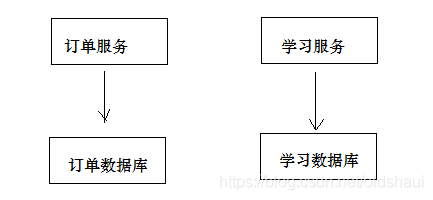
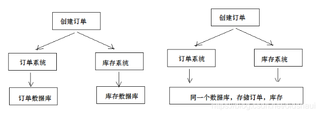
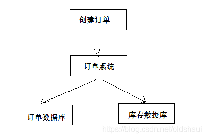
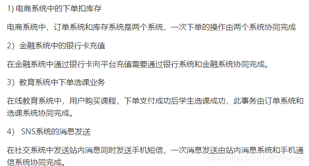
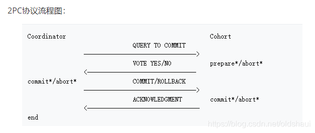
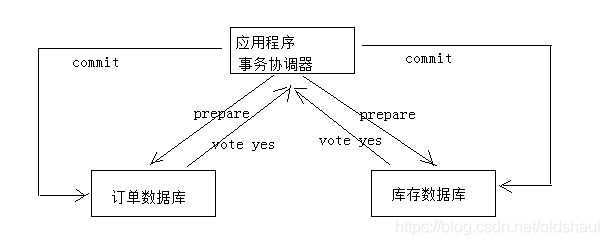
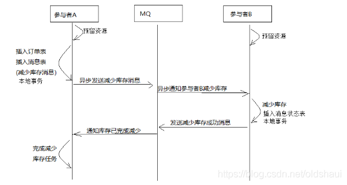
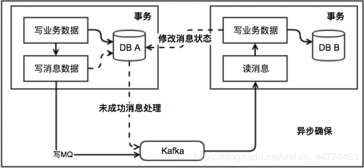

# 分布式事务原理

## 前言

1.由于最近在学习springcloud的项目，现在互联网下，分布式，微服务横行，难免会遇到分布式下的事务问题，这是一个难点，也是面试经常问的，别面试官一看你简历，都是微服务项目，问你了解啥是分布式事务不，你来句没有，这就很尴尬了，当然微服务下可能没有分布式事务，但是很多场景是需要分布式事务的，下面我就来介绍下什么是分布式事务，和分布式事务的解决方案

## 问题描述

在介绍分布式事务下，下面我们先来了解一个常见应用场景，这个场景(类似慕课网购买付费课程)也是我后面要讲的分布式事务的解决方案的案例

用户支付完成会将支付状态及订单状态保存在订单数据库中，由订单服务去维护订单数据库。而学生选课信息在学习中心数据库，由学习服务去维护学习中心数据库的信息。下图是系统结构图：

如何实现两个分布式服务（订单服务、学习服务）共同完成一件事即订单支付成功自动添加学生选课的需求，这里的关键是如何保证两个分布式服务的事务的一致性。

尝试解决上边的需求，在订单服务中远程调用选课接口，伪代码如下：

下面我们分析下这种解决方案的问题

1.更新支付表状态为本地数据库操作。
2.远程调用选课接口为网络远程调用请求
3.为保存事务上边两步操作由spring控制事务，当遇到Exception异常则回滚本地数据库操作。
问题如下：
1、如果更新支付表失败则抛出异常，不再执行远程调用，此设想没有问题。
2、如果更新支付表成功，网络远程调用超时会拉长本地数据库事务时间，影响数据库性能。（远程调用非常耗时的哦）
3、如果更新支付表成功，远程调用添加选课成功（选课数据库commit成功），最后更新支付表commit失败，此时出现操作不一致。
上面的问题就涉及到了分布式事务的控制

## 什么是分布式事务

### 什么是分布式系统

部署在不同结点上的系统通过网络交互来完成协同工作的系统
比如：充值加积分的业务，用户在充值系统向自己的账户充钱，在积分系统中自己积分相应的增加。充值系统和积分系统是两个不同的系统，一次充值加积分的业务就需要这两个系统协同工作来完成。

### 什么是事务

事务是指由一组操作组成的一个工作单元，这个工作单元具有原子性（atomicity）、一致性（consistency）、隔离性（isolation）和持久性（durability）。
原子性：执行单元中的操作要么全部执行成功，要么全部失败。如果有一部分成功一部分失败那么成功的操作要全部回滚到执行前的状态。
一致性：执行一次事务会使用数据从一个正确的状态转换到另一个正确的状态，执行前后数据都是完整的。 隔离性：在该事务执行的过程中，任何数据的改变只存在于该事务之中，对外界没有影响，事务与事务之间是完全的隔离的。只有事务提交后其它事务才可以查询到最新的数据。
持久性：事务完成后对数据的改变会永久性的存储起来，即使发生断电宕机数据依然在。

### 什么是本地事务

本地事务就是用关系数据库来控制事务，关系数据库通常都具有ACID特性，传统的单体应用通常会将数据全部存储在一个数据库中，会借助关系数据库来完成事务控制。

### 什么是分布式事务

在分布式系统中一次操作由多个系统协同完成，这种一次事务操作涉及多个系统通过网络协同完成的过程称为分布式事务。这里强调的是多个系统通过网络协同完成一个事务的过程，并不强调多个系统访问了不同的数据库，即使多个系统访问的是同一个数据库

也是分布式事务，如下图：
另外一种分布式事务的表现是，一个应用程序使用了多个数据源连接了不同的数据库，当一次事务需要操作多个数据源，此时也属于分布式事务，当系统作了数据库拆分后会出现此种情况

## 分布式事务的应用场景

## 分布式事务的解决方案（介绍其中三种）

### 两阶段提交协议（2PC）

为解决分布式系统的数据一致性问题出现了两阶段提交协议（2 Phase Commitment Protocol），两阶段提交由协调者和参与者组成，共经过两个阶段和三个操作，部分关系数据库如Oracle、MySQL支持两阶段提交协议，本节讲解关系数据库两阶段提交协议。
参考：2PC：https://en.wikipedia.org/wiki/Two-phase_commit_protocol

1）第一阶段：准备阶段（prepare）
协调者通知参与者准备提交订单，参与者开始投票。
协调者完成准备工作向协调者回应Yes。
2）第二阶段：提交(commit)/回滚(rollback)阶段
协调者根据参与者的投票结果发起最终的提交指令。
如果有参与者没有准备好则发起回滚指令。
一个下单减库存的例子：

2、应用程序通过事务协调器向两个库发起prepare，两个数据库收到消息分别执行本地事务（记录日志），但不提交，如果执行成功则回复yes，否则回复no。
3、事务协调器收到回复，只要有一方回复no则分别向参与者发起回滚事务，参与者开始回滚事务。
4、事务协调器收到回复，全部回复yes，此时向参与者发起提交事务。如果参与者有一方提交事务失败则由事务协调器发起回滚事务。
2PC的优点：实现强一致性，部分关系数据库支持（Oracle、MySQL等）。
缺点：整个事务的执行需要由协调者在多个节点之间去协调，增加了事务的执行时间，性能低下。
解决方案有：springboot+Atomikos or Bitronix

### 什么是幂等性？

幂等性是指同一个操作无论请求多少次，其结果都相同。
幂等操作实现方式有：
1、操作之前在业务方法进行判断如果执行过了就不再执行。
2、缓存所有请求和处理的结果，已经处理的请求则直接返回结果。
3、在数据库表中加一个状态字段（未处理，已处理），数据操作时判断未处理时再处理。

### 事务补偿（TCC）

TCC事务补偿是基于2PC实现的业务层事务控制方案，它是Try、Confirm和Cancel三个单词的首字母，含义如下：
1、Try 检查及预留业务资源完成提交事务前的检查，并预留好资源。
2、Confirm 确定执行业务操作
对try阶段预留的资源正式执行。
3、Cancel 取消执行业务操作
对try阶段预留的资源释放。
下边用一个下单减库存的业务为例来说明

1、Try
下单业务由订单服务和库存服务协同完成，在try阶段订单服务和库存服务完成检查和预留资源。
订单服务检查当前是否满足提交订单的条件（比如：当前存在未完成订单的不允许提交新订单）。
库存服务检查当前是否有充足的库存，并锁定资源。
2、Confirm
订单服务和库存服务成功完成Try后开始正式执行资源操作。
订单服务向订单写一条订单信息。
库存服务减去库存。
3、Cancel
如果订单服务和库存服务有一方出现失败则全部取消操作。
订单服务需要删除新增的订单信息。
库存服务将减去的库存再还原。
优点：最终保证数据的一致性，在业务层实现事务控制，灵活性好。
缺点：开发成本高，每个事务操作每个参与者都需要实现try/confirm/cancel三个接口。
注意：TCC的try/confirm/cancel接口都要实现幂等性，在为在try、confirm、cancel失败后要不断重试。

实际上可以理解为，商品剩余量由两个字段计算组成 可购买剩余库存-预占库存，可购买剩余库存 + 预占库存 = 总库存

当下单后预占库存 + 1，可购买剩余库存 - 1（总库存实际上没变化）。当下单两系统都真正操作成功做，预占库存 - 1（此时相当于总库存减少1），否则就将预占库存 - 1，可购买剩余库存 + 1（相当于可购买剩余库存回滚，总库存不变）。

用户看到的库存数量实际上是可购买剩余库存，而非总库存

### 消息队列实现最终一致(我的解决方案)

本方案是将分布式事务拆分成多个本地事务来完成，并且由消息队列异步协调完成，如下图：
下边以下单减少库存为例来说明：

点击购买

1.订单系统新建订单信息，redis插入消息信息

2.给库存系统发送预占库存消息

3.库存系统判断可购买剩余库存是否大于0，如果大于0则可购买剩余库存 - 1.预占库存 + 1,修改消息信息

4.发消息给订单系统，预占库存成功。订单系统监听消息信息，如果修改，则证明库存系统处理完成，订单状态修改为待付款。

点击付款，付款成功

1.修改订单状态为已付款

2.给库存系统发送消息，真正减少库存

3.库存系统将预占库存 - 1

4.发消息给订单系统，真正库存减少成功

5.订单状态修改为已支付、库存减少成功

### 本地消息表（异步确保）（业界使用最多）

本地消息表这种实现方式应该是业界使用最多的，其核心思想是将分布式事务拆分成本地事务进行处理，这种思路是来源于ebay。我们可以从下面的流程图中看出其中的一些细节：

基本思路就是：

消息生产方，需要额外建一个消息表，并记录消息发送状态。消息表和业务数据要在一个事务里提交，也就是说他们要在一个数据库里面。然后消息会经过MQ发送到消息的消费方。如果消息发送失败，会进行重试发送。

消息消费方，需要处理这个消息，并完成自己的业务逻辑。此时如果本地事务处理成功，表明已经处理成功了，如果处理失败，那么就会重试执行。如果是业务上面的失败，可以给生产方发送一个业务补偿消息，通知生产方进行回滚等操作。

生产方和消费方定时扫描本地消息表，把还没处理完成的消息或者失败的消息再发送一遍。如果有靠谱的自动对账补账逻辑，这种方案还是非常实用的。

这种方案遵循BASE理论，采用的是最终一致性，笔者认为是这几种方案里面比较适合实际业务场景的，即不会出现像2PC那样复杂的实现(当调用链很长的时候，2PC的可用性是非常低的)，也不会像TCC那样可能出现确认或者回滚不了的情况。

优点： 一种非常经典的实现，避免了分布式事务，实现了最终一致性。在 .NET中 有现成的解决方案。

缺点： 消息表会耦合到业务系统中，如果没有封装好的解决方案，会有很多杂活需要处理。

以上各种分布式事务对比分析:

### 各种方案的优缺点

2PC 最大的诟病是一个阻塞协议。RM在执行分支事务后需要等待TM的决定，此时服务会阻塞并锁定资源。由于其阻塞机制和最差时间复杂度高， 因此，这种设计不能适应随着事务涉及的服务数量增加而扩展的需要，很难用于并发较高以及子事务生命周期较长 (long-running transactions) 的分布式服务中。
如果拿TCC事务的处理流程与2PC两阶段提交做比较，2PC通常都是在跨库的DB层面，而TCC则在应用层面的处理，需要通过业务逻辑来实现。这种分布式事务的实现方式的优势在于，可以让应用自己定义数据操作的粒度，使得降低锁冲突、提高吞吐量成为可能。而不足之处则在于对应用的侵入性非常强，业务逻辑的每个分支都需要实现try、confirm、cancel三个操作。此外，其实现难度也比较大，需要按照网络状态、系统故障等不同的失败原因实现不同的回滚策略。典型的使用场景：满，登录送优惠券等。
可靠消息最终一致性事务适合执行周期长且实时性要求不高的场景。引入消息机制后，同步的事务操作变为基于消息执行的异步操作, 避免了分布式事务中的同步阻塞操作的影响，并实现了两个服务的解耦。典型的使用场景：注册送积分，登录送优惠券等。
最大努力通知是分布式事务中要求最低的一种,适用于一些最终一致性时间敏感度低的业务；允许发起通知方处理业务失败，在接收通知方收到通知后积极进行失败处理，无论发起通知方如何处理结果都会不影响到接收通知方的后续处理；发起通知方需提供查询执行情况接口，用于接收通知方校对结果。典型的使用场景：银行通知、支付结果通知等。

|            | 2PC      | TCC      | 可靠消息 | 最大努力通知 |
| ---------- | -------- | -------- | -------- | ------------ |
| 一致性     | 强一致性 | 最终一致 | 最终一致 | 最终一致     |
| 吞吐量     | 低       | 中       | 高       | 高           |
| 实现复杂度 | 易       | 难       | 中       | 易           |

总结：
在条件允许的情况下，我们尽可能选择本地事务单数据源，因为它减少了网络交互带来的性能损耗，且避免了数据弱一致性带来的种种问题。若某系统频繁且不合理的使用分布式事务，应首先从整体设计角度观察服务的拆分是否合理，是否高内聚低耦合？是否粒度太小？分布式事务一直是业界难题，因为网络的不确定性，而且我们习惯于拿分布式事务与单机事务ACID做对比。
无论是数据库层的XA、还是应用层TCC、可靠消息、最大努力通知等方案，都没有完美解决分布式事务问题，它们不过是各自在性能、一致性、可用性等方面做取舍，寻求某些场景偏好下的权衡。