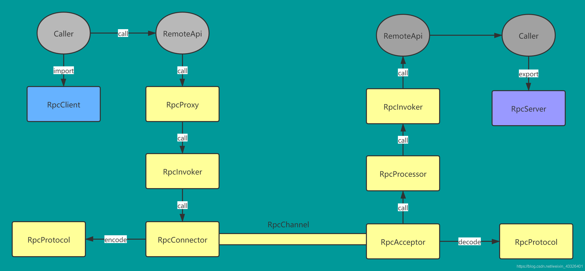
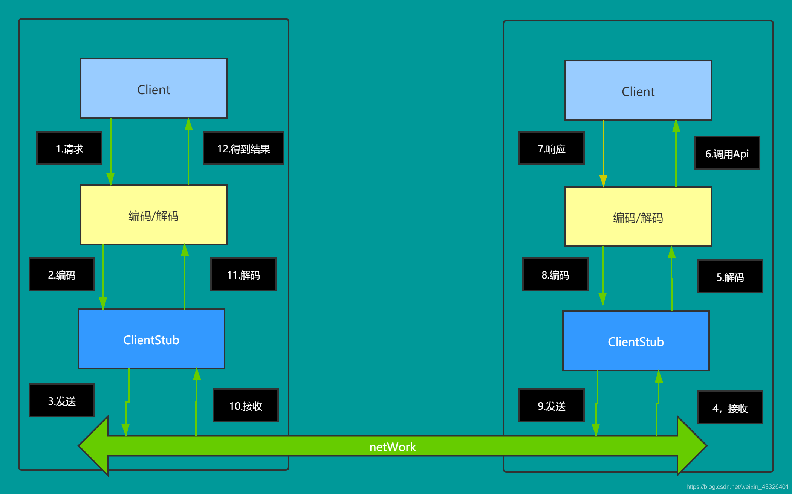
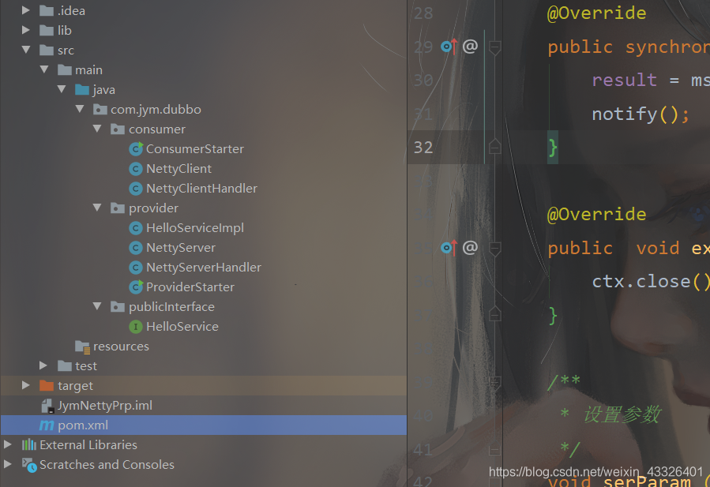
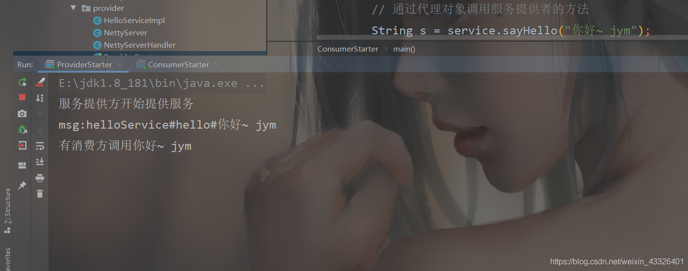
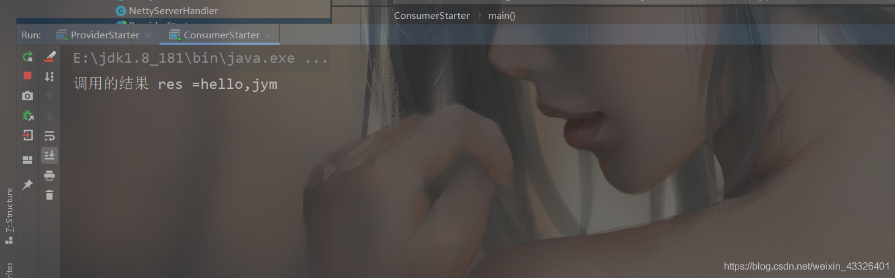

# Netty

## 使用Netty实现Dubbo RPC

### RPC基本介绍

1. 远程过程调用，是一个计算机通信协议。该协议允许运行于一台计算机的程序调用另一台计算机的子程序，而程序员无需额外地为这个交互作用编程
2. 两个或者多个应用程序都分布在不同的服务器上，他们之前的调用都像是本地方法调用一样
3. 在RPC中，Client叫服务消费者，Server叫服务提供者
4. 常用的PRC 框架：比较知名的 Dubbo,gRPC,Spring Cloud



### 基于netty 实现dubbo Rpc

大致的流程图：



1. 服务消费方(client)以本地调用方式调用服务
2. client stub 接收到调用后负责将方法，参数等封装成能够进行网络传输的消息体
3. client stub 将消息进行编码并发送到服务端
4. server stub 收到消息后进行解码
5. server stub 根据解码结果调用本地的服务
6. 本地服务执行并将结果返回给server stub
7. server stub 将返回导入结果进行编码并发送至消费方
8. client stub 接收到消息并进行解码
9. 服务消费方(client)得到结果

实现思路：因为是在客户端(消费者)调用的时候去请求连接，所以需要代理，去请求服务端，当客户端去访问服务端，然后服务端将结果返回时，是一个过程，所以需要wait处理，当结果返回时，notify,而且调用的是服务的接口，所以，还需要有公用的接口,而且双方还要规定好调用的协议。
实现代码:
这次的项目是个maven项目
pom:只需要一个netty的依赖即可

```xml
<dependency>
   	<groupId>io.netty</groupId>
    <artifactId>netty-all</artifactId>
    <version>4.1.20.Final</version>
</dependency>
```

项目结构:



公共接口

```java
package com.jym.dubbo.publicInterface;

/**
 * @program: JymNettyPrp
 * @description: 接口，服务提供方和消费方都需要
 * @author: jym
 * @create: 2020/02/14
 */
public interface HelloService {
    String sayHello(String message);
}
```

服务端：
**provider(生产者):** 需要对公共接口的方法进行实现，供消费方调用
服务实现类:

```java
package com.jym.dubbo.provider;

import com.jym.dubbo.publicInterface.HelloService;

/**
 * @program: JymNettyPrp
 * @description: 生产者提供的Api
 * @author: jym
 * @create: 2020/02/14
 */
public class HelloServiceImpl implements HelloService {
    /**
     * @description: 当消费者调用该方法时，就返回一个结果
     * @param message 消费方发送的消息
     * @return 返回结果
     */
    @Override
    public String sayHello(String message) {
        System.out.println("有消费方调用"+message);
        if (message!=null){
            return "hello,jym";
        } else {
            return "你想干点啥？";
        }
    }
}
```

netty的服务类：提供一个静态方法，启动netty

```java
package com.jym.dubbo.provider;

import io.netty.bootstrap.ServerBootstrap;
import io.netty.channel.*;
import io.netty.channel.nio.NioEventLoopGroup;
import io.netty.channel.socket.SocketChannel;
import io.netty.channel.socket.nio.NioServerSocketChannel;
import io.netty.handler.codec.string.StringDecoder;
import io.netty.handler.codec.string.StringEncoder;

/**
 * @program: JymNettyPrp
 * @description:
 * @author: jym
 * @create: 2020/02/14
 */
public class NettyServer {

    /**
     * NettyServer的初始化和启动的任务
     */
    private static void run(String hostName, int port) {
        EventLoopGroup bossGroup = new NioEventLoopGroup(1);
        EventLoopGroup workerGroup = new NioEventLoopGroup();

        try {
            ServerBootstrap serverBootstrap = new ServerBootstrap();
            serverBootstrap.group(bossGroup,workerGroup).channel(NioServerSocketChannel.class)
                    .option(ChannelOption.SO_BACKLOG,128)
                    .childOption(ChannelOption.SO_KEEPALIVE,true)
                    .childHandler(new ChannelInitializer<SocketChannel>() {
                        @Override
                        protected void initChannel(SocketChannel socketChannel) throws Exception {
                            ChannelPipeline pipeline = socketChannel.pipeline();
                            pipeline.addLast(new StringEncoder());
                            pipeline.addLast(new StringDecoder());
                            pipeline.addLast(new NettyServerHandler());
                        }
                    });

            ChannelFuture channelFuture = serverBootstrap.bind(hostName, port).sync();
            System.out.println("服务提供方开始提供服务");
            channelFuture.channel().closeFuture().sync();
        } catch (Exception e) {
            e.printStackTrace();
        } finally {
            bossGroup.shutdownGracefully();
            workerGroup.shutdownGracefully();
        }

    }

    public static void startServer (String hostName, int port) {
        run(hostName,port);
    }

}
```

服务端handler：判断是否符合协议要求，如果符合，则调用Api

```java
package com.jym.dubbo.provider;

import io.netty.channel.ChannelHandlerContext;
import io.netty.channel.ChannelInboundHandlerAdapter;

/**
 * @program: JymNettyPrp
 * @description:
 * @author: jym
 * @create: 2020/02/14
 */
public class NettyServerHandler extends ChannelInboundHandlerAdapter {

    @Override
    public void channelRead(ChannelHandlerContext ctx, Object msg) throws Exception {
        // 获取客户端(消费者)的消息，并调用服务
        System.out.println("msg:"+msg);
        // 客户端在调用服务端api时，需要定义一个协议
        // 比如我们要求 每次发消息都必须以某个字符串开头 "helloService#hello#"
        if(msg.toString().startsWith("helloService#hello#")) {
            String s = new HelloServiceImpl().sayHello(msg.toString().substring(msg.toString().lastIndexOf("#")+1));
            ctx.writeAndFlush(s);
        }
    }

    @Override
    public void exceptionCaught(ChannelHandlerContext ctx, Throwable cause) throws Exception {
        ctx.close();
    }
}
```

**启动类**：一个main方法

```java
package com.jym.dubbo.provider;

/**
 * @program: JymNettyPrp
 * @description: 启动生产者（服务提供者）
 * @author: jym
 * @create: 2020/02/14
 */
public class ProviderStarter {
    public static void main(String[] args) {
        NettyServer.startServer("127.0.0.1",6668);
    }
}
```

客户端
**客户端handler**：因为调用的时候，需要等待调用结果，再将结果返回，这需要一个过程，所以需要用到线程等待 wait notify方法

```java
package com.jym.dubbo.consumer;

import io.netty.channel.ChannelHandlerContext;
import io.netty.channel.ChannelInboundHandlerAdapter;

import java.util.concurrent.Callable;

/**
 * @program: JymNettyPrp
 * @description:
 * @author: jym
 * @create: 2020/02/14
 */
public class NettyClientHandler extends ChannelInboundHandlerAdapter implements Callable {

    private ChannelHandlerContext context;
    // 调用方法返回的结果
    private String result;
    // 调用方法时，传入的参数
    private String param;

    @Override
    public void channelActive(ChannelHandlerContext ctx) throws Exception {
        // 在其他方法会使用带ctx
        context = ctx;
    }

    @Override
    public synchronized void channelRead(ChannelHandlerContext ctx, Object msg) throws Exception {
        result = msg.toString();
        notify();
    }

    @Override
    public  void exceptionCaught(ChannelHandlerContext ctx, Throwable cause) throws Exception {
        ctx.close();
    }

    /**
     * 设置参数
     */
    void serParam (String param) {
        this.param = param;
    }


    /**
     * 被代理对象调用，发送数据给服务器 -> wait -> 等待被唤醒(channelRead) -> 返回结果
     */
    @Override
    public synchronized Object call() throws Exception {
        context.writeAndFlush(param);
        // 进行 wait,等待channelRead获取到服务器的结果
        wait();
        // 返回结果
        return result;
    }
}
```

这里定义了一个ChannelHandlerContext变量，因为在run方法中会用得到

其主要流程为:

1. 当客户端与服务端连接的时候，调用了handler的channelActive方法，初始化了类的context属性
2. 然后通过setParam设置请求的参数，响应头等 。
3. 通过call方法，向服务器发送请求的消息，并调用wait()方法，让该线程等待结果
4. 服务端接受消息，将调用结果返回，通过handler的channelRead方法将结果赋值给result，并唤醒等待的线程(notify)
5. 等待线程的run方法唤醒后，将 result返回(return)

**netty客户端： 因为客户端需要调用的时候去启动，所以需要用到代理，以及线程池**

```java
package com.jym.dubbo.consumer;

import io.netty.bootstrap.Bootstrap;
import io.netty.channel.*;
import io.netty.channel.nio.NioEventLoopGroup;
import io.netty.channel.socket.SocketChannel;
import io.netty.channel.socket.nio.NioSocketChannel;
import io.netty.handler.codec.string.StringDecoder;
import io.netty.handler.codec.string.StringEncoder;

import java.lang.reflect.Proxy;
import java.util.concurrent.ExecutorService;
import java.util.concurrent.Executors;

/**
 * @program: JymNettyPrp
 * @description:
 * @author: jym
 * @create: 2020/02/14
 */
public class NettyClient {

    // 创建线程池
    private static ExecutorService executorService = Executors
            .newFixedThreadPool(Runtime.getRuntime().availableProcessors());

    private static NettyClientHandler nettyClientHandler;

    /**
     * 编写方法，使用代理模式，获取一个代理对象
     */
    public Object getBean(final Class<?> serviceClass, final String providerName) {
        return Proxy.newProxyInstance(Thread.currentThread().getContextClassLoader(),
                new Class<?>[] {serviceClass},(proxy,method,args) ->{
                    if(nettyClientHandler == null){
                        initClient();
                    }
                    // 设置参数，要发给服务区端的信息 providerName就是协议头
                    nettyClientHandler.serParam(providerName + args[0]);
                    return executorService.submit(nettyClientHandler).get();
                });
    }


    /**
     * 初始化客户端
     */
    private static void initClient() {
        nettyClientHandler = new NettyClientHandler();

        EventLoopGroup group = new NioEventLoopGroup();

        Bootstrap bootstrap = new Bootstrap();
        bootstrap.group(group)
                .channel(NioSocketChannel.class)
                .option(ChannelOption.TCP_NODELAY,true)
                .handler(new ChannelInitializer<SocketChannel>() {
                    @Override
                    protected void initChannel(SocketChannel socketChannel) throws Exception {
                        ChannelPipeline pipeline = socketChannel.pipeline();
                        pipeline.addLast(new StringDecoder());
                        pipeline.addLast(new StringEncoder());
                        pipeline.addLast(nettyClientHandler);
                    }
                });
        try {
            ChannelFuture sync = bootstrap.connect("127.0.0.1",6668).sync();
        } catch (Exception e) {
            e.printStackTrace();
        }


    }

}
```

==当客户端调用服务的时候，会拿到一个代理对象，通过代理对象去执行getBean方法。
executorService.submit(nettyClientHandler).get()方法是取得实现callable接口 call方法的返回值，也就是调用服务的结果 ==
**客户端启动类: 取得代理对象，并调用服务**

```java
package com.jym.dubbo.consumer;

import com.jym.dubbo.publicInterface.HelloService;

/**
 * @program: JymNettyPrp
 * @description: 消费者启动类
 * @author: jym
 * @create: 2020/02/15
 */
public class ConsumerStarter {

    // 定义协议头
    public static final String providerName = "helloService#hello#";

    public static void main(String[] args) {
        // 创建一个消费者
        NettyClient consumer = new NettyClient();

        // 创建代理对象
        HelloService service = (HelloService)consumer.getBean(HelloService.class, providerName);

        // 通过代理对象调用服务提供者的方法
        String s = service.sayHello("你好~ jym");
        System.out.println("调用的结果 res =" +s);
    }
}
```

结果：

启动服务端，然后在启动我们的客户端，结果为:




