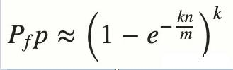

# 布隆过滤器

Redis缓存穿透可以通过布隆过滤器进行解决，那么什么是布隆过滤器呢？请往下看。
通常你判断某个元素是否存在用的是什么？

很多人想到的是HashMap。
确实可以将值映射到 HashMap 的 Key，然后可以在 O(1) 的时间复杂度内返回结果，效率奇高。但是 HashMap 的实现也有缺点，例如存储容量占比高，考虑到负载因子的存在，通常空间是不能被用满的，而一旦你的值很多例如上亿的时候，那 HashMap 占据的内存大小就变得很可观了。

## 一、布隆过滤器简介

布隆过滤器（英语：Bloom Filter）是1970年由布隆提出的。它实际上是一个很长的二进制向量和一系列随机映射函数。布隆过滤器可以用于检索一个元素是否在一个集合中
如果想判断一个元素是不是在一个集合里，一般想到的是将集合中所有元素保存起来，然后通过比较确定。链表、树、散列表（又叫哈希表，Hash table）等等数据结构都是这种思路。但是随着集合中元素的增加，我们需要的存储空间越来越大。同时检索速度也越来越慢，上述三种结构的检索时间复杂度分别为O(n),O(log n),O(1)。
布隆过滤器的原理是，当一个元素被加入集合时，通过K个散列函数将这个元素映射成一个位数组中的K个点，把它们置为1。检索时，我们只要看看这些点是不是都是1就（大约）知道集合中有没有它了：如果这些点有任何一个0，则被检元素一定不在；如果都是1，则被检元素很可能在。这就是布隆过滤器的基本思想。 –引自《维基百科，自由的百科全书》

本质上布隆过滤器是一种数据结构，比较巧妙的概率型数据结构（probabilistic data structure）高效地插入和查询，可以用来告诉你 “某样东西一定不存在或者可能存在”。相比于传统的 List、Set、Map 等数据结构，它更高效、占用空间更少，但是缺点是其返回的结果是概率性的，而不是确切的。

当你往简单数组或列表中插入新数据时，将不会根据插入项的值来确定该插入项的索引值。这意味着新插入项的索引值与数据值之间没有直接关系。这样的话，当你需要在数组或列表中搜索相应值的时候，你必须遍历已有的集合。若集合中存在大量的数据，就会影响数据查找的效率。

针对这个问题，你可以考虑使用哈希表。利用哈希表你可以通过对 “值” 进行哈希处理来获得该值对应的键或索引值，然后把该值存放到列表中对应的索引位置。这意味着索引值是由插入项的值所确定的，当你需要判断列表中是否存在该值时，只需要对值进行哈希处理并在相应的索引位置进行搜索即可，这时的搜索速度是非常快的。

## 二、布隆过滤器的结构


根据定义，布隆过滤器可以检查值是 “可能在集合中” 还是 “绝对不在集合中”。“可能” 表示有一定的概率，也就是说可能存在一定为误判率。那为什么会存在误判呢？下面我们来分析一下具体的原因。
布隆过滤器（Bloom Filter）本质上是由长度为 m 的位向量或位列表（仅包含 0 或 1 位值的列表）组成，最初所有的值均设置为 0，如下图所示。


为了将数据项添加到布隆过滤器中，我们会提供 K 个不同的哈希函数，并将结果位置上对应位的值置为 “1”。在前面所提到的哈希表中，我们使用的是单个哈希函数，因此只能输出单个索引值。而对于布隆过滤器来说，我们将使用多个哈希函数，这将会产生多个索引值。


如上图所示，当输入 “semlinker” 时，预设的 3 个哈希函数将输出 2、4、6，我们把相应位置 1。假设另一个输入 ”kakuqo“，哈希函数输出 3、4 和 7。你可能已经注意到，索引位 4 已经被先前的 “semlinker” 标记了。此时，我们已经使用 “semlinker” 和 ”kakuqo“ 两个输入值，填充了位向量。当前位向量的标记状态为：


当对值进行搜索时，与哈希表类似，我们将使用 3 个哈希函数对 ”搜索的值“ 进行哈希运算，并查看其生成的索引值。假设，当我们搜索 ”fullstack“ 时，3 个哈希函数输出的 3 个索引值分别是 2、3 和 7：


从上图可以看出，相应的索引位都被置为 1，这意味着我们可以说 ”fullstack“ 可能已经插入到集合中。事实上这是误报的情形，产生的原因是由于哈希碰撞导致的巧合而将不同的元素存储在相同的比特位上。

**那么我们如何选择哈希函数个数和布隆过滤器长度**
很显然，过小的布隆过滤器很快所有的bit位均为1，那么查询任何值都会返回“可能存在”，起不到过滤的目的了。布隆过滤器的长度会直接影响误报率，布隆过滤器越长其误报率越小。

另外，哈希函数的个数也需要权衡，个数越多则布隆过滤器 bit 位置位 1 的速度越快，且布隆过滤器的效率越低；但是如果太少的话，那我们的误报率会变高。


**如何选择适合业务的 k 和 m 值呢**，幸运的是，布隆过滤器有一个可预测的误判率（FPP）：



n 是已经添加元素的数量；
k 哈希的次数；
m 布隆过滤器的长度（如比特数组的大小）；

极端情况下，当布隆过滤器没有空闲空间时（满），每一次查询都会返回 true 。这也就意味着 m 的选择取决于期望预计添加元素的数量 n ，并且 m 需要远远大于 n 。
实际情况中，布隆过滤器的长度 m 可以根据给定的误判率（FFP）的和期望添加的元素个数 n 的通过如下公式计算：

了解完上述的内容之后，我们可以得出一个结论：**当我们搜索一个值的时候，若该值经过 K 个哈希函数运算后的任何一个索引位为 ”0“，那么该值肯定不在集合中。但如果所有哈希索引值均为 ”1“，则只能说该搜索的值可能存在集合中。**

## 三、布隆过滤器应用

在实际工作中，布隆过滤器常见的应用场景如下：

- 网页爬虫对 URL 去重，避免爬取相同的 URL 地址；
- 反垃圾邮件，从数十亿个垃圾邮件列表中判断某邮箱是否垃圾邮箱；
- Google Chrome 使用布隆过滤器识别恶意 URL；
- Medium 使用布隆过滤器避免推荐给用户已经读过的文章；
- Google BigTable，Apache HBbase 和 Apache Cassandra 使用布隆过滤器减少对不存在的行和列的查找。

除了上述的应用场景之外，布隆过滤器还有一个应用场景就是解决缓存穿透的问题。所谓的缓存穿透就是服务调用方每次都是查询不在缓存中的数据，这样每次服务调用都会到数据库中进行查询，如果这类请求比较多的话，就会导致数据库压力增大，这样缓存就失去了意义。

利用布隆过滤器我们可以预先把数据查询的主键，比如用户 ID 或文章 ID 缓存到过滤器中。当根据 ID 进行数据查询的时候，我们先判断该 ID 是否存在，若存在的话，则进行下一步处理。若不存在的话，直接返回，这样就不会触发后续的数据库查询。需要注意的是缓存穿透不能完全解决，我们只能将其控制在一个可以容忍的范围内。

## 四、布隆过滤器的优缺点

**优点**
相比于其它的数据结构，布隆过滤器在空间和时间方面都有巨大的优势。布隆过滤器存储空间和插入/查询时间都是常数（O(k)）。另外，散列函数相互之间没有关系，方便由硬件并行实现。布隆过滤器不需要存储元素本身，在某些对保密要求非常严格的场合有优势。

布隆过滤器可以表示全集，其它任何数据结构都不能；

k和m相同，使用同一组散列函数的两个布隆过滤器的交并运算可以使用位操作进行。

**缺点**
但是布隆过滤器的缺点和优点一样明显。误算率是其中之一。随着存入的元素数量增加，误算率随之增加。但是如果元素数量太少，则使用散列表足矣。

另外，一般情况下不能从布隆过滤器中删除元素。我们很容易想到把位数组变成整数数组，每插入一个元素相应的计数器加1, 这样删除元素时将计数器减掉就可以了。然而要保证安全地删除元素并非如此简单。首先我们必须保证删除的元素的确在布隆过滤器里面。这一点单凭这个过滤器是无法保证的。另外计数器回绕也会造成问题。

在降低误算率方面，有不少工作，使得出现了很多布隆过滤器的变种。

## 五、布隆过滤器实战

布隆过滤器有很多实现和优化，由 Google 开发著名的 Guava 库就提供了布隆过滤器（Bloom Filter）的实现。在基于 Maven 的 Java 项目中要使用 Guava 提供的布隆过滤器，只需要引入以下坐标：

```xml
<dependency>
   <groupId>com.google.guava</groupId>
   <artifactId>guava</artifactId>
   <version>28.0-jre</version>
</dependency>
```

复制代码在导入 Guava 库后，我们新建一个 BloomFilterDemo 类，在 main 方法中我们通过 BloomFilter.create 方法来创建一个布隆过滤器，接着我们初始化 1 百万条数据到过滤器中，然后在原有的基础上增加 10000 条数据并判断这些数据是否存在布隆过滤器中：

```java
import com.google.common.base.Charsets;
import com.google.common.hash.BloomFilter;
import com.google.common.hash.Funnels;

public class BloomFilterDemo {
    public static void main(String[] args) {
        int total = 1000000; // 总数量
        BloomFilter<CharSequence> bf = 
          BloomFilter.create(Funnels.stringFunnel(Charsets.UTF_8), total);
        // 初始化 1000000 条数据到过滤器中
        for (int i = 0; i < total; i++) {
            bf.put("" + i);
        }
        // 判断值是否存在过滤器中
        int count = 0;
        for (int i = 0; i < total + 10000; i++) {
            if (bf.mightContain("" + i)) {
                count++;
            }
        }
        System.out.println("已匹配数量 " + count);
    }
}
```

当以上代码运行后，控制台会输出以下结果：

```
已匹配数量 1000309
```

很明显以上的输出结果已经出现了误报，因为相比预期的结果多了 309 个元素，误判率为：

```
309/(1000000 + 10000) * 100 ≈ 0.030594059405940593
```

如果要提高匹配精度的话，我们可以在创建布隆过滤器的时候设置误判率 fpp：

```java
BloomFilter<CharSequence> bf = BloomFilter.create(
  Funnels.stringFunnel(Charsets.UTF_8), total, 0.0002
);
```

在 BloomFilter 内部，误判率 fpp 的默认值是 0.03：

```java
// com/google/common/hash/BloomFilter.class
public static <T> BloomFilter<T> create(Funnel<? super T> funnel, long expectedInsertions) {
  return create(funnel, expectedInsertions, 0.03D);
}
```

在重新设置误判率为 0.0002 之后，我们重新运行程序，这时控制台会输出以下结果：

```
已匹配数量 1000003
```

复制代码通过观察以上的结果，可知误判率 fpp 的值越小，匹配的精度越高。当减少误判率 fpp 的值，需要的存储空间也越大，所以在实际使用过程中需要在误判率和存储空间之间做个权衡。

## 六、布隆过滤器内存占用


3、测试总结

1）使用方面

guava的布隆过滤器api比较友好，只需要传入预估数据量、误判率，这些都是开发人员很容易评估的。
hutool的布隆过滤器api默认构建方法比较难衡量怎么用，虽然可以优化，但算法不熟的话，很难下手。
2）内存、误判率方面

guava的布隆过滤器在预估数据量准确的情况下，误判率可以很低，且内存占用相对较小。
hutool的布隆过滤器（默认构造出来的实例）随着设置的bitmap大小越大，误判率就越低，但相对guava的来说，内存、误判率方面guava表现更佳。
3）速度、性能方面

guava的布隆过滤器插入数据耗时相对hutool的耗时较多，可能是hutool默认5个hash函数的原因，而guava的hash函数个数是会根据数量和误判率来变化的。
4）最终总结

使用guava更方便，并且在内存节省、误判率上有很好的表现，虽然性能耗时上会多一些，但这点时间对于一个耗时任务来说影响不大，

## 七、总结

本文主要介绍的布隆过滤器的概念和常见的应用场合，在实战部分我们演示了 Google 著名的 Guava 库所提供布隆过滤器（Bloom Filter）的基本使用，同时我们也介绍了布隆过滤器出现误报的原因及如何提高判断准确性。最后为了便于大家理解布隆过滤器，我们介绍了一个简易版的布隆过滤器 SimpleBloomFilter。