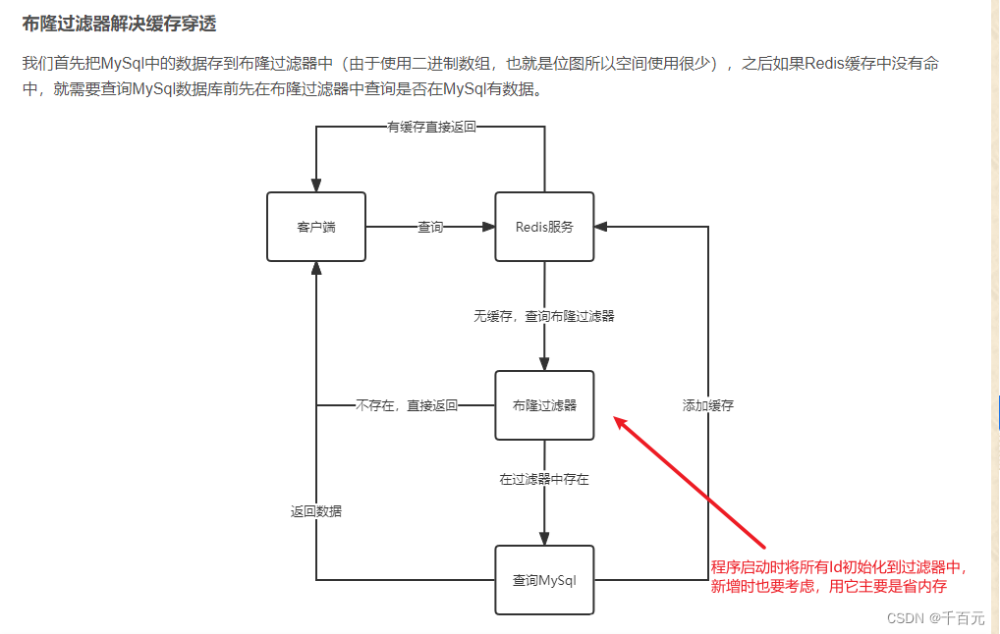

# 布隆过滤器解决缓存穿透

场景

接口请求时，如果在缓存种没有该id相关数据，会去通过sql查询数据库，这样，如果请求参数为-10，-100这样的负数，redis中肯定不会存在这样的数据，当这样大量的请求过来之后，就会导致**大量请求查询**问题，**则就会绕过redis对数据库造成很大压力甚至崩溃。这样的现象称为redis缓存穿透；**

如何解决呢？

在redis存储时，同时存储一个列表，如果id不在这个列表中，就不进行sql查询；
相比于数据库和 Redis，使用布隆过滤器可以很好的避免性能和内存占用的问题。

布隆过滤器本质是一个位数组；

规则：
布隆过滤器说某个元素在，可能会被误判。
布隆过滤器说某个元素不在，那么一定不在。 

**方案**

  而当我们使用布隆过滤器时，我们只要对布隆过滤器进行初始化，将数据库的数据全都先载入到布隆过滤器中。这样操作后，当一个不存在的id再次进行请求时，在经过过滤器时，过滤器比较id转换成的hash值对应的byte数组位置，立刻就能发现该id不存在，直接返回空即可，速度几乎快到忽略不计。这样即可完美解决缓存穿透的问题。 
