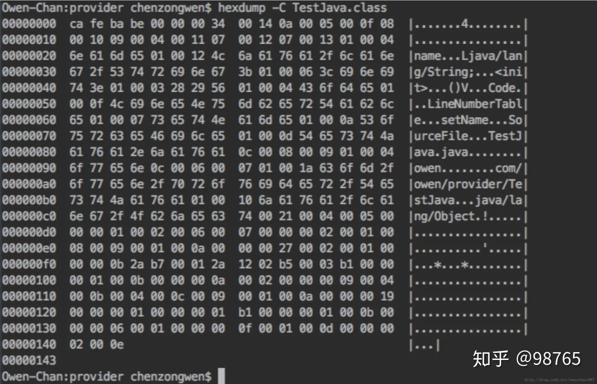
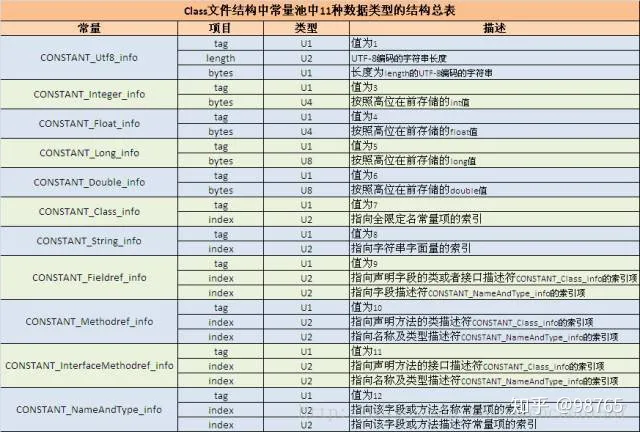

# .Class文件的奥秘

和C++ 相比，很重要的一点就是：C++ 编译生成的是纯二进制的[机器指令](https://www.zhihu.com/search?q=机器指令&search_source=Entity&hybrid_search_source=Entity&hybrid_search_extra={"sourceType"%3A"answer"%2C"sourceId"%3A402030106})，而Java 
通过编译器编译生成的是非纯二进制的字节码(.[class文件](https://www.zhihu.com/search?q=class文件&search_source=Entity&hybrid_search_source=Entity&hybrid_search_extra={"sourceType"%3A"answer"%2C"sourceId"%3A402030106}))。而这种基于Unicode的字节码是不依赖于特定的计算机硬件架构而存在的——这就意味着只要有JVM环境，你的字节码就可以在任何平台上运行。其次，Java字节码的二进制数据以固定的格式进行存储和传输，消除了字节顺序的干扰。

Java为什么能跨平台？因为字节码是在虚拟机上运行的，而JVM虚拟机可以跨平台安装，所以相应Java字节码便可以跟着在任何平台上运行。只要JVM自身的代码能在相应平台上运行，即JVM可行，则Java的程序员就可以不用考虑所写的程序要在哪里运行，只要通过编译器编译出的字节码符合Java
[虚拟机](https://www.zhihu.com/search?q=虚拟机&search_source=Entity&hybrid_search_source=Entity&hybrid_search_extra={"sourceType"%3A"answer"%2C"sourceId"%3A402030106})的规范。

## Java 字节码

### 1.Java [源文件](https://www.zhihu.com/search?q=源文件&search_source=Entity&hybrid_search_source=Entity&hybrid_search_extra={"sourceType"%3A"answer"%2C"sourceId"%3A402030106})

Android Studio 编辑Java 源文件 TestJava.java

```java
public class TestJava {

    private String name = "owen";

    protected void setName() {

    }

```

### 2.TestJava [字节码文件](https://www.zhihu.com/search?q=字节码文件&search_source=Entity&hybrid_search_source=Entity&hybrid_search_extra={"sourceType"%3A"answer"%2C"sourceId"%3A402030106})

通过javac TestJava.java 编译生成 TestJava.class， 然后通过 hexdump -C TestJava.class 查看字节码。如下：



字节码由10部分组成，依次是[魔数](https://www.zhihu.com/search?q=魔数&search_source=Entity&hybrid_search_source=Entity&hybrid_search_extra={"sourceType"%3A"answer"%2C"sourceId"%3A402030106})、版本号、常量池、访问权限、类索引、父类索引、接口索引、字段表索引、方法、Attribute。如下图，按照顺序介绍每一部分。


#### 1、魔数 

0xcafebabe 

魔数是文件类型的标识用4个字节表示，通过字节码的文件可以看出Java 字节码文件的魔数是cafe babe.


#### 2、版本号 

0x 00000033 

版本号由[minor_version](https://www.zhihu.com/search?q=minor_version&search_source=Entity&hybrid_search_source=Entity&hybrid_search_extra={"sourceType"%3A"answer"%2C"sourceId"%3A402030106})（次版本号）major_version(主版本号) 
组成各占两个字节，次版本号是前两个字节主版本号是后两个字节，所以该文件对应的次版本号是0000 主版本号是0034 十进制是52，从[oracle](https://www.zhihu.com/search?q=oracle&search_source=Entity&hybrid_search_source=Entity&hybrid_search_extra={"sourceType"%3A"answer"%2C"sourceId"%3A402030106})
官网可知 52对应的为1.8 所以该文件版本为1.8.0


#### 3、常量池

常量池中主要存储两大类常量：字面量和符号引用。字面量如文本字符串，java中声明为final的常量值等等，而符号引用如类和接口的全局限定名，字段的名称和描述符，方法的名称和描述符。因为Java虚拟机在没有将类加载到内存的时候根本都没有分配内存地址，也就不存在对内存的操作，所以java虚拟机首先需要将类加载到虚拟机中，那么这个过程设计对类的定位（需要加载A包下的B类，不能加载到别的包下面的别的类中），所以需要通过[全局限定名](https://www.zhihu.com/search?q=全局限定名&search_source=Entity&hybrid_search_source=Entity&hybrid_search_extra={"sourceType"%3A"answer"%2C"sourceId"%3A402030106})来判别唯一性。这就是为什么叫做全局，限定的意思，也就是唯一性。下图为常量池的项目类型表：




上面的表中描述了11种数据类型的结构，其中类型U1、U2…. 表示的是项目的长度单位是字节 比如 

U1 是一个字节， 下面对数据类型进行解释：

OX0014：常量池的数量不固定（n+2），所以需要在常量池的入口处放置一项U2(两个字节)类型的数据代表常量池数量。因此该16进制是20，表示有20项常量，索引范围为1~19。因为Class文件格式规定，设计者就讲第0项保留出来了。所以从1开始，接下来解释每一项。

Constant #1

0x0a 第一个数据均是U1类型的tag，0a 的十进制为 10 对应的是 MethodRef_info 

0x0005 Class_info 00 05 索引项#5 

0x000f NameAndType 00 0f 索引项#15

Constant #2

0x08 String_info 


接下来是 U2 类型的项目 0x0010 指向字符串变量的索引 #16

Constant #3

0x09 FieldRef_info 

0x0004 :Class_info索引项#4 

0x0011：NameAndType索引项#17

Constant #4 

0x07 Class_info 

0x-00 12-: 全局限定名常量索引为#18

Constant #5 

0x07 Class_info 

0x-00 13-: 全局限定名常量索引为#19

Constant #6 

0x01:Utf-8_info 

0x-00 04-:字符串长度为4（选择接下来的一个字节长度转义） 

0x-6e616d65: “name”(十六进制转ASCII字符)

Constant #7 

0x01:Utf-8_info 

0x-00 12-:字符串长度为18（选择接下来的一个字节长度转义） 

0x-4d6a …… 673b: “Ljava/lang/String”

Constant #8 

0x01:Utf-8_info 

0x-00 04-:字符串长度为4（选择接下来的一个字节长度转义） 

0x-43…… 65: “”

#### 解释

实际上是class字节码是以8字节为单位的。。。紧接着魔数的4个字节存储的是Class文件的版本号：第5和第6个字节是次版本号（Minor Version），第7和第8个字节是主版本号（Major Version）