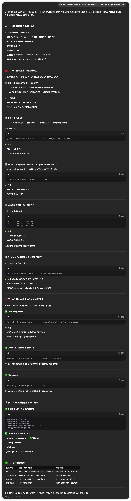

## G1垃圾回收器的核心阶段

## 什么是SATB

### 误回收

### 写屏障机制

## 筛选回收

## Young GC

**G1 Young GC 是什么样的 STW？**

- 当 G1 触发 Young GC 时，**JVM 会暂停所有业务线程（STW）**；
- 然后**根据 CPU 核心数启动多个 GC 线程（ParallelGCThreads）**；
- 多线程扫描 Eden 和 Survivor 区，**复制活对象到新区域**；
- 整个过程用户线程完全暂停，但 GC 线程运行很快。

👉 所以，“GC 线程在不断执行”**只限于 GC 过程时间内**，通常为几毫秒到几十毫秒。

G1 的 Young GC 采用 **Region 分区 + Task 分工调度机制** 来保证每个 GC 线程**处理各自负责的 Region，不会重复或冲突**。

- JVM 会为每个 GC 线程生成一个或多个 **GCTask**（如：扫描 Eden Region 1、复制活对象、处理卡表等）；
- 这些任务被放入一个**全局的任务队列（如 GCTaskManager、WorkQueue）**；
- 每个 GC 线程从队列中取出自己要处理的 Region；
- **Region 是不可共享的工作单元**，一个线程只能处理它当前持有的 Region，处理完再去抢下一个。

**3. 对象复制是通过** 

**线程本地缓冲区（Thread-Local Allocation Buffer, TLAB）**

- G1 的 Young GC 会构造一个 **Collection Set（简称 CSet）**，包含：
  - 所有 Eden Region；
  - 当前 From Survivor Region（上次 GC 时幸存下来的）；
- 然后由 GC 线程并发对这些 Region 进行扫描，标记活对象，并把活的对象复制到：
  - Survivor To 区；
  - 或者晋升到 Old 区（如果年龄到达阈值或 To 区满了）。

**这些 Region 是怎么被并行处理的？**

- G1 会启动多个 GC 工作线程；
- 通过一种叫 **Region Splitting + Work Stealing** 的机制，将这些 Eden / Survivor Region 分配给不同线程处理，避免重复扫描；
- GC 线程会遍历每个对象，复制活的对象并更新引用；
- 使用 **记忆集（Remembered Set）** 避免遗漏外部引用。

| **问题**                                     | **答案**                                                     |
| -------------------------------------------- | ------------------------------------------------------------ |
| 会不会把多个旧区块的对象复制进同一个新区块？ | **会**，复制目标是按对象填满 Region，不关心来源区块          |
| 每个 GC 线程如何分配复制目标区？             | 使用 Thread Local Allocation Buffer（TLAB），动态申请 Region 填充 |
| 复制过程如何避免并发冲突？                   | 原子设置 forwarding 指针 + 每线程独立 TLAB + work-stealing 协调 |

## GC Root可达性分析

## Mixed GC

## Card table

## G1预测 Pause Time是怎么做到的

## GC分析

## 线上问题排查

