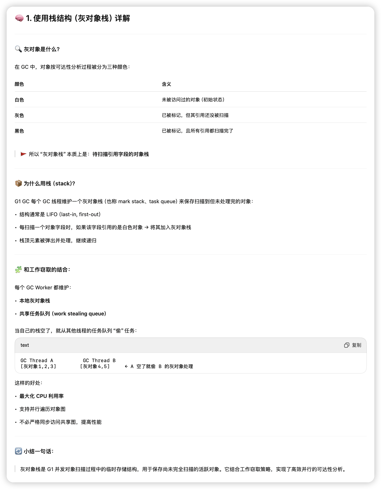
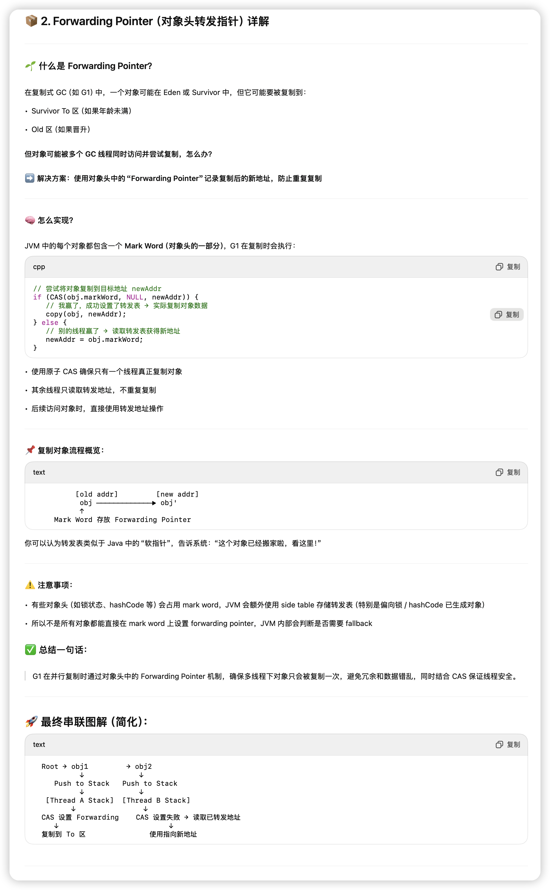
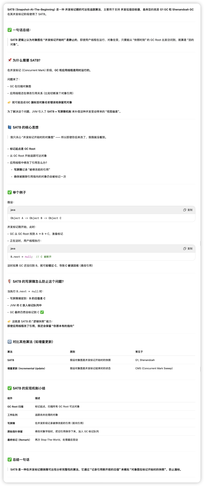
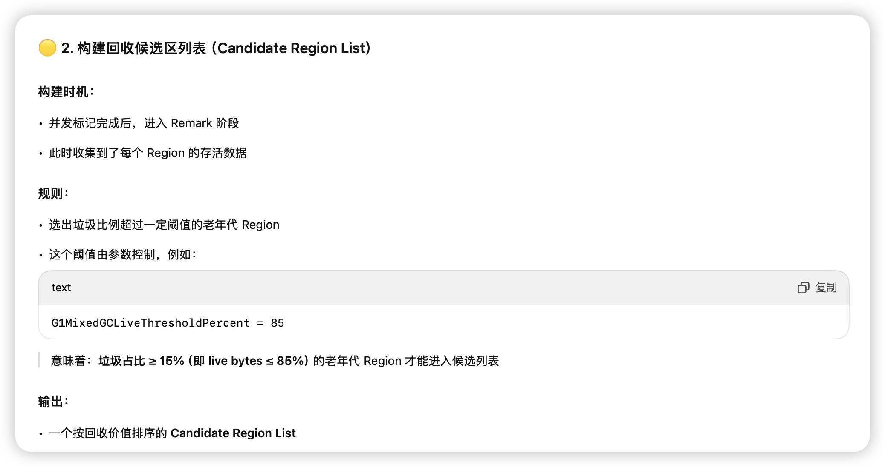
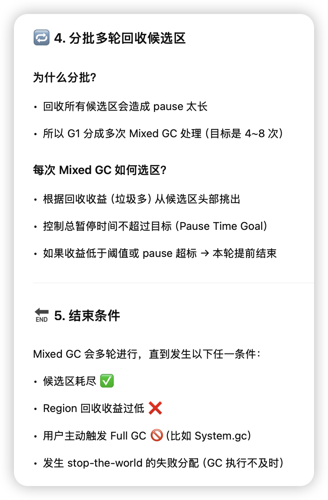
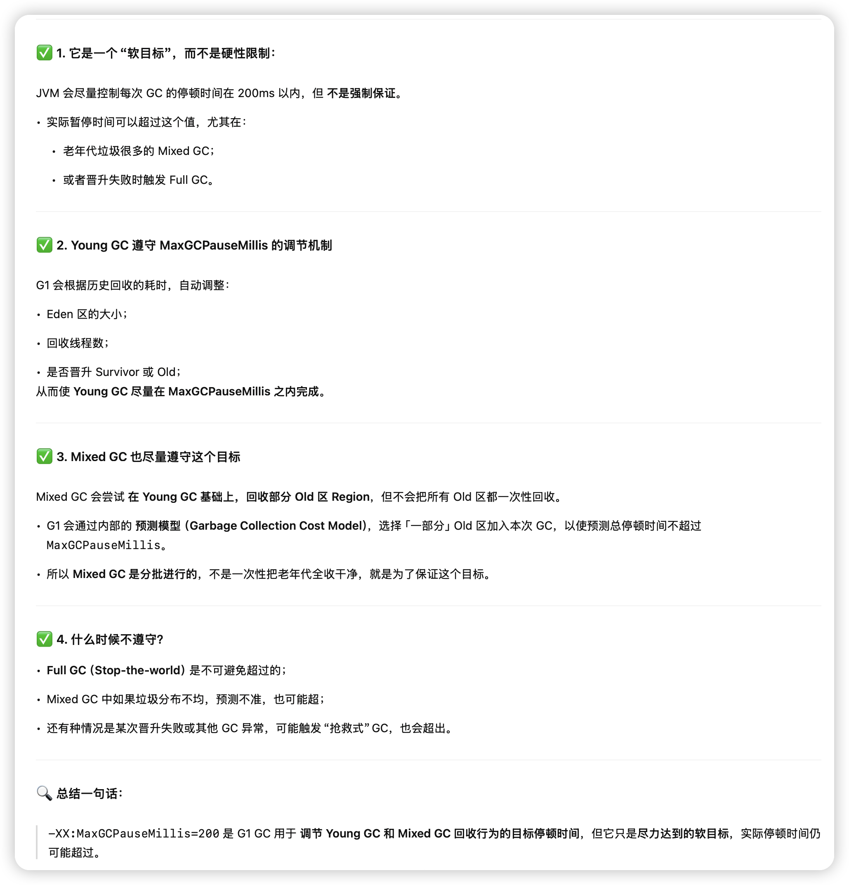

## G1 的设计目标与优势

G1 设计目标是：

> ✅ **可预测的低延迟 GC**，适用于大堆（>4GB），避免传统 GC 的碎片与长时间停顿。

G1 的主要优势：

| **特性**           | **描述**                                  |
| ------------------ | ----------------------------------------- |
| Region 化管理      | 整个堆被划分为多个独立的 Region，粒度更细 |
| 并行 & 并发 GC     | 使用多线程执行标记、清理、复制            |
| Garbage-First 算法 | 优先清理“收益最高”的 Region               |
| 避免全停顿         | 大多数回收阶段都为并发或增量式            |
| 自动分代           | Young / Old 都是动态构成的                |


## 内存结构（Region 化管理）

非常好，我们就先专注讲解 G1 GC 的 **内存结构（Region 化管理）**。这是理解 G1 的基础，也是它实现低延迟、高回收效率的核心设计。

### **🎯 设计理念**

在传统 GC 中，Java 堆被物理分成 **新生代**（Eden + Survivor）和 **老年代**。而在 G1 中，这种物理分代被取消，取而代之的是：


> ✅ **将整个堆划分成若干大小相等的块（Region），逻辑分代，物理统一管理**

### **📦 Region 的基本定义**

- 每个 Region 是一个独立的内存分区，默认大小为 **1MB ~ 32MB**，并且是 **2 的幂次方**
- JVM 会根据堆大小自动选择合适的 Region 大小
- 整个堆中 Region 数量固定，最多约为 2048 个


```
Java Heap
┌────┬────┬────┬────┬────┬────┐
│ R0 │ R1 │ R2 │ R3 │ R4 │ R5 │ ...（Region）
└────┴────┴────┴────┴────┴────┘
```

### **🧩 Region 的类型（用途）**

每个 Region 都会被标记成一种逻辑用途：

| **类型**      | **说明**                                     |
| ------------- | -------------------------------------------- |
| **Eden**      | 新生代对象首次分配区（大多数会被很快回收）   |
| **Survivor**  | 新生代中幸存对象的临时缓冲区（From / To）    |
| **Old**       | 老年代，存放晋升对象或长生存期对象           |
| **Humongous** | 存放大对象（超过 Region 一半大小，默认 50%） |
| **Free**      | 空闲 Region，可分配为任意用途                |

G1 会**动态地为不同用途分配 Region**，不再固定 Eden / Old 的大小比例。

### **🔄 Region 的动态分配和回收**

在运行时：

- G1 会**动态决定各类 Region 数量**，根据对象分配和 GC 回收策略自动调整：
  - Eden 区对象多了 → 分配更多 Eden Region
  - Old 区对象晋升多了 → 分配更多 Old Region
- GC 后，已回收的 Region 会被标记为 Free，等待再次分配

> ✅ **不再有传统意义上的固定大小分代**，G1 完全实现了内存结构的“弹性化、分区化、逻辑化”

### **📏 Region 的大小如何决定？**

由 JVM 启动时根据堆大小自动设定：

```
堆越大 → Region 越大

例子：
堆大小 4GB → 每个 Region 2MB
堆大小 32GB → 每个 Region 16MB
```

你也可以手动设置：

```
-XX:G1HeapRegionSize=8m
```

### **🧬 Humongous Region（大对象处理）**

当一个对象大小超过单个 Region 大小的 50%，G1 会将其称为 “**Humongous Object**”，并以**连续多个 Region**存储它：

```
大对象 A（16MB） → Region R100 ~ R103（每个 4MB）
```

这些 Region 被标记为：

- Humongous Start（第一个）
- Humongous Continuation（后续部分）

缺点：

- 分配慢（需要连续）
- 回收碎片高
- 可能触发 Full GC（无法合并）

### **🧠 G1 的逻辑分代是怎么做的？**

虽然 G1 不再物理分代，但它仍然有“分代”的概念：

```
Young Generation = Eden + Survivor Regions
Old Generation   = Old Regions
```

并且：

- Young 区对象仍然通过 Minor GC（Young GC）清理
- Old 区对象通过 Mixed GC 清理

> ✅ 这个逻辑分代是基于 Region 类型和对象年龄动态构建的

### **🧊 Region 管理的结构体（源码层面）**

JVM 使用一个结构叫做 HeapRegion 管理每一个 Region：

```
class HeapRegion {
  HeapWord* _bottom; // 起始地址
  size_t _length;    // 大小（固定）
  HeapRegionType _type; // Eden, Survivor, Old, Humongous
  ...
}
```

这些 Region 被放入 HeapRegionManager 管理器中统一调度。

### **✅ 总结一句话：**

> G1 将整个堆均等切分为多个 Region，每个 Region 会动态被标记为 Eden / Survivor / Old / Humongous / Free 等类型，实现了灵活可调、粒度更细的堆内存管理，是 G1 实现并发回收和预测停顿的核心基础。


## 区块分配

> G1 GC 不使用固定大小的新生代（不像 Parallel GC 的 Eden:Survivor = 8:1:1 这种比例），而是通过**预测回收行为 + 实时反馈数据**来 **动态决定每次 GC 时 Eden/Survivor/Old 的大小分布**，这是 G1 的一个重要特性。

**🎛️ G1 如何决定 Eden/Survivor/Old Region 的数量？**

**✅ 内存分配是动态的：**

- G1 在每次 GC 之前会根据：
  - **堆内存总大小**
  - **当前存活对象分布**
  - **最近 GC 的回收效果**
  - **用户设定的暂停时间目标（-XX:MaxGCPauseMillis）**

来**预测 GC 需要用多少 Region 来放 Eden、Survivor、Old**。


### **🧠 是否有“负反馈调节”机制？**

是的，**和 Parallel GC 的 UseAdaptiveSizePolicy 类似，G1 也有自适应反馈调节机制**，只是它**更复杂、更智能**，具体如下：


### **📊 G1 自适应机制的核心逻辑：**

| **类别**           | **调节点**                         | **依据**                                            |
| ------------------ | ---------------------------------- | --------------------------------------------------- |
| ✅ Eden Region 个数 | 控制 Eden 区吞吐与晋升压力         | 依据**分配速率**、**对象存活率**、**目标暂停时间**  |
| ✅ Survivor 区大小  | 调节晋升压力、防止 Survivor 满     | 依据**上次 GC 存活对象大小**和**Survivor 空间占用** |
| ✅ Old 区大小       | 控制晋升对象去向、混合 GC 回收窗口 | 依据**老年代堆积速度**和**回收频率**                |


### **🔁 调节的依据：预测 + 回馈**

每次 GC 后，G1 会记录下列信息：

- 每个 Region 类型的使用情况（Eden、Survivor、Old）
- 每轮 GC 的**停顿时间**
- 每个对象年龄分布、晋升比例
- 回收后空闲 Region 数量

然后通过一个内部的 **“预测模型 + 收敛反馈机制”**，来决定：

- 下一次 Eden 的最大可用 Region 个数
- 下一次 Survivor 的大小
- 是否该启动 Mixed GC，回收部分 Old 区


### **🔍 举个例子更清楚：**

比如你设置了 -XX:MaxGCPauseMillis=100（目标最大暂停 100ms）

- 当前 GC 过程中发现：
  - Eden 太大，GC 花了 150ms → 超过目标
- 下一次 GC 会自动减少 Eden Region 的数量，缩短 GC 停顿
- 但如果 Eden 太小，频繁 GC，吞吐下降，系统又会**适当放宽 Eden 的分配**

这就像一个回馈回路，会在目标值周围震荡收敛。

### **🔧 相关参数（可以调节）**

| **参数**                           | **作用**                                                     |
| ---------------------------------- | ------------------------------------------------------------ |
| -XX:MaxGCPauseMillis               | G1 最核心的调节目标，控制每次 GC 的停顿上限                  |
| -XX:NewRatio                       | 控制初始 Eden 与 Old 的大小比例，但非强约束，G1 会自动调整   |
| -XX:G1ReservePercent               | 预留空闲 Region 比例，避免空间紧张                           |
| -XX:InitiatingHeapOccupancyPercent | 启动并发标记的老年代占比阈值，间接影响 Mixed GC 和 Old 区回收 |

- 不是按比例固定 Eden:Survivor:Old
- 而是通过**Region 动态标记 + 自适应反馈模型**，结合目标暂停时间来实时分配内存区域
- 本质上就是：**用预测 + 反馈 + 收敛**来平衡 **停顿时间、吞吐和空间使用**


## 回收类型（Young GC / Mixed GC / Full GC）

### Young GC

G1 中的 Young GC 类似于传统 GC 中的 Minor GC，用于**回收 Eden 区的对象**，流程仍然是：

> ✅ 停顿用户线程（STW）+ 并行复制算法（Parallel Copying GC）

#### **📦 涉及哪些 Region？**

在 Young GC 中，G1 主要操作以下几类 Region：

| **Region 类型** | **作用**                                        |
| --------------- | ----------------------------------------------- |
| Eden            | 对象新生分配的区域，需要全部清空                |
| Survivor From   | 上一轮 GC 后留下来的幸存对象区（“旧” Survivor） |
| Survivor To     | 当前轮 GC 的目标 Survivor 区（“新” Survivor）   |

#### **🚀 Young GC 的触发时机**

1. Eden 区分配对象失败（没有空闲 Region）
2. 调用 System.gc()（如果没禁用）
3. JVM 判断有足够收益（低晋升压力时）

#### **🔍 Young GC 的回收流程（详细步骤）**

```
      Eden          From            To           Old
   ┌────────┐   ┌────────┐   ┌────────┐   ┌──────────────┐
   │Object A│   │Object B│   │        │   │              │
   └────────┘   └────────┘   └────────┘   └──────────────┘
       ↓             ↓             ↑
    Copy to To    Copy to To    If old enough → Promote
```

#### **✅ 步骤详解：**

1. **STW 停顿**
   - 停止所有应用线程
   - 启动 GC 多线程
2. **GC Roots 扫描**
   - 从栈、静态字段、JNI 等开始遍历对象图
   - 找出所有存活对象（‼️‼️‼️‼️只处理属于新生代的‼️‼️‼️‼️）
3. **复制 Eden 区对象**
   - 把存活的 Eden 区对象复制到：
     - Survivor To 区（如果年龄 < 阈值）
     - Old 区（如果 Survivor To 空间不足或年龄达阈值）
   - 使用 **多线程 + Bump-the-pointer + CAS** 分配策略
4. **复制 Survivor From 区对象**
   - 和 Eden 一样，也复制活着的 From 对象到 To 区或 Old 区
   - 年龄 +1，判断是否晋升
5. **处理引用更新（RemSet）**
   - 清除跨代引用（Old → Young）中的死引用
   - 更新卡表（Card Table）
6. **Region 状态切换**
   - Eden 和 From 区被清空，重新变为 Free Region
   - To 区变为新的 From 区
   - Old 区中的晋升对象保留原样
7. **重新启用应用线程（STW 结束）**

#### **🧩 Survivor 区的年龄判断与晋升规则**

- 每个对象都有一个 **年龄计数器（age）**
- 每次 GC 幸存一次，年龄 +1
- 达到晋升年龄阈值（默认 15）后晋升 Old 区
- 或者：
  - Survivor To 空间不足 → 提前晋升（避免 GC 中断）

这个逻辑和 Serial / Parallel GC 一致，但 G1 是 Region 级别、并发处理。

#### **⚠️ 如果 Survivor 空间不足怎么办？**

- G1 会尝试晋升对象到 Old 区
- Old 区没空间时，会触发 **Mixed GC** 或 **Full GC**
- G1 有 G1ReservePercent 机制预留老年代空间避免失败

#### **🧠 技术细节：多线程复制 + 工作窃取**

- G1 的 Young GC 完全并行执行（每个 GC 线程都有自己的任务队列）
- 使用 **work-stealing**（类似 ForkJoinPool）平衡负载
- 对象复制采用 Bump-the-pointer + CAS，快速分配、线程安全

#### **📊 Young GC 是轻量但高频的 GC：**

- 停顿时间短（完全并行）
- 回收目标集中（只清 Eden + Survivor From）
- 不涉及复杂的 Old 区遍历或标记


#### ✅ 总结（重点）：

- G1 的 Young GC 使用的确实是**并行复制算法（Parallel Scavenge）**，这一点和 Parallel GC 相同。
- 都使用 **GC worker 多线程** + **任务队列** + **工作窃取（Work Stealing）**
- 每个线程维护自己的任务栈和辅助扫描堆栈（如灰色对象栈）
- 对象复制采用 bump-the-pointer + CAS，最大化线程安全下的吞吐


#### 扫描

- 每个 GC 线程确实会扫描 **部分 GC Roots**（如线程栈、本地变量、JNI handles、类静态字段等）
- 实际遍历策略并不是真正的“广度优先 or 深度优先”那么严格，而是：
  - **使用栈结构（灰对象栈）+ work stealing**，所以是近似 **深度优先 + 动态调度**
  - 某些结构（如 SATB Buffer）中来的对象会插入任务队列，被后续线程处理
- 由于 Region 分配和对象图的随机性，**work stealing 机制确保了负载均衡**

📝 补一句：G1 不使用传统的“可达性分析算法”那种通用图遍历，而是特化优化后的并行图扫描。

##### 什么是灰对象栈



你能卡在“**扫描、入栈、添加任务**”这里，其实是非常正常的，因为这三者涉及 G1 GC 内部对象处理的时序和线程分工，确实容易绕。但只要你理解了“谁干什么、什么时候干、怎么干”，马上就会清晰。


下面我用**图解 + 串联流程 + JVM 数据结构简化还原**的方式，彻底帮你理顺这个逻辑。


**🧠 先搞清楚三个术语代表什么：**

| **动作**   | **含义**                                           | **谁做的** | **目标**               |
| ---------- | -------------------------------------------------- | ---------- | ---------------------- |
| ✅ 扫描     | 查看一个对象引用了谁                               | GC Thread  | 找出被引用对象         |
| ✅ 入栈     | 把被引用的对象加入灰对象处理队列                   | GC Thread  | 准备之后继续处理       |
| ✅ 添加任务 | 将灰对象“交给”某个线程处理（入栈 or 丢进任务队列） | GC Thread  | 支持并行处理、工作窃取 |

它们其实是一套流水线：“扫描” → “发现新的对象” → “入栈/加任务等待扫描”


**📦 场景设定：GC Roots 扫描到一个对象 student**

```
class Student {
    Parent parent;
    Book book;
}
```


##### **全流程讲解（GC Thread 视角）：**

**🧩 第一步：GC Root 扫描 student 对象**

```
线程栈 → 局部变量表 → student 引用
```

- JVM 把 student 作为“活对象”加入 **灰对象栈**（也称扫描栈）
- 注意，这一步只把对象地址加入任务栈，还**没扫描字段**


**🧩 第二步：开始处理灰对象 student**

- GC Thread 弹出 student 对象
- 遍历它的字段：发现 parent、book 都是引用类型
- 判断它们是否是第一次发现（白色）：

```java
if (!marked(parent)) {
    mark(parent);
    pushToLocalStack(parent); // 或加入共享队列
}
```

- 把 parent 和 book 都加入任务栈（这就叫“入栈” + “添加任务”）


**🔁 第三步：继续处理栈中的 parent、book…**

- 后续 GC Thread（同一个或其他线程）会继续：
  - 弹出 parent → 扫描字段 → 发现 grandParent → 入栈
  - 弹出 book → 没有引用 → nothing happens
- 对象被扫描完之后，就“变黑”，不会再被访问


**🔄 并行场景下呢？**

每个 GC 线程：

- 有自己的 **本地任务栈**（stack / deque）
- 线程 A 如果任务做完了，就从线程 B 那里“偷”部分任务继续做（Work Stealing）

**入栈/加任务 ≠ 马上处理，是排队交给线程调度**


**☕ 类比思维：理解这套逻辑可以类比“多线程图遍历”**

想象你在并发爬取一个图结构（对象引用图）：

1. 从一堆入口节点开始（GC Roots）
2. 把每个对象“发现”后暂存起来，放进“待爬队列”
3. 多个爬虫线程并发取出一个待爬对象，访问它引用的对象
4. 每发现一个新对象 → 放进队列
5. 队列里的内容就是“灰对象栈”，扫描完就是黑对象

**✅ 最终用你熟悉的语言描述串起来一遍：**

> 在 G1 GC 的并行标记和复制过程中，每个 GC 线程会扫描从 GC Root 找到的对象，并将这些“尚未扫描字段的活对象”放入任务栈（灰对象栈）。每当发现一个新的引用对象，它会被标记为“灰色”，加入任务队列等待进一步扫描。这些任务可以在多个线程之间通过工作窃取调度，直到所有对象都处理完毕为止。

##### 什么时候变成黑对象

> **一个灰对象（比如 parent）从栈中弹出，并且它的所有引用字段都已经被扫描过、也都成功加入灰对象栈（或标记为已访问）后，它自己就可以变成黑对象，对吧？**

> **当一个灰对象被处理完（即：扫描了所有引用字段，引用对象也都加入了处理队列），它就会被“染黑”。**

- ✔️ **“弹栈”只是触发扫描，不等于变黑**
- ✔️ **“处理完所有引用”是变黑的必要条件**
- ✔️ **“处理完引用 = 每个引用都被标记或加入灰栈（即登记入处理系统）”**
- ❌ **不需要等引用对象也处理完，只要“被登记”即可**


#### 复制

- G1 在 STW 前就已经把 Eden/Survivor From Region 组织好，分给线程时是粒度较小的 **Region chunk**
- Survivor To 区是提前按比例分配好的（不动态增长），可能不足以容纳所有对象
  - **空间不足时 → 提前晋升到 Old 区**
- G1 复制时会更新对象头的 **Forwarding Pointer**，线程要做 CAS 保证同一个对象不会被多线程复制多次（和 Parallel GC 相同）

##### 对象头指针转发（Forwarding Pointer）




#### 回收

- G1 会把这些已经无对象的 Region 标记为 **Free Region**
- 同时将 Survivor To 标记为新的 Survivor From
- Eden 和旧 From Region 被清空并加入 FreeList，待后续重新使用

> G1 的 Young GC 采用与 Parallel GC 类似的并行复制算法。GC 多线程在 STW 期间分担 GC Root 扫描任务，并通过工作窃取机制动态遍历对象图（基于栈的广度-深度混合策略）。随后线程分别处理分配到的 Eden 和 Survivor From Region，将存活对象复制到预先保留的 Survivor To 区，必要时晋升到 Old 区。对象复制过程中采用 CAS + Forwarding Pointer 保证线程安全。最后统一清理 Eden 和 From 区，将其标记为 Free Region，为下一轮 GC 做准备。


### Mixed GC

> **Mixed GC ≠ Full GC**

> Mixed GC 是一种**同时回收新生代 + 部分老年代 Region**的 GC，它是 G1 实现“低停顿、高吞吐”目标的关键机制。

Mixed GC 不是随便触发的，它有特定触发时机：

#### **1. 老年代空间占比达到阈值**

- 由参数 -XX:InitiatingHeapOccupancyPercent 控制（默认 45%）
- 说明整个堆使用率较高，有必要回收部分老年代 Region

#### **2. 新生代 GC（Young GC）之后执行**

- Mixed GC 总是从 Young GC 开始的一轮扩展清理
- 也就是说，**Mixed GC 的第一阶段就是一个普通 Young GC**

#### **🏗️ Mixed GC 的阶段流程（详细拆解）**

##### **✅ 第 1 阶段：Initial Mark（STW）**

- 和 CMS 一样，需要 STW
- 标记 GC Root 的直接可达对象（只标记老年代对象）
- 通常这个阶段会**Piggyback 在一次 Young GC 上**


##### **✅ 第 2 阶段：Concurrent Mark（并发）**

- 和 CMS 类似，**并发标记所有老年代可达对象**
- 使用 **三色标记 + SATB** 算法完成
- 构建出一个**“老年代存活对象分布图”**，用于后续回收判断
- 过程中仅 **标记对象**，**不统计大小**、**不做回收**

###### 什么是SATB




##### **✅ 第 3 阶段：Remark（STW）**

- 修正 Concurrent Mark 阶段遗漏的引用变动
- 这个阶段依然是 STW
- 会和 G1 的“卡表 + SATB 写屏障”结合使用
- 仍然不立即决定要回收哪些 Region，但数据已经就绪


##### **✅ 第 4 阶段：Cleanup（并发 + STW）**

- 把没有标记的 Region 标记为“可回收”
- 构建“回收候选区”列表（**Candidate Region List**）
- 真正统计垃圾率（回收收益）的时机




##### **✅ 第 5 阶段：Mixed GC（多轮 STW 回收）**

- **从新生代 GC 开始 + 回收部分老年代 Region**
- 一般会执行 **多轮 Mixed GC**
- 每轮只选一部分老年代 Region，优先回收「垃圾率高」的 Region


**🔁 为什么分多轮？**

因为：

- STW 要控制时间（停顿时间目标）
- 每轮做太多回收，STW 太久 → 违背 G1 初衷



```
     🟢 Concurrent Mark
            │
            ▼
   [统计各 Region 存活字节]
            │
            ▼
 🟡 构建 Candidate Region List（回收候选区）
            │
            ▼
 🔁 多轮 Mixed GC 阶段（混合回收 Young + Old）
     ├─ 从候选区中选回收收益高的 Region
     └─ 每轮受 pause time 控制
            │
            ▼
 🔚 候选区清空 / 触发阈值结束 / pause 超标
```

> G1 GC 会在并发标记后计算哪些老年代 Region 垃圾占比较高，将它们加入候选列表，然后在后续 Young GC 中以“Mixed GC”的方式分批回收这些老年代区域，以降低 STW 停顿、延缓 Full GC 的发生。


**🎯 Mixed GC 清理哪些老年代 Region？**

G1 不会**全回收老年代**（那是 Full GC）

它会根据并发标记时统计的各个老年代 Region 的“垃圾占比”来选取：

| **Region** | **垃圾占比** | **会被选中 Mixed GC？** |
| ---------- | ------------ | ----------------------- |
| Region A   | 95%          | ✅                       |
| Region B   | 10%          | ❌                       |
| Region C   | 70%          | ✅                       |
| Region D   | 40%          | ❌（可能后续才选）       |

这套策略基于成本收益模型（Garbage-First）


**🧠 G1 Mixed GC 的智能点在哪？**

- **基于 Region 垃圾率选择回收目标（高效）**
- **通过多轮 GC 分批处理，控制 STW 时间（低延迟）**
- **避免一次回收整个老年代（不像 Full GC 那样昂贵）**


**🧪 举个实际流程例子**

1. 老年代占堆空间 > 45%，触发并发标记
2. 并发标记后发现：
   - 40 个老年代 Region
   - 其中 15 个垃圾率 > 85%
3. Mixed GC 执行多轮：
   - 第 1 轮：清理 6 个 Eden + 8 个老年代高垃圾 Region
   - 第 2 轮：清理 Eden + Survivor + 7 个老年代
   - …直到「回收收益不足」或「停顿时间不允许」


**⚠️ 和 Full GC 的区别**

| **对比项** | **Mixed GC**        | **Full GC**                  |
| ---------- | ------------------- | ---------------------------- |
| 回收范围   | 新生代 + 部分老年代 | 整个堆（包括元空间）         |
| 是否并发   | 有并发阶段          | 完全 STW                     |
| 是否频繁   | 常见                | 尽量避免                     |
| 停顿时间   | 短，多轮            | 一次长停顿                   |
| 使用目的   | 主动优化回收效率    | 空间耗尽、晋升失败等紧急情况 |


**✅ 总结一句话**

> **Mixed GC 是 G1 独有机制，通过精细选择部分老年代高垃圾 Region 加入 Young GC 回收流程，实现“渐进式回收老年代”，从而避免 Full GC。**


### Full GC

G1 的 Full GC 和它的 Young/Mixed GC 完全不同，是 G1 的**兜底机制**，当其他回收方式无法满足内存需求或回收条件时才触发。

#### **🧨 一句话概括 G1 的 Full GC：**

> **G1 Full GC 是一次单线程、Stop-The-World 的「堆内全量压缩整理」操作，主要用于清理堆碎片、腾出空间，是 G1 的最后防线。**


#### **📌 G1 Full GC 的触发条件（最常见）：**

1. 🚨 **老年代空间不足，Mixed GC 又无法及时回收**
2. 🚨 **Humongous 对象分配失败**
3. 🚨 G1 并发周期来不及完成，Young GC/Mixed GC 来不及回收就撑爆
4. ⚙️ 显式调用 System.gc()，且未禁用 ExplicitGCInvokesConcurrent


#### **🧱 Full GC 的阶段流程（G1 方式）**

虽然我们平常说 G1 是 Region 化、并行的，但 **Full GC 是单线程，行为类似 Serial GC，流程如下：**


**🔹 1. Stop-The-World**

- 暂停所有应用线程和 GC 线程（包括并发标记等任务）
- G1 的 Full GC 是一次性压缩整个堆，不像 Young/Mixed 那样只处理部分 Region

**🔹 2. GC Root 扫描**

- 和其他 GC 一样，从 GC Roots 出发进行可达性分析（虚拟机栈、本地引用、静态变量等）
- 对象标记阶段使用的是**标记-压缩算法**

**🔹 3. 标记阶段（Mark）**

- 标记所有存活对象
- 该阶段是 STW，和 CMS 的初始标记不同，**G1 Full GC 是完全暂停 + 全堆标记**

**🔹 4. 复制 & 压缩阶段（Compaction）**

- 将所有活对象 **复制到新的位置（通常会尽量集中）**
- 原始 Region 被标记为可回收（Reclaimable）
- 同时更新所有引用指向的新地址（注意处理对象头中的 Forwarding Pointer）

**🔹 5. 清理阶段**

- 重置堆元数据（如 Remembered Set、Region 状态等）
- 释放旧对象占用的 Region
- 更新对象头、类元数据、年龄、引用等


#### **⚠️ G1 Full GC 的几个特点**


| **特性**              | **说明**                                                     |
| --------------------- | ------------------------------------------------------------ |
| ❌ 并行性低            | 当前（JDK 11~17）默认是**单线程的 Serial Full GC**（耗时长） |
| ✅ 支持类元数据回收    | 会清理类卸载（如果开启了 -XX:+ClassUnloading）               |
| ✅ 支持压缩（Compact） | 会整理对象布局，降低碎片率，解决 Humongous 分配失败问题      |
| ❌ 停顿时间长          | 是 Stop-The-World，**不是 G1 的设计目标，但是兜底保命手段**  |


#### **🧪 JDK 版本差异（重要！）**

- 🔸 **JDK 8~16**：G1 Full GC 是单线程串行回收

- 🔸 **JDK 17 起**：G1 引入了 **Parallel Full GC**（默认开启），**多个线程并发处理 Full GC**，大大减少停顿时间

  - 开启参数：-XX:+ParallelFullGC

  

#### **🧠 G1 为何要保留 Full GC？**

即便 G1 是 Region 化、并发设计，但依旧无法避免：

- Old Region 中碎片过多，不能放下新对象
- Humongous 对象分配失败
- 严重晋升失败 / 预测失败

因此需要 **Full GC 来“兜底清理”**，就像 JVM 的“清场操作”。


#### **✅ 总结**

| **项目**     | **G1 Full GC**                                    |
| ------------ | ------------------------------------------------- |
| 触发时机     | G1 无法腾出足够空间或失败时                       |
| 回收范围     | 全堆，包括 Eden / Survivor / Old / Humongous      |
| 是否 STW     | ✅ 是，Stop-The-World                              |
| 是否压缩     | ✅ 是，整理堆碎片                                  |
| 是否多线程   | ❌ JDK 8~16 单线程✅ JDK 17+ 并行回收（性能大提升） |
| 是否频繁触发 | ❌ 应避免触发（调优目标）                          |


## G1 的回收策略：Garbage-First 算法

**🧭 一句话理解 G1 的 Garbage-First 算法：**

> 在 Mixed GC 中，G1 会从老年代中选择**“垃圾多、活对象少”的 Region（性价比高）**，优先回收它们，从而尽可能在限定的停顿时间内**最大化回收空间，延迟 Full GC 的到来**。

### **一、为什么叫 “Garbage First”**

传统 GC（比如 CMS）在老年代清理时，是整体扫描老年代或基于链表维护的空闲块，容易产生碎片或回收不及时。

而 G1 的做法是：

✅ 把堆划分为很多 Region（区域），并：

1. **对每个 Region 跟踪“回收收益”**（有多少垃圾？）
2. **根据“收益 / 回收成本”的性价比排序**
3. **优先选择性价比高的 Region 进行回收**

所以叫 **Garbage-First：先回收最有价值的垃圾**。


### **二、G1 回收算法的使用时机：Mixed GC 阶段**

G1 的 Young GC 只回收新生代（Eden + Survivor），不涉及老年代。

但 G1 为了避免 Full GC，需要周期性触发 Mixed GC：

→ 即：**在年轻代 GC 的基础上，**从老年代中挑选部分 Region 一起回收。

而在 Mixed GC 中，就会用到 **Garbage-First 算法**。

### **三、算法核心步骤解析**

以下是 **G1 Mixed GC 中 Garbage-First 算法的执行流程**：

**🔹 第 1 步：并发标记（Concurrent Mark）**

- G1 使用 **并发标记阶段** 标记整个堆中存活对象
- 标记过程中，会为每个老年代 Region 统计：

| **Region ID** | **Region 类型** | **总大小** | **存活对象大小** | **垃圾大小** | **回收比例** |
| ------------- | --------------- | ---------- | ---------------- | ------------ | ------------ |
| R1            | Old             | 1MB        | 100KB            | 900KB        | 90%          |
| R2            | Old             | 1MB        | 800KB            | 200KB        | 20%          |

这张表会用于后续排序。

**🔹 第 2 步：计算回收性价比**

每个 Region 会计算一个指标：

```
回收收益 = Region 的垃圾大小
回收成本 = 复制活对象所需时间（估算）
回收性价比 = 收益 / 成本（类似 ROI）
```

> 🔧 JVM 内部叫做 GarbageCollectionEfficiency = ReclaimableBytes / ScanCost

**🔹 第 3 步：优先选择高收益 Region**

- G1 会把所有 Old Region 按照回收性价比降序排列
- 然后从上到下选择若干个 Region，直到：
  - 满足预估回收目标
  - 或达到用户设定的 GC 停顿时间目标（-XX:MaxGCPauseMillis）

> ❗ 注意：G1 **不是一次性回收所有老年代 Region**，而是**分多轮 Mixed GC 慢慢处理**，避免 STW 时间过长。

**🔹 第 4 步：STW Mixed GC**

一旦进入 STW Mixed GC：

- 扫描 GC Roots
- 回收新生代 Region（Eden + Survivor）
- **复制并回收刚才挑选出的 Old Region**
- 更新引用关系、对象转发表（Forwarding Pointer）

**🔹 第 5 步：统计 & 调整**

- 回收结束后，G1 会记录：
  - 实际回收对象大小
  - 回收耗时
  - 存活率是否达标
- 下一轮 Mixed GC 会根据这些反馈重新评估「回收范围」

### **四、Garbage-First 算法的优势**

| **特性**       | **描述**                                               |
| -------------- | ------------------------------------------------------ |
| 🔄 增量式回收   | 每轮 GC 只处理部分老年代，避免一次 Full GC             |
| 🧠 智能回收     | 按性价比选择回收目标，空间利用效率高                   |
| ⏱ 控制停顿     | 基于 -XX:MaxGCPauseMillis 估算 GC 回收量               |
| 🧹 延迟 Full GC | 只要 Mixed GC 能跟上老年代增长，Full GC 可长时间不发生 |

**你可以把它类比成“战场优先收尸策略”**

- 有很多战场（Region）
- 每个战场死的人（垃圾）不同
- G1 就是：**优先去“尸体最多的战场清理”，别管其他的**

**可视化一个例子**

```
堆结构：

[Eden][S][S][O1][O2][O3][O4][O5][O6][O7]

其中：
O1：90% 垃圾
O2：80% 垃圾
O3：70% 垃圾
O4：40%
O5：20%
O6：10%
O7：5%

目标：在 150ms 停顿时间里尽可能多回收老年代

→ G1 会选择 O1 O2 O3 O4 回收
→ 保留 O5~O7 给下次 Mixed GC
```

**✅ 总结一句话**

> G1 的 **Garbage-First 算法是在 Mixed GC 阶段，通过“收益 / 成本”评估，挑选性价比最高的老年代 Region 优先回收，控制停顿时间，避免 Full GC。**


## 重要参数与调优建议

### **一、G1 GC 重要参数分类汇总**

**🔹 1. 启用 G1 GC**

```
-XX:+UseG1GC
```

**🔹 2. 停顿时间目标（最核心）**

```
-XX:MaxGCPauseMillis=200   # 默认 200ms，目标最大 GC 停顿时间
```

- **G1 会尝试在 GC 预算时间内尽量选择合适 Region 回收**
- 设置太小 → 回收 Region 少 → 老年代增长快 → 容易触发 Full GC

**🔹 3. 堆大小控制（影响 GC 频率）**

```
-Xms / -Xmx       # 初始堆 / 最大堆
```

> ✅ G1 在堆使用接近 -Xmx 时回收压力骤增 → 更容易触发 Full GC

> ❗ 建议：**设置 -Xms = -Xmx，避免堆动态扩容的成本**

**🔹 4. 新生代比例（动态调整）**

```
-XX:NewRatio=N
```

G1 一般不强制使用这个，而是动态决定，但你可以手动配置 Eden 与 Old 比例（不推荐干预太多）：

```
-XX:InitiatingHeapOccupancyPercent=45  # 启动 Mixed GC 的老年代占比阈值（默认 45%）
```

**🔹 5. Region 控制**

```
-XX:G1HeapRegionSize=8m     # 单个 Region 大小（1M ~ 32M，2 的幂）
```

- 默认值由堆大小决定（堆越大 Region 越大）
- 总 Region 数最多 2048 个（可由 -XX:G1HeapRegionSize 控制）

**🔹 6. 并发线程数量**

```
-XX:ParallelGCThreads=N           # 用于 STW 阶段
-XX:ConcGCThreads=N               # 用于并发标记阶段
```

- 一般设置为 CPU 核心数 1/4 ~ 1/2（默认自动估算）

**🔹 7. Humongous 对象处理**

```
-XX:G1HeapRegionSize=8m  # Humongous 对象 > 1/2 Region 会单独分配整 Region
-XX:G1HeapWastePercent=5   # Region 剩余垃圾超过多少时可回收
```

> 🚨 **Humongous 对象无法被移动，只能 Full GC 清理！**

- > 尽量避免频繁创建大对象（如 byte[2MB]）

**🔹 8. Mixed GC 相关**

```
-XX:InitiatingHeapOccupancyPercent=45   # 启动 Mixed GC 的阈值（默认 45%）
-XX:G1MixedGCLiveThresholdPercent=85    # Old Region 超过这个存活率将不参与 Mixed GC
-XX:G1MixedGCCountTarget=8              # 一次并发周期后，最多 Mixed GC 次数（默认 8）
```

**🔹 9. Full GC 兜底（避免触发）**

```
-XX:+UseStringDeduplication           # 字符串去重，减少内存
-XX:+DisableExplicitGC                # 禁止 System.gc() 触发 Full GC
```


### **二、G1 调优实战建议（经验总结）**

#### **✅ 1. 保持目标 GC 停顿时间“合理”**

- -XX:MaxGCPauseMillis=200 是平衡吞吐和响应的默认值

- 如果你对 **低延迟有强烈要求**（如游戏、实时交易）可以设置为 50~100ms

  > 注意：G1 不是实时 GC，太低目标可能无法达成




#### **✅ 2. 设置固定堆大小，避免动态扩容**

```
-Xms = -Xmx
```

- 避免因 GC 太慢导致的 Full GC / OOM
- G1 更喜欢稳定堆布局以进行 Region 调度


#### **✅ 3. 合理设置并发线程**

```
-XX:ParallelGCThreads=8
-XX:ConcGCThreads=4
```

- **CPU 核心多时建议明确设置，否则默认策略不总最优**
- 小机器建议设置少一点，避免卡顿


#### **✅ 4. 避免 Humongous 对象**

- 多个大数组（如 new byte[3MB]）很容易撑爆 G1 的分配表
- 尝试切分结构、用堆外内存（如 DirectByteBuffer）


#### **✅ 5. 定期观察 GC 日志**

开启 GC 日志是调优核心：

```
-Xlog:gc*,safepoint:file=gc.log:time,uptime,level,tags
```

关注字段：

| **指标**          | **含义**         |
| ----------------- | ---------------- |
| Pause Time        | 是否达成目标停顿 |
| Young GC 间隔     | 是否太频繁       |
| Mixed GC 是否足够 | Old 区增长快不快 |
| Full GC 是否偶发  | 判断是否调优失败 |


### **三、调优目标 VS 场景匹配**

| **目标**             | **建议设置**                                  |
| -------------------- | --------------------------------------------- |
| 🌐 Web 应用（低延迟） | MaxGCPauseMillis=100，关注 STW 时间           |
| 🧠 AI / 大内存服务    | G1HeapRegionSize=16m，调高 MixedGCCountTarget |
| 🎮 游戏服务器         | 限制 Humongous 对象，GC 线程手动设定          |
| 🧮 高吞吐批处理       | MaxGCPauseMillis=500~1000，更多并发线程       |

**✅ 总结**

| **参数类别** | **建议重点**                                       |
| ------------ | -------------------------------------------------- |
| 停顿控制     | MaxGCPauseMillis 是核心目标                        |
| 内存布局     | -Xms = -Xmx, Region 大小可控                       |
| 并发线程     | ParallelGCThreads, ConcGCThreads                   |
| Mixed 策略   | InitiatingHeapOccupancyPercent, MixedGCCountTarget |
| Full GC 避免 | 合理使用 StringDeduplication, 禁用 System.gc()     |
