# Jvm基础

## 1. 内存区域

Java虚拟机在执行Java程序的过程中会把他所管理的内存划分为若干个不同的数据区域（运行时数据区）。Java虚拟机规范将JVM所管理的内存分为以下几个运行时数据区：程序计数器、Java虚拟机栈、本地方法栈、Java堆、方法区。下面详细阐述各数据区所存储的数据类型。

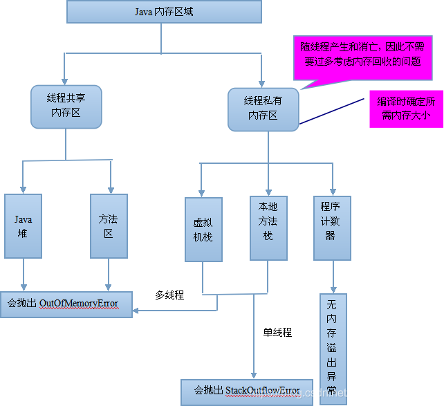

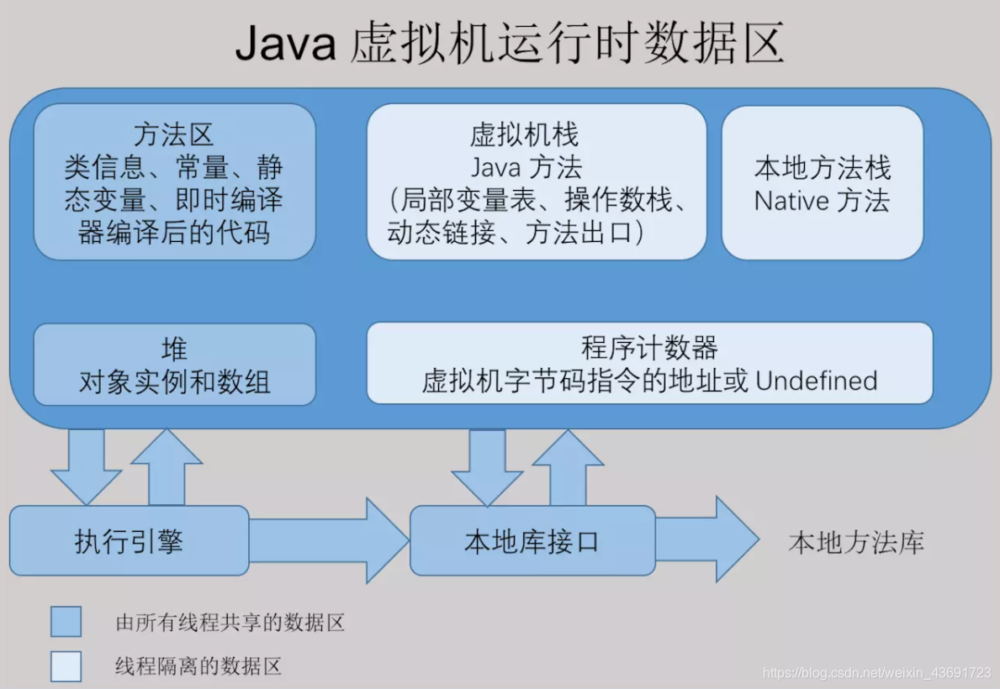

### 1.1 程序计数器（Program Counter Register）

一块较小的内存空间，它是当前线程所执行的字节码的行号指示器，字节码解释器工作时通过改变该计数器的值来选择下一条需要执行的字节码指令，分支、跳转、循环等基础功能都要依赖它来实现。每条线程都有一个独立的的程序计数器，各线程间的计数器互不影响，

**因此该区域是线程私有的。**

当线程在执行一个Java方法时，该计数器记录的是正在执行的虚拟机字节码指令的地址，当线程在执行的是Native方法（调用本地操作系统方法）时，该计数器的值为空。另外，该内存区域是唯一一个在Java虚拟机规范中没有规定任何OOM（内存溢出：OutOfMemoryError）情况的区域。

### 1.2 Java虚拟机栈（Java Virtual Machine Stacks）

虚拟机栈是一个线程执行的区域，保存着一个线程中方法的调用状态。换句话说，一个Java线程的运行状态，由一个虚拟机栈来保存，所以虚拟机栈肯定是线程私有的，随着线程的创建而创建。每个方法被执行的时候都会同时创建一个栈帧，栈帧是用于支持虚拟机进行方法调用和方法执行的数据结构，即每个方法对应一个栈帧。调用一个方法，就会向栈中压入一个栈帧；一个方法调用完成，就会把该栈帧从栈中弹出。对于执行引擎来讲，活动线程中，只有栈顶的栈帧是有效的，称为当前栈帧，这个栈帧所关联的方法称为当前方法，执行引擎所运行的所有字节码指令都只针对当前栈帧进行操作。
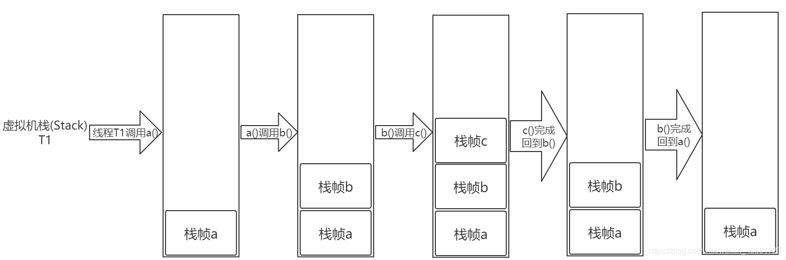

在Java虚拟机规范中，对这个区域规定了两种异常情况：

1. 如果线程请求的栈深度大于虚拟机所允许的深度，将抛出StackOverflowError异常。
2. 如果虚拟机在动态扩展栈时无法申请到足够的内存空间，则抛出OutOfMemoryError异常。

这两种情况存在着一些互相重叠的地方：当栈空间无法继续分配时，到底是内存太小，还是已使用的栈空间太大，其本质上只是对同一件事情的两种描述而已。在单线程的操作中，无论是由于栈帧太大，还是虚拟机栈空间太小，当栈空间无法分配时，虚拟机抛出的都是StackOverflowError异常，而不会得到OutOfMemoryError异常。而在多线程环境下，则会抛出OutOfMemoryError异常。

**栈帧**

每个栈帧对应一个被调用的方法，可以理解为一个方法的运行空间。每个栈帧中包括局部变量表(Local Variables)、操作数栈(Operand Stack)、指向运行时常量池的引用(A reference to the run-time constant pool)、方法返回地址(Return Address)和附加信息。在编译程序代码时，栈帧中需要多大的局部变量表、多深的操作数栈都已经完全确定了，并且写入了方法表的Code属性之中。因此，一个栈帧需要分配多少内存，不会受到程序运行期变量数据的影响，而仅仅取决于具体的虚拟机实现。


- 局部变量表
  方法中定义的局部变量以及方法的参数存放在这张表中。局部变量表中的变量不可直接使用，如需要使用的话，必须通过相关指令将其加载至操作数栈中作为操作数使用。

- 操作数栈
  当一个方法开始执行时，它的操作栈是空的，在方法的执行过程中，会有各种字节码指令（比如：加操作、赋值元算等）向操作栈中写入和提取内容，也就是入栈和出栈操作。

- 动态链接
  每个栈帧都包含一个指向运行时常量池（在方法区中，后面介绍）中该栈帧所属方法的引用，持有这个引用是为了支持方法调用过程中的动态连接。Class文件的常量池中存在有大量的符号引用，字节码中的方法调用指令就以常量池中指向方法的符号引用为参数。这些符号引用，一部分会在类加载阶段或第一次使用的时候转化为直接引用（如final、static域等），称为静态解析，另一部分将在每一次的运行期间转化为直接引用，这部分称为动态连接。

- 方法返回地址
  当一个方法被执行后，有两种方式退出该方法：执行引擎遇到了任意一个方法返回的字节码指令或遇到了异常，并且该异常没有在方法体内得到处理。无论采用何种退出方式，在方法退出之后，都需要返回到方法被调用的位置，程序才能继续执行。方法返回时可能需要在栈帧中保存一些信息，用来帮助恢复它的上层方法的执行状态。一般来说，方法正常退出时，调用者的PC计数器的值就可以作为返回地址，栈帧中很可能保存了这个计数器值，而方法异常退出时，返回地址是要通过异常处理器来确定的，栈帧中一般不会保存这部分信息。

方法退出的过程实际上等同于把当前栈帧出栈，因此退出时可能执行的操作有：恢复上层方法的局部变量表和操作数栈，如果有返回值，则把它压入调用者栈帧的操作数栈中，调整PC计数器的值以指向方法调用指令后面的一条指令。

### 1.3 本地方法栈（Native Method Stacks）

该区域与虚拟机栈所发挥的作用非常相似，只是虚拟机栈为虚拟机执行Java方法服务，而本地方法栈则为使用到的本地操作系统（Native）方法服务。

#### 1.3.1什么是Native方法

Native方法简单地讲，一个Native Method就是一个java调用非java代码的接口。一个Native Method是这样一个java的方法：该方法的实现由非java语言实现，比如C。这个特征并非java所特有，很多其它的编程语言都有这一机制，比如在C＋＋中，你可以用extern "C"告知C＋＋编译器去调用一个C的函数。 "A native method is a Java method whose implementation is provided by non-java code." 在定义一个native method时，并不提供实现体（有些像定义一个java interface），因为其实现体是由非java语言在外面实现的。，下面给了一个示例：

```java
 public class IHaveNatives { 
    native public void Native1( int x ) ;
    native static public long Native2() ; 
    native synchronized private float Native3( Object o ) ;
    native void Native4( int[] ary ) throws Exception ;    
 }
```

- 和abstract方法很像

- 标识符native可以与所有其它的java标识符连用，但是abstract除外。这是合理的，因为native暗示这些方法是有实现体的，只不过这些实现体是非java的，但是abstract却显然的指明这些方法无实现体。native与其它java标识符连用时，其意义同非Native Method并无差别，比如native static表明这个方法可以在不产生类的实例时直接调用，这非常方便，比如当你想用一个native method去调用一个C的类库时。上面的第三个方法用到了native synchronized，JVM在进入这个方法的实现体之前会执行同步锁机制（就像java的多线程。）

- 一个native method方法可以返回任何java类型，包括非基本类型，而且同样可以进行异常控制。这些方法的实现体可以制造一个异常并且将其抛出，这一点与java的方法非常相似。当一个native method接收到一些非基本类型时如Object或一个整型数组时，这个方法可以访问这些基本型的内部，但是这将使这个native方法依赖于你所访问的java类的实现。有一点要牢牢记住：我们可以在一个native method的本地实现中访问所有的java特性，但是这要依赖于你所访问的java特性的实现，而且这样做远远不如在java语言中使用那些特性方便和容易。

- native method的存在并不会对其他类调用这些本地方法产生任何影响，实际上调用这些方法的其他类甚至不知道它所调用的是一个本地方法。JVM将控制调用本地方法的所有细节。需要注意当我们将一个本地方法声明为final的情况。用java实现的方法体在被编译时可能会因为内联而产生效率上的提升。但是一个native final方法是否也能获得这样的好处却是值得怀疑的，但是这只是一个代码优化方面的问题，对功能实现没有影响。

- 如果一个含有本地方法的类被继承，子类会继承这个本地方法并且可以用java语言重写这个方法（这个似乎看起来有些奇怪），同样的如果一个本地方法被fianl标识，它被继承后不能被重写。

- 本地方法非常有用，因为它有效地扩充了jvm.事实上，我们所写的java代码已经用到了本地方法，在sun的java的并发（多线程）的机制实现中，许多与操作系统的接触点都用到了本地方法，这使得java程序能够超越java运行时的界限。有了本地方法，java程序可以做任何应用层次的任务。

  具体代码实现

  ```java
  public class TestMain {
  	static {
  		System.load("D:" + File.separator + "Hello.dll");
  	}
  
  	public native static void Hello();
    
  	public static void main(String[] args) {
  		Hello();
  	}
  }
  ```

  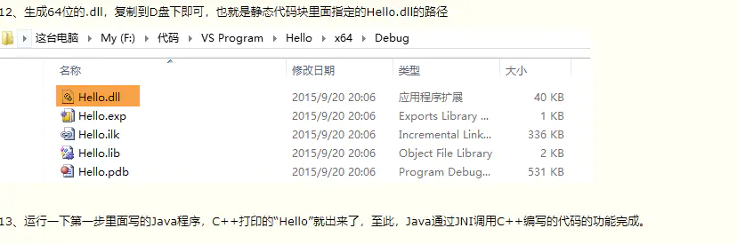

### 1.4 Java堆（Java Heap）

Java Heap是Java虚拟机所管理的内存中最大的一块，它是所有线程共享的一块内存区域。几乎所有的对象实例和数组都在这类分配内存。Java Heap是垃圾收集器管理的主要区域，因此很多时候也被称为“GC堆”。内部会划分出多个线程私有的分配缓冲区(Thread Local Allocation Buffer, TLAB)。可以位于物理上不连续的空间，但是逻辑上要连续。

根据Java虚拟机规范的规定，Java堆可以处在物理上不连续的内存空间中，只要逻辑上是连续的即可。如果在堆中没有内存可分配时，并且堆也无法扩展时，将会抛出OutOfMemoryError异常。

堆空间分为老年代和年轻代。刚创建的对象存放在年轻代，而老年代中存放生命周期长久的实例对象。年轻代中又被分为Eden区和两个Survivor区(From Space和To Space)。新的对象分配是首先放在Eden区，Survivor区作为Eden区和Old区的缓冲，在Survivor区的对象经历若干次GC仍然存活的，就会被转移到老年代。

`当一个对象大于eden区而小于old区（老年代）的时候会直接扔到old区。 而当对象大于old区时，会直接抛出OutOfMemoryError（OOM）。`

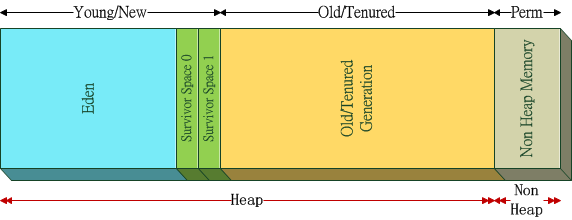


### 1.5 方法区（Method Area）

**`方法区是各个线程共享的内存区域，在虚拟机启动时创建`**，虽然Java虚拟机规范把方法区描述为堆的一个逻辑部分，但是它却又一个别名叫做Non-Heap(非堆)，目的是与Java堆区分开来，方法区域又被称为“永久代”，但这仅仅对于Sun HotSpot来讲，JRockit和IBM J9虚拟机中并不存在永久代的概念。**`用于存储已被虚拟机加载的类信息、常量、静态变量、即时编译器编译后的代码等数据`。**相对而言，垃圾收集行为在这个区域比较少出现。该区域的内存回收目标主要针是对废弃常量的和无用类的回收。运行时常量池是方法区的一部分，Class文件中除了有类的版本、字段、方法、接口等描述信息外，还有一项信息是常量池（Class文件常量池），用于存放编译器生成的各种字面量和符号引用，这部分内容将在类加载后存放到方法区的运行时常量池中。运行时常量池相对于Class文件常量池的另一个重要特征是具备动态性，Java语言并不要求常量一定只能在编译期产生，也就是并非预置入Class文件中的常量池的内容才能进入方法区的运行时常量池，运行期间也可能将新的常量放入池中，这种特性被开发人员利用比较多的是String类的intern（）方法。

根据Java虚拟机规范的规定，当方法区无法满足内存分配需求时，将抛出OutOfMemoryError异常。

### 1.6 直接内存（Direct Memory）

直接内存并不是虚拟机运行时数据区的一部分，也不是Java虚拟机规范中定义的内存区域，它直接从操作系统中分配，因此不受Java堆大小的限制，但是会受到本机总内存的大小及处理器寻址空间的限制，因此它也可能导致OutOfMemoryError异常出现。在JDK1.4中新引入了NIO机制，它是一种基于通道与缓冲区的新I/O方式，可以直接从操作系统中分配直接内存，即在堆外分配内存，这样能在一些场景中提高性能，因为避免了在Java堆和Native堆中来回复制数据。

### 1.7运行时常量池

每一个运行时常量池都在java虚拟机的**方法区**中分配。
例如在Java中字符串的创建会在常量池（方法区中StringTable：HashSet）中进行：

```java
public class Changliang {
    public static void main(String[] args) {
        // s1与s2是相等的，为字节码常量
        String s1 = "abc";
        String s2 = "abc";
		
        // s3创建在堆内存中
        String s3 = new String("abc");
		
        // intern方法可以将对象变为运行时常量
        // intern是一个native方法
        System.out.println(s1 == s3.intern()); // true
    }
}
```

#### 对象的创建

一个对象创建的过程为：

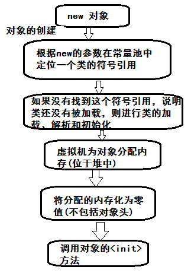

#### 如何在堆中给对象分配内存

两种方式：**指针碰撞和空闲列表**。 我们具体使用的哪一种，就要看我们虚拟机中使用的是什么垃圾回收机制了，如果有压缩整理，可以使用指针碰撞的分配方式。
**指针碰撞**：假设Java堆中内存是绝对**规整**的，所有用过的内存度放一边，空闲的内存放另一边，中间放着一个指针作为分界点的指示器，所分配内存就仅仅是把哪个指针向空闲空间那边挪动一段与对象大小相等的举例，这种分配方案就叫指针碰撞
**空闲列表**：有一个列表，其中记录中哪些内存块有用，在分配的时候从列表中找到一块足够大的空间划分给对象实例，然后更新列表中的记录，这就叫做空闲列表。

#### 线程安全性问题

在两个线程同时创建对象时，可能会造成空间分配的冲突，解决方案有：线程同步（但执行效率过低）或给每一个线程单独分配一个堆区域TLAB Thread Local Allocation Buffer（**本地线程分配缓冲**）。

## 2. 内存溢出异常(OOM，Out Of Memeory)

内存溢出就是内存不够用，当JVM因为没有足够的内存来为对象分配空间并且垃圾回收器也已经没有空间可回收时，就会抛出 `java.lang.OutOfMemoryError` （注：非exception，因为这个问题已经严重到不足以被应用处理）

注意，要和内存泄漏区分开，**内存泄露**：申请使用完的内存没有释放，导致虚拟机不能再次使用该内存，此时这段内存就泄露了，因为申请者不用了，而又不能被虚拟机分配给别人用。

除了 `程序计数器`外 ，Java虚拟机的其他运行时区域都有可能发生 `OutOfMemoryError` 的异常，下面分别给出验证：

### 2.1 Java堆溢出

Java堆用来存储对象，因此只要不断创建对象，并保证 GC Roots 到对象之间有可达路径来避免垃圾回收机制清理这些对象，那么当对象数量达到最大堆容量时就会产生 OOM。

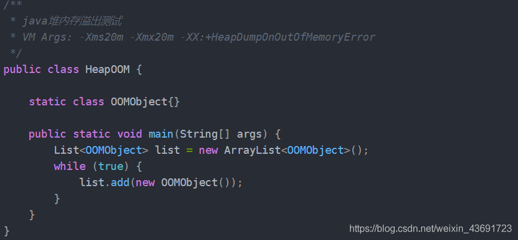

运行结果：

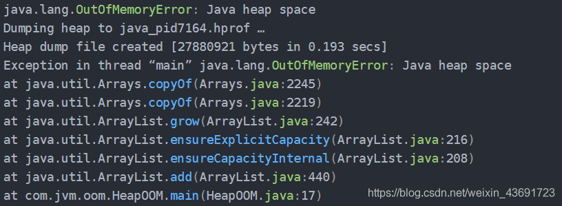

堆内存 OOM 是经常会出现的问题，异常信息会进一步提示 Java heap space

### 2.2 虚拟机栈和本地方法栈溢出

在 `HotSpot`虚拟机中不区分虚拟机栈和本地方法栈，栈容量只由 -Xss 参数设定。关于虚拟机栈和本地方法栈，在 Java 虚拟机规范中描述了两种异常：

- 如果线程请求的栈深度大于虚拟机所允许的最大深度，将抛出 `StackOverflowError` 异常。
- 如果虚拟机在扩展栈时无法申请到足够的内存空间，则抛出 **`OutOfMemoryError`** 异常。

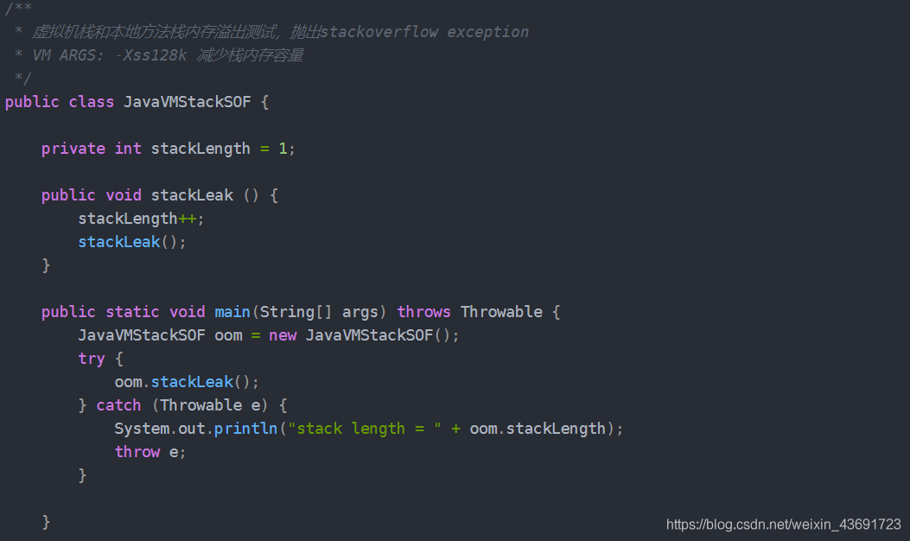

运行结果：

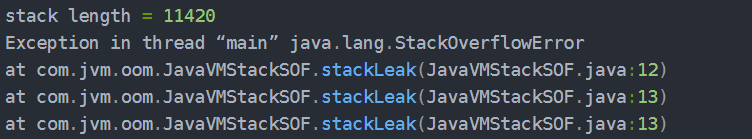

以上代码在单线程环境下，无论是由于栈帧太大还是虚拟机栈容量太小，当内存无法分配时，抛出的都是 `StackOverflowError` 异常。

如果测试环境是多线程环境，通过不断建立线程的方式可以产生内存溢出异常，代码如下所示。但是这样产生的 OOM 与栈空间是否足够大不存在任何联系，在这种情况下，为每个线程的栈分配的内存足够大，反而越容易产生OOM 异常。这点不难理解，每个线程分配到的栈容量越大，可以建立的线程数就变少，建立多线程时就越容易把剩下的内存耗尽。这点在开发多线程的应用时要特别注意。

**如果建立过多线程导致内存溢出，在不能减少线程数或更换64位虚拟机的情况下，只能通过减少最大堆和减少栈容量来换取更多的线程。**

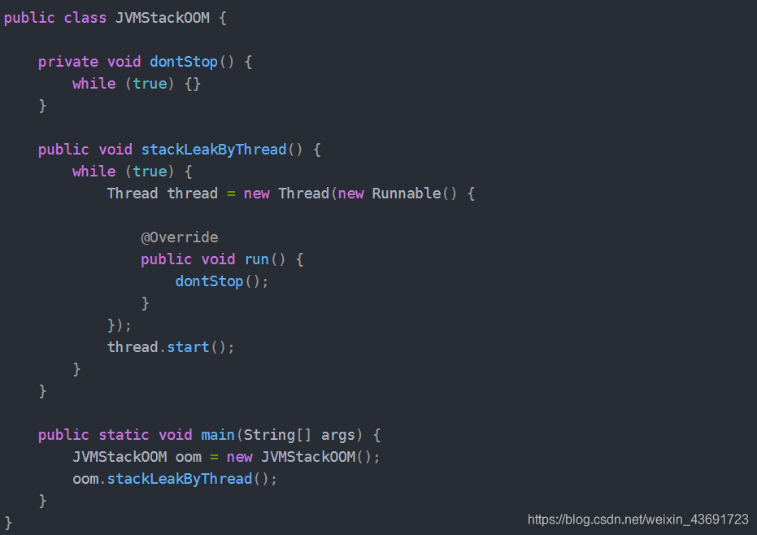

### 2.3 方法区和运行时常量池溢出

方法区用于存放Class的相关信息，对这个区域的测试，基本思路是运行时产生大量的类去填满方法区，直到溢出。使用CGLib实现。

方法区溢出也是一种常见的内存溢出异常，在经常生成大量Class的应用中，需要特别注意类的回收情况，这类场景除了使用了CGLib字节码增强和动态语言外，常见的还有JSP文件的应用(JSP第一次运行时要编译为Java类)、基于OSGI的应用等。

**解决内存溢出**

- 修改JVM启动参数，直接增加内存。
- 检查错误日志
- 对代码进行走查和分析，找出可能发生内存溢出的位置。

一般情况下代码出错的概率会比较大一些，当然了不同的场景不同错误总是复杂多样的。

## 3. HotSpot 虚拟机对象

### 3.1 对象的内存布局

在 HotSpot 虚拟机中，分为 3 块区域：对象头(Header)、实例数据(Instance Data)和对齐填充(Padding)

**Header**（对象头）

> 包含两部分，第一部分用于存储对象自身的运行时数据，如哈希码、GC 分代年龄、锁状态标志、线程持有的锁、偏向线程 ID、偏向时间戳等，32 位虚拟机占 32 bit，64 位虚拟机占 64 bit。官方称为 ‘Mark Word’。第二部分是类型指针，即对象指向它的类的元数据指针，虚拟机通过这个指针确定这个对象是哪个类的实例。另外，如果是 Java 数组，对象头中还必须有一块用于记录数组长度的数据，因为普通对象可以通过 Java 对象元数据确定大小，而数组对象不可以。

- 自身运行时数据（32位~64位 MarkWord）：哈希值、GC分代年龄、锁状态标志、线程持有锁、偏向线程ID、偏向时间戳

  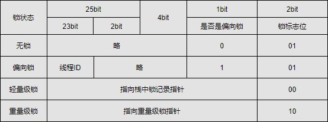

- 类型指针（什么类的实例）

- 实例数据

> 程序代码中所定义的各种类型的字段内容(包含父类继承下来的和子类中定义的)。即对象的有效信息，相同宽度（如long和double）的字段被分配在一起，父类属性在子类属性之前。

- 对齐填充

> 不是必然需要，主要是占位，保证对象大小是某个字节的整数倍。

### 3.2 对象的创建

遇到 new 指令时，首先检查这个指令的参数是否能在常量池中定位到一个类的符号引用，并且检查这个符号引用代表的类是否已经被加载、解析和初始化过。如果没有，执行相应的[类加载](https://blog.csdn.net/weixin_43691723/article/details/106760305)。
类加载检查通过之后，为新对象分配内存(内存大小在类加载完成后便可确认)。在堆的空闲内存中划分一块区域（‘指针碰撞-内存规整’或‘空闲列表-内存交错’的分配方式)
内存空间分配完成后会初始化为 0(不包括对象头)，接下来就是填充对象头，把对象是哪个类的实例、如何才能找到类的元数据信息、对象的哈希码、对象的 GC 分代年龄等信息存入对象头。
执行 new 指令以及执行 init 方法后才算一个真正可用的对象创建完成。

### 3.3 对象的访问定位

由于reference类型在Java虚拟机规范里面只规定了一个指向对象的引用，并没有定义这个引用应该通过哪种方式去定位，以及访问到Java堆中的对象的具体位置，因此不同虚拟机实现的对象访问方式会有所不同，主流的访问方式有两种：使用句柄池和直接使用指针。

- 通过句柄访问
  Java 堆中会分配一块内存作为句柄池。reference 存储的是句柄地址

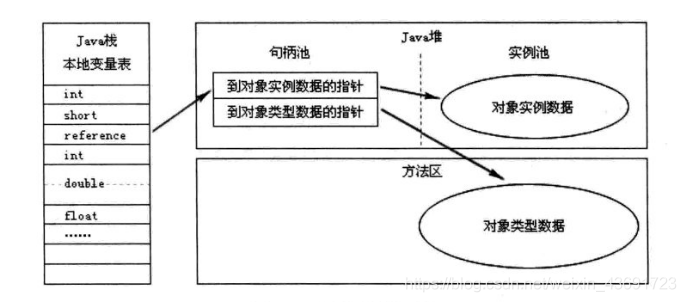

- 使用直接指针访问
  reference 中直接存储对象地址

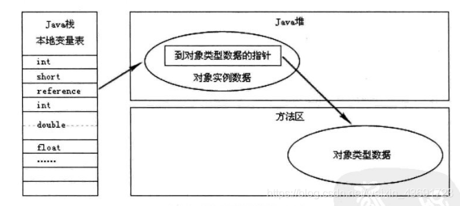

比较：使用句柄的最大好处是 reference 中存储的是稳定的句柄地址，在对象移动(垃圾收集时移动对象是非常普遍的行为)是只改变实例数据指针地址，reference 自身不需要修改。直接指针访问的最大好处是速度快，节省了一次指针定位的时间开销。如果是对象频繁 GC 那么句柄方法好，如果是对象频繁访问则直接指针访问好。

## 4. JVM垃圾回收机制

### 4.1 概述

> 程序计数器、虚拟机栈、本地方法栈 3 个区域随线程生灭(因为是线程私有)，栈中的栈帧随着方法的进入和退出而有条不紊地执行着出栈和入栈操作。而 Java 堆和方法区则不一样，一个接口中的多个实现类需要的内存可能不一样，一个方法中的多个分支需要的内存也可能不一样，我们只有在程序处于运行期才知道那些对象会创建，这部分内存的分配和回收都是动态的，垃圾回收期所关注的就是这部分内存。

### 4.2 判断对象已死

在进行内存回收之前要做的事情就是判断那些对象是‘死’的，哪些是‘活’的。

- 引用计数法
  给对象添加一个引用计数器。但是难以解决循环引用（相互引用对方，但其实这两个对象都已经无用）问题。

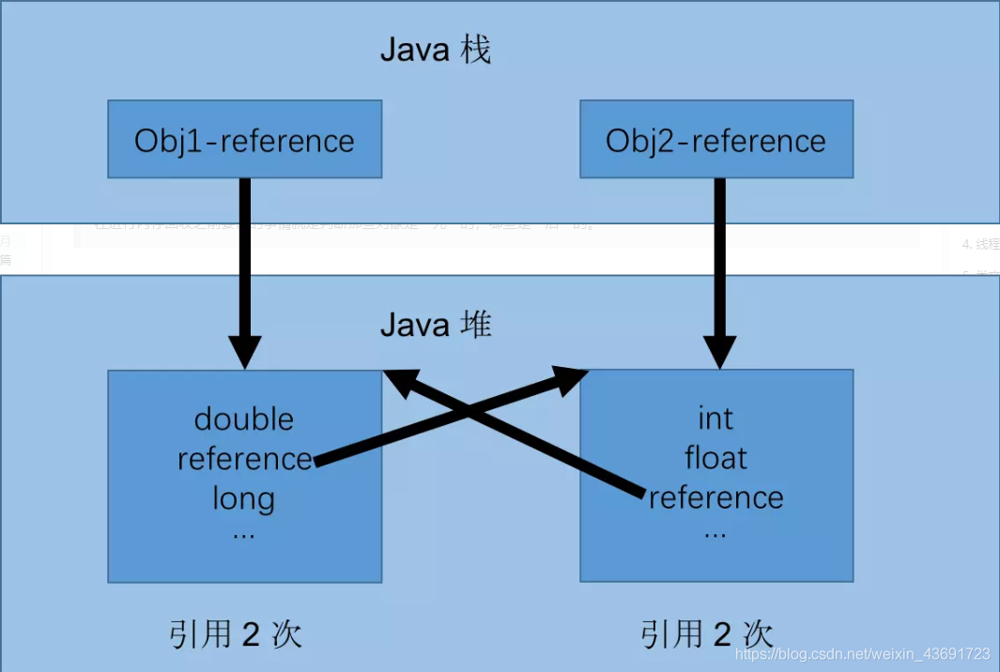

从图中可以看出，如果不下小心直接把 Obj1-reference 和 Obj2-reference 置 null。则在 Java 堆当中的两块内存依然保持着互相引用无法回收。

- 可达性分析算法
  通过一系列的 ‘GC Roots’ 的对象作为起始点，从这些节点出发所走过的路径称为引用链。当一个对象到 GC Roots 没有任何引用链相连的时候说明对象不可用。

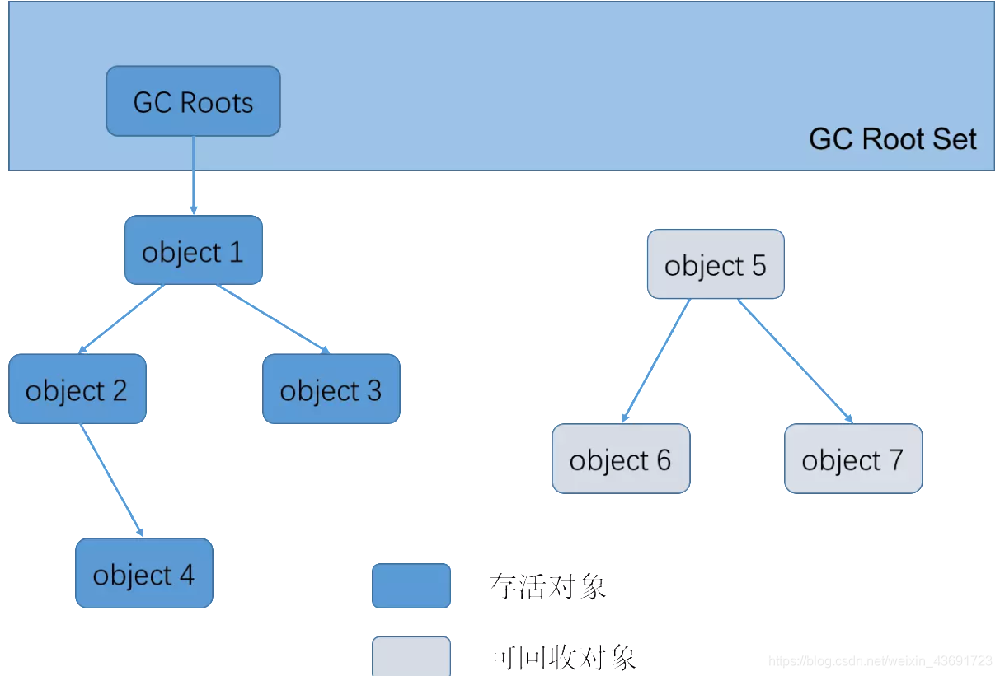

可作为 GC Roots 的对象：

- 虚拟机栈(栈帧中的本地变量表)中引用的对象
- 方法区中类静态属性引用的对象
- 方法区中常量引用的对象
- 本地方法栈中 JNI(即一般说的 Native 方法) 引用的对象

### 4.3 Java 中的引用

`Java`中的引用的定义很传统：如果`reference`类型的数据中存储的数值代表的是另外一块内存的起始地址，就称这块内存代表着一个引用。 这种定义很纯粹，但是太过狭隘，一个对象在这种定义下只有被引用或者没有被引用两种状态，对于如何描述一些“食之无味，弃之可惜”的对象就显得无能为力。 我们希望能描述这样一类对象：当内存空间还足够时，则能保留在内存之中；如果内存空间在进行垃圾收集后还是非常紧张，则可以抛弃这些对象。 很多系统的缓存功能都符合这样的应用场景。

说白了传统的两种应用没法描述对象生命周期中的多种状态，对象有哪些状态呢。

在`Java`中，对象的生命周期包括以下几个阶段：

1. 创建阶段(`Created`)
2. 应用阶段(`In Use`)
3. 不可见阶段(`Invisible`)
4. 不可达阶段(`Unreachable`)
5. 收集阶段(`Collected`)
6. 终结阶段(`Finalized`)
7. 间重分配阶段(`De-allocated`)

> 创建阶段(Created)
> 在创建阶段系统通过下面的几个步骤来完成对象的创建过程

```
为对象分配存储空间
开始构造对象
从超类到子类对static成员进行初始化
超类成员变量按顺序初始化，递归调用超类的构造方法
子类成员变量按顺序初始化，子类构造方法调用
一旦对象被创建，并被分派给某些变量赋值，这个对象的状态就切换到了应用阶段
```

> 应用阶段(`In Use`)
> 对象至少被一个强引用持有着。

> 不可见阶段(`Invisible`)
> 当一个对象处于不可见阶段时，说明程序本身不再持有该对象的任何强引用，虽然这些引用仍然是存在着的。
> 简单说就是程序的执行已经超出了该对象的作用域了。

> 不可达阶段(`Unreachable`)
>  对象处于不可达阶段是指该对象不再被任何强引用所持有。
>  与“不可见阶段”相比，“不可见阶段”是指程序不再持有该对象的任何强引用，这种情况下，该对象仍可能被`JVM`等系统下的某些已装载的静态变量或线程或`JNI`等强引用持有着，这些特殊的强引用被称为”`GC root`”。存在着这些`GC root`会导致对象的内存泄露情况，无法被回收。

> 收集阶段(`Collected`)
>  当垃圾回收器发现该对象已经处于“不可达阶段”并且垃圾回收器已经对该对象的内存空间重新分配做好准备时，则对象进入了“收集阶段”。如果该对象已经重写了`finalize()`方法，则会去执行该方法的终端操作。
>  这里要特别说明一下：不要重载finazlie()方法！原因有两点：
>
> ​	1.会影响JVM的对象分配与回收速度
>  ​	在分配该对象时，JVM需要在垃圾回收器上注册该对象，以便在回收时能够执行该重载方法；在该方法的执行时需要消耗CPU时间	且在执行完该方法后才会重新执行回收操作，即至少需要垃圾回收器对该对象执行两次GC。
>
> ​	2.可能造成该对象的再次“复活”
>  ​	在finalize()方法中，如果有其它的强引用再次持有该对象，则会导致对象的状态由“收集阶段”又重新变为“应用阶段”。这个已经破	坏了Java对象的生命周期进程，且“复活”的对象不利用后续的代码管理。

> 终结阶段
> 当对象执行完finalize()方法后仍然处于不可达状态时，则该对象进入终结阶段。在该阶段是等待垃圾回收器对该对象空间进行回收。

> 对象空间重新分配阶段
> 垃圾回收器对该对象的所占用的内存空间进行回收或者再分配了，则该对象彻底消失了，称之为“对象空间重新分配阶段”。

- **哪4种，各有什么特点**

1. 强引用

   > 强引用是使用最普遍的引用。如果一个对象具有强引用，那垃圾收器绝不会回收它。当内存空间不足，Java虚拟机宁愿抛出`OutOfM moryError`错误，使程序异常终止，也不会靠随意回收具有强引用 对象来解决内存不足的问题。

2. 软引用

   > 软引用是用来描述一些还有用但并非必须的对象。对于软引用关联着的对象，在系统将要发生内存溢出异常之前，将会把这些对象列进回收范围进行第二次回收。如果这次回收还没有足够的内存，才会抛出内存溢出异常。

   ```java
   /**
    * 软引用何时被收集
    * 运行参数 -Xmx200m -XX:+PrintGC
    * Created by ccr at 2018/7/14.
    */
   public class SoftReferenceDemo {
   
       public static void main(String[] args) throws InterruptedException {
           //100M的缓存数据
           byte[] cacheData = new byte[100 * 1024 * 1024];
           //将缓存数据用软引用持有
           SoftReference<byte[]> cacheRef = new SoftReference<>(cacheData);
           //将缓存数据的强引用去除
           cacheData = null;
           System.out.println("第一次GC前" + cacheData);
           System.out.println("第一次GC前" + cacheRef.get());
           //进行一次GC后查看对象的回收情况
           System.gc();
           //等待GC
           Thread.sleep(500);
           System.out.println("第一次GC后" + cacheData);
           System.out.println("第一次GC后" + cacheRef.get());
   
           //再分配一个120M的对象，看看缓存对象的回收情况
           byte[] newData = new byte[120 * 1024 * 1024];
           System.out.println("分配后" + cacheData);
           System.out.println("分配后" + cacheRef.get());
       }
   
   }
   
   //第一次GC前null
   //第一次GC前[B@7d4991ad
   //[GC (System.gc())  105728K->103248K(175104K), 0.0009623 secs]
   //[Full GC (System.gc())  103248K->103139K(175104K), 0.0049909 secs]
   //第一次GC后null
   //第一次GC后[B@7d4991ad
   //[GC (Allocation Failure)  103805K->103171K(175104K), 0.0027889 secs]
   //[GC (Allocation Failure)  103171K->103171K(175104K), 0.0016018 secs]
   //[Full GC (Allocation Failure)  103171K->103136K(175104K), 0.0089988 secs]
   //[GC (Allocation Failure)  103136K->103136K(199680K), 0.0009408 secs]
   //[Full GC (Allocation Failure)  103136K->719K(128512K), 0.0082685 secs]
   //分配后null
   //分配后null
   ```

   > 从上面的示例中就能看出，软引用关联的对象不会被`GC`回收。`JVM`在分配空间时，如果`Heap`空间不足，就会进行相应的`GC`，但是这次`GC`并不会收集软引用关联的对象，但是在JVM发现就算进行了一次回收后还是不足（`Allocation Failure`），`JVM`会尝试第二次`GC`，回收软引用关联的对象。

   > 像这种如果内存充足，`GC`时就保留，内存不够，`GC`再来收集的功能很适合用在缓存的引用场景中。在使用缓存时有一个原则，如果缓存中有就从缓存获取，如果没有就从数据库中获取，缓存的存在是为了加快计算速度，如果因为缓存导致了内存不足进而整个程序崩溃，那就得不偿失了。

3. 弱引用

   > 弱引用也是用来描述非必须对象的，他的强度比软引用更弱一些，被弱引用关联的对象，在垃圾回收时，如果这个对象只被弱引用关联（没有任何强引用关联他），那么这个对象就会被回收。

   ```java
   /**
    * 弱引用关联对象何时被回收
    * Created by ccr at 2018/7/14.
    */
   public class WeakReferenceDemo {
       public static void main(String[] args) throws InterruptedException {
           //100M的缓存数据
           byte[] cacheData = new byte[100 * 1024 * 1024];
           //将缓存数据用弱引用持有
           WeakReference<byte[]> cacheRef = new WeakReference<>(cacheData);
           System.out.println("第一次GC前" + cacheData);
           System.out.println("第一次GC前" + cacheRef.get());
           //进行一次GC后查看对象的回收情况
           System.gc();
           //等待GC
           Thread.sleep(500);
           System.out.println("第一次GC后" + cacheData);
           System.out.println("第一次GC后" + cacheRef.get());
   
           //将缓存数据的强引用去除
           cacheData = null;
           System.gc();
           //等待GC
           Thread.sleep(500);
           System.out.println("第二次GC后" + cacheData);
           System.out.println("第二次GC后" + cacheRef.get());
       }
   }
   //第一次GC前[B@7d4991ad
   //第一次GC前[B@7d4991ad
   //第一次GC后[B@7d4991ad
   //第一次GC后[B@7d4991ad
   //第二次GC后null
   //第二次GC后null
   ```

   > 从上面的代码中可以看出，弱引用关联的对象是否回收取决于这个对象有没有其他强引用指向它。这个确实很难理解，既然弱引用关联对象的存活周期和强引用差不多，那直接用强引用好了，干嘛费用弄出个弱引用呢？其实弱引用存在必然有他的应用场景。

   ```java
   static Map<Object,Object> container = new HashMap<>();
   
   public static void putToContainer(Object key,Object value){
       container.put(key,value);
   }
   
   public static void main(String[] args) {
       //某个类中有这样一段代码
       Object key = new Object();
       Object value = new Object();
       putToContainer(key,value);
   
       //..........
       /**
        * 若干调用层次后程序员发现这个key指向的对象没有用了，
        * 为了节省内存打算把这个对象抛弃，然而下面这个方式真的能把对象回收掉吗？
        * 由于container对象中包含了这个对象的引用,所以这个对象不能按照程序员的意向进行回收.
        * 并且由于在程序中的任何部分没有再出现这个键，所以，这个键 / 值 对无法从映射中删除。
        * 很可能会造成内存泄漏。
        */
       key = null;
   }
   ```

   下面一段话摘自《Java核心技术卷1》：

   > 设计 `WeakHashMap`类是为了解决一个有趣的问题。如果有一个值，对应的键已经不再 使用了， 将会出现什么情况呢？ 假定对某个键的最后一次引用已经消亡，不再有任何途径引 用这个值的对象了。但是，由于在程序中的任何部分没有再出现这个键，所以，这个键 / 值 对无法从映射中删除。为什么垃圾回收器不能够删除它呢？ 难道删除无用的对象不是垃圾回 收器的工作吗？

   > 遗憾的是，事情没有这样简单。垃圾回收器跟踪活动的对象。只要映射对象是活动的， 其中的所有桶也是活动的， 它们不能被回收。因此，需要由程序负责从长期存活的映射表中 删除那些无用的值。 或者使用 `WeakHashMap`完成这件事情。当对键的唯一引用来自散列条
   >  目时， 这一数据结构将与垃圾回收器协同工作一起删除键 / 值对。

   > 下面是这种机制的内部运行情况。`WeakHashMap` 使用弱引用（`weak references`) 保存键。 `WeakReference` 对象将引用保存到另外一个对象中，在这里，就是散列键。对于这种类型的 对象，垃圾回收器用一种特有的方式进行处理。通常，如果垃圾回收器发现某个特定的对象 已经没有他人引用了，就将其回收。然而， 如果某个对象只能由 `WeakReference` 引用， 垃圾 回收器仍然回收它，但要将引用这个对象的弱引用放人队列中。`WeakHashMap`将周期性地检 查队列， 以便找出新添加的弱引用。一个弱引用进人队列意味着这个键不再被他人使用， 并 且已经被收集起来。于是， `WeakHashMap`将删除对应的条目。

   除了`WeakHashMap`使用了弱引用，`ThreadLocal`类中也是用了弱引用。

4. 虚引用

   > 一个对象是否有虚引用的存在，完全不会对其生存时间构成影响，也无法通过虚引用来获取一个对象的实例。为一个对象设置虚引用关联的唯一目的就是能在这个对象被收集器回收时收到一个系统通知。虚引用和弱引用对关联对象的回收都不会产生影响，如果只有虚引用活着弱引用关联着对象，那么这个对象就会被回收。它们的不同之处在于弱引用的`get`方法，虚引用的`get`方法始终返回`null`,弱引用可以使用`ReferenceQueue`,虚引用必须配合`ReferenceQueue`使用。

   > `jdk`中直接内存的回收就用到虚引用，由于`jvm`自动内存管理的范围是堆内存，而直接内存是在堆内存之外（其实是内存映射文件，自行去理解虚拟内存空间的相关概念），所以直接内存的分配和回收都是有`Unsafe`类去操作，`java`在申请一块直接内存之后，会在堆内存分配一个对象保存这个堆外内存的引用，这个对象被垃圾收集器管理，一旦这个对象被回收，相应的用户线程会收到通知并对直接内存进行清理工作。


无论引用计数算法还是可达性分析算法都是基于强引用而言的。

### 4.4 生存还是死亡

即使在可达性分析算法中不可达的对象，也并非是非死不可的，这时候它们暂时出于“缓刑”阶段，一个对象的真正死亡至少要经历两次标记过程：
第一次标记：如果对象在进行可达性分析后发现没有与GC Roots相连接的引用链，那它将会被第一次标记；

第二次标记：第一次标记后接着会进行一次筛选，筛选的条件是此对象是否有必要执行finalize（）方法，当对象没有覆盖 finalize() 方法，或者 finalize() 方法已经被虚拟机调用过，虚拟机将这两种情况都视为“没有必要执行”，如果对象没有必要执行finalize方法，那么第一次标记的对象就没有用了，不会被回收。
如果这个对象被判定为有必要执行 finalize() 方法，那么这个对象会放置在一个叫做 F-Queue 的队列中，并在稍后由一个由虚拟机自动建立的、低优先级的 Finalizer 线程去执行它。这里所谓的“执行”是指虚拟机会出发这个方法，并不承诺或等待他运行结束。在finalize（）方法中没有重新与引用链建立关联关系的，将被进行第二次标记。

第二次标记成功的对象将真的会被回收，如果对象在finalize（）方法中重新与引用链建立了关联关系，那么将会逃离本次回收，继续存活，finalize() 方法是对象逃脱死亡命运的最后一次机会。

finalize() 方法只会被系统自动调用一次。

### 4.5 回收方法区

> 在堆中，尤其是在新生代中，一次垃圾回收一般可以回收 70% ~ 95% 的空间，而永久代的垃圾收集效率远低于此。
> 永久代（方法区）垃圾回收主要两部分内容：废弃的常量和无用的类。

- 判断废弃常量：一般是判断有没有该常量的引用。

- 判断无用的类：要以下三个条件都满足
  - 该类所有的实例都已经回收，也就是 Java 堆中不存在该类的任何实例
  - 加载该类的 ClassLoader 已经被回收
  - 该类对应的 java.lang.Class 对象没有任何地方被引用，无法在任何地方通过反射访问该类的方法

### 4.6 垃圾回收算法

- 标记-清除(Mark-Sweep)算法

> 标记—清除算法是最基础的收集算法，它分为“标记”和“清除”两个阶段：首先标记出所需回收的对象，在标记完成后统一回收掉所有被标记的对象，它的标记过程其实就是前面的可达性分析算法中判定垃圾对象的标记过程。标记—清除算法的执行情况如下图所示：
>
> 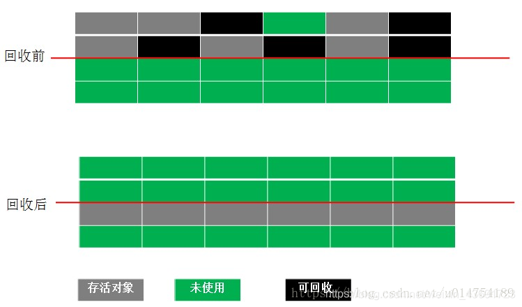
>
> 主要缺点：
>
> - 一个是效率问题，标记和清除过程的效率都不高。
> - 另一个是空间问题，标记清除之后会产生大量不连续的内存碎片，空间碎片太多可能会导致：当程序在以后的运行过程中需要分配较大对象时无法找到足够的连续内存而不得不提前出发另一次垃圾收集动作。

- 复制算法(Copying)

> 为了解决Mark-Sweep算法的缺陷，Copying算法就被提了出来。它将可用内存按容量划分为大小相等的两块，每次只使用其中的一块。当这一块的内存用完了，就将还存活着的对象复制到另外一块上面，然后再把已使用的内存空间一次清理掉，这样一来就不容易出现内存碎片的问题。
>
> 
>
> 这种算法虽然实现简单，运行高效且不容易产生内存碎片，但是却对内存空间的使用做出了高昂的代价，因为能够使用的内存缩减到原来的一半。很显然，Copying算法的效率跟存活对象的数目多少有很大的关系，如果存活对象很多，那么Copying算法的效率将会大大降低。
>
> 现在的商业虚拟机都采用这种收集算法来回收新生代，IBM公司的专门研究表明，新生代中的对象98%是“朝生夕死”的，所以并不需要按照1:1的比例来划分内存空间，而是将内存分为一块较大的Eden空间和两块较小的Survivor空间，每次使用Eden和其中一块Survivor。当回收时，将Eden和Survivor中还存活着的对象一次性的复制到另外一块Survivor，最后清理掉Eden和刚才用过的Survivor空间。HotSpot虚拟机默认Eden和Survivor的大小比例是8:1，也就是每次新生代中可用内存为整个新生代容量的90%（80%+10%），只有10%的内存会被“浪费”。

- 标记-整理(Mark-Compact)算法

> 为了解决Copying算法的缺陷，充分利用内存空间，提出了Mark-Compact算法。该算法标记阶段和Mark-Sweep一样，但是在完成标记之后，它不是直接清理可回收对象，而是将存活对象都向一端移动，然后清理掉端边界以外的内存并更新引用其对象的指针。
>
> 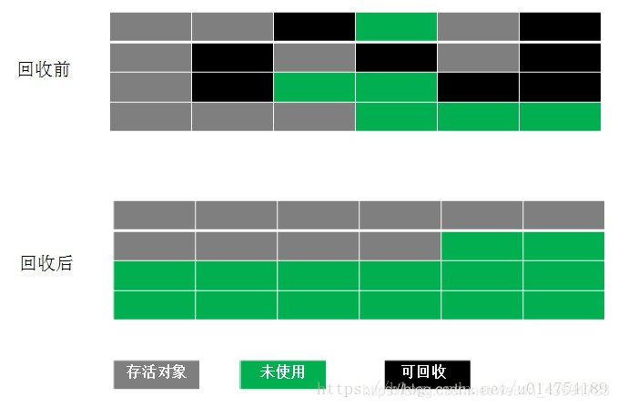

- 分代收集（Generational Collection）算法

> 当前商业虚拟机的垃圾收集 都采用分代收集，它根据对象的存活周期的不同将内存划分为几块，一般是把Java堆分为新生代和老年代。在新生代中，每次垃圾收集时都会发现有大量对象死去，只有少量存活，因此可选用复制算法来完成收集，而老年代中因为对象存活率高、没有额外空间对它进行分配担保，就必须使用标记—清除算法或标记—整理算法来进行回收。

年轻代的垃圾收集算法：

> 在年轻代中jvm使用的是复制算法，年轻代分三个区。一个Eden区，两个 Survivor区(一般而言)。大部分对象在Eden区中生成。当Eden区满时，还存活的对象将被复制到Survivor区（两个中的一个），当这个 Survivor区满时，此区的存活对象将被复制到另外一个Survivor区，当另外一个Survivor区也满了的时候，从第一个Survivor区复制过来的并且此时还存活的对象，将被复制到“年老区(Tenured)”。需要注意，Survivor的两个区是对称的，没先后关系，所以同一个区中可能同时存在从Eden复制过来对象，和从前一个Survivor复制过来的对象，而复制到年老区的只有从第一个Survivor区过来的对象。而且，Survivor区总有一个是空的。当survivor1区不足以存放 eden和survivor0的存活对象时，就将存活对象直接存放到老年代。

老年代（Old Generation）的回收算法：

> 老年代的特点是每次回收都只回收少量对象，一般使用的是Mark-Compact（标记-整理）算法。在年轻代中经历了N次垃圾回收后仍然存活的对象，就会被放到年老代中。因此，可以认为年老代中存放的都是一些生命周期较长的对象。内存比新生代也大很多(大概比例是1:2)，当老年代内存满时触发Major GC或Full GC，Full GC发生频率比较低，老年代对象存活时间比较长，存活率标记高。

### 4.8 垃圾回收的时机

- 当Eden区或者Servior区不够用了
- 老年代空间不够用了
- 方法区空间不够用了
- 手动回收，System.gc()（不建议使用）

### 4.9 垃圾回收分析

内存分配策略：

- 对象优先在Eden分配。
- 大对象直接进入老年代。
- 长期存活的对象将进入老年代。

对垃圾回收策略说明以下两点：

- 新生代GC（Minor GC）：发生在新生代的垃圾收集动作，因为Java对象大多都具有朝生夕灭的特性，因此Minor GC非常频繁，一般回收速度也比较快。
- 老年代GC（Major GC/Full GC）：发生在老年代的GC，出现了Major GC，经常会伴随至少一次Minor GC。由于老年代中的对象生命周期比较长，因此Major GC并不频繁，一般都是等待老年代满了后才进行Full GC，而且其速度一般会比Minor GC慢10倍以上。另外，如果分配了Direct Memory，在老年代中进行Full GC时，会顺便清理掉Direct Memory中的废弃对象。

### 4.10 垃圾回收器

垃圾收集算法是内存回收的理论，而垃圾回收器是内存回收的实践。

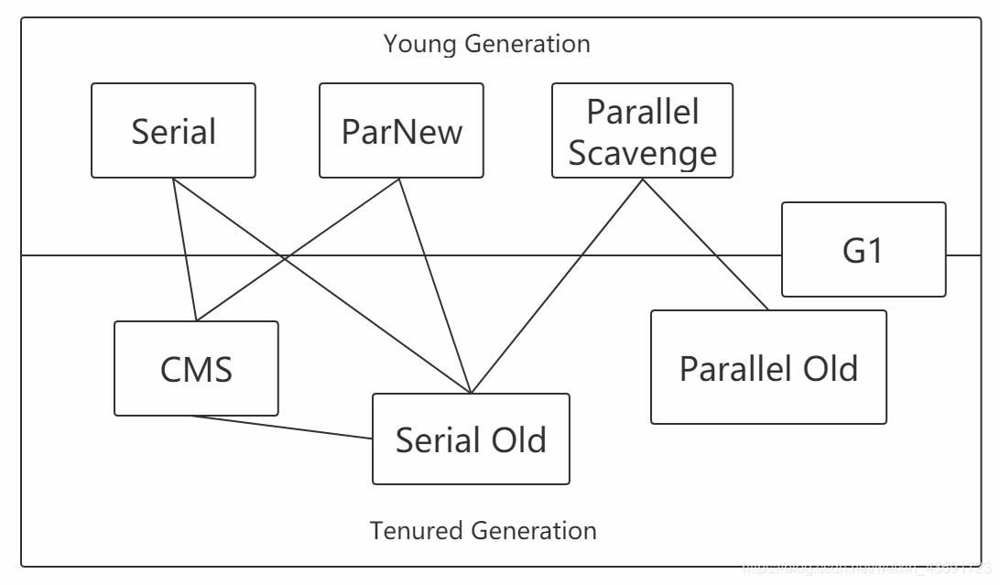

- Serial 收集器

> 这是一个新生代单线程收集器，标记和清理都是单线程。意味着它只会使用一个 CPU 或一条收集线程去完成收集工作，并且在进行垃圾回收时必须暂停其它所有的工作线程直到收集结束。

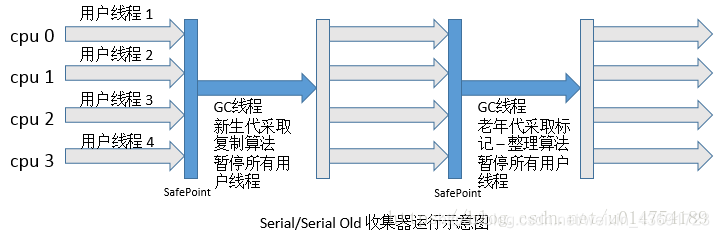

- Serial Old

> 老年代单线程收集器，Serial收集器的老年代版本，采用标记整理算法。

- ParNew 收集器

> 新生代收集器，可以认为是Serial收集器的多线程版本，使用多个线程进行垃圾收集,在多核CPU环境下有着比Serial更好的表现。是Server模式下的虚拟机首选的新生代收集器，其中有一个很重要的和性能无关的原因是，除了Serial收集器外，目前只有它能与CMS收集器配合工作。
> 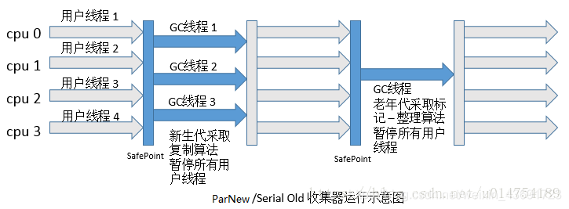

在学习其他的垃圾收集器之前，要先明白两个概念

并行：Parallel

> 指多条垃圾收集线程并行工作，此时用户线程处于等待状态

并发：Concurrent

> 指用户线程和垃圾回收线程同时执行(不一定是并行，有可能是交叉执行)，用户进程在运行，而垃圾回收线程在另一个 CPU 上运行。

- Parallel Scavenge收集器

> Parallel Scavenge收集器是一个新生代收集器，它也是使用复制算法的收集器，又是并行的多线程收集器，看上去和ParNew一样，但是Parallel Scanvenge更关注系统的吞吐量。
> 吞吐量=运行用户代码的时间/(运行用户代码的时间+垃圾收集时间)
> 比如虚拟机总共运行了100分钟，垃圾收集时间用了1分钟，吞吐量=(100-1)/100=99%。
> 若吞吐量越大，意味着垃圾收集的时间越短，则用户代码可以充分利用CPU资源，尽快完成程序的运算任务。

- Parallel Old收集器

> Parallel Scavenge收集器的老年代版本，并行收集器，吞吐量优先。使用多线程和标记-整理（Mark-Compact）算法。

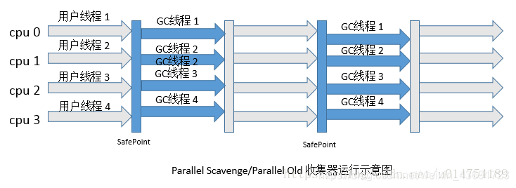

- CMS(Concurrent Mark Sweep)收集器

> CMS(Concurrent Mark Sweep)收集器是一种以获取`最短回收停顿时间`为目标的收集器。它是一种并发收集器，采用的是Mark-Sweep算法

采用的是"标记-清除算法",整个过程分为4步

1. 初始标记，标记GCRoots能直接关联到的对象，时间很短。所以这里用的是单线程，会导致停顿（stw，stop the world）。

2. 并发标记，进行GCRoots Tracing（可达性分析）过程，时间很长。所以用的是多线程。

3. 重新标记，修正并发标记期间的变动部分，时间较长，会导致停顿（stw，stop the world）。

4. 并发清除，回收内存空间，时间很长。

由于整个过程中，并发标记和并发清除，收集器线程可以与用户线程一起工作，所以总体上来说，CMS收集器的内存回收过程是与用户线程一起并发地执行的。

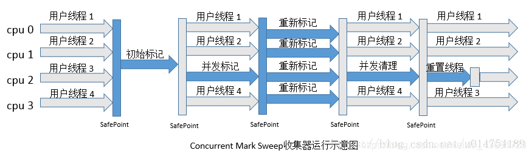

优点：并发收集、低停顿
缺点

> - 对CPU资源非常敏感，可能会导致应用程序变慢，吞吐率下降。
> - 无法处理浮动垃圾，因为在并发清理阶段用户线程还在运行，自然就会产生新的垃圾，而在此次收集中无法收集他们，只能留到下次收
> - 集，这部分垃圾为浮动垃圾，同时，由于用户线程并发执行，所以需要预留一部分老年代空间提供并发收集时程序运行使用。
>   由于采用的标记 - 清除算法，会产生大量的内存碎片

- G1
  G1收集器是当今收集器技术发展最前沿的成果，它是一款面向服务端应用的收集器，它能充分利用多CPU、多核环境。因此它是一款并行与并发收集器，并且它能建立可预测的停顿时间模型。

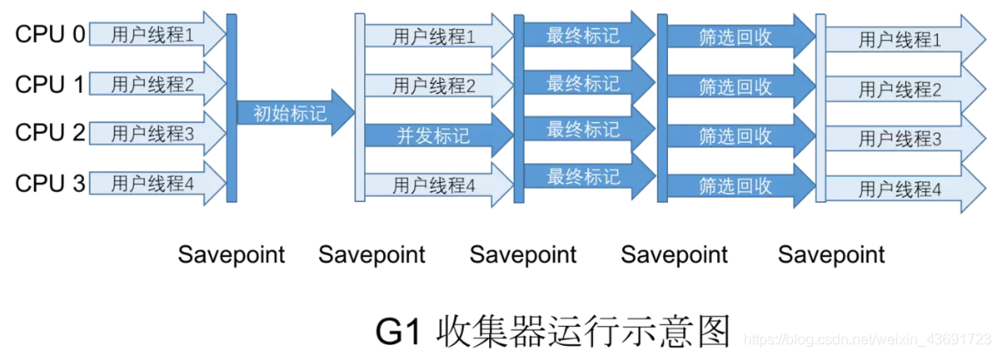

G1收集器有以下特点：

(1). 并行和并发。使用多个CPU来缩短Stop The World停顿时间，与用户线程并发执行。

(2). 分代收集。独立管理整个堆，但是能够采用不同的方式去处理新创建对象和已经存活了一段时间、熬过多次GC的旧对象，以获取更好的收集效果。

(3). 空间整合。基于标记 - 整理算法，无内存碎片产生。

(4). 可预测的停顿。能建立可预测的停顿时间模型，能让使用者明确指定在一个长度为M毫秒的时间片段内，消耗在垃圾收集上的时间不得超过N毫秒，那么就会回收在不超过N毫秒时间内能够回收的，可能还有不能回收的。

使用G1收集器时，Java堆的内存布局与其他收集器有很大差别，它将整个Java堆划分为多个大小相等的独立区域（Region），虽然还保留有新生代和老年代的概念，但新生代和老年代不再是物理隔离的了，它们都是一部分（可以不连续）Region的集合。

### 4.11 垃圾收集信息解读实战

#### demo1

```java
public class Main {
    public static void main(String[] args) {
        {
            byte[] bytes=new byte[20*1024*1024];
        }
        System.gc();
    }
}
```

在 verbose:gc -XX:PrintGCDetails 之后

控制台显示:

```
[GC (System.gc()) [PSYoungGen: 25398K->952K(56320K)] 25398K->21432K(184832K), 0.0200508 secs] [Times: user=0.01 sys=0.00, real=0.02 secs] 

新生代占用内存减小了,但是整个堆内存使用量并没有减小太多远没有20M,那么这20M去了哪儿?,这说明内存占用转移到了老年代,从之后的FullGC可以验证,老年代20480->21384k,没有被回收掉,一直在老年代中
[Full GC (System.gc()) [PSYoungGen: 952K->0K(56320K)] [ParOldGen: 20480K->21384K(128512K)] 21432K->21384K(184832K), [Metaspace: 3497K->3497K(1056768K)], 0.0242428 secs] [Times: user=0.03 sys=0.00, real=0.02 secs] 
Heap
 PSYoungGen      total 56320K, used 973K [0x0000000781900000, 0x0000000785780000, 0x00000007c0000000)
  eden space 48640K, 2% used [0x0000000781900000,0x00000007819f34c0,0x0000000784880000)
  from space 7680K, 0% used [0x0000000784880000,0x0000000784880000,0x0000000785000000)
  to   space 7680K, 0% used [0x0000000785000000,0x0000000785000000,0x0000000785780000)
 ParOldGen       total 12851·2K, used 21384K [0x0000000704a00000, 0x000000070c780000, 0x0000000781900000)
  object space 128512K, 16% used [0x0000000704a00000,0x0000000705ee22d8,0x000000070c780000)
 Metaspace       used 3506K, capacity 4496K, committed 4864K, reserved 1056768K
  class space    used 386K, capacity 388K, committed 512K, reserved 1048576K
```

#### demo2

```java
public class Main {
    public static void main(String[] args) {
        {
            byte[] bytes = new byte[20*1024*1024];
        }
        int a = 10;
        System.gc();
    }
}
```

```
[GC (System.gc()) [PSYoungGen: 25398K->968K(56320K)] 25398K->976K(184832K), 0.0194207 secs] [Times: user=0.03 sys=0.00, real=0.02 secs] 

这个明显是新生代内存占用减少的量跟整个堆内存占用减少的量是相等的,说明直接被回收了

[Full GC (System.gc()) [PSYoungGen: 968K->0K(56320K)] [ParOldGen: 8K->909K(128512K)] 976K->909K(184832K), [Metaspace: 3455K->3455K(1056768K)], 0.0084968 secs] [Times: user=0.03 sys=0.00, real=0.01 secs] 
Heap
 PSYoungGen      total 56320K, used 973K [0x0000000781900000, 0x0000000785780000, 0x00000007c0000000)
  eden space 48640K, 2% used [0x0000000781900000,0x00000007819f3510,0x0000000784880000)
  from space 7680K, 0% used [0x0000000784880000,0x0000000784880000,0x0000000785000000)
  to   space 7680K, 0% used [0x0000000785000000,0x0000000785000000,0x0000000785780000)
 ParOldGen       total 128512K, used 909K [0x0000000704a00000, 0x000000070c780000, 0x0000000781900000)
  object space 128512K, 0% used [0x0000000704a00000,0x0000000704ae34e8,0x000000070c780000)
 Metaspace       used 3477K, capacity 4496K, committed 4864K, reserved 1056768K
  class space    used 381K, capacity 388K, committed 512K, reserved 1048576K
```

#### demo3

```java
public class Main {
    public static void main(String[] args) {
        {
            byte[] bytes = new byte[20*1024*1024];
            bytes = null;
        }
        System.gc();
    }
}
```

```
[GC (System.gc()) [PSYoungGen: 25398K->1048K(56320K)] 25398K->1056K(184832K), 0.0025668 secs] [Times: user=0.00 sys=0.00, real=0.00 secs] 

同上

[Full GC (System.gc()) [PSYoungGen: 1048K->0K(56320K)] [ParOldGen: 8K->904K(128512K)] 1056K->904K(184832K), [Metaspace: 3498K->3498K(1056768K)], 0.0356986 secs] [Times: user=0.05 sys=0.00, real=0.04 secs] 
Heap
 PSYoungGen      total 56320K, used 973K [0x0000000781900000, 0x0000000785780000, 0x00000007c0000000)
  eden space 48640K, 2% used [0x0000000781900000,0x00000007819f34c0,0x0000000784880000)
  from space 7680K, 0% used [0x0000000784880000,0x0000000784880000,0x0000000785000000)
  to   space 7680K, 0% used [0x0000000785000000,0x0000000785000000,0x0000000785780000)
 ParOldGen       total 128512K, used 904K [0x0000000704a00000, 0x000000070c780000, 0x0000000781900000)
  object space 128512K, 0% used [0x0000000704a00000,0x0000000704ae2258,0x000000070c780000)
 Metaspace       used 3511K, capacity 4498K, committed 4864K, reserved 1056768K
  class space    used 387K, capacity 390K, committed 512K, reserved 1048576K
```

#### 总结: 

用过的变量如果比较大,最好是置为null,否则,如上的大数组就会一直占用着内存,因为引用一直是存在的.

### 4.12 jvm调优示例

#### 案例一

背景：绩效考核系统，会针对每一个考核员工生成一个各考核点的考核结果，形成一个Excel文档，供用户下载。文档中包含用户提交的考核点信息以及分析信息，Excel文档由用户请求的时候生成，下载并保存在内存服务器一份。64G内存。

问题：经常有用户反映长时间卡顿的问题。

处理思路：

- 优化SQL（无效）
- 监控CPU
- 监控内存发现经常发生Full GC 20-30s
  运行时产生大对象（每个教师考核的数据WorkBook），直接放入老年代，MinorGC不会去清理，会导致FullGC，且堆内存分配太大，时间过长。

解决方案：部署多个web容器，每个web容器的堆内存4G，单机TomCat集群。

#### 案例二

背景：简单数据抓取系统，抓取网络上的一些数据，分发到其它应用。

问题：不定期内存溢出，把堆内存加大，无济于事，内存监控也正常。

处理方法：NIO使用了**堆外内存**，堆外内存无法垃圾回收，导致溢出。

## 5.内存分配

**原则：**

1. 优先分配到Eden
   \2. 大对象直接分配到老年代
   \3. 长期存活的对象分配到老年代
   \4. 空间分配担保
   \5. 动态对象的年龄判断

### JVM最大堆内存、最大非堆内存

(1)堆内存分配

JVM初始分配的内存由-Xms指定，默认是物理内存的1/64；JVM最大分配的内存由-Xmx指定，默认是物理内存的1/4。默认空余堆内存小 于40%时，JVM就会增大堆直到-Xmx的最大限制；空余堆内存大于70%时，JVM会减少堆直到-Xms的最小限制。因此服务器一般设置-Xms、 -Xmx相等以避免在每次GC后调整堆的大小。

(2)非堆内存分配

JVM使用-XX:PermSize设置非堆内存初始值，默认是物理内存的1/64；由-XX:MaxPermSize设置最大非堆内存的大小，默认是物理内存的1/4。

(3)VM最大内存

首先JVM内存限制于实际的最大物理内存，假设物理内存无限大的话，JVM内存的最大值跟操作系统有很大的关系。简单的说就32位处理器虽然可控内存空间有4GB,但是具体的操作系统会给一个限制，这个限制一般是2GB-3GB（一般来说Windows系统下为1.5G-2G，Linux系 统下为2G-3G），而64bit以上的处理器就不会有限制了

### Eden区域

-verbose:gc -XX:+PrintGCDetails 表示输出虚拟机中GC的详细情况。
默认使用Parallel收集器（服务器），Serial收集器（客户端），服务器和客户端可以通过java -version查看。也可以通过-XX:+UseSerialGC设置收集器。
`-Xms20M -Xmx20M -Xmn10M`设置内存大小大小为20M，新生代大小为10M。
`-XX:SurvivorRatio=8`设置eden 与survuvor 的比值大小 8:1

```java
public class Eden {
    public static void main(String[] args) {
        // -verbose:gc -XX:+PrintGCDetails -XX:+UseSerialGC -Xms20M -Xmx20M -Xmn10M -XX:SurvivorRatio=8
        byte[] b1 = new byte[2 * 1024 * 1024];
        byte[] b2 = new byte[2 * 1024 * 1024];
        byte[] b3 = new byte[2 * 1024 * 1024];
        byte[] b4 = new byte[4 * 1024 * 1024]; //第一次Minor回收
        
        System.gc();
    }
}
```

```
[GC (Allocation Failure) [DefNew: 7291K->557K(9216K), 0.0051010 secs] 7291K->6701K(19456K), 0.0069568 secs] [Times: user=0.00 sys=0.02, real=0.01 secs] 
[Full GC (System.gc()) [Tenured: 6144K->6144K(10240K), 0.0017958 secs] 10957K->10793K(19456K), [Metaspace: 2699K->2699K(1056768K)], 0.0020720 secs] [Times: user=0.00 sys=0.00, real=0.00 secs] 
Heap
 def new generation   total 9216K, used 4813K [0x00000000fec00000, 0x00000000ff600000, 0x00000000ff600000)
  eden space 8192K,  58% used [0x00000000fec00000, 0x00000000ff0b3708, 0x00000000ff400000)
  from space 1024K,   0% used [0x00000000ff500000, 0x00000000ff500000, 0x00000000ff600000)
  to   space 1024K,   0% used [0x00000000ff400000, 0x00000000ff400000, 0x00000000ff500000)
 tenured generation   total 10240K, used 6144K [0x00000000ff600000, 0x0000000100000000, 0x0000000100000000)
   the space 10240K,  60% used [0x00000000ff600000, 0x00000000ffc00030, 0x00000000ffc00200, 0x0000000100000000)
 Metaspace       used 2705K, capacity 4486K, committed 4864K, reserved 1056768K
  class space    used 297K, capacity 386K, committed 512K, reserved 1048576K
1234567891011
```

JVM优先把对象放入Eden区，当Eden区放不下了后（2 * 3 = 6M），通过分配担保机制放入老年代6M（Minor GC），再把最后一个4M放入新生代。

### 大对象直接分配到老年代

我们认为大对象不是朝生夕死的，如果放在新生代，则需要不断移动，性能较差。
`-XX:PretenureSizeThreshold=6M` 设置大文件大小。

```java
public class Old {
    public static void main(String[] args) {
        byte[] b1 = new byte[7 * 1024 * 1024];
    }
}
```

7M大于设置的大文件的大小（6M），直接放入老年代。

```
tenured generation   total 10240K, used 7168K [0x00000000ff600000, 0x0000000100000000, 0x0000000100000000)
   the space 10240K,  70% used [0x00000000ff600000, 0x00000000ffd00010, 0x00000000ffd00200, 0x0000000100000000)
```

### 长期存活的对象分配到老年代

`-XX:MaxTenuringThreshold`最大年龄，默认为15；
Age 1 + 1 + 1 使用年龄计数器。

### 空间分配担保

`-XX:+HandlePromotionFailure` 开启
`-XX:-HandlePromotionFailure` 禁用
取之前每一次回收晋升到老年代对象容量的平均值大小作为经验值，与老年代的剩余空间进行比较，决定是否FullGC来让老年代腾出更多空间。

### 逃逸分析与栈上分配

**逃逸分析**的基本行为就是分析对象动态作用域：当一个对象在方法中被定义后，它可能被外部方法所引用，例如作为调用参数传递到其他地方中，称为方法逃逸。

```java
public static StringBuffer craeteStringBuffer(String s1, String s2) {
    StringBuffer sb = new StringBuffer();
	sb.append(s1);
    sb.append(s2);
    return sb;
}
```

StringBuffer sb是一个方法内部变量，上述代码中直接将sb返回，这样这个StringBuffer有可能被其他方法所改变，这样它的作用域就不只是在方法内部，虽然它是一个局部变量，称其逃逸到了方法外部。如果想要StringBuffer sb不逃出方法，可以写成：return sb.toString()；

## 6.类加载机制

虚拟机把描述类的数据从Class文件加载到内存，并对数据进行校验、解析和初始化，最终形成可以被虚拟机直接使用的Java类型，这就是虚拟机的类加载机制。JVM是**懒加载**（节约系统资源）。

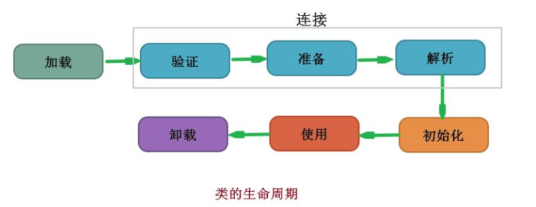

加载、验证、准备、初始化和卸载这五个阶段的顺序是确定的，但解析阶段则不一定，它在某些情况下可以在初始化阶段之后再开始。
虚拟机规范严格规定了有且只有五种情况必须立即对类进行“初始化”：

1. 使用new关键字实例化对象的时候、读取或设置一个类的静态字段的时候，已经调用一个类的静态方法的时候。
2. 使用java.lang.reflect包的方法对类进行反射调用的时候，如果类没有初始化，则需要先触发其初始化。
3. 当初始化一个类的时候，如果发现其父类没有被初始化就会先初始化它的父类。
4. 当虚拟机启动的时候，用户需要指定一个要执行的主类（就是包含main()方法的那个类），虚拟机会先初始化这个类；
5. 使用Jdk1.7动态语言支持的时候的一些情况。

```java
public class Parent {
    static {
        System.out.println("父类加载...");
    }
}

public class Child extends Parent{
    static {
        System.out.println("子类加载...");
    }
    
    public static void main(String[] args) {
        System.out.println("子类运行...");
    }
}

//运行结果：
//父类加载...
//子类加载...
//子类运行...

```

除此之外所有引用类的方式都不会触发初始化称为被动引用，下面是3个被动引用例子：

1. 通过子类引用父类静态字段，不会导致子类初始化
2. 通过数组定义引用类，不会触发此类的初始化

```java
public class SuperClass {
    static {
        System.out.println("SuperClass（父类）被初始化了。。。");
    }
    public static int value = 66;
}

public class Subclass extends SuperClass {
    static {
        System.out.println("Subclass（子类）被初始化了。。。");
    }
}

public class Test1 {

    public static void main(String[] args) {

        // 1:通过子类调用父类的静态字段不会导致子类初始化
        // System.out.println(Subclass.value);//SuperClass（父类）被初始化了。。。
        // 2:通过数组定义引用类，不会触发此类的初始化
        SuperClass[] superClasses = new SuperClass[3];
        // 3:通过new 创建对象,可以实现类初始化，必须把1下面的代码注释掉才有效果不然经过1的时候类已经初始化了，下面这条语句也就没用了。
        //SuperClass superClass = new SuperClass();
    }

}

```

1. 常量在编译阶段会存入调用类的常量池中，本质上并没有直接引用定义常量的类，因此不会触发定义常量的类的初始化。

### 加载

加载过程：

1. 通过类型的完全限定名，产生一个代表该类型的二进制数据流（没有指明从哪里获取、怎样获取，是一个非常开放的平台），加载源包括：**文件（Class文件，Jar文件）、网络、计算生成（代理$Proxy）、由其它文件生成（jsp）、数据库**中；
2. 解析这个二进制数据流为方法区内的运行时数据结构；
3. 创建一个表示该类型的java.lang.Class类的实例，作为方法区这个类的各种数据的访问入口。

### 校验

验证是连接阶段的第一步，这一阶段的目的是为了确保Class文件的字节流中包含的信息符合当前虚拟机的要求，并且不会危害虚拟机自身的安全。从整体上看，验证阶段大致上会完成4个阶段的校验工作：**文件格式、元数据、字节码、符号引用**。可以通过设置参数略过。

### 准备

准备阶段正式为类变量分配内存并设置变量的初始值。这些变量使用的内存都将在方法区中进行分配。*注：这时候进行内存分配的仅包括类变量（被static修饰的变量），而不包括实例变量，实例变量将会在对象实例化时随着对象一起分配在Java堆中。*

初始值通常是数据类型的零值；对于：public static int value = 123，**那么变量value在准备阶段过后的初始值为0而不是123**，这时候尚未开始执行任何java方法，把value赋值为123的动作将在初始化阶段才会被执行。对于：public static final int value = 123;编译时Javac将会为value生成ConstantValue（常量）属性，在准备阶段虚拟机就会根据ConstantValue的设置将value赋值为123。

### 解析

解析阶段是虚拟机将常量池中的符号引用替换为直接引用的过程。解析动作主要针对类或接口、字段、类方法、接口方法、方法类型、方法句柄和调用点限定符7类符号引用进行。

**符号引用**（Symbolic References）： 符号引用以一组符号来描述所引用的目标，符号可以是符合约定的任何形式的字面量，符号引用与虚拟机实现的内存布局无关，引用的目标并不一定已经加载到内存中。
**直接引用**（Direct References）: 直接引用可以是直接指向目标的指针、相对偏移量或是一个能间接定位到目标的句柄。直接引用与虚拟机实现的内存布局相关，引用的目标必定已经在内存中存在。

### 初始化

到了初始化的阶段，才是真正开始执行类中定义的Java程序代码。

- 初始化阶段是执行类构造器`<clinit>()`方法的过程，它是由编译器自动收集类中的所有类变量的赋值动作和静态语句块static{}中的语句合并产生的。静态语句块中只能访问到定义在静态语句块之前的变量，定义在它之后的变量，在前面的静态语句块可以赋值，但不能访问。

```java
public class InitTest1 {
    static {
        i = 0;  //给变量赋值可以正常编译
        System.out.println(i);   //编译器提示：“非法向前引用”
    }
    static int i = 1;
}
```

- 父类中定义的静态语句块要优于子类的变量赋值操作。
- 如果一个类中没有静态语句块，也没有对变量的赋值操作，那么编译器可以不为这个类生产`<clinit>()`方法。
- 虚拟机会保证一个类的`<clinit>()`方法在多线程环境中被正确的加锁、同步，如果多个线程同时去初始化一个类，那么只会有一个线程去执行这个类的`<clinit>()`方法，其他线程都需要阻塞等待，直到活动线程执行`<clinit>()`方法完毕。

### 类加载器

对于任意一个类，都需要由加载它的类加载器和这个类本身一同确立其在Java虚拟机中的唯一性。如果两个类来源于同一个Class文件，只要加载它们的类加载器不同，那么这两个类就必定不相等。

**启动类加载器（Bootstrap ClassLoader）：** 这个类加载器负责将存放在\lib目录中的，或者被-Xbootclasspath参数所指定的路径中的，并且是虚拟机识别的（仅按照文件名识别，如rt.jar，名字不符合的类库即使放在lib目录中也不会被加载）类库加载到虚拟机内存中。**getClassLoader()方法返回null**。

**扩展类加载器（Extension ClassLoader）：** 这个加载器由sun.misc.Launcher$ExtClassLoader实现，它负责加载\lib\ext目录中的，或者被java.ext.dirs系统变量所指定的路径中的所有类库，开发者可以直接使用扩展类加载器。

**应用程序类加载器（Application ClassLoader）：** 这个类加载器由sun.misc.Launcher$AppClassLoader实现。由于这个类加载器是ClassLoader中的getSystemClassLoader()方法的返回值，所以一般也称它为系统类加载器。它负责加载用户类路径（ClassPath）上所指定的类库，开发者可以直接使用这个类加载器，如果应用程序中没有自定义过自己的类加载器，一般情况下这个就是程序中默认的类加载器。

### 双亲委派模型

双亲委派模型要求除了顶层的启动类加载器外，其余的类加载器都应当有自己的父类加载器。这里类加载器之间的父子关系一般不会以继承的关系来实现，而都是使用组合的关系复用父类加载器的代码。

**双亲委派模型的工作过程是：如果一个类加载器收到了类加载的请求，它首先不会自己去尝试加载这个类，而是把这个请求委派给父类加载器去完成，因此所有的加载请求最终都应该传送到顶层的启动类加载器中，只有当父加载器反馈自己无法完成加载请求（它的搜索范围中没有找到所需的类）时，子加载器才会尝试自己去加载。**

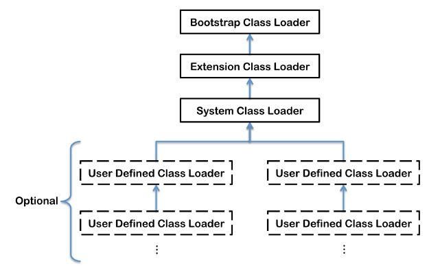

使用双亲委派模型来组织类加载器之间的关系，有一个显而易见的好处就是**java类随着它的类加载器一起具备了一种带有优先级的层次关系**。

双亲委派模型的实现：

```java
protected synchronized Class<?> loadClass(String name, boolean resolve) throws ClassNotFoundException {
    //1 首先检查类是否被加载
    Class c = findLoadedClass(name);
    if (c == null) {
        try {
            if (parent != null) {
             	//2 没有则调用父类加载器的loadClass()方法；
                c = parent.loadClass(name, false);
            } else {
            	//3 若父类加载器为空，则默认使用启动类加载器作为父加载器；
                c = findBootstrapClass0(name);
            }
        } catch (ClassNotFoundException e) {
           //4 若父类加载失败，抛出ClassNotFoundException 异常后
            c = findClass(name);
        }
    }
    if (resolve) {
        //5 再调用自己的findClass() 方法。
        resolveClass(c);
    }
    return c;
}
```

java.lang.ClassLoader 的 loadClass() 实现了双亲委派模型的逻辑，因此自定义类加载器一般不去重写它，但是需要重写 findClass() 方法。

## 7.虚拟机字节码执行引擎

### 运行时的栈帧结构

栈帧存储了方法的**局部变量表、操作数栈、动态连接和方法返回地址**等信息。每一个方法从调用开始至执行完成的过程，都对应着一个栈帧在虚拟机栈里面从入栈到出栈的过程。

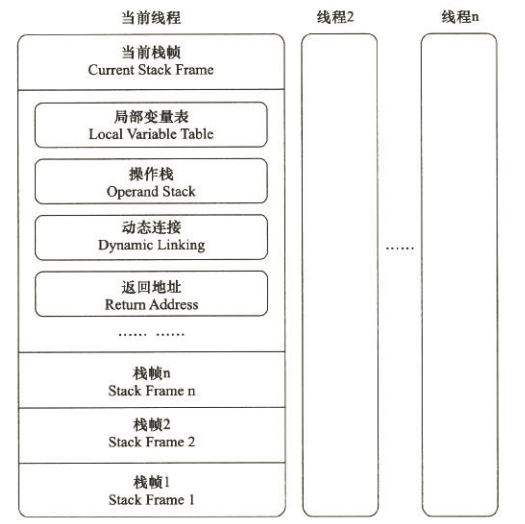

### 局部变量表

局部变量表是一组变量值存储空间，用于存放方法参数和方法内定义的局部变量。局部变量表的容量以**变量槽（Variable Slot）为最小单位。** 一个Slot可以存放一个32位以内（boolean、byte、char、short、int、float、reference和returnAddress）的数据类型，reference类型表示一个对象实例的引用。对于64位的数据类型（long和double），虚拟机会以高位对齐的方式为其分配两个连续的Slot空间，是线程安全的。

**为了节省栈帧空间，局部变量Slot可以重用**，方法体中定义的变量，其作用域并不一定会覆盖整个方法体。如果当前字节码PC计数器的值超出了某个变量的作用域，那么这个变量的Slot就可以交给其他变量使用。这样的设计会带来一些额外的副作用，比如：在某些情况下，Slot的复用会直接影响到系统的收集行为。

### 操作数栈

操作数栈（Operand Stack）是一个后入先出栈。当一个方法执行开始时，这个方法的操作数栈是空的，在方法执行过程中，会有各种字节码指令往操作数栈中写入和提取内容，也就是出栈/入栈操作。

### 动态连接

每个栈帧都包含一个指向运行时常量池中该栈帧所属方法的引用，持有这个引用是为了支持方法调用过程中的动态连接；

### 方法返回地址

方法退出的过程实际上等同于把当前栈帧出栈，因此退出时可能执行的操作有：恢复上层方法的局部变量表和操作数栈，把返回值（如果有的话）压入调用者栈帧的操作数栈中，调整PC计数器的值以指向方法调用指令后面的一条指令等。

### 方法调用–解析

方法调用并不等同于方法的执行，方法调用阶段的唯一任务就是确定被调用方法的版本（继承和多态）。

“编译期可知，运行期不可变”的方法（**静态方法和私有方法**），在类加载的解析阶段，会将其符号引用转化为直接引用（入口地址）。这类方法的调用称为解析（Resolution）

### 方法调用–分派

**静态分派**最典型的应用就是方法重载。
在运行期根据实际类型确定方法执行版本的分派过程称为**动态分派**。最典型的应用就是方法重写。

**Java语言的静态分派属于多分派类型，动态分派属于单分派类型。**